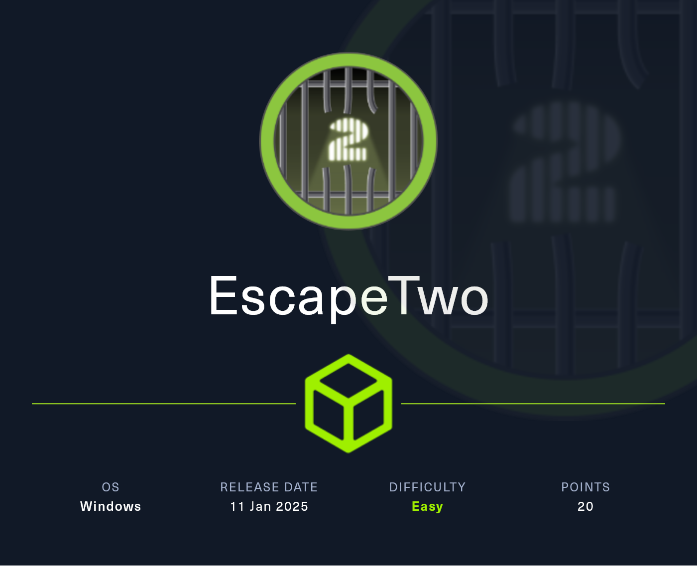
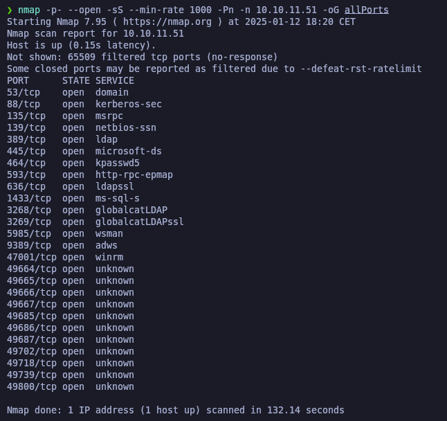

# EscapeTwo

<figure><figcaption></figcaption></figure>

## Reconnaissance

Realizaremos un reconocimiento con **nmap** para ver los puertos que están expuestos en la máquina **EscapeTwo**.

```bash
nmap -p- --open -sS --min-rate 1000 -Pn -n 10.10.11.51 -oG allPorts
```

<figure><figcaption></figcaption></figure>

<figure><figcaption></figcaption></figure>
