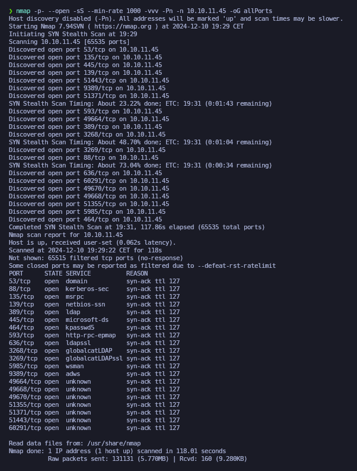

# Vintage

<figure><figcaption></figcaption></figure>

## Reconnaissance

Proceremos a realizar un reconocimiento con **nmap** para ver los puertos que están expuestos en la máquina **Vintage**.

```bash
nmap -p- --open -sS --min-rate 1000 -vvv -Pn -n 10.10.11.45 -oG allPorts
```

<figure><figcaption></figcaption></figure>

<figure><figcaption></figcaption></figure>
